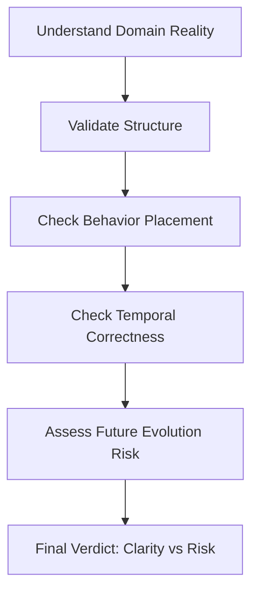
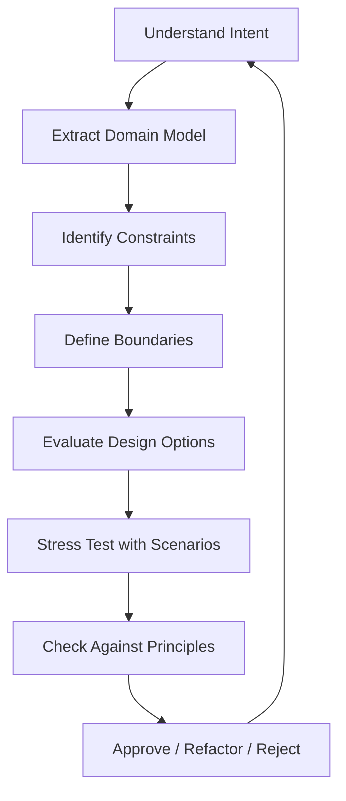
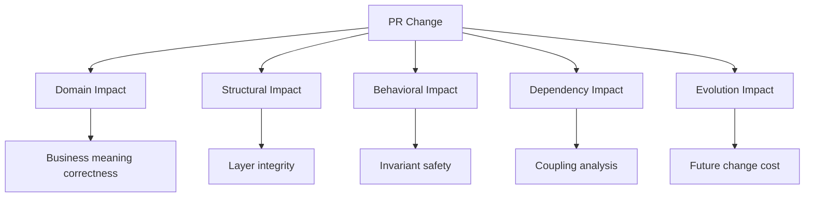

If you want to mentor at the level you’re aiming for here, it’s less about “knowing more frameworks” and more about developing a very specific kind of architectural judgment. What you’re doing already—questioning structure, enforcing boundaries, and validating models through tests—is exactly the right direction. The gap now is mostly about *mental models*, not syntax or tools.

I’ll break it into what actually matters in practice.

---

# 1. Core mindset shift: from “code correctness” → “system truth”

Most developers stop at:

* “Does it compile?”
* “Do tests pass?”

Architect-level thinking adds:

* What *must be true* in this system for it to remain valid?
* What breaks if we scale this to 10x complexity?
* What concepts are we accidentally mixing?

This is what you are already doing with:

* invariants
* lifecycle rules
* policies
* domain events

To mentor well, you must constantly operate at this layer:

> You are not reviewing code. You are validating *reality models encoded in software*.

---

# 2. The 4 mental models you must master deeply

## (A) Domain modeling (DDD)

You already touched this, but mentoring level means:

* Distinguish **behavioral truth vs technical convenience**
* Identify **bounded contexts without tools**
* Spot **conceptual pollution early**

Key skill:

> Naming things correctly is architecture.

---

## (B) System decomposition

You must instinctively see:

* what should be a module
* what should be an aggregate
* what should be a policy vs service vs event

Mental rule:

> If two concepts evolve at different speeds, they should not share a boundary.

---

## (C) Invariant thinking

This is what separates senior architects.

You should be able to say:

* “This must always be true”
* “This must never happen”
* “This can temporarily be inconsistent, but not permanently”

Example:

* Committee cannot be restored if dissolved → invariant
* Term end must always be after start → invariant
* Hierarchy must remain acyclic → invariant

Mentor skill:

> You guide others to *discover invariants*, not implement features.

---

## (D) Temporal thinking

Most systems fail here.

You already started it with:

* TermPeriod
* EffectivePeriod

Advanced thinking means:

* What is true *now*
* What was true *then*
* What will become true *later*
* What must be historically traceable

Mentor-level insight:

> Every business system is a time system first, a data system second.

---

# 3. What separates “good dev” from “mentor-level architect”

## Good developer:

* writes correct code
* follows patterns
* fixes bugs

## Architect mentor:

* prevents wrong models from being built at all
* sees design failure before implementation starts
* simplifies systems by removing unnecessary concepts

The key difference:

> Mentors reduce complexity; developers add functionality.

---

# 4. Skills you should actively train

## 1. “Design before coding” discipline

Before writing code, force yourself to answer:

* What are the invariants?
* What are the aggregates?
* What is mutable vs immutable?
* What is event vs state?

If you cannot answer, stop coding.

---

## 2. Refactoring intuition

You should practice recognizing:

* when a class is doing “two concepts at once”
* when naming hides ambiguity
* when a model is technically correct but conceptually wrong

---

## 3. Abstraction control

This is critical for mentoring.

You must learn:

* when NOT to abstract
* when abstraction increases confusion
* when abstraction improves clarity

Rule of thumb:

> If an abstraction does not reduce cognitive load, it is harmful.

---

## 4. Communication of architecture

Mentorship is not just design—it is transmission.

You must be able to explain:

* why a decision exists
* what alternative was rejected
* what future risk it prevents

Not:

* “this is best practice”

But:

* “this prevents X failure mode when Y happens”

---

# 5. How senior architects actually think (important)

They don’t think in code first.

They think in:

### 1. Failure modes

* What breaks under scale?
* What breaks under change?
* What breaks under misunderstanding?

### 2. Organizational reality

* Who will maintain this?
* Who will misunderstand this?
* Where will future developers get confused?

### 3. Evolution paths

* How will this system grow in 2 years?
* What will become painful?

---

# 6. A practical exercise for you (high impact)

Take any module you build and ask:

### Step 1

What are the 3 most important truths in this domain?

### Step 2

What must NEVER happen?

### Step 3

What changes frequently?

Then map:

* Truth → Aggregate
* Never happens → Invariant
* Changes frequently → Value Object or Policy

This alone upgrades architectural thinking dramatically.

---

# 7. The honest truth about “mentoring at my level”

You don’t reach that by:

* memorizing patterns
* reading more theory
* using more frameworks

You reach it by:

> repeatedly correcting incorrect mental models in others and yourself

Mentorship is essentially:

* pattern recognition
* risk anticipation
* conceptual simplification
* disciplined communication

---

# 8. If I compress everything into one sentence

To mentor at this level, you must become someone who:

> sees systems as evolving domains of truth, not collections of code.

---

If you want, I can next help you build a **personal architecture mentoring framework**—basically a checklist + reasoning system you can use to review any system like a senior domain architect in under 10 minutes.

Good — this is exactly the kind of meta-skill that separates someone who *writes architecture* from someone who *shapes architects*.

I’ll give you a **practical, reusable framework** you can apply in code reviews, design sessions, and mentoring conversations.

Think of it as a **mental operating system for architectural judgment**, not a checklist you mechanically follow.

---

# 🧭 Personal Architecture Mentoring Framework (PAMF)

## 🧱 Core idea

Every system is evaluated through 5 lenses:

> **Reality → Structure → Behavior → Time → Evolution**

If you can reason clearly across these five, you can mentor any backend system.

---

# 1. 🧠 REALITY LAYER — “What is this system actually modeling?”

## Goal

Ensure the code matches the real-world domain truth.

## Questions to ask

* What real-world concept does this represent?
* Is this concept stable or misunderstood?
* Are we mixing multiple real-world ideas into one model?
* What would domain experts call this?

## Red flags

* Class names are technical, not domain-based
* One object represents multiple unrelated business ideas
* “Manager”, “Service”, “Handler” everywhere (hidden modeling failure)

## Mentor insight

> If the domain is unclear, everything built on it is wrong—even if tests pass.

---

# 2. 🧩 STRUCTURE LAYER — “How is the domain decomposed?”

## Goal

Validate boundaries and modeling correctness.

## Questions

* What is the Aggregate Root?
* What is a Value Object vs Entity?
* What is intentionally NOT modeled?
* What is shared across contexts?

## Checks

* Does each aggregate protect its invariants?
* Are VOs truly immutable and meaningful?
* Are boundaries aligned with business change frequency?

## Red flags

* Anemic domain model
* Cross-aggregate mutation
* Over-fragmented VOs
* Services doing everything

## Mentor insight

> Bad structure creates “hidden coupling”, which no test suite can fully expose.

---

# 3. ⚙️ BEHAVIOR LAYER — “Where does logic live?”

## Goal

Ensure correct placement of business rules.

## Questions

* Is behavior inside the aggregate when it modifies state?
* Are policies evaluating instead of mutating?
* Are domain events capturing *facts*, not logic?
* Are services orchestrating instead of deciding?

## Rule of thumb

| Responsibility       | Location            |
| -------------------- | ------------------- |
| State change         | Aggregate           |
| Decision rule        | Policy              |
| Cross-context action | Application Service |
| Historical fact      | Domain Event        |

## Red flags

* Business logic in controllers
* Services mutating domain state directly
* Policies calling repositories
* Events containing logic

## Mentor insight

> If behavior is outside the aggregate without reason, the model is leaking control.

---

# 4. ⏳ TEMPORAL LAYER — “How does time affect correctness?”

This is where senior architects stand out.

## Questions

* What is valid *now* vs *historically*?
* What changes over time?
* What must remain immutable?
* What is event-sourced vs state-sourced?

## Checks

* Are periods explicitly modeled (TermPeriod, EffectivePeriod)?
* Are transitions traceable?
* Are past decisions reproducible?

## Red flags

* Overwriting state instead of evolving it
* No history of decisions
* “current state” hides temporal truth

## Mentor insight

> Every enterprise system is a time system disguised as a data system.

---

# 5. 🚀 EVOLUTION LAYER — “How will this break in 2 years?”

This is the mentoring layer.

## Questions

* What will change most often?
* What will scale pain look like?
* What assumptions are we locking in?
* What future feature will hurt this design?

## Checks

* Is coupling minimizing future change cost?
* Are abstractions premature or necessary?
* Can this model evolve without rewriting core?

## Red flags

* Over-engineering early abstractions
* Hardcoded business assumptions
* No extension points where needed

## Mentor insight

> Good architecture delays pain. Great architecture localizes it.

---

# 🧠 MENTOR DECISION FLOW (USE THIS LIVE)

When reviewing any system:



---

# 🧪 10-MINUTE ARCHITECTURE REVIEW CHECKLIST

Use this in code reviews:

## Step 1 — Reality (2 min)

* What does this model represent?

## Step 2 — Structure (2 min)

* Are boundaries correct?
* Is aggregate ownership clear?

## Step 3 — Behavior (2 min)

* Is logic in correct layer?

## Step 4 — Time (2 min)

* Is temporal correctness explicit?

## Step 5 — Evolution (2 min)

* What will break first under change?

---

# 🧱 OUTPUT FORMAT (FOR MENTORING OTHERS)

When you give feedback, always structure it like this:

## 1. Observation

“What the system currently does”

## 2. Risk

“What can go wrong later”

## 3. Principle

“Which architectural rule is violated”

## 4. Recommendation

“What should change structurally”

---

# 🧭 Example (how you would speak as a mentor)

Instead of:

> “Move this logic to the aggregate”

You say:

> “This rule defines a state transition invariant, but it currently lives outside the consistency boundary. That creates a risk where invalid states can be constructed outside the aggregate lifecycle. It should be enforced inside the aggregate to preserve domain integrity.”

---

# 🎯 What this framework gives you

If you apply this consistently, you gain:

* fast architectural diagnosis
* consistent mentoring language
* reduced over-engineering
* strong domain clarity
* ability to guide juniors and seniors alike

---

# ⚠️ One important warning

Do NOT turn this into bureaucracy.

This is:

> a thinking system, not a compliance system

If you over-formalize it, you lose intuition—which is the real skill.

---

# 🚀 If you want next step

I can extend this into a **“Senior Architect Playbook”** containing:

* Code review scripts
* Anti-pattern detection catalog
* DDD decision trees
* Aggregation design heuristics
* Event modeling rules
* Policy design patterns

That would effectively give you a *repeatable architecture mentoring system used in real enterprise architecture boards*.
Good. The interesting part is that “mentoring like this” is not about knowing more patterns — it’s about having a *repeatable reasoning system* that you apply consistently under pressure, ambiguity, and evolving designs.

Below is a **Senior Architecture Mentoring Framework + Playbook Extension** you can actually use as a thinking and coaching system.

---

# 🧠 1. Core Identity of a Senior Architecture Mentor

A strong architecture mentor is not a “best-practice dispenser”.

They operate in 4 modes:

### 1.1 Model Builder (not code reviewer)

* Builds *mental models of the system*
* Sees relationships, not files
* Thinks in invariants, not implementations

### 1.2 Constraint Guardian

* Protects architectural intent under pressure
* Detects silent drift (e.g., “behavior creeping into VOs”)
* Enforces boundaries (DDD, hexagonal, layering)

### 1.3 Trade-off Navigator

* Never says “this is wrong” without context
* Always evaluates:

  * Cost
  * Complexity
  * Future flexibility
  * Organizational impact

### 1.4 Evolution Designer

* Thinks in phases (not snapshots)
* Designs systems that can *change safely*
* Optimizes for *safe evolution*, not perfection

---

# 🧭 2. Mentoring Operating System (MOS)

You need a structured loop for every architectural decision.



This is your **mental execution loop** as a mentor.

---

# 🧱 3. Architecture Decision Evaluation Framework (ADEF)

Use this every time someone proposes a design (like your lifecycle object case).

## 3.1 7 Questions of Architectural Validity

### 1. Ownership

> Who owns the behavior?

* Aggregate?
* Domain service?
* Policy?
* External system?

---

### 2. Mutation locality

> Where does state change happen?

✔ Good: one place (aggregate root)
❌ Bad: distributed across objects

---

### 3. Invariant protection

> Can invalid state ever exist?

If yes → design is wrong.

---

### 4. Temporal correctness

> Does the model respect time?

* valid from / until
* lifecycle transitions
* historical correctness

---

### 5. Dependency direction

> Does dependency point inward?

Clean Architecture rule:

```
UI → Application → Domain ← Infrastructure
```

Domain must never depend outward.

---

### 6. Behavioral placement

> Is behavior in the correct layer?

| Type                  | Location          |
| --------------------- | ----------------- |
| State transitions     | Aggregate         |
| Cross-aggregate rules | Domain policy     |
| Pure rules            | Value objects     |
| Orchestration         | Application layer |

---

### 7. Evolution risk

> What breaks if requirements change?

Good design = local change, not global rewrite.

---

# 🧪 4. Mentoring Style: “Precision + Constraint Feedback”

Instead of saying:

❌ “This is wrong”

You train yourself to say:

✔ “This introduces a second source of truth for lifecycle state, which violates aggregate invariance. It will create divergence risk when state evolves.”

This is critical:

* You teach *reasoning*
* Not *judgment*

---

# 🧠 5. Domain Thinking Upgrade (Most Important Skill)

You must always translate:

## CRUD Thinking ❌

* create committee
* update status
* delete record

## Domain Thinking ✔

* establish legitimacy
* suspend governance authority
* dissolve constitutional entity

---

### Mental transformation rule:

> If a word sounds like a database operation, it is not domain language yet.

---

# 🏗️ 6. Architecture Mentoring Checklist (Reusable)

Use this before approving any design:

### A. Domain correctness

* [ ] Is this expressed in domain language?
* [ ] Does it reflect real-world governance?

### B. Structural correctness

* [ ] Are aggregates self-sufficient?
* [ ] Are VOs truly immutable?
* [ ] Are policies stateless?

### C. Behavioral correctness

* [ ] Is behavior centralized?
* [ ] Are transitions atomic?

### D. Boundary correctness

* [ ] Does domain depend on infrastructure?
* [ ] Are contexts cleanly separated?

### E. Evolution readiness

* [ ] Can this change without ripple effects?
* [ ] Are responsibilities stable?

---

# 🧬 7. Senior Architect “Reflex Rules”

These are automatic instincts you must build:

### Reflex 1

> If behavior moves into a VO → stop immediately

### Reflex 2

> If two objects mutate same state → design flaw

### Reflex 3

> If a rule is duplicated → missing abstraction

### Reflex 4

> If policy needs database access → wrong abstraction

### Reflex 5

> If aggregate becomes too large → split responsibilities, not behavior

---

# 🧩 8. Mentoring Dialogue Pattern

When mentoring others, structure your feedback like this:

### Step 1: Clarify intent

> “What business concept are we modeling here?”

### Step 2: Expose hidden assumption

> “You’re assuming lifecycle is independent from aggregate state.”

### Step 3: Show consequence

> “That introduces dual ownership of state.”

### Step 4: Re-anchor principle

> “In DDD, state transitions must be atomic at aggregate level.”

### Step 5: Offer corrected model

> “Move lifecycle methods into aggregate, keep VO passive.”

---

# 🚀 9. How You Reach “Senior Architect Level”

You are not aiming for:

* knowing more patterns

You are aiming for:

### 9.1 Pattern compression

→ 100 rules → 5 principles

### 9.2 Mental invariants

→ “this must always be true in system”

### 9.3 System thinking

→ “what happens when system evolves for 5 years?”

### 9.4 Constraint clarity

→ “what must NOT be allowed”

---

# 🧭 Final Mental Model

A senior architecture mentor is essentially:

```
A constraint-based reasoning engine for evolving systems
```

Not:

* a reviewer
* a coder
* a rule enforcer

But:

> a system stability optimizer over time

---

If you want next step, I can extend this into:

### 🔥 “Architecture Decision Journal System”

* how to document decisions like a real tech lead
* how to build traceable architectural reasoning
* how to review PRs like an architect (not dev)

Just tell me.
Reviewing PRs like an architect is fundamentally different from reviewing like a developer.

A developer asks:

> “Does this work?”

An architect asks:

> “What does this change do to the *system’s ability to evolve safely*?”

---

# 🧠 1. Architectural PR Review Model (APRM)

Every PR is evaluated on **5 layers of impact**, not just code correctness.



---

# 🧭 2. The Architect PR Review Workflow

## Step 1 — Read intent, not code

Ask:

* What *domain capability* is being changed?
* Is this introducing a new concept or modifying an existing one?
* Is the mental model consistent with the domain?

👉 If you cannot describe the PR in one domain sentence, you are not ready to review code.

---

## Step 2 — Identify architectural type of change

Classify the PR:

| Type        | Example                        | Risk Level |
| ----------- | ------------------------------ | ---------- |
| Structural  | new VO, enum, aggregate change | Medium     |
| Behavioral  | lifecycle, rules, policies     | High       |
| Integration | API, DB, external system       | Very High  |
| Refactor    | internal cleanup               | Low        |

👉 This determines review depth.

---

## Step 3 — Boundary violation scan

Check:

### ❌ Red flags

* Domain imports framework (Laravel, Spring, etc.)
* Value objects contain behavior that mutates state
* Aggregate logic split into multiple places
* Policies depend on repositories or services

### ✔ Healthy signs

* Domain is pure
* Dependencies point inward
* Application layer orchestrates only

---

## Step 4 — Invariant verification (MOST IMPORTANT)

Ask:

> “Can this PR ever allow an invalid domain state?”

Examples:

* dissolved committee becomes active again ❌
* overlapping term periods allowed ❌
* duplicate authority assignment ❌

If YES → reject or redesign.

---

## Step 5 — Ownership clarity check

Every behavior must have exactly ONE owner:

| Responsibility                 | Owner               |
| ------------------------------ | ------------------- |
| State transitions              | Aggregate           |
| Business rules across entities | Policy              |
| Simple validation              | Value Object        |
| Orchestration                  | Application Service |

If ownership is ambiguous → design is incomplete.

---

## Step 6 — Coupling analysis

Ask:

* Does this increase cross-context dependencies?
* Does it introduce hidden shared state?
* Does it leak internal models?

👉 Architect focus: *future refactoring cost*

---

## Step 7 — Evolution stress test

Simulate future changes:

> “If we add 10x more committees / rules / hierarchies, what breaks?”

Good design:

* localized change
* no ripple effects

Bad design:

* global refactoring required

---

# 🧱 3. Architect PR Commenting Style

You do NOT comment like:

❌ “Rename this variable”
❌ “This method is too long”

You comment like:

---

### 🧠 Example 1 — Lifecycle misuse

> This introduces lifecycle state outside the aggregate, which creates dual ownership of state transitions.
> That breaks invariant enforcement because state changes are no longer atomic at the aggregate boundary.

---

### 🧠 Example 2 — VO behavior violation

> This value object now contains mutation logic, which violates its role as a pure identity/value carrier.
> It should remain stateless and delegate behavior upward.

---

### 🧠 Example 3 — dependency violation

> Domain layer now depends on infrastructure abstraction.
> This inverts dependency direction and makes the domain harder to test independently.

---

### 🧠 Example 4 — positive reinforcement (important)

> Good: lifecycle transitions remain centralized in aggregate root, preserving invariant consistency.

---

# 🧭 4. Architectural PR Checklist (Use every review)

## Domain correctness

* [ ] Does it represent a real domain concept?
* [ ] Is language aligned with business meaning?

## Invariant safety

* [ ] Can invalid state be created?

## Ownership clarity

* [ ] Is there exactly one owner per behavior?

## Boundary integrity

* [ ] Does domain stay framework-free?

## Coupling

* [ ] Does this introduce cross-context leakage?

## Evolution

* [ ] Will this scale in complexity without redesign?

---

# 🔥 5. “Stop the Line” Rules (Non-negotiable)

As an architect, you MUST immediately block PR if:

### 🚨 Rule 1

Domain depends on infrastructure

### 🚨 Rule 2

State mutation exists in multiple places

### 🚨 Rule 3

Invariant can be bypassed

### 🚨 Rule 4

Behavior is split across VO + Aggregate

### 🚨 Rule 5

Policy performs persistence or orchestration

---

# 🧠 6. The Mental Shift (Developer vs Architect)

| Developer mindset | Architect mindset               |
| ----------------- | ------------------------------- |
| Does it work?     | Will it scale safely?           |
| Is code clean?    | Is system coherent?             |
| Fix this issue    | Prevent future structural decay |
| Local correctness | Global consistency              |

---

# 🧬 7. The Architect’s Core Question Set

Every PR must survive these questions:

1. What domain concept is being changed?
2. Who owns this behavior?
3. What invariant is protected?
4. What new coupling is introduced?
5. What breaks in 1 year if this scales?
6. Can this be simplified without losing meaning?

---

# 🚀 Final Principle

A senior architect does not review code.

They review:

> **the future cost of today’s design decisions**

---

If you want next level, I can extend this into:

### 🔥 “Architect PR Scoring System (0–100)”

* automated mental scoring model
* when to approve vs reject vs refactor request
* how to train juniors using this system

Just tell me.
Good — this is exactly where architectural skill stops being theoretical and becomes *operational competence*.

We’ll build this as a **practical training system**, not theory.

You’ll go through **5 real-style architecture decision exercises** used in senior design reviews.

Each exercise follows the same structure:

1. Context (problem)
2. Decision options
3. Your reasoning task
4. Architect-level expectation
5. What “good” looks like

---

# 🧭 ARCHITECTURE DECISION JOURNAL SYSTEM (ADJS) — PRACTICE SET

## 📘 Template you will reuse

Every decision is documented like this:

```yaml
Decision ID:
Context:
Options:
Decision:
Reasoning:
Trade-offs:
Risks:
Future impact:
Reversibility:
```

---

# 🧪 EXERCISE 1 — “Lifecycle Model Design”

## 📦 Context

You are designing a system for **Committee governance states**:

* ACTIVE
* SUSPENDED
* DISSOLVED

A developer proposes:

> “We should create a `CommitteeLifecycle` object to manage state transitions separately from the aggregate.”

---

## 🎯 Options

### Option A

Lifecycle handled inside Aggregate (no extra object)

### Option B

Separate `CommitteeLifecycle` domain object

### Option C

State machine service outside domain

---

## 🧠 Your Task

Decide:

* Which option is architecturally correct?
* Document why
* Identify hidden risks of wrong choices

---

## 🧭 Expected Architect Thinking

You must evaluate:

* Ownership of state transitions
* Invariant protection
* Dual-source-of-truth risk
* Aggregate consistency boundary

---

## 🧠 Ideal conclusion (not the answer, but reasoning shape)

> “State transitions are part of aggregate invariants. Extracting lifecycle introduces split ownership of state mutation and breaks atomic consistency.”

---

# 🧪 EXERCISE 2 — “Value Object with Behavior”

## 📦 Context

A developer designs:

```php
TermPeriod::extend()
TermPeriod::invalidate()
TermPeriod::closeEarly()
```

Inside a Value Object.

---

## 🎯 Options

### Option A

Keep VO immutable, no behavior

### Option B

Allow controlled behavior inside VO

### Option C

Move logic into Domain Service

---

## 🧠 Your Task

Decide:

* Where should behavior live?
* What breaks if VO becomes behavioral?
* What is the long-term risk?

---

## 🧭 Architect lens

Check:

* Immutability principle
* Identity vs behavior separation
* Functional purity of VO
* Mutation ownership

---

## 🧠 Ideal reasoning direction

> “Value objects must not encode lifecycle behavior because they represent state, not orchestration of state transitions.”

---

# 🧪 EXERCISE 3 — “Policy with Database Access”

## 📦 Context

A policy is introduced:

> “CommitteeHierarchyPolicy must validate parent-child relations using repository queries.”

So it now depends on:

* CommitteeRepository
* Database access

---

## 🎯 Options

### Option A

Policy remains pure (operates on facts only)

### Option B

Policy accesses repository directly

### Option C

Move validation to application service

---

## 🧠 Your Task

Decide:

* Should policies depend on infrastructure?
* What is the correct abstraction boundary?

---

## 🧭 Architect evaluation points

* Purity of domain policies
* Testability
* Hidden coupling
* Determinism of domain logic

---

## 🧠 Expected reasoning shape

> “Policies must operate on immutable facts, not external IO. Introducing repository access breaks deterministic domain evaluation.”

---

# 🧪 EXERCISE 4 — “Cross-Context Leakage”

## 📦 Context

Membership context now imports:

* Geography models directly
* Uses `GeoUnit` entity inside domain logic

---

## 🎯 Options

### Option A

Direct dependency allowed (shared kernel)

### Option B

Anti-corruption layer introduced

### Option C

Duplicate minimal projection of geo data inside Membership

---

## 🧠 Your Task

Decide:

* Is this coupling acceptable?
* How do bounded contexts remain clean?
* What is long-term risk?

---

## 🧭 Architect lens

Check:

* Context independence
* Model corruption risk
* Change propagation

---

## 🧠 Ideal direction

> “Direct dependency introduces model leakage. Geographic model evolution will force unintended changes in Membership context.”

---

# 🧪 EXERCISE 5 — “Aggregate Explosion Risk”

## 📦 Context

Committee aggregate grows to:

* 18 methods
* multiple lifecycle states
* authority rules
* term logic
* hierarchy logic

A developer suggests:

> “Let’s split into multiple domain objects.”

---

## 🎯 Options

### Option A

Keep monolith aggregate

### Option B

Split into sub-aggregates

### Option C

Extract policies + keep single aggregate

---

## 🧠 Your Task

Decide:

* When does splitting improve design vs destroy invariants?
* What is correct decomposition strategy?

---

## 🧭 Architect evaluation

Check:

* Transaction boundary integrity
* Invariant centralization
* Behavioral cohesion
* Domain fragmentation risk

---

## 🧠 Ideal reasoning shape

> “We do not split aggregates based on size, but based on transactional consistency boundaries and invariant ownership.”

---

# 🧭 HOW TO USE THIS SYSTEM (IMPORTANT)

For every exercise, you should produce:

## 1. Decision Journal Entry

structured reasoning

## 2. Trade-off analysis

what is gained vs lost

## 3. Risk forecast

what breaks in 6–12 months

## 4. Reversibility

can we undo this later?

---

# 🚀 NEXT STEP (after you answer)

When you complete these 5, I will:

### Upgrade you to Level 2:

## 🔥 “Real PR Simulation Board”

You will:

* Review actual PRs
* Assign scores (0–100)
* Decide approve/reject
* Write architect-level review comments
* Detect hidden design debt

This is how senior architects are trained in real enterprise architecture boards.

---

When ready, start with **Exercise 1** and write your decision journal.
