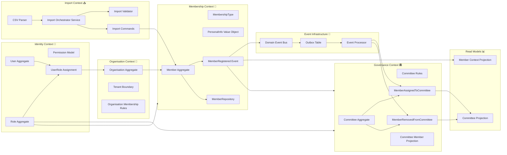
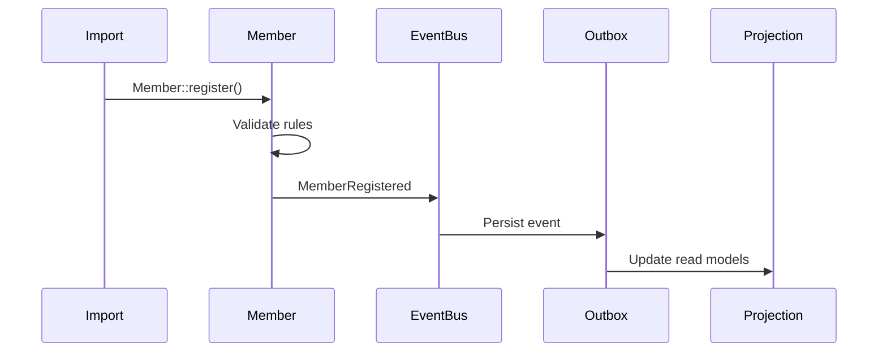
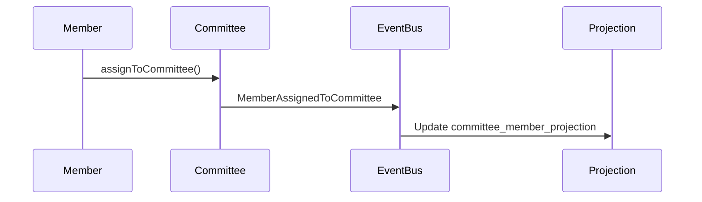

Below is the **final bounded context map** of your system, structured as a **DDD-aligned modular ecosystem** with clear ownership, data flow direction, and event-driven boundaries.

---

# 🧭 1. High-Level Bounded Context Map (Final Architecture)



---

# 🧠 2. Context Responsibilities (Clean Separation)

## 🔐 Identity Context (NEW — CRITICAL)

Owns:

* Authentication (User)
* Roles (Chair, Secretary, Admin, Member)
* Permissions (RBAC/ABAC)
* User-Organisation relationships

👉 It answers:

> “What can this user do?”

---

## 🏢 Organisation Context

Owns:

* Organisation structure
* Tenant isolation rules
* Membership eligibility rules
* Org-level policies

👉 It answers:

> “Where does this user belong?”

---

## 👤 Membership Context (CORE DOMAIN)

Owns:

* Member aggregate
* Membership lifecycle
* MembershipType
* PersonalInfo
* MemberRegistered event

👉 It answers:

> “Is this person a member and in what state?”

---

## 🏛 Governance Context

Owns:

* Committee aggregate
* Committee membership rules
* Role inside committee (CHAIR, SECRETARY, MEMBER)
* Committee projections

👉 It answers:

> “How does governance operate?”

---

## 📥 Import Context (ORCHESTRATION ONLY)

Owns:

* CSV parsing
* Validation
* Import orchestration
* Command translation

👉 It answers:

> “How do external datasets become domain commands?”

❗ It does NOT own business logic.

---

## 📊 Read Model Layer (CQRS)

Owns:

* Denormalized projections
* UI optimized data
* CommitteeMemberProjection
* MemberContextProjection

👉 It answers:

> “How fast can UI read data?”

---

## 📡 Event Infrastructure

Owns:

* Outbox table
* Event processor
* Domain event dispatching

👉 It ensures:

> “No event is ever lost”

---

# 🔄 3. Critical Event Flow (System Backbone)

## Membership creation flow



---

## Committee assignment flow



---

# 🧩 4. Key Architectural Insight (VERY IMPORTANT)

## Before (your current system)

```yaml
System type:
  "Database-centric procedural system"

Characteristics:
  - DB writes everywhere
  - weak boundaries
  - partial domain usage
```

---

## After (target system)

```yaml
System type:
  "Event-driven modular DDD ecosystem"

Characteristics:
  - domain owns behavior
  - events are source of truth
  - import is just orchestration
  - UI reads projections only
```

---

# 🚨 5. Hidden Architectural Problem You Just Solved

You now clearly separate:

## ❌ WRONG (what you had before)

* Import = business logic
* DB = source of truth
* Roles = scattered
* Member = ambiguous entity

---

## ✅ CORRECT (final model)

| Concept                       | Owner              |
| ----------------------------- | ------------------ |
| Identity (roles, permissions) | Identity Context   |
| Membership lifecycle          | Membership Context |
| Committee structure           | Governance Context |
| Data ingestion                | Import Context     |
| UI data                       | Projection Layer   |

---

# 🧠 6. The Most Important Improvement You Achieved

You are now moving from:

> ❌ “Feature-based architecture”

to:

> ✅ “Domain ecosystem architecture”

This is the real shift from:

* CRUD system
* to
* domain-driven platform

---

# 🚀 7. What You Can Build Next (Very Important)

Now that architecture is stable, you can safely implement:

## 1. Identity Context (HIGH PRIORITY)

* Chair assignment rules
* Secretary logic
* Role inheritance

## 2. Committee Governance Rules Engine

* voting rights
* quorum rules
* decision lifecycle

## 3. Member Forum (Slack/Matrix integration)

* event-based messaging
* committee scoped channels

## 4. Advanced Import (now safe)

* validation UI
* preview mode
* dry-run simulation

---

# 🧭 Final Summary

```yaml
SYSTEM STATE:
  Architecture: FULL DDD (multi-context)
  Event model: ACTIVE
  CQRS: IMPLEMENTED
  Governance: STABLE
  Membership: STABLE
  Import: NEEDS REFACTOR (now safe to fix properly)
```

---

If you want next step, I recommend:

> 🔥 “Design Identity Context (Roles + Committee Authority Model)”

Because this will unlock:

* Chair rules
* voting power
* committee hierarchy
* governance legitimacy model

Just say 👍
