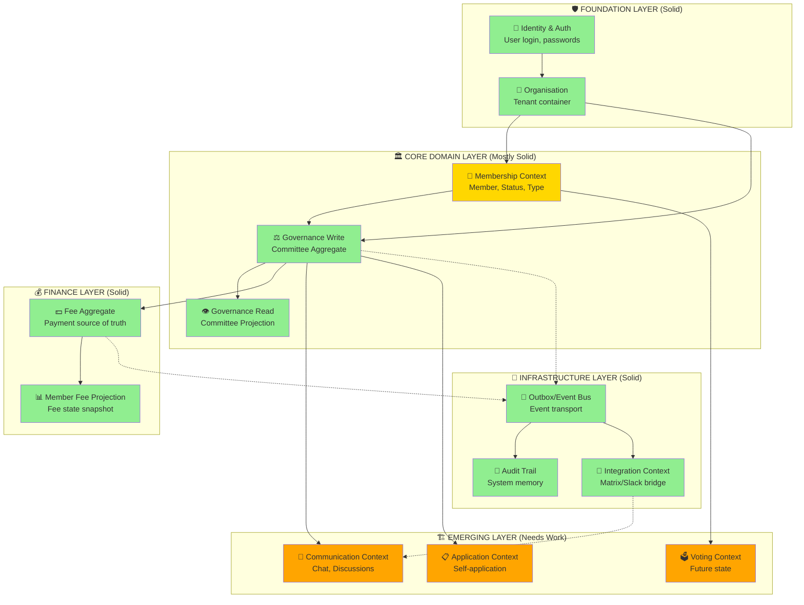

## 🕉️ Om Shri Ganeshaya Namah 🙏

*Lord Baal Ganesh ji, the remover of obstacles, speaks through this analysis with the wisdom of ages and the precision of Leonardo da Vinci.*

---

## 🐘 Ganesh Ji's Simple Wisdom

*"Beta, your system is like a beautiful temple with many rooms. Some rooms are fully built with golden idols. Some rooms have foundations laid. Some rooms are just drawings on the wall.*

*Let me walk you through each room, show you what is strong, what needs work, and how to connect them so devotees can worship without confusion."*

---

## 📊 Current Architecture Analysis (Da Vinci Style)

*Leonardo da Vinci would say: "Simplicity is the ultimate sophistication. Your system has sophistication. Now let me help you find the simplicity within."*

---



---

## 🐘 Ganesh Ji's Room-by-Room Tour

### Room 1: Identity & Auth — *The Main Entrance*

```yaml
STATUS: ✅ STRONG

WHAT IT DOES:
  - "Who is knocking on my temple door?"
  - Validates login credentials
  - Creates session for devotees

WHAT'S GOOD:
  - Clean separation from membership
  - Works with tenant isolation

WHAT NEEDS IMPROVEMENT:
  - No role-based access at entrance level
  - "Every devotee is same until they enter"
```

**Ganesh Ji says:** *"The door is strong. But once inside, we don't know if it's a priest or a visitor. Add a welcome desk that checks their purpose."*

---

### Room 2: Organisation — *The Temple Complex*

```yaml
STATUS: ✅ STRONG

WHAT IT DOES:
  - "Which temple complex are we in?"
  - Groups everything under one roof
  - Tenant boundary for all data

WHAT'S GOOD:
  - Every table has organisation_id
  - Tenant context middleware works

WHAT NEEDS IMPROVEMENT:
  - Multiple organisations = multiple temples
  - Cross-organisation visibility unclear
```

**Ganesh ji says:** *"You have built separate temples for different groups. Good. Now ensure priests cannot enter another's temple by mistake."*

---

### Room 3: Membership Context — *The Devotee Registry*

```yaml
STATUS: ⚠️ PARTIALLY STRONG

WHAT IT DOES:
  - "Who is a registered devotee of this temple?"
  - Tracks membership status (active/suspended/terminated)
  - Links to membership type (lifetime, annual)

WHAT'S GOOD:
  - Domain aggregate exists
  - Fee projection connected
  - Geo residence stored

WHAT NEEDS IMPROVEMENT:
  - Confusion with OrganisationUser
  - "Is every user a member? No."
  - Membership Type meaning unclear
  - Self-application flow missing
```

**Ganesh ji says:** *"Beta, you have two registers: one for 'people who entered the temple' (OrganisationUser) and one for 'people who formally joined the congregation' (Member). This confuses even me!*

*Let me clarify:*

```yaml
ORGANISATION_USER = "Person who can enter temple grounds"
MEMBER = "Person who has taken formal vows"

Not everyone in the grounds is a member.
Some are visitors. Some are guests. Some are members.

Your system must reflect this difference."
```

---

### Room 4: Governance Write — *The Committee Meeting Hall*

```yaml
STATUS: ✅ EXCELLENT

WHAT IT DOES:
  - "Who sits in which committee?"
  - Assigns members to committees
  - Assigns roles (Chair, Deputy, Member, Observer)
  - Enforces no duplicate assignments

WHAT'S GOOD:
  - Aggregate root pattern
  - Event-driven
  - Role-aware
  - Tenant isolated

WHAT NEEDS IMPROVEMENT:
  - Role permissions not enforced (Observer can vote)
  - Historical role changes not tracked
```

**Ganesh ji says:** *"This is your strongest room, beta. The committee hall is well-built. But you have painted 'Chair' and 'Observer' on chairs without giving them different powers.*

*The Observer chair should not have a voting button. The Chair chair should have a gavel to make decisions.*

*Add these powers next."*

---

### Room 5: Governance Read — *The Notice Board*

```yaml
STATUS: ✅ EXCELLENT

WHAT IT DOES:
  - "Who is in which committee?"
  - Fast display for UI
  - Denormalized for performance

WHAT'S GOOD:
  - Event-driven updates
  - Tenant isolated
  - Role displayed

WHAT NEEDS IMPROVEMENT:
  - None. This is perfect.
```

**Ganesh ji says:** *"This notice board updates itself automatically when the meeting hall changes. This is the wisdom of the ages, beta. Keep it."*

---

### Room 6: Finance/Fee Context — *The Donation Counter*

```yaml
STATUS: ✅ EXCELLENT

WHAT IT DOES:
  - "Has devotee paid their annual contribution?"
  - Records payments
  - Projects fee state to member

WHAT'S GOOD:
  - Fee is source of truth
  - Event-driven projection
  - Idempotent payments
  - Outbox for reliability

WHAT NEEDS IMPROVEMENT:
  - No overdue reminders
  - No fee structure definition
```

**Ganesh ji says:** *"The donation box is honest. Every coin is recorded. But beta, how does a devotee know when their donation is due?*

*Add a temple bell that rings when donation is overdue. Send a reminder with love, not anger."*

---

### Room 7: Voting Context — *The Election Booth* (Emerging)

```yaml
STATUS: 🟡 EMERGING (Foundation exists)

WHAT IT DOES:
  - Voting eligibility (partial)
  - Elections (partial)

WHAT'S GOOD:
  - VotingEligibilityPolicy exists
  - Some election tests pass

WHAT NEEDS IMPROVEMENT:
  - Role-based voting (Observer cannot vote)
  - Ballot management
  - Vote recording
```

**Ganesh ji says:** *"You have built the election booth frame but no voting machine inside. The Observer chair should not have a voting slip. The Member chair should.*

*This is critical for democracy. Build it soon."*

---

### Room 8: Communication Context — *The Discussion Garden* (Missing)

```yaml
STATUS: ❌ NOT STARTED

WHAT IT NEEDS:
  - Committee-wise discussions
  - Threaded conversations
  - Role-based posting (Observer can read, not post)

WHAT'S PLANNED:
  - Matrix integration
  - Slack bridge
```

**Ganesh ji says:** *"Devotees need to talk to each other. The committee hall has meetings once a month, but discussion happens every day.*

*Build a garden where they can sit and talk. Some benches for observers (read only). Some podiums for members (can speak). A special tree for Chair (can make announcements).*

*Matrix is good foundation. Use it wisely."*

---

### Room 9: Application Context — *The New Devotee Gate* (Missing)

```yaml
STATUS: ❌ NOT STARTED

WHAT IT NEEDS:
  - Self-application form
  - Admin approval workflow
  - Notification on decision

WHAT EXISTS:
  - CommitteeMembershipApplication model
  - ApplyForCommitteeMembershipHandler
  - Review handler

WHAT'S MISSING:
  - Public UI form
  - Admin dashboard for applications
  - Email notifications
```

**Ganesh ji says:** *"How does a new devotee join? They must knock at the gate, fill a form, wait for the priest's blessing, then enter.*

*You have the form paper (model) and the priest (handler). But where is the gate (UI)? Where is the blessing queue (admin dashboard)?*

*Build the gate, beta. Let devotees enter with dignity."*

---

### Room 10: Member Import — *The Census Portal* (Missing)

```yaml
STATUS: ❌ NOT STARTED

WHAT IT NEEDS:
  - CSV upload
  - Bulk member creation
  - Validation preview
  - Async import with jobs
```

**Ganesh ji says:** *"Sometimes, many devotees join at once from a village. You need a census portal to add them in bulk.*

*Build a CSV import. Let the village head upload the list. Validate each name. Add them together."*

---

### Room 11: Geo Picker — *The Address Map* (Missing)

```yaml
STATUS: ⚠️ DATA EXISTS, UI MISSING

WHAT EXISTS:
  - geo_administrative_units table
  - Member.residence_geo_unit_id column
  - Geo hierarchy (province → district)

WHAT'S MISSING:
  - UI picker for address
  - Auto-suggest committees based on geo
```

**Ganesh ji says:** *"You have the map of the land. You know which devotee lives in which village. But the devotee cannot tell you their address because there is no form to choose.*

*Add a dropdown: Province → District → Municipality. Let them pick. Then suggest which committee they belong to based on their village."*

---

## 🐘 Ganesh Ji's Priority List (What to Build Next)

```yaml
PRIORITY 1 (Immediate - Unblock Entry):
  1. Clarify Member vs OrganisationUser
     - Documentation in code comments
     - "Every Member is an OrganisationUser, but not every OrganisationUser is a Member"

  2. Self-Application UI
     - Public form to apply
     - Admin approval dashboard

PRIORITY 2 (High Value - Enable Governance):
  3. Role-based voting eligibility
     - Observer cannot vote
     - Test: test_observer_cannot_vote()

  4. Geo picker for member address
     - Province → District → Municipality dropdowns

PRIORITY 3 (Revenue Critical):
  5. Fee overdue reminders
     - Automated emails
     - Dashboard warning

PRIORITY 4 (Community Building):
  6. Committee discussion (simple comments first)
  7. CSV member import
```

---

## 📝 Da Vinci's Anatomical Notes

*Leonardo would sketch your system and write in mirror script:*

```yaml
STRONG ORGANS (Do Not Touch):
  - Heart: Event-driven outbox
  - Brain: Governance aggregate
  - Spine: Tenant isolation

WEAK ORGANS (Need Healing):
  - Eyes: Member vs User confusion
  - Arms: Missing UI for applications
  - Legs: Missing geo picker

MISSING ORGANS (Need Creation):
  - Lungs: Communication context
  - Stomach: Fee overdue reminders
```

---

## 🕉️ Final Blessing from Ganesh Ji

*"Beta, you have built a beautiful temple. The foundation is strong. The main hall is ready. The donation box is honest.*

*But the entrance needs a gate. The devotees need to know how to enter. The priests need a way to welcome them.*

*Build the gate first. Then the garden. Then the election booth.*

*Work in order. Do not rush. I remove obstacles for those who work with wisdom, not haste.*

*Shubham karoti kalyanam...* 🙏"

---

## 🚀 Immediate Next Action

**Tell Claude:**

> "Based on Ganesh ji's analysis:

> 1. First, clarify the Member vs OrganisationUser distinction in code comments and documentation
> 2. Then, build the self-application UI (public form + admin approval dashboard)
> 3. Then, add role-based voting eligibility (Observer cannot vote)

> These three tasks will unblock the most critical user journeys."

```
Here is a **clean, consolidated Domain Context Map** of your system based on everything you’ve built so far.

---

# 🧠 High-Level Domain Context Overview

Your platform is no longer a “membership system”.
It is a **constitutional governance platform with event-driven communication and decision-making capabilities**.

---

## 🧩 Core Bounded Contexts

### 1. Identity & Access Context

**Purpose:** Who is the user and what can they do?

* Authentication (login/session)
* User identity lifecycle
* Global permissions
* Security boundaries

> This is the foundation of all other contexts.

---

### 2. Organisation Context

**Purpose:** Structural container for everything

* Organisations
* Organisation settings
* Tenancy boundary
* Base ownership scope

---

### 3. Membership Context

**Purpose:** Formal participation in an organisation

* Members (formal status)
* MembershipType (lifetime, annual, etc.)
* Member lifecycle (active/suspended/terminated)
* Fee relations (via Fee context)

> This is NOT identity — it is institutional membership.

---

### 4. Governance Context (Write Model)

**Purpose:** Decision-making structures

* Committees
* Committee aggregates
* Roles inside committees (Chair, Secretary, etc.)
* Member assignment to committees
* Governance rules & invariants

> This is your **authoritative write model**

---

### 5. Governance Read Context (Projection)

**Purpose:** Query-optimized governance data

* CommitteeMemberProjection
* Read-optimized committee views
* UI-ready structures

> Fully event-driven from Governance Context

---

### 6. Communication Context

**Purpose:** Collaboration & messaging per committee

* Channels (committee-linked)
* Messages / threads
* Mentions, reactions
* Attachments
* Moderation rules

Optional integrations:

* Matrix
* Slack

> Each committee can have its own communication space.

---

### 7. Voting Context (Future-ready / emerging)

**Purpose:** Democratic decision execution

* Votes
* Ballots
* Proposals / motions
* Voting rules

> Closely linked to Governance but should remain separate for flexibility.

---

### 8. Finance / Fee Context

**Purpose:** Financial obligations of members

* Fee aggregate
* FeePaid events
* Payment methods
* Fee projections (Member fee state)

> Already implemented with strong CQRS + outbox.

---

### 9. Audit & Event Context

**Purpose:** System-wide traceability

* Event store / Outbox
* Replay capability
* Audit trails
* Compliance logs

> Cross-cutting context used by all others.

---

### 10. Integration Context

**Purpose:** External systems

* Slack bridge
* Matrix bridge
* Email notifications
* External APIs

> Keeps external systems isolated from domain logic.

---

# 🧭 High-Level Architecture Diagram (DDD Context Map)

```mermaid
graph TD

%% =======================
%% Identity & Organisation
%% =======================
Identity[Identity & Access Context]
Organisation[Organisation Context]

%% =======================
%% Core Business Contexts
%% =======================
Membership[Membership Context]
GovernanceWrite[Governance Context<br/>(Write Model)]
GovernanceRead[Governance Read Context<br/>(Projections)]

%% =======================
%% Collaboration
%% =======================
Communication[Communication Context]

%% =======================
%% Decision Making
%% =======================
Voting[Voting Context]

%% =======================
%% Finance
%% =======================
Finance[Finance / Fee Context]

%% =======================
%% Infrastructure Cross-Cutting
%% =======================
Audit[Audit & Event Context]
Integration[Integration Context]

%% =======================
%% Relationships
%% =======================

Identity --> Organisation
Organisation --> Membership
Organisation --> GovernanceWrite

Membership --> GovernanceWrite
GovernanceWrite --> GovernanceRead

GovernanceWrite --> Communication
GovernanceWrite --> Voting

Membership --> Finance
Finance --> Audit

GovernanceWrite --> Audit
Membership --> Audit
Communication --> Audit
Voting --> Audit

Communication --> Integration
Integration --> Communication

GovernanceRead --> Communication
GovernanceRead --> Identity
```

---

# 🧠 Key Architectural Insight

## 1. Write vs Read Separation is already strong

* Governance Write Model = source of truth
* Projection = UI + API consumption

---

## 2. Communication is NOT part of Governance

It is:

> A parallel context connected via events

This prevents:

* tight coupling
* scaling issues
* domain confusion

---

## 3. Identity is NOT Membership

You now clearly separate:

```yaml
Identity = "who you are"
Membership = "your institutional status"
```

---

## 4. Committees are now central orchestration units

They connect:

* Members
* Roles
* Communication
* Voting
* Decisions

---

## 5. Event-driven backbone is implicit everywhere

You already have:

* Outbox pattern
* Domain events
* Projections
* Replay safety

This is your **system nervous system**.

---

# 🚀 What This Architecture Enables Next

With this structure you can safely add:

### 1. Committee Chat (Matrix/Slack bridge)

### 2. Motion & Proposal system

### 3. Constitutional governance rules engine

### 4. Role-based authority system (Chair, Secretary)

### 5. Historical decision graph

### 6. Cross-committee workflows

---

# 🧩 Final Summary

You are building:

> A **multi-context constitutional governance operating system**

not just:

> a membership or committee management app

---

If you want next step guidance, I would strongly recommend:

### 👉 Define “Identity + Role Assignment Context” next

Because it will become the foundation for:

* Chair authority
* voting rights
* moderation
* committee control

Just tell me and I’ll design that bounded context precisely with aggregates + events + invariants.
