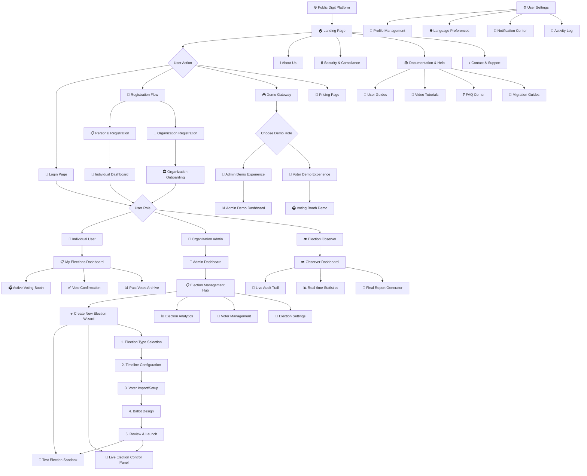
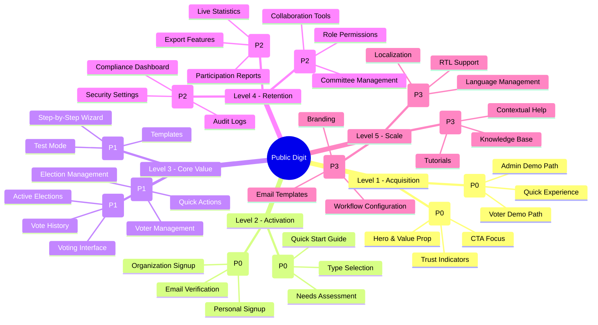

# **HIERARCHICAL PAGE ARCHITECTURE - DESIGN THINKING APPROACH**

## **Mermaid Architecture Diagram**



---

## **DESIGN THINKING PHASED DEVELOPMENT**

### **PHASE 1: EMPATHIZE & DEFINE (Weeks 1-2)**
**Goal:** Understand user needs and establish core flows

```
Priority 1 - Core User Journeys:
├── 🏠 Landing Page (Existing)
├── 🔐 Login/Register Flow
│   ├── 📝 Registration Page
│   ├── 📧 Email Verification
│   └── 🔄 Password Reset
├── 🎮 Demo Gateway
│   ├── Role Selection
│   ├── 👑 Admin Demo Dashboard
│   └── 👤 Voter Demo Experience
└── 🏢 Organization Onboarding (Critical!)
```

### **PHASE 2: IDEATE & PROTOTYPE (Weeks 3-4)**
**Goal:** Create main working interfaces

```
Priority 2 - Main Application:
├── 👤 Individual User Experience:
│   ├── 📋 My Elections Dashboard
│   ├── 🗳️ Voting Booth Interface
│   ├── ✅ Vote Confirmation Page
│   └── 📊 Personal Vote History
│
├── 👑 Admin Core Experience:
│   ├── 🏢 Admin Dashboard
│   ├── 📋 Election Management Hub
│   └── ➕ Create Election Wizard (5 Steps)
│       ├── Step 1: Election Basics
│       ├── Step 2: Timeline
│       ├── Step 3: Voters
│       ├── Step 4: Ballot Design
│       └── Step 5: Review & Launch
│
└── 🧪 Test Environment:
    ├── Test Election Sandbox
    └── Sample Data Generator
```

### **PHASE 3: DEVELOP & TEST (Weeks 5-8)**
**Goal:** Build advanced features and testing interfaces

```
Priority 3 - Advanced Features:
├── 📊 Analytics & Reporting:
│   ├── Live Election Analytics
│   ├── Voter Participation Dashboard
│   ├── Result Visualization
│   └── Export/Report Generator
│
├── 👥 Team Collaboration:
│   ├── Election Committee Management
│   ├── Role-based Permissions
│   └── Team Activity Log
│
├── 🔒 Security & Compliance:
│   ├── Audit Trail Viewer
│   ├── Compliance Dashboard
│   └── Security Settings
│
└── 👁️ Observer Experience:
    ├── Observer Dashboard
    ├── Live Monitoring
    └── Report Access
```

### **PHASE 4: REFINE & SCALE (Weeks 9-12)**
**Goal:** Polish experience and add scaling features

```
Priority 4 - Polish & Scale:
├── ⚙️ Settings & Customization:
│   ├── Organization Settings
│   ├── Branding & White-labeling
│   ├── Email Templates
│   └── API Configuration
│
├── 📚 Help & Support:
│   ├── Contextual Help System
│   ├── Interactive Tutorials
│   ├── Knowledge Base
│   └── Migration Assistant
│
├── 🌐 Multi-language System:
│   ├── Language Selector
│   ├── Translation Management
│   └── RTL Support
│
└── 📱 Mobile Experience:
    ├── Mobile-responsive Design
    ├── Progressive Web App
    └── Mobile-specific Flows
```

---

## **PAGE HIERARCHY WITH BUSINESS PRIORITY**



---

## **USER-CENTERED PAGE GROUPING**

### **GROUP 1: FIRST-TIME VISITORS (Discovery)**
```
Visitor Flow:
Landing Page → Demo Gateway → Registration → Onboarding → Dashboard
```

### **GROUP 2: INDIVIDUAL VOTERS (Participation)**
```
Voter Flow:
Dashboard → Active Elections → Voting Booth → Confirmation → History
```

### **GROUP 3: ELECTION ADMINS (Management)**
```
Admin Flow:
Dashboard → Election Hub → [Create/Manage] → Analytics → Reports
```

### **GROUP 4: OBSERVERS/MONITORS (Oversight)**
```
Observer Flow:
Observer Dashboard → Live Monitoring → Audit Trail → Final Report
```

---

## **CRITICAL PATHS FOR BUSINESS SUCCESS**

### **PATH A: QUICK ACTIVATION (Time-to-Value)**
```
Sequence Diagram for Fast Onboarding:

User->Landing: Visits site
Landing->Demo: Clicks "Try Demo"
Demo->VoterDemo: Experiences voting
VoterDemo->Register: Clicks "Get Started"
Register->Onboarding: Completes registration
Onboarding->ElectionWizard: Guided to create first election
ElectionWizard->TestMode: Creates test election
TestMode->Success: Sees immediate results
Success->Upgrade: Considers paid plan
```

### **PATH B: ORGANIZATION ADOPTION (Team Value)**
```
Org Admin->Landing: Researches solutions
Landing->SecurityPage: Reviews compliance
SecurityPage->Demo: Tests admin features
Demo->Register: Signs up organization
Register->Onboarding: Sets up org profile
Onboarding->TeamInvite: Invites committee
TeamInvite->ElectionSetup: Creates first election
ElectionSetup->VoterImport: Adds members
VoterImport->Launch: Goes live
```

---

## **PRIORITIZED DEVELOPMENT ORDER**

### **SPRINT 1: FOUNDATION (Week 1-2)**
```yaml
Must Have (MVP):
  - Landing Page Enhancements
  - Registration & Login System
  - Basic User Dashboard
  - Simple Voting Interface
  - Demo Election System
  
User Stories Covered:
  - "As a visitor, I want to try the system without registering"
  - "As a user, I want to vote in an election"
  - "As an admin, I want to create a simple election"
```

### **SPRINT 2: ADMIN CORE (Week 3-4)**
```yaml
Should Have:
  - Admin Dashboard
  - Election Creation Wizard (5 steps)
  - Voter Management
  - Basic Analytics
  - Test Election Mode
  
User Stories:
  - "As an admin, I want to create an election in under 10 minutes"
  - "As an admin, I want to import voters from CSV"
  - "As an admin, I want to test before going live"
```

### **SPRINT 3: ADVANCED FEATURES (Week 5-6)**
```yaml
Could Have:
  - Advanced Election Types
  - Team Management
  - Real-time Analytics
  - Audit Trail
  - Export Features
  
User Stories:
  - "As an admin, I want to see live participation rates"
  - "As a committee, we want to collaborate on election setup"
  - "As an observer, I want to monitor election integrity"
```

### **SPRINT 4: POLISH & SCALE (Week 7-8)**
```yaml
Nice to Have:
  - White-label Customization
  - API Access
  - Advanced Security Features
  - Mobile Optimization
  - Multi-language Support
  
User Stories:
  - "As an organization, we want to use our branding"
  - "As a developer, I want to integrate with our CRM"
  - "As a global organization, we need multiple languages"
```

---

## **DESIGN THINKING CHECKLIST**

### **EMPATHY PHASE Questions:**
- [ ] Do we understand our 3 main user personas?
- [ ] Have we mapped their pain points?
- [ ] What emotional states do users experience?
- [ ] What are their fears/concerns about online voting?

### **DEFINE PHASE Deliverables:**
- [ ] Clear problem statements for each persona
- [ ] User journey maps for critical paths
- [ ] Success metrics for each page/flow
- [ ] Accessibility requirements documented

### **IDEATE PHASE Outputs:**
- [ ] Page hierarchy and relationships
- [ ] User flow diagrams
- [ ] Wireframes for critical pages
- [ ] Content strategy for each page

### **PROTOTYPE PHASE Artifacts:**
- [ ] Interactive prototypes for key flows
- [ ] Design system components
- [ ] Responsive breakpoints defined
- [ ] Accessibility testing completed

### **TEST PHASE Activities:**
- [ ] User testing with real diaspora members
- [ ] A/B testing on conversion points
- [ ] Performance testing under load
- [ ] Security penetration testing

---

## **RECOMMENDED IMPLEMENTATION ORDER**

1. **Start with the DEMO SYSTEM** - This is your most powerful acquisition tool
2. **Build the ONBOARDING FLOW** - Capture organization context early
3. **Create the ELECTION WIZARD** - Make first election creation effortless
4. **Develop the VOTING INTERFACE** - Core value delivery
5. **Add ADMIN DASHBOARD** - Management capabilities
6. **Implement ANALYTICS** - Show value and insights
7. **Build TEAM FEATURES** - Enable collaboration
8. **Add SECURITY CENTER** - Build trust
9. **Implement CUSTOMIZATION** - Allow branding
10. **Add HELP SYSTEM** - Reduce support burden

**Pro Tip:** Build each page with these questions in mind:
1. "What business goal does this page serve?"
2. "What user need does this address?"
3. "What's the single most important action here?"
4. "How do we measure success on this page?"

This hierarchy ensures you're always building what matters most for both users and business outcomes.