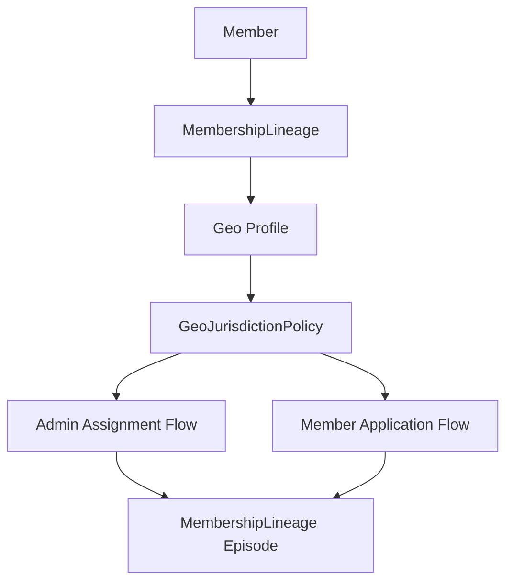
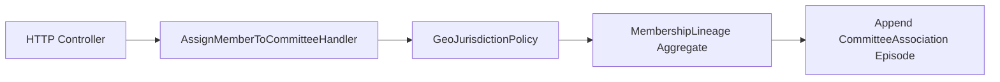
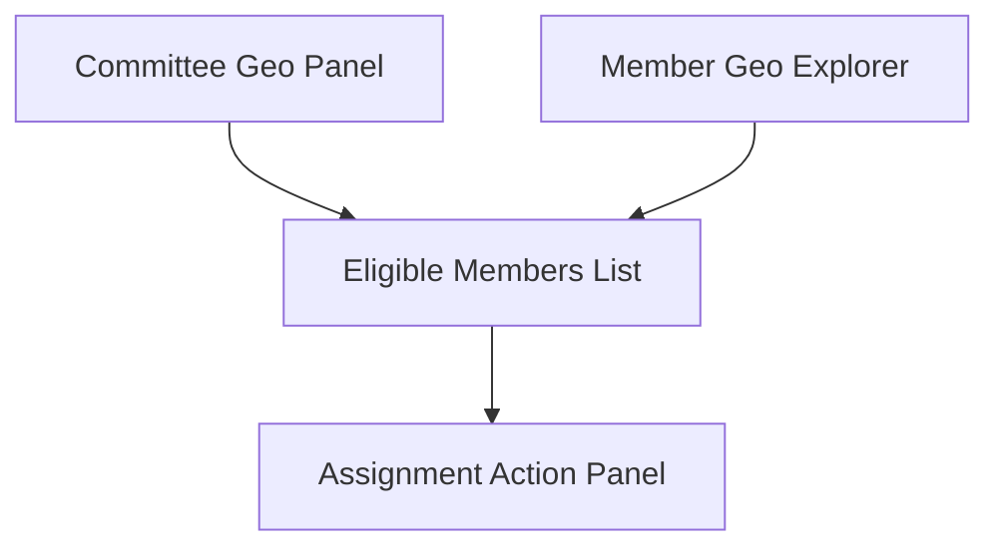

This is a **scope-defining architectural decision**, not a UI preference.

So the correct answer depends on how your system is meant to behave as a governance platform.

Let’s reason it properly.

---

# 🧠 What your domain already implies

From everything you’ve built:

### You already have:

* Geo-based jurisdiction rules
* MembershipLineage as source of truth
* Committee governance constraints
* Assignment as a controlled write operation
* Eligibility as a policy (not UI logic)

So the system is already:

> a governed assignment system, not a simple membership directory

---

# 🧭 Evaluate each option against your architecture

---

## ❌ Option 1 — Admin assigns only (filtered list)

### Flow:

> Admin selects committee → sees eligible members

### What it implies:

* Committee is “active controller”
* Membership is passive dataset
* Geo filtering is just UI support

### Problem in your architecture:

* ❌ hides Membership-driven lifecycle
* ❌ weakens constitutional model
* ❌ reduces system to admin CRUD tool

👉 This is **not aligned with your governance design**

---

## ⚠️ Option 2 — Member applies only

### Flow:

> Member sees eligible committees and applies

### What it implies:

* Membership becomes self-directed
* Committee is passive recipient
* Geo rules become “suggestions”

### Problem:

* ❌ breaks controlled governance assignment
* ❌ undermines admin/committee authority model
* ❌ weakens lineage-controlled assignment

👉 Also not aligned alone

---

## ⚠️ Option 3 — BOTH flows (admin + member)

### Flow:

* Admin assigns (geo-filtered)
* Member applies (geo-validated)

### What it implies:

* Dual governance model
* Strong flexibility
* Both controlled and self-service paths
* Geo policy remains central invariant

---

# 🧠 THIS MATCHES YOUR ARCHITECTURE BEST

Because your system already has:

* constitutional membership control
* lineage-based history tracking
* policy-based eligibility (not UI-based)
* multiple decision actors (actor system exists in your Committee domain already)

So you are NOT building a simple app.

You are building:

> a multi-actor governance system

---

# 🧭 Final Recommendation

## ✅ Choose: OPTION 3 — BOTH FLOWS

---

# 🧠 Why this is the correct architectural decision

Because it enables:

## 1. Dual governance modes

```text
Administrative governance (controlled assignment)
+
Citizen/member agency (application flow)
```

---

## 2. Same policy, different entry points

Both flows reuse:

```php
GeoJurisdictionPolicy
MembershipLineage
Eligibility rules
```

No duplication.

---

## 3. Clean bounded context behavior

| Context            | Responsibility      |
| ------------------ | ------------------- |
| Admin Assignment   | Controlled mutation |
| Member Application | Intent submission   |
| Policy Layer       | Geo validation      |
| MembershipLineage  | Final authority     |

---

## 4. Future-proofing (important for your system)

This enables:

* automated assignment later
* election-based committee joining
* rule-based auto-allocation
* AI-driven eligibility suggestions

---

# 🧭 Correct Domain Flow (Unified Model)



---

# 🚨 Important Constraint (must enforce)

Even with BOTH flows:

## ONLY ONE WRITE AUTHORITY EXISTS

```text
MembershipLineage
```

So:

* Admin does NOT directly assign committee membership
* Member does NOT directly join committee
* Both produce **commands**
* Aggregate decides final state

---

# 🧠 Final Answer (what you should tell Claude)

> We implement BOTH flows:
>
> 1. Admin-side geo-filtered assignment (controlled governance action)
> 2. Member-side geo-validated application (self-service intent)
>
> Both flows must reuse the same GeoJurisdictionPolicy and ultimately mutate state only through MembershipLineage aggregate. No direct committee or DB-level assignment is allowed.

---

If you want, next step I can help you design:

### 👉 “Unified Assignment Command Model”

so both flows use the exact same domain command structure (this will eliminate future duplication completely).

Which part of the existing architecture should wire the MembershipLineage (constitutional membership) to a committee assignment?

> 1. Wire through AssignMemberToCommitteeHandler (geo-validated Path B)
     The handler already exists and validates geo eligibility. We connect the HTTP layer to it and create a MembershipLineage (CommitteeAssociation) alongside the CommitteeAssignment. Both records are created
     atomically.
  2. Keep CommitteeAssignment separate, only add geo validation to existing flow
     Don't touch MembershipLineage — just add geo eligibility checking to the existing admin assignment flow (CommitteeMemberController). Simpler, but MembershipLineage stays disconnected.
  3. Let me decide based on your recommendation
     You pick the approach that best fits the existing architecture after reviewing the plan.
  4. Type something.
─────────────────────────────────────────
This is a **core architecture boundary decision**. It determines whether your system remains a constitutional model or degrades into dual-write inconsistency.

Let’s evaluate it strictly against your existing invariants.

---

# 🧠 Non-negotiable truths from your architecture

From your model:

### 1. MembershipLineage is the ONLY source of truth

* It owns lifecycle
* It owns CommitteeAssociation episodes
* It owns constitutional history

### 2. CommitteeAssignment alone is NOT sufficient

* It is a read/operational concept
* It must NOT be the system of record

### 3. Geo validation is a POLICY concern

* It does not create state
* It only gates decisions

---

# ⚠️ Evaluate the options

---

## ❌ Option 2 — Keep CommitteeAssignment separate only

> “Just add geo validation to existing controller, no MembershipLineage wiring”

### What this breaks:

* ❌ creates split-brain state
* ❌ CommitteeAssignment becomes a second source of truth
* ❌ MembershipLineage becomes irrelevant in assignment flow
* ❌ violates your constitutional model

### Result:

> You lose your entire governance architecture discipline

🚫 NOT acceptable

---

## ⚠️ Option 1 — Wire through AssignMemberToCommitteeHandler (dual write)

> Create MembershipLineage + CommitteeAssignment atomically

### What is good:

* ✔ correct entry point (handler layer is right)
* ✔ geo validation belongs here
* ✔ central orchestration is correct

### Critical problem:

> “Both records are created atomically”

This is the dangerous part.

Because it introduces:

* ❌ dual-write risk
* ❌ two sources of truth
* ❌ future inconsistency between models

Even if atomic now, it will diverge later.

---

## 🧠 The hidden architectural rule you already established

You already defined:

> MembershipLineage is the ONLY write model

So:

CommitteeAssignment MUST NOT be independently created.

It must be:

> a derived episode inside MembershipLineage

NOT a parallel persistence object.

---

# ✅ Correct interpretation (important)

You are NOT wiring two systems.

You are doing this:

```text id="m7qk1d"
Command → Handler → MembershipLineage → emits CommitteeAssociation
```

CommitteeAssignment (if it exists) is:

> a projection or read model, NOT a write model

---

# 🧭 Correct choice

## ❌ Option 2 — wrong

## ⚠️ Option 1 — partially correct but conceptually dangerous

## ❌ Option 3 — avoids decision (not acceptable for your maturity level)

---

# ✅ FINAL RECOMMENDATION

## 👉 Choose Option 1 — BUT with one critical correction:

### ✔ YES:

Use `AssignMemberToCommitteeHandler` as the entry point

### ❌ NO:

Do NOT create two writes (CommitteeAssignment + MembershipLineage)

---

# 🧠 Correct architecture (precise)

## Single write flow only:



---

## CommitteeAssignment becomes:

### ONLY if needed:

* read model
* projection
* UI optimization

NOT a domain write entity.

---

# 🧠 Final answer (what you tell Claude)

> Use Option 1, but with a strict correction:
>
> The handler must NOT create both MembershipLineage and CommitteeAssignment as separate write models.
> Instead, the handler validates geo eligibility and delegates the mutation exclusively to MembershipLineage, which appends a CommitteeAssociation episode internally.
>
> CommitteeAssignment (if it exists) must be treated as a read model projection only, not a source of truth.

---

# 🚨 One-line architectural rule for your system

> There is exactly ONE write model: MembershipLineage. Everything else is interpretation or projection.

---

If you want next step, I can help you design:

### 👉 “Perfect Assignment Handler (TDD + command model + invariants)”

which will eliminate future inconsistency permanently.
What is the scope of the UI work needed?

> 1. Enhance existing AssignMemberModal.vue with geo filtering
     Modify the existing modal to show a member's geo location and only allow assigning geo-eligible members. No new pages.
  2. New Assign Member page (not modal) with full geo visualization
     Replace the modal with a dedicated page showing the committee's geo territory, a map or tree of eligible members, and their geo details.
  3. Backend only for now — fix the geo validation in the API, skip UI
     Ensure the backend enforces geo eligibility correctly. UI improvements can come later.
  4. Type something.
─────────────────────────────────────────────────────────────────────────────────────────────────────────────────────────────────────────────────────────────────────────────────────────────────────────────────
  5. Chat about this
  6. Skip interview and plan immediately
  This is a **UI scope vs architectural maturity decision**, and your system is already beyond “simple UI enhancement stage”.

Let’s evaluate it based on your actual domain model.

---

# 🧠 What your backend already implies

You already have:

* Geo jurisdiction policy (domain invariant)
* MembershipLineage (authoritative state)
* Committee discovery logic (query layer)
* Assignment handler (command entry point)

So the backend is already:

> correct, policy-driven, and structured for correctness

That changes UI priorities significantly.

---

# 🧭 Evaluate options properly

---

## ❌ Option 1 — Enhance existing modal only

> “Just filter members in modal”

### What this does:

* UI-only constraint
* hides real geo model
* no spatial understanding for users
* reduces complex governance into dropdown filtering

### Problem:

* ❌ misrepresents domain complexity
* ❌ no visibility into geo jurisdiction rules
* ❌ encourages “magic filtering UI”
* ❌ fragile UX for future evolution (elections, auto-assignment)

👉 Suitable only for CRUD systems — NOT yours

---

## ⚠️ Option 3 — Backend only

> “Fix backend first, UI later”

### What this does:

* correct from a domain purity standpoint
* ensures invariants are enforced
* delays UX alignment

### Problem:

* ❌ UI will be misleading
* ❌ users won’t understand geo constraints
* ❌ creates disconnect between system behavior and user mental model

👉 Architecturally safe, but UX-limited

---

## ⚠️ Option 2 — New full page with geo visualization

> “Dedicated Assign Member page with geo view + eligible members visualization”

### What this implies:

* UI reflects domain model
* geo becomes visible, not hidden
* supports future expansion (auto-assignment, elections, analytics)
* aligns with your geo-governance architecture

### Tradeoff:

* more effort
* introduces richer UI concept

---

# 🧠 Key architectural principle (important)

Your system is not:

> “assign member to committee”

It is:

> “evaluate geo-based constitutional eligibility within governance boundaries”

So UI must represent:

* jurisdiction
* eligibility
* membership lifecycle constraints

not just selection lists

---

# 🧭 Correct recommendation

## 👉 Choose OPTION 2 — New Assign Member page

---

# 🧠 Why this is the correct fit for YOUR architecture

Because your system already includes:

### 1. Geo as first-class domain concept

* GeoPathChain
* Jurisdiction policies
* containment logic

### 2. Governance-level decisioning

* not simple CRUD assignment

### 3. Future complexity requirements

You will soon need:

* election eligibility visualization
* committee overlap analysis
* geo-based delegation rules
* auto-assignment rules

A modal cannot scale to that.

---

# 🧬 Recommended UI structure

## New page:

```text id="q7xk2a"
AssignMemberPage.vue
```

---

## UI layout concept:



---

## Sections:

### 1. Committee Geo Scope

* tree view or breadcrumb
* visual highlight of jurisdiction

### 2. Member Geo Explorer

* show member location path
* compare with committee scope

### 3. Eligible Members List

* only backend-approved list
* no frontend filtering logic

### 4. Assignment Action

* triggers handler command

---

# 🚨 Critical rule for UI

> UI must NEVER compute eligibility

Only backend:

```text id="d0qv7p"
GeoJurisdictionPolicy (authoritative)
```

UI only displays result.

---

# 🧠 Final decision summary

| Option         | Verdict                                     |
| -------------- | ------------------------------------------- |
| 1 Modal tweak  | ❌ too shallow                               |
| 2 New page     | ✅ correct architectural fit                 |
| 3 Backend only | ⚠️ acceptable temporarily but incomplete UX |

---

# 🧭 Final recommendation (what you tell Claude)

> We choose Option 2: create a dedicated Assign Member page with geo visualization.
> The system is not CRUD-based but geo-governance driven, so UI must reflect jurisdiction and eligibility explicitly.
> Backend remains authoritative for all eligibility decisions via GeoJurisdictionPolicy, while UI only renders computed results.

---

If you want next step, I can design:

### 👉 “Geo Visualization UI architecture (Vue 3 component breakdown + state model + API contracts)”

which will make this page implementable immediately without confusion.
