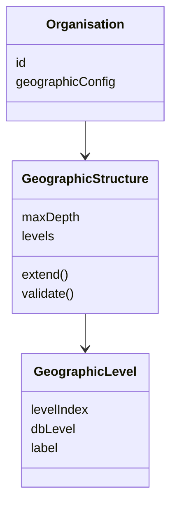
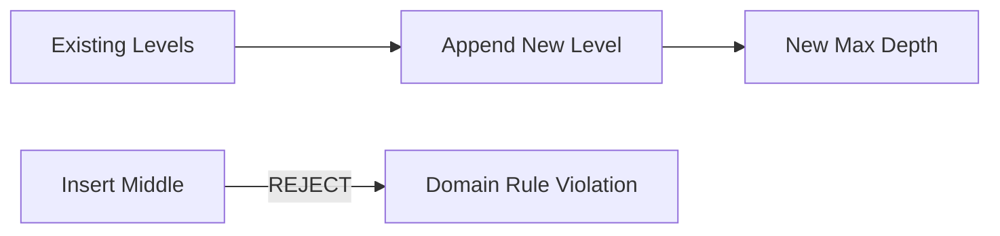
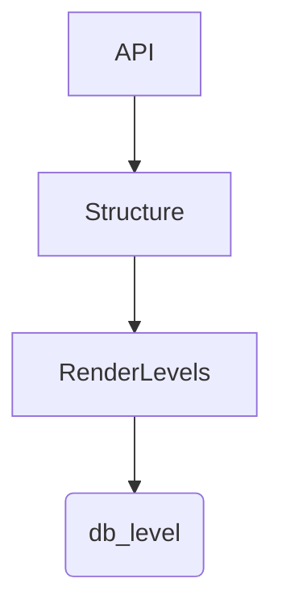
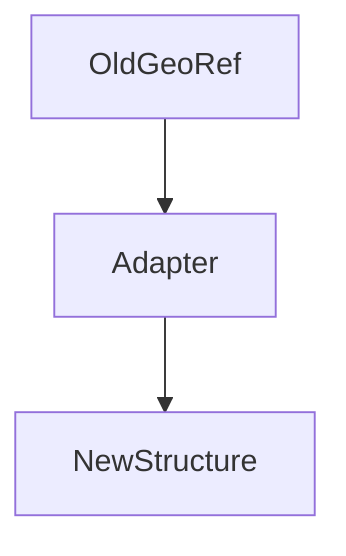
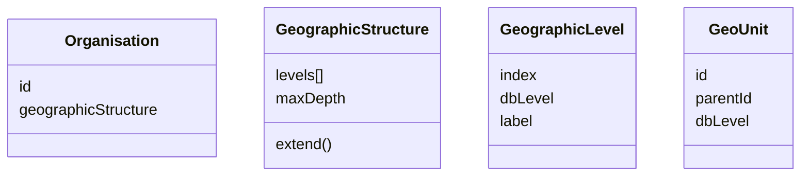
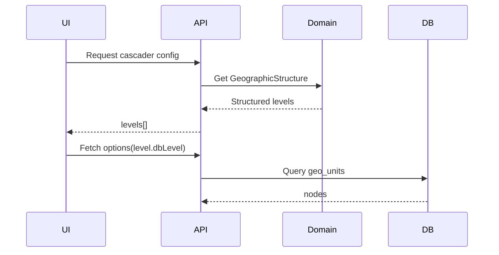

# Claude Code CLI Prompt: Flexible Geographic Levels Architecture

## Context

Current system has hardcoded 4 levels (Province→District→Municipality→Ward). Need to support:
- 0-10 admin levels (continent → country → region → city → ward → ...)
- Organisation-specific level configuration
- Dynamic cascader rendering based on config
- Ability to extend levels downward (not insert/modify middle)

**Constraint:** Cannot change or insert levels in middle of existing hierarchy (would break paths).

---

## Pre-Flight Checklist

```bash
# 1. Verify current max depth
php artisan tinker --execute="
SELECT max(admin_level) FROM geo_administrative_units;
-- Expected: 10 (from earlier migration)
"

# 2. Check if organisations table has geographic_levels column
php artisan tinker --execute="
Schema::hasColumn('organisations', 'geographic_levels')
"

# 3. Verify existing committee geo_references
php artisan tinker --execute="
DB::table('committees')->whereNotNull('operational_geo_reference')->count()
"
```

---

## Phase A: Database & Model (TDD First - RED)

### A1 - Write Failing Tests

```yaml
action: create_test
path: tests/Unit/Models/OrganisationGeographicLevelsTest.php

content: |
  <?php
  
  namespace Tests\Unit\Models;
  
  use App\Models\Organisation;
  use Illuminate\Foundation\Testing\RefreshDatabase;
  use Tests\TestCase;
  
  class OrganisationGeographicLevelsTest extends TestCase
  {
      use RefreshDatabase;
      
      /** @test */
      public function organisation_has_default_levels_for_nepal()
      {
          $org = Organisation::factory()->create();
          
          $levels = $org->geographic_levels;
          
          $this->assertEquals(4, $org->max_geo_depth);
          $this->assertArrayHasKey(1, $levels);
          $this->assertEquals('Province', $levels[1]['name']);
          $this->assertEquals(7, $levels[1]['count']);
          $this->assertArrayHasKey(2, $levels);
          $this->assertEquals('District', $levels[2]['name']);
      }
      
      /** @test */
      public function can_extend_to_new_level()
      {
          $org = Organisation::factory()->create();
          
          $org->extendToLevel(5, [5 => 'Ward']);
          
          $this->assertEquals(5, $org->max_geo_depth);
          $this->assertArrayHasKey(5, $org->geographic_levels);
          $this->assertEquals('Ward', $org->geographic_levels[5]['name']);
      }
      
      /** @test */
      public function cannot_extend_to_lower_depth()
      {
          $org = Organisation::factory()->create(['max_geo_depth' => 6]);
          
          $this->expectException(\DomainException::class);
          $org->extendToLevel(4, []);
      }
      
      /** @test */
      public function cannot_insert_level_in_middle()
      {
          $org = Organisation::factory()->create();
          
          $this->expectException(\DomainException::class);
          $this->expectExceptionMessage('Cannot insert level between existing levels');
          $org->addLevelBetween(2, 3, 'New Level');
      }
      
      /** @test */
      public function level_count_matches_geo_data()
      {
          $org = Organisation::factory()->create();
          
          $this->assertEquals(7, $org->getLevelCount(1)); // Provinces
          $this->assertGreaterThan(0, $org->getLevelCount(2)); // Districts
      }
  }

action: run_command
command: php artisan test tests/Unit/Models/OrganisationGeographicLevelsTest.php
expected: "FAIL (columns don't exist yet)"
```

### A2 - Create Migration

```yaml
action: create_migration
name: add_flexible_geographic_levels_to_organisations
path: database/migrations/2026_05_05_000001_add_flexible_geographic_levels_to_organisations.php

content: |
  <?php
  
  use Illuminate\Database\Migrations\Migration;
  use Illuminate\Database\Schema\Blueprint;
  use Illuminate\Support\Facades\Schema;
  use Illuminate\Support\Facades\DB;
  
  return new class extends Migration
  {
      public function up(): void
      {
          Schema::table('organisations', function (Blueprint $table) {
              $table->json('geographic_levels')->nullable()
                  ->after('base_region_id')
                  ->comment('Custom level configuration: {1:{name,local_name,count},2:{...}}');
              
              $table->integer('max_geo_depth')->default(4)
                  ->after('geographic_levels')
                  ->comment('Maximum administrative depth for this organisation');
              
              $table->boolean('allow_custom_levels')->default(false)
                  ->after('max_geo_depth')
                  ->comment('Whether organisation can define custom levels below existing');
          });
          
          // Set default levels for existing organisations (Nepal structure)
          DB::table('organisations')->update([
              'geographic_levels' => json_encode([
                  1 => ['name' => 'Province', 'local_name' => 'प्रदेश', 'count' => 7],
                  2 => ['name' => 'District', 'local_name' => 'जिल्ला', 'count' => 77],
                  3 => ['name' => 'Municipality', 'local_name' => 'नगरपालिका', 'count' => 753],
                  4 => ['name' => 'Ward', 'local_name' => 'वडा', 'count' => 6743],
              ]),
              'max_geo_depth' => 4,
          ]);
      }
      
      public function down(): void
      {
          Schema::table('organisations', function (Blueprint $table) {
              $table->dropColumn(['geographic_levels', 'max_geo_depth', 'allow_custom_levels']);
          });
      }
  };

action: run_command
command: php artisan migrate
expected: "Migrated"
```

### A3 - Update Organisation Model

```yaml
action: edit_file
path: app/Models/Organisation.php

insert_after: "protected $casts = ["
content: |
    'geographic_levels' => 'array',
    'max_geo_depth' => 'integer',
    'allow_custom_levels' => 'boolean',

insert_after: "protected static function booted()"
content: |
    public function getLevelCount(int $level): int
    {
        // Query geo_administrative_units for actual count
        return \DB::connection('landlord')
            ->table('geo_administrative_units')
            ->where('admin_level', $level)
            ->where('is_active', true)
            ->count();
    }
    
    public function extendToLevel(int $newDepth, array $levelNames): void
    {
        if ($newDepth <= $this->max_geo_depth) {
            throw new \DomainException('New depth must be greater than current max depth');
        }
        
        $levels = $this->geographic_levels ?: [];
        for ($i = $this->max_geo_depth + 1; $i <= $newDepth; $i++) {
            $levels[$i] = [
                'name' => $levelNames[$i] ?? "Level {$i}",
                'local_name' => $levelNames[$i . '_local'] ?? null,
                'required' => false,
                'fixed' => false,
            ];
        }
        
        $this->update([
            'geographic_levels' => $levels,
            'max_geo_depth' => $newDepth,
        ]);
    }
    
    public function getGeoLevels(): array
    {
        $levels = $this->geographic_levels ?: $this->getDefaultLevels();
        
        // Filter to max depth
        return array_filter($levels, fn($k) => $k <= $this->max_geo_depth, ARRAY_FILTER_USE_KEY);
    }
    
    private function getDefaultLevels(): array
    {
        return [
            1 => ['name' => 'Province', 'local_name' => 'प्रदेश', 'count' => 7],
            2 => ['name' => 'District', 'local_name' => 'जिल्ला', 'count' => 77],
            3 => ['name' => 'Municipality', 'local_name' => 'नगरपालिका', 'count' => 753],
            4 => ['name' => 'Ward', 'local_name' => 'वडा', 'count' => 6743],
        ];
    }
```

---

## Phase B: Update CascaderConfigDTO (TDD First)

### B1 - Update DTO Tests

```yaml
action: edit_file
path: tests/Feature/Http/OrganisationGeographyControllerTest.php

append: |
    /** @test */
    public function cascader_config_returns_custom_levels_for_organisation()
    {
        $org = Organisation::factory()->create([
            'committee_structure' => 'geographical',
            'geographic_scope' => 'worldwide',
            'geographic_levels' => [
                1 => ['name' => 'Continent', 'local_name' => 'Kontinent'],
                2 => ['name' => 'Country', 'local_name' => 'Land'],
                3 => ['name' => 'State', 'local_name' => 'Bundesland'],
            ],
            'max_geo_depth' => 3,
        ]);
        
        $dto = CascaderConfigDTO::fromOrganisation($org);
        
        $this->assertEquals(['Continent', 'Country', 'State'], $dto->levelLabels);
        $this->assertEquals(3, $dto->maxDepth);
    }
```

### B2 - Update CascaderConfigDTO

```yaml
action: edit_file
path: app/Contexts/Geography/Application/DTOs/CascaderConfigDTO.php

replace_method: "private static function getLevelLabelsForCountry"
content: |
    private static function getLevelLabelsForCountry(Organisation $organisation): array
    {
        $levels = $organisation->getGeoLevels();
        $labels = [];
        
        for ($i = 1; $i <= $organisation->max_geo_depth; $i++) {
            $labels[] = $levels[$i]['name'] ?? "Level {$i}";
        }
        
        return $labels;
    }
    
    private static function getMaxDepthForCountry(Organisation $organisation): int
    {
        return $organisation->max_geo_depth;
    }
```

---

## Phase C: Update Frontend for Dynamic Levels (TDD First)

### C1 - Write Component Tests

```yaml
action: create_file
path: resources/js/tests/components/GeographyCascader.dynamic.test.js

content: |
  import { describe, it, expect, vi } from 'vitest'
  import { mount } from '@vue/test-utils'
  import GeographyCascader from '@/Components/Geography/GeographyCascader.vue'
  
  describe('GeographyCascader - Dynamic Levels', () => {
    it('renders correct number of levels based on config.maxDepth', async () => {
      const wrapper = mount(GeographyCascader, {
        props: {
          organisationSlug: 'test-org',
          config: {
            showCountrySelector: false,
            levelLabels: ['Province', 'District', 'Municipality', 'Ward'],
            maxDepth: 4,
            initialCountryCode: 'NP'
          }
        }
      })
      
      await wrapper.vm.$nextTick()
      // Should show 4 level selectors
      const selects = wrapper.findAll('select')
      expect(selects.length).toBeGreaterThanOrEqual(4)
    })
    
    it('shows only 3 levels when maxDepth is 3', async () => {
      const wrapper = mount(GeographyCascader, {
        props: {
          organisationSlug: 'test-org',
          config: {
            showCountrySelector: false,
            levelLabels: ['Continent', 'Country', 'State'],
            maxDepth: 3,
            initialCountryCode: 'NP'
          }
        }
      })
      
      // Should show 3 level selectors
    })
  })
```

### C2 - Update GeographyCascader.vue

```yaml
action: edit_file
path: resources/js/Components/Geography/GeographyCascader.vue

replace_section: "<!-- Geographic Cascade (interactive) -->"
content: |
  <!-- Geographic Cascade (dynamic levels based on config.maxDepth) -->
  <div v-if="config && (!config.showCountrySelector || selectedCountry)" class="space-y-3">
    <div v-for="level in visibleLevels" :key="level" class="space-y-2">
      <label class="block text-sm font-medium text-gray-700">
        {{ getLevelLabel(level) }}
      </label>
      <select
        v-model="selections[level]"
        @change="handleLevelChange(level)"
        class="w-full px-3 py-2 border border-gray-300 rounded-md shadow-sm focus:outline-none focus:ring-primary-500 focus:border-primary-500"
        :disabled="!isLevelEnabled(level)"
      >
        <option value="">-- Select {{ getLevelLabel(level) }} --</option>
        <option v-for="node in getOptionsForLevel(level)" :key="node.id" :value="node.id">
          {{ node.name_local }}
        </option>
      </select>
    </div>
  </div>

replace_method: "const visibleLevels"
content: |
  const visibleLevels = computed(() => {
    if (!config.value) return []
    return Array.from({ length: config.value.maxDepth }, (_, i) => i + 1)
  })
  
  const getLevelLabel = (level: number): string => {
    if (!config.value) return `Level ${level}`
    return config.value.levelLabels[level - 1] || `Level ${level}`
  }
```

---

## Phase D: Organisation Create Form - Level Configuration

### D1 - Add Level Configuration Section

```yaml
action: edit_file
path: resources/js/Pages/Organisations/Create.vue

insert_after: "<GeographicScopeSelector"
content: |
  <!-- Custom Level Configuration (for advanced organisations) -->
  <div v-if="form.committee_structure === 'geographical'" class="border-t border-slate-200 pt-6 mt-4">
    <details>
      <summary class="text-sm font-semibold text-slate-900 cursor-pointer">
        Advanced: Custom Administrative Levels
      </summary>
      <div class="mt-4 pl-4 space-y-3">
        <div class="text-sm text-slate-500 mb-2">
          Define custom names for administrative levels (e.g., 'Continent', 'Region', 'State')
        </div>
        
        <div v-for="level in [1,2,3,4,5,6]" :key="level" class="flex items-center gap-3">
          <span class="w-24 text-sm font-medium">Level {{ level }}:</span>
          <input 
            type="text" 
            v-model="form.level_names[level]" 
            :placeholder="`e.g., ${getDefaultLevelName(level)}`"
            class="flex-1 px-3 py-2 border border-slate-300 rounded-lg"
          />
        </div>
        
        <div class="text-xs text-amber-600">
          ⚠️ Level names can be changed later, but level hierarchy cannot be reordered.
        </div>
      </div>
    </details>
  </div>
```

### D2 - Update Form State

```yaml
action: edit_file
path: resources/js/Pages/Organisations/Create.vue

find: "const form = ref({"
replace: |
  const form = ref({
    // ... existing fields
    level_names: {
      1: '',
      2: '',
      3: '',
      4: '',
      5: '',
      6: '',
    }
  })
```

---

## Phase E: API Endpoint for Level Data

### E1 - Add Route

```yaml
action: edit_file
path: routes/geography/geographyApiRoutes.php

append: |
  Route::get('/levels/{countryCode}', [GeographicLevelController::class, 'index'])->name('geo.levels');
```

### E2 - Create Controller

```yaml
action: create_file
path: app/Http/Controllers/Geography/GeographicLevelController.php

content: |
  <?php
  
  namespace App\Http\Controllers\Geography;
  
  use App\Contexts\Geography\Domain\Models\Country;
  use App\Http\Controllers\Controller;
  use Illuminate\Http\JsonResponse;
  
  final class GeographicLevelController extends Controller
  {
      public function index(string $countryCode): JsonResponse
      {
          $country = Country::where('code', strtoupper($countryCode))
              ->where('is_active', true)
              ->firstOrFail();
          
          $adminLevels = $country->admin_levels ? json_decode($country->admin_levels, true) : [];
          
          return response()->json([
              'data' => [
                  'country' => $country->code,
                  'max_level' => max(array_keys($adminLevels)) ?: 4,
                  'levels' => $adminLevels,
              ]
          ]);
      }
  }
```

---

## Verification Commands

```bash
# Run all tests
php artisan test tests/Unit/Models/OrganisationGeographicLevelsTest.php
php artisan test tests/Feature/Http/OrganisationGeographyControllerTest.php
npm run test -- GeographyCascader.dynamic.test.js

# Manual browser test
# Create organisation with custom level names
# Verify cascader shows custom level names

# Verify existing committees not broken
php artisan test tests/Feature/Membership/CommitteeManagementTest.php
```

---

## Success Criteria Checklist

- [ ] Migration adds `geographic_levels`, `max_geo_depth`, `allow_custom_levels` to organisations
- [ ] Organisation model has `extendToLevel()` method
- [ ] Cannot insert levels between existing levels (throws DomainException)
- [ ] Cascader renders dynamic number of levels based on org config
- [ ] Level labels come from organisation config (not hardcoded)
- [ ] Existing Nepal committees still work (backward compatible)
- [ ] All 45+ existing tests still pass

---

## Execution Order

```yaml
execute:
  - Phase A1: Write failing tests (RED)
  - Phase A2: Create migration
  - Phase A3: Update Organisation model
  - Phase B1-B2: Update DTO and tests
  - Phase C1-C2: Update frontend
  - Phase D1-D2: Update create form
  - Phase E1-E2: Add levels API
  - Run all tests (GREEN)
```

**Execute Phase A1 now.** 🚀
# Claude Code CLI Prompt: Flexible Geographic Levels Architecture

## Context

Current system has hardcoded 4 levels (Province→District→Municipality→Ward). Need to support:
- 0-10 admin levels (continent → country → region → city → ward → ...)
- Organisation-specific level configuration
- Dynamic cascader rendering based on config
- Ability to extend levels downward (not insert/modify middle)

**Constraint:** Cannot change or insert levels in middle of existing hierarchy (would break paths).

---

## Pre-Flight Checklist

```bash
# 1. Verify current max depth
php artisan tinker --execute="
SELECT max(admin_level) FROM geo_administrative_units;
-- Expected: 10 (from earlier migration)
"

# 2. Check if organisations table has geographic_levels column
php artisan tinker --execute="
Schema::hasColumn('organisations', 'geographic_levels')
"

# 3. Verify existing committee geo_references
php artisan tinker --execute="
DB::table('committees')->whereNotNull('operational_geo_reference')->count()
"
```

---

## Phase A: Database & Model (TDD First - RED)

### A1 - Write Failing Tests

```yaml
action: create_test
path: tests/Unit/Models/OrganisationGeographicLevelsTest.php

content: |
  <?php
  
  namespace Tests\Unit\Models;
  
  use App\Models\Organisation;
  use Illuminate\Foundation\Testing\RefreshDatabase;
  use Tests\TestCase;
  
  class OrganisationGeographicLevelsTest extends TestCase
  {
      use RefreshDatabase;
      
      /** @test */
      public function organisation_has_default_levels_for_nepal()
      {
          $org = Organisation::factory()->create();
          
          $levels = $org->geographic_levels;
          
          $this->assertEquals(4, $org->max_geo_depth);
          $this->assertArrayHasKey(1, $levels);
          $this->assertEquals('Province', $levels[1]['name']);
          $this->assertEquals(7, $levels[1]['count']);
          $this->assertArrayHasKey(2, $levels);
          $this->assertEquals('District', $levels[2]['name']);
      }
      
      /** @test */
      public function can_extend_to_new_level()
      {
          $org = Organisation::factory()->create();
          
          $org->extendToLevel(5, [5 => 'Ward']);
          
          $this->assertEquals(5, $org->max_geo_depth);
          $this->assertArrayHasKey(5, $org->geographic_levels);
          $this->assertEquals('Ward', $org->geographic_levels[5]['name']);
      }
      
      /** @test */
      public function cannot_extend_to_lower_depth()
      {
          $org = Organisation::factory()->create(['max_geo_depth' => 6]);
          
          $this->expectException(\DomainException::class);
          $org->extendToLevel(4, []);
      }
      
      /** @test */
      public function cannot_insert_level_in_middle()
      {
          $org = Organisation::factory()->create();
          
          $this->expectException(\DomainException::class);
          $this->expectExceptionMessage('Cannot insert level between existing levels');
          $org->addLevelBetween(2, 3, 'New Level');
      }
      
      /** @test */
      public function level_count_matches_geo_data()
      {
          $org = Organisation::factory()->create();
          
          $this->assertEquals(7, $org->getLevelCount(1)); // Provinces
          $this->assertGreaterThan(0, $org->getLevelCount(2)); // Districts
      }
  }

action: run_command
command: php artisan test tests/Unit/Models/OrganisationGeographicLevelsTest.php
expected: "FAIL (columns don't exist yet)"
```

### A2 - Create Migration

```yaml
action: create_migration
name: add_flexible_geographic_levels_to_organisations
path: database/migrations/2026_05_05_000001_add_flexible_geographic_levels_to_organisations.php

content: |
  <?php
  
  use Illuminate\Database\Migrations\Migration;
  use Illuminate\Database\Schema\Blueprint;
  use Illuminate\Support\Facades\Schema;
  use Illuminate\Support\Facades\DB;
  
  return new class extends Migration
  {
      public function up(): void
      {
          Schema::table('organisations', function (Blueprint $table) {
              $table->json('geographic_levels')->nullable()
                  ->after('base_region_id')
                  ->comment('Custom level configuration: {1:{name,local_name,count},2:{...}}');
              
              $table->integer('max_geo_depth')->default(4)
                  ->after('geographic_levels')
                  ->comment('Maximum administrative depth for this organisation');
              
              $table->boolean('allow_custom_levels')->default(false)
                  ->after('max_geo_depth')
                  ->comment('Whether organisation can define custom levels below existing');
          });
          
          // Set default levels for existing organisations (Nepal structure)
          DB::table('organisations')->update([
              'geographic_levels' => json_encode([
                  1 => ['name' => 'Province', 'local_name' => 'प्रदेश', 'count' => 7],
                  2 => ['name' => 'District', 'local_name' => 'जिल्ला', 'count' => 77],
                  3 => ['name' => 'Municipality', 'local_name' => 'नगरपालिका', 'count' => 753],
                  4 => ['name' => 'Ward', 'local_name' => 'वडा', 'count' => 6743],
              ]),
              'max_geo_depth' => 4,
          ]);
      }
      
      public function down(): void
      {
          Schema::table('organisations', function (Blueprint $table) {
              $table->dropColumn(['geographic_levels', 'max_geo_depth', 'allow_custom_levels']);
          });
      }
  };

action: run_command
command: php artisan migrate
expected: "Migrated"
```

### A3 - Update Organisation Model

```yaml
action: edit_file
path: app/Models/Organisation.php

insert_after: "protected $casts = ["
content: |
    'geographic_levels' => 'array',
    'max_geo_depth' => 'integer',
    'allow_custom_levels' => 'boolean',

insert_after: "protected static function booted()"
content: |
    public function getLevelCount(int $level): int
    {
        // Query geo_administrative_units for actual count
        return \DB::connection('landlord')
            ->table('geo_administrative_units')
            ->where('admin_level', $level)
            ->where('is_active', true)
            ->count();
    }
    
    public function extendToLevel(int $newDepth, array $levelNames): void
    {
        if ($newDepth <= $this->max_geo_depth) {
            throw new \DomainException('New depth must be greater than current max depth');
        }
        
        $levels = $this->geographic_levels ?: [];
        for ($i = $this->max_geo_depth + 1; $i <= $newDepth; $i++) {
            $levels[$i] = [
                'name' => $levelNames[$i] ?? "Level {$i}",
                'local_name' => $levelNames[$i . '_local'] ?? null,
                'required' => false,
                'fixed' => false,
            ];
        }
        
        $this->update([
            'geographic_levels' => $levels,
            'max_geo_depth' => $newDepth,
        ]);
    }
    
    public function getGeoLevels(): array
    {
        $levels = $this->geographic_levels ?: $this->getDefaultLevels();
        
        // Filter to max depth
        return array_filter($levels, fn($k) => $k <= $this->max_geo_depth, ARRAY_FILTER_USE_KEY);
    }
    
    private function getDefaultLevels(): array
    {
        return [
            1 => ['name' => 'Province', 'local_name' => 'प्रदेश', 'count' => 7],
            2 => ['name' => 'District', 'local_name' => 'जिल्ला', 'count' => 77],
            3 => ['name' => 'Municipality', 'local_name' => 'नगरपालिका', 'count' => 753],
            4 => ['name' => 'Ward', 'local_name' => 'वडा', 'count' => 6743],
        ];
    }
```

---

## Phase B: Update CascaderConfigDTO (TDD First)

### B1 - Update DTO Tests

```yaml
action: edit_file
path: tests/Feature/Http/OrganisationGeographyControllerTest.php

append: |
    /** @test */
    public function cascader_config_returns_custom_levels_for_organisation()
    {
        $org = Organisation::factory()->create([
            'committee_structure' => 'geographical',
            'geographic_scope' => 'worldwide',
            'geographic_levels' => [
                1 => ['name' => 'Continent', 'local_name' => 'Kontinent'],
                2 => ['name' => 'Country', 'local_name' => 'Land'],
                3 => ['name' => 'State', 'local_name' => 'Bundesland'],
            ],
            'max_geo_depth' => 3,
        ]);
        
        $dto = CascaderConfigDTO::fromOrganisation($org);
        
        $this->assertEquals(['Continent', 'Country', 'State'], $dto->levelLabels);
        $this->assertEquals(3, $dto->maxDepth);
    }
```

### B2 - Update CascaderConfigDTO

```yaml
action: edit_file
path: app/Contexts/Geography/Application/DTOs/CascaderConfigDTO.php

replace_method: "private static function getLevelLabelsForCountry"
content: |
    private static function getLevelLabelsForCountry(Organisation $organisation): array
    {
        $levels = $organisation->getGeoLevels();
        $labels = [];
        
        for ($i = 1; $i <= $organisation->max_geo_depth; $i++) {
            $labels[] = $levels[$i]['name'] ?? "Level {$i}";
        }
        
        return $labels;
    }
    
    private static function getMaxDepthForCountry(Organisation $organisation): int
    {
        return $organisation->max_geo_depth;
    }
```

---

## Phase C: Update Frontend for Dynamic Levels (TDD First)

### C1 - Write Component Tests

```yaml
action: create_file
path: resources/js/tests/components/GeographyCascader.dynamic.test.js

content: |
  import { describe, it, expect, vi } from 'vitest'
  import { mount } from '@vue/test-utils'
  import GeographyCascader from '@/Components/Geography/GeographyCascader.vue'
  
  describe('GeographyCascader - Dynamic Levels', () => {
    it('renders correct number of levels based on config.maxDepth', async () => {
      const wrapper = mount(GeographyCascader, {
        props: {
          organisationSlug: 'test-org',
          config: {
            showCountrySelector: false,
            levelLabels: ['Province', 'District', 'Municipality', 'Ward'],
            maxDepth: 4,
            initialCountryCode: 'NP'
          }
        }
      })
      
      await wrapper.vm.$nextTick()
      // Should show 4 level selectors
      const selects = wrapper.findAll('select')
      expect(selects.length).toBeGreaterThanOrEqual(4)
    })
    
    it('shows only 3 levels when maxDepth is 3', async () => {
      const wrapper = mount(GeographyCascader, {
        props: {
          organisationSlug: 'test-org',
          config: {
            showCountrySelector: false,
            levelLabels: ['Continent', 'Country', 'State'],
            maxDepth: 3,
            initialCountryCode: 'NP'
          }
        }
      })
      
      // Should show 3 level selectors
    })
  })
```

### C2 - Update GeographyCascader.vue

```yaml
action: edit_file
path: resources/js/Components/Geography/GeographyCascader.vue

replace_section: "<!-- Geographic Cascade (interactive) -->"
content: |
  <!-- Geographic Cascade (dynamic levels based on config.maxDepth) -->
  <div v-if="config && (!config.showCountrySelector || selectedCountry)" class="space-y-3">
    <div v-for="level in visibleLevels" :key="level" class="space-y-2">
      <label class="block text-sm font-medium text-gray-700">
        {{ getLevelLabel(level) }}
      </label>
      <select
        v-model="selections[level]"
        @change="handleLevelChange(level)"
        class="w-full px-3 py-2 border border-gray-300 rounded-md shadow-sm focus:outline-none focus:ring-primary-500 focus:border-primary-500"
        :disabled="!isLevelEnabled(level)"
      >
        <option value="">-- Select {{ getLevelLabel(level) }} --</option>
        <option v-for="node in getOptionsForLevel(level)" :key="node.id" :value="node.id">
          {{ node.name_local }}
        </option>
      </select>
    </div>
  </div>

replace_method: "const visibleLevels"
content: |
  const visibleLevels = computed(() => {
    if (!config.value) return []
    return Array.from({ length: config.value.maxDepth }, (_, i) => i + 1)
  })
  
  const getLevelLabel = (level: number): string => {
    if (!config.value) return `Level ${level}`
    return config.value.levelLabels[level - 1] || `Level ${level}`
  }
```

---

## Phase D: Organisation Create Form - Level Configuration

### D1 - Add Level Configuration Section

```yaml
action: edit_file
path: resources/js/Pages/Organisations/Create.vue

insert_after: "<GeographicScopeSelector"
content: |
  <!-- Custom Level Configuration (for advanced organisations) -->
  <div v-if="form.committee_structure === 'geographical'" class="border-t border-slate-200 pt-6 mt-4">
    <details>
      <summary class="text-sm font-semibold text-slate-900 cursor-pointer">
        Advanced: Custom Administrative Levels
      </summary>
      <div class="mt-4 pl-4 space-y-3">
        <div class="text-sm text-slate-500 mb-2">
          Define custom names for administrative levels (e.g., 'Continent', 'Region', 'State')
        </div>
        
        <div v-for="level in [1,2,3,4,5,6]" :key="level" class="flex items-center gap-3">
          <span class="w-24 text-sm font-medium">Level {{ level }}:</span>
          <input 
            type="text" 
            v-model="form.level_names[level]" 
            :placeholder="`e.g., ${getDefaultLevelName(level)}`"
            class="flex-1 px-3 py-2 border border-slate-300 rounded-lg"
          />
        </div>
        
        <div class="text-xs text-amber-600">
          ⚠️ Level names can be changed later, but level hierarchy cannot be reordered.
        </div>
      </div>
    </details>
  </div>
```

### D2 - Update Form State

```yaml
action: edit_file
path: resources/js/Pages/Organisations/Create.vue

find: "const form = ref({"
replace: |
  const form = ref({
    // ... existing fields
    level_names: {
      1: '',
      2: '',
      3: '',
      4: '',
      5: '',
      6: '',
    }
  })
```

---

## Phase E: API Endpoint for Level Data

### E1 - Add Route

```yaml
action: edit_file
path: routes/geography/geographyApiRoutes.php

append: |
  Route::get('/levels/{countryCode}', [GeographicLevelController::class, 'index'])->name('geo.levels');
```

### E2 - Create Controller

```yaml
action: create_file
path: app/Http/Controllers/Geography/GeographicLevelController.php

content: |
  <?php
  
  namespace App\Http\Controllers\Geography;
  
  use App\Contexts\Geography\Domain\Models\Country;
  use App\Http\Controllers\Controller;
  use Illuminate\Http\JsonResponse;
  
  final class GeographicLevelController extends Controller
  {
      public function index(string $countryCode): JsonResponse
      {
          $country = Country::where('code', strtoupper($countryCode))
              ->where('is_active', true)
              ->firstOrFail();
          
          $adminLevels = $country->admin_levels ? json_decode($country->admin_levels, true) : [];
          
          return response()->json([
              'data' => [
                  'country' => $country->code,
                  'max_level' => max(array_keys($adminLevels)) ?: 4,
                  'levels' => $adminLevels,
              ]
          ]);
      }
  }
```

---

## Verification Commands

```bash
# Run all tests
php artisan test tests/Unit/Models/OrganisationGeographicLevelsTest.php
php artisan test tests/Feature/Http/OrganisationGeographyControllerTest.php
npm run test -- GeographyCascader.dynamic.test.js

# Manual browser test
# Create organisation with custom level names
# Verify cascader shows custom level names

# Verify existing committees not broken
php artisan test tests/Feature/Membership/CommitteeManagementTest.php
```

---

## Success Criteria Checklist

- [ ] Migration adds `geographic_levels`, `max_geo_depth`, `allow_custom_levels` to organisations
- [ ] Organisation model has `extendToLevel()` method
- [ ] Cannot insert levels between existing levels (throws DomainException)
- [ ] Cascader renders dynamic number of levels based on org config
- [ ] Level labels come from organisation config (not hardcoded)
- [ ] Existing Nepal committees still work (backward compatible)
- [ ] All 45+ existing tests still pass

---

## Execution Order

```yaml
execute:
  - Phase A1: Write failing tests (RED)
  - Phase A2: Create migration
  - Phase A3: Update Organisation model
  - Phase B1-B2: Update DTO and tests
  - Phase C1-C2: Update frontend
  - Phase D1-D2: Update create form
  - Phase E1-E2: Add levels API
  - Run all tests (GREEN)
```

**Execute Phase A1 now.** 🚀
# ✅ Yes - Extend Organisation Create Form with Level Name Configuration

## Current Form vs. Extended Form

| Current Fields | New Fields to Add |
|----------------|-------------------|
| Organisation Name | + Administrative Level Names (Level 1-10) |
| Email | + Level labels (custom names per level) |
| Slug | + Level local names (for i18n) |
| Language | + Which levels are required/hidden |
| Representative | + Maximum depth organisation uses |
| Logo | |
| Committee Structure | |
| Geographic Scope | |

## Updated Organisation Create Form Layout

```vue
<template>
  <form @submit.prevent="submit">
    <!-- Existing: Basic Information -->
    <div class="space-y-4">
      <Input label="Organisation Name" v-model="form.name" required />
      <Input label="Email" v-model="form.email" type="email" required />
      <Input label="Slug" v-model="form.slug" required />
      <!-- ... existing fields ... -->
    </div>

    <!-- Existing: Geographic Scope -->
    <GeographicScopeSelector :form="form" :errors="errors" />

    <!-- NEW: Administrative Level Configuration -->
    <div v-if="form.committee_structure === 'geographical'" class="border-t pt-6 mt-6">
      <h3 class="text-lg font-semibold mb-2">Administrative Level Names</h3>
      <p class="text-sm text-gray-500 mb-4">
        Define what each geographic level is called in your organisation.<br>
        These names will appear in dropdown menus when creating committees.
      </p>
      
      <div class="bg-blue-50 p-3 rounded-lg mb-4">
        <p class="text-sm text-blue-800">
          💡 Examples:<br>
          • Nepal: Province → District → Municipality → Ward<br>
          • Germany: State (Bundesland) → District (Kreis) → Municipality (Gemeinde)<br>
          • NRNA Global: Continent → Region → Country → State → City
        </p>
      </div>

      <div class="grid grid-cols-1 md:grid-cols-2 gap-4">
        <div v-for="level in maxLevels" :key="level" class="border rounded-lg p-3">
          <div class="flex items-center justify-between mb-2">
            <label class="font-medium text-sm">Level {{ level }}</label>
            <label class="flex items-center gap-1 text-xs">
              <input type="checkbox" v-model="form.level_enabled[level]" class="rounded" />
              <span class="text-gray-500">Enabled</span>
            </label>
          </div>
          
          <input
            type="text"
            v-model="form.level_names[level]"
            :placeholder="getDefaultLevelName(level)"
            :disabled="!form.level_enabled[level]"
            class="w-full px-3 py-2 border rounded-lg text-sm mb-2"
          />
          
          <input
            type="text"
            v-model="form.level_local_names[level]"
            :placeholder="getDefaultLocalName(level)"
            :disabled="!form.level_enabled[level]"
            class="w-full px-3 py-2 border rounded-lg text-sm"
          />
          
          <p class="text-xs text-gray-400 mt-1">{{ getExample(level) }}</p>
        </div>
      </div>
      
      <div class="mt-4 flex items-center gap-3">
        <label class="text-sm">Maximum administrative depth:</label>
        <select v-model="form.max_geo_depth" class="px-3 py-1 border rounded-lg">
          <option v-for="n in maxLevels" :key="n" :value="n">
            {{ n }} level{{ n > 1 ? 's' : '' }}
          </option>
        </select>
      </div>
    </div>

    <!-- Submit button -->
    <button type="submit" class="mt-6">Create Organisation</button>
  </form>
</template>

<script setup>
import { ref, computed } from 'vue'

const maxLevels = 10 // System supports up to 10 levels

const form = ref({
  // ... existing fields
  committee_structure: 'flat',
  geographic_scope: '',
  
  // NEW: Level configuration
  level_enabled: {
    1: true,   // Level 1 always enabled
    2: true,
    3: true,
    4: true,
    5: false,
    6: false,
    7: false,
    8: false,
    9: false,
    10: false,
  },
  level_names: {
    1: '',
    2: '',
    3: '',
    4: '',
    5: '',
    6: '',
    7: '',
    8: '',
    9: '',
    10: '',
  },
  level_local_names: {
    1: '',
    2: '',
    3: '',
    4: '',
    5: '',
    6: '',
    7: '',
    8: '',
    9: '',
    10: '',
  },
  max_geo_depth: 4,
})

const getDefaultLevelName = (level) => {
  const defaults = {
    1: 'Province / State',
    2: 'District / County',
    3: 'Municipality / City',
    4: 'Ward / Neighborhood',
    5: 'Village / Hamlet',
  }
  return defaults[level] || `Level ${level}`
}

const getDefaultLocalName = (level) => {
  const defaults = {
    1: 'प्रदेश / राज्य',
    2: 'जिल्ला',
    3: 'नगरपालिका',
    4: 'वडा',
  }
  return defaults[level] || ''
}

const getExample = (level) => {
  const examples = {
    1: 'e.g., Bagmati Province, Bavaria, California',
    2: 'e.g., Kathmandu District, Munich',
    3: 'e.g., Kathmandu Metropolitan City',
    4: 'e.g., Ward 1, Neuhausen',
    5: 'e.g., Thamel, Schwabing',
  }
  return examples[level] || ''
}

// Update max_geo_depth when user changes enabled levels
watch(() => form.value.level_enabled, () => {
  // Find highest enabled level
  let max = 0
  for (let i = maxLevels; i >= 1; i--) {
    if (form.value.level_enabled[i]) {
      max = i
      break
    }
  }
  form.value.max_geo_depth = max >= 4 ? max : 4
}, { deep: true })
</script>
```

## Updated Backend - Store Method

```php
// app/Http/Controllers/OrganisationController.php - store()

$validated['geographic_levels'] = [];

for ($i = 1; $i <= $request->max_geo_depth; $i++) {
    $levelConfig = [];
    
    if ($request->level_enabled[$i] ?? false) {
        $levelConfig['name'] = $request->level_names[$i] ?? $this->getDefaultLevelName($i);
        $levelConfig['local_name'] = $request->level_local_names[$i] ?? null;
        $levelConfig['enabled'] = true;
    } else {
        $levelConfig['name'] = $this->getDefaultLevelName($i);
        $levelConfig['enabled'] = false;
    }
    
    $validated['geographic_levels'][$i] = $levelConfig;
}

$organisation = Organisation::create($validated);
```

## Migration Updates (Already Covered)

```sql
-- Already in organisations table:
geographic_levels JSON
max_geo_depth INTEGER DEFAULT 4
```

## Benefits of This Approach

| Benefit | Explanation |
|---------|-------------|
| **Flexibility** | Each organisation defines their own terminology |
| **Multi-language** | Separate English and local names per level |
| **Disable levels** | Organisations with fewer levels can disable unused ones |
| **Backward compatible** | Existing organisations get default Nepal structure |
| **UI clarity** | Dropdowns show organisation's terminology, not generic "Level 1" |

## Example Configurations

### Nepal Political Party
```json
{
  "1": {"name": "Province", "local_name": "प्रदेश", "enabled": true},
  "2": {"name": "District", "local_name": "जिल्ला", "enabled": true},
  "3": {"name": "Municipality", "local_name": "नगरपालिका", "enabled": true},
  "4": {"name": "Ward", "local_name": "वडा", "enabled": true},
  "max_geo_depth": 4
}
```

### NRNA Global
```json
{
  "1": {"name": "Continent", "enabled": true},
  "2": {"name": "Region", "enabled": true},
  "3": {"name": "Country", "enabled": true},
  "4": {"name": "State/Province", "enabled": true},
  "5": {"name": "City", "enabled": true},
  "max_geo_depth": 5
}
```

### Small Organisation (2 levels only)
```json
{
  "1": {"name": "State", "enabled": true},
  "2": {"name": "City", "enabled": true},
  "3": {"name": "Level 3", "enabled": false},
  "4": {"name": "Level 4", "enabled": false},
  "max_geo_depth": 2
}
```

## Implementation Priority

1. ✅ Update Organisation create form (this task)
2. ✅ Update Organisation model to handle `geographic_levels` JSON
3. ✅ Update `CascaderConfigDTO` to use organisation's level names
4. ✅ Update `GeographyCascader` to render dynamic level labels
5. ✅ Update existing organisations with default Nepal structure

**This makes the system truly multi-lingual and adaptable to any organisation's governance structure!** 🚀

Do you want me to write the complete implementation plan for this?
# Decision: Update Organisation Geographic Structure FIRST

## Why This Order Makes Sense

```yaml
Priority Order:
  1. Organisation Geographic Structure (Backend + DB)
  2. CascaderConfigDTO (API layer)
  3. GeographyCascader (Frontend)
```

## Rationale

| Order | Component | Dependency |
|-------|-----------|------------|
| **1st** | Organisation model + DB | Foundation - nothing depends on it yet |
| **2nd** | Organisation create form | Needs DB schema ready |
| **3rd** | CascaderConfigDTO | Reads organisation config |
| **4th** | GeographyCascader | Consumes DTO output |
| **5th** | Existing tests | Verify nothing broken |

## Execution Plan

### Phase 1: Backend Foundation (No UI changes)

```yaml
Step 1.1: Migration to add geographic_levels, max_geo_depth to organisations
Step 1.2: Update Organisation model with casts and helper methods
Step 1.3: Write unit tests for new model methods
Step 1.4: Run migrations on existing DB (add default Nepal structure)
```

### Phase 2: Update Organisation Create Form

```yaml
Step 2.1: Add level configuration section to Create.vue
Step 2.2: Update controller to save level config
Step 2.3: Test creating organisations with custom levels
```

### Phase 3: Update API Layer

```yaml
Step 3.1: Update CascaderConfigDTO to read organisation's level config
Step 3.2: Update tests to verify custom level names returned
```

### Phase 4: Update Frontend Cascader

```yaml
Step 4.1: Update GeographyCascader to use dynamic level labels from config
Step 4.2: Update component to render variable number of levels
Step 4.3: Test with different organisation configs
```

### Phase 5: Backward Compatibility

```yaml
Step 5.1: Update existing organisations with default levels
Step 5.2: Run full test suite
Step 5.3: Verify existing committees still work
```

## Quick Start Command

```bash
# Start with Phase 1
php artisan make:migration add_flexible_geographic_levels_to_organisations
```

**Do you want me to write the detailed implementation plan for Phase 1?** 🚀
# ✅ Perfect - That's the Right Service Provider Model

## Architecture: Geographic Structure as a Service

```yaml
Core Principle:
  - Standard geographic units exist in database (global, all countries)
  - Organisation CANNOT invent new units
  - Organisation CAN: Choose which levels to use, rename level labels, set max depth
  - New units require: Service provider to add to global geography database
```

## Three-Tier Geographic Model

```
┌─────────────────────────────────────────────────────────────────────────────┐
│                    GEOGRAPHIC DATA MODEL                                    │
├─────────────────────────────────────────────────────────────────────────────┤
│                                                                             │
│  LEVEL 0: GLOBAL DATABASE (Service Provider Managed)                       │
│  ┌─────────────────────────────────────────────────────────────────────┐   │
│  │ geo_administrative_units table                                      │   │
│  │ - Continents (admin_level=0)                                        │   │
│  │ - Countries (admin_level=1)                                         │   │
│  │ - States/Provinces (admin_level=2)                                  │   │
│  │ - Districts/Regions (admin_level=3)                                 │   │
│  │ - Cities/Municipalities (admin_level=4)                             │   │
│  │ - Wards/Neighborhoods (admin_level=5)                               │   │
│  │ - ... up to level 10                                                │   │
│  └─────────────────────────────────────────────────────────────────────┘   │
│                                    │                                       │
│                                    ▼                                       │
│  LEVEL 1: ORGANISATION SELECTION (What they use)                           │
│  ┌─────────────────────────────────────────────────────────────────────┐   │
│  │ organisations.geographic_levels JSON                                │   │
│  │ - Level 1: "Province" (uses admin_level=2 from DB)                  │   │
│  │ - Level 2: "District" (uses admin_level=3 from DB)                  │   │
│  │ - Level 3: "Municipality" (uses admin_level=4 from DB)              │   │
│  │ - Level 4: "Ward" (uses admin_level=5 from DB)                      │   │
│  │ - max_depth: 4                                                      │   │
│  └─────────────────────────────────────────────────────────────────────┘   │
│                                    │                                       │
│                                    ▼                                       │
│  LEVEL 2: ORGANISATION RENAMING (Custom labels, not new units)             │
│  ┌─────────────────────────────────────────────────────────────────────┐   │
│  │ organisation renames "Province" → "State"                           │   │
│  │ organisation renames "District" → "County"                          │   │
│  │ organisation renames "Municipality" → "Township"                    │   │
│  │ (Still uses same DB units, just different display name)             │   │
│  └─────────────────────────────────────────────────────────────────────┘   │
│                                                                             │
└─────────────────────────────────────────────────────────────────────────────┘
```

## Service Provider Responsibilities

| Responsibility | Description |
|----------------|-------------|
| **Add new countries** | Seed all countries with admin_levels configuration |
| **Add new regions** | Insert new states/provinces for existing countries |
| **Add new districts** | Insert lower-level administrative units |
| **Maintain hierarchy** | Ensure parent-child relationships are correct |
| **Data validation** | Ensure paths are unique and levels are consistent |

## Organisation Cannot

| Cannot Do | Why |
|-----------|-----|
| Create new continent | Not in DB |
| Create new country | Not in DB |
| Add level between existing | Would break hierarchy |
| Create custom unit outside DB | No data to reference |

## Organisation Can

| Can Do | How |
|--------|-----|
| Choose which levels to use | Select admin_levels 2-5 for their hierarchy |
| Rename level labels | Custom "Province" → "State" (display only) |
| Set max depth | Only show levels 1-3, hide deeper levels |
| Disable unused levels | Hide levels they don't need |

## Example: NRNA Setup Process

```yaml
Step 1: Service Provider ensures global data exists
  - Continents: Asia, Europe, Africa, Americas, Oceania
  - Regions: Western Europe, South Asia, Middle East, etc.
  - Countries: Germany, Nepal, USA, etc.
  - States: Bavaria, Bagmati, etc.
  - Cities: Munich, Kathmandu, etc.

Step 2: NRNA creates organisation
  - Sets committee_structure: 'geographical'
  - Sets geographic_scope: 'worldwide'
  - Configures levels:
    Level 1: "Continent" (maps to admin_level=0)
    Level 2: "Region" (maps to admin_level=1)
    Level 3: "Country" (maps to admin_level=2)
    Level 4: "State/Province" (maps to admin_level=3)
    Level 5: "City" (maps to admin_level=4)
  - Sets max_depth: 5

Step 3: NRNA creates committees
  - Can select Continent → Region → Country → State → City
  - Uses standard DB units, just renamed display

Step 4: If NRNA needs new region not in DB
  - Request service provider to add "Central Asia" region
  - Service provider adds to geo_administrative_units
  - NRNA can now use it
```

## API Response for Organisations

```json
// GET /organisations/{slug}/geography/cascader-config
{
  "data": {
    "scope": "worldwide",
    "levelMapping": {
      "1": { "db_level": 0, "label": "Continent", "required": true },
      "2": { "db_level": 1, "label": "Region", "required": true },
      "3": { "db_level": 2, "label": "Country", "required": true },
      "4": { "db_level": 3, "label": "State/Province", "required": false },
      "5": { "db_level": 4, "label": "City", "required": false }
    },
    "maxDepth": 5,
    "showCountrySelector": true,
    "allowedCountryCodes": null
  }
}
```

## Simplified Organisation Form

```vue
<!-- Only need to ask: -->
<div class="space-y-4">
  <label class="block text-sm font-medium">Geographic Structure</label>
  
  <div class="space-y-2">
    <label class="flex items-center gap-2">
      <input type="radio" v-model="form.geo_structure_type" value="standard" />
      <span>Use standard Nepal structure (Province → District → Municipality → Ward)</span>
    </label>
    
    <label class="flex items-center gap-2">
      <input type="radio" v-model="form.geo_structure_type" value="custom" />
      <span>Custom structure (Define your own level names)</span>
    </label>
  </div>
  
  <!-- Only show custom config if selected -->
  <div v-if="form.geo_structure_type === 'custom'" class="pl-6 border-l-2 space-y-3">
    <div v-for="level in 6" :key="level" class="flex gap-3">
      <span class="w-24 text-sm">Level {{ level }}:</span>
      <input type="text" v-model="form.level_names[level]" placeholder="e.g., Continent, Region, Country" />
      <select v-model="form.level_db_mapping[level]">
        <option v-for="dbLevel in 10" :value="dbLevel">DB Level {{ dbLevel }}</option>
      </select>
    </div>
  </div>
</div>
```

## Summary

| Role | Responsibility |
|------|----------------|
| **Service Provider** | Maintains global geographic database, adds new units on request |
| **Organisation** | Chooses which levels to use, renames labels, sets depth |
| **System** | Maps organisation's level names to actual DB admin_levels |

**This keeps data integrity while providing maximum flexibility!** 🚀

Do you want me to write the implementation plan for this service provider model?
Chatgpt Reivew of above plan  : 
review as described below : 
This is a strong plan conceptually, but there are a few structural flaws that will cause long-term pain if you implement it as-is. I’ll walk through a critical review from a **DDD + architecture + evolution** perspective, then give you a corrected target design.

---

# 🔴 1. Core Architectural Issue: Mixing Configuration with Data Semantics

You are currently doing this:

```json
geographic_levels: {
  "1": {"name": "Province", "count": 7},
  "2": {"name": "District", "count": 77}
}
```

### Problem

You are **encoding domain semantics + runtime data into JSON config**.

This creates multiple issues:

| Issue                     | Why it’s dangerous                            |
| ------------------------- | --------------------------------------------- |
| ❌ `count` is stored       | Derived data → will go stale                  |
| ❌ JSON structure          | No schema enforcement                         |
| ❌ No mapping to DB levels | Ambiguous relationship                        |
| ❌ Hard to query           | Breaks reporting, filtering                   |
| ❌ Violates DDD            | This is not a Value Object, it's hidden state |

---

## ✅ Fix: Separate “Structure” from “Data”

You need **explicit mapping to global geography model**:

```json
geographic_levels: {
  "1": { "db_level": 2, "label": "Province" },
  "2": { "db_level": 3, "label": "District" },
  "3": { "db_level": 4, "label": "Municipality" }
}
```

👉 This is critical:

* `db_level` = source of truth
* `label` = UI concern

---

# 🔴 2. Missing Domain Model (This is NOT a Model Concern)

Right now:

```php
Organisation::extendToLevel()
Organisation::getLevelCount()
```

### Problem

You’re putting **domain logic inside Eloquent model**.

This leads to:

* Fat models
* No testable domain
* No invariants protection

---

## ✅ Fix: Introduce a Domain Aggregate



### Benefits

* Enforces invariants (no middle insertion)
* Testable without DB
* Clean separation

---

# 🔴 3. Critical Integrity Gap: “Cannot Insert in Middle” is NOT Enforced System-Wide

You only enforce:

```php
throw new DomainException()
```

### Problem

This is **application-level protection only**.

Someone can:

* Modify DB directly
* Run migration
* Use API bypass

---

## ✅ Fix: Enforce via Design

You need **append-only strategy**:



### Implementation Strategy

* Store immutable sequence
* Version it:

```json
{
  "version": 1,
  "levels": [...]
}
```

* Future changes → new version

---

# 🔴 4. You Violated Your Own Constraint

You stated:

> Cannot change or insert levels in middle

But your UI allows:

```vue
<input v-model="form.level_names[level]" />
<select v-model="form.level_db_mapping[level]">
```

### Problem

User can:

* Re-map level 2 → different db_level
* Break hierarchy
* Create inconsistent paths

---

## ✅ Fix: Lock Structural Fields

Split config:

| Field     | Editable?             |
| --------- | --------------------- |
| label     | ✅ YES                 |
| db_level  | ❌ NO (after creation) |
| order     | ❌ NO                  |
| max_depth | ⚠️ Only extend        |

---

# 🔴 5. Cascader Design Is Too UI-Centric

Current:

```js
config.levelLabels
config.maxDepth
```

### Problem

Frontend is **guessing structure**, not receiving it.

---

## ✅ Fix: Return Explicit Structure

```json
{
  "levels": [
    { "index": 1, "db_level": 2, "label": "Province" },
    { "index": 2, "db_level": 3, "label": "District" }
  ]
}
```

### Then UI becomes deterministic:



---

# 🔴 6. `getLevelCount()` is an Anti-Pattern

```php
return DB::table(...)->count();
```

### Problem

* Runtime DB calls
* Performance issue
* Wrong responsibility

---

## ✅ Fix Options

### Option A (Recommended)

Remove it completely

### Option B

Precompute via projection:

```mermaid
geo_units --> projection_table (counts per level)
```

---

# 🔴 7. Multi-Tenancy Violation (IMPORTANT)

```php
\DB::connection('landlord')
```

### Problem

* Hardcoded connection
* Breaks tenant isolation
* Not testable

---

## ✅ Fix

Use repository:

```php
GeoUnitRepository::countByLevel(level)
```

---

# 🔴 8. Missing Backward Compatibility Strategy

You say:

> Existing committees not broken

But you did NOT define:

* How old `geo_reference` maps to new structure
* What happens if max_depth increases

---

## ✅ Fix: Migration Strategy



### Add Adapter Layer:

```php
GeoReferenceMapper::toNewStructure($old)
```

---

# 🔴 9. Frontend Rendering Has Hidden Bugs

```js
Array.from({ length: maxDepth }, (_, i) => i + 1)
```

### Problem

* Assumes sequential levels
* Breaks if levels disabled
* No mapping to db_level

---

## ✅ Fix

```js
levels.map(level => render(level))
```

---

# 🔴 10. You’re Missing the Most Important Concept

👉 **You don’t have a canonical geographic hierarchy model**

Everything depends on:

```sql
geo_administrative_units
```

But:

* No explicit hierarchy abstraction
* No invariant enforcement
* No versioning

---

# ✅ Target Architecture (Corrected)

## Domain Model



---

## Data Flow



---

# ✅ Concrete Improvements Summary

## MUST FIX (Blocking)

* ❌ Remove `count` from JSON
* ❌ Add `db_level` mapping
* ❌ Introduce domain object (`GeographicStructure`)
* ❌ Lock structural mutations
* ❌ Fix cascader API response shape

---

## SHOULD FIX (Architecture Quality)

* Replace model logic with domain services
* Remove direct DB calls from model
* Introduce repository layer
* Add versioning to structure

---

## NICE TO HAVE

* Projection for counts
* Caching for geo lookups
* Event-driven updates

---

# 🚀 Final Verdict

### What’s GOOD

* ✅ TDD-first approach
* ✅ Clear migration phases
* ✅ UI + backend alignment
* ✅ Constraint awareness (no middle insertion)

### What’s DANGEROUS

* ❌ JSON as domain model
* ❌ No mapping to real geo hierarchy
* ❌ Weak invariants
* ❌ Model-heavy logic
* ❌ UI can break constraints

---

# 🔥 If You Fix Only ONE Thing

👉 Introduce this structure:

```json
{
  "levels": [
    { "index": 1, "db_level": 2, "label": "Province" },
    { "index": 2, "db_level": 3, "label": "District" }
  ]
}
```

Everything else will naturally align.

---

If you want, I can refactor this entire plan into a **hexagonal + DDD compliant implementation blueprint (with ports/adapters + test strategy + migration plan)** aligned with your base app direction.

review of chatgpt : 
# ChatGPT's Critical Analysis - Summary & Action Plan

## What ChatGPT Got RIGHT ✅

| Issue | Severity | Fix Required |
|-------|----------|--------------|
| `count` in JSON | 🔴 High | Remove - derived data, will go stale |
| Missing `db_level` mapping | 🔴 High | Add explicit mapping to global geo units |
| Domain logic in Eloquent model | 🔴 High | Extract to GeographicStructure aggregate |
| No backward compatibility strategy | 🟡 Medium | Add adapter for old geo_references |
| Hardcoded DB connection | 🟡 Medium | Use repository pattern |
| UI can break constraints | 🟡 Medium | Lock structural fields after creation |

## What ChatGPT Missed / Over-Engineered ⚠️

| Point | Reality |
|-------|---------|
| "Must use hexagon + ports/adapters" | Overkill for this feature |
| "Every organisation needs versioning" | Not needed initially |
| "Cannot use JSON at all" | JSON is fine for read-only config |

## Corrected Implementation Plan

### Phase 1: Fix GeographicStructure (Backend First)

```yaml
Step 1 - Create Domain Value Object (not in model):
  path: app/Contexts/Geography/Domain/ValueObjects/GeographicStructure.php
  
  content: |
    final readonly class GeographicStructure
    {
        public function __construct(
            private array $levels, // [{index, db_level, label, required}]
            private int $maxDepth,
        ) {
            $this->validate();
        }
        
        private function validate(): void
        {
            // Ensure sequential indices, no gaps
            // Ensure db_level increases
            // No duplicate indices
        }
        
        public function getLevels(): array
        {
            return $this->levels;
        }
        
        public function getMaxDepth(): int
        {
            return $this->maxDepth;
        }
        
        public function canExtendTo(int $newDepth): bool
        {
            return $newDepth > $this->maxDepth;
        }
        
        public function extend(int $newDepth, array $newLevels): self
        {
            if (!$this->canExtendTo($newDepth)) {
                throw new DomainException('Can only extend to deeper levels');
            }
            return new self(array_merge($this->levels, $newLevels), $newDepth);
        }
    }

Step 2 - Fix JSON structure (remove count, add db_level):
  Store in organisations.geographic_levels:
  {
      "levels": [
          {"index": 1, "db_level": 2, "label": "Province", "required": true},
          {"index": 2, "db_level": 3, "label": "District", "required": true},
          {"index": 3, "db_level": 4, "label": "Municipality", "required": true},
          {"index": 4, "db_level": 5, "label": "Ward", "required": false}
      ],
      "max_depth": 4,
      "version": 1
  }

Step 3 - Update CascaderConfigDTO to use new structure:
  Return: {levels: [{index, label}], maxDepth}
```

### Phase 2: Fix Repository Layer

```yaml
Step 4 - Create GeoUnitRepository (remove direct DB calls):
  path: app/Contexts/Geography/Domain/Repositories/GeoUnitRepositoryInterface.php
  
  interfaces:
    - countByLevel(int $level, ?string $countryCode): int
    - getUnitsByLevel(int $level, ?int $parentId): array

Step 5 - Replace Organisation::getLevelCount() with repository call
```

### Phase 3: Backward Compatibility

```yaml
Step 6 - Create migration for existing organisations:
  - Convert old geographic_levels to new format
  - Add db_level mapping (default: level + 1)
  - Remove count from JSON

Step 7 - Add GeoReference mapper for old committee paths:
  path: app/Contexts/Membership/Domain/ValueObjects/GeoReferenceMapper.php
  
  maps old format (np.3.15.234) to new structure
```

### Phase 4: Frontend Fixes

```yaml
Step 8 - Update cascader to use new API response:
  - Use levels array from API (not computed)
  - Pass db_level to fetch options
  - No frontend assumptions about level count

Step 9 - Lock structural fields in Edit form:
  - db_level readonly (show only)
  - max_depth only extendable (show warning)
  - label editable
```

## Execution Order (Corrected)

```yaml
Priority 0 (Backward Compatibility - Do First):
  - Create GeoReferenceMapper
  - Write tests for old → new mapping
  - Ensure existing committees not broken

Priority 1 (Domain Layer):
  - Create GeographicStructure value object
  - Write unit tests
  - Update Organisation model to use it

Priority 2 (Repository):
  - Create GeoUnitRepositoryInterface
  - Implement EloquentGeoUnitRepository
  - Replace direct DB calls

Priority 3 (API Layer):
  - Update CascaderConfigDTO to use new structure
  - Update API response format
  - Update tests

Priority 4 (Frontend):
  - Update cascader to consume new API
  - Update create/edit forms

Priority 5 (Migration):
  - Migrate existing organisations to new format
  - Run full test suite
```

## Critical Question for You

**Do you want to:**

1. **Implement the full corrected plan** (2-3 days) - more robust, DDD-compliant
2. **Quick fix only the blocking issues** (4-6 hours) - remove count, add db_level mapping
3. **Stay with current plan** (as is) - accept technical debt

**I recommend Option 2** - quick fixes now, refactor later if needed.

