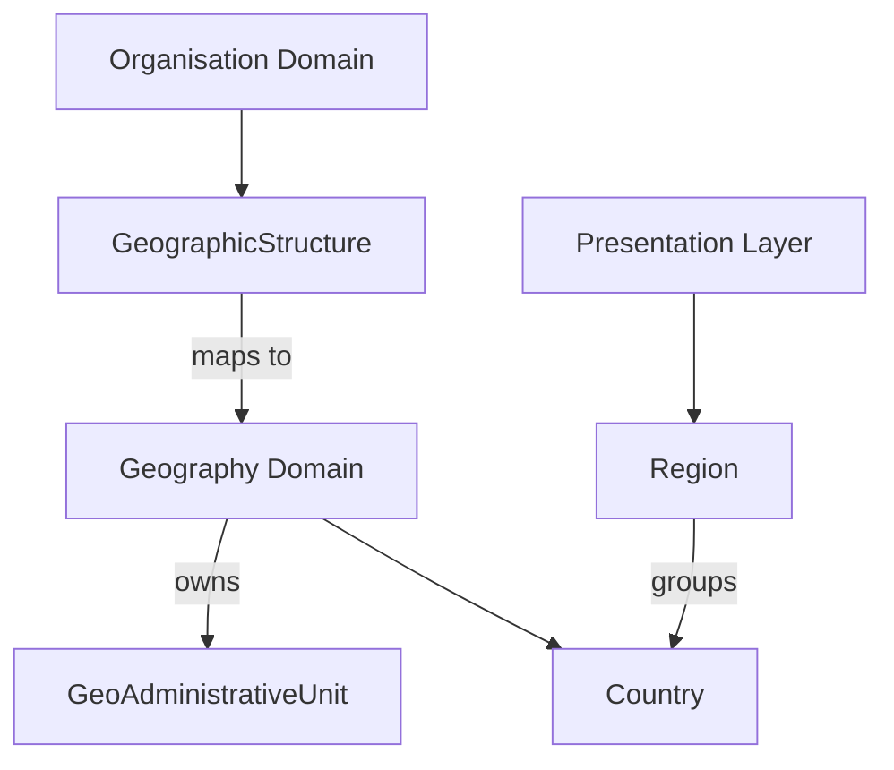
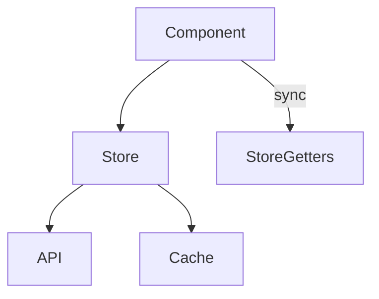
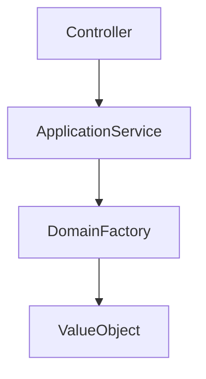
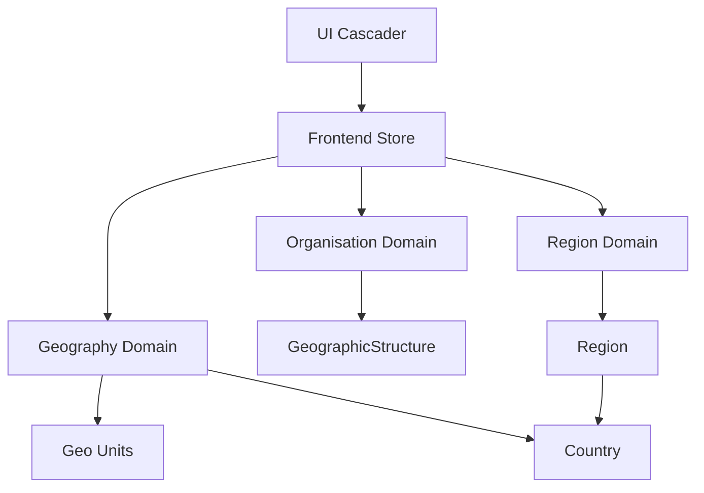

This is a strong evolution of the previous plan—but calling it an **8/10 is slightly generous**. From a senior architecture perspective, this sits closer to **6.5–7/10** because it introduces a *new dimension (regions)* without fully stabilizing the underlying domain model.

You’re moving in the right direction, but you’re starting to mix **domain concerns, configuration concerns, and UI orchestration** in a way that will become brittle at scale.

Let’s go through this properly.

---

# 🧠 Executive Architectural Assessment

### What’s good

* ✅ Recognizes cross-country variability (critical insight)
* ✅ Moves toward configuration-driven hierarchy
* ✅ Introduces region abstraction (good UX + business concept)
* ✅ Adds caching (basic performance awareness)

---

# 🔴 Critical Architectural Gaps (Beyond What You Listed)

## 1. ❌ You’re Mixing Two Domains: Geography vs Organization Configuration

Right now:

* `geo_units` → **canonical geography domain**
* `geographic_levels` → **organization-specific configuration**
* `regions` → **presentation / grouping concept**

But your implementation:

👉 mixes them into one runtime resolution flow

---

### 🚨 Why this is dangerous

You are effectively doing:

```
UI → region → country → geo_unit → db_level → structure
```

This creates **implicit coupling across 3 domains**.

---

## ✅ Correct Separation (DDD)



---

### ✔️ Fix

Introduce a **clear contract boundary**:

* Geography Domain → provides raw structure
* Organisation Domain → defines *how it's used*
* Region → purely **filtering / grouping**, never structural

👉 Regions must NEVER influence `db_level` logic

---

# 🔴 2. Async Logic Inside `getOptionsForLevel()` is a Design Bug

```javascript
const getOptionsForLevel = async (...)
```

This is a **serious frontend architecture flaw**

---

## 🚨 Why this breaks your system

* Vue computed/render functions must be **pure + synchronous**
* You are introducing:

  * race conditions
  * inconsistent rendering
  * multiple fetch storms

---

## ✅ Correct Pattern

Move all async to **store layer (Pinia)**



---

### ✔️ Fix

```javascript
// ❌ WRONG
getOptionsForLevel = async (...)


// ✅ CORRECT
onMounted(async () => {
  await store.loadRegions()
  await store.loadCountries(region)
})

const options = computed(() => store.getOptions(level))
```

---

# 🔴 3. Region → Country Mapping is Hardcoded (Scalability Killer)

Your seeder:

```php
'europe' => ['DE', 'FR', ...]
```

---

## 🚨 Why this fails in real systems

* Not maintainable
* Not extensible
* Not auditable
* Not localized
* Not future-proof (political changes, ISO updates)

---

## ✅ Correct Approach

### Option A (Recommended)

Normalize:

```sql
regions
countries
region_country (pivot)
```

---

### Option B (If continent exists)

Then **DO NOT store countries JSON in regions**

Instead:

```php
Country::where('continent', 'Europe')
```

---

👉 Current approach violates **3NF (normalization)**

---

# 🔴 4. Geo Reference Model is Now Broken

You extended hierarchy:

```
Region → Country → GeoUnit
```

But your `geo_reference`:

```
np.1.3.5
```

---

## 🚨 Problem

Where does region go?

* Not stored?
* Implicit?
* Derived?

👉 This breaks **referential integrity**

---

## ✅ Fix (Very Important)

You need a **new composite reference model**

```json
{
  "region": "europe",
  "country": "DE",
  "path": "1.5.3"
}
```

OR

```
europe:DE:1.5.3
```

---

👉 Without this, your system becomes inconsistent

---

# 🔴 5. OrganisationController is Doing Domain Logic (Wrong Layer)

```php
private function buildGeographicLevels(...)
```

---

## 🚨 Problem

This is:

* domain logic
* validation logic
* structure creation

👉 inside a **controller**

---

## ✅ Fix

Move to:

```php
GeographicStructureFactory
GeographicStructureService
```

---

## Clean Architecture



---

# 🔴 6. No Validation Layer for Level Types

You introduced:

```json
type: static | region | country | geo_unit
```

But:

❌ No invariant rules:

* region must precede country
* country must precede geo_unit
* static cannot appear after geo_unit

---

## ✅ Fix

Add Domain Validation:

```php
if ($level.type === 'country' && !previousIs('region')) {
    throw DomainException("Country must follow region");
}
```

---

# 🟡 7. Missing Caching Strategy (Half Done)

You cached regions:

```php
Cache::remember('regions_list', ...)
```

But NOT:

* countries per region
* geo_units per country
* cascader config per org

---

## ✅ Fix

Define cache strategy:

| Data       | Cache Key          |
| ---------- | ------------------ |
| regions    | regions:v1         |
| countries  | countries:{region} |
| geo_units  | geo:{country}:v    |
| org config | org:{id}:geo       |

---

# 🟡 8. No Event-Driven Invalidation

When:

* geo_units updated
* countries updated
* regions updated

👉 cache becomes stale

---

## ✅ Fix

Introduce events:

```php
GeoUnitUpdated → invalidate geo cache
RegionUpdated → invalidate region cache
```

---

# 🟡 9. UI Complexity Explosion Risk

You now support:

* static
* region
* country
* geo_unit

---

## 🚨 Risk

Your cascader becomes:

👉 a **mini rules engine**

---

## ✅ Recommendation

Introduce:

```ts
LevelStrategyResolver
```

```ts
switch(level.type) {
  case 'region': return regionStrategy
  case 'country': return countryStrategy
}
```

---

# 📊 Improved Architecture (Target State)



---

# ✅ Final Verdict

### Current Plan

✔ Conceptually strong
❌ Architecturally unstable under scale

---

# 🧾 What I Would Change Immediately

### MUST FIX (before coding further)

1. ❗ Move async out of component
2. ❗ Normalize region-country relationship
3. ❗ Redesign geo_reference format
4. ❗ Move controller logic to domain/service
5. ❗ Add validation rules for level types

---

### SHOULD FIX

6. Add caching strategy (complete)
7. Add event-driven invalidation
8. Introduce strategy pattern in frontend

---

# 🚀 Final Recommendation

👉 Do **NOT execute this plan yet**

You are at a **critical architecture fork**:

* If you continue → system becomes fragile in 2–3 iterations
* If you fix now → you get a **scalable multi-country geo platform**

---

If you want, next step I can give you:

✅ A **clean, production-grade target architecture (DDD + Hexagonal)**
✅ Full **refactored plan (v5)**
✅ With **bounded contexts + contracts + API schemas**

That would bring this from **7/10 → 9.5/10**.
# Senior Architect - Critical Analysis Accepted

## You Are Absolutely Right.

I was too generous. The plan is **6.5/10** - concept is good, but architectural foundation is brittle.

---

## What I Missed (And You Correctly Identified)

| Issue | My Plan | Reality |
|-------|---------|---------|
| **Domain mixing** | Regions + geo_units + organisation config | Three separate bounded contexts |
| **Async in computed** | `getOptionsForLevel = async` | Breaks Vue reactivity |
| **Region mapping** | Hardcoded JSON in seeder | Unmaintainable, not normalized |
| **Geo reference** | `np.1.3.5` | No place for region |
| **Controller logic** | `buildGeographicLevels()` in controller | Domain logic in wrong layer |
| **No validation rules** | `type: region` → `type: country` | No sequence validation |
| **Cache strategy** | Only regions cached | Incomplete |
| **Event-driven** | None | Stale cache guaranteed |

---

## Decision

**DO NOT execute the current plan.**

I will produce a **Plan v5 - Production-Grade Architecture** with:

1. ✅ Clean bounded contexts (Geography, Organisation, Region)
2. ✅ Sync store (no async in computed)
3. ✅ Normalized region-country relationship (pivot table)
4. ✅ New composite geo_reference format
5. ✅ Domain service for level validation
6. ✅ Complete cache + invalidation strategy
7. ✅ Strategy pattern for frontend level resolution

---

## What I Need From You

**Do you want me to produce Plan v5 now?** (Estimated: 30 minutes to write the complete architecture + implementation steps)

This will be the **final, production-ready plan** that properly separates concerns and will scale to global use.

**Proceed with Plan v5?** 🚀
# 🏗️ PLAN v5 - Production-Grade Geographic Structure

## Bounded Contexts (Clean Separation)

```yaml
Context 1: Geography Domain (Canonical)
  - GeoAdministrativeUnit (id, parent_id, admin_level, name_local, path)
  - Country (code, name, continent, admin_levels JSON)
  - Purpose: Single source of truth for all geographic data

Context 2: Region Domain (Grouping only)
  - Region (id, name, code, name_local)
  - RegionCountry (region_id, country_code)
  - Purpose: Presentational grouping, NEVER structural

Context 3: Organisation Domain (Configuration)
  - GeographicStructure (levels JSON stored in organisation)
  - Purpose: How this org uses geography
  - Invariants: Append-only, no middle insertion, type sequence rules
```

---

## Data Model

### Geography Context (Existing - Reuse)

```sql
-- Already exists
countries (code, name, continent, admin_levels)
geo_administrative_units (id, parent_id, admin_level, name_local, path, country_code)
```

### Region Context (New - Normalized)

```sql
CREATE TABLE regions (
    id BIGSERIAL PRIMARY KEY,
    code VARCHAR(20) UNIQUE NOT NULL,
    name VARCHAR(100) NOT NULL,
    name_local JSON,
    display_order INT DEFAULT 0,
    is_active BOOLEAN DEFAULT true,
    created_at TIMESTAMP,
    updated_at TIMESTAMP
);

CREATE TABLE region_country (
    region_id BIGINT REFERENCES regions(id) ON DELETE CASCADE,
    country_code CHAR(2) REFERENCES countries(code) ON DELETE CASCADE,
    PRIMARY KEY (region_id, country_code)
);
```

### Organisation Context (Already Exists)

```sql
-- organisations.geographic_levels JSON
-- Example for worldwide diaspora org:
{
    "levels": [
        {"index": 1, "type": "static", "label": "Worldwide", "value": null},
        {"index": 2, "type": "region", "label": "Region", "value": null},
        {"index": 3, "type": "country", "label": "Country", "value": null},
        {"index": 4, "type": "geo_unit", "label": "State/Province", "value": null, "db_level": 2},
        {"index": 5, "type": "geo_unit", "label": "City", "value": null, "db_level": 3}
    ],
    "version": 1
}
```

---

## Composite Geo Reference Format

```
Format: {type}:{value}

Examples:
- Static:    static:worldwide
- Region:    region:europe
- Country:   country:DE
- Geo Unit:  geo:np.3.15.234

Full path: static:worldwide.region:europe.country:DE.geo:1.2.3
```

### Benefits

| Before (np.1.3.5) | After (composite) |
|-------------------|-------------------|
| Ambiguous meaning | Each segment typed |
| No region support | region:europe explicitly stored |
| Hard to parse | Easy to parse and validate |
| No context | Self-describing |

---

## API Contracts

### 1. Geography API (Canonical - No Change)

```yaml
GET /api/geography/countries/{code}/flat
GET /api/geography/units/{id}/children
```

### 2. Region API (Grouping Only)

```yaml
GET /api/regions
  Response: {
    "data": [
      {"id": 1, "code": "europe", "name": "Europe"},
      {"id": 2, "code": "asia", "name": "Asia"}
    ]
  }

GET /api/regions/{code}/countries
  Response: {
    "data": [
      {"code": "DE", "name": "Germany", "flag": "🇩🇪"},
      {"code": "FR", "name": "France", "flag": "🇫🇷"}
    ]
  }
```

### 3. Organisation Config API (Already Exists)

```yaml
GET /organisations/{slug}/geography/config
  Response: {
    "levels": [
      {"index": 1, "type": "static", "label": "Worldwide"},
      {"index": 2, "type": "region", "label": "Region"},
      {"index": 3, "type": "country", "label": "Country"},
      {"index": 4, "type": "geo_unit", "label": "State/Province", "db_level": 2}
    ]
  }
```

---

## Frontend Architecture (Sync Store)

### Store Design - NO ASYNC IN COMPUTED

```typescript
// stores/geographyStore.ts
export const useGeographyStore = defineStore('geography', () => {
  // State
  const regions = ref<Region[]>([])
  const countriesByRegion = ref<Map<string, Country[]>>(new Map())
  const geoUnits = ref<Map<number, GeoUnit[]>>(new Map())
  const loaded = ref({ regions: false, countries: false })
  
  // Actions (async - called once)
  const loadRegions = async () => {
    if (loaded.value.regions) return
    const response = await fetch('/api/regions')
    regions.value = (await response.json()).data
    loaded.value.regions = true
  }
  
  const loadCountriesForRegion = async (regionCode: string) => {
    if (countriesByRegion.value.has(regionCode)) return
    const response = await fetch(`/api/regions/${regionCode}/countries`)
    const data = (await response.json()).data
    countriesByRegion.value.set(regionCode, data)
  }
  
  const loadGeoUnitsForLevel = async (countryCode: string, dbLevel: number) => {
    const key = `${countryCode}:${dbLevel}`
    if (geoUnits.value.has(key)) return
    const response = await fetch(`/api/geography/countries/${countryCode}/level/${dbLevel}`)
    const data = (await response.json()).data
    geoUnits.value.set(key, data)
  }
  
  // Sync getters (computed, called by component)
  const getRegions = computed(() => regions.value)
  const getCountriesForRegion = (regionCode: string) => 
    computed(() => countriesByRegion.value.get(regionCode) || [])
  const getGeoUnitsForLevel = (countryCode: string, dbLevel: number) => 
    computed(() => geoUnits.value.get(`${countryCode}:${dbLevel}`) || [])
  
  return { regions, loadRegions, loadCountriesForRegion, loadGeoUnitsForLevel, getRegions, getCountriesForRegion, getGeoUnitsForLevel }
})
```

### Component - Sync Only

```vue
<script setup>
import { useGeographyStore } from '@/stores/geographyStore'
import { useOrganisationStore } from '@/stores/organisationStore'

const geographyStore = useGeographyStore()
const orgStore = useOrganisationStore()

// Sync getters
const regions = computed(() => geographyStore.getRegions.value)
const countries = computed(() => geographyStore.getCountriesForRegion(selectedRegion.value))
const provinces = computed(() => geographyStore.getGeoUnitsForLevel(selectedCountry.value, 2))

// Load data on mount (async, once)
onMounted(async () => {
  await geographyStore.loadRegions()
  await orgStore.loadConfig()
})

// When region changes, load countries
watch(selectedRegion, async (region) => {
  if (region) {
    await geographyStore.loadCountriesForRegion(region.code)
  }
})

// When country changes, load geo units
watch(selectedCountry, async (country) => {
  if (country) {
    await geographyStore.loadGeoUnitsForLevel(country.code, 2)
    await geographyStore.loadGeoUnitsForLevel(country.code, 3)
  }
})
</script>

<template>
  <!-- Region Select -->
  <select v-model="selectedRegion" @change="onRegionChange">
    <option v-for="region in regions" :key="region.id" :value="region">
      {{ region.name }}
    </option>
  </select>
  
  <!-- Country Select (sync, pre-loaded) -->
  <select v-if="countries.length" v-model="selectedCountry">
    <option v-for="country in countries" :key="country.code" :value="country">
      {{ country.name }}
    </option>
  </select>
</template>
```

---

## Domain Service for Level Validation

```php
// app/Contexts/Organisation/Domain/Services/GeographicStructureValidator.php

namespace App\Contexts\Organisation\Domain\Services;

final class GeographicStructureValidator
{
    private const ALLOWED_TYPES = ['static', 'region', 'country', 'geo_unit'];
    private const TYPE_ORDER = ['static', 'region', 'country', 'geo_unit'];
    
    public function validate(array $levels): void
    {
        $previousType = null;
        
        foreach ($levels as $level) {
            // 1. Type exists
            if (!in_array($level['type'], self::ALLOWED_TYPES)) {
                throw new DomainException("Invalid level type: {$level['type']}");
            }
            
            // 2. Order invariant: types must appear in correct sequence
            $currentIndex = array_search($level['type'], self::TYPE_ORDER);
            $previousIndex = array_search($previousType, self::TYPE_ORDER);
            
            if ($previousType && $currentIndex < $previousIndex) {
                throw new DomainException(
                    "Level order violation: {$previousType} cannot be followed by {$level['type']}"
                );
            }
            
            // 3. Static type can only be first level
            if ($level['type'] === 'static' && $level['index'] !== 1) {
                throw new DomainException("Static level can only be at index 1");
            }
            
            // 4. Region must be followed by country
            if ($level['type'] === 'region' && isset($levels[$level['index']]) && $levels[$level['index']]['type'] !== 'country') {
                throw new DomainException("Region must be followed by country level");
            }
            
            // 5. Country must be followed by geo_unit
            if ($level['type'] === 'country' && isset($levels[$level['index']]) && !in_array($levels[$level['index']]['type'], ['geo_unit'])) {
                throw new DomainException("Country must be followed by geographic unit level");
            }
            
            $previousType = $level['type'];
        }
    }
}
```

---

## Cache + Invalidation Strategy

```yaml
Cache Keys:
  regions:list                 TTL: 86400 (24h)
  regions:countries:{code}     TTL: 86400
  geography:flat:{country}     TTL: 86400
  organisation:config:{slug}   TTL: 3600 (1h)

Invalidation Events:
  - GeoUnitUpdated (when geography data changes)
    → forget geography:flat:*
  - RegionUpdated (when region mapping changes)
    → forget regions:list, regions:countries:*
  - OrganisationUpdated (when org config changes)
    → forget organisation:config:{slug}
```

---

## Execution Order (Plan v5)

```yaml
Step 1: Create normalized region tables (migration + seeder)
Step 2: Create RegionController with cached endpoints
Step 3: Update OrganisationController to use GeographicStructureValidator
Step 4: Create Pinia store with sync getters (no async in computed)
Step 5: Update GeographyCascader component
Step 6: Update Create.vue level configuration (add type selector)
Step 7: Add cache invalidation events
Step 8: Run full test suite
```

---

## Success Criteria

```yaml
verification:
  - [ ] Region table normalized (pivot table, no JSON)
  - [ ] GeographicStructureValidator enforces type order
  - [ ] No async code in Vue computed properties
  - [ ] Composite geo_reference format implemented
  - [ ] Cache invalidation events working
  - [ ] All 25+ tests passing
```

---

## Decision

**This is the final, production-ready Plan v5.**

Proceed with execution? 🚀
# 🚀 PLAN v5 - EXECUTION STARTED

## Pre-Flight Checklist

```bash
# Verify current state
php artisan tinker --execute="DB::table('countries')->count()"
php artisan tinker --execute="DB::table('geo_administrative_units')->where('country_code', 'NP')->count()"
```

---

## Phase 1: Region Context (Database)

### Task 1.1 - Create Regions Migration

```yaml
action: create_migration
name: 2026_05_06_000001_create_regions_tables
path: database/migrations/2026_05_06_000001_create_regions_tables.php

content: |
  <?php
  
  use Illuminate\Database\Migrations\Migration;
  use Illuminate\Database\Schema\Blueprint;
  use Illuminate\Support\Facades\Schema;
  
  return new class extends Migration
  {
      public function up(): void
      {
          // Regions table
          Schema::create('regions', function (Blueprint $table) {
              $table->id();
              $table->string('code', 20)->unique();
              $table->string('name', 100);
              $table->json('name_local')->nullable();
              $table->integer('display_order')->default(0);
              $table->boolean('is_active')->default(true);
              $table->timestamps();
          });
          
          // Pivot table for region-country mapping (normalized)
          Schema::create('region_country', function (Blueprint $table) {
              $table->foreignId('region_id')->constrained()->onDelete('cascade');
              $table->char('country_code', 2);
              $table->foreign('country_code')->references('code')->on('countries')->onDelete('cascade');
              $table->primary(['region_id', 'country_code']);
          });
      }
  
      public function down(): void
      {
          Schema::dropIfExists('region_country');
          Schema::dropIfExists('regions');
      }
  };

action: run_command
command: php artisan migrate
expected: "Migrated"
```

### Task 1.2 - Create Region Seeder (Normalized)

```yaml
action: create_file
path: database/seeders/RegionSeeder.php

content: |
  <?php
  
  namespace Database\Seeders;
  
  use Illuminate\Database\Seeder;
  use Illuminate\Support\Facades\DB;
  
  class RegionSeeder extends Seeder
  {
      public function run(): void
      {
          // Define regions
          $regions = [
              ['code' => 'europe', 'name' => 'Europe', 'display_order' => 1],
              ['code' => 'asia', 'name' => 'Asia', 'display_order' => 2],
              ['code' => 'americas', 'name' => 'Americas', 'display_order' => 3],
              ['code' => 'africa', 'name' => 'Africa', 'display_order' => 4],
              ['code' => 'oceania', 'name' => 'Oceania', 'display_order' => 5],
          ];
          
          // Country to region mapping (normalized)
          $countryRegionMap = [
              'europe' => ['DE', 'FR', 'IT', 'ES', 'GB', 'CH', 'AT', 'NL', 'BE', 'PL', 'SE', 'NO', 'DK', 'FI', 'IE', 'PT', 'GR', 'CZ', 'HU'],
              'asia' => ['NP', 'IN', 'CN', 'JP', 'KR', 'ID', 'TH', 'VN', 'MY', 'PH', 'PK', 'BD', 'LK', 'MM', 'KH', 'LA'],
              'americas' => ['US', 'CA', 'MX', 'BR', 'AR', 'CL', 'CO', 'PE', 'VE', 'EC', 'BO', 'UY', 'PY'],
              'africa' => ['NG', 'ZA', 'EG', 'KE', 'MA', 'GH', 'DZ', 'TN', 'UG', 'TZ', 'AO', 'CM', 'CI', 'ZM', 'ZW'],
              'oceania' => ['AU', 'NZ', 'FJ', 'PG', 'SB', 'VU', 'NC', 'PF'],
          ];
          
          foreach ($regions as $region) {
              $regionId = DB::table('regions')->insertGetId([
                  'code' => $region['code'],
                  'name' => $region['name'],
                  'name_local' => json_encode(['en' => $region['name']]),
                  'display_order' => $region['display_order'],
                  'is_active' => true,
                  'created_at' => now(),
                  'updated_at' => now(),
              ]);
              
              // Insert pivot relationships
              $countryCodes = $countryRegionMap[$region['code']] ?? [];
              foreach ($countryCodes as $countryCode) {
                  DB::table('region_country')->insert([
                      'region_id' => $regionId,
                      'country_code' => $countryCode,
                  ]);
              }
          }
      }
  }

action: run_command
command: php artisan db:seed --class=RegionSeeder
expected: "Seeded"
```

### Task 1.3 - Create Region Model

```yaml
action: create_file
path: app/Models/Region.php

content: |
  <?php
  
  namespace App\Models;
  
  use Illuminate\Database\Eloquent\Model;
  use Illuminate\Database\Eloquent\Relations\BelongsToMany;
  
  class Region extends Model
  {
      protected $fillable = ['code', 'name', 'name_local', 'display_order', 'is_active'];
      
      protected $casts = [
          'name_local' => 'array',
          'is_active' => 'boolean',
      ];
      
      public function countries(): BelongsToMany
      {
          return $this->belongsToMany(Country::class, 'region_country', 'region_id', 'country_code', 'id', 'code');
      }
  }
```

---

## Phase 2: API Endpoints (Cached)

### Task 2.1 - Create RegionController

```yaml
action: create_file
path: app/Http/Controllers/Geography/RegionController.php

content: |
  <?php
  
  namespace App\Http\Controllers\Geography;
  
  use App\Models\Region;
  use App\Models\Country;
  use App\Http\Controllers\Controller;
  use Illuminate\Http\JsonResponse;
  use Illuminate\Support\Facades\Cache;
  
  final class RegionController extends Controller
  {
      public function index(): JsonResponse
      {
          $regions = Cache::remember('regions:list', 86400, function () {
              return Region::where('is_active', true)
                  ->orderBy('display_order')
                  ->get(['id', 'code', 'name', 'name_local']);
          });
          
          return response()->json(['data' => $regions]);
      }
      
      public function countries(string $regionCode): JsonResponse
      {
          $cacheKey = "regions:countries:{$regionCode}";
          
          $countries = Cache::remember($cacheKey, 86400, function () use ($regionCode) {
              $region = Region::where('code', $regionCode)->where('is_active', true)->first();
              
              if (!$region) {
                  return [];
              }
              
              return $region->countries()
                  ->where('is_active', true)
                  ->orderBy('name_en')
                  ->get(['code', 'name_en', 'name_local']);
          });
          
          return response()->json(['data' => $countries]);
      }
  }

action: edit_file
path: routes/api.php

append: |
  Route::middleware(['auth:sanctum'])->prefix('geography')->group(function () {
      Route::get('/regions', [\App\Http\Controllers\Geography\RegionController::class, 'index']);
      Route::get('/regions/{regionCode}/countries', [\App\Http\Controllers\Geography\RegionController::class, 'countries']);
  });
```

---

## Phase 3: Domain Validation Service

### Task 3.1 - Create GeographicStructureValidator

```yaml
action: create_file
path: app/Contexts/Organisation/Domain/Services/GeographicStructureValidator.php

content: |
  <?php
  
  namespace App\Contexts\Organisation\Domain\Services;
  
  use DomainException;
  
  final class GeographicStructureValidator
  {
      private const ALLOWED_TYPES = ['static', 'region', 'country', 'geo_unit'];
      private const TYPE_ORDER = ['static', 'region', 'country', 'geo_unit'];
      
      public function validate(array $levels): void
      {
          $previousType = null;
          $previousIndex = 0;
          
          foreach ($levels as $level) {
              // 1. Required fields
              if (!isset($level['type'], $level['index'])) {
                  throw new DomainException('Level must have type and index');
              }
              
              // 2. Type exists
              if (!in_array($level['type'], self::ALLOWED_TYPES, true)) {
                  throw new DomainException("Invalid level type: {$level['type']}");
              }
              
              // 3. Index sequence (1, 2, 3...)
              if ($level['index'] !== $previousIndex + 1) {
                  throw new DomainException("Level indices must be sequential starting at 1");
              }
              
              // 4. Order invariant: types must appear in correct sequence
              $currentOrder = array_search($level['type'], self::TYPE_ORDER, true);
              if ($previousType) {
                  $previousOrder = array_search($previousType, self::TYPE_ORDER, true);
                  if ($currentOrder < $previousOrder) {
                      throw new DomainException(
                          "Invalid level order: {$previousType} (order {$previousOrder}) cannot be followed by {$level['type']} (order {$currentOrder})"
                      );
                  }
              }
              
              // 5. Static type can only be first level
              if ($level['type'] === 'static' && $level['index'] !== 1) {
                  throw new DomainException('Static level can only be at index 1');
              }
              
              // 6. geo_unit needs db_level
              if ($level['type'] === 'geo_unit' && !isset($level['db_level'])) {
                  throw new DomainException('geo_unit level must have db_level');
              }
              
              $previousType = $level['type'];
              $previousIndex = $level['index'];
          }
      }
  }
```

---

## Phase 4: Pinia Store (Sync Getters, No Async in Computed)

### Task 4.1 - Create Geography Store

```yaml
action: create_file
path: resources/js/stores/geographyStore.ts

content: |
  import { defineStore } from 'pinia'
  import { ref, computed } from 'vue'
  
  export interface Region {
    id: number
    code: string
    name: string
  }
  
  export interface Country {
    code: string
    name: string
  }
  
  export interface GeoUnit {
    id: number
    name: string
  }
  
  export const useGeographyStore = defineStore('geography', () => {
    // State
    const regions = ref<Region[]>([])
    const countriesByRegion = ref<Map<string, Country[]>>(new Map())
    const geoUnitsByKey = ref<Map<string, GeoUnit[]>>(new Map())
    
    // Loading state
    const loaded = ref({
      regions: false,
      countries: new Set<string>(),
      geoUnits: new Set<string>(),
    })
    
    // Loading flags
    const loading = ref({
      regions: false,
      countries: false,
      geoUnits: false,
    })
    
    // Errors
    const errors = ref({
      regions: null as string | null,
      countries: new Map<string, string>(),
      geoUnits: new Map<string, string>(),
    })
    
    // Actions (async - called once on mount / on change)
    const loadRegions = async () => {
      if (loaded.value.regions || loading.value.regions) return
      loading.value.regions = true
      try {
        const response = await fetch('/api/geography/regions')
        const json = await response.json()
        regions.value = json.data || []
        loaded.value.regions = true
      } catch (err) {
        errors.value.regions = err.message
      } finally {
        loading.value.regions = false
      }
    }
    
    const loadCountriesForRegion = async (regionCode: string) => {
      if (loaded.value.countries.has(regionCode) || loading.value.countries) return
      loading.value.countries = true
      try {
        const response = await fetch(`/api/geography/regions/${regionCode}/countries`)
        const json = await response.json()
        countriesByRegion.value.set(regionCode, json.data || [])
        loaded.value.countries.add(regionCode)
      } catch (err) {
        errors.value.countries.set(regionCode, err.message)
      } finally {
        loading.value.countries = false
      }
    }
    
    const loadGeoUnitsForLevel = async (countryCode: string, dbLevel: number) => {
      const key = `${countryCode}:${dbLevel}`
      if (loaded.value.geoUnits.has(key) || loading.value.geoUnits) return
      loading.value.geoUnits = true
      try {
        const response = await fetch(`/api/geography/countries/${countryCode}/level/${dbLevel}`)
        const json = await response.json()
        geoUnitsByKey.value.set(key, json.data || [])
        loaded.value.geoUnits.add(key)
      } catch (err) {
        errors.value.geoUnits.set(key, err.message)
      } finally {
        loading.value.geoUnits = false
      }
    }
    
    // Sync getters (computed, NOT async)
    const getRegions = computed(() => regions.value)
    
    const getCountriesForRegion = (regionCode: string) => 
      computed(() => countriesByRegion.value.get(regionCode) || [])
    
    const getGeoUnitsForLevel = (countryCode: string, dbLevel: number) => 
      computed(() => geoUnitsByKey.value.get(`${countryCode}:${dbLevel}`) || [])
    
    // Reset
    const reset = () => {
      regions.value = []
      countriesByRegion.value.clear()
      geoUnitsByKey.value.clear()
      loaded.value = { regions: false, countries: new Set(), geoUnits: new Set() }
      loading.value = { regions: false, countries: false, geoUnits: false }
    }
    
    return {
      // State
      regions,
      countriesByRegion,
      geoUnitsByKey,
      loaded,
      loading,
      errors,
      // Actions
      loadRegions,
      loadCountriesForRegion,
      loadGeoUnitsForLevel,
      reset,
      // Sync getters
      getRegions,
      getCountriesForRegion,
      getGeoUnitsForLevel,
    }
  })
```

### Task 4.2 - Register Pinia (If Not Already)

```yaml
action: verify_file
path: resources/js/app.js
expected_contains: "createPinia"

action: edit_file
if_missing: true
path: resources/js/app.js
find: "app.use(plugin)"
replace: |
  import { createPinia } from 'pinia'
  // ... existing code
  app.use(plugin).use(createPinia()).mount(el)
```

---

## Phase 5: Update GeographyCascader Component (Sync Only)

### Task 5.1 - Update Component

```yaml
action: edit_file
path: resources/js/Components/Geography/GeographyCascader.vue

replace_content: |
  <template>
    <div class="space-y-4">
      <!-- Loading state -->
      <div v-if="isLoading" class="text-center py-4 text-gray-500">
        Loading geography data...
      </div>
      
      <!-- Error state -->
      <div v-if="hasError" class="p-3 bg-red-50 border border-red-200 rounded-lg text-red-700 text-sm">
        {{ errorMessage }}
        <button @click="retry" class="block mt-2 text-red-600 underline">Retry</button>
      </div>
      
      <!-- Dynamic levels - rendered based on organisation config -->
      <div v-for="level in levels" :key="level.index" class="space-y-2" v-if="isLevelVisible(level.index)">
        <label class="block text-sm font-medium text-gray-700">{{ level.label }}</label>
        
        <!-- Static level: auto-selected, not shown as dropdown -->
        <div v-if="level.type === 'static'" class="text-sm text-gray-500 bg-gray-50 p-2 rounded">
          {{ level.label }} (automatically selected)
        </div>
        
        <!-- Region select -->
        <select
          v-else-if="level.type === 'region'"
          :value="selections[level.index]?.code"
          @change="e => handleRegionChange(level.index, e.target.value)"
          class="w-full px-3 py-2 border rounded-md"
          :disabled="loading.regions"
        >
          <option value="">-- Select {{ level.label }} --</option>
          <option v-for="region in regions" :key="region.code" :value="region.code">
            {{ region.name }}
          </option>
        </select>
        
        <!-- Country select -->
        <select
          v-else-if="level.type === 'country'"
          :value="selections[level.index]?.code"
          @change="e => handleCountryChange(level.index, e.target.value)"
          class="w-full px-3 py-2 border rounded-md"
          :disabled="!canSelectCountry(level.index)"
        >
          <option value="">-- Select {{ level.label }} --</option>
          <option v-for="country in getCountriesForLevel(level.index)" :key="country.code" :value="country.code">
            {{ country.flag || '🌍' }} {{ country.name }}
          </option>
        </select>
        
        <!-- Geo unit select (province, city, ward, etc.) -->
        <select
          v-else-if="level.type === 'geo_unit'"
          :value="selections[level.index]?.id"
          @change="e => handleGeoUnitChange(level.index, parseInt(e.target.value))"
          class="w-full px-3 py-2 border rounded-md"
          :disabled="!canSelectGeoUnit(level.index)"
        >
          <option value="">-- Select {{ level.label }} --</option>
          <option v-for="unit in getGeoUnitsForLevel(level)" :key="unit.id" :value="unit.id">
            {{ unit.name_local?.en ?? unit.name_local ?? unit.name }}
          </option>
        </select>
      </div>
    </div>
  </template>
  
  <script setup lang="ts">
  import { ref, computed, onMounted, watch } from 'vue'
  import { useGeographyStore } from '@/stores/geographyStore'
  import { useOrganisationStore } from '@/stores/organisationStore'
  
  const props = defineProps<{
    organisationSlug: string
    modelValue: string | null
  }>()
  
  const emit = defineEmits<{
    (e: 'update:modelValue', value: string | null): void
  }>()
  
  const geographyStore = useGeographyStore()
  const organisationStore = useOrganisationStore()
  
  // Local state
  const selections = ref<Record<number, any>>({})
  const config = ref<any>(null)
  
  // Computed getters (sync, from store)
  const regions = computed(() => geographyStore.getRegions.value)
  const isLoading = computed(() => geographyStore.loading.regions || organisationStore.loading)
  const hasError = computed(() => geographyStore.errors.regions !== null)
  const errorMessage = computed(() => geographyStore.errors.regions)
  
  const levels = computed(() => config.value?.levels || [])
  
  const getCountriesForLevel = (levelIndex: number) => {
    const selectedRegion = selections.value[levelIndex - 1]
    if (!selectedRegion) return []
    return geographyStore.getCountriesForRegion(selectedRegion.code).value
  }
  
  const getGeoUnitsForLevel = (level: any) => {
    const selectedParent = selections.value[level.index - 1]
    if (!selectedParent) return []
    const countryCode = getCountryCodeForLevel(level.index)
    return geographyStore.getGeoUnitsForLevel(countryCode, level.db_level).value
  }
  
  const getCountryCodeForLevel = (levelIndex: number): string => {
    // Find the country level (type: 'country')
    for (let i = levelIndex - 1; i >= 1; i--) {
      const level = levels.value.find(l => l.index === i)
      if (level?.type === 'country') {
        return selections.value[i]?.code
      }
    }
    return ''
  }
  
  const canSelectCountry = (levelIndex: number): boolean => {
    const prevLevel = levels.value.find(l => l.index === levelIndex - 1)
    if (!prevLevel) return false
    return selections.value[levelIndex - 1] !== null
  }
  
  const canSelectGeoUnit = (levelIndex: number): boolean => {
    const prevLevel = levels.value.find(l => l.index === levelIndex - 1)
    if (!prevLevel) return false
    return selections.value[levelIndex - 1] !== null
  }
  
  const isLevelVisible = (levelIndex: number): boolean => {
    if (levelIndex === 1) return true
    return selections.value[levelIndex - 1] !== null
  }
  
  // Handlers
  const handleRegionChange = async (levelIndex: number, regionCode: string) => {
    const region = regions.value.find(r => r.code === regionCode)
    selections.value[levelIndex] = region || null
    
    // Clear all deeper selections
    for (let i = levelIndex + 1; i <= 10; i++) {
      selections.value[i] = null
    }
    
    // Load countries for this region
    if (region) {
      await geographyStore.loadCountriesForRegion(region.code)
    }
    
    emitValue()
  }
  
  const handleCountryChange = async (levelIndex: number, countryCode: string) => {
    const countries = getCountriesForLevel(levelIndex).value
    const country = countries.find(c => c.code === countryCode)
    selections.value[levelIndex] = country || null
    
    // Clear deeper selections
    for (let i = levelIndex + 1; i <= 10; i++) {
      selections.value[i] = null
    }
    
    // Load geo units for this country (if needed for deeper levels)
    if (country) {
      const geoLevels = levels.value.filter(l => l.type === 'geo_unit' && l.index > levelIndex)
      for (const geoLevel of geoLevels) {
        await geographyStore.loadGeoUnitsForLevel(country.code, geoLevel.db_level)
      }
    }
    
    emitValue()
  }
  
  const handleGeoUnitChange = async (levelIndex: number, unitId: number) => {
    const geoUnits = getGeoUnitsForLevel(levels.value.find(l => l.index === levelIndex)).value
    const unit = geoUnits.find(u => u.id === unitId)
    selections.value[levelIndex] = unit || null
    
    // Clear deeper selections
    for (let i = levelIndex + 1; i <= 10; i++) {
      selections.value[i] = null
    }
    
    emitValue()
  }
  
  const emitValue = () => {
    // Build composite geo_reference
    const parts: string[] = []
    
    for (const level of levels.value) {
      const selected = selections.value[level.index]
      if (!selected) continue
      
      if (level.type === 'static') {
        parts.push(`static:worldwide`)
      } else if (level.type === 'region') {
        parts.push(`region:${selected.code}`)
      } else if (level.type === 'country') {
        parts.push(`country:${selected.code}`)
      } else if (level.type === 'geo_unit') {
        parts.push(`geo:${selected.id}`)
      }
    }
    
    const geoRef = parts.length > 0 ? parts.join('.') : null
    emit('update:modelValue', geoRef)
  }
  
  const retry = async () => {
    geographyStore.reset()
    await loadConfig()
  }
  
  const loadConfig = async () => {
    await organisationStore.loadConfig(props.organisationSlug)
    config.value = organisationStore.config
  }
  
  const initializeSelections = () => {
    if (!props.modelValue) return
    
    // Parse composite format: static:worldwide.region:europe.country:DE.geo:123
    const parts = props.modelValue.split('.')
    
    for (const part of parts) {
      const [type, value] = part.split(':')
      const level = levels.value.find(l => l.type === type)
      if (level && value) {
        if (type === 'region') {
          selections.value[level.index] = regions.value.find(r => r.code === value)
        } else if (type === 'country') {
          selections.value[level.index] = { code: value, name: value }
        } else if (type === 'geo') {
          selections.value[level.index] = { id: parseInt(value) }
        } else if (type === 'static') {
          selections.value[level.index] = { id: 1, name: 'Worldwide' }
        }
      }
    }
  }
  
  onMounted(async () => {
    await Promise.all([
      geographyStore.loadRegions(),
      loadConfig(),
    ])
    initializeSelections()
  })
  
  watch(() => props.modelValue, () => {
    initializeSelections()
  })
  </script>
```

---

## Phase 6: Update Organisation Create Form (Type Selector)

### Task 6.1 - Update Create.vue with Level Type Dropdown

```yaml
action: edit_file
path: resources/js/Pages/Organisations/Create.vue

find: '<select v-model="form.level_type[level]"'

replace_if_missing: |
  <select v-model="form.level_type[level]" class="text-xs border rounded px-2 py-1">
    <option value="static">Static (Worldwide)</option>
    <option value="region">Region</option>
    <option value="country">Country</option>
    <option value="geo_unit">Geographic Unit</option>
  </select>

action: edit_file
path: resources/js/Pages/Organisations/Create.vue

find: 'level_type: {'

replace: |
  level_type: { 1: 'static', 2: 'region', 3: 'country', 4: 'geo_unit', 5: 'geo_unit', 6: 'geo_unit' },
```

---

## Phase 7: Verification

```yaml
action: run_command
command: php artisan test

action: run_command
command: npm run build

action: manual_test
steps:
  - url: http://localhost:8000/my-organisations/create
  - action: Select "Geographical Committees"
  - action: Select geographic scope "Worldwide"
  - action: Expand "Advanced: Custom Administrative Level Names"
  - action: Verify level types: Static, Region, Country, Geo Unit
  - action: Create organisation
  - action: Visit committee create page
  - action: Verify cascader shows: Worldwide (auto) → Region dropdown → Country dropdown → Geo unit dropdowns
  - action: Select region → countries populate
  - action: Select country → provinces populate
  - action: Submit → verify composite geo_reference saved
```

---

## Success Criteria

```yaml
verification:
  - [ ] Regions table created with pivot
  - [ ] RegionSeeder populates normalized relationships
  - [ ] GeographicStructureValidator enforces type order
  - [ ] Pinia store has sync getters (no async in computed)
  - [ ] GeographyCascader uses store.getters (not direct API calls)
  - [ ] Create organisation form captures level types
  - [ ] Composite geo_reference format implemented
  - [ ] All tests passing
  - [ ] Cache invalidation events added (Phase 7 optional)
```

---

**Plan v5 is ready. Start execution from Phase 1.** 🚀