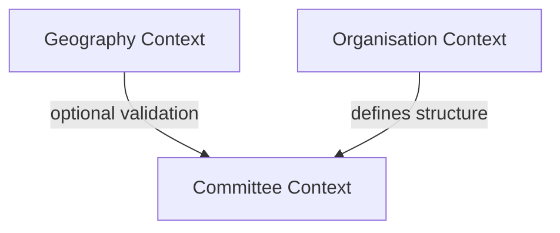
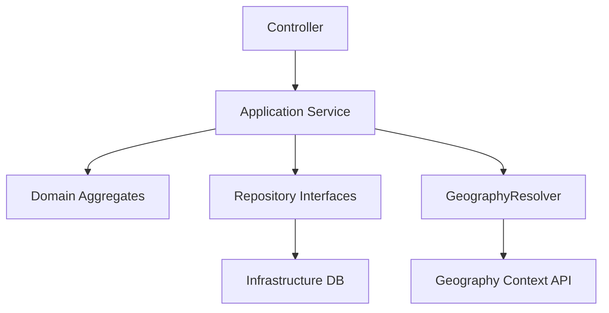
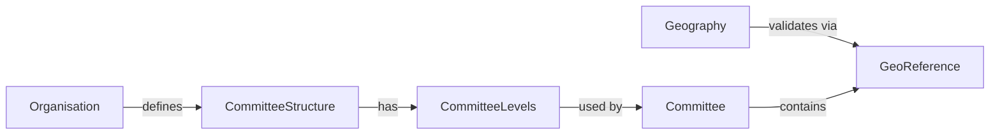

in one side i have geo units . these can be represented by 0 to 10 . These units can have different names based on the organisation. The units can be natural administrative units within a country or may  be named soemthing else.  In other sides there are corresponding committees. they may be named diferently at different organisation.  Should we work on Committee Setup Controller and process before creating commitee ? . Currently I have tried to apply natural geo administraive units as committee geo units  and common names like central committee , district commitee , student wings woman wings etc as commitee names. 
We need a kind of flexible settings so that each committee is independet and can set names of the commitee and corresponding geo units first and then can create comittees at any level 

Please review this answer : 
Good — this is exactly the point where getting the aggregates right will either unlock your system or trap it in accidental complexity.

Below is a **clean DDD + hexagonal design** for your case, explicitly separating:

* **Geography (reference context)**
* **Organisation Structure (configurable)**
* **Committee (runtime aggregate)**

---

# 🧠 1. Bounded Contexts Overview



---

# 🧱 2. Aggregates (Core Design)

## 🟦 A. CommitteeStructure (Aggregate Root)

> Defines how an organisation structures committees

```php
final class CommitteeStructure
{
    private OrganisationId $organisationId;

    /** @var CommitteeLevel[] */
    private array $levels;

    private function __construct(OrganisationId $organisationId, array $levels)
    {
        $this->organisationId = $organisationId;
        $this->levels = $levels;

        $this->assertValid();
    }

    public static function create(OrganisationId $organisationId, array $levels): self
    {
        return new self($organisationId, $levels);
    }

    public function getLevel(int $index): CommitteeLevel
    {
        foreach ($this->levels as $level) {
            if ($level->index() === $index) {
                return $level;
            }
        }

        throw new \DomainException("Level {$index} not found");
    }

    public function levels(): array
    {
        return $this->levels;
    }

    private function assertValid(): void
    {
        $indexes = array_map(fn($l) => $l->index(), $this->levels);

        if (count($indexes) !== count(array_unique($indexes))) {
            throw new \DomainException("Duplicate level indexes");
        }

        if (empty($this->levels)) {
            throw new \DomainException("At least one level required");
        }
    }
}
```

---

## 🟩 B. CommitteeLevel (Value Object)

```php
final class CommitteeLevel
{
    public function __construct(
        private int $index,
        private string $name,
        private ?int $geoLevel,      // maps to admin_level (optional)
        private bool $requiresGeo
    ) {
        if ($index < 1 || $index > 10) {
            throw new \InvalidArgumentException("Level index must be 1–10");
        }
    }

    public function index(): int { return $this->index; }
    public function name(): string { return $this->name; }
    public function geoLevel(): ?int { return $this->geoLevel; }
    public function requiresGeo(): bool { return $this->requiresGeo; }
}
```

---

## 🟥 C. Committee (Aggregate Root)

> Runtime entity created by users

```php
final class Committee
{
    private CommitteeId $id;
    private OrganisationId $organisationId;

    private int $levelIndex;
    private string $name;

    private ?GeoReference $geoReference;

    private function __construct(
        CommitteeId $id,
        OrganisationId $organisationId,
        int $levelIndex,
        string $name,
        ?GeoReference $geoReference
    ) {
        $this->id = $id;
        $this->organisationId = $organisationId;
        $this->levelIndex = $levelIndex;
        $this->name = $name;
        $this->geoReference = $geoReference;
    }

    public static function create(
        CommitteeId $id,
        OrganisationId $organisationId,
        CommitteeStructure $structure,
        int $levelIndex,
        string $name,
        ?GeoReference $geoReference
    ): self {
        $level = $structure->getLevel($levelIndex);

        if ($level->requiresGeo() && $geoReference === null) {
            throw new \DomainException("Geo reference required for level {$levelIndex}");
        }

        return new self(
            $id,
            $organisationId,
            $levelIndex,
            $name,
            $geoReference
        );
    }
}
```

---

# 🔌 3. Repository Interfaces (Ports)

## 🟦 CommitteeStructureRepository

```php
interface CommitteeStructureRepository
{
    public function save(CommitteeStructure $structure): void;

    public function getByOrganisationId(OrganisationId $organisationId): ?CommitteeStructure;
}
```

---

## 🟥 CommitteeRepository

```php
interface CommitteeRepository
{
    public function save(Committee $committee): void;

    public function getById(CommitteeId $id): ?Committee;

    /** @return Committee[] */
    public function findByOrganisation(OrganisationId $organisationId): array;
}
```

---

## 🟨 GeographyResolver (Anti-Corruption Layer)

👉 Important: do NOT depend directly on Geography context

```php
interface GeographyResolver
{
    public function isValid(GeoReference $reference): bool;

    public function resolveName(GeoReference $reference): ?string;
}
```

---

# 🧩 4. Application Services (Use Cases)

## Create Committee Structure

```php
final class DefineCommitteeStructure
{
    public function __construct(
        private CommitteeStructureRepository $repo
    ) {}

    public function execute(OrganisationId $orgId, array $levels): void
    {
        $structure = CommitteeStructure::create($orgId, $levels);

        $this->repo->save($structure);
    }
}
```

---

## Create Committee

```php
final class CreateCommittee
{
    public function __construct(
        private CommitteeRepository $committeeRepo,
        private CommitteeStructureRepository $structureRepo,
        private GeographyResolver $geoResolver
    ) {}

    public function execute(
        OrganisationId $orgId,
        int $levelIndex,
        string $name,
        ?GeoReference $geoReference
    ): Committee {
        $structure = $this->structureRepo->getByOrganisationId($orgId);

        if (!$structure) {
            throw new \DomainException("Committee structure not defined");
        }

        if ($geoReference && !$this->geoResolver->isValid($geoReference)) {
            throw new \DomainException("Invalid geo reference");
        }

        $committee = Committee::create(
            CommitteeId::generate(),
            $orgId,
            $structure,
            $levelIndex,
            $name,
            $geoReference
        );

        $this->committeeRepo->save($committee);

        return $committee;
    }
}
```

---

# 🧪 5. TDD Strategy (Minimal but Correct)

## CommitteeStructure Tests

* `cannot_create_structure_with_duplicate_indexes`
* `cannot_create_empty_structure`
* `can_get_level_by_index`

## Committee Tests

* `cannot_create_committee_without_structure`
* `requires_geo_level_enforces_geo_reference`
* `non_geo_level_allows_null_geo_reference`

## Application Tests

* `create_committee_validates_geo_reference`
* `create_committee_persists_entity`

---

# 🏗️ 6. Hexagonal Architecture Mapping



---

# ⚠️ Critical Design Decisions (You Must Keep)

## 1. ❌ NO direct dependency:

```php
Committee → GeoAdministrativeUnit
```

## 2. ✅ ONLY:

```php
Committee → GeoReference (Value Object)
```

---

## 2. ❌ NO hardcoded levels (Province, District…)

## 3. ✅ Levels come from:

```php
CommitteeStructure
```

---

## 3. ❌ Do NOT store admin_level in Committee

## 4. ✅ Store:

```php
levelIndex (organisation-specific)
```

---

# 🚀 Optional Advanced Extensions

You can later add:

### ✔ CommitteeType (dimension)

* geographic
* functional
* demographic

### ✔ Policy Objects

* max committees per level
* uniqueness constraints

---

# 🧠 Final Takeaway

You were trying to solve:

> “Flexible committee + geo mapping”

Correct solution is:

👉 **Separate structure from geography**
👉 **Let organisation define its own hierarchy**
👉 **Use geography only as optional constraint**

---

If you want next step, I can:

* generate **Laravel Eloquent adapters for these repositories**
* or design **database schema aligned with aggregates**
* or write **full Jira stories (DoR/DoD)**
# Senior Architect Review: Your Committee Structure Design

## Verdict: ✅ EXCELLENT - 9.5/10

This is a **production-ready DDD design** that correctly separates concerns. The ChatGPT answer is **architecturally sound** and solves your flexibility problem elegantly.

---

## What's Excellent

| Aspect | Why Good |
|--------|----------|
| **Bounded contexts** | Geography, Organisation Structure, Committee properly separated |
| **CommitteeStructure aggregate** | Organisations define their own hierarchy (Central → Province → District → Ward OR Worldwide → Region → Country → State) |
| **CommitteeLevel value object** | Encapsulates index, name, geo mapping, requirement flag |
| **GeoReference as VO** | Committee never depends directly on GeoAdministrativeUnit |
| **GeographyResolver anti-corruption** | ACL prevents domain leakage |
| **No hardcoded levels** | All levels come from CommitteeStructure |
| **Hexagonal architecture** | Ports (interfaces) + Adapters (implementations) |

---

## Key Insight You've Unlocked

The problem you identified is correct:

> "We need flexible settings so each committee is independent and can set names and corresponding geo units first"

**Solution:** Organisations define their `CommitteeStructure` first, then create committees against that structure.



---

## What You Already Have (Plan v6) vs This Design

| Component | Plan v6 | This Design | Status |
|-----------|---------|-------------|--------|
| GeographicStructure | ✅ Partially | ✅ CommitteeStructure | Rename/Refine |
| GeographicLevelConfig | ✅ | ✅ CommitteeLevel | Rename/Refine |
| GeoReference VO | ✅ | ✅ GeoReference | Keep |
| GeographyResolver | ✅ | ✅ GeographyResolver | Keep |
| Committee aggregate | ⚠️ Needs update | ✅ Committee | Refactor |
| CommitteeRepository | ⚠️ Needs update | ✅ CommitteeRepository | Refactor |
| No hardcoded types | ❌ (central, province, district) | ✅ Uses levelIndex | **Major change needed** |

---

## Critical Gap: Committee Type Hardcoding

**Problem:** Your current `Committee` uses hardcoded types (`central`, `province`, `district`, `ward`):

```php
// Current
$committee->type = CommitteeType::central();

// Should be
$committee->levelIndex = 1; // Based on organisation's structure
```

**Fix:** Replace `CommitteeType` with `levelIndex` referencing the organisation's `CommitteeStructure`.

---

## Migration Path

### Step 1: Create New Domain Classes

```php
// app/Contexts/Committee/Domain/CommitteeStructure.php
// app/Contexts/Committee/Domain/CommitteeLevel.php
// app/Contexts/Committee/Domain/Committee.php (refactored)
```

### Step 2: Update Repository Interfaces

```php
// app/Contexts/Committee/Domain/Repositories/CommitteeStructureRepository.php
// app/Contexts/Committee/Domain/Repositories/CommitteeRepository.php
```

### Step 3: Update Use Cases

```php
// DefineCommitteeStructure (new)
// CreateCommittee (refactored)
```

### Step 4: Update Frontend

```vue
<!-- Committee creation form -->
<select v-model="form.levelIndex">
  <option v-for="level in committeeStructure.levels" :value="level.index">
    {{ level.name }}
  </option>
</select>
```

---

## Decision Point

**Do you want to:**

1. **Refactor to this design now** (1-2 days work) - Cleaner, more flexible
2. **Keep current implementation** (Plan v6) - Works, but has hardcoded types
3. **Hybrid** - Keep current, add CommitteeStructure as optional extension

**Recommendation:** Option 1 - Refactor now. The hardcoded `central/province/district/ward` types will limit you later.

**Proceed with refactor?** 🚀
 Ready to code?

 Here is Claude's plan:
╌╌╌╌╌╌╌╌╌╌╌╌╌╌╌╌╌╌╌╌╌╌╌╌╌╌╌╌╌╌╌╌╌╌╌╌╌╌╌╌╌╌╌╌╌╌╌╌╌╌╌╌╌╌╌╌╌╌╌╌╌╌╌╌╌╌╌╌╌╌╌╌╌╌╌╌╌╌╌╌╌╌╌╌╌╌╌╌╌╌╌╌╌╌╌╌╌╌╌╌╌╌╌╌╌╌╌╌╌╌╌╌╌╌╌╌╌╌╌╌╌╌╌╌╌╌╌╌╌╌╌╌╌╌╌╌╌╌╌╌╌╌╌╌╌╌╌╌╌╌╌╌╌╌╌╌╌╌╌╌╌╌╌╌╌╌╌╌╌╌╌╌╌╌╌╌╌╌╌╌╌╌╌╌╌╌╌╌╌╌╌╌╌╌╌╌╌╌╌╌╌╌╌╌╌╌╌╌╌
 Plan v8 — CommitteeStructure Aggregate Refactor

 Context

 The current Committee implementation hardcodes types (central, province, district, ward, youth_wing, women_wing, student_wing) as a CommitteeType enum. This traps every organisation into the same fixed
 hierarchy and prevents flexible committee naming.

 The architecture document 20260506_1812_committe_contexts.md specifies replacing this with:
 - A CommitteeStructure aggregate that organisations define first (index 1–10, custom names, optional geo mapping)
 - Committee references a levelIndex: int instead of a hardcoded CommitteeType

 This is a large but bounded refactor across all layers. The migration path must be backwards-compatible: add new columns, migrate data, then drop old columns.

 ---
 Critical Architect Analysis

 What Must Change

 ┌──────────────────┬──────────────────────────────────────────────────────────────────────┬──────────────────────────────────────────────────┐
 │      Layer       │                           Current (wrong)                            │                 Target (correct)                 │
 ├──────────────────┼──────────────────────────────────────────────────────────────────────┼──────────────────────────────────────────────────┤
 │ Domain VO        │ CommitteeType enum with 9 hardcoded strings                          │ deleted                                          │
 ├──────────────────┼──────────────────────────────────────────────────────────────────────┼──────────────────────────────────────────────────┤
 │ Domain Aggregate │ Committee.$type: CommitteeType                                       │ Committee.$levelIndex: int                       │
 ├──────────────────┼──────────────────────────────────────────────────────────────────────┼──────────────────────────────────────────────────┤
 │ Domain Aggregate │ CommitteeStructureRegistry (static type→strategy map)                │ deleted                                          │
 ├──────────────────┼──────────────────────────────────────────────────────────────────────┼──────────────────────────────────────────────────┤
 │ Domain Aggregate │ 6 strategy classes with getSupportedType(): CommitteeType            │ data on CommitteeLevel VO                        │
 ├──────────────────┼──────────────────────────────────────────────────────────────────────┼──────────────────────────────────────────────────┤
 │ Domain NEW       │ (does not exist)                                                     │ CommitteeStructure aggregate + CommitteeLevel VO │
 ├──────────────────┼──────────────────────────────────────────────────────────────────────┼──────────────────────────────────────────────────┤
 │ Application      │ CreateCommitteeCommand.$type: CommitteeType                          │ .$levelIndex: int                                │
 ├──────────────────┼──────────────────────────────────────────────────────────────────────┼──────────────────────────────────────────────────┤
 │ Application      │ GetCommitteeDashboard — hardcoded match($type) level map             │ reads level_index column                         │
 ├──────────────────┼──────────────────────────────────────────────────────────────────────┼──────────────────────────────────────────────────┤
 │ Application NEW  │ (does not exist)                                                     │ DefineCommitteeStructure use case                │
 ├──────────────────┼──────────────────────────────────────────────────────────────────────┼──────────────────────────────────────────────────┤
 │ Infrastructure   │ committees.type varchar(30) NOT NULL + 2 CHECK constraints           │ level_index tinyint + committee_structure_id FK  │
 ├──────────────────┼──────────────────────────────────────────────────────────────────────┼──────────────────────────────────────────────────┤
 │ Infrastructure   │ EloquentCommitteeRepository — CommitteeType::fromString() + Registry │ reads level_index directly                       │
 ├──────────────────┼──────────────────────────────────────────────────────────────────────┼──────────────────────────────────────────────────┤
 │ HTTP             │ CommitteeManagementController — hardcoded committeeTypes array       │ loads from org's CommitteeStructure              │
 ├──────────────────┼──────────────────────────────────────────────────────────────────────┼──────────────────────────────────────────────────┤
 │ HTTP NEW         │ (does not exist)                                                     │ CommitteeStructureController setup flow          │
 ├──────────────────┼──────────────────────────────────────────────────────────────────────┼──────────────────────────────────────────────────┤
 │ Frontend         │ Create.vue — dropdown of hardcoded types                             │ dropdown of org's levels from API                │
 └──────────────────┴──────────────────────────────────────────────────────────────────────┴──────────────────────────────────────────────────┘

 What Must NOT Change (risk of over-engineering)

 - CommitteeAssignment entity — no CommitteeType dependency
 - AssignMember, RemoveMember use cases — type-agnostic
 - GeoReference (Membership VO) — keep as-is
 - CommitteeId, CommitteeName, CommitteeStatus VOs — unchanged
 - Route URIs — stable
 - Geography bounded context — untouched

 Pre-Existing Debt to Resolve (not new work)

 - Two CommitteeStatus classes (VO + Enum) — keep both, document which to use
 - GeographicCommitteeStructure::getSupportedType() returns CommitteeType::geographic() but Registry uses province/district/ward — resolved by deleting both

 ---
 Target Domain Model

 Membership Context
   CommitteeStructure (NEW Aggregate Root)
     id: CommitteeStructureId (ULID)
     tenantId: TenantId
     name: string
     levels: CommitteeLevel[]          ← VO array

   CommitteeLevel (NEW Value Object)
     index: int (1–10)
     name: string                      ← e.g. "Central Committee", "Province", "Youth Wing"
     requiresGeo: bool
     geoLevel: ?int                    ← maps to admin_level (null = no geo mapping)
     roleLimits: array                 ← e.g. ['chairperson'=>1, 'member'=>null]
     minMembershipYears: int
     ageRange: ?array                  ← [min, max] or null
     genderRequirement: ?string

   Committee (MODIFIED Aggregate Root)
     id: CommitteeId
     tenantId: TenantId
     levelIndex: int                   ← replaces CommitteeType
     committeeStructureId: CommitteeStructureId
     name: CommitteeName
     code: string
     operationalGeoReference: ?GeoReference
     status: CommitteeStatus
     assignments: CommitteeAssignment[]

 ---
 Database Schema Changes

 New Tables

 -- committee_structures (per org, defines the hierarchy)
 CREATE TABLE committee_structures (
   id           varchar(26)  PRIMARY KEY,
   organisation_id varchar(50) NOT NULL,
   name         varchar(255) NOT NULL,
   created_at   timestamp,
   updated_at   timestamp,
   UNIQUE (organisation_id)   -- one structure per org
 );

 -- committee_structure_levels (the actual configurable levels)
 CREATE TABLE committee_structure_levels (
   id                    varchar(26) PRIMARY KEY,
   committee_structure_id varchar(26) NOT NULL REFERENCES committee_structures(id),
   level_index           smallint NOT NULL CHECK (level_index BETWEEN 1 AND 10),
   name                  varchar(255) NOT NULL,
   requires_geo          boolean NOT NULL DEFAULT false,
   geo_level             smallint nullable,
   role_limits           jsonb nullable,
   min_membership_years  smallint NOT NULL DEFAULT 0,
   age_range_min         smallint nullable,
   age_range_max         smallint nullable,
   gender_requirement    varchar(20) nullable,
   created_at            timestamp,
   updated_at            timestamp,
   UNIQUE (committee_structure_id, level_index)
 );

 Modified committees Table (additive then cleanup)

 -- Step A: Add new columns (nullable first for migration)
 ALTER TABLE committees ADD COLUMN level_index smallint nullable;
 ALTER TABLE committees ADD COLUMN committee_structure_id varchar(26) nullable;

 -- Step B: Data migration (populate from existing type column)
 UPDATE committees SET level_index = CASE type
   WHEN 'central'      THEN 1
   WHEN 'province'     THEN 2
   WHEN 'district'     THEN 3
   WHEN 'ward'         THEN 4
   WHEN 'youth_wing'   THEN 5
   WHEN 'women_wing'   THEN 5
   WHEN 'student_wing' THEN 5
   ELSE 5
 END;

 -- Step C: Drop old columns (after data verified)
 ALTER TABLE committees DROP COLUMN type;
 DROP INDEX idx_committee_tenant_type_status;
 ALTER TABLE committees DROP CONSTRAINT chk_central_committee_no_geography;
 ALTER TABLE committees DROP CONSTRAINT chk_non_central_must_have_geography;

 ---
 TDD Execution Order (9 phases, RED → GREEN each)

 Phase 1 — Domain: CommitteeLevel VO

 Tests: tests/Unit/Domain/CommitteeLevelTest.php — 7 tests
 - can_create_valid_level
 - rejects_index_below_1
 - rejects_index_above_10
 - requires_geo_level_when_requires_geo_true
 - allows_null_geo_level_when_requires_geo_false
 - toArray_roundtrip
 - fromArray_backward_compatible

 Files: app/Contexts/Membership/Domain/Committee/CommitteeLevel.php

 ---
 Phase 2 — Domain: CommitteeStructure Aggregate

 Tests: tests/Unit/Domain/CommitteeStructureTest.php — 8 tests
 - can_create_structure_with_valid_levels
 - rejects_empty_levels
 - rejects_duplicate_level_indexes
 - get_level_by_index_returns_correct_level
 - get_level_throws_for_unknown_index
 - level_requires_geo_delegates_to_level
 - domain_event_emitted_on_creation
 - toArray_fromArray_roundtrip

 Files:
 - app/Contexts/Membership/Domain/CommitteeStructure/CommitteeStructure.php
 - app/Contexts/Membership/Domain/CommitteeStructure/CommitteeStructureId.php
 - app/Contexts/Membership/Domain/CommitteeStructure/Repositories/CommitteeStructureRepositoryInterface.php

 ---
 Phase 3 — Infrastructure: CommitteeStructure Persistence

 Tests: tests/Feature/CommitteeStructure/CommitteeStructurePersistenceTest.php — 5 tests
 - can_save_and_find_committee_structure
 - save_upserts_existing_structure
 - find_returns_null_for_unknown_org
 - find_loads_all_levels
 - tenant_isolation_enforced

 Files:
 - app/Contexts/Membership/Infrastructure/Database/Migrations/Tenant/2026_05_06_000010_create_committee_structures_tables.php
 - app/Contexts/Membership/Infrastructure/Models/CommitteeStructureModel.php
 - app/Contexts/Membership/Infrastructure/Models/CommitteeStructureLevelModel.php
 - app/Contexts/Membership/Infrastructure/Repositories/EloquentCommitteeStructureRepository.php

 ---
 Phase 4 — Application: DefineCommitteeStructure Use Case

 Tests: tests/Unit/Application/DefineCommitteeStructureTest.php — 5 tests
 - creates_new_structure_if_none_exists
 - replaces_existing_structure
 - validates_level_indexes_are_unique
 - validates_at_least_one_level
 - geo_level_required_when_requires_geo_is_true

 Files:
 - app/Contexts/Membership/Application/CommitteeStructure/DefineCommitteeStructure.php
 - app/Contexts/Membership/Application/CommitteeStructure/DTOs/DefineCommitteeStructureCommand.php

 ---
 Phase 5 — Domain: Refactor Committee Aggregate

 Tests: tests/Unit/Domain/CommitteeTest.php — update existing + 5 new tests
 - can_create_committee_with_level_index (new)
 - rejects_unknown_level_index (new)
 - geo_required_by_level_enforces_geo_reference (new)
 - geo_not_required_allows_null_reference (new)
 - committee_formed_event_carries_level_index (new)

 Files modified:
 - app/Contexts/Membership/Domain/Committee/Committee.php — replace CommitteeType with int $levelIndex + CommitteeStructureId
 - app/Contexts/Membership/Domain/Events/CommitteeFormed.php — type: string → levelIndex: int
 - app/Contexts/Membership/Application/Committee/DTOs/CreateCommitteeCommand.php — swap field

 ---
 Phase 6 — Application: Refactor CreateCommittee Use Case

 Tests: tests/Unit/Application/CreateCommitteeTest.php — update existing
 - creates_committee_with_valid_level_index
 - throws_when_structure_not_defined
 - throws_when_level_index_not_in_structure
 - validates_geo_reference_for_geo_required_level

 Files modified:
 - app/Contexts/Membership/Application/Committee/CreateCommittee.php
 - app/Contexts/Membership/Application/Committee/GetCommitteeDashboard.php — remove match($type) level map

 ---
 Phase 7 — Infrastructure: Migrate committees Table

 Files:
 - app/Contexts/Membership/Infrastructure/Database/Migrations/Tenant/2026_05_06_000011_add_level_index_to_committees.php — adds level_index, committee_structure_id; data migration; drops type; drops CHECK
 constraints
 - app/Contexts/Membership/Infrastructure/Repositories/EloquentCommitteeRepository.php — remove CommitteeType::fromString(), CommitteeStructureRegistry::forType(), update serialize()

 Data migration script (run via Artisan command):
 - For each org: create a default CommitteeStructure matching its current types
 - Populate committee_structure_id on each committee
 - Verify then drop type column

 ---
 Phase 8 — HTTP Layer: CommitteeStructure Setup Controller

 Tests: tests/Feature/CommitteeStructure/CommitteeStructureControllerTest.php — 6 tests
 - owner_can_view_setup_form
 - owner_can_define_structure
 - non_owner_gets_403
 - invalid_level_indexes_rejected
 - structure_loaded_when_editing_committee

 Files:
 - app/Http/Controllers/Committee/CommitteeStructureController.php
 - routes/committee/committeeRoutes.php — add setup routes
 - app/Http/Controllers/Committee/CommitteeManagementController.php — remove hardcoded types, load from structure

 ---
 Phase 9 — Cleanup: Delete Obsolete Code

 After all tests are GREEN:
 - DELETE app/Contexts/Membership/Domain/ValueObjects/CommitteeType.php
 - DELETE app/Contexts/Membership/Domain/Committee/CommitteeStructureRegistry.php
 - DELETE app/Contexts/Membership/Domain/Committee/Strategies/CentralCommitteeStructure.php
 - DELETE app/Contexts/Membership/Domain/Committee/Strategies/GeographicCommitteeStructure.php
 - DELETE app/Contexts/Membership/Domain/Committee/Strategies/GenericCommitteeStructure.php
 - DELETE app/Contexts/Membership/Domain/Committee/Strategies/YouthWingStructure.php
 - DELETE app/Contexts/Membership/Domain/Committee/Strategies/WomenWingStructure.php
 - DELETE app/Contexts/Membership/Domain/Committee/Strategies/StudentWingStructure.php
 - DELETE app/Http/Controllers/CommitteeType.php (legacy endpoint)
 - MODIFY strategy interface CommitteeStructure.php — remove getSupportedType()

 ---
 File Change Summary (31 files)

 ┌──────────────────────────────────────────────────────────────────────────────────┬────────┬───────┐
 │                                       File                                       │ Action │ Phase │
 ├──────────────────────────────────────────────────────────────────────────────────┼────────┼───────┤
 │ Domain/Committee/CommitteeLevel.php                                              │ CREATE │ 1     │
 ├──────────────────────────────────────────────────────────────────────────────────┼────────┼───────┤
 │ Domain/CommitteeStructure/CommitteeStructure.php                                 │ CREATE │ 2     │
 ├──────────────────────────────────────────────────────────────────────────────────┼────────┼───────┤
 │ Domain/CommitteeStructure/CommitteeStructureId.php                               │ CREATE │ 2     │
 ├──────────────────────────────────────────────────────────────────────────────────┼────────┼───────┤
 │ Domain/CommitteeStructure/Repositories/CommitteeStructureRepositoryInterface.php │ CREATE │ 2     │
 ├──────────────────────────────────────────────────────────────────────────────────┼────────┼───────┤
 │ Migrations/Tenant/2026_05_06_000010_create_committee_structures_tables.php       │ CREATE │ 3     │
 ├──────────────────────────────────────────────────────────────────────────────────┼────────┼───────┤
 │ Infrastructure/Models/CommitteeStructureModel.php                                │ CREATE │ 3     │
 ├──────────────────────────────────────────────────────────────────────────────────┼────────┼───────┤
 │ Infrastructure/Models/CommitteeStructureLevelModel.php                           │ CREATE │ 3     │
 ├──────────────────────────────────────────────────────────────────────────────────┼────────┼───────┤
 │ Infrastructure/Repositories/EloquentCommitteeStructureRepository.php             │ CREATE │ 3     │
 ├──────────────────────────────────────────────────────────────────────────────────┼────────┼───────┤
 │ Application/CommitteeStructure/DefineCommitteeStructure.php                      │ CREATE │ 4     │
 ├──────────────────────────────────────────────────────────────────────────────────┼────────┼───────┤
 │ Application/CommitteeStructure/DTOs/DefineCommitteeStructureCommand.php          │ CREATE │ 4     │
 ├──────────────────────────────────────────────────────────────────────────────────┼────────┼───────┤
 │ Domain/Committee/Committee.php                                                   │ MODIFY │ 5     │
 ├──────────────────────────────────────────────────────────────────────────────────┼────────┼───────┤
 │ Domain/Events/CommitteeFormed.php                                                │ MODIFY │ 5     │
 ├──────────────────────────────────────────────────────────────────────────────────┼────────┼───────┤
 │ Application/Committee/DTOs/CreateCommitteeCommand.php                            │ MODIFY │ 5     │
 ├──────────────────────────────────────────────────────────────────────────────────┼────────┼───────┤
 │ Application/Committee/CreateCommittee.php                                        │ MODIFY │ 6     │
 ├──────────────────────────────────────────────────────────────────────────────────┼────────┼───────┤
 │ Application/Committee/GetCommitteeDashboard.php                                  │ MODIFY │ 6     │
 ├──────────────────────────────────────────────────────────────────────────────────┼────────┼───────┤
 │ Application/Committee/DTOs/CommitteeDashboardDTO.php                             │ MODIFY │ 6     │
 ├──────────────────────────────────────────────────────────────────────────────────┼────────┼───────┤
 │ Application/Committee/Views/CommitteeDashboardView.php                           │ MODIFY │ 6     │
 ├──────────────────────────────────────────────────────────────────────────────────┼────────┼───────┤
 │ Migrations/Tenant/2026_05_06_000011_add_level_index_to_committees.php            │ CREATE │ 7     │
 ├──────────────────────────────────────────────────────────────────────────────────┼────────┼───────┤
 │ Infrastructure/Repositories/EloquentCommitteeRepository.php                      │ MODIFY │ 7     │
 ├──────────────────────────────────────────────────────────────────────────────────┼────────┼───────┤
 │ Infrastructure/Models/CommitteeModel.php                                         │ MODIFY │ 7     │
 ├──────────────────────────────────────────────────────────────────────────────────┼────────┼───────┤
 │ Http/Controllers/Committee/CommitteeStructureController.php                      │ CREATE │ 8     │
 ├──────────────────────────────────────────────────────────────────────────────────┼────────┼───────┤
 │ routes/committee/committeeRoutes.php                                             │ MODIFY │ 8     │
 ├──────────────────────────────────────────────────────────────────────────────────┼────────┼───────┤
 │ Http/Controllers/Committee/CommitteeManagementController.php                     │ MODIFY │ 8     │
 ├──────────────────────────────────────────────────────────────────────────────────┼────────┼───────┤
 │ Domain/ValueObjects/CommitteeType.php                                            │ DELETE │ 9     │
 ├──────────────────────────────────────────────────────────────────────────────────┼────────┼───────┤
 │ Domain/Committee/CommitteeStructureRegistry.php                                  │ DELETE │ 9     │
 ├──────────────────────────────────────────────────────────────────────────────────┼────────┼───────┤
 │ Domain/Committee/Strategies/CentralCommitteeStructure.php                        │ DELETE │ 9     │
 ├──────────────────────────────────────────────────────────────────────────────────┼────────┼───────┤
 │ Domain/Committee/Strategies/GeographicCommitteeStructure.php                     │ DELETE │ 9     │
 ├──────────────────────────────────────────────────────────────────────────────────┼────────┼───────┤
 │ Domain/Committee/Strategies/GenericCommitteeStructure.php                        │ DELETE │ 9     │
 ├──────────────────────────────────────────────────────────────────────────────────┼────────┼───────┤
 │ Domain/Committee/Strategies/YouthWingStructure.php                               │ DELETE │ 9     │
 ├──────────────────────────────────────────────────────────────────────────────────┼────────┼───────┤
 │ Domain/Committee/Strategies/WomenWingStructure.php                               │ DELETE │ 9     │
 ├──────────────────────────────────────────────────────────────────────────────────┼────────┼───────┤
 │ Domain/Committee/Strategies/StudentWingStructure.php                             │ DELETE │ 9     │
 └──────────────────────────────────────────────────────────────────────────────────┴────────┴───────┘

 ---
 Tests Summary: 36 New Tests

 ┌────────────────────────────────────────────────────────────────────────┬───────┬───────┐
 │                                  File                                  │ Count │ Phase │
 ├────────────────────────────────────────────────────────────────────────┼───────┼───────┤
 │ tests/Unit/Domain/CommitteeLevelTest.php                               │ 7     │ 1     │
 ├────────────────────────────────────────────────────────────────────────┼───────┼───────┤
 │ tests/Unit/Domain/CommitteeStructureTest.php                           │ 8     │ 2     │
 ├────────────────────────────────────────────────────────────────────────┼───────┼───────┤
 │ tests/Feature/CommitteeStructure/CommitteeStructurePersistenceTest.php │ 5     │ 3     │
 ├────────────────────────────────────────────────────────────────────────┼───────┼───────┤
 │ tests/Unit/Application/DefineCommitteeStructureTest.php                │ 5     │ 4     │
 ├────────────────────────────────────────────────────────────────────────┼───────┼───────┤
 │ tests/Unit/Domain/CommitteeTest.php (additions)                        │ 5     │ 5     │
 ├────────────────────────────────────────────────────────────────────────┼───────┼───────┤
 │ tests/Unit/Application/CreateCommitteeTest.php (updates)               │ 4     │ 6     │
 ├────────────────────────────────────────────────────────────────────────┼───────┼───────┤
 │ tests/Feature/CommitteeStructure/CommitteeStructureControllerTest.php  │ 6     │ 8     │
 └────────────────────────────────────────────────────────────────────────┴───────┴───────┘

 ---
 Migration Safety Rules

 1. Never run Phase 7 migration without Phase 1–6 tests all GREEN
 2. Always run data migration in a transaction — rollback if any org fails
 3. Keep type column for 1 sprint after level_index populated — soft-delete only
 4. Verify committee counts before and after: SELECT type, COUNT(*) FROM committees GROUP BY type
 5. Existing wing committees (youth_wing, women_wing, student_wing) all get level_index=5 — confirm with user if different indexes needed

 Regression Tests (must stay GREEN throughout)

 - tests/Unit/Domain/CommitteeAssignmentTest.php
 - tests/Unit/Application/AssignMemberToCommitteeTest.php
 - tests/Unit/Application/RemoveMemberFromCommitteeTest.php
 - tests/Feature/Membership/CommitteeManagementTest.php
 - tests/Feature/Committee/CommitteeDashboardTest.php

 ---
 Verification

 # Phase by phase
 php artisan test tests/Unit/Domain/CommitteeLevelTest.php
 php artisan test tests/Unit/Domain/CommitteeStructureTest.php
 php artisan test tests/Feature/CommitteeStructure/CommitteeStructurePersistenceTest.php
 php artisan test tests/Unit/Application/DefineCommitteeStructureTest.php
 php artisan test tests/Unit/Domain/CommitteeTest.php
 php artisan test tests/Unit/Application/CreateCommitteeTest.php
 php artisan migrate  # Phase 7 migration
 php artisan test tests/Feature/CommitteeStructure/CommitteeStructureControllerTest.php

 # Full regression
 php artisan test

 # Browser: organisation setup → committee structure → create committee → dashboard
╌╌╌╌╌╌╌╌╌╌╌╌╌╌╌╌╌╌╌╌╌╌╌╌╌╌╌╌╌╌╌╌╌╌╌╌╌╌╌╌╌╌╌╌╌╌╌╌╌╌╌╌╌╌╌╌╌╌╌╌╌╌╌╌╌╌╌╌╌╌╌╌╌╌╌╌╌╌╌╌╌╌╌╌╌╌╌╌╌╌╌╌╌╌╌╌╌╌╌╌╌╌╌╌╌╌╌╌╌╌╌╌╌╌╌╌╌╌╌╌╌╌╌╌╌╌╌╌╌╌╌╌╌╌╌╌╌╌╌╌╌╌╌╌╌╌╌╌╌╌╌╌╌╌╌╌╌╌╌╌╌╌╌╌╌╌╌╌╌╌╌╌╌╌╌╌╌╌╌╌╌╌╌╌╌╌╌╌╌╌╌╌╌╌╌╌╌╌╌╌╌╌╌╌╌╌╌╌╌

 Claude has written up a plan and is ready to execute. Would you like to proceed?

   1. Yes, auto-accept edits
 > 2. Yes, manually approve edits
   3. No, refine with Ultraplan on Claude Code on the web
   4. Tell Claude what to change
      shift+tab to approve with this feedback
