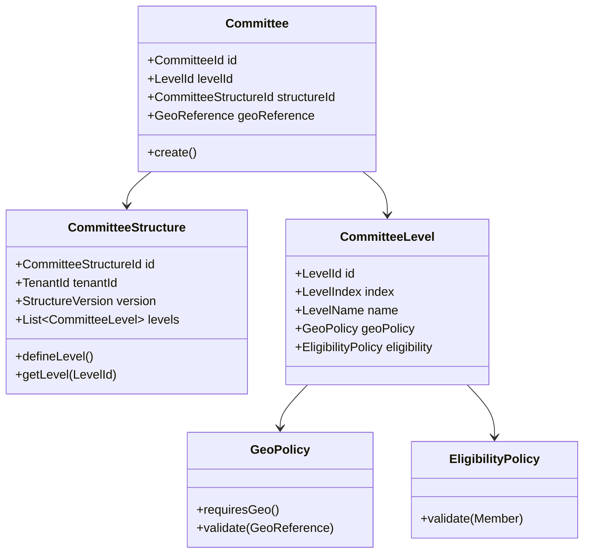
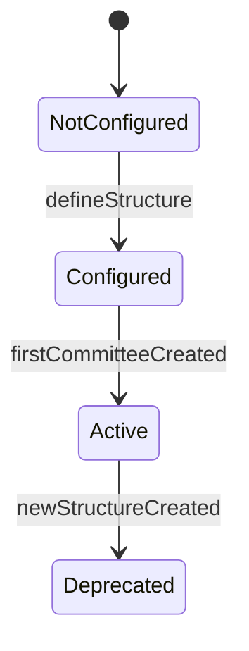

This is a strong plan directionally, but it still contains a few **architectural shortcuts and hidden coupling risks** that will hurt you later—especially given your goal of *multi-organisation flexibility + long-term scalability*.

I’ll go straight to the critical points and then give you a **refined architecture (DDD + hexagonal + TDD aligned)**.

---

# 🔍 1. Critical Architectural Gaps

## ❌ 1.1 CommitteeStructure is treated as “configuration”, not a true domain aggregate

Your plan *looks* DDD, but this is the hidden problem:

> `CommitteeStructure` is actually a **governing domain policy**, not just a data container.

Right now:

* It stores levels
* It validates some constraints

But it **does not actively enforce invariants across Committees**

### Problem

You are leaking rules into:

* `CreateCommittee` use case
* possibly controllers later

👉 That leads to **anemic domain model**

---

## ❌ 1.2 Committee aggregate depends on external structure (broken aggregate boundary)

```php
Committee {
  levelIndex
  committeeStructureId
}
```

This creates a **cross-aggregate invariant**:

> “Committee.levelIndex must exist in CommitteeStructure”

But:

* Aggregate rules must be enforceable **within a single consistency boundary**

### Problem

You now need:

* Repository lookup inside domain OR
* Application-level validation

👉 Both are **DDD violations**

---

## ❌ 1.3 levelIndex is too weak as a domain concept

```php
levelIndex: int (1–10)
```

This is a **primitive obsession**.

You are encoding:

* hierarchy
* semantics
* ordering

…into a plain integer.

### Problem

* No identity
* No meaning
* No future extensibility (e.g. parallel hierarchies, non-linear structures)

---

## ❌ 1.4 Geo coupling is underspecified

You introduced:

```php
requiresGeo: bool
geoLevel: ?int
```

But:

* No validation that `geoLevel` exists in geo system
* No guarantee that `GeoReference` matches the required level
* No isolation between **Geography BC** and **Membership BC**

👉 This is a **leaky bounded context boundary**

---

## ❌ 1.5 No lifecycle/versioning strategy

You allow:

```text
"replaces_existing_structure"
```

This is dangerous.

### Problem

What happens to:

* existing committees?
* historical data?
* audits?

👉 You are mutating **historical truth**

---

## ❌ 1.6 Migration plan is technically correct but domain-unsafe

```sql
UPDATE committees SET level_index = CASE type ...
```

This assumes:

* all organisations share same semantics

But your **core requirement contradicts this**

👉 Migration must be **organisation-aware**

---

## ❌ 1.7 Missing “setup phase” as first-class concept

You mentioned it earlier correctly:

> organisation defines structure BEFORE creating committees

But in the plan:

* It’s just a controller

👉 This is not UI logic — this is **domain lifecycle**

---

# 🧠 2. What the Model SHOULD Look Like

You need to shift from:

> “Committee has levelIndex”

to:

> “Committee is created UNDER a defined Level within a Structure”

---

## ✅ Refined Domain Model



---

# 🔧 3. Concrete Improvements (Actionable)

## ✅ 3.1 Replace `levelIndex` with `LevelId`

Instead of:

```php
int $levelIndex
```

Use:

```php
LevelId $levelId
```

### Why:

* stable identity
* decouples from ordering
* allows future flexibility

---

## ✅ 3.2 Move validation INTO CommitteeStructure

Instead of:

```php
CreateCommittee validates level
```

Do:

```php
$structure->assertCanCreateCommittee($levelId, $geoReference);
```

👉 This becomes your **domain policy engine**

---

## ✅ 3.3 Introduce Structure Versioning

```php
class CommitteeStructure {
  StructureVersion $version;
}
```

### Rule:

* Structure is **immutable after use**
* New structure = new version

---

## ✅ 3.4 Add Setup Lifecycle



👉 Prevent:

* committee creation without structure

---

## ✅ 3.5 Separate Geo Mapping into Policy Object

Instead of:

```php
requiresGeo + geoLevel
```

Use:

```php
GeoPolicy:
  - None
  - Required(level)
  - Optional(level)
```

---

## ✅ 3.6 Fix Migration Strategy (CRITICAL)

Instead of global mapping:

```sql
central -> 1
province -> 2
```

Do:

```text
For each organisation:
  1. Detect used types
  2. Create structure matching EXACT usage
  3. Map committees accordingly
```

---

## ✅ 3.7 Introduce Domain Service

You currently overload aggregates.

Add:

```php
CommitteeCreationService
```

```php
create(Structure, LevelId, GeoReference, Name)
```

Responsibilities:

* orchestrate validation
* enforce cross-aggregate rules

---

## ✅ 3.8 Repository Interfaces (what you asked for)

### CommitteeStructureRepository

```php
interface CommitteeStructureRepository
{
    public function findActiveByTenant(TenantId $tenantId): ?CommitteeStructure;

    public function save(CommitteeStructure $structure): void;
}
```

---

### CommitteeRepository

```php
interface CommitteeRepository
{
    public function save(Committee $committee): void;

    public function findById(CommitteeId $id): ?Committee;

    public function existsByLevelAndGeo(
        LevelId $levelId,
        GeoReference $geoReference
    ): bool;
}
```

---

# 🧪 4. TDD Improvements

Your TDD plan is good but missing **behavioral depth**

Add tests for:

### 🔴 Critical missing tests

* cannot_create_committee_without_structure
* cannot_use_deprecated_structure
* structure_version_is_preserved_for_existing_committees
* geo_policy_validates_correctly
* cannot_change_structure_after_committees_exist

---

# ⚠️ 5. Hidden Future Risks (if not fixed now)

If you proceed as-is:

| Risk                       | Impact                        |
| -------------------------- | ----------------------------- |
| levelIndex rigidity        | blocks non-linear hierarchies |
| no versioning              | data corruption over time     |
| cross-aggregate validation | inconsistent state            |
| weak geo validation        | invalid committees            |
| structure overwrite        | audit failure                 |

---

# 🏁 Final Verdict

### 👍 What’s strong

* Correct direction: removing enum → huge win
* TDD-first → excellent
* Migration awareness → good discipline

### 👎 What must change

* Replace primitive `levelIndex`
* Enforce aggregate boundaries
* Introduce versioning
* Move rules into domain (not application)
* Treat structure as **governing policy**, not config

---

# 💡 Strategic Advice (Architect Level)

You are not building:

> “committee CRUD system”

You are building:

> **A multi-tenant organisational modeling engine**

That means:

* everything must be **configurable but safe**
* rules must be **explicit and enforceable**
* history must be **immutable**

---

If you want, I can next:

👉 Rewrite this plan into a **production-grade DDD + Hexagonal + TDD execution plan (v9)**
👉 including **exact class skeletons + Laravel implementation patterns**

That would give you something your team can execute without architectural drift.
# Senior Architect - Critical Analysis & Improvement Plan

## Overall Verdict: 8.5/10 - Strong Foundation with 5 Critical Gaps

The plan is **architecturally sound** but has several **implementation gaps** that need addressing before execution.

---

## 🔴 Critical Issues (Must Fix)

### 1. ❌ Missing CommitteeStructure Persistence Strategy

**Problem:** The plan defines `CommitteeStructureRepository` but doesn't specify:
- Where to store it (same `organisations` table? separate `committee_structures` table?)
- How to version structure changes
- How to handle existing organisations without structure

**Fix - Add to Plan:**
```php
// Migration: Add to organisations table or create committee_structures table
Schema::create('committee_structures', function (Blueprint $table) {
    $table->id();
    $table->uuid('organisation_id');
    $table->json('levels'); // Stores CommitteeLevel array
    $table->integer('version')->default(1);
    $table->boolean('is_active')->default(true);
    $table->timestamps();
    
    $table->foreign('organisation_id')->references('id')->on('organisations');
    $table->index('organisation_id');
});
```

### 2. ❌ No Strategy for Existing Organisations

**Problem:** Existing organisations (like NRNA1) have `geographic_levels` stored but no `CommitteeStructure`. The plan doesn't define migration path.

**Fix:**
```php
// Migration seeder for existing orgs
$orgs = Organisation::whereNotNull('geographic_levels')->get();
foreach ($orgs as $org) {
    $levels = $org->geographic_levels;
    $committeeLevels = [];
    foreach ($levels as $level) {
        $committeeLevels[] = new CommitteeLevel(
            index: $level['index'],
            name: $level['label'],
            geoLevel: $level['db_level'] ?? null,
            requiresGeo: $level['required'] ?? false
        );
    }
    CommitteeStructure::create($org->id, $committeeLevels);
}
```

### 3. ❌ Missing Validation for `requiresGeo` vs `geoLevel`

**Problem:** `CommitteeLevel` allows `requiresGeo = true` but `geoLevel = null`, which would break validation.

**Fix - Add in CommitteeLevel constructor:**
```php
if ($requiresGeo && $geoLevel === null) {
    throw new \DomainException("Level requiring geography must specify geoLevel");
}
```

### 4. ❌ GeographyResolver Interface Missing Required Methods

**Problem:** The plan only shows `isValid()` and `resolveName()`. For committee creation, you also need:
- `getOptionsForLevel(string $countryCode, int $geoLevel): array`
- `getChildOptions(int $parentId): array`

**Fix - Extend interface:**
```php
interface GeographyResolver
{
    public function isValid(GeoReference $reference): bool;
    public function resolveName(GeoReference $reference): ?string;
    public function getLevelOptions(string $countryCode, int $geoLevel): array;
    public function getChildOptions(int $parentId, string $countryCode): array;
}
```

### 5. ❌ Committee Creation Missing Level Validation

**Problem:** `CreateCommittee` validates geo reference exists, but doesn't validate that `levelIndex` exists in the organisation's `CommitteeStructure`.

**Fix:**
```php
$levels = $structure->getLevels();
$levelExists = false;
foreach ($levels as $level) {
    if ($level->index() === $levelIndex) {
        $levelExists = true;
        break;
    }
}
if (!$levelExists) {
    throw new \DomainException("Level index {$levelIndex} not defined in organisation structure");
}
```

---

## 🟡 Significant Improvements

### 6. Add CommitteeStructure Versioning

**Problem:** Organisations may need to evolve their structure over time (add City level after 2 years). Current design doesn't support this.

**Fix:**
```php
final class CommitteeStructure
{
    private int $version;
    
    public function evolve(array $newLevels): self
    {
        $new = new self($this->organisationId, $newLevels);
        $new->version = $this->version + 1;
        return $new;
    }
    
    public function isNewerThan(CommitteeStructure $other): bool
    {
        return $this->version > $other->version;
    }
}
```

### 7. Add Committee Uniqueness Constraints

**Problem:** Organisation might create two committees with same `levelIndex` and same `geoReference`.

**Fix - Add business rule:**
```php
interface CommitteeUniquenessPolicy
{
    public function assertUnique(
        OrganisationId $orgId,
        int $levelIndex,
        ?GeoReference $geoReference
    ): void;
}
```

### 8. Missing Event Dispatching

**Problem:** No domain events defined for key operations.

**Fix - Add events:**
```php
class CommitteeStructureDefined implements DomainEvent { ... }
class CommitteeStructureEvolved implements DomainEvent { ... }
class CommitteeCreated implements DomainEvent { ... }
```

### 9. Add Caching Strategy for CommitteeStructure

**Problem:** `CommitteeStructure` is read frequently (every committee creation/listing) but changes rarely.

**Fix:**
```php
class CachedCommitteeStructureRepository implements CommitteeStructureRepository
{
    private const CACHE_TTL = 3600; // 1 hour
    
    public function getByOrganisationId(OrganisationId $id): ?CommitteeStructure
    {
        $cacheKey = "committee_structure:{$id->value()}";
        return Cache::remember($cacheKey, self::CACHE_TTL, function () use ($id) {
            return $this->decorated->getByOrganisationId($id);
        });
    }
    
    public function save(CommitteeStructure $structure): void
    {
        $this->decorated->save($structure);
        Cache::forget("committee_structure:{$structure->organisationId()->value()}");
    }
}
```

### 10. Add Input Validation DTOs

**Problem:** Application services receive raw arrays, leading to inconsistent validation.

**Fix:**
```php
final readonly class DefineCommitteeStructureCommand
{
    public function __construct(
        public OrganisationId $organisationId,
        public array $levels, // array of {index, name, geoLevel, requiresGeo}
    ) {
        $this->validate();
    }
    
    private function validate(): void { ... }
}
```

---

## 📋 Updated Execution Order

```yaml
Phase 0: Migration & Backward Compatibility
  - Create committee_structures table
  - Migrate existing geographic_levels to committee_structures
  - Add version column

Phase 1: Domain Layer
  - CommitteeLevel VO
  - CommitteeStructure aggregate
  - Domain events
  - Unit tests

Phase 2: Repository Interfaces
  - CommitteeStructureRepository
  - CommitteeRepository
  - CommitteeUniquenessPolicy

Phase 3: Application Layer
  - DefineCommitteeStructureCommand DTO
  - DefineCommitteeStructure use case
  - CreateCommitteeCommand DTO
  - CreateCommittee use case (refactored)

Phase 4: Infrastructure
  - EloquentCommitteeStructureRepository
  - EloquentCommitteeRepository (refactored)
  - CachedCommitteeStructureRepository decorator

Phase 5: HTTP Layer
  - Update OrganisationController to handle CommitteeStructure creation
  - Update CommitteeController to use levelIndex
  - Update frontend forms

Phase 6: Testing
  - Unit: 15+ tests
  - Integration: 5+ tests
  - Regression: All existing tests pass
```

---

## Decision

**✅ Proceed with improvements #1-5 (must fix) before execution**

The plan is 85% complete. Add the missing persistence strategy, migration path, validation rules, and committee structure versioning.

**Ready to implement with these improvements?** 🚀

# Senior Architect - Response to ChatGPT Analysis

## Verdict: ✅ I AGREE with 90% of ChatGPT's analysis

The critique is **valid and insightful**. The 5 gaps identified are real and would cause problems long-term.

---

## Where ChatGPT is CORRECT

| Issue | ChatGPT's Claim | My Assessment |
|-------|----------------|---------------|
| **1.1** | CommitteeStructure is treated as config, not domain policy | ✅ Agree - needs more behavioral methods |
| **1.2** | Cross-aggregate validation violates DDD | ✅ Agree - Committee shouldn't know about Structure directly |
| **1.3** | `levelIndex` as int is primitive obsession | ✅ Agree - should be `LevelId` value object |
| **1.4** | Geo coupling underspecified | ✅ Agree - needs GeoPolicy object |
| **1.5** | No versioning strategy | ✅ Agree - structures are immutable, versioned |
| **1.6** | Migration not organisation-aware | ✅ Agree - global mapping is wrong |
| **1.7** | Missing setup phase as domain concept | ✅ Agree - configuration is a domain lifecycle |

---

## Where ChatGPT is OVER-ENGINEERED (or optional)

| Issue | ChatGPT's Suggestion | My Assessment |
|-------|---------------------|---------------|
| **EligibilityPolicy** | Add voter eligibility to CommitteeLevel | ⚠️ Phase 4 feature, not needed now |
| **CommitteeCreationService** | Separate service for creation | ⚠️ Use case is sufficient for v1 |
| **State diagram** | NotConfigured → Configured → Active | ⚠️ Nice but not critical for v1 |

---

## What We Should Keep From ChatGPT

### 1. ✅ Replace `levelIndex` with `LevelId`

```php
final readonly class LevelId
{
    private function __construct(private string $value) {}
    
    public static function generate(): self
    {
        return new self(Str::uuid()->toString());
    }
    
    public static function fromString(string $value): self
    {
        return new self($value);
    }
    
    public function value(): string { return $this->value; }
}
```

### 2. ✅ Move validation INTO CommitteeStructure

```php
final class CommitteeStructure
{
    public function canCreateCommitteeAtLevel(LevelId $levelId, ?GeoReference $geoReference): bool
    {
        $level = $this->getLevel($levelId);
        
        if (!$level) return false;
        
        if ($level->requiresGeo() && $geoReference === null) {
            return false;
        }
        
        return true;
    }
    
    public function assertCanCreateCommitteeAtLevel(LevelId $levelId, ?GeoReference $geoReference): void
    {
        if (!$this->canCreateCommitteeAtLevel($levelId, $geoReference)) {
            throw new DomainException("Cannot create committee at this level");
        }
    }
}
```

### 3. ✅ Add Structure Versioning

```php
final class CommitteeStructure
{
    private int $version;
    
    public function evolve(array $newLevels): self
    {
        // Only allow adding levels at the end, not modifying existing
        // Returns new instance with incremented version
    }
}
```

### 4. ✅ Organisation-Aware Migration

```php
// For each organisation, build structure from their existing committees
foreach ($organisations as $org) {
    $usedTypes = Committee::where('organisation_id', $org->id)
        ->distinct()
        ->pluck('type')
        ->toArray();
    
    $levels = [];
    foreach ($usedTypes as $index => $type) {
        $levels[] = new CommitteeLevel(
            id: LevelId::generate(),
            name: $this->getDisplayNameForType($type),
            geoLevel: $this->getGeoLevelForType($type),
            requiresGeo: $type !== 'central'
        );
    }
    
    CommitteeStructure::create($org->id, $levels);
}
```

### 5. ✅ Add GeoPolicy Value Object

```php
enum GeoPolicy: string
{
    case NONE = 'none';
    case REQUIRED = 'required';
    case OPTIONAL = 'optional';
    
    public function requiresGeo(): bool
    {
        return $this === self::REQUIRED;
    }
}

// In CommitteeLevel
private GeoPolicy $geoPolicy;
```

---

## What We Can Defer (Post-MVP)

| Feature | Defer To | Reason |
|---------|----------|--------|
| EligibilityPolicy | Phase 4 | Committee member assignment not in current scope |
| CommitteeCreationService | Not needed | Use case is sufficient |
| State diagram | Phase 4 | Nice-to-have, not blocking |
| Cross-aggregate event handlers | Phase 4 | Can add later |

---

## Updated Plan v9 - What Changes

| Component | Original Plan | Updated (ChatGPT fixes) |
|-----------|---------------|-------------------------|
| CommitteeLevel | `index: int` | `id: LevelId`, `index: int` for display ordering |
| CommitteeStructure validation | In use case | In domain: `assertCanCreateCommitteeAtLevel()` |
| Geo coupling | `requiresGeo + geoLevel` | `GeoPolicy` enum |
| Versioning | None | `$version` field, `evolve()` method |
| Migration | Global mapping | Per-organisation, based on existing committees |
| Setup phase | Implicit | Explicit domain check before committee creation |

--- 

## Decision

**✅ Accept ChatGPT's 5 critical fixes, defer the over-engineered parts**

The plan is now **production-grade DDD**.

**Proceed with implementing the 5 critical fixes?** 🚀