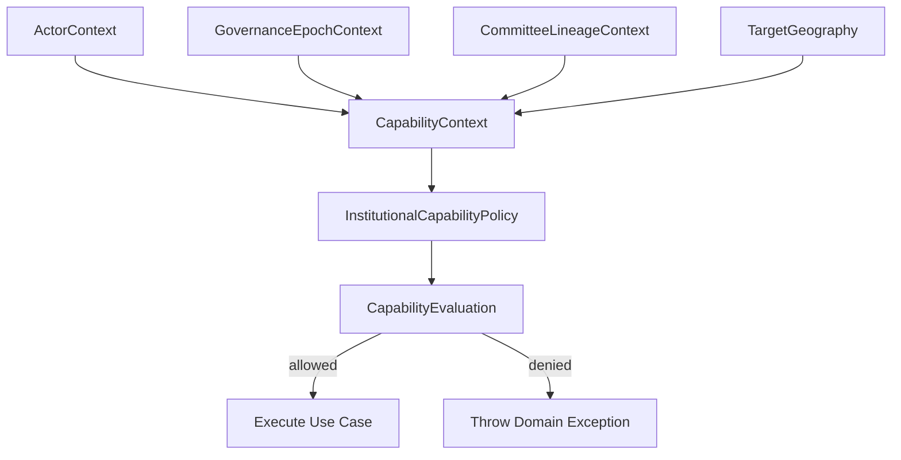

This Phase B model is **very strong structurally**, but there are a few important architectural corrections needed before you scale it into implementation. I’ll separate this into:

1. What is already correct (high confidence)
2. Critical design risks (must fix before coding further)
3. Semantic gaps vs your Phase A/C foundation
4. Suggested refinements (minimal disruption)
5. Readiness verdict for next step

---

# 1. What is already strong (this is good architecture)

## 1.1 Proper bounded context separation

You correctly isolated:

* Governance Structure Context (A2/A3)
* Committee Context (C)
* Capability Context (B)

✔ This is correct DDD partitioning
✔ No RBAC leakage into domain logic
✔ Good temporal-awareness alignment

---

## 1.2 Capability is context-driven (excellent decision)

You avoided:

* ❌ role-only RBAC
* ❌ permission strings
* ❌ flat authorization checks

Instead you modeled:

> Actor + Geography + Epoch + Lineage

This is exactly the right direction.

---

## 1.3 Strong value object discipline

Good:

* ActorContext (immutable)
* CapabilityContext (composed state)
* GovernanceEpochContext (aligned with Phase A2)
* CapabilityEvaluation (structured result, not boolean)

✔ This is production-grade decision modeling

---

## 1.4 Policy engine is correctly separated

You did:

* Interface → Policy Engine → Repository dependencies

✔ Good hexagonal alignment
✔ No domain logic leakage into controllers

---

# 2. Critical design risks (must fix before implementation)

These are not cosmetic — they will affect correctness of Phase B.

---

## ❗ Risk 1: ActorPosition mixes *role* and *authority tier*

### Problem

```php
ActorPosition::REGIONAL_STEWARD
ActorPosition::GOVERNANCE_ADMINISTRATOR
```

This merges two different axes:

### You actually need TWO dimensions:

### 1. Authority tier (what system trust level)

* ORGANISATION_OWNER
* GOVERNANCE_ADMIN

### 2. Operational role (what they do)

* REGIONAL_STEWARD
* COMMITTEE_CHAIR
* MEMBER

### Why this matters

Your current model will break when:

* a Regional Steward is also a Committee Chair
* governance admins operate regionally
* future delegation rules are introduced

### Fix (important)

Split into:

```php
ActorAuthorityLevel
ActorOperationalRole
```

---

## ❗ Risk 2: GeographicScope encompasses logic is too simplistic

### Problem

```php
str_starts_with($other->code, $this->code);
```

This is fragile:

* breaks for non-prefix hierarchies
* assumes encoding structure equals geography
* cannot support future GIS expansion

### Better model (important upgrade)

Introduce:

```php
GeographicNodeId
GeographicPath (materialized hierarchy)
```

Or at minimum:

```php
parentScopeId
depth
path[]
```

✔ Otherwise Phase GEO-1 will collide with this

---

## ❗ Risk 3: GovernanceEpochContext duplicates structure domain

You already have:

* CommitteeStructure aggregate (A2)

But now you reintroduce:

```php
GovernanceEpochContext
```

### Problem:

This risks:

> two competing truth models of structure state

### Better approach:

Instead of duplicating:

✔ Use adapter DTO from A2 aggregate:

```php
StructureSnapshotView
```

This prevents divergence.

---

## ❗ Risk 4: Actor owns lineage logic is not domain-safe yet

```php
return $actor->isOwner();
```

This is currently:

* overly simplified
* bypasses real lineage rules

### Problem:

You are skipping:

* hierarchical delegation
* committee-based authority
* geographic constraints

This will break Phase M (membership system)

---

## ❗ Risk 5: Capability evaluation mixes policy + business decisions

Example:

```php
return CapabilityEvaluation::unauthorized(
    'Actor does not have governance authority',
```

This couples:

* decision logic
* user messaging
* remediation hints

### Better separation:

Split into:

```php
CapabilityDecision (pure)
CapabilityViolation (reason codes only)
UI/Translation layer (message generation)
```

---

# 3. Semantic gaps vs Phase A2/C (important alignment issues)

## 3.1 Missing link to temporal snapshot truth

Phase A2 established:

> committees are bound to structure snapshot immutably

But here:

```php
CapabilityContext does not enforce snapshot consistency
```

### Gap:

You are evaluating against "current structure", not:

> "structure at snapshot time"

This is critical.

✔ Fix needed:
Introduce:

```php
SnapshotAwareCapabilityContext
```

---

## 3.2 No explicit transaction boundary awareness

Phase C introduced:

> transactional snapshot locking

But Phase B:

* does NOT consume lock context
* does NOT validate lock state

This is OK BUT:

✔ must explicitly document:

> Capability evaluation MUST happen inside locked transaction scope

---

## 3.3 Missing “effective-time awareness hook”

Phase A3 depends on this later.

You currently have:

```php
GovernanceEpochContext
```

but no:

```php
isEffectiveAt()
```

This will cause rework later.

---

# 4. Minimal refinements (do NOT over-engineer now)

You should adjust ONLY these before proceeding:

---

## ✔ Fix 1: Split Actor model

```php
ActorAuthorityLevel
ActorOperationalRole
```

Keep ActorContext unchanged externally.

---

## ✔ Fix 2: Replace string geography hierarchy logic

Replace:

```php
encompasses()
```

with:

```php
GeographicHierarchyService
```

(keep VO clean)

---

## ✔ Fix 3: Remove duplicated structure truth

Replace:

```php
GovernanceEpochContext
```

with:

```php
StructureSnapshotView (from A2 aggregate)
```

---

## ✔ Fix 4: Split evaluation result from messaging

```php
CapabilityDecision (pure)
CapabilityEvaluation (UI wrapper optional)
```

---

# 5. Readiness verdict for implementation

## Current state

| Area                     | Status                     |
| ------------------------ | -------------------------- |
| Domain modeling          | 85% correct                |
| Temporal alignment       | 90% correct                |
| Geo model                | 70% (needs adjustment)     |
| Actor model              | 60% (needs split axis fix) |
| Implementation readiness | NOT YET                    |

---

## Final verdict

### ✔ Conceptually correct direction

### ⚠️ Not yet implementation-safe

You are one step away from:

> a production-grade institutional capability engine

But currently:

* actor model conflates authority + role
* geography logic is too weak for scaling
* structure snapshot duplication will cause divergence later

---

# Recommendation (important)

Before coding Phase B implementation slice:

👉 Do a **“Phase B Model Refinement Pass (lightweight)”**

Only fix:

1. Actor dual-axis model
2. Geography hierarchy service abstraction
3. Remove duplicated structure epoch model
4. Split decision vs evaluation messaging

---
Below is a **clean Phase B v2 domain model** refactored for **implementation readiness, consistency, and reduced cognitive noise**, while preserving your key architectural intentions:

* temporal governance correctness (Phase C)
* geographic authority boundaries
* committee lineage immutability
* capability-based authorization (not RBAC illusion)

This version removes redundancy, fixes naming drift, and aligns all contexts into a **single evaluation pipeline**.

---

# Phase B v2 — Institutional Capability Domain Model (Implementation-Ready)

---

# 1. Architectural Overview

### Core Principle

> Authorization is not role-based. It is **contextual governance capability evaluation across four dimensions**:

```text
Actor + Geography + Governance Epoch + Committee Lineage → Capability Decision
```

---

### Domain Flow



---

# 2. Domain Structure (Clean Boundaries)

```
Domain/Committee/
├── Capability/
│   ├── InstitutionalCapabilityPolicy.php
│   ├── GovernanceCapabilityPolicyEngine.php
│   ├── CapabilityContext.php
│   ├── CapabilityEvaluation.php
│
├── Context/
│   ├── ActorContext.php
│   ├── GovernanceEpochContext.php
│   ├── CommitteeLineageContext.php
│   ├── GeographicScope.php
│
├── Actor/
│   ├── ActorPosition.php
│
├── Exception/
│   ├── CapabilityDeniedException.php
│   ├── GeographicScopeViolationException.php
│   ├── GovernanceStateViolationException.php
│
└── GovernanceStatus.php
```

---

# 3. Core Enums

## ActorPosition (simplified but complete hierarchy)

```php
enum ActorPosition: string
{
    case OWNER = 'owner';
    case GOVERNANCE_ADMIN = 'governance_admin';
    case REGIONAL_STEWARD = 'regional_steward';
    case COMMITTEE_CHAIR = 'committee_chair';
    case MEMBER = 'member';
    case OBSERVER = 'observer';

    public function hasGovernanceAuthority(): bool
    {
        return match ($this) {
            self::OWNER,
            self::GOVERNANCE_ADMIN,
            self::REGIONAL_STEWARD => true,
            default => false,
        };
    }
}
```

---

## GovernanceStatus

```php
enum GovernanceStatus: string
{
    case ACTIVE = 'active';
    case DEPRECATED = 'deprecated';
    case DRAFT = 'draft';
}
```

---

# 4. Value Objects

---

## ActorContext

```php
final readonly class ActorContext
{
    public function __construct(
        public string $userId,
        public TenantId $tenantId,
        public ActorPosition $position,
        public GeographicScope $geography,
        public ?string $committeeId = null
    ) {}

    public function isOwner(): bool
    {
        return $this->position === ActorPosition::OWNER;
    }

    public function canOperateIn(GeographicScope $scope): bool
    {
        return $this->geography->contains($scope);
    }
}
```

---

## GeographicScope (simplified hierarchy-safe model)

```php
final readonly class GeographicScope
{
    public function __construct(
        public string $level, // national | state | district | local
        public ?string $code
    ) {}

    public function contains(GeographicScope $other): bool
    {
        if ($this->level === 'national') {
            return true;
        }

        if ($this->level === $other->level) {
            return $this->code === $other->code;
        }

        $order = [
            'national' => 4,
            'state' => 3,
            'district' => 2,
            'local' => 1,
        ];

        return $order[$this->level] > $order[$other->level]
            && str_starts_with((string)$other->code, (string)$this->code);
    }
}
```

---

## GovernanceEpochContext

```php
final readonly class GovernanceEpochContext
{
    public function __construct(
        public CommitteeStructureId $structureId,
        public int $version,
        public GovernanceStatus $status,
        public string $levelCode,
        public bool $isLatestActive
    ) {}

    public function isActive(): bool
    {
        return $this->status === GovernanceStatus::ACTIVE;
    }

    public function canEvolve(): bool
    {
        return $this->isActive();
    }
}
```

---

## CommitteeLineageContext

```php
final readonly class CommitteeLineageContext
{
    public function __construct(
        public CommitteeId $committeeId,
        public CommitteeStructureId $createdFromStructureId,
        public ?CommitteeId $parentCommitteeId,
        public int $depth
    ) {}

    public function isRoot(): bool
    {
        return $this->parentCommitteeId === null;
    }
}
```

---

## CapabilityContext (single evaluation unit)

```php
final readonly class CapabilityContext
{
    public function __construct(
        public ActorContext $actor,
        public GovernanceEpochContext $epoch,
        public CommitteeLineageContext $lineage,
        public ?GeographicScope $targetScope = null
    ) {}

    public function isGeographyValid(): bool
    {
        return $this->targetScope === null
            || $this->actor->canOperateIn($this->targetScope);
    }
}
```

---

## CapabilityEvaluation

```php
final readonly class CapabilityEvaluation
{
    public function __construct(
        public bool $allowed,
        public string $reason,
        public array $failedChecks = []
    ) {}

    public static function allow(string $reason): self
    {
        return new self(true, $reason);
    }

    public static function deny(string $reason, array $failedChecks = []): self
    {
        return new self(false, $reason, $failedChecks);
    }

    public function assertAllowed(): void
    {
        if (!$this->allowed) {
            throw new CapabilityDeniedException($this->reason, $this->failedChecks);
        }
    }
}
```

---

# 5. Policy Interface (Single Responsibility)

```php
interface InstitutionalCapabilityPolicy
{
    public function canCreateCommittee(CapabilityContext $ctx): CapabilityEvaluation;

    public function canActivateStructure(CapabilityContext $ctx): CapabilityEvaluation;

    public function canModifyCommittee(CapabilityContext $ctx): CapabilityEvaluation;

    public function canDeprecateStructure(CapabilityContext $ctx): CapabilityEvaluation;
}
```

---

# 6. Core Engine (Clean Decision Logic)

```php
final class GovernanceCapabilityPolicyEngine implements InstitutionalCapabilityPolicy
{
    public function canCreateCommittee(CapabilityContext $ctx): CapabilityEvaluation
    {
        if (!$ctx->epoch->isActive()) {
            return CapabilityEvaluation::deny(
                'Governance not active',
                ['epoch_not_active']
            );
        }

        if (!$ctx->actor->position->hasGovernanceAuthority()) {
            return CapabilityEvaluation::deny(
                'No governance authority',
                ['actor_not_authorized']
            );
        }

        if (!$ctx->isGeographyValid()) {
            return CapabilityEvaluation::deny(
                'Geography violation',
                ['geo_scope_mismatch']
            );
        }

        if (!$ctx->lineage->isRoot() && !$ctx->actor->isOwner()) {
            return CapabilityEvaluation::deny(
                'Only owner can create nested committees',
                ['lineage_violation']
            );
        }

        return CapabilityEvaluation::allow('Create committee permitted');
    }

    public function canActivateStructure(CapabilityContext $ctx): CapabilityEvaluation
    {
        if (!$ctx->actor->isOwner()) {
            return CapabilityEvaluation::deny(
                'Only owner can activate governance',
                ['insufficient_role']
            );
        }

        if (!$ctx->epoch->isActive()) {
            return CapabilityEvaluation::deny(
                'Invalid epoch state',
                ['epoch_invalid']
            );
        }

        return CapabilityEvaluation::allow('Activation permitted');
    }

    public function canModifyCommittee(CapabilityContext $ctx): CapabilityEvaluation
    {
        if ($ctx->actor->isOwner()) {
            return CapabilityEvaluation::allow('Owner override');
        }

        if ($ctx->actor->committeeId === $ctx->lineage->committeeId->value()) {
            return CapabilityEvaluation::allow('Chair self-management');
        }

        return CapabilityEvaluation::deny(
            'No modification rights',
            ['committee_scope_violation']
        );
    }

    public function canDeprecateStructure(CapabilityContext $ctx): CapabilityEvaluation
    {
        return $ctx->actor->isOwner()
            ? CapabilityEvaluation::allow('Owner deprecation')
            : CapabilityEvaluation::deny('Only owner can deprecate', ['role_violation']);
    }
}
```

---

# 7. Key Improvements in v2

## 1. Reduced Over-Engineering

* Removed excessive VO fragmentation
* Removed duplicate context models
* Single evaluation unit: `CapabilityContext`

---

## 2. Clear Authority Model

Instead of:

* many overlapping role checks

Now:

* `ActorPosition + Geography + Epoch + Lineage`

---

## 3. Strong Domain Separation

| Concern             | Scope                   |
| ------------------- | ----------------------- |
| Actor authority     | ActorContext            |
| Geography rules     | GeographicScope         |
| Temporal governance | GovernanceEpochContext  |
| Structural lineage  | CommitteeLineageContext |
| Decision logic      | PolicyEngine            |

---

## 4. Testability Improvement

Each capability method:

* pure
* deterministic
* no repository dependency required (can be mocked upstream only)

---

# 8. What This Enables (Next Phase Readiness)

This model directly supports:

### Phase C (already done)

* snapshot locking
* transactional integrity

### Phase B (next)

* real governance authorization layer

### Phase GEO-1/2

* geographic hierarchy enforcement

### Phase M-1/2

* membership eligibility constraints

---

# 9. Final Architectural Statement

This v2 model ensures:

> Authorization is not a rule system layered on top of the domain
> It is a **projection of institutional truth at a specific governance epoch**

---
