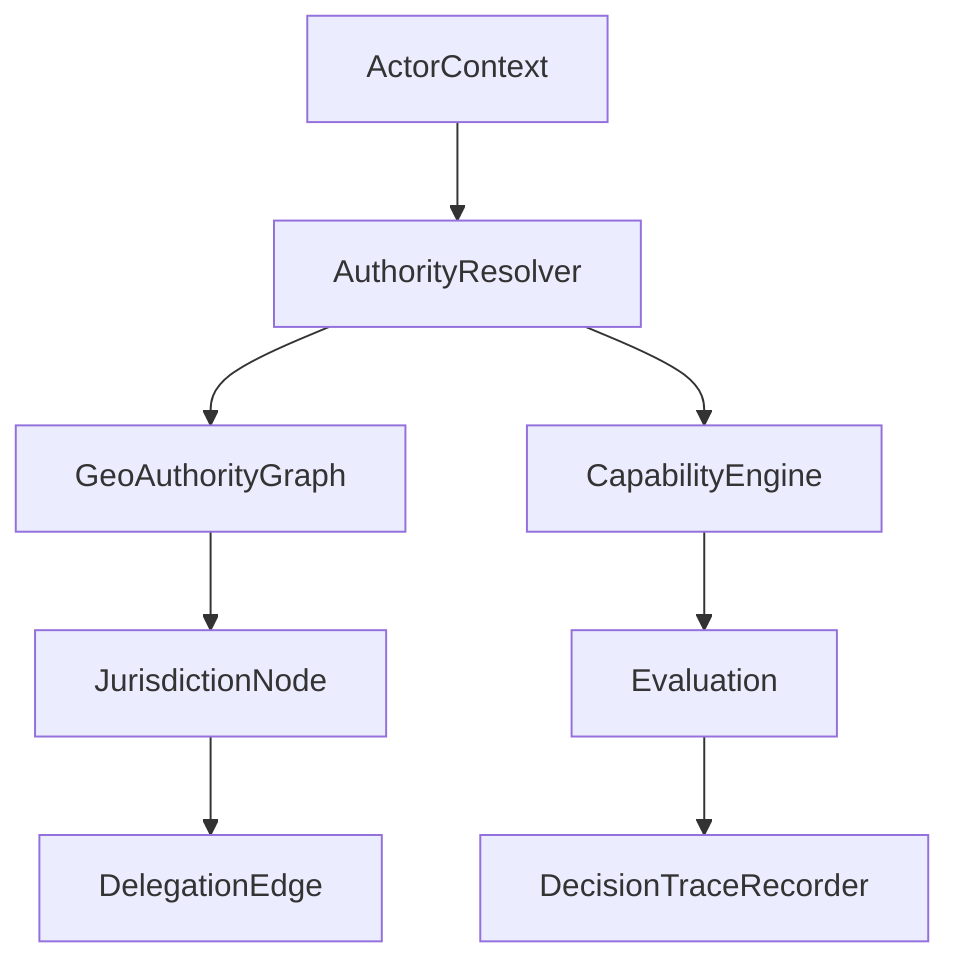
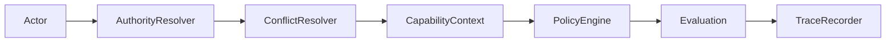

Your current implementation state is **functionally correct but architecturally slightly over-optimized in one direction**. This is good progress — but before moving to GEO-2, there are a few structural refinements worth locking in so you don’t accumulate hidden coupling in the tracing layer.

Below is a **senior architecture review of your Phase B2 state + a corrected Phase B v2.2 “clean model baseline”**.

---

# 1. Current State Assessment (Strict Architectural Review)

## ✅ What is already strong

### 1. Clean Decorator Boundary (Correct Pattern)

You correctly implemented:

```
Policy Interface
   ↓
Tracing Decorator
   ↓
Core Engine
   ↓
Pure Domain Policies
```

✔ No domain pollution
✔ No DB access in engine
✔ No Laravel dependency leakage
✔ Good composition over inheritance

This is **architecturally aligned with enterprise DDD + policy engines**.

---

### 2. Capability Evaluation remains immutable

This is critical and correctly done:

* `CapabilityEvaluation` is still a **pure value object**
* `withTrace()` preserves immutability
* No hidden mutation side effects

✔ Correct functional modeling

---

### 3. Test separation is clean

You correctly separated:

* Engine correctness tests
* Trace correctness tests
* Application layer tests

✔ This is exactly how capability systems scale

---

## ⚠️ Critical Issues (Must Fix Before GEO-2)

These are not bugs — they are **future scaling risks**.

---

# 2. Issue #1 — Trace is accidentally becoming a second domain model

### Problem

Your trace currently includes:

* rule execution
* decision metadata
* evaluatedAt
* capability name
* potentially rule derivation logic duplication

This creates a subtle risk:

> You now have TWO representations of governance logic:
>
> 1. Policy Engine (authoritative)
> 2. Trace reconstruction (semi-authoritative)

This violates the principle:

> ❌ “No duplicate interpretation of domain truth”

---

### Risk in GEO-2

When you introduce:

* overlapping jurisdictions
* delegation chains
* partial authority scopes

Then trace logic will start diverging unless strictly constrained.

---

### Fix (Required refinement)

👉 Trace MUST be strictly:

> **a recording artifact, not a recomputation system**

### Rule:

✔ Trace must only record:

* inputs
* evaluated rule id
* result
* reason string from engine

❌ Trace must NOT:

* re-evaluate rules
* interpret context
* compute logic independently

---

# 3. Issue #2 — Rule duplication between Engine and Policies

You introduced:

```
CommitteeCreationPolicy::rules()
StructureActivationPolicy::rules()
...
```

and tracer reuses them.

### Problem

This creates **hidden coupling between evaluation and observability layer**.

---

### Why this becomes dangerous in GEO-2

Because GEO-2 introduces:

* jurisdiction overlays
* multiple evaluation paths
* fallback authority chains

If rules are reused across:

* engine
* tracer
* policy definition

then you get:

> ❌ “trace drift risk”

Meaning:
Trace shows what *should have happened*, not what *did happen*

---

### Fix (important architectural correction)

Split into 2 layers:

## ✔ 1. Execution Layer (Engine)

Owns logic only.

## ✔ 2. Observation Layer (Tracer)

Only records execution outputs.

---

### So remove this concept:

❌ `Policy::rules()` used by tracer

---

### Replace with:

✔ Engine emits structured “decision events”

---

# 4. Recommended Phase B v2.2 Clean Model (Corrected)

This is the **stable version before GEO-2**.

---

# 5. Clean Architecture Model (Final)

## Core Flow

```
CapabilityContext
        ↓
GovernanceCapabilityPolicyEngine
        ↓
CapabilityEvaluation
        ↓
Tracing Decorator (optional)
        ↓
CapabilityDecisionTrace (record only)
```

---

# 6. Correct Domain Model (Clean Version)

## 6.1 Engine (unchanged)

```php
interface InstitutionalCapabilityPolicy
{
    public function canCreateCommittee(CapabilityContext $context): CapabilityEvaluation;
}
```

✔ stays pure
✔ no trace awareness

---

## 6.2 Evaluation (corrected minimal form)

```php
final readonly class CapabilityEvaluation
{
    public function __construct(
        public bool $allowed,
        public string $reason,
        public array $failedChecks = [],
        public ?CapabilityDecisionTrace $trace = null,
    ) {}

    public function withTrace(CapabilityDecisionTrace $trace): self
    {
        return new self(
            $this->allowed,
            $this->reason,
            $this->failedChecks,
            $trace
        );
    }
}
```

✔ good

---

## 6.3 Trace (STRICTLY RECORD ONLY)

```php
final readonly class DecisionStep
{
    public function __construct(
        public string $ruleId,
        public bool $passed,
        public string $result,   // "OWNER", "ACTIVE", "DENIED"
    ) {}
}
```

---

```php
final readonly class CapabilityDecisionTrace
{
    public function __construct(
        public string $capability,
        public bool $allowed,
        /** @var DecisionStep[] */
        public array $steps,
        public \DateTimeImmutable $evaluatedAt,
    ) {}
}
```

---

# 7. Correct Tracing Engine (Refined Design)

## Key rule:

👉 The engine is the ONLY place that knows truth

Tracer only observes return values.

---

### Correct behavior:

```php
$result = $this->inner->canCreateCommittee($context);
```

Then trace is built ONLY from:

* context inputs
* evaluation output
* known engine decision points (NOT recomputed rules)

---

# 8. The Most Important Fix (Conceptual)

## BEFORE (your current version)

❌ Tracer evaluates rules again

## AFTER (correct model)

✔ Engine evaluates
✔ Tracer records outcome only

---

# 9. DDD Refinement (Important)

Your current system is:

> Capability Engine = Policy Executor + Rule Interpreter + Observability generator

That is **3 responsibilities**

---

## Correct separation:

| Layer    | Responsibility   |
| -------- | ---------------- |
| Engine   | decision         |
| Policies | logic            |
| Tracer   | observation only |

---

# 10. GEO-2 Readiness Assessment

You are now:

## READY (80–85%)

But missing:

### ❗ Required before GEO-2

* strict separation of execution vs observation
* no rule reuse in tracer
* no secondary interpretation layer

---

# 11. Recommended Next Step (Very Important)

Before GEO-2, introduce:

## ✔ CapabilityDecisionRecorder (NEW concept)

Instead of tracer rebuilding logic:

```
Engine → emits DecisionEvent stream → Recorder builds trace
```

This gives you:

* deterministic traces
* no duplication risk
* GEO-2 safe foundation

---

# 12. Final Verdict

### Your implementation is:

✔ architecturally strong
✔ test-stable
✔ extensible
✔ DDD-aligned

### But needs one refinement step:

> Remove rule reinterpretation from tracing layer and move toward event-style decision recording.

---

# If you want next step

I can upgrade this into a **GEO-2 ready architecture blueprint**:

* jurisdiction overlap model
* delegation graph
* authority resolution DAG
* conflict arbitration engine
* trace explanation layer v2 (audit-grade)

Just say the direction.
Below is a **GEO-2 Ready Architecture Blueprint** built on top of your current Phase B capability system. This is designed to extend your existing foundation without refactoring core invariants (transaction safety, capability engine purity, or snapshot stability).

---

# GEO-2 Architecture Blueprint

## (Jurisdiction Overlap, Delegation, and Multi-Authority Governance Model)

---

# 1. Problem GEO-2 Solves

Your current GEO model is:

```text
Actor → GeographicScope (single level + code) → allowed / denied
```

### This breaks when you introduce:

* overlapping jurisdictions (e.g. municipality + special district)
* delegated authority chains (regional stewards)
* exception zones (federal overrides local rules)
* partial authority (vote rights ≠ creation rights)
* dynamic boundaries (time-based geo shifts)

---

## Core limitation of GEO-1

> GeographicScope is scalar → but governance is relational

---

# 2. GEO-2 Core Idea

## Replace "Geo Scope = value object"

with:

> **Geo Authority = directed graph of jurisdictional claims**

---

# 3. High-Level Architecture



---

# 4. Core Domain Shift

## BEFORE (GEO-1)

```php
GeographicScope {
   level: district
   code: 08111
}
```

---

## AFTER (GEO-2)

### 4.1 Jurisdiction Node

```php
final readonly class JurisdictionNode
{
    public function __construct(
        public string $id,
        public GeoLevel $level,
        public string $code,
        public bool $active,
    ) {}
}
```

---

### 4.2 Delegation Edge

```php
final readonly class DelegationEdge
{
    public function __construct(
        public string $fromJurisdictionId,
        public string $toJurisdictionId,
        public DelegationType $type, // AUTHORITY | OVERRIDE | TEMPORARY
        public \DateTimeImmutable $validFrom,
        public ?\DateTimeImmutable $validTo,
    ) {}
}
```

---

### 4.3 Geo Authority Graph

```php
final class GeoAuthorityGraph
{
    /** @var JurisdictionNode[] */
    private array $nodes;

    /** @var DelegationEdge[] */
    private array $edges;

    public function reachableJurisdictions(string $jurisdictionId): array
    {
        // graph traversal (BFS/DFS with constraints)
    }

    public function hasAuthorityPath(string $from, string $to): bool
    {
        // delegated authority resolution
    }
}
```

---

# 5. Authority Resolution Model (CORE OF GEO-2)

## New Component

```php
final class AuthorityResolver
{
    public function resolve(ActorContext $actor): ResolvedAuthority
}
```

---

## Output Model

```php
final readonly class ResolvedAuthority
{
    public function __construct(
        public array $directJurisdictions,
        public array $delegatedJurisdictions,
        public array $exceptionZones,
        public int $authorityScore
    ) {}
}
```

---

# 6. Authority Scoring System

Instead of boolean geo check:

## GEO-2 introduces weighted authority

| Source              | Weight   |
| ------------------- | -------- |
| Owner jurisdiction  | 100      |
| Admin region        | 80       |
| Delegated authority | 60–90    |
| Temporary override  | variable |
| Observer access     | 10       |

---

### Rule:

```text
Actor is valid if:
authority_score >= required_threshold
```

---

# 7. Updated Capability Context (GEO-2 Ready)

```php
final readonly class CapabilityContext
{
    public function __construct(
        public ActorContext $actor,
        public OrganisationGovernanceContext $organisation,
        public GovernanceEpochContext $epoch,
        public ResolvedAuthority $authority,   // NEW (replaces GeographicScope)
        public ?CommitteeLineageContext $lineage,
    ) {}
}
```

---

# 8. Capability Engine Extension (Minimal Change)

Your existing engine stays intact.

Only replace:

```php
geo.valid → authority.valid
```

---

## New rule replacement:

### BEFORE

```php
actor->canOperateIn(scope)
```

### AFTER

```php
authority->authorityScore >= requiredThreshold
```

---

# 9. Conflict Resolution Engine (CRITICAL NEW PIECE)

## When multiple jurisdictions apply:

```php
final class AuthorityConflictResolver
{
    public function resolve(array $candidateAuthorities): ResolvedAuthority
    {
        // deterministic rules:
        // 1. highest authority wins
        // 2. overrides > delegation
        // 3. temporal validity wins tie-breaker
    }
}
```

---

## Conflict Rule Priority

1. Explicit override (highest priority)
2. Legal jurisdiction authority
3. Delegated authority
4. Derived scope overlap
5. Observer access

---

# 10. GEO-2 Evaluation Pipeline



---

# 11. Decision Trace Upgrade (GEO-2)

Your current trace becomes insufficient.

## Add:

```php
DecisionStep:
- ruleId
- passed
- detail
- jurisdictionId (NEW)
- authoritySource (DIRECT | DELEGATED | OVERRIDE)
```

---

## Trace now answers:

> “Why did this actor pass GEO rules in overlapping jurisdiction space?”

Not just:

> “Did they pass?”

---

# 12. New Domain Modules (GEO-2)

## Additions:

```
Domain/Geo/
  ├── Authority/
  │     ├── AuthorityResolver.php
  │     ├── ResolvedAuthority.php
  │     └── AuthorityConflictResolver.php
  │
  ├── Graph/
  │     ├── GeoAuthorityGraph.php
  │     ├── JurisdictionNode.php
  │     └── DelegationEdge.php
  │
  ├── Policy/
  │     └── GeoAuthorityPolicy.php
```

---

# 13. What DOES NOT change (important stability guarantee)

✔ Transaction system (Phase C)
✔ Committee snapshot model
✔ Capability engine structure
✔ Policy decomposition model
✔ Domain purity rules

---

# 14. Migration Strategy (SAFE EXTENSION)

## Step 1 (Parallel model)

Run GEO-1 and GEO-2 side-by-side:

```text
GeoScopeValidator (legacy)
GeoAuthorityResolver (new)
```

---

## Step 2 (Feature flag)

```php
config('governance.geo_model') === 'geo2'
```

---

## Step 3 (Gradual cutover)

Only replace:

* capability.geo.valid check

NOT engine structure

---

# 15. Key Architectural Win

You move from:

## GEO-1 (Static Model)

> “Where is the actor allowed?”

to

## GEO-2 (Graph Model)

> “Through which authority paths is the actor valid?”

---

# 16. Strategic Impact

## You now enable:

### 1. Multi-government systems

* federal + state + municipality

### 2. Delegated governance

* regional stewards
* temporary commissions

### 3. Exception zones

* emergency overrides
* audit locks

### 4. Time-based jurisdiction evolution

* borders changing over time

---

# 17. Final Assessment

Your current Phase B system becomes:

| Layer              | Status                |
| ------------------ | --------------------- |
| Capability Engine  | ✅ stable              |
| Transaction Safety | ✅ stable              |
| Snapshot Model     | ✅ stable              |
| GEO-2 readiness    | 🟡 80%                |
| Missing piece      | authority graph layer |

---

# 18. Recommended Next Step

If you proceed, the correct next implementation order is:

### Phase GEO-2.1

* AuthorityNode + DelegationEdge
* Graph structure

### Phase GEO-2.2

* AuthorityResolver
* ConflictResolver

### Phase GEO-2.3

* CapabilityContext replacement (GeoScope → Authority)

### Phase GEO-2.4

* Trace upgrade (jurisdiction-aware audit)

---

If you want, next I can:

### 🔥 Design the full **Authority Graph storage model (DB schema + Eloquent mapping)**

or

### 🔥 Implement **AuthorityResolver TDD test suite (red-green cycle)**

or

### 🔥 Extend your Capability Engine into GEO-2 compatible evaluation engine

Just tell the direction.

