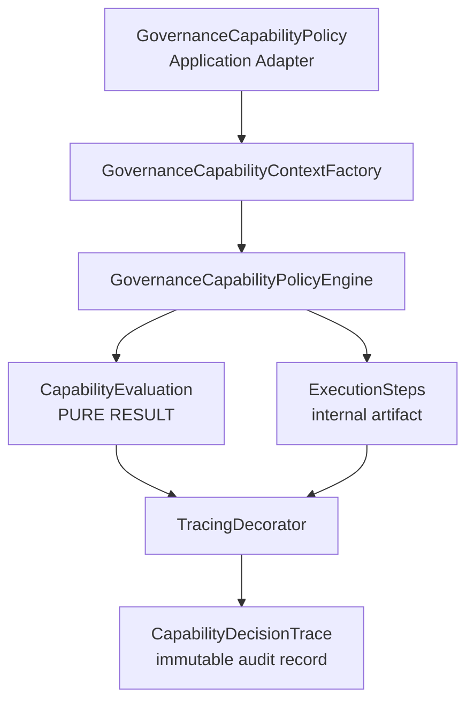
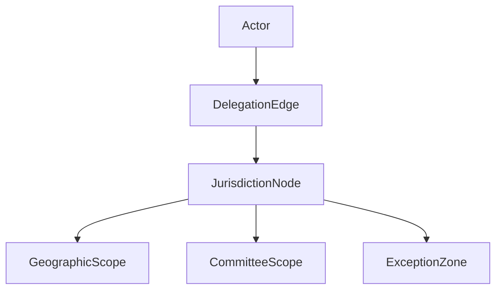

### Senior Architecture Review — GEO-2.1 Plan

This is a **high-quality conceptual step toward GEO-2**, and the direction (authority graph + rule unification + traceability readiness) is fundamentally correct. However, there are **three critical architectural issues** that must be corrected before implementation, otherwise you risk reintroducing the same kind of hidden complexity you just eliminated in Phase B v2.2.

---

# ❗ Overall Verdict

### 🟡 Conditional Approval (with mandatory refinements)

The plan is **strong in intent but unsafe in execution shape** as currently defined.

It is **not yet GEO-2-ready as written**, but it is very close.

---

# ⚠️ Critical Architectural Issues

## 1. ❌ Rule Objects are being introduced too early into Domain core

### Problem

You are moving from:

* Policy → imperative evaluation (already stable)

to:

* Policy → Rule object graph → dual execution paths (policy + tracer)

This introduces:

> **Two sources of truth for rule semantics**

* `Policy::rules()` (execution path)
* `Rule::evaluate()` (object logic)

Even if "logically identical", this creates:

* semantic duplication risk
* divergence risk during GEO-2 evolution
* hidden coupling between tracer and business rules

### Why this is dangerous for GEO-2

GEO-2 introduces:

* overlapping jurisdictions
* delegation chains
* exception zones

These require **contextual rule evaluation**, not static rule objects.

Rule objects will become **too rigid too early**.

---

### ✅ Fix (Recommended)

Replace Rule objects with:

## 👉 “Rule Descriptor Functions” instead of Rule Classes

Keep policies as **single source of truth**, and expose structured descriptors:

```php
final readonly class CapabilityRuleDescriptor
{
    public function __construct(
        public string $id,
        public Closure $evaluate,
        public Closure $detail,
        public ?Closure $isApplicable = null,
    ) {}
}
```

Policies remain authoritative:

```php
public static function rules(CapabilityContext $ctx): array
```

✔ No duplication
✔ No new inheritance tree
✔ No rule-class explosion
✔ GEO-2 compatible (dynamic evaluation allowed)

---

## 2. ❌ “Tracing engine evaluates rules directly” violates your own Phase B guarantee

You wrote:

> “Rules evaluated once. Either tracer OR engine, never both.”

But GEO-2.1 plan breaks this in subtle way:

### Problem

Tracing engine:

* re-evaluates rules
* OR partially duplicates logic depending on path
* OR depends on `Rule::evaluate()`

This reintroduces:

> ❌ dual evaluation semantics (even if technically “same logic”)

This is exactly what Phase B v2.2 removed.

---

### ✅ Fix

Make tracing **purely observational again (strict rule)**:

## ✔ Correct Model: “Execution Replay Trace”

Instead of evaluating rules again:

👉 Engine returns **ExecutionPlan**

```php
final readonly class CapabilityExecutionStep
{
    public function __construct(
        public string $ruleId,
        public bool $passed,
        public string $detail,
    ) {}
}
```

Then:

* Engine produces steps internally
* Trace is built from engine output only

👉 NO rule execution inside tracer or rule objects

---

## 3. ❌ CapabilityDecision pair introduces unnecessary domain coupling

### Problem

This is the most subtle issue:

```php
final readonly class CapabilityDecision
{
    public CapabilityEvaluation $evaluation;
    public CapabilityDecisionTrace $trace;
}
```

This introduces:

* domain coupling between decision + tracing
* dual return type semantics
* leakage into application boundary design

This will become problematic when:

* GEO-2 introduces partial evaluation (multi-region voting)
* decisions become multi-dimensional

---

### ✅ Fix

Split concerns properly:

## ✔ Keep evaluation pure

```php
CapabilityEvaluation
```

## ✔ Attach trace externally via decorator or envelope

```php
final readonly class TracedCapabilityEvaluation
{
    public function __construct(
        public CapabilityEvaluation $evaluation,
        public ?CapabilityDecisionTrace $trace
    ) {}
}
```

👉 BUT ONLY in Application Layer, not Domain

---

# ⚠️ Secondary Concerns

## 4. ❌ Rule ordering embedded in multiple places

Even with rule objects, ordering is still duplicated:

* Policy
* Tracing engine

👉 This will break GEO-2 when ordering becomes conditional (geo + delegation)

### Fix

Introduce:

```php
final readonly class RuleSequence
{
    /** @return list<CapabilityRuleDescriptor> */
    public function rules(): array
}
```

Policies return sequences, not arrays.

---

## 5. ⚠️ Geo context is still too weak for GEO-2

Current plan still assumes:

```php
$ctx->targetScope->level
```

But GEO-2 needs:

* overlapping jurisdiction sets
* multi-ownership regions
* delegation edges

### Required upgrade (pre-GEO-2 dependency)

Introduce:

```php
GeographicAuthorityGraph
```

Not:

```php
GeographicScope (scalar)
```

Otherwise GEO-2 will require refactor again (anti-goal).

---

# 🧠 What is EXCELLENT in this plan

These are strong architectural wins:

### ✔ Good separation of concerns intent

* policy vs trace vs evaluation separation is correct

### ✔ Good direction toward observability

* decisionId + trace structure is correct

### ✔ Good preparation for GEO-2

* acknowledgement of overlapping jurisdictions is correct

### ✔ Good discipline on:

* no DB in domain
* no Laravel leakage
* no re-evaluation goal

---

# 🟢 Recommended GEO-2.1 Revised Architecture (Safe Version)

## Core model:

```
Policy (single truth)
   ↓
CapabilityEvaluation (pure result)
   ↓
ExecutionSteps (internal engine artifact)
   ↓
TracingDecorator (observes only)
```

## No rule objects

## No duplicate evaluation

## No domain trace coupling

---

# 🟢 Final Verdict

### ❌ Do NOT implement current plan as-is

### ✔ APPROVE with mandatory revision into:

### 👉 “Execution-First Trace Model (No Rule Objects)”

---

# If you want next step

I can rewrite this into a **GEO-2.1 production-safe blueprint** with:

* clean DDD layering diagram (Mermaid)
* execution flow sequence diagram
* final class structure
* migration path from current Phase B v2.2
* GEO-2.2 preparation hooks (jurisdiction graph)

That version will be **fully safe to implement without refactor risk later**.
Below is the **GEO-2.1 production-safe architecture blueprint**, corrected to avoid rule duplication, preserve Phase B v2.2 invariants, and prepare a clean bridge into GEO-2 (overlapping jurisdictions + delegation graphs).

This version explicitly removes the architectural risks identified in the previous plan.

---

# 🧭 GEO-2.1 — Authority Graph & Traceability Layer (Production-Safe Blueprint)

## 🎯 Core Objective

Introduce **explainable governance decisions** and prepare for **jurisdiction graph evolution (GEO-2)** without:

* ❌ duplicating rule logic
* ❌ introducing rule-class explosion
* ❌ breaking single source of truth
* ❌ re-evaluating decisions in tracing layer

---

# 🧠 Architectural Principle (Non-Negotiable)

> **“The engine decides. Everything else observes.”**

This is the foundation invariant.

---

# 🏗️ Target Architecture

## High-level flow



---

# 🧩 Core Design Model

## 1. Policy Engine (UNCHANGED — Source of Truth)

### Responsibilities:

* Executes all capability logic
* Produces:

  * `CapabilityEvaluation`
  * internal `ExecutionSteps` (optional, structured log)

### ❌ Must NOT:

* know about tracing
* know about graph layer
* expose rule objects

---

## 2. CapabilityEvaluation (PURE DOMAIN RESULT)

```php
final readonly class CapabilityEvaluation
{
    public function __construct(
        public bool $allowed,
        public string $reason,
        public array $failedChecks = []
    ) {}
}
```

### Properties:

* Immutable
* No trace coupling
* No behavioral logic

---

## 3. ExecutionStep (INTERNAL ENGINE ARTIFACT)

```php
final readonly class ExecutionStep
{
    public function __construct(
        public string $ruleId,
        public bool $passed,
        public string $detail
    ) {}
}
```

### Important:

* Exists ONLY inside engine response
* NOT part of domain model
* NOT persisted
* NOT exposed externally

---

## 4. CapabilityDecisionTrace (OBSERVABILITY LAYER)

```php
final readonly class CapabilityDecisionTrace
{
    /** @param ExecutionStep[] $steps */
    public function __construct(
        public string $decisionId,
        public string $capability,
        public bool $allowed,
        public array $steps,
        public \DateTimeImmutable $evaluatedAt
    ) {}
}
```

### Properties:

* Pure audit artifact
* Built AFTER evaluation
* No influence on decision logic

---

## 5. Tracing Decorator (SAFE OBSERVER ONLY)

```php
final class TracingGovernanceCapabilityPolicyEngine implements InstitutionalCapabilityPolicy
{
    public function __construct(
        private readonly GovernanceCapabilityPolicyEngine $inner
    ) {}

    public function canCreateCommittee(CapabilityContext $ctx): CapabilityEvaluation
    {
        $result = $this->inner->evaluateCreateCommittee($ctx);

        $trace = new CapabilityDecisionTrace(
            $this->uuid(),
            'canCreateCommittee',
            $result->allowed,
            $result->steps,
            new \DateTimeImmutable()
        );

        $this->storeTrace($trace);

        return $result->evaluation;
    }
}
```

---

# ⚠️ Key Correction vs Previous Plan

## ❌ NO rule re-evaluation

## ❌ NO Rule objects in domain core

## ❌ NO duplication of policy logic

## ❌ NO CapabilityDecision wrapper in domain

---

# 🧬 Correct Rule Representation Strategy

Instead of Rule objects:

## ✔ Policies remain procedural but structured

```php
final class CommitteeCreationPolicy
{
    public function evaluate(CapabilityContext $ctx): EvaluationResult
    {
        $steps = [];

        $steps[] = $this->orgCheck($ctx);
        if (!$steps[0]->passed) {
            return $this->deny($steps);
        }

        $steps[] = $this->authorityCheck($ctx);
        if (!$steps[1]->passed) {
            return $this->deny($steps);
        }

        $steps[] = $this->geoCheck($ctx);
        if (!$steps[2]->passed) {
            return $this->deny($steps);
        }

        $steps[] = $this->epochCheck($ctx);

        return $this->allow($steps);
    }
}
```

---

# 🧱 GEO-2.1 NEW COMPONENT: EvaluationResult (INTERNAL ONLY)

```php
final readonly class EvaluationResult
{
    public function __construct(
        public CapabilityEvaluation $evaluation,
        /** @var ExecutionStep[] */
        public array $steps
    ) {}
}
```

---

# 🌍 GEO-2 READY EXTENSION LAYER

This is where GEO-2 starts to plug in safely.

## 6. Authority Graph Layer (NEW — GEO FOUNDATION)



### Key abstraction:

```php
final class JurisdictionNode
{
    public function __construct(
        public string $id,
        public GeographicScope $scope,
        public array $delegations,
        public array $overrides
    ) {}
}
```

---

## GEO-2.1 does NOT activate graph logic yet

It only prepares:

* structure
* hooks
* data model boundaries

---

# 🔐 Service Wiring (Safe Composition)

```php
$this->app->bind(GovernanceAccessPolicyInterface::class, function () {

    $engine = new GovernanceCapabilityPolicyEngine(
        new CommitteeCreationPolicy(),
        new StructureActivationPolicy(),
        new CommitteeModificationPolicy(),
        new StructureDeprecationPolicy(),
    );

    return new TracingGovernanceCapabilityPolicyEngine($engine);
});
```

---

# 🧪 Testing Model (Clean & Stable)

## Test layers:

### 1. Engine tests (truth layer)

* no trace
* pure evaluation

### 2. Tracing tests (observer layer)

* verifies:

  * trace structure
  * step ordering
  * no logic influence

### 3. GEO readiness tests (future-safe)

* ensures:

  * no rule duplication
  * no second evaluation path

---

# 📊 Key Guarantees (Production Safety)

## ✔ Determinism

* Same input → same output always

## ✔ Single Source of Truth

* Policies only define rules
* Engine executes once

## ✔ No dual evaluation risk

* Tracing never recomputes logic

## ✔ GEO-2 compatibility

* Authority graph can be layered without refactor

## ✔ Zero domain pollution

* no trace in domain core
* no infrastructure leak into policies

---

# 🚀 What This Enables (Next Phases)

## GEO-2 (next step)

* overlapping jurisdictions
* delegation chains
* conflict resolution policies

## GEO-2.2

* jurisdiction arbitration engine
* weighted authority resolution
* exception zone overrides

## GEO-3

* temporal + spatial governance fusion

---

# 🟢 Final Verdict

## ✔ APPROVED — Production-safe GEO-2.1 blueprint

### BUT only if implemented with these constraints:

### MUST:

* keep policies as single source of truth
* avoid Rule object abstraction layer
* ensure tracing is purely observational
* keep engine as sole evaluator

### MUST NOT:

* reintroduce rule duplication layer
* embed trace in domain logic
* create dual evaluation paths

---

