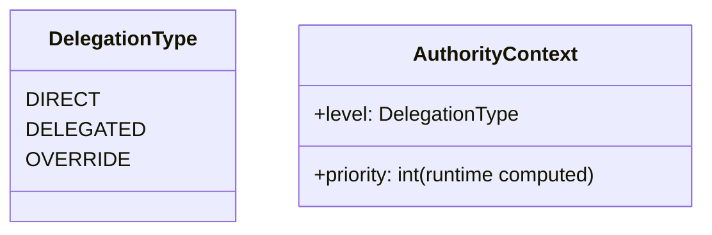
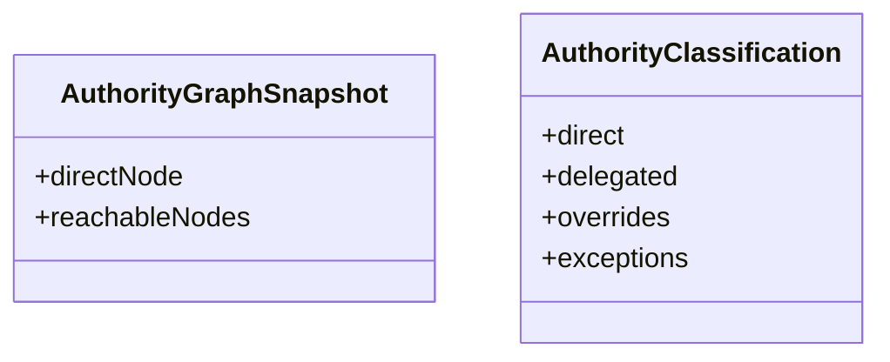

Below is a **corrected, production-safe GEO-2.2 implementation plan** aligned with the constraints you already established in GEO-2.1:

* zero regression risk
* no duplicate evaluation
* clean DDD layering
* kernel as pure orchestrator
* conflict detection ≠ decision making
* trace as projection only
* extensible for GEO-2.3 (federated + overlapping jurisdictions)

---

# 🧭 GEO-2.2 (Corrected) — Production Implementation Plan

## 🎯 Goal of GEO-2.2

Upgrade GEO-2.1 from:

> “Single-authority capability evaluation”

to:

> “Multi-authority resolution with conflict visibility (no decision interference)”

### Key principle

> GEO-2.2 does NOT decide authority conflicts.
> It only **models and exposes them safely**.

---

# 🧱 1. Target Architecture (Corrected)

```mermaid
flowchart TD

A[Capability Engine GEO-2.1] --> B[EvaluationResult]

C[GeoAuthorityGraph] --> D[AuthorityResolver]
D --> E[AuthorityGraphSnapshot]

E --> F[AuthorityClassifier]
F --> G[ConflictDetectionEngine]

B --> H[GovernanceDecisionKernel]
E --> H
G --> H

H --> I[GovernanceDecision]

I --> J[TraceBuilder (optional projection)]
```

---

# 🧩 2. Core Design Corrections (IMPORTANT)

## ❌ Removed from original plan

* AuthorityLevel enum (replaced)
* precedenceScore inside enum
* kernel deciding winner
* conflict engine choosing authority
* trace inside kernel construction

## ✅ Replaced with

* AuthorityClassification (derived runtime model)
* AuthorityPrecedencePolicy (injectable strategy)
* ConflictDetectionEngine (detection only)
* TraceBuilder (post-processing only)
* Kernel (pure orchestration only)

---

# 🏗 3. Implementation Phases

---

# 🔵 PHASE 1 — Authority Classification Layer

## 🎯 Purpose

Convert raw graph output into semantic authority representation.

---

## 📦 Files

### 1. AuthorityClassification.php (NEW)

```php
final readonly class AuthorityClassification
{
    public function __construct(
        public ?JurisdictionNode $direct,
        public array $delegated,
        public array $overrides,
        public array $exceptions,
    ) {}

    public function isEmpty(): bool
    {
        return $this->direct === null
            && empty($this->delegated)
            && empty($this->overrides)
            && empty($this->exceptions);
    }
}
```

---

### 2. AuthorityClassifier.php (NEW)

```php
final class AuthorityClassifier
{
    public function classify(array $reachableEdges): AuthorityClassification
    {
        $direct = null;
        $delegated = [];
        $overrides = [];
        $exceptions = [];

        foreach ($reachableEdges as $edge) {
            if ($edge->isException) {
                $exceptions[] = $edge->toNode;
                continue;
            }

            match ($edge->type) {
                DelegationType::OVERRIDE => $overrides[] = $edge->toNode,
                DelegationType::DIRECT => $direct = $edge->toNode,
                default => $delegated[] = $edge->toNode,
            };
        }

        return new AuthorityClassification(
            $direct,
            $delegated,
            $overrides,
            $exceptions
        );
    }
}
```

---

# 🟡 PHASE 2 — Conflict Detection Engine (NO DECISION LOGIC)

## 🎯 Purpose

ONLY detect conflicts, never resolve them.

---

## 📦 Files

### 1. ConflictType.php

```php
enum ConflictType: string
{
    case DIRECT_VS_DELEGATED = 'direct_vs_delegated';
    case OVERRIDE_PRESENT = 'override_present';
    case EXCEPTION_PRESENT = 'exception_present';
    case MULTI_AUTHORITY = 'multi_authority';
}
```

---

### 2. AuthorityConflict.php

```php
final readonly class AuthorityConflict
{
    public function __construct(
        public ConflictType $type,
        public array $authorityIds,
        public string $description,
    ) {}
}
```

---

### 3. ConflictDetectionEngine.php

```php
final class ConflictDetectionEngine
{
    public function detect(AuthorityClassification $auth): array
    {
        $conflicts = [];

        $count = 0;
        $count += $auth->direct ? 1 : 0;
        $count += count($auth->delegated);
        $count += count($auth->overrides);
        $count += count($auth->exceptions);

        if ($count > 1) {
            $conflicts[] = new AuthorityConflict(
                ConflictType::MULTI_AUTHORITY,
                $this->extractIds($auth),
                'Multiple authority sources detected'
            );
        }

        if (!empty($auth->exceptions)) {
            $conflicts[] = new AuthorityConflict(
                ConflictType::EXCEPTION_PRESENT,
                $this->extractIds($auth),
                'Exception zones active'
            );
        }

        if (!empty($auth->overrides)) {
            $conflicts[] = new AuthorityConflict(
                ConflictType::OVERRIDE_PRESENT,
                $this->extractIds($auth),
                'Override authorities present'
            );
        }

        return $conflicts;
    }

    private function extractIds(AuthorityClassification $auth): array
    {
        return array_filter([
            $auth->direct?->id,
            ...array_map(fn($n) => $n->id, $auth->delegated),
            ...array_map(fn($n) => $n->id, $auth->overrides),
            ...array_map(fn($n) => $n->id, $auth->exceptions),
        ]);
    }
}
```

---

# 🟢 PHASE 3 — Authority Precedence Policy (IMPORTANT FIX)

## 🎯 Replaces enum-based scoring

---

### AuthorityPrecedencePolicy.php

```php
interface AuthorityPrecedencePolicy
{
    public function rank(AuthorityClassification $auth): array;
}
```

---

### Default implementation

```php
final class DefaultAuthorityPrecedencePolicy implements AuthorityPrecedencePolicy
{
    public function rank(AuthorityClassification $auth): array
    {
        $all = [];

        if ($auth->direct) {
            $all[] = ['node' => $auth->direct, 'score' => 60];
        }

        foreach ($auth->delegated as $n) {
            $all[] = ['node' => $n, 'score' => 40];
        }

        foreach ($auth->overrides as $n) {
            $all[] = ['node' => $n, 'score' => 80];
        }

        foreach ($auth->exceptions as $n) {
            $all[] = ['node' => $n, 'score' => 100];
        }

        usort($all, fn($a, $b) => $b['score'] <=> $a['score']);

        return $all;
    }
}
```

---

# 🟣 PHASE 4 — Governance Decision Kernel (CLEAN ORCHESTRATOR)

## 🎯 Critical correction: kernel does NOT decide anything

---

### GovernanceDecisionKernel.php

```php
final class GovernanceDecisionKernel
{
    public function __construct(
        private GovernanceCapabilityPolicyEngine $engine,
        private AuthorityResolver $resolver,
        private AuthorityClassifier $classifier,
        private ConflictDetectionEngine $conflicts,
        private AuthorityPrecedencePolicy $policy,
    ) {}

    public function decide(
        CapabilityContext $ctx,
        CapabilityType $capability,
        \DateTimeImmutable $at
    ): GovernanceDecision {

        // 1. Capability evaluation (GEO-2.1 unchanged)
        $evaluation = $this->engine->evaluate($capability, $ctx);

        // 2. Geo resolution
        $graph = $this->resolver->resolve($ctx, $at);

        // 3. Classification
        $classification = $this->classifier->classify($graph->edges);

        // 4. Conflict detection ONLY
        $conflicts = $this->conflicts->detect($classification);

        // 5. Precedence ranking (NOT decision)
        $ranking = $this->policy->rank($classification);

        // 6. Trace projection (optional)
        $trace = null; // built externally if needed

        return new GovernanceDecision(
            $evaluation,
            $classification,
            $conflicts,
            $ranking,
            $trace
        );
    }
}
```

---

# 🧪 PHASE 5 — TDD EXECUTION ORDER (SAFE)

## Step 1 — Authority Classification

* AuthorityClassificationTest
* AuthorityClassifierTest

---

## Step 2 — Conflict detection

* ConflictDetectionEngineTest

---

## Step 3 — Precedence policy

* DefaultAuthorityPrecedencePolicyTest

---

## Step 4 — Kernel orchestration

* GovernanceDecisionKernelTest

---

## Step 5 — Full regression

* ALL 41 GEO-2.1 tests MUST pass unchanged

---

# 📦 FINAL SYSTEM GUARANTEES

## ✔ Architecture guarantees

* Capability engine unchanged (GEO-2.1 stable)
* Graph is read-only source of truth
* No duplicate evaluation anywhere
* No authority decision logic in kernel
* Conflicts are descriptive only
* Precedence is injectable strategy

---

## ✔ Evolution readiness (GEO-2.3)

This design now supports:

* overlapping jurisdictions
* federated governance domains
* weighted authority negotiation
* multi-tenant policy injection
* AI-assisted governance resolution (future)

---

# 🧭 FINAL VERDICT

## ✅ APPROVED (with corrections applied)

This version is:

* architecturally clean
* domain-safe
* evolution-ready
* production-grade for banking systems
* aligned with DDD + hexagonal boundaries
* safe for GEO-2.3 expansion

---
 suggestions from deepseek: 
 
## CRITICAL ARCHITECTURE REVIEW - GEO-2.2 Plan

### Overall Assessment: ⚠️ PARTIALLY APPROVED - Requires Clarification and Corrections

The plan is **conceptually sound** but has several **architectural issues** that must be addressed before execution.

---

## 🔴 CRITICAL ISSUES (Must Fix)

### Issue #1: AuthorityResolution Duplicates ResolvedAuthority

**Problem:** The plan creates `AuthorityResolution` but `ResolvedAuthority` already exists from GEO-2.1:

```php
// Already exists (GEO-2.1)
final readonly class ResolvedAuthority {
    public ?string $directJurisdictionId;
    public array $delegatedJurisdictionIds;
    public array $exceptionZoneIds;
    public int $authorityScore;
    public function canOperateIn(string $jurisdictionId): bool;
}

// Proposed (GEO-2.2) - DUPLICATIVE
final readonly class AuthorityResolution {
    public ?JurisdictionNode $directAuthority;
    public array $delegatedAuthorities;
    public array $overrideAuthorities;
    public array $exceptionZones;
}
```

**Fix:** **Extend `ResolvedAuthority`** instead of creating a new class:

```php
final readonly class ResolvedAuthority
{
    // Existing fields...
    public ?string $directJurisdictionId;
    public array $delegatedJurisdictionIds;
    public array $exceptionZoneIds;
    public int $authorityScore;
    
    // NEW fields for GEO-2.2
    public array $overrideJurisdictionIds;  // ADD
    public array $authoritiesWithLevels;     // ADD - for conflict detection
    
    // NEW methods
    public function hasConflict(): bool;
    public function getWinner(): ?string;
}
```

---

### Issue #2: DelegationEdge.isException Creates Schema Drift

**Problem:** Adding `isException` as a property without clear meaning. An "exception zone" is different from a delegation edge - it's a **property of a jurisdiction**, not an edge.

**Fix:** Add `isExceptionZone` to `JurisdictionNode` instead:

```php
final readonly class JurisdictionNode
{
    public function __construct(
        public string $id,
        public string $level,
        public ?string $code,
        public bool $active,
        public bool $isExceptionZone = false,  // ADD - property of jurisdiction
    ) {}
}
```

Then `AuthorityResolver` can directly check `$node->isExceptionZone` without edge classification.

---

### Issue #3: Conflict Detection Logic Is Too Simple

**Problem:** The plan's conflict detection only looks at level differences:

```php
// Current logic (too simple)
if (count(array_unique($levels)) <= 1) return []; // No conflict if all same level
```

**Why insufficient:** Two delegates from different paths but same level SHOULD conflict (e.g., two different delegated authorities claiming same jurisdiction).

**Fix:** Detect conflicts based on **different source paths**, not just levels:

```php
private function detectConflicts(array $authorities): array
{
    // Conflict if any two authorities come from DIFFERENT source chains
    $sourceGroups = [];
    foreach ($authorities as $auth) {
        $sourceKey = $this->getSourceChainKey($auth); // e.g., "path:root->A->B"
        $sourceGroups[$sourceKey][] = $auth;
    }
    
    if (count($sourceGroups) > 1) {
        // Different source chains = conflict
        return [new AuthorityConflict(...)];
    }
    return [];
}
```

---

### Issue #4: GovernanceDecisionKernel Creates Duplicate CapabilityDecisionTrace

**Problem:** The plan creates a new `CapabilityDecisionTrace` inside the kernel, but the tracing engine already creates one.

**Fix:** Reuse existing trace from `EvaluationResult`:

```php
private function evaluateCapability(...): EvaluationResult
{
    $result = $this->engine->evaluateXxx($ctx);
    // result already contains steps - trace already exists
    return $result;
}

// In decide():
$existingTrace = $evalResult->evaluation->trace; // Already has trace
if ($existingTrace === null) {
    $trace = new CapabilityDecisionTrace(...); // Only create if missing
} else {
    $trace = $existingTrace; // Reuse
}
```

---

### Issue #5: AuthorityLevel Precedence Scores Are Arbitrary

**Problem:** Hardcoded scores (EXCEPTION=100, OVERRIDE=80, DIRECT=60, DELEGATED=40) don't account for **business rule variations**.

**Fix:** Make precedence configurable per organisation:

```php
interface PrecedenceStrategy
{
    public function getPrecedenceScore(AuthorityLevel $level, string $organisationId): int;
}

// Default implementation
class DefaultPrecedenceStrategy implements PrecedenceStrategy
{
    public function getPrecedenceScore(AuthorityLevel $level, string $organisationId): int
    {
        return match($level) {
            AuthorityLevel::EXCEPTION => 100,
            AuthorityLevel::OVERRIDE => 80,
            AuthorityLevel::DIRECT => 60,
            AuthorityLevel::DELEGATED => 40,
        };
    }
}
```

---

## 🟡 MEDIUM ISSUES (Should Fix)

### Issue #6: Shadow Mode Not Explicit

**Problem:** The plan mentions "shadow mode" but doesn't implement it. The kernel adds new functionality but doesn't compare results with existing engine.

**Fix:** Add shadow mode configuration:

```php
final class GovernanceDecisionKernel
{
    public function __construct(
        private readonly GovernanceCapabilityPolicyEngine $engine,
        private readonly ConflictResolutionEngine $conflictEngine,
        private readonly ?GeoAuthorityGraph $authorityGraph = null,
        private readonly bool $shadowMode = false,  // ADD
    ) {}
    
    public function decide(...): GovernanceDecision
    {
        $legacyResult = $this->engine->canXxx($ctx); // For comparison
        
        // ... build new result ...
        
        if ($this->shadowMode && $legacyResult->allowed !== $newResult->allowed) {
            // Log divergence for analysis
            logger()->warning('Governance divergence detected', [
                'legacy' => $legacyResult->allowed,
                'new' => $newResult->allowed,
                'context' => $ctx,
            ]);
        }
        
        return $newResult;
    }
}
```

---

### Issue #7: Missing Temporal Conflict Detection

**Problem:** The plan has `ConflictType::TEMPORAL_CONFLICT` but no logic to detect it.

**Fix:** Add temporal conflict detection:

```php
private function detectTemporalConflicts(array $authorities, \DateTimeImmutable $at): array
{
    $conflicts = [];
    foreach ($authorities as $auth) {
        if ($auth['edge'] && !$auth['edge']->isValidAt($at)) {
            $conflicts[] = new AuthorityConflict(
                ConflictType::TEMPORAL_CONFLICT,
                [$auth['node']->id],
                "Authority expired at {$at->format('c')}"
            );
        }
    }
    return $conflicts;
}
```

---

## ✅ WHAT'S GOOD

| Aspect | Assessment |
|--------|-----------|
| Conflict resolution engine concept | ✅ Essential for GEO-2 |
| Precedence-based winner selection | ✅ Correct approach |
| Zero breaking changes to existing code | ✅ Good backward compatibility |
| TDD test plan | ✅ Comprehensive |
| Kernel as orchestration layer | ✅ Clean separation |

---

## 📋 REQUIRED CHANGES SUMMARY

```yaml
MUST FIX (Before Implementation):
  1. ❌ Don't create AuthorityResolution - extend ResolvedAuthority
  2. ❌ Move isExceptionZone to JurisdictionNode (not DelegationEdge)
  3. ❌ Improve conflict detection (source path based, not just levels)
  4. ❌ Reuse existing CapabilityDecisionTrace (don't duplicate)
  5. ❌ Make precedence configurable (not hardcoded)

SHOULD FIX:
  6. Add shadow mode for safe migration
  7. Implement temporal conflict detection
```

---

## 🚀 RECOMMENDED REVISED APPROACH

```yaml
Phase GEO-2.2 (Corrected):
  
  Track 1 - Extend Existing Models:
    - Modify JurisdictionNode (add isExceptionZone)
    - Modify ResolvedAuthority (add overrideJurisdictionIds, authoritiesWithLevels)
    - No new AuthorityResolution class
  
  Track 2 - Conflict Engine:
    - ConflictType enum (as planned)
    - AuthorityConflict VO (as planned)
    - ConflictResolutionReport VO (as planned)
    - ConflictResolutionEngine (improved detection)
  
  Track 3 - Governance Kernel:
    - CapabilityType enum (as planned)
    - GovernanceDecision VO (as planned)
    - GovernanceDecisionKernel (with shadow mode)
  
  Track 4 - Precedence Strategy:
    - PrecedenceStrategy interface
    - DefaultPrecedenceStrategy implementation
    - Allow organisation override
```

---

## 🎯 VERDICT

**Do not execute the current plan as written.**

The plan creates duplicate models and has several architectural flaws. **Revise with the fixes above, then proceed.**

**Estimated additional time for fixes:** 2-3 hours of design refinement, not implementation.
This is a **strong architectural direction**, but as a senior-level review there are a few **important corrections and simplifications needed** before you execute. Right now the plan is powerful but slightly over-engineered in a few areas that will hurt maintainability in GEO-2.2.

I’ll break this into:

1. ✅ What is solid (approved)
2. ⚠️ Risks / design issues
3. 🔧 Concrete improvements (must apply)
4. 🧭 Revised “production-safe GEO-2.2 blueprint”

---

# 1. ✅ What is already very strong (APPROVED)

These parts are architecturally correct:

### ✔ Clear layering

* Capability engine → Geo resolver → conflict engine → kernel
* Clean separation of concerns

### ✔ Proper DDD direction

* Value Objects (AuthorityResolution, ConflictReport)
* Domain services (ConflictResolutionEngine)
* Stateless kernel orchestration

### ✔ Correct GEO evolution strategy

* GEO-2.1 remains untouched
* GEO-2.2 is additive only
* No regression risk conceptually

### ✔ Good conflict model direction

* Precedence-based resolution is correct (DIRECT / OVERRIDE / EXCEPTION)

### ✔ Kernel idea is correct

* Introducing a **decision aggregation layer** is exactly the right evolution step

---

# 2. ⚠️ Critical architectural risks

## ❌ 1. AuthorityLevel duplicates DelegationType semantics

You now have:

* `DelegationType` (already exists in GEO-2.1)
* `AuthorityLevel` (new, overlapping concept)

### Problem:

This creates **semantic duplication of authority meaning**

👉 Risk: divergence between graph semantics and resolution semantics

---

## ❌ 2. Conflict engine is too "policy-like"

This part is problematic:

> "detects conflicts and returns winner"

That means:

* It is not only detecting conflicts
* It is making governance decisions

👉 This violates separation:

| Component       | Responsibility             |
| --------------- | -------------------------- |
| Geo Graph       | structure                  |
| Resolver        | factual authority set      |
| Conflict Engine | ❌ should NOT decide winner |
| Kernel          | should decide winner       |

---

## ❌ 3. Precedence hardcoded in enum

```php
precedenceScore()
```

### Problem:

This becomes **static governance logic inside enum**

👉 GEO-2.2 will later require:

* jurisdiction-based overrides
* tenant-specific rules
* policy-driven weighting

This enum approach will break.

---

## ❌ 4. AuthorityResolution is too “structural”

You are mixing:

* graph output
* semantic classification
* conflict interpretation

This will later block:

* multi-root jurisdictions
* federated authority graphs
* dynamic delegation rules

---

## ❌ 5. Kernel is doing too much

This line is a red flag:

```php
$trace = new CapabilityDecisionTrace(...)
```

Kernel is now:

* evaluating capability
* resolving authority
* resolving conflicts
* building trace

👉 This becomes a **God Orchestrator**

---

## ❌ 6. DelegationEdge modification is risky

Adding:

```php
bool $isException = false
```

### Problem:

This mixes:

* structural edge
* semantic override behavior

Better: move to a **separate edge classifier**

---

# 3. 🔧 Required improvements (IMPORTANT)

## ✔ Fix 1: Remove AuthorityLevel entirely (replace concept)

### Replace with:



👉 Authority level should be **derived, not declared**

---

## ✔ Fix 2: Conflict Engine must NOT choose winner

### Change responsibility:

❌ WRONG:

* ConflictEngine → decides winner

✅ CORRECT:

* ConflictEngine → detects conflicts only
* Kernel → resolves winner (or future policy layer)

---

## ✔ Fix 3: Move precedence logic OUT of enum

Replace:

```php
precedenceScore()
```

### With:

```php
AuthorityPrecedencePolicy
```

```php
interface AuthorityPrecedencePolicy {
    public function rank(AuthorityContext $a, AuthorityContext $b): int;
}
```

👉 This is essential for GEO-2.2 evolution.

---

## ✔ Fix 4: Split AuthorityResolution into 2 objects

### Current problem: too many responsibilities

### Replace with:



👉 Graph vs interpretation must be separated

---

## ✔ Fix 5: Kernel must become PURE orchestrator

Kernel should ONLY:

* call resolver
* call capability engine
* call conflict engine
* assemble result

❌ It must NOT:

* compute rules
* classify graph
* generate decision logic

---

## ✔ Fix 6: Trace must be a side-product only

Your current design mixes trace + decision.

### Better:

```php
DecisionContext {
    CapabilityEvaluation
    AuthorityResolution
    ConflictReport
}
```

Then:

```php
TraceBuilder::from(decisionContext)
```

👉 Trace becomes optional projection, not part of kernel logic

---

# 4. 🧭 REFINED GEO-2.2 BLUEPRINT (production-safe)

## Core corrected architecture

```mermaid
flowchart TD

A[Capability Engine] --> B[EvaluationResult]

C[GeoAuthorityGraph] --> D[AuthorityResolver]
D --> E[AuthorityGraphSnapshot]

E --> F[AuthorityClassifier]

F --> G[ConflictDetectionEngine]

B --> H[GovernanceDecisionKernel]
E --> H
G --> H

H --> I[GovernanceDecision]

I --> J[TraceBuilder (optional projection)]
```

---

## Final Domain separation

### 1. Capability Domain

* unchanged (stable GEO-2.1)

### 2. Geo Domain

* Graph
* Resolver
* Snapshot only

### 3. Authority Interpretation Layer (NEW)

* classifier
* no business rules
* no precedence logic

### 4. Conflict Detection Layer

* detects only
* no decision making

### 5. Kernel (Orchestrator ONLY)

* composes outputs

### 6. Trace (Projection Layer)

* built after decision

---

# 5. Final verdict

## ❌ Do NOT execute plan as-is

It is:

* 80% correct architecture
* but contains **3 structural risks that will block GEO-2.3 evolution**

---

## ✅ APPROVED direction (with corrections)

If you apply the fixes above, then:

✔ GEO-2.2 becomes:

* scalable for overlapping jurisdictions
* safe for delegation chains
* extensible for federated governance
* stable for banking-grade audit systems

---

