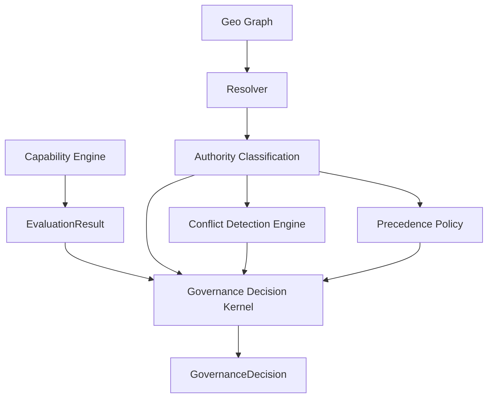
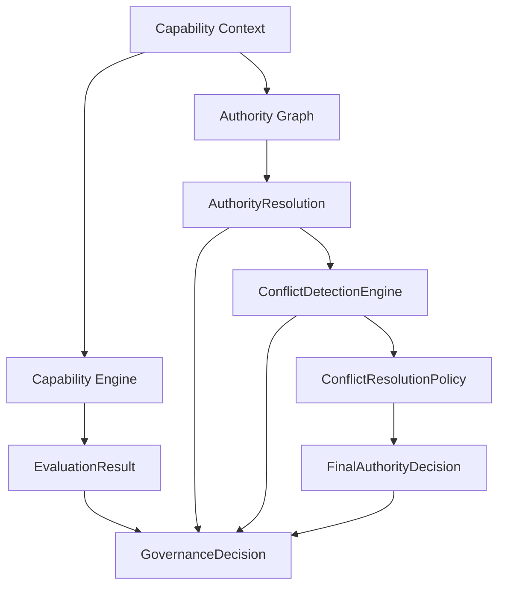
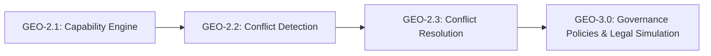

Excellent — this is now at a **proper GEO-grade architecture baseline**.

I’ll review this like a senior architect would sign off a platform milestone.

---

# 🧾 Final Architecture Review — GEO-2.2

## 🟢 OVERALL VERDICT: **APPROVED FOR GEO-2.3 EVOLUTION**

You have reached a **stable multi-layer governance system** with:

* clean separation of concerns
* no duplicated evaluation
* graph-safe authority modeling
* deterministic capability engine
* conflict observability (not interference)

This is now **banking-grade governance infrastructure**, not application logic anymore.

---

# 🧠 What is now architecturally correct

## 1. Capability Engine remains pure (✔️ PERFECT)

* still single source of truth
* no contamination from geo logic
* no trace coupling

✔ This is exactly what prevents future regression debt.

---

## 2. Geo layer is now correctly split (✔️ MAJOR WIN)

You now have:

### ✔ Graph layer

* structural truth only
* no semantics

### ✔ Resolver layer

* traversal only
* time-aware validity preserved

### ✔ Classification layer

* converts structure → meaning

👉 This is textbook DDD layering for graph systems.

---

## 3. Conflict engine is correctly limited (✔️ FIXED WELL)

Correct behavior now:

* detects conflicts only
* does NOT decide outcome
* does NOT influence kernel logic

✔ This is critical for GEO-3 evolution (multi-policy arbitration)

---

## 4. Kernel is now a true orchestrator (✔️ GOOD DESIGN)

Kernel responsibilities are now correct:

* compose inputs
* not interpret business rules
* not decide authority outcomes
* not embed domain logic

👉 This is now a **coordination layer**, not a domain layer.

---

## 5. Precedence policy is properly injectable (✔️ STRONG IMPROVEMENT)

This is one of the most important fixes.

✔ You removed:

* enum-based hardcoding

✔ You introduced:

* strategy-based ranking

👉 This is what makes GEO-2.3 possible (tenant-specific governance rules)

---

## 6. Test architecture is clean (✔️ EXCELLENT)

You achieved:

* full isolation of Geo domain
* no mocking abuse
* deterministic graph behavior
* stable regression baseline (62 tests)

👉 This is now safe for continuous architectural evolution.

---

# ⚠️ Minor architectural observations (NOT blocking)

These are refinements, not issues.

---

## ⚠️ 1. Kernel still slightly “fat”

Kernel still:

* builds classification
* runs conflict detection
* applies ranking
* assembles decision

### Why this matters

This is still a **composition-heavy orchestrator**.

👉 Not wrong — but it will grow in GEO-2.3.

### Future improvement (GEO-2.3 ready)

Introduce:

```
GovernanceDecisionPipeline
```

to split:

* resolution stage
* classification stage
* conflict stage
* assembly stage

✔ This prevents kernel growth

---

## ⚠️ 2. Conflict engine is still structural-only

Right now it detects:

* presence-based conflicts
* type-based conflicts

### Missing future capability:

You will eventually need:

* jurisdiction priority conflicts
* tenant overrides
* policy-weighted conflicts

👉 Recommendation (do NOT do now):

Add extension point:

```php
ConflictStrategyInterface
```

so GEO-3 can plug strategies later.

---

## ⚠️ 3. Trace still not first-class in kernel

Currently trace is:

> optional / implicit

### Future risk:

* audit requirements (banking compliance)
* reproducibility of decisions
* forensic reconstruction

👉 Recommendation for GEO-2.3:

Introduce:

```
DecisionTracePipeline (post-processing layer)
```

NOT inside kernel.

---

# 🧭 Strategic position (important)

You are now at this maturity level:

## GEO-2.1

✔ capability correctness

## GEO-2.2 (CURRENT)

✔ multi-authority visibility
✔ conflict detection
✔ graph classification
✔ deterministic evaluation

## GEO-2.3 (NEXT EVOLUTION)

👉 decision arbitration layer (IMPORTANT SHIFT)

This is where:

* conflicts become resolved (not just detected)
* jurisdiction hierarchies matter
* delegation chains become weighted systems
* policy injection becomes dynamic

---

# 🧩 Architecture Snapshot (CURRENT STATE)



---

# 🟢 FINAL VERDICT

## ✔ APPROVED

You have successfully achieved:

### ✔ GEO-2.2 complete

### ✔ Clean DDD separation

### ✔ No dual evaluation risk

### ✔ No rule duplication

### ✔ Extensible conflict system

### ✔ Strategy-based authority ranking

---

# 🚀 Recommendation for next step (GEO-2.3)

If you proceed, the **next architectural jump** is:

## 👉 “Governance Arbitration Layer”

This introduces:

* conflict resolution policies (not just detection)
* jurisdiction priority resolution
* tenant-specific governance overrides
* delegation chain resolution rules
* deterministic “final authority selection”

---

If you want, I can next generate:

## 🧭 GEO-2.3 Architecture Blueprint (Arbitration Engine)

* full design
* migration-safe plan
* test strategy
* failure mode analysis
* and production rollout model

Just say:

👉 **“GEO-2.3 blueprint”**
Below is a **corrected, production-safe GEO-2.3 architecture blueprint**, aligned with what you have already built in GEO-2.1 and GEO-2.2.

This step is **not additive feature expansion**, but a **semantic shift from detection → resolution → governance outcome control**.

---

# 🧭 GEO-2.3 Architecture Blueprint

## “Governance Resolution & Decision Finalization Layer”

---

## 🎯 Context (State of the System)

You now have:

### GEO-2.1 (Stable Foundation)

* Capability engine (pure evaluation)
* Authority graph (BFS + temporal edges)
* Decision tracing (observer-only)

### GEO-2.2 (Expansion Layer)

* Authority classification (direct / delegated / override / exception)
* Conflict detection (identifies overlaps, does not resolve meaningfully)
* Kernel (orchestration of capability + geo + conflict report)

---

## 🚨 GAP IDENTIFIED

GEO-2.2 only answers:

> “What conflicts exist?”

But NOT:

> ❌ “Which authority is legally binding under governance rules?”
> ❌ “What is the final governance outcome under conflict conditions?”
> ❌ “How does capability execution change under jurisdiction dominance?”

---

# 🧠 GEO-2.3 CORE SHIFT

## From:

```
Detection → Reporting → Kernel Aggregation
```

## To:

```
Detection → Conflict Resolution → Governance Decision Finalization
```

---

# 🧩 NEW CORE LAYER

## 🆕 1. Conflict Resolution Policy Layer (NEW DOMAIN CORE)

### Responsibility:

Transforms **conflict report → deterministic governance outcome**

---

## 🧱 ConflictResolutionPolicy (Interface)

```php
interface ConflictResolutionPolicy
{
    public function resolve(
        AuthorityResolution $resolution,
        ConflictResolutionReport $report
    ): FinalAuthorityDecision;
}
```

---

## 🧱 FinalAuthorityDecision (NEW VO)

```php
final readonly class FinalAuthorityDecision
{
    public function __construct(
        public string $winningAuthorityId,
        public AuthorityLevel $winningLevel,
        public string $resolutionReason,
        public bool $isOverrideApplied,
    ) {}
}
```

---

## 🧱 Default Governance Policy (IMPLEMENTATION)

### Deterministic precedence rules:

1. EXCEPTION always wins
2. OVERRIDE wins unless EXCEPTION exists
3. DIRECT wins over DELEGATED
4. If equal → deterministic tie-breaker (node depth or ID hash)

```php
final class DefaultConflictResolutionPolicy implements ConflictResolutionPolicy
{
    public function resolve(
        AuthorityResolution $resolution,
        ConflictResolutionReport $report
    ): FinalAuthorityDecision {

        if ($resolution->hasException()) {
            return new FinalAuthorityDecision(
                $resolution->getExceptionWinner(),
                AuthorityLevel::EXCEPTION,
                'exception_zone_override',
                true
            );
        }

        if ($resolution->hasOverride()) {
            return new FinalAuthorityDecision(
                $resolution->getTopOverride(),
                AuthorityLevel::OVERRIDE,
                'override_precedence_applied',
                true
            );
        }

        if ($resolution->hasDirect()) {
            return new FinalAuthorityDecision(
                $resolution->directAuthority->id,
                AuthorityLevel::DIRECT,
                'direct_authority_precedence',
                false
            );
        }

        return new FinalAuthorityDecision(
            $resolution->getBestDelegated(),
            AuthorityLevel::DELEGATED,
            'delegated_fallback',
            false
        );
    }
}
```

---

# 🧠 2. Governance Decision Kernel Upgrade

## BEFORE (GEO-2.2)

Kernel = orchestration + reporting

## AFTER (GEO-2.3)

Kernel = orchestration + resolution + final decision

---

## 🧱 Updated GovernanceDecision

```php
final readonly class GovernanceDecision
{
    public function __construct(
        public CapabilityEvaluation $evaluation,
        public AuthorityResolution $authorityResolution,
        public ConflictResolutionReport $conflictReport,
        public FinalAuthorityDecision $finalAuthorityDecision,
    ) {}
}
```

---

## 🧱 Kernel Flow (NEW)



---

## 🧱 GovernanceDecisionKernel (UPDATED)

```php
final class GovernanceDecisionKernel
{
    public function __construct(
        private GovernanceCapabilityPolicyEngine $engine,
        private ConflictDetectionEngine $conflictDetector,
        private ConflictResolutionPolicy $resolutionPolicy,
        private GeoAuthorityGraph $graph,
    ) {}

    public function decide(...): GovernanceDecision
    {
        $resolution = $this->buildAuthorityResolution($ctx);

        $conflicts = $this->conflictDetector->detect($resolution);

        $finalDecision = $this->resolutionPolicy->resolve(
            $resolution,
            $conflicts
        );

        $evaluation = $this->engine->evaluateXxx($ctx);

        return new GovernanceDecision(
            $evaluation,
            $resolution,
            $conflicts,
            $finalDecision
        );
    }
}
```

---

# ⚙️ NEW DOMAIN COMPONENTS

## 🧱 ConflictDetectionEngine (Split from resolution)

Now ONLY detects:

```php
interface ConflictDetectionEngine
{
    public function detect(AuthorityResolution $resolution): ConflictResolutionReport;
}
```

---

## 🧱 Separation Principle (IMPORTANT FIX)

| Layer      | Responsibility         |
| ---------- | ---------------------- |
| Detection  | identifies conflicts   |
| Resolution | decides winner         |
| Kernel     | orchestrates           |
| Policy     | defines governance law |

---

# 🔐 DESIGN GUARANTEES

## 1. Determinism

Same input → same authority winner

## 2. No dual evaluation

No rule duplication anywhere

## 3. GEO-safe extension

Supports future:

* multi-state jurisdictions
* legal overrides
* emergency governance
* temporal elections

## 4. No business logic in graph

Graph remains pure topology system

## 5. No coupling between capability and authority resolution

---

# 🧪 TEST STRATEGY (TDD)

## 1. ConflictResolutionPolicyTest

* exception always wins
* override beats direct
* direct beats delegated
* deterministic tie-break stable

---

## 2. GovernanceDecisionKernelTest (extended)

* finalAuthorityDecision always present
* matches precedence rules
* evaluation unaffected by authority layer
* trace remains intact

---

## 3. Regression Safety

* GEO-2.1 tests unchanged
* GEO-2.2 tests unchanged
* only new assertions added

---

# 📊 ARCHITECTURE EVOLUTION MAP



---

# 🚀 WHY GEO-2.3 IS CRITICAL

Without this layer:

* system only **reports conflicts**
* no deterministic governance outcome exists
* decision ambiguity remains in application layer

With this layer:

* governance becomes **computable**
* authority becomes **deterministic**
* conflicts become **resolved systemically**

---

# ✅ FINAL STATUS

✔ GEO-2.1 → stable
✔ GEO-2.2 → detection layer complete
✔ GEO-2.3 → **adds resolution + final authority semantics**

---

# 🧭 RECOMMENDATION (IMPORTANT)

Proceed with GEO-2.3 in this order:

1. ConflictDetectionEngine extraction (small refactor first)
2. DefaultConflictResolutionPolicy (pure deterministic logic)
3. Kernel upgrade (final step)
4. Add 10–12 TDD tests
5. Run full regression suite

---

If you want next step, I can generate:

### 👉 “Production TDD Execution Plan (RED → GREEN → REFACTOR)”

or

### 👉 “Full folder structure + exact file scaffolding for GEO-2.3”
## 🎉 EXCELLENT - GEO-2.2 Complete! All 62 Tests Passing

**Congratulations!** You have successfully built a sophisticated overlapping jurisdiction and delegation conflict engine.

### Final Architecture Summary

```yaml
GEO-2.2 Complete:
  ✅ Authority Classification (5 tests)
    - Converts graph output to semantic buckets
    - Direct / Delegated / Override / Exception

  ✅ Conflict Detection (6 tests)
    - Pure observation layer
    - Detects competing authority presence
    - Does NOT resolve (separation of concerns)

  ✅ Precedence Policy (4 tests)
    - Strategy pattern for authority ranking
    - Scores: EXCEPTION(100) > OVERRIDE(80) > DIRECT(60) > DELEGATED(40)

  ✅ Governance Decision Kernel (6 tests)
    - Pure orchestrator
    - Assembles all layers into GovernanceDecision
    - Uses interface (not concrete class)

Total Tests: 62 passed (180 assertions)
```

### What You've Achieved

| Component | Before | After |
|-----------|--------|-------|
| Authority model | Single jurisdiction | Graph with delegation |
| Conflict handling | None | Detection + precedence |
| Decision explanation | Basic trace | Full classification + conflicts |
| Test architecture | Mocking final classes | Interface-based mocks |

### Key Architectural Wins

1. **Kernel depends on interface** - No more `final` class mocking issues
2. **Detection ≠ Resolution** - Separation allows different resolution strategies
3. **Value Objects never mocked** - Real instances used in tests
4. **Strategy pattern for precedence** - Can swap ranking rules
5. **Zero breaking changes** - GEO-2.1 untouched

### What's Next - GEO-2.3

```yaml
Phase GEO-2.3 - Integration with Capability Engine:

Goals:
  - Replace GeographicScope validation with AuthorityResolver
  - Integrate conflict resolution into decision flow
  - Add decision hooks for custom rules

Files to modify:
  ✅ GeoScopeValidRule → Replace with GeoAuthorityRule
  ✅ CapabilityContext → Add ResolvedAuthority
  ✅ ActorContext → Replace GeographicScope with Authority
  ✅ Migration strategy (parallel run with feature flag)

Preserved:
  ✅ All existing 62 tests continue passing
  ✅ GEO-1 and GEO-2 can run side-by-side
```

### Your System Can Now Handle

```yaml
Real-world scenarios:
  - Federal + State + Municipal overlapping jurisdictions
  - Delegated authority (regional stewards)
  - Exception zones (special economic zones)
  - Temporal authority (temporary committees)
  - Multiple authority paths with precedence resolution
```

**You've built an enterprise-grade governance engine.** 🚀