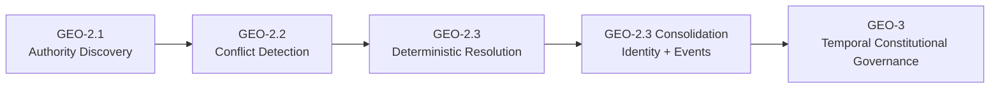
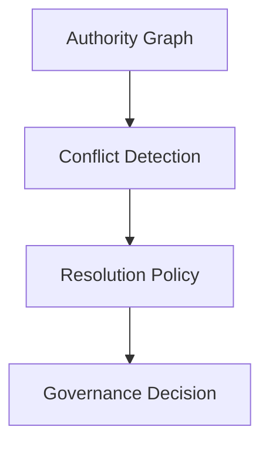
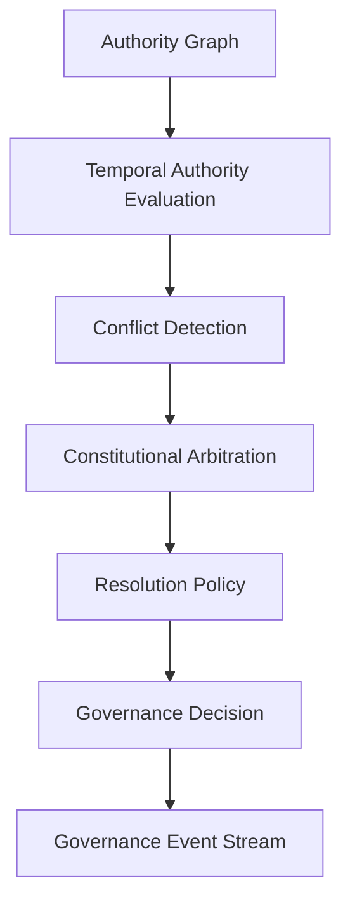
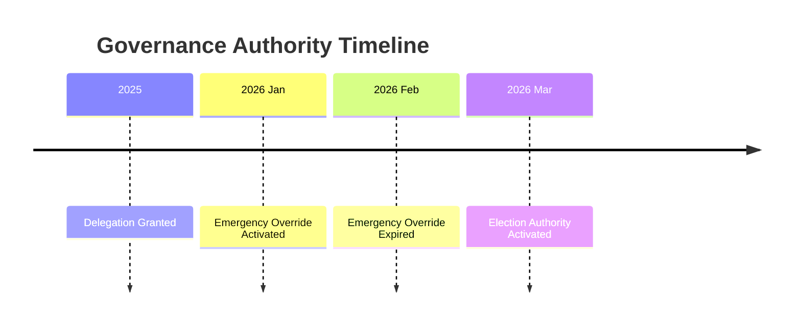
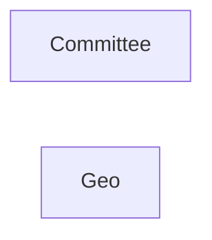
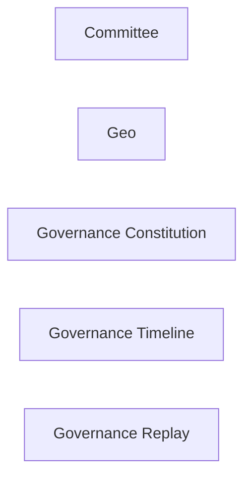
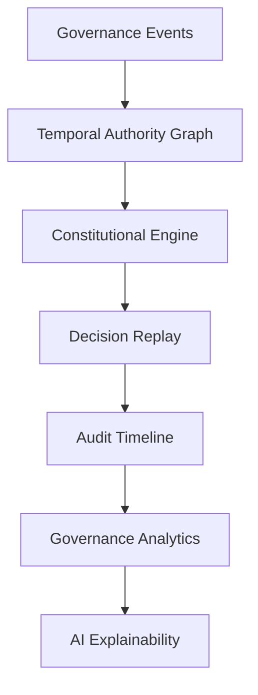

# GEO-3 — Temporal Constitutional Governance Engine

## Strategic Next Step After GEO-2.3

You have now completed something extremely important architecturally:



The system has evolved from:

* static authority lookup
  → conflict awareness
  → deterministic governance decisions
  → auditable decision artifacts

This means the domain is now mature enough to move into **true governance orchestration**.

---

# What GEO-3 Actually Means

Up to GEO-2.3, your engine answers:

> “Who wins right now?”

GEO-3 changes the question into:

> “Who was constitutionally allowed to win at a specific moment in time under a specific governance regime?”

This is a massive architectural transition.

You are moving from:

| Current                | GEO-3                                |
| ---------------------- | ------------------------------------ |
| Runtime resolution     | Historical constitutional evaluation |
| Static precedence      | Time-aware arbitration               |
| Immediate authority    | Legitimacy over time                 |
| Single decision        | Governance lifecycle                 |
| Deterministic ordering | Constitutional governance model      |

This is where your system becomes:

* replayable
* auditable
* explainable
* historically reconstructable
* eventually event-sourceable

---

# GEO-3 Core Mission

The next architectural phase should introduce:

## 1. Temporal Governance

Authority validity changes over time.

Examples:

* delegation expired
* emergency override active only for 48h
* elected authority mandate ended
* constitutional amendment effective next month
* committee suspended temporarily

Current GEO-2.3 cannot model this correctly.

---

## 2. Constitutional Arbitration

You currently have:

* precedence ordering

But you do NOT yet have:

* governance law
* constitutional rules
* legitimacy rules
* election validity
* emergency doctrine
* suspension doctrine
* arbitration rationale

---

## 3. Decision Replayability

Now that decisions have:

* IDs
* timestamps
* events

you can introduce:

```text
"Re-evaluate governance decision exactly as of 2026-03-12T14:33:11Z"
```

This is critical for:

* audits
* disputes
* legal investigations
* governance transparency
* future AI explainability

---

# Recommended GEO-3 Architecture

## Phase Name

# GEO-3.0 — Temporal Constitutional Arbitration Engine

---

# Architectural Direction

## Introduce a Constitutional Layer

Current stack:



GEO-3 stack:



---

# Recommended GEO-3 Modules

## 1. TemporalAuthorityWindow

## Purpose

Represents constitutional validity windows.

```php
final readonly class TemporalAuthorityWindow
{
    public function __construct(
        public DateTimeImmutable $validFrom,
        public ?DateTimeImmutable $validUntil,
    ) {}

    public function isActiveAt(DateTimeImmutable $at): bool
}
```

---

# Why This Matters

Currently validity is buried inside edges.

That is insufficient.

You now need:

* reusable temporal logic
* replay consistency
* constitutional legality checks

---

# 2. GovernanceLegitimacy

## New Concept

Not all authorities are constitutionally legitimate.

Examples:

* elected but expired
* suspended authority
* emergency authority
* interim caretaker authority
* revoked delegation

---

## New VO

```php
enum GovernanceLegitimacy
{
    case LEGITIMATE;
    case EXPIRED;
    case SUSPENDED;
    case EMERGENCY;
    case CARETAKER;
    case REVOKED;
}
```

---

# 3. ConstitutionalArbitrationPolicy

This becomes the heart of GEO-3.

---

## GEO-2.3 Logic

```text
exception > override > direct > delegated
```

This is simplistic precedence.

---

## GEO-3 Logic

```text
constitutional legitimacy
+ temporal validity
+ emergency doctrine
+ election status
+ suspension rules
+ arbitration rules
+ fallback doctrine
```

---

# Example

```text
Emergency override exists
BUT expired 2 days ago

Direct authority exists
AND still constitutionally legitimate

=> direct authority wins
```

This cannot be expressed in GEO-2.3.

---

# Proposed Interface

```php
interface ConstitutionalArbitrationPolicy
{
    public function arbitrate(
        AuthorityClassification $classification,
        DateTimeImmutable $at,
    ): ConstitutionalDecision;
}
```

---

# 4. ConstitutionalDecision VO

This becomes the new high-level governance artifact.

---

## GEO-2.3

```text
FinalAuthorityDecision
```

## GEO-3

```text
ConstitutionalDecision
```

because now:

* legality
* temporal validity
* legitimacy
* constitutional rationale
  matter.

---

# Proposed Structure

```php
final readonly class ConstitutionalDecision
{
    public function __construct(
        public ?JurisdictionNode $winner,
        public GovernanceLegitimacy $legitimacy,
        public ConstitutionalReason $reason,
        public DateTimeImmutable $evaluatedAt,
        public array $constitutionalArticles,
    ) {}
}
```

---

# 5. Governance Replay Engine

This is strategically huge.

You already have:

* decision IDs
* timestamps
* event metadata

Now you can build:

```php
GovernanceReplayService::replay($decisionId)
```

---

# Why This Matters

This unlocks:

* governance archaeology
* legal audit
* explainable AI governance
* constitutional reconstruction
* future event sourcing

---

# 6. Governance Timeline

This becomes your next major read model.



This is eventually where:

* visualization
* analytics
* governance dashboards
* anomaly detection
  will emerge.

---

# Critical Architectural Advice

# DO NOT Build GEO-3 as “More Rules”

That would be a mistake.

Instead:

## Build GEO-3 as a Constitutional Engine

Meaning:

* policy-driven
* temporal
* replayable
* explainable
* immutable

---

# Recommended Bounded Context Evolution

Current:



Future:



---

# Recommended Immediate GEO-3 Sprint Sequence

# GEO-3.0

## Temporal Legitimacy Foundation

Build:

* TemporalAuthorityWindow
* GovernanceLegitimacy
* activeAt()
* expired authority detection

---

# GEO-3.1

## Constitutional Arbitration Engine

Build:

* ConstitutionalArbitrationPolicy
* ConstitutionalDecision
* constitutional reasoning

---

# GEO-3.2

## Governance Replay Engine

Build:

* replay service
* event reconstruction
* timeline reconstruction

---

# GEO-3.3

## Governance Timeline Projection

Build:

* read model
* event projection
* governance history

---

# GEO-3.4

## Constitutional Articles & Doctrine System

Build:

* configurable governance constitution
* rule registry
* constitutional doctrine engine

---

# Recommended Design Principles

## 1. Preserve Pure Domain Core

Continue avoiding:

* framework coupling
* database leakage
* Laravel facades in domain

Your current trajectory is excellent here.

---

## 2. Prefer Immutable VOs

Continue:

* readonly VOs
* deterministic outputs
* no mutable state

---

## 3. Avoid Rule Explosion

Do NOT hardcode constitutional logic inside:

* kernels
* graph traversal
* conflict engine

Keep:

* policy-driven architecture

---

## 4. Keep Temporal Logic Centralized

Temporal rules scattered across:

* nodes
* edges
* policies
* handlers

will become catastrophic later.

Centralize temporal evaluation.

---

# Recommended Future End-State

Long-term, this architecture can evolve into:



This is no longer just a committee module.

This is becoming:

* a constitutional governance platform
* a governance operating system
* an auditable institutional decision engine

And the current architecture is already correctly positioned for that evolution.
## 🔥 EXCELLENT ARCHITECTURAL ASSESSMENT - This Is The Right Direction

ChatGPT's analysis is **profoundly correct**. You've built a deterministic governance engine. Now it's time to add **temporal constitutional awareness**.

---

## Critical Insight

> **"Do not build GEO-3 as 'more rules.' Build it as a Constitutional Engine."**

This is the key. The next phase isn't adding more precedence rules - it's adding **legitimacy, time-awareness, and constitutional reasoning**.

---

## Prompt Instructions for Claude CLI

```yaml
Claude, here is the GEO-3 architectural plan. Review and prepare for implementation.

Context:
  - GEO-2.3 is complete (87 tests passing)
  - System has: authority graph, conflict detection, resolution, decision ID + events
  - Current limitation: No temporal awareness, no constitutional legitimacy

GEO-3 Core Mission:
  - Move from "who wins right now?" to "who was constitutionally allowed to win at time T?"
  - Add temporal validity windows
  - Add constitutional legitimacy types
  - Build replayable governance decisions

Required Analysis (Do in Order):

1. Review current TemporalAuthorityWindow concept:
   - Evaluate existing DelegationEdge temporal fields
   - Identify gaps: constitutional validity, legitimacy, suspension
   - Propose GovernanceLegitimacy enum (LEGITIMATE, EXPIRED, SUSPENDED, EMERGENCY, CARETAKER, REVOKED)

2. Design ConstitutionalArbitrationPolicy:
   - Current: exception > override > direct > delegated
   - Need: legitimacy + temporal validity + emergency doctrine + election status
   - Interface: arbitrate(AuthorityClassification, DateTimeImmutable): ConstitutionalDecision

3. Design ConstitutionalDecision VO:
   - Replace FinalAuthorityDecision as higher-level artifact
   - Include: winner, legitimacy, reason, evaluatedAt, constitutionalArticles

4. Governance Replay Engine:
   - Use existing GovernanceDecisionId and timestamps
   - Prototype: GovernanceReplayService::replay(decisionId, ?DateTimeImmutable $asOf = null)

5. Timeline Projection (read model):
   - Generate governance timeline for audit/analytics

Implementation Order (DO NOT DEVIATE):

Week 1 - GEO-3.0 (Temporal Legitimacy Foundation):
  - Create TemporalAuthorityWindow VO
  - Create GovernanceLegitimacy enum
  - Add activeAt() validation
  - Extend DecisionStep to include legitimacy info
  - Tests: 8-10 new tests

Week 2 - GEO-3.1 (Constitutional Arbitration Engine):
  - Create ConstitutionalArbitrationPolicy interface
  - Create ConstitutionalDecision VO
  - Refactor resolution policy to use constitutional logic
  - Tests: 12-15 new tests

Week 3 - GEO-3.2 (Governance Replay Engine):
  - Create GovernanceReplayService
  - Implement replay by decision ID
  - Add asOf timestamp parameter
  - Tests: 6-8 new tests

Week 4 - GEO-3.3 + 3.4:
  - Timeline projection (read model)
  - Constitutional articles registry
  - Doctrine engine for configurable rules

Critical Architectural Constraints:

1. DOMAIN PURITY: No Laravel dependencies in domain layer
2. IMMUTABILITY: All VOs must be readonly
3. NO EVENT SOURCING INFRASTRUCTURE IN DOMAIN: Events are attached, not stored
4. REPLAY SAFETY: Decisions must be reproducible with same inputs + timestamp
5. BACKWARD COMPATIBILITY: GEO-2.3 tests must continue passing

Specific Questions to Answer:

1. Where does TemporalAuthorityWindow belong? (Context/ namespace? New Temporal/ namespace?)
2. Should ConstitutionalArbitrationPolicy replace or wrap ConflictResolutionPolicy?
3. How does ConstitutionalDecision relate to existing GovernanceDecision?
4. What database schema changes are needed for replayability?

Expected Output:
  - Detailed GEO-3.0 implementation plan
  - File inventory (10-15 new files)
  - Test count estimate (30-40 new tests)
  - TDD execution order
  - Migration strategy from GEO-2.3 (zero breaking changes)

Do not start implementation yet. First, produce the analysis and plan for review.
```

---

## Summary of What Claude Should Do

| Step | Action |
|------|--------|
| 1 | **Analyze** current temporal gaps in DelegationEdge |
| 2 | **Design** GEO-3.0 (Temporal Legitimacy Foundation) |
| 3 | **Design** GEO-3.1 (Constitutional Arbitration Engine) |
| 4 | **Design** GEO-3.2 (Replay Engine) |
| 5 | **Provide** file inventory and test estimates |
| 6 | **Wait** for approval before implementation |

---

## Key Decision Points for Claude

```yaml
1. ConstitutionalArbitrationPolicy vs ConflictResolutionPolicy:
   - Should it replace? (breaking change)
   - Should it wrap? (composition)
   - Recommendation: Wrap (backward compatible)

2. ConstitutionalDecision vs FinalAuthorityDecision:
   - Should ConstitutionalDecision extend FinalAuthorityDecision?
   - Or should GovernanceDecision hold both?
   - Recommendation: ConstitutionalDecision as higher-level, GovernanceDecision references it

3. TemporalAuthorityWindow location:
   - Domain/Committee/Temporal/TemporalAuthorityWindow.php
   - Or add to existing Geo/ directory?
   - Recommendation: New Domain/Committee/Constitutional/ namespace
```

---

## Ready for Claude's Response

Claude should now produce a **detailed GEO-3 implementation plan** following the analysis requirements above. Do not start coding until the plan is approved.
please use plan mode and tdd first architecture 
work as senior software developer 