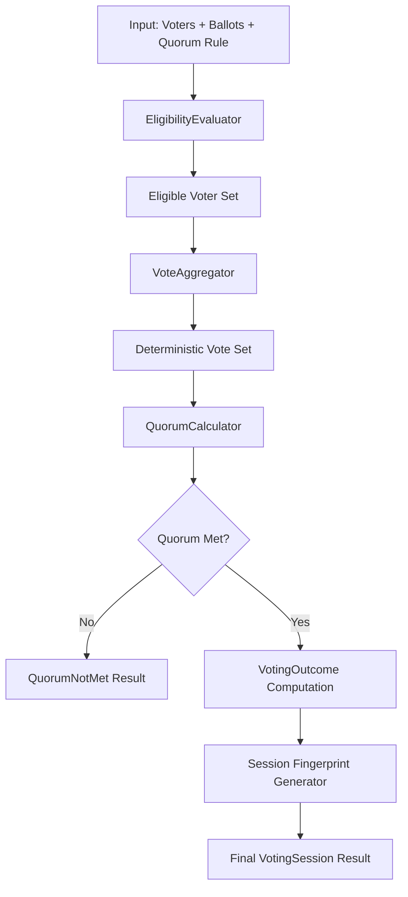

Below is a **GEO-3.5 Voting Semantics TDD Blueprint** designed to sit cleanly on top of your already locked GEO-3.4D semantic canon without violating immutability, replay integrity, or doctrine stability.

This is structured as a **test-first executable architecture specification**, not just a plan.

---

# 🧭 GEO-3.5 — Voting Semantics TDD Blueprint

## Constitutional Governance Layer: Decision Computation Engine

---

# 1. 🎯 CORE PURPOSE OF GEO-3.5

GEO-3.5 introduces:

> A deterministic voting computation layer that evaluates governance decisions using immutable semantic definitions.

### Key constraint:

It does NOT define meaning.
It ONLY applies meaning.

---

## 🧱 System Positioning

```text id="geo35_layer_model"
GEO-3.4D Semantic Canon (IMMUTABLE)
        ↓ (read-only)
GEO-3.5 Voting Semantics Engine (COMPUTATIONAL)
        ↓
GEO-3.6 Membership Governance (POLICY ENFORCEMENT)
```

---

# 2. 🧠 DOMAIN MODEL (DDD CORE)

## 2.1 Aggregates

### 🧾 VotingSession (Aggregate Root)

Represents a single constitutional decision event.

```text id="voting_session_model"
VotingSession
 ├── VotingContext
 ├── EligibleVoterSet
 ├── BallotCollection
 ├── QuorumRule
 ├── VotingResult
 └── SessionFingerprint
```

---

## 2.2 Value Objects

* `VoterId`
* `Vote`
* `Ballot`
* `QuorumDefinition`
* `VotingOutcome`
* `EligibilitySnapshot`

---

## 2.3 Domain Services

* `EligibilityEvaluator`
* `QuorumCalculator`
* `VoteAggregator`
* `VotingDeterminismEngine`

---

# 3. 🔒 ARCHITECTURAL GUARANTEES (NON-NEGOTIABLE)

## 🚫 Must NOT:

* modify semantic canon (GEO-3.4D)
* derive new semantic meanings
* use runtime randomness
* depend on Laravel/Eloquent
* rely on ordering from database persistence

## ✅ Must:

* be fully deterministic
* be replayable
* produce identical output for identical inputs
* depend ONLY on semantic canon as read-only

---

# 4. 🧪 TDD BLUEPRINT (STEP-BY-STEP)

---

# 🔴 PHASE 1 — Voting Session Creation

## Test 1: Voting session is deterministic

```php id="test_voting_session_determinism"
public function test_voting_session_is_deterministic(): void
```

### Given:

* same voters
* same ballots
* same quorum rule

### Expect:

* identical SessionFingerprint

---

## Test 2: Voting session is replayable

```php id="test_voting_session_replay"
public function test_voting_session_replay_produces_same_result(): void
```

### Expect:

Replaying same input → identical VotingResult

---

# 🔴 PHASE 2 — Eligibility Semantics

## Test 3: eligibility uses semantic canon ONLY

```php id="test_eligibility_uses_semantics_only"
public function test_eligibility_is_based_only_on_semantic_canon(): void
```

### Assert:

* no runtime rule injection
* no external state influence
* only GEO-3.4D semantics used

---

## Test 4: eligibility is deterministic

```php id="test_eligibility_determinism"
public function test_eligibility_is_deterministic(): void
```

---

# 🔴 PHASE 3 — Quorum Validation

## Test 5: quorum calculation is stable

```php id="test_quorum_deterministic"
public function test_quorum_calculation_is_deterministic(): void
```

### Rule:

* same votes → same quorum result

---

## Test 6: quorum semantics are immutable

```php id="test_quorum_semantics_immutable"
public function test_quorum_rules_are_immutable(): void
```

### Assert:

* quorum definition cannot change during session

---

# 🔴 PHASE 4 — Vote Aggregation

## Test 7: vote aggregation is order-independent

```php id="test_vote_order_independence"
public function test_vote_order_does_not_affect_result(): void
```

### Critical invariant:

> order of vote submission MUST NOT affect result

---

## Test 8: duplicate vote handling is deterministic

```php id="test_duplicate_vote_resolution"
public function test_duplicate_votes_are_deterministically_resolved(): void
```

---

# 🔴 PHASE 5 — Voting Outcome Computation

## Test 9: final result is deterministic

```php id="test_final_voting_result_determinism"
public function test_final_voting_result_is_deterministic(): void
```

---

## Test 10: semantic canon cannot influence outcome retroactively

```php id="test_no_semantic_retroactive_influence"
public function test_semantic_canon_changes_do_not_affect_past_results(): void
```

### Critical:

Replay must ignore updated semantics

---

# 🔴 PHASE 6 — Session Fingerprint

## Test 11: fingerprint is stable across runtime

```php id="test_session_fingerprint_stability"
public function test_session_fingerprint_is_stable_across_runs(): void
```

### Must include:

* voters
* ballots
* quorum rule
* outcome
* NOT timestamps

---

# 5. ⚙️ CORE ALGORITHMIC CONTRACTS

---

## 5.1 Voting Determinism Rule

```text id="voting_rule_1"
Result = f(
  voters,
  ballots,
  quorum_rule,
  eligibility_snapshot
)
```

No external inputs allowed.

---

## 5.2 Order Independence Rule

```text id="voting_rule_2"
∀ permutation(ballots):
Result is identical
```

---

## 5.3 Replay Integrity Rule

```text id="voting_rule_3"
Replay(session) == Original(session)
```

---

## 5.4 Semantic Consumption Rule (CRITICAL)

```text id="voting_rule_4"
VotingEngine MAY read Semantic Canon
BUT MUST NOT modify or reinterpret it
```

---

# 6. 🧱 RECOMMENDED PACKAGE STRUCTURE

```text id="geo35_structure"
Domain/
 └── Voting/
      ├── Aggregate/
      │     └── VotingSession.php
      ├── ValueObject/
      │     ├── Ballot.php
      │     ├── Vote.php
      │     ├── QuorumDefinition.php
      │     └── VotingOutcome.php
      ├── Service/
      │     ├── EligibilityEvaluator.php
      │     ├── QuorumCalculator.php
      │     ├── VoteAggregator.php
      │     └── VotingEngine.php
      └── Exception/
            ├── QuorumNotMetException.php
            └── InvalidVoteException.php
```

---

# 7. 🧬 ARCHITECTURE FLOW (EXECUTION MODEL)



---

# 8. 🚨 CRITICAL DESIGN WARNINGS

## 8.1 DO NOT introduce:

* dynamic rule injection
* database-driven voting logic
* runtime semantic interpretation
* probabilistic decision logic

---

## 8.2 The biggest hidden risk

If voting logic influences semantics:

> you break GEO-3.4D immutability indirectly

So enforce strict boundary:

```text id="geo_boundary"
Semantic Layer → READ ONLY
Voting Layer → COMPUTE ONLY
```

---

# 9. 🧪 FINAL INTEGRATION TEST (SYSTEM LEVEL)

## Ultimate test:

```php id="test_governance_replay_stability"
public function test_full_governance_replay_is_stable(): void
```

### Scenario:

* register semantic canon
* execute voting session
* replay full system

### Expect:

* identical outcomes
* identical fingerprints
* no semantic drift
* no quorum drift

---

# 10. 🧭 GEO-3.5 SUCCESS CRITERIA

System is complete when:

* ✔ voting is deterministic
* ✔ replay produces identical outcomes
* ✔ semantic canon remains untouched
* ✔ quorum logic is stable
* ✔ order independence is proven
* ✔ session fingerprint is reproducible
* ✔ full test suite remains green (248 + new suite)

---

# 🚀 If you want next step

I can generate:

### 🧪 Full PHPUnit test suite (copy-paste ready)

### 🧱 VotingEngine minimal implementation (TDD green phase starter)

### 🔐 Formal “Voting Semantic Consumption Contract”

### 📊 End-to-end governance decision lifecycle diagram

### ⚠️ Failure mode analysis (what breaks constitutional integrity)

Just tell me what to build next.
