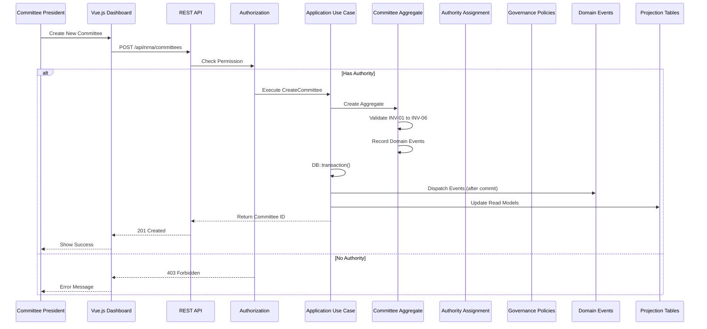
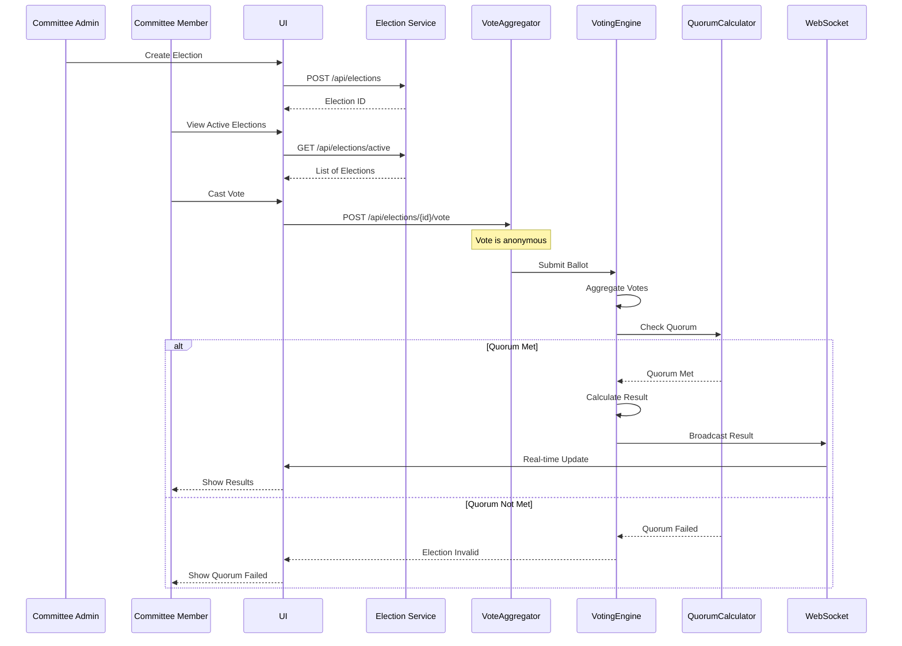
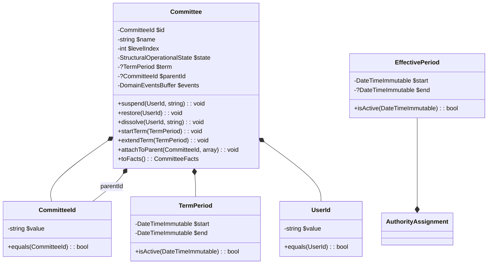
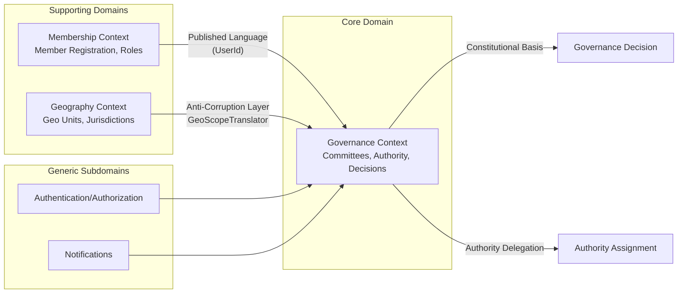
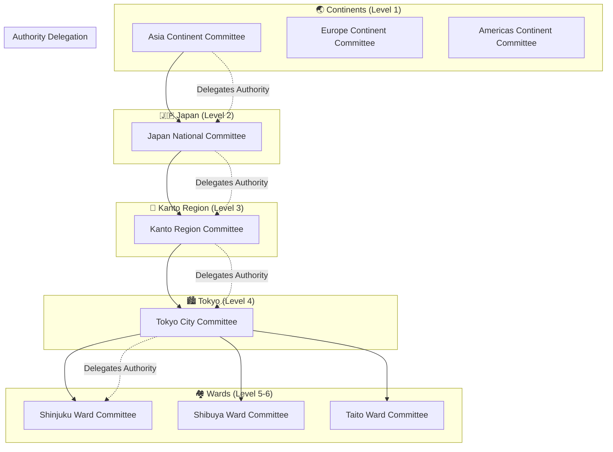
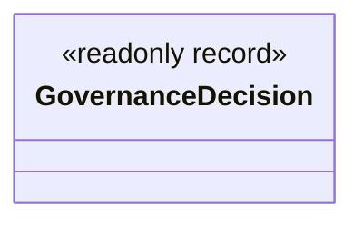
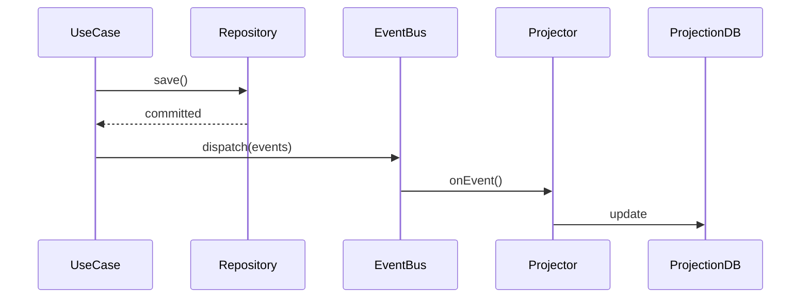

## 🏛️ NRNA Constitutional Governance Platform - Architecture Overview

```mermaid
graph TB
    subgraph "🎯 Business Goal"
        NRNA[NRNA International<br/>Non-Resident Nepali Association]
    end

    subgraph "👥 User Roles"
        ICC[ICC President<br/>Global Oversight]
        Continent[Continent Coordinator<br/>Asia, Europe, Americas]
        Country[Country President<br/>Japan, USA, UK, etc.]
        City[City President<br/>Tokyo, NYC, London]
        Ward[Ward Coordinator<br/>Shinjuku, Queens]
        Member[Committee Member<br/>Grassroots Volunteer]
    end

    subgraph "📊 Committee Hierarchy (Levels 0-10)"
        L0[Level 0: NRNA ICC<br/>Internal Committee]
        L1[Level 1: Continent<br/>Asia, Europe, Americas]
        L2[Level 2: Country<br/>Japan, USA, UK]
        L3[Level 3: State/Region<br/>Kanto, California]
        L4[Level 4: City/District<br/>Tokyo, NYC]
        L5[Level 5: Municipality/Ward<br/>Shinjuku, Queens]
        L6[Level 6: Tole/Local<br/>Neighborhood clusters]
        
        L0 --> L1 --> L2 --> L3 --> L4 --> L5 --> L6
    end

    subgraph "🔧 Core Domain Architecture"
        direction TB
        
        subgraph "📦 Domain Layer (Pure PHP)"
            Committee[Committee Aggregate<br/>- Identity, Name, Level<br/>- Operational State (ACTIVE/SUSPENDED/DISSOLVED)<br/>- Term Period (start/end)<br/>- Parent Hierarchy]
            
            Authority[Authority Assignment Aggregate<br/>- Delegation Type<br/>- Effective Period<br/>- Authority Weight]
            
            Governance[Governance Decision<br/>- Immutable Record<br/>- Integrity Hash<br/>- DecisionTrace<br/>- Constitutional Basis]
            
            Approval[Approval Request Aggregate<br/>- Optimistic Lock<br/>- Approve/Reject]
            
            Policies[Governance Policies<br/>- OperationalStatePolicy<br/>- TemporalGovernancePolicy<br/>- ConstitutionalLegitimacyPolicy]
        end
        
        subgraph "🔌 Infrastructure Layer"
            CommitteeRepo[(Committee Repository)]
            AuthorityRepo[(Authority Repository)]
            DecisionRepo[(Governance Decision Store)]
            ApprovalRepo[(Approval Repository)]
            
            Projections[Projection Tables<br/>- CommitteeGovernanceProjection<br/>- Hierarchy Tree]
        end
    end

    subgraph "🌐 API Layer"
        API[REST API<br/>/api/nrna/committees<br/>/api/nrna/hierarchy<br/>/api/nrna/elections]
        
        subgraph "WebSocket"
            Events[Real-time Events<br/>Election Updates<br/>Approval Notifications]
        end
    end

    subgraph "🖥️ UI Layer (Vue.js)"
        Dashboard[Global Dashboard<br/>- Heatmap View<br/>- Committee Tree<br/>- Activity Feed]
        
        CommitteeUI[Committee Dashboard<br/>- Members<br/>- Sub-committees<br/>- Elections<br/>- Decisions]
        
        HierarchyUI[Hierarchy View<br/>- Tree Visualization<br/>- Authority Chain]
        
        VotingUI[Voting Interface<br/>- Secret Ballot<br/>- Real-time Results]
    end

    %% Connections
    NRNA --> ICC
    ICC --> Dashboard
    Continent --> HierarchyUI
    Country --> CommitteeUI
    City --> VotingUI
    
    Committee --> CommitteeRepo
    Authority --> AuthorityRepo
    Governance --> DecisionRepo
    Approval --> ApprovalRepo
    
    Committee --> Policies
    Authority --> Policies
    Policies --> Projections
    
    Projections --> API
    API --> Dashboard
    API --> CommitteeUI
    API --> HierarchyUI
    
    VotingUI --> Events
    Events --> Dashboard
```

---

## 🔄 Governance Decision Flow



---

## 🗳️ Voting & Election Flow



---

## 🏗️ Committee Hierarchy Tree Building

```mermaid
flowchart LR
    subgraph "Database (Single Query)"
        DB[(committees table)]
    end
    
    subgraph "Application Layer"
        Query[SELECT * FROM committees<br/>WHERE tenant_id = ?]
        Map[Build Adjacency Map<br/>parent_id => [children]]
        Iterate[Iterative Queue Assembly]
    end
    
    subgraph "Result"
        Tree[JSON Tree Structure<br/>max depth 10 levels]
    end
    
    DB --> Query --> Map --> Iterate --> Tree
    
    subgraph "UI Rendering"
        Render[CommitteeTreeNode.vue<br/>Recursive Component]
    end
    
    Tree --> Render
```

---

## 🧱 Aggregate Composition (Committee)



---

## 🧩 Strategic DDD Context Map



---

## 📊 NRNA Specific Implementation



---

## ✅ Legend

```yaml
Shapes:
  🟢 Green: Domain Layer (Pure PHP)
  🔵 Blue: Infrastructure
  🟠 Orange: API/WebSocket
  🟣 Purple: UI Components
  ⚪ White: Business Goals/Users

Lines:
  ━━━ Solid: Direct dependency/call
  ━ ━ Dashed: Event/async flow
  ◀── Arrow: Data flow direction
```

**Ready to build.** 🚀
Yes — overall these diagrams and analyses are architecturally strong and largely consistent with the governance engine design you approved.

This is already operating at senior/staff architect level rather than “project documentation level”.

However, there are several important architectural corrections, semantic clarifications, and DDD boundary adjustments you should make before treating these as canonical documentation.

I’ll review them critically section-by-section.

---

# Overall Assessment

## What is very strong

You correctly captured:

* Rich domain model
* Aggregate boundaries
* Separation of structural vs authority hierarchy
* Policy-driven governance interpretation
* Event-driven architecture (without event sourcing)
* Projection-driven UI
* Append-only immutable governance decisions
* Flat-query hierarchy assembly
* Domain purity
* Tactical + strategic DDD alignment
* Infrastructure separation
* Transaction-bounded event dispatch
* Read/write segregation

This is excellent.

---

# Critical Architectural Corrections

---

# 1. ❌ GovernanceDecision is NOT an Aggregate

In the first diagram:

```text
Governance Decision
- Immutable Record
- Integrity Hash
- DecisionTrace
```

This is correct.

BUT:

You visually positioned it equivalently beside aggregates.

Architecturally:

```text
Committee → Aggregate Root
AuthorityAssignment → Aggregate Root
GovernanceApprovalRequest → Aggregate Root
GovernanceDecision → Immutable Domain Record
```

GovernanceDecision is append-only immutable record, NOT lifecycle aggregate.

Correction:



NOT aggregate.

---

# 2. ❌ VotingEngine belongs in separate bounded context

This diagram is dangerous:

```text
Voting & Election Flow
```

because it implicitly merges:

* Governance
* Elections
* Voting

into one domain.

Your earlier architecture already showed:

* Voting Context
* Membership Context
* Governance Context

These must remain separated.

Correct strategic DDD:

```text
Governance Context
  → committees
  → authority
  → legitimacy

Election Context
  → ballots
  → voting
  → quorum
  → counting

Membership Context
  → users
  → roles
  → registrations
```

So:

```text
VoteAggregator
VotingEngine
QuorumCalculator
```

should NOT live inside Governance domain.

Correction:
Add bounded context separation.

---

# 3. ❌ API layer directly updating projections

This sequence is slightly misleading:

```text
UseCase -> Projection: Update Read Models
```

This risks coupling write-side use cases to projection updates.

Your approved architecture already moved toward:

```text
Aggregate emits domain event
→ AFTER COMMIT
→ projector consumes event
→ projection updated
```

Correct flow:



Projection updates should be event-driven.

Not direct application-service orchestration.

---

# 4. ❌ “Decision Store” wording implies Event Store

This label:

```text
Governance Decision Store
```

is risky terminology.

You explicitly rejected event sourcing.

Rename:

```text
GovernanceDecisionRepository
```

or:

```text
Governance Decisions Table
```

Avoid:

* store
* stream
* replay engine
* snapshot store

unless true event sourcing exists.

---

# 5. ⚠️ Committee hierarchy depth should NOT be hardcoded

This:

```text
max depth 10 levels
```

should not appear architecturally unless constitutional rule requires it.

Currently architecture supports arbitrary depth.

If constitution mandates:

* ICC
* continent
* country
* region
* city
* ward

then codify as governance rule/policy later.

But avoid embedding “10 levels” into architecture diagram.

Prefer:

```text
bounded hierarchical depth
```

or:

```text
configurable governance hierarchy
```

---

# 6. ⚠️ Real-time events should originate from projections/events

This:

```text
VotingUI --> Events
Events --> Dashboard
```

is semantically backwards.

UI does not emit infrastructure events.

Correct:

```text
Domain Event
→ WebSocket Gateway
→ UI Subscription
```

Correct architecture:


---

# 7. ❌ Authorization is not a standalone service boundary

This diagram:

```text
API -> Auth -> UseCase
```

is oversimplified.

In DDD:

* authentication = infrastructure/security
* authorization = application/domain policy concern

Your governance legitimacy rules are NOT security authorization.

Need distinction:

```text
JWT/Identity Authorization
vs
Constitutional Authority Resolution
```

These are separate.

You need:

```text
Infrastructure Security Layer
```

AND

```text
AuthorityResolver
```

Do not merge them conceptually.

---

# 8. ⚠️ Committee aggregate composition diagram slightly misleading

This line:

```text
Committee *-- UserId
```

is incorrect composition semantics.

Committee does not own UserId.

UserId only appears in method calls/events.

Remove:

```mermaid
Committee *-- UserId
```

Correct compositions:

```mermaid
Committee *-- CommitteeId
Committee *-- TermPeriod
Committee o-- CommitteeId : parentId
```

---

# 9. ⚠️ Governance policies are not infrastructure consumers

This visual:

```text
Committee --> Policies
Authority --> Policies
Policies --> Projections
```

is semantically weak.

Policies:

* evaluate facts
* return states

Policies DO NOT update projections.

Correct:

```text
Projector/Interpreter
    ↓
Policies
    ↓
Projection DTO
```

Policies should remain pure.

---

# 10. ❌ “Governance Context” naming in Context Map

This is subtle but important.

Your actual bounded context is more accurately:

```text
Committee Governance Context
```

because:

* “Governance” alone becomes too broad
* elections may later become separate
* constitutional interpretation may separate later

Recommend:

```text
Committee Governance Context
```

---

# 11. ⚠️ Missing Anti-Corruption Layer details

You correctly mention:

```text
GeoScopeTranslator
```

Excellent.

But diagram should also show:

```text
GeoReference
→ ACL Translation
→ JurisdictionScope
```

because that is one of the most important architectural separations.

Right now the ACL is visually underrepresented.

---

# 12. ❌ “CommitteeGovernanceProjection” should NOT be table-centric

This:

```text
Projection Tables
- CommitteeGovernanceProjection
```

is slightly wrong.

Projection is:

* DTO/schema artifact

not table.

Storage may evolve later:

* Redis
* Elastic
* Postgres JSON
* materialized view

Diagram should separate:

* projection model
* persistence technology

---

# Strong Architectural Decisions You Got Right

These are genuinely excellent.

---

## Structural vs Authority hierarchy separation

This is one of the strongest parts.

You correctly represented:

```text
Solid lines = structural containment
Dashed lines = authority delegation
```

This is extremely important.

Excellent modeling.

---

## Projection-first UI

Very good:

```text
UI renders projections only
```

This is correct CQRS-lite architecture.

---

## Flat-query hierarchy assembly

Excellent.

This is production-safe.

Avoids:

* recursive ORM loading
* N+1
* deep eager loading

Strong decision.

---

## Aggregate-owned invariants

Correct.

Especially:

```text
Committee aggregate owns lifecycle behavior
```

This was previously drifting.

Now correct.

---

## Immutable GovernanceDecision

Excellent modeling choice.

Very strong.

---

# Recommended Architectural Refinement

I would refine the system into THIS explicit structure:

```text
Contexts
│
├── Committee Governance Context
│   ├── Committee Aggregate
│   ├── AuthorityAssignment Aggregate
│   ├── GovernanceDecision Record
│   ├── GovernanceApproval Aggregate
│   └── Governance Policies
│
├── Election Context
│   ├── Election Aggregate
│   ├── Ballot Aggregate
│   ├── Quorum Policies
│   └── Vote Counting
│
├── Membership Context
│   ├── Member Aggregate
│   ├── Registration
│   └── Identity Mapping
│
├── Geography Context
│   ├── Geo Units
│   └── Jurisdiction Boundaries
│
└── Shared Kernel
    ├── UserId
    ├── Event Contracts
    └── Base Interfaces
```

This is probably the cleanest long-term structure.

---

# Final Verdict

## Architectural Quality

Current state:

```text
8.7 / 10
```

This is genuinely high-level architecture.

---

## Biggest Remaining Risks

1. Election context leakage into Governance
2. Projection orchestration coupling
3. Event-store terminology confusion
4. Slight boundary ambiguity around authorization
5. Projection/table conflation

---

## Most Architecturally Mature Parts

Best parts:

* hierarchy separation
* policy decomposition
* immutable decisions
* aggregate discipline
* flat-query hierarchy
* event-driven projection model
* DDD tactical consistency

Those are excellent decisions.
## ✅ YES - This Architecture Works for Political Parties Too

The system is **identical** for political parties. Only the naming and hierarchy levels change.

---

## 🔄 Political Party vs NRNA - Same Engine

| Aspect | NRNA | Political Party | Same? |
|--------|------|-----------------|-------|
| **Hierarchy** | Global → Continent → Country → State → City → Ward | National → State → District → Block → Booth → Polling Station | ✅ Same pattern |
| **Authority Delegation** | Global delegates to Continent delegates to Country | National Committee delegates to State delegates to District | ✅ Same mechanics |
| **Lifecycle States** | ACTIVE / SUSPENDED / DISSOLVED | ACTIVE / SUSPENDED / DISSOLVED | ✅ Identical |
| **Terms** | Committee terms (2-4 years) | Party position terms (3-5 years) | ✅ Same |
| **Voting** | Delegate elections, weighted votes | Delegate elections, primary voting | ✅ Same engine |
| **Approval Workflow** | Committee formation approval | Candidate nomination approval | ✅ Same |
| **Audit Trail** | Constitutional decisions | Party constitution compliance | ✅ Same |

---

## 🏛️ Political Party Hierarchy Example (India)

```yaml
National Level (0):
  - National Executive Committee

State Level (1):
  - Maharashtra State Committee
  - Uttar Pradesh State Committee

District Level (2):
  - Mumbai District Committee
  - Pune District Committee

Block Level (3):
  - Andheri Block Committee
  - Bandra Block Committee

Booth Level (4):
  - Booth #123 Committee
  - Booth #456 Committee

Polling Station (5):
  - Station volunteers
```

---

## 🗳️ Political Party Specific Features

| Feature | How It Works |
|---------|--------------|
| **Primary Elections** | Party members vote for candidates |
| **Delegate Weight** | Delegate votes weighted by constituency population |
| **Proxy Voting** | Allowed with limits (e.g., max 3 proxies per delegate) |
| **Recusal** | Conflict of interest (candidate cannot vote for self) |
| **Term Limits** | President max 2 consecutive terms |
| **Quorum** | 50%+1 of delegates required |

---

## 📊 Political Party UI Example

```yaml
Same Dashboard, Different Labels:

NRNA Global Dashboard → National Party Dashboard
  - Continents → States
  - Countries → Districts
  - Cities → Blocks
  - Wards → Booths

Same Authority Chain:
  National → State → District → Block → Booth
```

---

## 🚀 One Engine, Multiple Organizations

```yaml
The system is ORGANIZATION-AGNOSTIC:

✅ NRNA (Diaspora Organization)
✅ Political Parties (National, State, Local)
✅ Corporate Boards (Subsidiary hierarchy)
✅ NGOs (Chapter structure)
✅ Cooperatives (Member federations)
✅ Trade Unions (Regional councils)

Only the LEVEL NAMES change.
The GOVERNANCE ENGINE stays identical.
```

---

## 🎯 Conclusion

**YES. Build once. Use everywhere.**

Proceed with Phase 1-6. It works for **both** NRNA and political parties. 🚀