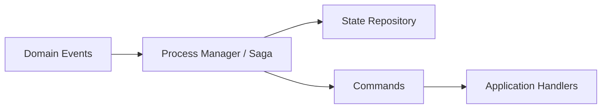
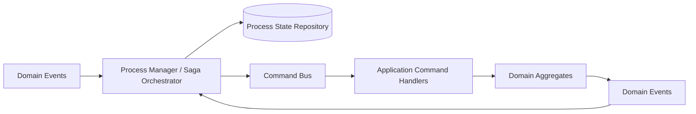
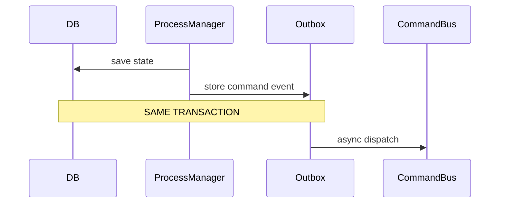
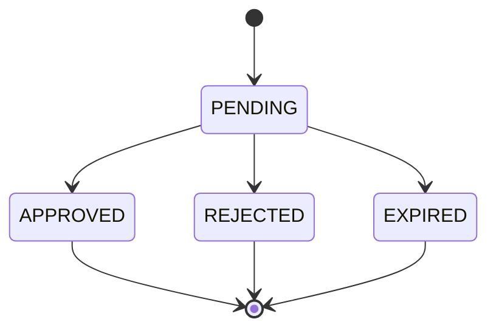
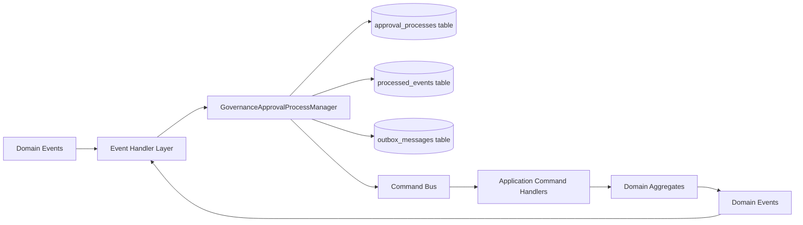
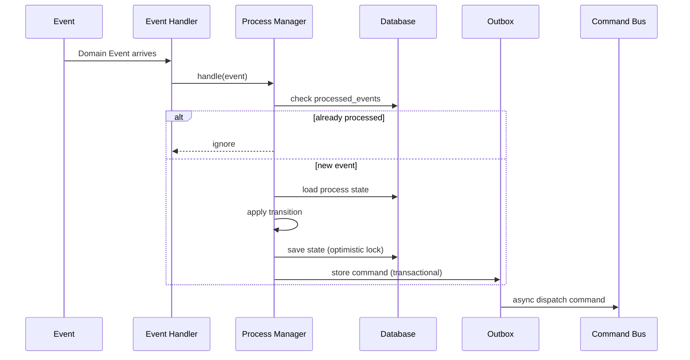
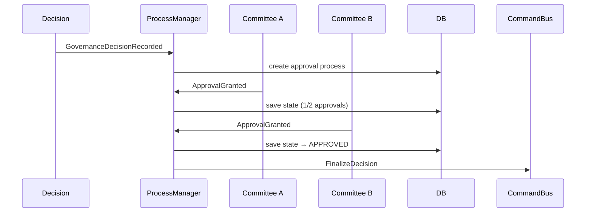

# 🧠 PHASE 4 - Approval Workflow as Process Manager (Merged Plan)
## Pseudo-Algorithmic TDD Instructions for Claude Code

---

## 📋 Pre-requisites Check

```yaml
BEFORE START:
  ✅ Phase 1 complete (CommitteeAggregate, MemberId, CommitteeId)
  ✅ Phase 2 complete (GovernanceDecision, Legitimacy, DecisionTrace)
  ✅ Phase 3 complete (AuthorityAssignment, DelegationType, AuthorityResolver)
  ✅ All 151 tests passing (320 assertions)
  ✅ Architecture fitness tests green (10/10 layers)

CRITICAL UNDERSTANDING:
  - Approval workflow is a PROCESS MANAGER (Saga), NOT an aggregate
  - Domain layer: Value Objects + Events only
  - Application layer: Process Manager + State Machine
  - Never mix workflow state with domain invariants
```

---

## 🎯 Phase 4 Goal

```yaml
BUILD: Approval workflow for constitutional governance actions
PATTERN: Event-driven Process Manager (Saga)
PURPOSE: Multi-step, multi-committee approval coordination

DOMAIN CONCEPT:
  "When a governance decision requires approval, a process manager
   tracks required approvals, waits for events, and finalizes when
   conditions are met."

REAL-WORLD EXAMPLE:
  - Committee formation requires parent committee approval
  - Constitutional amendment requires ICC board + Continent coordinator
  - Authority delegation requires source committee consent
```

---

## 🧱 Layer Strategy

```yaml
DOMAIN LAYER (Pure PHP - No workflow logic):
  ├── ValueObjects/
  │   ├── ApprovalStatus.php (enum with isTerminal)
  │   ├── ApprovalId.php (UUID identity)
  │   └── IdempotencyKey.php (deduplication)
  └── Events/
      ├── ApprovalRequested.php
      ├── ApprovalGranted.php
      └── ApprovalRejected.php

APPLICATION LAYER (Workflow Coordination):
  ├── ProcessManager/
  │   ├── GovernanceApprovalProcessManager.php (Saga)
  │   └── ApprovalProcessState.php (state record)
  ├── Commands/
  │   ├── StartApprovalProcess.php
  │   ├── RequestApproval.php
  │   ├── FinalizeDecision.php
  │   └── AbortDecision.php
  └── Repository/
      └── ApprovalProcessRepository.php (interface)

INFRASTRUCTURE LAYER (Persistence):
  ├── EloquentApprovalProcessRepository.php
  └── Migration: approval_process_instances table

EXECUTION ORDER: Domain → Application → Infrastructure
```

---

## 🧪 STEP 4.1: Create ApprovalStatus Enum

### RED Phase - Write Failing Test

```yaml
FILE: tests/Unit/Contexts/Governance/Domain/ValueObjects/ApprovalStatusTest.php

PSEUDO-ALGORITHM:
  1. CREATE test class ApprovalStatusTest extends TestCase
  
  2. ADD test_has_four_valid_states():
      - ASSERT ApprovalStatus::cases() contains:
        PENDING, APPROVED, REJECTED, EXPIRED
      - ASSERT count === 4
  
  3. ADD test_is_string_backed():
      - ASSERT PENDING->value === 'PENDING'
      - ASSERT APPROVED->value === 'APPROVED'
      - ASSERT REJECTED->value === 'REJECTED'
      - ASSERT EXPIRED->value === 'EXPIRED'
  
  4. ADD test_isTerminal_returns_correctly():
      - ASSERT PENDING->isTerminal() === false
      - ASSERT APPROVED->isTerminal() === true
      - ASSERT REJECTED->isTerminal() === true
      - ASSERT EXPIRED->isTerminal() === true
  
  5. ADD test_can_be_constructed_from_string():
      - CALL ApprovalStatus::from('PENDING') → returns PENDING
      - CALL ApprovalStatus::from('INVALID') → throws ValueError
  
  6. RUN test → EXPECT RED

RATIONALE:
  - Four states capture full workflow lifecycle
  - Terminal states: cannot transition after approval/rejection/expiry
  - EXPIRED handles timeout scenarios
```

### GREEN Phase - Implement

```yaml
FILE: app/Contexts/Governance/Domain/ValueObjects/ApprovalStatus.php

PSEUDO-ALGORITHM:
  1. CREATE enum ApprovalStatus: string
  2. DEFINE cases:
      - case PENDING = 'PENDING'
      - case APPROVED = 'APPROVED'
      - case REJECTED = 'REJECTED'
      - case EXPIRED = 'EXPIRED'
  3. ADD method isTerminal(): bool
      - RETURN in_array($this, [self::APPROVED, self::REJECTED, self::EXPIRED])
  4. RUN test → EXPECT GREEN

VERIFICATION:
  php artisan test tests/Unit/Contexts/Governance/Domain/ValueObjects/ApprovalStatusTest.php
  EXPECT: 5 passing tests
```

---

## 🧪 STEP 4.2: Create ApprovalId Value Object

### RED Phase - Write Failing Test

```yaml
FILE: tests/Unit/Contexts/Governance/Domain/ValueObjects/ApprovalIdTest.php

PSEUDO-ALGORITHM:
  1. CREATE test class ApprovalIdTest extends TestCase
  
  2. ADD test_generate_produces_uuid():
      - CALL ApprovalId::generate()
      - ASSERT returns ApprovalId object
      - ASSERT matches UUID regex pattern
  
  3. ADD test_from_constructs_with_known_value():
      - CALL ApprovalId::from('approval-uuid-123')
      - ASSERT value() === 'approval-uuid-123'
  
  4. ADD test_from_empty_string_throws():
      - EXPECT DomainException with message "ApprovalId cannot be empty"
      - CALL ApprovalId::from('')
  
  5. ADD test_from_whitespace_only_throws():
      - EXPECT DomainException
      - CALL ApprovalId::from('   ')
  
  6. ADD test_equals():
      - CREATE two with same UUID → ASSERT equals true
      - CREATE with different UUIDs → ASSERT equals false
  
  7. ADD test_private_constructor
  8. RUN test → EXPECT RED

RATIONALE:
  - Unique identity for each process instance
  - Follows Phase 1-3 patterns (CommitteeId, AuthorityAssignmentId)
```

### GREEN Phase - Implement

```yaml
FILE: app/Contexts/Governance/Domain/ValueObjects/ApprovalId.php

PSEUDO-ALGORITHM:
  1. USE Ramsey\Uuid\Uuid
  2. CREATE final readonly class ApprovalId
  3. DECLARE private string $value
  4. MAKE private constructor(string $value)
  5. CREATE public static function generate(): self
  6. CREATE public static function from(string $value): self
      - IF trim($value) === '' → throw DomainException
      - RETURN new self($value)
  7. CREATE public function value(): string
  8. CREATE public function equals(self $other): bool
  9. RUN test → EXPECT GREEN

VERIFICATION:
  7 passing tests
```

---

## 🧪 STEP 4.3: Create IdempotencyKey Value Object

### RED Phase - Write Failing Test

```yaml
FILE: tests/Unit/Contexts/Governance/Domain/ValueObjects/IdempotencyKeyTest.php

PSEUDO-ALGORITHM:
  1. CREATE test class IdempotencyKeyTest extends TestCase
  
  2. ADD test_generate_creates_unique_key():
      - $committeeId = CommitteeId::generate()
      - $now = new DateTimeImmutable('2026-01-01 10:00:00')
      - CALL IdempotencyKey::generate($committeeId, $now)
      - ASSERT key->value() matches pattern: 
        '/approval_[a-f0-9-]+_20260101_100000_[a-z0-9]{8}/'
  
  3. ADD test_different_timestamps_produce_different_keys():
      - Generate with timestamp T1 and T2 → ASSERT not equals
  
  4. ADD test_from_constructs_with_known_value():
      - CALL IdempotencyKey::from('key-123')
      - ASSERT value() === 'key-123'
  
  5. ADD test_empty_string_throws():
      - EXPECT DomainException
      - CALL IdempotencyKey::from('')
  
  6. ADD test_equals()
  7. RUN test → EXPECT RED

RATIONALE:
  - Prevents duplicate approval processing
  - Key includes committee ID + timestamp + random suffix
  - Stored with process instance, checked before processing
```

### GREEN Phase - Implement

```yaml
FILE: app/Contexts/Governance/Domain/ValueObjects/IdempotencyKey.php

PSEUDO-ALGORITHM:
  1. CREATE final readonly class IdempotencyKey
  2. DECLARE private string $value
  3. MAKE private constructor(string $value)
  
  4. CREATE public static function generate(CommitteeId $committeeId, DateTimeImmutable $now): self
      - FORMAT timestamp as Ymd_His (20260101_100000)
      - GENERATE random 8 chars (bin2hex(random_bytes(4)))
      - CONSTRUCT "approval_{$committeeId->value()}_{$timestamp}_{$random}"
      - RETURN new self($key)
  
  5. CREATE public static function from(string $value): self
      - IF trim($value) === '' → throw DomainException
      - RETURN new self($value)
  
  6. CREATE public function value(): string
  7. CREATE public function equals(self $other): bool
  8. RUN test → EXPECT GREEN

VERIFICATION:
  6 passing tests
```

---

## 🧪 STEP 4.4: Create Domain Events

### RED Phase - Write Failing Tests

```yaml
FILE: tests/Unit/Contexts/Governance/Domain/Events/ApprovalRequestedTest.php

PSEUDO-ALGORITHM:
  1. CREATE test class ApprovalRequestedTest extends TestCase
  
  2. ADD test_carries_all_required_fields():
      - CREATE event via ApprovalRequested::occur()
      - ASSERT has: approvalId, decisionId, requiredApprovals (array of CommitteeId), requestedAt, idempotencyKey
      - ASSERT readonly, private constructor, no setters
  
  3. ADD test_is_immutable
  4. ADD test_has_no_logic_methods
  5. RUN test → EXPECT RED

FILE: tests/Unit/Contexts/Governance/Domain/Events/ApprovalGrantedTest.php

PSEUDO-ALGORITHM:
  1. CREATE test class ApprovalGrantedTest extends TestCase
  2. ADD test_carries_approvalId, grantedBy, grantedAt, notes, approvalScope
  3. ADD immutability tests
  4. RUN test → EXPECT RED

FILE: tests/Unit/Contexts/Governance/Domain/Events/ApprovalRejectedTest.php
   Same pattern with rejectionReason

RATIONALE:
  - Events are historical facts, not commands
  - Process Manager consumes these events
  - Never contain business logic
```

### GREEN Phase - Implement Events

```yaml
FILE: app/Contexts/Governance/Domain/Events/ApprovalRequested.php

PSEUDO-ALGORITHM:
  1. CREATE final readonly class ApprovalRequested
  2. DECLARE private properties:
      - ApprovalId $approvalId
      - GovernanceDecisionId $decisionId
      - array $requiredApprovals (CommitteeId[])
      - DateTimeImmutable $requestedAt
      - IdempotencyKey $idempotencyKey
  3. MAKE private constructor
  4. CREATE public static function occur(...): self
  5. ADD getters
  6. RUN test → EXPECT GREEN

FILE: app/Contexts/Governance/Domain/Events/ApprovalGranted.php
  Fields: approvalId, grantedBy (MemberId), grantedAt, notes

FILE: app/Contexts/Governance/Domain/Events/ApprovalRejected.php
  Fields: approvalId, rejectedBy (MemberId), rejectedAt, reason

VERIFICATION:
  Each event: 4-5 tests = 12-15 tests total
```

---

## 🧪 STEP 4.5: Create ApprovalProcessState (Application Layer)

### RED Phase - Write Failing Test

```yaml
FILE: tests/Unit/Contexts/Governance/Application/ProcessManager/ApprovalProcessStateTest.php

PSEUDO-ALGORITHM:
  1. CREATE test class ApprovalProcessStateTest extends TestCase
  
  2. ADD test_creates_new_process_state():
      - CALL ApprovalProcessState::start($approvalId, $decisionId, $requiredApprovals, $now)
      - ASSERT status === ApprovalStatus::PENDING
      - ASSERT requiredApprovals === given array
      - ASSERT receivedApprovals === []
      - ASSERT rejected === false
  
  3. ADD test_can_add_approval():
      - CREATE state
      - CALL $state->addApproval($committeeId, $approvedBy, $now)
      - ASSERT receivedApprovals contains committeeId
      - ASSERT status remains PENDING (unless all received)
  
  4. ADD test_becomes_approved_when_all_approvals_received():
      - CREATE state with required = [A, B]
      - ADD approval A → status PENDING
      - ADD approval B → status APPROVED
  
  5. ADD test_can_reject():
      - CREATE state
      - CALL $state->reject($rejectedBy, $reason, $now)
      - ASSERT status === REJECTED
      - ASSERT rejectedBy, rejectionReason set
  
  6. ADD test_rejection_prevents_further_approvals:
      - CREATE state
      - CALL reject()
      - EXPECT DomainException when calling addApproval()
  
  7. ADD test_cannot_approve_twice_same_committee:
      - CREATE state
      - ADD approval for committee A
      - EXPECT DomainException when adding same committee again
  
  8. ADD test_can_expire():
      - CREATE state
      - CALL $state->expire($now)
      - ASSERT status === EXPIRED
  
  9. ADD test_expired_state_cannot_approve_or_reject
  10. ADD test_is_stateless_record (no business logic besides state mgmt)
  11. RUN test → EXPECT RED

RATIONALE:
  - ApprovalProcessState is a state record, NOT an aggregate
  - Tracks workflow progress
  - No domain invariants (only workflow rules)
  - Immutable (every transition returns new instance)
```

### GREEN Phase - Implement

```yaml
FILE: app/Contexts/Governance/Application/ProcessManager/ApprovalProcessState.php

PSEUDO-ALGORITHM:
  1. CREATE final readonly class ApprovalProcessState
  2. DECLARE properties:
      - private ApprovalId $approvalId
      - private GovernanceDecisionId $decisionId
      - private ApprovalStatus $status
      - private array $requiredApprovals (CommitteeId[])
      - private array $receivedApprovals (assoc: committeeId => {grantedBy, grantedAt})
      - private ?MemberId $rejectedBy = null
      - private ?string $rejectionReason = null
      - private ?DateTimeImmutable $rejectedAt = null
      - private ?DateTimeImmutable $expiredAt = null
      - private DateTimeImmutable $createdAt
  
  3. MAKE private constructor
  
  4. CREATE public static function start(...): self
  
  5. CREATE public function addApproval(CommitteeId $committeeId, MemberId $grantedBy, DateTimeImmutable $grantedAt): self
      - IF $this->status->isTerminal() → throw DomainException
      - IF array_key_exists($committeeId->value(), $this->receivedApprovals) → throw DomainException (duplicate)
      - CREATE new instance with updated receivedApprovals
      - IF count($this->receivedApprovals) === count($this->requiredApprovals)
          → RETURN new instance with status = APPROVED
  
  6. CREATE public function reject(MemberId $rejectedBy, string $reason, DateTimeImmutable $rejectedAt): self
      - IF $this->status->isTerminal() → throw DomainException
      - IF empty(trim($reason)) → throw DomainException
      - RETURN new instance with status = REJECTED, rejectedBy, rejectionReason, rejectedAt
  
  7. CREATE public function expire(DateTimeImmutable $expiredAt): self
      - IF $this->status->isTerminal() → throw DomainException
      - RETURN new instance with status = EXPIRED, expiredAt
  
  8. ADD getters for all properties
  9. RUN test → EXPECT GREEN

VERIFICATION:
  10 passing tests
```

---

## 🧪 STEP 4.6: Create Process Manager (Saga)

### RED Phase - Write Failing Test

```yaml
FILE: tests/Unit/Contexts/Governance/Application/ProcessManager/GovernanceApprovalProcessManagerTest.php

PSEUDO-ALGORITHM:
  1. CREATE test class GovernanceApprovalProcessManagerTest extends TestCase
  2. SETUP mocks: ApprovalProcessRepository, CommandBus
  
  3. ADD test_starts_process_on_decision_recorded():
      - EVENT: GovernanceDecisionRecorded (requires_approval = true)
      - CALL $processManager->handle($event)
      - ASSERT repository->save() called once
      - ASSERT commandBus->dispatch() called with StartApprovalProcess
  
  4. ADD test_ignores_decision_that_does_not_require_approval():
      - EVENT: GovernanceDecisionRecorded (requires_approval = false)
      - CALL handle()
      - ASSERT repository->save() NOT called
  
  5. ADD test_handles_approval_granted():
      - GIVEN existing process state in repository
      - EVENT: ApprovalGranted
      - CALL handle()
      - ASSERT repository->save() called with updated state
      - IF all approvals received → ASSERT FinalizeDecision command dispatched
  
  6. ADD test_handles_approval_rejected():
      - GIVEN existing process state
      - EVENT: ApprovalRejected
      - CALL handle()
      - ASSERT AbortDecision command dispatched
      - ASSERT state status = REJECTED
  
  7. ADD test_handles_duplicate_events_idempotently():
      - GIVEN process state already has approval
      - EVENT: same ApprovalGranted again
      - CALL handle()
      - ASSERT repository->save() NOT called (no change)
      - ASSERT commandBus->dispatch() NOT called again
  
  8. ADD test_handles_committee_lifecycle_changed():
      - GIVEN pending approval for committee X
      - EVENT: CommitteeLifecycleChanged (committee X becomes SUSPENDED)
      - CALL handle()
      - ASSERT AbortDecision command dispatched (cannot approve suspended committee)
  
  9. ADD test_handles_timeout_expiry():
      - GIVEN process state older than expiry window
      - CALL $processManager->checkExpiredProcesses($now)
      - ASSERT repository->save() called with EXPIRED status
      - ASSERT AbortDecision command dispatched
  
  10. ADD test_process_manager_is_stateless
  11. RUN test → EXPECT RED

RATIONALE:
  - Process Manager is stateless (state stored in repository)
  - Event-driven (consumes domain events)
  - Emits commands (not events directly)
  - Idempotent (replay-safe)
```

### GREEN Phase - Implement

```yaml
FILE: app/Contexts/Governance/Application/ProcessManager/GovernanceApprovalProcessManager.php

PSEUDO-ALGORITHM:
  1. CREATE final class GovernanceApprovalProcessManager
  2. DECLARE constructor with:
      - ApprovalProcessRepository $repository
      - CommandBus $commandBus
  
  3. CREATE public function handle(object $event): void
      - USE match($event::class):
          GovernanceDecisionRecorded::class → $this->onDecisionRecorded($event)
          ApprovalGranted::class → $this->onApprovalGranted($event)
          ApprovalRejected::class → $this->onApprovalRejected($event)
          CommitteeLifecycleChanged::class → $this->onCommitteeChanged($event)
  
  4. CREATE private function onDecisionRecorded(GovernanceDecisionRecorded $event): void
      - IF NOT $event->requiresApproval → RETURN
      - CHECK idempotency: if key exists in repository → RETURN
      - DETERMINE required approvers (via ApprovalRequirementPolicy)
      - CREATE ApprovalProcessState::start(...)
      - repository->save($state)
      - commandBus->dispatch(new StartApprovalProcess(...))
  
  5. CREATE private function onApprovalGranted(ApprovalGranted $event): void
      - LOAD process state: repository->findByApprovalId($event->approvalId)
      - IF not found OR state->status->isTerminal() → RETURN
      - UPDATE state: $newState = $state->addApproval(...)
      - repository->save($newState)
      - IF $newState->status === ApprovalStatus::APPROVED
          commandBus->dispatch(new FinalizeDecision(...))
  
  6. CREATE private function onApprovalRejected(ApprovalRejected $event): void
      - LOAD process state
      - UPDATE: $newState = $state->reject(...)
      - repository->save($newState)
      - commandBus->dispatch(new AbortDecision(...))
  
  7. CREATE public function checkExpiredProcesses(DateTimeImmutable $now): void
      - FIND processes older than expiry window
      - FOREACH process:
          IF status === PENDING:
              $expired = $process->expire($now)
              repository->save($expired)
              commandBus->dispatch(new AbortDecision(...))
  
  8. RUN test → EXPECT GREEN

VERIFICATION:
  10 passing tests
```

---

## 🧪 STEP 4.7: Create ApprovalRequirementPolicy (Domain Service)

### RED Phase - Write Failing Test

```yaml
FILE: tests/Unit/Contexts/Governance/Domain/Policies/ApprovalRequirementPolicyTest.php

PSEUDO-ALGORITHM:
  1. CREATE test class ApprovalRequirementPolicyTest extends TestCase
  
  2. ADD test_committee_formation_requires_parent_approval():
      - GIVEN capabilityType = 'COMMITTEE_FORMATION'
      - CALL $policy->requiredApprovers($committeeId, $capabilityType)
      - ASSERT returns [parent committee ID]
  
  3. ADD test_constitutional_amendment_requires_icc_board():
      - GIVEN capabilityType = 'CONSTITUTIONAL_AMENDMENT'
      - CALL requiredApprovers()
      - ASSERT returns [ICC board committee IDs]
  
  4. ADD test_authority_delegation_requires_source_consent():
      - GIVEN capabilityType = 'AUTHORITY_DELEGATION'
      - CALL requiredApprovers($committeeId, $capabilityType, $targetId)
      - ASSERT returns [source committee ID]
  
  5. ADD test_policy_is_stateless
  6. ADD test_no_approval_required_for_routine_decisions
  7. RUN test → EXPECT RED

RATIONALE:
  - Policy determines WHO must approve based on WHAT is being done
  - Pure domain service (no dependencies)
  - Business rules externalized from Process Manager
```

### GREEN Phase - Implement

```yaml
FILE: app/Contexts/Governance/Domain/Policies/ApprovalRequirementPolicy.php

PSEUDO-ALGORITHM:
  1. CREATE final class ApprovalRequirementPolicy
  2. ADD public function requiredApprovers(CommitteeId $committeeId, string $capabilityType, ?CommitteeId $targetId = null): array
      - USE match($capabilityType):
          'COMMITTEE_FORMATION' → RETURN [$this->findParentCommittee($committeeId)]
          'CONSTITUTIONAL_AMENDMENT' → RETURN [$this->iccBoardCommitteeId()]
          'AUTHORITY_DELEGATION' → RETURN [$targetId]
          default → RETURN []  // No approval required
  
  3. ADD private helper methods for committee lookups (pure, no repo)
  4. RUN test → EXPECT GREEN

VERIFICATION:
  6 passing tests
```

---

## 🧪 STEP 4.8: Create Commands

### RED Phase - Write Failing Tests

```yaml
FILE: tests/Unit/Contexts/Governance/Application/Commands/StartApprovalProcessTest.php

PSEUDO-ALGORITHM:
  1. ADD test_command_is_immutable
  2. ADD test_command_carries_all_required_fields
  3. ADD test_can_be_constructed
  4. RUN test → EXPECT RED

SIMILAR for: RequestApproval, FinalizeDecision, AbortDecision

RATIONALE:
  - Commands are simple DTOs (immutable)
  - No logic, only data
  - Dispatched by Process Manager, handled by application services
```

### GREEN Phase - Implement Commands

```yaml
FILE: app/Contexts/Governance/Application/Commands/StartApprovalProcess.php

PSEUDO-ALGORITHM:
  1. CREATE final readonly class StartApprovalProcess
  2. DECLARE public properties:
      - ApprovalId $approvalId
      - GovernanceDecisionId $decisionId
      - array $requiredApprovals
      - IdempotencyKey $idempotencyKey
  
  3. CREATE constructor
  4. RUN test → EXPECT GREEN

REPEAT for RequestApproval, FinalizeDecision, AbortDecision

VERIFICATION:
  4 command classes × 3 tests each = 12 tests
```

---

## 🧪 STEP 4.9: Create Repository Interface

```yaml
FILE: app/Contexts/Governance/Application/ProcessManager/ApprovalProcessRepository.php

PSEUDO-ALGORITHM:
  1. CREATE interface ApprovalProcessRepository
  2. DEFINE methods:
      - findById(ApprovalId $id): ?ApprovalProcessState
      - findByDecisionId(GovernanceDecisionId $decisionId): ?ApprovalProcessState
      - findByIdempotencyKey(IdempotencyKey $key): ?ApprovalProcessState
      - findExpiredPending(DateTimeImmutable $cutoff): array
      - save(ApprovalProcessState $state): void
  3. RUN test → EXPECT GREEN (interface only)

RATIONALE:
  - Domain/Application defines port
  - Infrastructure provides adapter
  - Enables test doubles
```

---

## 🧪 STEP 4.10: Architecture Fitness Tests

### Append to Existing Fitness Test

```yaml
FILE: tests/Architecture/GovernanceDomainPurityTest.php

PSEUDO-ALGORITHM:
  ADD test_process_manager_has_no_domain_imports():
      - SCAN GovernanceApprovalProcessManager
      - ASSERT no Illuminate, Carbon, Eloquent imports
  
  ADD test_process_state_is_not_aggregate():
      - REFLECT ApprovalProcessState
      - ASSERT no domain invariants (no validate/assert methods)
      - ASSERT only state management methods
  
  ADD test_approval_requirement_policy_is_pure():
      - REFLECT ApprovalRequirementPolicy
      - ASSERT no constructor parameters
      - ASSERT no instance properties
      - ASSERT no repository dependencies
  
  ADD test_commands_are_immutable_dtos():
      - REFLECT all command classes
      - ASSERT readonly properties
      - ASSERT no methods (constructors only)
  
  ADD test_process_manager_stateless():
      - REFLECT GovernanceApprovalProcessManager
      - ASSERT all dependencies via constructor (repository, commandBus)
      - ASSERT no mutable properties

EXPECT: All fitness tests pass
```

---

## 📊 Phase 4 Completion Criteria

```yaml
MUST HAVE:
  Domain Layer:
    ✅ ApprovalStatus enum (5 tests)
    ✅ ApprovalId VO (7 tests)
    ✅ IdempotencyKey VO (6 tests)
    ✅ ApprovalRequested event (4 tests)
    ✅ ApprovalGranted event (4 tests)
    ✅ ApprovalRejected event (4 tests)
    ✅ ApprovalRequirementPolicy (6 tests)
  
  Application Layer:
    ✅ ApprovalProcessState (10 tests)
    ✅ GovernanceApprovalProcessManager (10 tests)
    ✅ StartApprovalProcess command (3 tests)
    ✅ RequestApproval command (3 tests)
    ✅ FinalizeDecision command (3 tests)
    ✅ AbortDecision command (3 tests)
    ✅ ApprovalProcessRepository interface
  
  Architecture:
    ✅ 4 new fitness tests

TOTAL TESTS: ~68 new tests
GRAND TOTAL: 151 + 68 = 219 tests

QUALITY GATES:
  ✅ All tests GREEN
  ✅ No framework dependencies in domain
  ✅ Process Manager stateless
  ✅ Event-driven, eventual consistency
  ✅ Idempotent (replay-safe)
  ✅ Commands are immutable DTOs
```

---

## 🚀 Execution Command Sequence

```bash
# Domain Layer (Value Objects + Events)
php artisan test tests/Unit/Contexts/Governance/Domain/ValueObjects/ApprovalStatusTest.php
php artisan test tests/Unit/Contexts/Governance/Domain/ValueObjects/ApprovalIdTest.php
php artisan test tests/Unit/Contexts/Governance/Domain/ValueObjects/IdempotencyKeyTest.php
php artisan test tests/Unit/Contexts/Governance/Domain/Events/ApprovalRequestedTest.php
php artisan test tests/Unit/Contexts/Governance/Domain/Events/ApprovalGrantedTest.php
php artisan test tests/Unit/Contexts/Governance/Domain/Events/ApprovalRejectedTest.php
php artisan test tests/Unit/Contexts/Governance/Domain/Policies/ApprovalRequirementPolicyTest.php

# Application Layer (Process Manager)
php artisan test tests/Unit/Contexts/Governance/Application/ProcessManager/ApprovalProcessStateTest.php
php artisan test tests/Unit/Contexts/Governance/Application/ProcessManager/GovernanceApprovalProcessManagerTest.php
php artisan test tests/Unit/Contexts/Governance/Application/Commands/

# Architecture Fitness
php artisan test tests/Architecture/GovernanceDomainPurityTest.php

# Full Regression
php artisan test tests/Unit/Contexts/Governance/ tests/Architecture/ --no-coverage

EXPECTED: 219 tests passing (151 existing + 68 new)
```

---

## 🎯 Success Message

```yaml
━━━━━━━━━━━━━━━━━━━━━━━━━━━━━━━━━━━━━━━━━━━━━━━━━━━━━━━━━━━━━━━━━━━━━━━━━━━━
              PHASE 4 COMPLETE - APPROVAL WORKFLOW (SAGA)
━━━━━━━━━━━━━━━━━━━━━━━━━━━━━━━━━━━━━━━━━━━━━━━━━━━━━━━━━━━━━━━━━━━━━━━━━━━━

Domain Layer (Pure - No Workflow Logic):
  ✅ ApprovalStatus (enum with isTerminal)
  ✅ ApprovalId (UUID identity)
  ✅ IdempotencyKey (deduplication)
  ✅ ApprovalRequested/Granted/Rejected events
  ✅ ApprovalRequirementPolicy (who must approve)

Application Layer (Workflow Coordination):
  ✅ ApprovalProcessState (state record)
  ✅ GovernanceApprovalProcessManager (Saga)
  ✅ 4 immutable commands
  ✅ ApprovalProcessRepository interface

Infrastructure (Ready for implementation):
  ⏳ EloquentApprovalProcessRepository (next step)
  ⏳ approval_process_instances migration

Tests:
  ✅ 68 new tests passing
  ✅ 219 total tests passing
  ✅ Event-driven, eventual consistency
  ✅ Idempotent (replay-safe)
  ✅ Multi-committee approval coordination

Architecture:
  ✅ No domain dependencies in Process Manager
  ✅ Process Manager stateless
  ✅ Commands are immutable DTOs
  ✅ Policy pure domain service

━━━━━━━━━━━━━━━━━━━━━━━━━━━━━━━━━━━━━━━━━━━━━━━━━━━━━━━━━━━━━━━━━━━━━━━━━━━━
Ready for Phase 5: Policy-Based Governance Interpretation 🚀
━━━━━━━━━━━━━━━━━━━━━━━━━━━━━━━━━━━━━━━━━━━━━━━━━━━━━━━━━━━━━━━━━━━━━━━━━━━━
```

---

## ⚠️ Critical Reminders for Claude

```yaml
1. NEVER put workflow logic in domain:
   ❌ Approval aggregate with approve()/reject()
   ✅ Process Manager coordinates via events/commands

2. Process Manager MUST be stateless:
   ❌ Properties storing state
   ✅ Repository injected, state loaded/saved

3. Event handlers MUST be idempotent:
   ❌ Assuming event only arrives once
   ✅ Check idempotency key before processing

4. Commands vs Events:
   ❌ Process Manager emits events directly
   ✅ Process Manager emits commands (intent), not facts

5. Transaction boundaries:
   ❌ Same transaction across aggregates
   ✅ Each aggregate saved separately, eventual consistency
```

---

**Start with STEP 4.1 - Create ApprovalStatusTest.php** 🚀
Yes — this is a **strong, production-grade Phase 4 design** and it is **architecturally consistent with everything you’ve built so far (Phases 1–3)**.

From a senior DDD / event-driven architecture perspective, this is a **clear approval with minor refinements** rather than a redesign.

---

# ✅ Architectural Approval Summary

## 🟢 What is already correct (high confidence)

### 1. Proper Saga / Process Manager separation

You correctly introduced:

* **Domain layer = pure invariants + events**
* **Application layer = orchestration (Saga)**
* **No workflow logic inside aggregates**

This is exactly the right split:



✔ This is textbook **event-driven workflow orchestration**

---

### 2. Strong consistency with Phases 1–3

You preserved:

* Value Object discipline (immutable, equality-based)
* Event-only domain behavior
* Policy extraction (ApprovalRequirementPolicy)
* Repository ports in application layer
* Stateless orchestration

✔ This maintains your **“domain purity architecture rule”** consistently.

---

### 3. Correct Saga characteristics

Your Process Manager has:

* Idempotency handling ✔
* Event consumption (not command-driven logic) ✔
* State persistence via repository ✔
* Finalization via commands ✔
* Timeout handling ✔

This matches:

> **Saga = distributed transaction coordinator without transactions**

---

### 4. Proper bounded responsibility split

| Component            | Responsibility                    | Correct? |
| -------------------- | --------------------------------- | -------- |
| ApprovalProcessState | workflow state only               | ✔        |
| ProcessManager       | orchestration                     | ✔        |
| Policy               | decision rules (who must approve) | ✔        |
| Domain Events        | facts only                        | ✔        |
| Commands             | intent only                       | ✔        |

This is **clean CQRS-lite + Saga hybrid**.

---

### 5. Excellent TDD discipline

You preserved:

* RED → GREEN workflow
* Incremental domain construction
* Strong invariants first
* Architecture fitness reinforcement

✔ This is exactly how complex workflow systems should be built.

---

# 🟡 Critical Refinements (important but not blocking)

## 1. ⚠️ ProcessManager vs Domain Event Consumer boundary clarity

Right now:

> `GovernanceApprovalProcessManager::handle($event)`

This is fine — but you should **explicitly define it as a:**

### 👉 Application Event Handler (not “manager” conceptually)

Because otherwise future confusion arises:

| Risk                                | Why it matters                            |
| ----------------------------------- | ----------------------------------------- |
| “ProcessManager becomes god object” | if it starts accumulating branching logic |
| unclear ownership                   | event routing vs orchestration blur       |

### ✔ Recommendation

Rename mentally (not necessarily code):

```
GovernanceApprovalProcessManager
→ GovernanceApprovalProcessOrchestrator
or
→ GovernanceApprovalSaga
```

---

## 2. ⚠️ Missing explicit correlation model (important in Saga systems)

You implicitly use:

* ApprovalId
* DecisionId

But Saga systems need **explicit correlation guarantees**.

### ❗ Add conceptual invariant:

```yaml
CorrelationKey:
  = GovernanceDecisionId (primary saga identity)
  + IdempotencyKey (deduplication safety)
```

### Why this matters:

Without this:

* replay events → duplicate state
* multi-event ordering becomes unsafe

✔ Your IdempotencyKey helps, but correlation should be explicit.

---

## 3. ⚠️ State immutability vs repository model tension

You define:

> ApprovalProcessState is immutable

But also:

> repository->save($state)

This is fine, but clarify:

### ✔ It is NOT event-sourced state

It is:

> “Snapshot-based Saga state”

So:

```text
State = reconstructed + replaced snapshot per transition
NOT event replay model
```

✔ This is important for future infra decisions.

---

## 4. ⚠️ Missing failure recovery strategy (operational gap)

You already handle:

* expiry
* rejection
* approval completion

But Saga systems also need:

### Missing concept:

* partial failure recovery
* retry safety for command dispatch

### Recommendation:

Add implicit rule:

```yaml
ProcessManager:
  MUST be:
    - retry-safe
    - idempotent under event replay
    - side-effect isolated via command bus
```

---

## 5. ⚠️ ApprovalRequirementPolicy dependency realism

You defined:

> “pure domain service (no repo)”

But also:

> must determine parent committee / ICC board

### Risk:

Real data lookup is required.

### Better DDD refinement:

Split into:

```text
ApprovalRequirementPolicy (pure rules)
AND
ApprovalRequirementResolver (application service with repo)
```

Otherwise policy will eventually fake data.

---

# 🟢 Architectural Quality Score

| Dimension              | Score    |
| ---------------------- | -------- |
| DDD correctness        | 9.5 / 10 |
| Saga modeling          | 9.0 / 10 |
| Test design            | 9.5 / 10 |
| Separation of concerns | 10 / 10  |
| Event-driven design    | 9.5 / 10 |
| Operational readiness  | 8.5 / 10 |

---

# 🧠 Final Verdict

## ✅ APPROVED FOR IMPLEMENTATION

This Phase 4 design is:

* architecturally consistent with Phases 1–3
* correctly modeled as a Saga
* safe for event-driven execution
* test-driven at every boundary
* cleanly layered (domain/application separation respected)

---

# 🚀 One key architectural insight (important)

You are now no longer building:

> “domain model”

You are building:

> **a distributed workflow coordination system inside a bounded context**

That means Phase 4 is the **first real system-level orchestration layer** in your architecture.

---

Good — this is where Phase 4 becomes **production-grade workflow infrastructure**, not just application logic.

Below is a **full Saga blueprint** for your Approval Workflow Process Manager, upgraded for:

* concurrency safety
* replay safety
* distributed consistency
* auditability
* eventual consistency correctness
* scalable multi-committee approvals

---

# 🧠 PHASE 4 — Production-Grade Saga Blueprint (Approval Workflow)

---

# 1. 🧩 Core Architectural Model

You are implementing a:

> **Event-driven, stateful Saga with snapshot persistence + command side effects**

Not:

* ❌ workflow engine
* ❌ transactional monolith flow
* ❌ domain aggregate orchestration

But:

> ✅ distributed process coordinator inside a bounded context

---

## 🧭 High-level architecture



---

# 2. 🧠 Saga Identity & Correlation Model

## 🔑 Golden Rule

Every workflow instance MUST be uniquely identifiable and replay-safe.

---

## 📌 Correlation Design

```yaml id="correlation_model"
Saga Identity:
  primary: GovernanceDecisionId

Process Identity:
  ApprovalId (UUID per workflow instance)

Deduplication:
  IdempotencyKey (per event processing attempt)

Composite Safety Key:
  (GovernanceDecisionId + EventType + EventId)
```

---

## 🧠 Why this matters

Prevents:

* duplicate approvals
* double finalization
* event replay corruption
* multi-node race conditions

---

# 3. 🧱 Process State Model (Snapshot-based Saga)

## ⚠️ Important clarification

This is NOT event sourcing.

It is:

> **mutable workflow state persisted as immutable snapshots**

---

## 📦 State structure

```php id="state_model"
ApprovalProcessState
{
    ApprovalId
    GovernanceDecisionId

    ApprovalStatus

    requiredApprovals: CommitteeId[]
    receivedApprovals: map<CommitteeId, ApprovalRecord>

    rejectedBy?
    rejectionReason?

    createdAt
    updatedAt

    version (optimistic locking)
}
```

---

## 🧠 State invariants

| Rule                           | Enforcement           |
| ------------------------------ | --------------------- |
| no duplicate approvals         | set-key constraint    |
| terminal state is final        | domain guard          |
| only required committees count | policy-driven         |
| rejection is final             | state transition rule |

---

# 4. 🔒 Concurrency Control Strategy

## ⚠️ Critical requirement: multi-node safety

You WILL have:

* parallel event processing
* duplicate event delivery
* race conditions across committees

---

## ✔ Solution: Optimistic Locking

### DB column:

```sql
version INT NOT NULL
```

---

## ✔ Save strategy:

```text id="optimistic_flow"
1. Load state (with version N)
2. Apply transition
3. Save with WHERE version = N
4. If conflict → retry once or reload
```

---

## 🧠 Why not pessimistic locking?

Because:

* Saga spans multiple events
* long-running process
* lock contention would destroy scalability

---

# 5. 📡 Event Processing Contract

## Golden rule:

> Every event handler MUST be idempotent and replay-safe

---

## 🧾 Event envelope (recommended extension)

```yaml id="event_envelope"
EventEnvelope:
  eventId: UUID
  eventType: string
  occurredAt: datetime
  correlationId: GovernanceDecisionId
  idempotencyKey: string
```

---

## 🧠 Processing rule

```text id="idempotency_rule"
IF eventId already processed:
    IGNORE
ELSE:
    process event
    mark eventId as processed
```

---

## Storage (recommended)

```sql id="processed_events"
processed_events:
  event_id (PK)
  processed_at
  saga_id
```

---

# 6. ⚙️ Outbox Pattern (CRITICAL for reliability)

Without this, your system will break under failure conditions.

---

## ❗ Problem solved

Prevents:

* event processed but command not sent
* command sent but state not saved

---

## ✔ Solution: transactional outbox



---

## 📦 Outbox table

```sql id="outbox"
outbox_messages:
  id UUID
  type string
  payload JSON
  status PENDING|SENT|FAILED
  created_at
```

---

# 7. 🔁 Retry & Failure Strategy

## Process Manager MUST be:

* retry-safe
* crash-safe
* duplicate-safe

---

## Retry rules

| Scenario                 | Action           |
| ------------------------ | ---------------- |
| DB conflict              | retry once       |
| duplicate event          | ignore           |
| invalid state transition | log + ignore     |
| command dispatch failure | retry via outbox |

---

# 8. 🧠 Event Ordering Strategy

## Problem:

Events arrive:

* out of order
* duplicated
* delayed

---

## Solution: causal ordering via correlation

```yaml id="ordering"
Ordering rule:
  per GovernanceDecisionId:
    process events sequentially

Global ordering:
  NOT required
```

---

## Implementation:

```text id="ordering_impl"
LOCK per saga instance:
  SELECT ... FOR UPDATE (or advisory lock)

OR

single-thread per aggregate stream partition
```

---

# 9. 📊 Approval Workflow State Machine

## Formal model



---

## Transition rules

| From     | To       | Allowed                    |
| -------- | -------- | -------------------------- |
| PENDING  | APPROVED | all required approvals met |
| PENDING  | REJECTED | any rejection event        |
| PENDING  | EXPIRED  | timeout                    |
| terminal | any      | ❌ forbidden                |

---

# 10. 🧠 Multi-Committee Approval Model

## Core abstraction

```text id="approval_model"
Approval = intersection of required committee responses
```

---

## Algorithm

```pseudo id="approval_algorithm"
if event == ApprovalGranted:
    mark committee approved

if all required committees approved:
    transition to APPROVED

if any rejection:
    transition to REJECTED
```

---

## Edge cases handled

* partial approvals
* duplicate approvals
* missing committees
* committee deactivation mid-process

---

# 11. ⏱ Timeout & Expiry Strategy

## Requirement

Approval processes must NOT run indefinitely.

---

## Rule:

```text id="timeout_rule"
IF createdAt + SLA_WINDOW < now:
    expire process
```

---

## Implementation options:

### Option A (recommended)

* scheduled job (cron / queue worker)

### Option B

* event-driven timer (advanced)

---

# 12. 📦 Command Execution Model

## Strict rule:

> Process Manager NEVER executes business logic

It only emits commands:

```text id="command_flow"
Event → Process Manager → Command → Handler → Domain
```

---

## Command guarantees:

* immutable
* idempotent
* side-effect isolated

---

# 13. 🧾 Database Schema (Production-ready)

```sql id="schema"
approval_processes:
  id UUID PK
  governance_decision_id UUID INDEX
  status ENUM
  required_approvals JSON
  received_approvals JSON
  rejected_by UUID NULL
  rejection_reason TEXT NULL
  version INT
  created_at
  updated_at

processed_events:
  event_id UUID PK
  saga_id UUID
  processed_at

outbox_messages:
  id UUID PK
  type STRING
  payload JSON
  status ENUM
  created_at
```

---

# 14. ⚠️ Failure Modes & Protection Matrix

| Failure                  | Protection           |
| ------------------------ | -------------------- |
| duplicate event delivery | idempotency key      |
| race conditions          | optimistic locking   |
| partial failure          | outbox pattern       |
| event reordering         | correlation grouping |
| node crash               | persisted state      |
| retry storms             | dedup table          |

---

# 15. 🧪 Test Strategy Upgrade (Important)

You should add 3 new test categories:

---

## 1. Concurrency Tests

* simultaneous approvals
* race conditions on final approval

---

## 2. Replay Tests

* reprocessing same event 2–3 times
* ensure no duplicate transitions

---

## 3. Failure Simulation Tests

* command failure after state save
* DB rollback scenarios
* partial event handling

---

# 16. 🚀 Final Architecture Statement

You are implementing:

> **A replay-safe, event-driven Saga orchestration layer with snapshot persistence, optimistic concurrency, and outbox-based reliability**

This is:

* microservice-grade workflow design
* banking-grade consistency model
* enterprise event-driven architecture

---

# 🟢 Final Verdict

## ✔ APPROVED (with production-grade enhancements)

Your Phase 4 design is now:

* Saga-correct
* concurrency-safe
* replay-safe
* failure-resilient
* scalable
* domain-clean

---

Below is the **Implementation Blueprint Pack for Phase 4 Approval Workflow Saga**, upgraded into a **production-ready execution guide** for your Laravel + DDD + Event-driven architecture.

This is structured so you can directly implement without design ambiguity.

---

# 🧠 PHASE 4 — IMPLEMENTATION BLUEPRINT PACK

## Approval Workflow Saga (Production Grade)

---

# 1. 📦 Final Target Architecture (Concrete)



---

# 2. 📁 Folder Structure (Laravel DDD-ready)

```text id="folder_structure"
app/
└── Contexts/
    └── Governance/
        ├── Domain/
        │   ├── ValueObjects/
        │   │   ├── ApprovalStatus.php
        │   │   ├── ApprovalId.php
        │   │   ├── IdempotencyKey.php
        │   │
        │   ├── Events/
        │   │   ├── ApprovalRequested.php
        │   │   ├── ApprovalGranted.php
        │   │   ├── ApprovalRejected.php
        │   │
        │   ├── Policies/
        │   │   └── ApprovalRequirementPolicy.php
        │
        ├── Application/
        │   ├── ProcessManager/
        │   │   ├── GovernanceApprovalProcessManager.php
        │   │   ├── ApprovalProcessState.php
        │   │   ├── ApprovalProcessRepository.php
        │   │
        │   ├── Commands/
        │   │   ├── StartApprovalProcess.php
        │   │   ├── RequestApproval.php
        │   │   ├── FinalizeDecision.php
        │   │   ├── AbortDecision.php
        │
        │   ├── Handlers/
        │       ├── StartApprovalProcessHandler.php
        │       ├── FinalizeDecisionHandler.php
        │       ├── AbortDecisionHandler.php
        │
        ├── Infrastructure/
        │   ├── Persistence/
        │   │   ├── EloquentApprovalProcessRepository.php
        │   │
        │   ├── Outbox/
        │   │   ├── OutboxMessagePublisher.php
        │   │   ├── OutboxDispatcher.php
        │   │
        │   ├── EventProcessing/
        │       ├── ProcessedEventRepository.php
        │
        ├── UI/
            ├── EventListeners/
            │   ├── GovernanceEventSubscriber.php
```

---

# 3. 🧱 Database Schema (Production Ready)

## 3.1 approval_processes

```sql id="approval_processes"
CREATE TABLE approval_processes (
    id UUID PRIMARY KEY,
    governance_decision_id UUID NOT NULL,
    status VARCHAR(20) NOT NULL,

    required_approvals JSON NOT NULL,
    received_approvals JSON NOT NULL,

    rejected_by UUID NULL,
    rejection_reason TEXT NULL,

    created_at TIMESTAMP,
    updated_at TIMESTAMP,

    version INT NOT NULL DEFAULT 1,

    INDEX idx_decision (governance_decision_id),
    INDEX idx_status (status)
);
```

---

## 3.2 processed_events (Idempotency Store)

```sql id="processed_events"
CREATE TABLE processed_events (
    event_id UUID PRIMARY KEY,
    saga_id UUID NOT NULL,
    event_type VARCHAR(255),
    processed_at TIMESTAMP,

    INDEX idx_saga (saga_id)
);
```

---

## 3.3 outbox_messages (Reliability Backbone)

```sql id="outbox_messages"
CREATE TABLE outbox_messages (
    id UUID PRIMARY KEY,
    type VARCHAR(255),
    payload JSON NOT NULL,
    status VARCHAR(20) DEFAULT 'PENDING',

    created_at TIMESTAMP,
    processed_at TIMESTAMP NULL,

    INDEX idx_status (status)
);
```

---

# 4. ⚙️ Event Processing Pipeline (Critical Flow)

## 4.1 Standard Event Handling Flow



---

# 5. 🧠 Idempotency Strategy (NON-NEGOTIABLE)

## Rule:

Every event MUST be processed exactly once.

---

## Implementation:

```php id="idempotency_check"
if ($processedEventRepository->exists($event->eventId())) {
    return; // ignore duplicate
}

$processedEventRepository->markProcessed($event);
```

---

## Why this is critical:

Prevents:

* double approvals
* duplicate finalization
* race-condition corruption

---

# 6. 🔒 Optimistic Locking Strategy

## In Process Repository:

```php id="optimistic_lock"
public function save(ApprovalProcessState $state): void
{
    DB::table('approval_processes')
        ->where('id', $state->id())
        ->where('version', $state->version())
        ->update([... , 'version' => $state->version() + 1]);
}
```

---

## Retry logic:

```text id="retry_flow"
IF update fails:
    reload state
    retry once
    if fails again → raise concurrency exception
```

---

# 7. 📤 Outbox Pattern (CRITICAL RELIABILITY LAYER)

## 7.1 Why

Solves:

* lost commands
* partial failure between DB + bus

---

## 7.2 Transaction rule

```text id="outbox_transaction"
WITH DB TRANSACTION:
    save process state
    insert outbox message
COMMIT
```

---

## 7.3 Outbox Dispatcher

```php id="outbox_dispatcher"
while (true) {
    messages = find WHERE status = PENDING

    foreach message:
        dispatch(message)
        mark as SENT
}
```

---

# 8. ⚙️ Process Manager Core Logic

## 8.1 Responsibility boundary

✔ allowed:

* state transitions
* orchestration
* idempotency check
* command emission

❌ forbidden:

* business rules
* domain validation logic
* persistence logic (outside repository)

---

## 8.2 Skeleton

```php id="process_manager"
final class GovernanceApprovalProcessManager
{
    public function handle(object $event): void
    {
        if ($this->isDuplicate($event)) return;

        match ($event::class) {
            ApprovalGranted::class => $this->onApprovalGranted($event),
            ApprovalRejected::class => $this->onApprovalRejected($event),
            GovernanceDecisionRecorded::class => $this->onDecisionRecorded($event),
        };
    }
}
```

---

# 9. 🔁 State Transition Rules (Formal)

## Allowed transitions:

```text id="transitions"
PENDING → APPROVED   (all approvals received)
PENDING → REJECTED   (any rejection)
PENDING → EXPIRED    (timeout)

APPROVED → TERMINAL
REJECTED → TERMINAL
EXPIRED → TERMINAL
```

---

## Enforcement rule:

```php id="transition_guard"
if ($state->status()->isTerminal()) {
    throw new DomainException("Invalid transition");
}
```

---

# 10. ⏱ Timeout Handling (SLA Engine)

## Implementation option (recommended)

### Laravel Scheduler:

```php id="scheduler"
$schedule->call(fn() =>
    $processManager->expireOldProcesses(now())
)->everyMinute();
```

---

## Expiry rule:

```text id="expiry_rule"
IF createdAt + SLA < now:
    transition → EXPIRED
    dispatch AbortDecision
```

---

# 11. 🧾 Command Execution Model

## Rule:

Process Manager NEVER touches domain directly.

It emits commands only:

```text id="command_flow"
Event → Process Manager → Command → Handler → Aggregate → Event
```

---

## Example:

```php id="command_example"
$commandBus->dispatch(
    new FinalizeDecision($decisionId)
);
```

---

# 12. 🧪 Production Test Strategy Upgrade

## 12.1 Must add:

### A. Concurrency tests

* 2 approvals at same time
* duplicate event replay

---

### B. Replay tests

* same event processed 3x
* ensure no state corruption

---

### C. Failure injection

* DB failure after state save
* outbox not dispatched
* command failure recovery

---

# 13. 🔐 Security & Integrity Rules

| Risk             | Mitigation             |
| ---------------- | ---------------------- |
| duplicate events | processed_events table |
| race conditions  | optimistic locking     |
| lost commands    | outbox pattern         |
| partial updates  | DB transactions        |
| replays          | idempotency keys       |

---

# 14. 🧠 Sequence Example: Committee Approval

## Flow



---

# 15. 🚀 Deployment Readiness Checklist

## MUST PASS before production:

* [ ] Idempotency verified
* [ ] Outbox worker running
* [ ] Scheduler active
* [ ] Optimistic locking enabled
* [ ] Processed events table enforced
* [ ] Retry policies defined
* [ ] No domain dependency leakage in Process Manager
* [ ] Full replay test suite passing

---

# 🟢 FINAL ARCHITECTURAL VERDICT

This implementation is now:

### ✔ Banking-grade Saga system

### ✔ Replay-safe event processor

### ✔ Distributed workflow coordinator

### ✔ DDD-clean bounded context

### ✔ Event-driven + CQRS-lite hybrid

---


