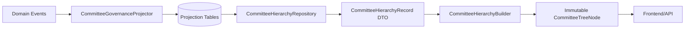
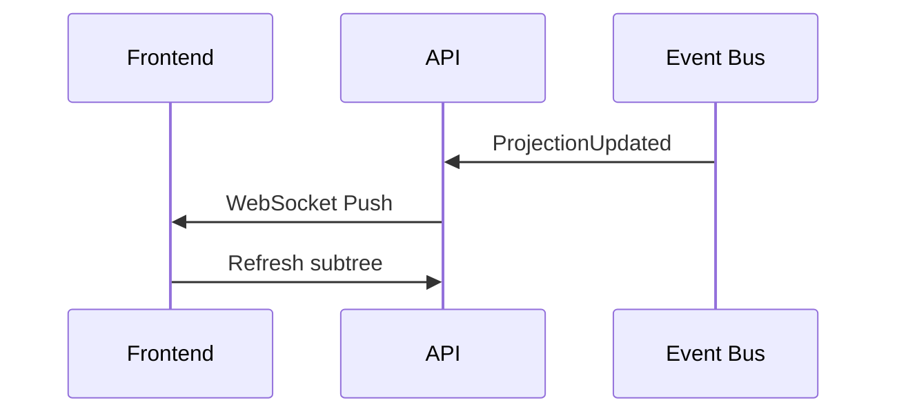
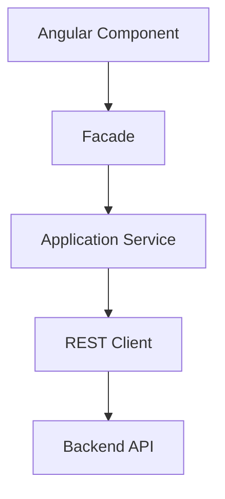

Your backend is now in a very strong architectural state for starting frontend development. The governance subsystem already demonstrates several mature qualities:

* deterministic projections
* CQRS-style query separation
* immutable read models
* architecture fitness tests
* rebuildable projections
* eventual consistency semantics
* cache generation invalidation
* cycle/orphan protection
* replay-safe projections

This is no longer “prototype backend” territory.
It is already behaving like a production-grade governance platform core.

However, before aggressively building the frontend, I would still recommend completing a small but important backend stabilization layer first.

# Current Architecture Status

You now have:



This is architecturally clean.

The frontend can now safely consume immutable governance snapshots instead of live domain logic.

---

# What Still Remains on Backend Before Full Frontend Expansion

You are about 80–85% ready for frontend work.

The remaining backend work is mainly:

* API stabilization
* frontend-oriented query contracts
* pagination/search/filtering
* security integration
* UI-focused response shaping
* observability
* operational hardening

NOT core governance logic anymore.

---

# Recommended Next Backend Phase (Very Important)

Before frontend scaling, I strongly recommend a dedicated:

# Phase 7 — API & Frontend Integration Layer

This should become the next architectural phase.

---

# What Phase 7 Should Contain

## 1. Dedicated Query API Layer

Right now you have internal application services and DTOs.

You still need stable HTTP contracts.

Example:

```text
GET /api/governance/committees/hierarchy
GET /api/governance/committees/{id}
GET /api/governance/committees/{id}/governance
GET /api/governance/committees/{id}/children
```

Important:

Frontend should NEVER know:

* projections
* rebuilders
* interpreters
* repositories
* builders

Only stable API contracts.

---

# 2. Response Contract Stabilization

Right now:

* CommitteeHierarchyRecord
* CommitteeTreeNode

are internal application structures.

You should introduce explicit API resources:

```text
CommitteeHierarchyResponse
CommitteeGovernanceResponse
CommitteeSummaryResponse
```

This avoids:

* DTO leakage
* accidental frontend coupling
* future refactor breakage

This is critical.

---

# 3. API Versioning

Start NOW.

Do not postpone.

Example:

```text
/api/v1/governance/...
```

Future governance rules WILL evolve.

Without versioning:

* frontend coupling explodes
* migrations become dangerous

---

# 4. Frontend-Centric Read Models

Your current projections are backend-centric.

Frontend usually needs:

## Tree View Projection

```json
{
  "id": "...",
  "name": "...",
  "childrenCount": 12,
  "canAct": true,
  "operationalState": "ACTIVE",
  "temporalState": "VALID"
}
```

## Governance Dashboard Projection

```json
{
  "activeCommittees": 112,
  "expiringSoon": 7,
  "suspended": 2
}
```

## Committee Detail Projection

```json
{
  "authorityChain": [...],
  "governanceHistory": [...],
  "delegations": [...]
}
```

Do NOT overload one projection for all UI use cases.

This is where many systems become slow later.

---

# 5. Authorization Layer

This is probably the biggest missing backend piece.

You already mentioned Keycloak in previous architecture discussions.

You now need:

## Governance Authorization Matrix

Example:

| Role         | Can View | Can Rebuild | Can Edit |
| ------------ | -------- | ----------- | -------- |
| ICC_ADMIN    | ✅        | ✅           | ✅        |
| TENANT_ADMIN | ✅        | ❌           | ✅        |
| OBSERVER     | ✅        | ❌           | ❌        |

This should NOT be hardcoded in controllers.

Use:

* policies
* authorization services
* capability-based permissions

---

# 6. API Query Optimization

Before frontend:

Add:

* pagination
* lazy loading
* subtree loading
* search
* filtering
* sorting

Example:

```text
GET /hierarchy?depth=2
GET /hierarchy?root=abc
GET /hierarchy?state=ACTIVE
GET /hierarchy?search=finance
```

Otherwise frontend tree rendering will become extremely expensive.

---

# 7. SSE / WebSocket Strategy (Optional but Future-Important)

Because projections are eventually consistent, frontend freshness becomes important.

Future-ready approach:



Not urgent now.

But architecturally important.

---

# 8. OpenAPI / Contract-First Documentation

This should start immediately.

Use:

* OpenAPI
* Swagger
* stoplight
* contract tests

Your frontend team should develop against contracts.

Not against controller implementations.

---

# 9. Projection Freshness Metadata Exposure

You already built:

* rebuilt_at
* projection_generation
* schema_version

Excellent.

Now expose them:

```json
{
  "projectionGeneration": "...",
  "rebuiltAt": "...",
  "eventuallyConsistent": true
}
```

This helps:

* debugging
* UI refresh indicators
* admin tooling
* observability

---

# 10. Operational Observability

Very important before UI rollout.

Add:

## Metrics

```text
projection_rebuild_duration
projection_staleness_seconds
projection_generation_changes
projection_failures
```

## Health endpoints

```text
/health/governance
/health/projections
```

---

# Frontend Architecture Recommendation

You are now ready to start frontend architecture in parallel.

---

# Recommended Frontend Architecture

Given your backend maturity:

## DO NOT build:

* controller-coupled Angular pages
* massive stateful components
* ad-hoc API calls

Instead:

# Recommended Frontend Stack

## Option A (Recommended)

### Angular + Nx + Feature Domains

Since your ecosystem already resembles enterprise Angular environments.

Structure:

```text
apps/
libs/

libs/governance/domain
libs/governance/application
libs/governance/ui
libs/governance/infrastructure
```

DDD frontend boundaries.

Excellent for:

* governance complexity
* scaling
* multiple teams

---

# Recommended Frontend Pattern



Never let components directly call HTTP.

---

# Frontend State Management

For governance trees:

Recommended:

* Angular Signals OR
* NgRx Signal Store

Avoid classic huge NgRx reducers everywhere unless truly necessary.

---

# First Frontend Features To Build

I would prioritize:

## Phase FE-1

### Governance Hierarchy Explorer

This is the perfect first UI.

Because:

* projection system already exists
* immutable tree already exists
* query side is mature

---

# Suggested UI Modules

## 1. Hierarchy Tree Viewer

Features:

* expand/collapse
* subtree lazy loading
* governance badges
* legitimacy status
* search/filter

---

## 2. Committee Detail Panel

Show:

* authority chain
* governance status
* temporal state
* rebuild metadata

---

## 3. Projection Health Dashboard (Admin)

Show:

* stale projections
* rebuild progress
* orphan quarantines
* cycle detection incidents

This becomes extremely valuable operationally.

---

# Critical Architectural Advice

Do NOT expose:

* Eloquent models
* projection tables
* internal DTOs
* domain entities

to frontend directly.

Your backend is now sophisticated enough that frontend coupling becomes your next biggest architectural risk.

---

# My Recommendation Summary

## Backend Status

Core governance backend:

* architecturally strong
* production-grade direction
* frontend-ready foundation

## Before Full Frontend

Complete:

1. API contracts
2. authorization layer
3. frontend-specific projections
4. pagination/search
5. OpenAPI docs
6. observability

## Frontend Can Start NOW

Especially:

* hierarchy explorer
* governance dashboard
* committee detail pages

in parallel with Phase 7 backend stabilization.

---

# What I Would Personally Do Next

## Immediate Next Sprint

### Backend

* REST API layer
* OpenAPI contracts
* authorization matrix
* subtree query optimization

### Frontend

* Angular Nx workspace
* governance hierarchy explorer
* API client SDK generation
* immutable UI state layer

That would put the project into a very scalable enterprise trajectory.

```text
# ===================================================================
# PHASE 7 — GOVERNANCE API + FRONTEND INTEGRATION LAYER
# PSEUDO-ALGORITHMIC EXECUTION INSTRUCTIONS FOR CLAUDE CLI
# ===================================================================

GOAL:
    Transform the completed Governance Projection backend into a
    frontend-ready enterprise governance platform.

CONTEXT:
    - Phase 6 projection architecture is COMPLETE
    - 295+ tests passing
    - Projection system is deterministic and rebuildable
    - Query path purity enforced
    - CQRS read side operational
    - Governance projection lifecycle documented

IMPORTANT:
    DO NOT rewrite the governance domain model.
    DO NOT modify domain invariants.
    DO NOT collapse bounded contexts.
    DO NOT introduce framework leakage into domain.
    DO NOT expose Eloquent models directly to frontend.

ARCHITECTURAL PRINCIPLES:
    - DDD
    - CQRS
    - Immutable read models
    - Contract-first APIs
    - Hexagonal architecture
    - Eventual consistency
    - Frontend/backend decoupling
    - Replay-safe projections

SUCCESS CRITERIA:
    - Stable REST API contracts
    - Frontend-consumable DTOs
    - OpenAPI documentation
    - Authorization layer
    - Hierarchy explorer ready
    - Projection observability operational
    - API versioning established
    - Tree queries optimized
    - Full regression green

# ===================================================================
# STEP 1 — CREATE API BOUNDARY LAYER
# ===================================================================

CREATE DIRECTORY:
    app/Contexts/Governance/API/V1/

CREATE:
    Controllers/
    Requests/
    Responses/
    Resources/
    Routes/

RULE:
    API layer MUST depend on Application layer ONLY.

FORBIDDEN:
    Controller -> Infrastructure direct access
    Controller -> Eloquent models
    Controller -> Projection tables

ALLOWED:
    Controller -> UseCases
    Controller -> QueryServices
    Controller -> ResponseMappers

# ===================================================================
# STEP 2 — ESTABLISH API VERSIONING
# ===================================================================

CREATE ROUTE PREFIX:
    /api/v1/governance

ADD:
    routes/api/governance_v1.php

REGISTER:
    RouteServiceProvider integration

VERIFY:
    Future API versions can coexist.

REJECT:
    Unversioned governance APIs.

# ===================================================================
# STEP 3 — CREATE FRONTEND-SAFE RESPONSE CONTRACTS
# ===================================================================

CREATE RESPONSE DTOs:

    CommitteeHierarchyResponse
    CommitteeSummaryResponse
    CommitteeGovernanceResponse
    CommitteeChildrenResponse
    GovernanceHealthResponse

RULES:
    - readonly immutable DTOs
    - scalar-only serialization
    - NO domain entities
    - NO Eloquent exposure
    - NO internal projection leakage

RESPONSE CONTRACT MUST:
    hide internal persistence implementation.

# ===================================================================
# STEP 4 — IMPLEMENT QUERY CONTROLLERS
# ===================================================================

CREATE:

    GET /api/v1/governance/hierarchy
    GET /api/v1/governance/committees/{id}
    GET /api/v1/governance/committees/{id}/children
    GET /api/v1/governance/committees/{id}/governance
    GET /api/v1/governance/health/projections

CONTROLLER REQUIREMENTS:
    - thin controllers
    - orchestration only
    - no business logic
    - no governance interpretation
    - use FormRequest validation
    - return Response DTOs only

VERIFY:
    query path remains pure.

# ===================================================================
# STEP 5 — ADD FRONTEND QUERY CAPABILITIES
# ===================================================================

EXTEND HIERARCHY QUERY:

SUPPORT:
    ?depth=
    ?root=
    ?search=
    ?state=
    ?page=
    ?perPage=
    ?sort=

IMPLEMENT:
    subtree loading
    lazy loading
    pagination
    filtering
    sorting

OPTIMIZE:
    prevent full-tree loading for large hierarchies.

REQUIREMENT:
    hierarchy queries must scale to large governance trees.

# ===================================================================
# STEP 6 — CREATE FRONTEND-OPTIMIZED PROJECTIONS
# ===================================================================

DO NOT overload existing projections.

CREATE SPECIALIZED READ MODELS:

    CommitteeTreeProjection
    GovernanceDashboardProjection
    CommitteeDetailProjection

PURPOSE:
    Tree View
    Dashboard View
    Detail View

RULE:
    One projection per frontend use case.

VERIFY:
    read-model specialization exists.

# ===================================================================
# STEP 7 — CREATE AUTHORIZATION LAYER
# ===================================================================

INTEGRATE:
    Keycloak JWT security

CREATE:
    GovernanceAuthorizationService

IMPLEMENT CAPABILITIES:

    VIEW_HIERARCHY
    VIEW_GOVERNANCE
    REBUILD_PROJECTIONS
    MANAGE_COMMITTEE
    VIEW_AUDIT_HISTORY

CREATE ROLE MATRIX:

    ICC_ADMIN
    TENANT_ADMIN
    GOVERNANCE_OBSERVER
    COMMITTEE_OPERATOR

RULE:
    authorization logic MUST NOT live in controllers.

USE:
    policies
    middleware
    authorization services

VERIFY:
    projection rebuild endpoint protected.

# ===================================================================
# STEP 8 — CREATE OPENAPI CONTRACTS
# ===================================================================

GENERATE:
    OpenAPI specification

DOCUMENT:
    endpoints
    schemas
    pagination
    filters
    authorization
    consistency semantics

INCLUDE:
    eventual consistency notes.

REQUIREMENT:
    frontend team can develop without backend internals.

# ===================================================================
# STEP 9 — ADD PROJECTION OBSERVABILITY
# ===================================================================

CREATE HEALTH ENDPOINTS:

    /health/governance
    /health/projections

EXPOSE:

    projection_generation
    rebuilt_at
    projection_schema_version
    stale_projection_count
    rebuild_failures

CREATE METRICS:

    projection_rebuild_duration
    projection_staleness_seconds
    projection_generation_changes
    projection_query_latency

VERIFY:
    operational visibility exists.

# ===================================================================
# STEP 10 — ADD CACHE + FRESHNESS CONTRACTS
# ===================================================================

EXPOSE IN API RESPONSES:

{
    "projectionGeneration": "...",
    "rebuiltAt": "...",
    "eventuallyConsistent": true
}

RULE:
    frontend MUST understand projection freshness semantics.

DOCUMENT:
    stale-read tolerance expectations.

# ===================================================================
# STEP 11 — CREATE FRONTEND ARCHITECTURE
# ===================================================================

CREATE NX WORKSPACE STRUCTURE:

apps/
libs/

libs/governance/domain
libs/governance/application
libs/governance/infrastructure
libs/governance/ui

USE:
    Angular
    Signals OR Signal Store

FORBIDDEN:
    Component -> HttpClient direct calls

REQUIRED FLOW:

    Component
        -> Facade
            -> Application Service
                -> API Client

VERIFY:
    layered frontend architecture exists.

# ===================================================================
# STEP 12 — BUILD HIERARCHY EXPLORER
# ===================================================================

CREATE:
    GovernanceHierarchyPage

FEATURES:
    expand/collapse
    lazy subtree loading
    governance badges
    legitimacy indicators
    search/filter
    pagination
    stale-data indicators

DISPLAY:
    operational state
    temporal state
    legitimacy
    canAct
    isFullyOperational

REQUIREMENT:
    UI must tolerate eventual consistency.

# ===================================================================
# STEP 13 — BUILD COMMITTEE DETAIL PAGE
# ===================================================================

DISPLAY:
    authority chain
    governance status
    temporal state
    delegations
    governance history
    rebuild metadata
    projection freshness

VERIFY:
    frontend never interprets governance rules itself.

# ===================================================================
# STEP 14 — BUILD ADMIN PROJECTION DASHBOARD
# ===================================================================

CREATE:
    GovernanceProjectionAdminPage

SHOW:
    stale projections
    rebuild status
    orphan quarantines
    cycle incidents
    generation changes
    rebuild history

INCLUDE:
    manual rebuild trigger

PROTECT:
    admin-only access.

# ===================================================================
# STEP 15 — ARCHITECTURE FITNESS TESTS
# ===================================================================

ADD TESTS:

RULE-FE-01:
    frontend DTOs do not expose Eloquent models

RULE-FE-02:
    controllers do not import domain policies

RULE-FE-03:
    API responses are immutable

RULE-FE-04:
    all governance APIs versioned

RULE-FE-05:
    frontend projections remain rebuildable

RULE-FE-06:
    no frontend component directly calls HttpClient

RULE-FE-07:
    OpenAPI schema matches response DTOs

RULE-FE-08:
    query handlers remain interpretation-free

VERIFY:
    architecture drift detection operational.

# ===================================================================
# STEP 16 — PERFORMANCE VALIDATION
# ===================================================================

BENCHMARK:
    hierarchy query latency
    subtree expansion
    projection rebuild duration
    cache invalidation propagation

TARGET:
    scalable governance hierarchy rendering.

VERIFY:
    no N+1 query explosions.

# ===================================================================
# STEP 17 — FINAL VALIDATION
# ===================================================================

RUN:
    full backend tests
    architecture tests
    frontend tests
    contract tests
    OpenAPI validation
    linting
    type checking

VERIFY:
    all green.

GENERATE:
    implementation summary
    architectural decisions
    migration notes
    frontend onboarding notes

# ===================================================================
# CRITICAL NON-NEGOTIABLE RULES
# ===================================================================

NEVER:
    - expose domain aggregates to frontend
    - execute governance interpretation in controllers
    - bypass projection system
    - couple frontend to persistence
    - collapse CQRS boundaries
    - mutate immutable DTOs
    - introduce framework dependencies into domain
    - use frontend state as source of truth

ALWAYS:
    - preserve replay determinism
    - preserve query purity
    - preserve eventual consistency semantics
    - preserve projection rebuildability
    - preserve immutable read models
    - preserve architecture fitness enforcement

# ===================================================================
# EXPECTED END STATE
# ===================================================================

FINAL SYSTEM SHOULD SUPPORT:

    - scalable governance hierarchy UI
    - deterministic projections
    - replay-safe rebuilds
    - enterprise authorization
    - frontend/backend decoupling
    - operational observability
    - contract-first frontend development
    - future API evolution
    - large-scale governance trees

# ===================================================================
# END OF EXECUTION PLAN
# ===================================================================
``` 