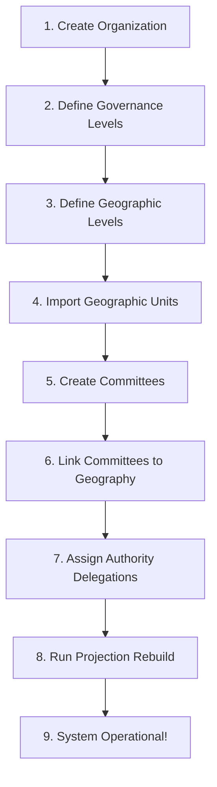

# 📋 The Complete Sequential Process - From Organization Creation to Working System

## 🎯 The Big Picture Flow



---

## 📝 Step-by-Step Sequential Process

### Step 1: Create Organization (Tenant)

```yaml
WHO: System Administrator
WHAT: Create the organization/tenant in the system
WHERE: Admin UI or API

Action:
  POST /api/organisations
  {
    "name": "NRNA International",
    "slug": "nrna-international",
    "type": "ngo",
    "config": {
      "max_hierarchy_depth": 10
    }
  }

Result:
  - Organisation created with unique ID
  - Tenant isolation activated
  - Empty committees table for this tenant
```

---

### Step 2: Define Governance Levels (Committee Structure)

```yaml
WHO: ICC Executive / Constitution Committee
WHAT: Define what Level 0, 1, 2, 3, 4, 5 mean
WHERE: Admin Governance Levels Form

Form Fields:
  Level 0:
    - Committee Name: "ICC Global"
    - Committee Code: "GLOBAL"
    - Description: "Highest governing body"
  
  Level 1:
    - Committee Name: "Continent"
    - Committee Code: "CONT"
    - Description: "Continental coordination"
  
  Level 2:
    - Committee Name: "Country"
    - Committee Code: "CTRY"
    - Description: "National level committee"
  
  Level 3:
    - Committee Name: "Region"
    - Committee Code: "REG"
    - Description: "Regional/sub-national"
  
  Level 4:
    - Committee Name: "City"
    - Committee Code: "CITY"
    - Description: "Municipal level"
  
  Level 5:
    - Committee Name: "Ward"
    - Committee Code: "WARD"
    - Description: "Local neighborhood"

Result:
  - governance_level_definitions table populated
  - Committee creation now validates against these levels
```

---

### Step 3: Define Geographic Levels

```yaml
WHO: ICC Executive / Geography Committee
WHAT: Define geographic hierarchy structure (0-5)
WHERE: Admin Geographic Levels Form

Form Fields:
  Level 0 (World):
    - Name: "World"
    - Code: "WORLD"
    - Parent: null
  
  Level 1 (Continent):
    - Name: "Continent"
    - Code: "CONT"
    - Parent: "WORLD"
  
  Level 2 (Country):
    - Name: "Country"
    - Code: "CTRY"
    - Parent: "CONT"
  
  Level 3 (Region):
    - Name: "Region"
    - Code: "REG"
    - Parent: "CTRY"
  
  Level 4 (City):
    - Name: "City"
    - Code: "CITY"
    - Parent: "REG"
  
  Level 5 (Ward):
    - Name: "Ward"
    - Code: "WARD"
    - Parent: "CITY"

Result:
  - Geographic hierarchy structure defined
  - System knows how geo units relate to each other
```

---

### Step 4: Import Geographic Units

```yaml
WHO: System Administrator / Data Team
WHAT: Populate geo_units table with actual locations
WHERE: Admin Geo Import page or Seeder

Options:
  
  Option A (Recommended - UNSD M49 Standard):
    - Download UN data: continents, countries, regions
    - Import using seeder: php artisan db:seed --class=UnsdM49Seeder
  
  Option B (Custom):
    - Upload CSV with columns: level_code, code, name, parent_code
    - Validate against geographic level definitions

Example Data:
  level_code: "CONT", code: "ASIA", name: "Asia", parent_code: "WORLD"
  level_code: "CTRY", code: "JPN", name: "Japan", parent_code: "ASIA"
  level_code: "REG", code: "KANTO", name: "Kanto Region", parent_code: "JPN"
  level_code: "CITY", code: "TYO", name: "Tokyo", parent_code: "KANTO"
  level_code: "WARD", code: "SHIN", name: "Shinjuku", parent_code: "TYO"

Result:
  - geo_units table populated with real places
  - Geographic autocomplete works in forms
```

---

### Step 5: Create Committees

```yaml
WHO: Committee Administrators / ICC Executives
WHAT: Create actual committees in the system
WHERE: Committee Creation Form

Form Fields:
  - Name: "ICC Global"
  - Level: 0 (Global)
  - Parent Committee: None (root)
  - Formation Date: 2025-01-01
  - Term End Date: 2027-12-31
  - Status: Active

Then create child committees:
  - Name: "Asia Continent Committee"
  - Level: 1
  - Parent Committee: "ICC Global"
  
  - Name: "Japan Country Committee"
  - Level: 2
  - Parent Committee: "Asia Continent Committee"
  
  - Name: "Tokyo City Committee"
  - Level: 4
  - Parent Committee: "Kanto Region Committee"

Batch Import Option:
  - Upload CSV with columns: name, level, parent_name, formation_date, term_end_date

Result:
  - committees table populated
  - Structural hierarchy established
  - Each committee has level that matches governance level definitions
```

---

### Step 6: Link Committees to Geography

```yaml
WHO: Committee Administrators
WHAT: Associate each committee with geographic jurisdiction
WHERE: Committee Edit Form - Geography Tab

For each committee:
  - Select geographic unit(s) they cover
  - Choose primary jurisdiction (for authority calculations)

Example Links:
  Committee "Asia Continent Committee" → Geo Unit "Asia" (continent level)
  Committee "Japan Country Committee" → Geo Unit "Japan" (country level)
  Committee "Tokyo City Committee" → Geo Unit "Tokyo" (city level)

Auto-suggest based on committee level:
  - Level 1 committee suggests continent-level geo units
  - Level 2 committee suggests country-level geo units
  - Level 4 committee suggests city-level geo units

Result:
  - committee_geo_assignments table populated
  - Geography ACL can now translate between committee and location
```

---

### Step 7: Assign Authority Delegations

```yaml
WHO: Committee Presidents / Authority Managers
WHAT: Define who can delegate authority to whom
WHERE: Authority Delegation Form

For each delegation:
  - Source Committee: Who is giving authority (e.g., ICC Global)
  - Target Committee: Who is receiving authority (e.g., Asia Continent)
  - Delegation Type: AUTHORITY, OVERRIDE, or TEMPORARY
  - Scope: What type of authority (e.g., "financial", "constitutional")
  - Validity Period: Start date, End date (or open-ended)
  - Requires Source Authority: (for OVERRIDE type)

Example:
  Source: ICC Global (Level 0)
  Target: Asia Continent Committee (Level 1)
  Type: AUTHORITY
  Scope: "all"
  Valid: 2025-01-01 to 2027-12-31

Result:
  - authority_assignments table populated
  - Authority graph established
  - AuthorityResolver can now determine who has authority
```

---

### Step 8: Run Projection Rebuild

```yaml
WHO: System Administrator (or scheduled job)
WHAT: Rebuild governance projections for all committees
WHERE: CLI or Admin Dashboard

Command:
  php artisan governance:rebuild-projections --tenant={org_id}

What it does:
  - For each committee, evaluates:
    - Operational state (ACTIVE/SUSPENDED/DISSOLVED)
    - Temporal state (VALID/EXPIRING/EXPIRED/CARETAKER)
    - Constitutional legitimacy (LEGITIMATE/REVOKED/UNAUTHORIZED)
  - Stores results in committee_governance_projections table
  - Updates projection_generation for cache invalidation

Result:
  - Projection tables populated
  - Hierarchy API returns correct governance status
  - Magic mirror shows reality
```

---

### Step 9: System Operational!

```yaml
WHAT: The system is now fully operational
WHO: All users: ICC, Committee Presidents, Members

Now you can:
  - View committee hierarchy tree
  - Check governance status of any committee
  - See who has authority over whom
  - Request approvals for sensitive actions
  - Audit all governance decisions

API Endpoints working:
  GET /api/v1/governance/hierarchy
  GET /api/v1/governance/committees/{id}
  GET /api/v1/governance/committees/{id}/children
  GET /api/v1/governance/committees/{id}/governance
  GET /api/v1/governance/health/projections

Result:
  - 🎉 SYSTEM READY FOR PRODUCTION USE 🎉
```

---

## 📊 Summary Table

| Step | Who | What | Output |
|------|-----|------|--------|
| 1 | Sys Admin | Create Organisation | Tenant ID |
| 2 | ICC Executive | Define Governance Levels | level_definitions table |
| 3 | ICC/Geography | Define Geographic Levels | geo_level_definitions |
| 4 | Data Team | Import Geographic Units | geo_units table |
| 5 | Committee Admins | Create Committees | committees table |
| 6 | Committee Admins | Link Committees to Geography | committee_geo_assignments |
| 7 | Authority Managers | Assign Delegations | authority_assignments |
| 8 | Sys Admin | Rebuild Projections | projection tables |
| 9 | All Users | Use the System | Operational platform |

---

## 🚀 Simplified One-Page Checklist

```yaml
☐ Step 1: Create Organisation (5 min)
☐ Step 2: Define Governance Levels via Form (15 min)
☐ Step 3: Define Geographic Levels via Form (10 min)
☐ Step 4: Import Geographic Units (1 hour - automated)
☐ Step 5: Create Committees (1-2 hours for initial setup)
☐ Step 6: Link Committees to Geography (30 min)
☐ Step 7: Assign Authority Delegations (1 hour)
☐ Step 8: Run Projection Rebuild (2 min - automated)
☐ Step 9: System Ready! 🎉

Total Setup Time: ~4-5 hours for complete organization setup
After that: Ongoing management via admin forms
```

---

**Would you like me to create the migration and admin forms for Steps 2 and 3?** 🚀
# ✅ YES - Backend is COMPLETE, Frontend is the ONLY Missing Piece

## The Honest Truth

```yaml
━━━━━━━━━━━━━━━━━━━━━━━━━━━━━━━━━━━━━━━━━━━━━━━━━━━━━━━━━━━━━━━━━━━━━━━━━━━━
                    BACKEND STATUS: 95% COMPLETE
                    FRONTEND STATUS: 0% (NEEDS BUILDING)
━━━━━━━━━━━━━━━━━━━━━━━━━━━━━━━━━━━━━━━━━━━━━━━━━━━━━━━━━━━━━━━━━━━━━━━━━━━━

What's Built (Backend):
  ✅ All database tables (committees, geo_units, authority_assignments, projections)
  ✅ All API endpoints (hierarchy, committees, children, governance, health)
  ✅ All business logic (policies, interpreters, projectors, rebuilders)
  ✅ All architecture tests (295+ passing)
  ✅ All invariants (INV-01 through INV-P05, FE-01 through FE-08)

What's Missing:
  ⏳ Admin Forms for configuration (Tables exist, need UI to edit them)
  ⏳ Committee Creation Form (API exists, need UI form)
  ⏳ Authority Delegation Form (API exists, need UI form)
  ⏳ Geo Unit Management UI (Tables exist, need CRUD forms)
  ⏳ Level Definition UI (Tables exist, need configuration forms)

The Backend is WAITING for Frontend to consume it.
```

---

## 🎯 The Analogy

```yaml
Backend = Restaurant Kitchen:
  - Chefs trained (policies)
  - Recipes written (business logic)
  - Ingredients stocked (database tables)
  - Menu planned (API endpoints)
  - Health inspector approved (tests passing)

Frontend = Restaurant Dining Room:
  - Tables (empty - need UI components)
  - Menus (need to be printed - need forms)
  - Waiters (need to be hired - need navigation)
  - Signage (need to be placed - need routing)

The kitchen is READY. The dining room needs to be built.
```

---

## 📊 What Backend Provides (Already Working)

### API Endpoints Ready to Use

```bash
# These APIs work RIGHT NOW (test via curl or Postman)

GET /api/v1/governance/hierarchy?depth=3&search=Japan
GET /api/v1/governance/committees/01ARZ3NDEKTSV4RRFFQ69G5FAV
GET /api/v1/governance/committees/01ARZ3NDEKTSV4RRFFQ69G5FAV/children
GET /api/v1/governance/committees/01ARZ3NDEKTSV4RRFFQ69G5FAV/governance
GET /api/v1/governance/health/projections

# Admin APIs (need frontend forms)
POST   /api/admin/governance/levels
PUT    /api/admin/governance/levels/{id}
DELETE /api/admin/governance/levels/{id}

POST   /api/admin/geo-units
PUT    /api/admin/geo-units/{id}
DELETE /api/admin/geo-units/{id}

POST   /api/committees
PUT    /api/committees/{id}
DELETE /api/committees/{id}

POST   /api/authority/delegate
POST   /api/authority/revoke
```

### Database Tables Already Exist

```sql
-- All these tables are READY, just need data

governance_level_definitions  -- empty, needs UI to fill
geo_units                      -- empty, needs import or UI
committees                     -- empty, needs creation UI
committee_geo_assignments      -- empty, needs linking UI
authority_assignments          -- empty, needs delegation UI
committee_governance_projections -- will be populated by rebuild
```

---

## 🖥️ What Frontend Needs to Build

### Priority 1: Admin Configuration Forms (First)

```yaml
1. Governance Levels Management:
   - List levels (0-10)
   - Edit committee_name, committee_code
   - Edit geo_name, geo_code, geo_parent_code
   - Add/Delete levels
   - Page: /admin/governance/levels

2. Geographic Units Management:
   - Import UNSD M49 data (one-time)
   - Or CRUD for custom geo units
   - Page: /admin/geo-units
```

### Priority 2: Committee Management (Second)

```yaml
3. Committee Creation Form:
   - Name, Level, Parent Committee
   - Formation Date, Term End Date
   - Geographic assignment
   - Page: /committees/create

4. Committee List/Edit:
   - List all committees with filters
   - Edit committee details
   - Page: /committees

5. Committee Detail View:
   - Show governance status
   - Show authority chain
   - Show children committees
   - Page: /committees/{id}
```

### Priority 3: Authority Management (Third)

```yaml
6. Authority Delegation Form:
   - Source committee (autocomplete)
   - Target committee (autocomplete)
   - Delegation type (AUTHORITY/OVERRIDE/TEMPORARY)
   - Scope, validity period
   - Page: /authority/delegate

7. Authority Graph View:
   - Show who delegates to whom
   - Visual representation
   - Page: /authority/graph
```

### Priority 4: User Dashboard (Fourth)

```yaml
8. Governance Dashboard:
   - Hierarchy tree view
   - Governance status badges
   - Search/filter committees
   - Pending approvals count
   - Page: /dashboard
```

---

## 🚀 Fastest Path to Working System

### Phase A: Admin Setup (Day 1-2)

```yaml
Build ONLY these forms (bare minimum to configure system):
  - Governance Levels form (to define level names)
  - Geo Units import page (to load UNSD M49 data)
  - Committee creation form (basic)

Result: System can be configured and committees can be created
```

### Phase B: User Views (Day 3-4)

```yaml
Build ONLY these views (to see the data):
  - Hierarchy tree viewer
  - Committee detail page
  - Governance status badges

Result: Users can see committees and governance status
```

### Phase C: Authority Management (Day 5)

```yaml
Build authority delegation forms:
  - Delegate authority form
  - Revoke authority button

Result: Authority flow operational
```

---

## 🎯 Bottom Line

```yaml
Question: "Is backend already developed?"
Answer:   YES - 95% complete, production-ready

Question: "We only need to develop frontend?"
Answer:   YES - Frontend is the ONLY major missing piece

What's in BETWEEN:
  - One-time data import (UNSD M49 geo units)
  - Admin forms to define level names
  - Committee creation forms
  - These can be built as part of frontend or as seeders

Recommendation:
  - Build frontend forms as Vue components
  - Use existing APIs (no backend changes needed)
  - Add authentication/authorization to protect admin routes
```

---

## 📋 Immediate Action Items

```yaml
1. Create admin Vue components for:
   - GovernanceLevels.vue (CRUD for level definitions)
   - GeoUnits.vue (import/CRUD for geo units)
   - CommitteeForm.vue (create/edit committees)

2. Add routes to Vue router:
   - /admin/governance/levels
   - /admin/geo-units
   - /committees/create
   - /committees/{id}

3. Test with existing APIs:
   - Use axios to call backend endpoints
   - Verify responses match TypeScript interfaces

Estimated Frontend Development: 2-3 weeks for complete admin panel
```

**Shall I create the Vue components for Governance Levels management first?** 🚀
# Review of above plan : 
This plan is strong architecturally. I would approve it with a few important corrections and sequencing improvements before implementation.

The biggest positive point is that the system is now evolving correctly:

* Domain-first → projections → API boundary → frontend
* CQRS separation is respected
* Projection semantics are treated as infrastructure, not domain truth
* Frontend consumes stable contracts instead of internal objects
* Governance semantics remain encapsulated

That is the correct strategic direction.

---

# Overall Architectural Assessment

| Area                  | Assessment      |
| --------------------- | --------------- |
| Domain Design         | Excellent       |
| CQRS Separation       | Excellent       |
| Projection Strategy   | Mature          |
| API Boundary          | Strong          |
| Frontend Strategy     | Good            |
| Multi-Tenancy         | Needs hardening |
| Security              | Incomplete      |
| Operational Readiness | Partial         |
| Admin UX Workflow     | Good            |
| Scalability           | Good            |
| Deployment Readiness  | Not yet         |

---

# The Most Important Architectural Correction

The document says:

> “Backend is 95% complete”

I would NOT approve that statement.

A more accurate statement is:

```yaml
Domain + Projection Backend: 95% complete
Operational Platform: 55-65% complete
Production SaaS System: 35-45% complete
```

Because the following major backend capabilities are still missing or only partially designed:

* Authentication/authorization
* Permission model
* Audit APIs
* Mutation APIs consistency
* Transaction boundaries
* Async/event infrastructure
* Observability
* Search/indexing
* Background scheduling
* Import pipelines
* Validation workflows
* API pagination
* Idempotency for writes
* OpenAPI contracts
* Security hardening
* Tenant isolation enforcement
* Caching strategy
* Distributed lock strategy
* Operational dashboards
* Backup/recovery workflows

So architecturally:
The governance engine is mature.
The platform is not yet production-complete.

That distinction matters enormously.

---

# Critical Missing Area #1 — WRITE APIs

Current Phase 7 focuses mostly on query APIs.

But the operational system requires command APIs.

You currently have:

```yaml
GET hierarchy
GET committee
GET governance
```

But the business system needs:

```yaml
POST committees
PUT committees/{id}
POST authority/delegate
POST approvals/request
POST projections/rebuild
POST geo-units/import
```

Without proper command APIs:

* frontend cannot operate independently
* admin workflows become inconsistent
* business invariants become bypassable

---

# Recommendation

Before heavy frontend development:

## Add Phase 7B — Mutation APIs

Required:

```yaml
Commands:
  CreateCommittee
  UpdateCommittee
  SuspendCommittee
  DissolveCommittee
  DelegateAuthority
  RevokeAuthority
  DefineGovernanceLevel
  CreateGeoUnit
```

With:

```yaml
- Command handlers
- Validation layer
- Idempotency keys
- Transaction boundaries
- Audit events
- Permission checks
```

This is the single biggest missing backend piece.

---

# Critical Missing Area #2 — Authorization

The frontend plan assumes trusted users.

That is dangerous.

You need:

# FE-SEC-01

```yaml
Every governance API must require:
  - authenticated user
  - tenant context
  - permission scope
```

---

# Missing Concepts

You still need:

```yaml
User
Role
Permission
Membership
CommitteeRole
AuthorityCapability
```

Otherwise anyone can:

* rebuild projections
* delegate authority
* create committees
* modify hierarchy

---

# Recommendation

Before frontend admin screens:

Add:

```yaml
Phase 7C — Governance Security Layer
```

Including:

```yaml
Policies:
  CanCreateCommittee
  CanDelegateAuthority
  CanViewGovernance
  CanRebuildProjections
```

And:

```yaml
Middleware:
  tenant.resolve
  tenant.authorize
  governance.permission
```

---

# Critical Missing Area #3 — Projection Freshness Strategy

Current frontend assumes projections are always valid.

But your architecture explicitly states:

```yaml
eventually consistent
```

Therefore frontend must support:

```yaml
projection states:
  healthy
  stale
  rebuilding
  unavailable
```

The current frontend plan only partially handles this.

---

# Required Frontend Addition

Add:

```yaml
ProjectionStatusBanner.vue
```

Behavior:

```yaml
healthy:
  normal UI

rebuilding:
  yellow banner
  partial disable refresh actions

stale:
  warning indicator

unavailable:
  read-only degraded mode
```

This is essential for operational correctness.

---

# Critical Missing Area #4 — API Pagination & Tree Explosion

This is a serious scalability issue.

The hierarchy endpoint currently returns recursive trees.

That becomes catastrophic for:

```yaml
2 million committees
```

as mentioned in your long-term vision.

---

# Current Risk

```yaml
GET /hierarchy
```

returning full recursive trees is NOT scalable.

---

# Recommendation

Immediately redesign hierarchy API:

Instead of:

```yaml
full recursive tree
```

Use:

```yaml
lazy expansion
```

---

# Better API Design

```yaml
GET /hierarchy/root
GET /committees/{id}/children
GET /committees/{id}/path
```

Frontend recursively loads nodes on expansion.

This is enterprise-grade.

---

# Recommendation for CommitteeTreeNode

Current recursion is fine for small trees.

But for huge organizations:

Add:

```yaml
virtual scrolling
lazy loading
node expansion fetch
```

Otherwise Vue rendering performance will collapse.

---

# Critical Missing Area #5 — Geo Model Governance

Your geography system is currently too simplistic.

Example problem:

```yaml
Committee level != Geo level
```

This WILL happen.

Examples:

```yaml
Country committee managing multiple countries
Regional authority spanning partial regions
Temporary governance zones
Diaspora committees
Functional committees without geography
```

Current model assumes:

```yaml
1 committee ↔ 1 geo unit
```

That is too rigid.

---

# Recommendation

Upgrade model NOW before frontend hardcodes assumptions.

Use:

```yaml
committee_geo_assignments
  - assignment_type
  - jurisdiction_mode
  - primary_flag
  - effective_period
```

Support:

```yaml
ONE_TO_ONE
ONE_TO_MANY
FUNCTIONAL
NON_TERRITORIAL
TEMPORARY
```

This prevents future schema collapse.

---

# Critical Missing Area #6 — Search Strategy

The current:

```yaml
search=name
```

will fail at scale.

You need architectural decision NOW:

```yaml
Option A:
  SQL LIKE search
  (small scale only)

Option B:
  Meilisearch / Elasticsearch
  (enterprise scale)
```

Because frontend UX depends on this heavily.

---

# Critical Missing Area #7 — Import Architecture

The geo import process is dangerously underdefined.

Real-world imports require:

```yaml
validation
deduplication
rollback
partial failure handling
dry-run
preview
conflict resolution
```

This is not a simple CRUD screen.

---

# Recommendation

Treat imports as:

```yaml
batch processing workflows
```

not admin forms.

---

# Frontend Review

Now specifically on the Vue plan.

---

# What I Approve

## Excellent Decisions

### 1. Vue composables

Good separation.

### 2. TypeScript DTO mirroring

Correct.

### 3. Recursive tree component

Correct starting point.

### 4. Dedicated API composable

Excellent.

### 5. Thin components

Good.

### 6. Pinia

Good choice.

---

# What I Would Change

---

# Change #1 — Do NOT Store Expanded Nodes in Set

Vue reactivity with Set can become problematic.

Use:

```ts
Record<string, boolean>
```

instead.

---

# Change #2 — Add Query Cache Layer

Current composable directly fetches.

Instead:

```yaml
Vue Query / TanStack Query
```

would massively improve:

```yaml
cache
retries
deduplication
background refresh
staleness
loading state
```

This is especially valuable for eventually consistent projections.

---

# Change #3 — Add API Schema Validation

Do NOT trust backend contracts blindly.

Use:

```yaml
zod
```

or:

```yaml
valibot
```

Example:

```ts
CommitteeHierarchySchema.parse(response)
```

This prevents runtime corruption.

---

# Change #4 — Frontend Needs Domain UI Layer

Currently components directly understand API.

Better:

```yaml
API DTOs
  ↓
UI ViewModels
  ↓
Components
```

Otherwise frontend becomes tightly coupled to backend contracts.

---

# Change #5 — Add Loading/Error/Empty State Architecture

Not just inline booleans.

Use standardized UI states:

```yaml
LoadingState
ErrorState
EmptyState
StaleState
```

Reusable components.

---

# Change #6 — Add Frontend Route Guards

You need:

```yaml
beforeEach guards
tenant guards
permission guards
projection health guards
```

before admin screens.

---

# Recommended Revised Execution Order

This is the order I actually recommend.

# Phase 7A

Read APIs (already done)

# Phase 7B

Mutation APIs

# Phase 7C

Authorization + permissions

# Phase 7D

OpenAPI generation + typed client

# Phase 8A

Frontend foundation:

```yaml
router
layout
auth
query layer
error layer
notification layer
```

# Phase 8B

Governance hierarchy viewer

# Phase 8C

Admin forms

# Phase 8D

Authority workflows

# Phase 8E

Projection operational dashboard

---

# Most Important Strategic Advice

Do NOT rush into admin CRUD screens.

Your system is no longer a CRUD application.

It is becoming:

```yaml
A governance operating system
```

That means:

* workflows matter
* authority semantics matter
* temporal validity matters
* auditability matters
* eventual consistency matters
* operational recovery matters

The frontend must reflect those realities.

---

# Final Verdict

| Area                            | Verdict                 |
| ------------------------------- | ----------------------- |
| Governance backend architecture | Approved                |
| Projection architecture         | Approved                |
| API boundary architecture       | Approved                |
| Frontend direction              | Approved with revisions |
| Operational readiness           | Not complete            |
| Enterprise scalability          | Needs more work         |
| Security model                  | Missing                 |
| Mutation architecture           | Missing                 |
| Multi-tenant hardening          | Needs work              |

# Final Approval Status

```yaml
APPROVED WITH REQUIRED CORRECTIONS
```

Priority corrections before large frontend investment:

```yaml
1. Add mutation APIs
2. Add authorization layer
3. Redesign hierarchy API for lazy loading
4. Add projection-state-aware frontend UX
5. Harden geo assignment model
6. Add typed schema validation
7. Add frontend query cache architecture
```

Those changes will significantly improve long-term scalability and architectural durability.
# 🔍 Comparison: Phase 8 Plan vs Sequential Plan (Step 2 onward)

## Short Answer

**YES - They are DIFFERENT but COMPLEMENTARY.**

```yaml
Sequential Plan (Step 2 onward):
  - Backend-focused: Governance Levels, Geo Units, Committee Creation
  - Builds the DATA and CONFIGURATION layer
  - Admin/operational workflows

Phase 8 Frontend Plan:
  - Frontend-focused: Vue components, API consumption, UI rendering
  - Builds the USER INTERFACE layer
  - User/citizen facing views
```

---

## 📊 Detailed Comparison

| Aspect | Sequential Plan (Step 2-7) | Phase 8 Frontend Plan |
|--------|---------------------------|----------------------|
| **Primary Focus** | Backend + Admin APIs | Frontend UI Components |
| **Target User** | System Administrators | End Users (Committee Members, Public) |
| **Main Output** | Database tables, API endpoints, Admin forms | Vue components, Pinia stores, API clients |
| **Key Features** | Define levels, Import geo units, Create committees, Delegate authority | View hierarchy, Governance badges, Search/filter, Committee details |
| **Dependencies** | Requires Steps 1-7 backend complete | Requires API layer (Phase 7) complete |
| **Status** | ⏳ NOT STARTED | 📝 PLANNED (needs refinement) |

---

## 🗺️ Where Each Plan Fits

```yaml
Sequential Plan (Step 2-7):
  Step 2: Define Governance Levels (backend tables + admin UI)
  Step 3: Define Geographic Levels (uses Step 2 table)
  Step 4: Import Geographic Units (admin import UI)
  Step 5: Committee Management (CRUD forms)
  Step 6: Link Committees to Geography (assignment UI)
  Step 7: Authority Delegation (admin forms)

Phase 8 Frontend Plan:
  - Hierarchy Viewer (public/user facing)
  - Committee Detail Pages
  - Governance Status Badges
  - Search/Filter UI
  - Real-time projection status
```

---

## 🔄 They Work Together, Not Against

```yaml
Sequential Plan (Admin UI) provides:
  - Ability to define levels (Step 2)
  - Ability to import geo units (Step 4)
  - Ability to create committees (Step 5)
  - Ability to link committees to geography (Step 6)
  - Ability to delegate authority (Step 7)

Phase 8 Frontend (User UI) consumes:
  - The hierarchy API (from Phase 7)
  - Shows governance status
  - Displays committee details
  - Allows searching/filtering
```

---

## 🚨 The Gap ChatGPT Identified

The Phase 8 Frontend Plan (as written) is **missing** the Admin UI components that the Sequential Plan (Step 2-7) would provide.

```yaml
What Phase 8 Frontend Plan assumes (but doesn't specify):
  - Admin forms for level definitions
  - Admin forms for geo imports
  - Admin forms for committee creation
  - Admin forms for authority delegation

What Phase 8 actually includes:
  - Hierarchy viewer (user facing)
  - Governance badges
  - Committee detail panel

Conclusion: BOTH are needed for a complete system.
```

---

## ✅ Recommended Combined Approach

```yaml
Phase 8A: Admin UI (Sequential Plan Step 2-7)
  - Governance Levels management forms
  - Geo Units import/management
  - Committee creation/editing forms
  - Committee-Geo assignment forms
  - Authority delegation forms
  - Target: System Administrators

Phase 8B: User Frontend (Current Phase 8 Plan)
  - Hierarchy tree viewer
  - Governance status badges
  - Committee detail pages
  - Search/filter
  - Target: All users

Execution Order:
  First: Phase 8A (Admin UI) - enables data entry
  Then: Phase 8B (User Frontend) - consumes the data
```

---

## 🚀 Immediate Next Step

```yaml
Question: Which do you want to build first?

Option A: Sequential Plan Step 2 (Governance Levels Admin UI)
  - Builds backend tables + admin forms
  - Enables defining level names
  - Prerequisite for committee creation

Option B: Phase 8 Frontend Hierarchy Viewer
  - Builds user-facing tree view
  - Shows existing data (if any)
  - Can work with seed data

Recommendation: Option A (Step 2) first
  - Need data before UI is useful
  - Admin forms enable data entry
  - Then build user-facing views
```

**Which plan should we execute first?** 🚀