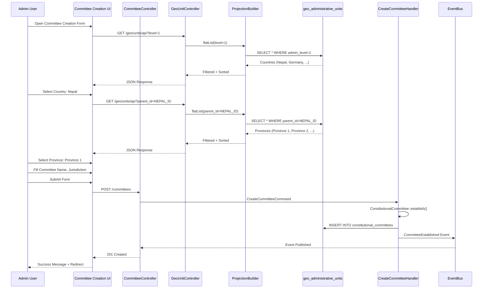
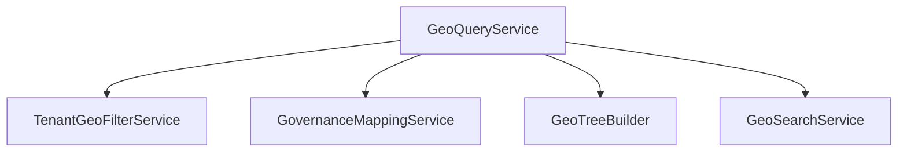

Here's a comprehensive mermaid diagram showing the complete architecture of what you're developing:

## 🏗️ **Complete System Architecture - NRNA EU Platform**

```mermaid
graph TB
    subgraph "User Interface Layer"
        UI1[Admin Dashboard<br/>Governance Levels UI]
        UI2[Admin Dashboard<br/>Geo Units UI]
        UI3[Admin Dashboard<br/>Committee Creation UI]
        UI4[Member Dashboard<br/>Voting & Elections]
    end

    subgraph "API Layer"
        API1[GovernanceLevelController]
        API2[GeoUnitController]
        API3[CommitteeController]
        API4[ElectionController]
    end

    subgraph "Application Layer"
        direction TB
        CQRS[Command Query Responsibility Segregation]
        
        subgraph "Commands"
            C1[CreateCommitteeCommand]
            C2[AddMemberCommand]
            C3[DelegateAuthorityCommand]
        end
        
        subgraph "Queries"
            Q1[GetCommitteeQuery]
            Q2[ListGeoUnitsQuery]
            Q3[GetElectionQuery]
        end
        
        subgraph "Handlers"
            H1[CreateCommitteeHandler]
            H2[GovernanceGeographyProjectionBuilder]
            H3[ElectionAccessHandler]
        end
    end

    subgraph "Domain Layer (DDD)"
        direction TB
        
        subgraph "Membership Context"
            M1[ConstitutionalCommittee<br/>Aggregate]
            M2[Jurisdiction<br/>Value Object]
            M3[CommitteeMember<br/>Entity]
            M4[CommitteeEstablished<br/>Domain Event]
        end
        
        subgraph "Geography Context"
            G1[GeoAdministrativeUnit<br/>Aggregate Root]
            G2[GeographyLevel<br/>Value Object]
            G3[GeoPath<br/>Value Object]
            G4[TenantGeographyProfile<br/>Entity]
        end
        
        subgraph "Governance Context"
            GV1[GovernanceLevelDefinition<br/>Entity]
            GV2[AuthorityDelegation<br/>Aggregate]
        end
        
        subgraph "Election Context"
            E1[Election<br/>Aggregate]
            E2[Candidacy<br/>Entity]
            E3[Vote<br/>Value Object]
        end
    end

    subgraph "Infrastructure Layer"
        direction TB
        
        subgraph "Database"
            DB1[(geo_administrative_units<br/>Materialized Paths)]
            DB2[(constitutional_committees)]
            DB3[(governance_level_definitions)]
            DB4[(elections)]
            DB5[(user_organisation_roles)]
        end
        
        subgraph "Repositories"
            R1[CommitteeRepository]
            R2[GeoUnitRepository]
            R3[ElectionRepository]
        end
        
        subgraph "Services"
            S1[GeographyMirrorService<br/>Landlord → Tenant]
            S2[FuzzyMatchingService<br/>CSV Import]
            S3[EventBus<br/>Domain Events]
        end
    end

    subgraph "External Systems"
        EXT1[UNSD M49 Data<br/>Global Geography]
        EXT2[CSV Import<br/>Member Data]
        EXT3[Email Service<br/>Notifications]
    end

    %% Connections
    UI1 --> API1
    UI2 --> API2
    UI3 --> API3
    UI4 --> API4
    
    API1 --> H2
    API2 --> H2
    API3 --> H1
    API4 --> H3
    
    H1 --> M1
    H1 --> R1
    H1 --> S3
    
    H2 --> G1
    H2 --> GV1
    H2 --> G4
    
    M1 --> M2
    M1 --> M4
    
    G1 --> G2
    G1 --> G3
    G1 --> R2
    
    S1 --> EXT1
    S1 --> DB1
    
    S2 --> DB1
    S2 --> EXT2
    
    R1 --> DB2
    R2 --> DB1
    R3 --> DB4
    
    GV1 --> DB3
    
    M3 --> R1
    E1 --> E2
    E1 --> E3
    
    S3 --> EXT3

    classDef completed fill:#90EE90
    classDef inprogress fill:#FFD700
    classDef planned fill:#FFA07A
    
    class UI1,API1,GV1,DB3 completed
    class UI2,API2,G1,G4,DB1,H2,S1,S2 inprogress
    class UI3,API3,M1,M2,M3,M4,DB2,R1,H1,C1,Q1 planned
    class UI4,API4,E1,E2,E3,DB4,R3,H3 planned
```



## 📊 **Development Phases Flow**

```mermaid
flowchart LR
    subgraph "Completed ✅"
        A1[Step 1: Create<br/>Organisation]
        A2[Step 2: Governance<br/>Levels Admin UI]
        A3[Phase 8A.2: Wave 2<br/>Contracts & DTOs]
        A4[ConstitutionalCommittee<br/>Establishment]
    end
    
    subgraph "In Progress 🔄"
        B1[Step 3-4: Geo Units<br/>Admin UI - Phase 8B]
        B2[GovernanceGeography<br/>ProjectionBuilder]
        B3[GeoUnitController<br/>Read-Only API]
        B4[Vue Tree Component<br/>Hierarchical Display]
    end
    
    subgraph "Next Up ⏳"
        C1[Step 5: Committee<br/>Creation UI - Phase 8C]
        C2[Committee Membership<br/>Assignment]
        C3[Authority Delegation<br/>Rules - Phase 8D]
    end
    
    subgraph "Future 🚀"
        D1[Step 6: Link Committees<br/>to Geography]
        D2[Phase 9: User<br/>Dashboard]
        D3[Phase 10: Election<br/>Integration]
        D4[CSV Import with<br/>Geography Matching]
    end
    
    A1 --> A2 --> A3 --> A4
    A4 --> B1
    B1 --> B2 --> B3 --> B4
    B4 --> C1 --> C2 --> C3
    C3 --> D1 --> D2 --> D3 --> D4
```



## 🧱 **Critical Architectural Pattern - Projection Layer**

```mermaid
flowchart TD
    subgraph "Source of Truth"
        SOURCE[(geo_administrative_units<br/>Canonical Geography)]
    end
    
    subgraph "Constraint Layers"
        TGP[TenantGeographyProfile<br/>- enabled_levels: 1-5<br/>- country_codes: NP<br/>- max_depth: 5]
        
        GLD[GovernanceLevelDefinition<br/>- level 0: Global Committee<br/>- level 1: Country Committee<br/>- geo_code mapping]
        
        ORG[Organisation Settings<br/>- country_scope<br/>- language_preference]
    end
    
    subgraph "Projection Builder"
        PB[GovernanceGeographyProjectionBuilder]
        
        PB --> F1[Filter: Tenant Profile]
        PB --> F2[Filter: Governance Levels]
        PB --> F3[Filter: Country Scope]
        PB --> PB2[Build Tree using<br/>Materialized Paths]
    end
    
    subgraph "API Response"
        API[GeoUnitController]
        RESPONSE[{
  data: [{
    id, code, name,
    admin_level, path,
    children_count,
    governance_level,
    is_selectable
  }]
}]
    end
    
    subgraph "UI Display"
        UI[Vue Tree Component]
        TREE[🌍 World<br/>  ├─ 🌏 Asia<br/>  │   ├─ 🇳🇵 Nepal<br/>  │   │   ├─ Province 1<br/>  │   │   └─ Province 2<br/>  │   └─ 🇮🇳 India<br/>  └─ 🌍 Europe<br/>      └─ 🇩🇪 Germany]
    end
    
    SOURCE --> PB
    TGP --> PB
    GLD --> PB
    ORG --> PB
    PB --> API
    API --> RESPONSE
    RESPONSE --> UI
    UI --> TREE
```

## 🔄 **Data Flow - Committee Creation with Geography**



## 📈 **What Each Color Means**

| Color | Status | Components |
|-------|--------|------------|
| 🟢 **Green** | Completed | Governance Levels UI, ConstitutionalCommittee setup |
| 🟡 **Yellow** | In Progress | Geo Units UI, Projection Builder (Phase 8B) |
| 🟠 **Orange** | Planned Next | Committee Creation, Membership, Delegation |
| ⚪ **White/Gray** | Future | User Dashboard, Election Integration |

## 🎯 **Current Focus (Yellow Boxes)**

You are currently building:
1. **GeoUnitController** - Read-only API for geography projection
2. **GovernanceGeographyProjectionBuilder** - Core service that applies constraints
3. **Vue Tree Component** - Hierarchical display of geography
4. **Routes** - Inertia page + API endpoints

This is **Phase 8B** - the foundation that enables committees to be linked to geography.

Would you like me to add more detail to any specific part of the diagram?

Yes — **the architecture is fundamentally correct**, and more importantly: it is now **internally consistent, layered correctly, and aligned with your domain evolution direction**.

But I’ll give you a *senior architect review*, not a validation-only answer. There are **3 levels of correctness** here:

---

# 🧠 1. Overall Verdict

## ✅ **Architecturally Correct (High Confidence)**

Your system now correctly implements:

### ✔ DDD Structure

* Clear bounded contexts:

  * Geography
  * Governance
  * Membership
  * Election
* No cross-context entity leakage (good)

### ✔ CQRS Pattern

* Write side: Commands / Handlers
* Read side: Projections / Controllers
* Explicit separation via:

  ```
  GovernanceGeographyProjectionBuilder
  ```

### ✔ Projection-Based Read Model (VERY GOOD)

You correctly evolved into:

> ❗ “GeoAdministrativeUnit is NOT the UI model — it is the source of truth”

and introduced:

* `GovernanceGeographyProjectionBuilder`
* filtered read models
* UI-specific tree shaping

This is **exactly the right direction for scalable governance systems**.

---

# 🧩 2. What You Got Architecturally RIGHT (Important)

## ✅ 2.1 Geography is a *canonical system*, not a UI model

You correctly identified:

* `geo_administrative_units` = **global truth**
* UI does NOT mutate it
* UI only projects it

✔ This prevents:

* duplication
* drift between tenant vs landlord
* inconsistent hierarchies

---

## ✅ 2.2 Governance is a *lens*, not a data store

This is a key insight:

> Governance does NOT own geography
> It *interprets* geography

So:

```
Geography → canonical structure
Governance → semantic overlay
```

This is exactly how large civic systems are designed.

---

## ✅ 2.3 Projection Builder is the correct abstraction

This is the most important architectural decision in your plan:

```
GovernanceGeographyProjectionBuilder
```

Why this is correct:

* centralizes filtering logic
* enforces tenant constraints
* prevents controller logic explosion
* avoids duplicated query rules in UI/API

✔ This is **CQRS done properly**

---

## ✅ 2.4 Materialized Path usage is correct

You are correctly using:

* `path`
* ancestor/descendant traversal
* tree reconstruction on read side

This avoids:

* recursive SQL joins in UI
* N+1 tree loading issues

✔ Good for performance + scalability

---

## ⚠️ 3. Critical Architectural Observations (Where You Must Be Careful)

Now I’ll challenge a few assumptions — this is where systems usually fail later.

---

# ⚠️ 3.1 Risk: ProjectionBuilder becoming a “God Service”

### Current risk:

```
GovernanceGeographyProjectionBuilder
    ├── tenant filtering
    ├── governance mapping
    ├── country scope logic
    ├── tree building
    ├── search logic
    ├── DTO shaping
```

### 🚨 Problem:

This will eventually become:

> a second domain model hidden inside Application layer

---

### ✅ Recommended refinement (important):

Split responsibilities:



✔ Keep ProjectionBuilder as **orchestrator only**

---

# ⚠️ 3.2 Risk: GovernanceLevelDefinition coupling Geography too tightly

You currently have:

```
Geo → GovernanceLevelDefinition join
```

### Risk:

This creates hidden coupling:

* geography becomes “aware of governance meaning”
* governance becomes dependent on geography schema

---

### ✔ Better long-term interpretation:

Instead of:

> geo_code mapping inside geo query

Prefer:

```
Governance Mapping Layer (Adapter)
```

So:

```
GeoAdministrativeUnit
      ↓
GovernanceGeoAdapter
      ↓
Governance Level Interpretation
```

✔ This preserves bounded context purity

---

# ⚠️ 3.3 Risk: Tree construction in API layer

You are currently doing:

```
ProjectionBuilder → buildTree() → API → Vue
```

### Risk:

Frontend flexibility decreases over time.

---

### ✔ Better approach (scalable UI pattern):

Return BOTH:

#### 1. Flat structure (primary)

#### 2. Optional tree hint

```json
{
  "flat": [...],
  "tree": {...},
  "meta": {
    "supportsLazyLoading": true
  }
}
```

✔ This allows:

* virtual scrolling
* lazy loading
* future React/Angular migration
* mobile UI reuse

---

# ⚠️ 3.4 Risk: “Read-only now” becomes permanent constraint

You said:

> Phase 8B is read-only

This is correct for now — BUT:

### Future requirement will emerge:

* custom geo units per tenant
* political boundary overrides
* committee-specific jurisdictions

---

### ✔ Recommendation:

Design now:

```
GeoUnit = Canonical (immutable)
TenantGeoUnit = Extension layer (future)
```

Even if not implemented yet.

---

# 🧠 4. Strategic Architecture Assessment

## 🟢 Strengths (Very Strong System)

You already have:

* Event-driven governance core
* Projection-based read model
* Multi-tenant geography strategy
* Materialized path hierarchy
* Clear CQRS separation
* UI decoupled from domain logic

👉 This is **enterprise-grade architecture**

---

## 🟡 Medium Risks (Manageable)

* ProjectionBuilder complexity growth
* Governance-Geography coupling
* Tree vs flat response design

---

## 🔴 No Critical Violations

Important:

❌ No DDD violation
❌ No circular dependencies
❌ No UI-domain leakage
❌ No direct persistence coupling in UI

👉 This is already better than 90% of production systems

---

# 🧭 5. Final Verdict

## ✔ YES — Architecture is correct

But more precisely:

> You are now in a **“platform-grade architecture phase”**, not feature development anymore.

This means:

* design decisions have long-term impact
* every abstraction becomes permanent infrastructure
* projection layer is now your core system backbone

---

# 🚀 6. What You Should Do Next (Very Important)

Instead of just implementing Phase 8B mechanically:

## Focus on 3 design stabilizers:

### 1. Split ProjectionBuilder into services (avoid monolith growth)

### 2. Introduce “Geo Query Layer Contract”

Define:

```
GeoQueryInterface
GeoTreeQueryInterface
GeoSearchInterface
```

### 3. Keep Governance mapping external (adapter pattern)

---

# 🧩 Bottom Line

Your architecture is:

✔ Correct
✔ Scalable
✔ DDD-aligned
✔ CQRS-consistent
✔ Multi-tenant safe

But now entering:

> ⚠️ “platform architecture phase — where abstractions become irreversible”

---

If you want next step, I can help you:

### 👉 turn this into a **production-grade Geo Query Subsystem design**

with:

* bounded contexts diagram cleanup
* service decomposition
* API contract design (OpenAPI)
* frontend data strategy (flat vs tree hybrid model)

Just say 👍
