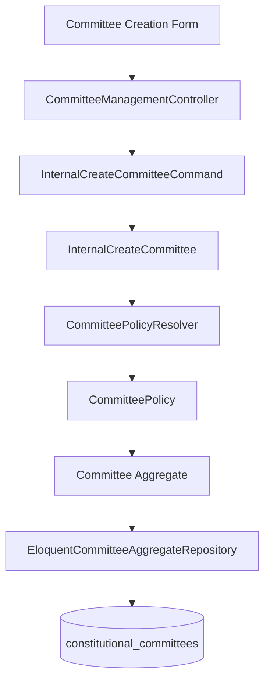
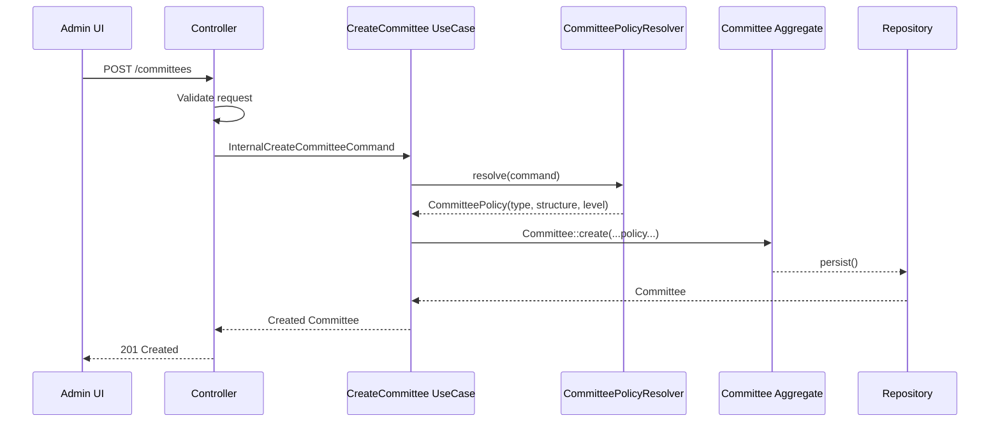
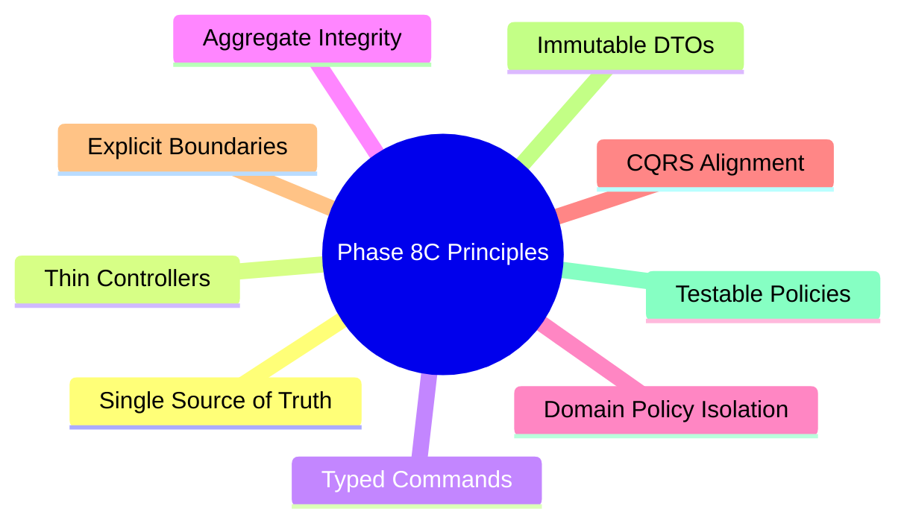

## ✅ **ChatGPT's Critique is Valid - The Plan Has Issues**

After reviewing both Claude's plan and ChatGPT's critique, I **agree with ChatGPT** that the plan needs refinement. Here's my analysis:

---

## 🎯 **What's Right in Claude's Plan (Keep)**

| Aspect | Why Keep |
|--------|----------|
| Fix hardcoded `CommitteeType::central()` | ✅ Critical bug fix |
| Typed DTO instead of raw array | ✅ Type safety, aligns with Phase 8B |
| Thin controller | ✅ Removes bloat |
| TDD approach | ✅ Proven methodology |

---

## ❌ **What's Wrong (Per ChatGPT, I Agree)**

### 1. **Too Many Layers for Simple Decision**
```
❌ CommitteeTypeInferrer
❌ CommitteeStructureRegistry  
❌ Controller resolveLevelIndex()
❌ Multiple mapping layers
```

**Problem**: Building a "mini decision engine" for deterministic mapping.

**Fix**: Single `CommitteePolicyResolver` service.

### 2. **Controller Still Does Domain Logic**
```php
private function resolveLevelIndex(string $committeeType): int
```
🚨 **DDD Violation** - Controller shouldn't know level→structure mapping.

**Fix**: Move this into the policy resolver.

### 3. **String-Based Inference is Fragile**
```php
match ($level->code) {
    'youth_wing' => CommitteeType::youthWing(),
}
```
**Problem**: No compiler safety, refactoring risk.

**Fix**: Use enums or config-driven mapping.

### 4. **Duplicate Sources of Truth**
- CommitteeType (inferred)
- CommitteeStructure (derived from type)
- levelIndex (mapped in controller)

**Risk**: Domain drift when these disagree.

**Fix**: Single `CommitteePolicy` object with all three.

---

## ✅ **The Correct Architecture (Per ChatGPT)**

```mermaid
flowchart TD
    UI[Controller - Thin]
    DTO[InternalCreateCommitteeCommand]
    
    UI --> DTO --> USECASE[InternalCreateCommittee]
    
    USECASE --> POLICY[CommitteePolicyResolver - Single Service]
    
    POLICY --> TYPE[CommitteeType]
    POLICY --> STRUCT[CommitteeStructure]  
    POLICY --> LEVEL[CommitteeLevel]
    
    USECASE --> AGG[Committee::create(policy)]
```

### Single Service, One Decision Point:

```php
final readonly class CommitteePolicy
{
    public function __construct(
        public CommitteeType $type,
        public CommitteeStructure $structure,
        public CommitteeLevel $level,
    ) {}
}

final class CommitteePolicyResolver
{
    public function resolve(InternalCreateCommitteeCommand $cmd): CommitteePolicy
    {
        // Single source of truth for all mapping decisions
        $level = $this->getLevelFromIndex($cmd->levelIndex);
        $type = $this->inferType($level, $cmd);
        $structure = $this->getStructureForType($type);
        
        return new CommitteePolicy($type, $structure, $level);
    }
}
```

---

## 📊 **Comparison: Claude vs ChatGPT**

| Aspect | Claude's Plan | ChatGPT's Suggestion |
|--------|--------------|---------------------|
| Decision points | Multiple (inferrer, controller, registry) | Single (PolicyResolver) |
| Controller logic | resolveLevelIndex() in controller | No domain logic in controller |
| Type mapping | String matching on code | Enum or config-driven |
| Output | Scattered | Single CommitteePolicy object |
| Testability | Multiple test files | One test file for resolver |

---

## 🚀 **My Recommendation**

### ✅ **Proceed with Phase 8C, but with these modifications:**

1. **Replace multi-component design with single `CommitteePolicyResolver`**
2. **Remove `resolveLevelIndex()` from controller** - move to resolver
3. **Use enum for level codes** (if possible) instead of string matching
4. **Return single `CommitteePolicy` object** from resolver
5. **Update `Committee::create()` to accept `CommitteePolicy`** instead of multiple params

### Simplified File Structure:
```
CREATE: app/Contexts/Membership/Domain/Committee/CommitteePolicyResolver.php
CREATE: app/Contexts/Membership/Domain/Committee/CommitteePolicy.php (DTO)
CREATE: app/Contexts/Membership/Application/Committee/DTOs/InternalCreateCommitteeCommand.php
MODIFY: app/Contexts/Membership/Domain/Committee/Committee.php (accept CommitteePolicy)
MODIFY: app/Contexts/Membership/Application/Committee/InternalCreateCommittee.php (use resolver)
MODIFY: app/Http/Controllers/Committee/CommitteeManagementController.php (thin, no domain logic)
```

---

## ✅ **Final Verdict**

**Reject Claude's plan as written** - it's over-engineered with fragmented decision logic.

**Approve a simplified plan** with:
- Single `CommitteePolicyResolver`
- No controller domain logic
- One `CommitteePolicy` DTO output


# 🏗️ Phase 8C — Committee Creation Architecture Refactor (Execution-Ready Plan)

## Context

Phase 8B established a proper CQRS-read architecture for Geography and Governance projections.

Phase 8C now refactors the **committee creation write flow** to eliminate a critical domain bug and align committee creation with proper DDD boundaries.

---

# 🚨 Critical Domain Bug

Current implementation:

```php
Committee::create(...)
```

internally hardcodes:

```php
CommitteeType::central()
```

Result:

* Every committee is persisted as `central`
* Province/district/ward committees lose semantic identity
* Governance hierarchy becomes inconsistent
* Future election/authority delegation becomes invalid

This must be corrected before Phase 8D/9/10 continue.

---

# 🎯 Refactoring Goals

## This Refactor IS

✅ Remove hardcoded committee type
✅ Introduce typed application command DTO
✅ Centralize committee classification logic
✅ Thin controller
✅ Preserve aggregate integrity
✅ Single source of truth for committee policy decisions
✅ Align with existing CQRS/DDD architecture patterns

---

## This Refactor IS NOT

❌ New database schema
❌ GeoUnit FK migration
❌ Full committee read-side rewrite
❌ Frontend redesign
❌ Removing deprecated GeoReference classes yet

---

# 🧠 Core Architectural Decision

## Replace fragmented inference logic with ONE policy authority

Instead of:

* controller mapping
* inferrer class
* structure registry
* scattered type logic

Use:

# ✅ `CommitteePolicyResolver`

A single application-domain policy service responsible for:

* resolving committee type
* resolving committee structure
* resolving governance level

from the incoming command.

---

# 🏛️ Final Architecture



---

# 🧱 Domain Decision Flow



---

# 🧩 Implementation Plan

---

# Step 1 — Create Typed Command DTO

## CREATE

```text
app/Contexts/Membership/Application/Committee/DTOs/InternalCreateCommitteeCommand.php
```

## Purpose

Replace raw arrays with explicit immutable command object.

## Structure

```php
final readonly class InternalCreateCommitteeCommand
{
    public function __construct(
        public TenantId $tenantId,
        public string $committeeCode,
        public string $committeeName,
        public string $committeeCategory,
        public ?string $countryCode,
        public ?string $regionCode,
        public ?string $geoReference,
    ) {}
}
```

---

# Step 2 — Create CommitteePolicy Value Object

## CREATE

```text
app/Contexts/Membership/Domain/Committee/ValueObjects/CommitteePolicy.php
```

## Purpose

Encapsulates resolved committee semantics.

## Structure

```php
final readonly class CommitteePolicy
{
    public function __construct(
        public CommitteeType $type,
        public CommitteeStructure $structure,
        public CommitteeLevel $level,
    ) {}
}
```

---

# Step 3 — Create CommitteePolicyResolver

## CREATE

```text
app/Contexts/Membership/Domain/Committee/Services/CommitteePolicyResolver.php
```

---

## Responsibility

ONLY authority for:

* committee type
* governance level
* committee structure

resolution.

---

## Rules

### Central committee

```text
levelIndex = 1
geoPolicy = NONE
→ CommitteeType::central()
```

---

### Geographic committee

```text
geoPolicy = REQUIRED|OPTIONAL
→ CommitteeType::geographic()
```

---

### Wings

```text
committeeCategory:
- youth
- women
- student
→ corresponding wing type
```

---

## Interface

```php
final class CommitteePolicyResolver
{
    public function resolve(
        CommitteeStructure $structure,
        InternalCreateCommitteeCommand $command
    ): CommitteePolicy
}
```

---

# Step 4 — Refactor Committee Aggregate

## MODIFY

```text
app/Contexts/Membership/Domain/Committee/Committee.php
```

---

## Change

Remove:

```php
CommitteeType::central()
```

Remove:

```php
new CentralCommitteeStructure()
```

---

## Replace With

```php
CommitteePolicy $policy
```

---

## New Signature

```php
public static function create(
    CommitteeId $id,
    TenantId $tenantId,
    CommitteePolicy $policy,
    ...
): self
```

---

## Aggregate Responsibility

The aggregate should:

✅ enforce invariants
✅ validate state transitions
✅ emit domain events

The aggregate should NOT:

❌ infer governance classification rules

---

# Step 5 — Refactor CreateCommitteeUseCase

## MODIFY

```text
app/Contexts/Membership/Application/Committee/CreateCommitteeUseCase.php
```

---

## New Signature

```php
public function execute(
    InternalCreateCommitteeCommand $command
): Committee;
```

---

# Step 6 — Refactor InternalCreateCommittee

## MODIFY

```text
app/Contexts/Membership/Application/Committee/InternalCreateCommittee.php
```

---

## Responsibilities

### BEFORE

* raw arrays
* type inference
* direct structure handling

---

### AFTER

1. load governance structure
2. call `CommitteePolicyResolver`
3. create aggregate
4. persist aggregate

---

## Flow

```php
$policy = $resolver->resolve($structure, $command);

Committee::create(
    ...
    policy: $policy,
);
```

---

# Step 7 — Simplify Controller

## MODIFY

```text
app/Http/Controllers/Committee/CommitteeManagementController.php
```

---

# Controller Responsibilities ONLY

✅ request validation
✅ DTO creation
✅ use case execution
✅ response formatting

---

# REMOVE from controller

❌ level mapping
❌ type inference
❌ structure inference
❌ geo policy decisions

---

# GOOD Controller


---

# Step 8 — GeoReference Boundary Cleanup

## MODIFY

Use canonical:

```text
Geography\Domain\ValueObjects\GeoReference
```

inside application layer.

---

## DO NOT REMOVE deprecated class yet

Mark for later deprecation cycle.

---

# Step 9 — Update Tests

---

# CREATE

## CommitteePolicyResolverTest

```text
tests/Unit/Contexts/Membership/Domain/Committee/CommitteePolicyResolverTest.php
```

---

## Test Cases

| Scenario         | Expected        |
| ---------------- | --------------- |
| central level    | central type    |
| province level   | geographic type |
| district level   | geographic type |
| youth committee  | youth wing      |
| women committee  | women wing      |
| invalid category | exception       |

---

# MODIFY

## Committee Aggregate Tests

Update all `Committee::create()` calls.

---

# MODIFY

## Use Case Tests

Replace raw arrays with DTOs.

---

# MODIFY

## Feature Tests

Assert persisted type correctness.

Example:

```php
$this->assertEquals(
    'geographic',
    $committee->type
);
```

---

# 📁 Final File Plan

| Action | File                               | Purpose                           |
| ------ | ---------------------------------- | --------------------------------- |
| CREATE | InternalCreateCommitteeCommand.php | Typed application command         |
| CREATE | CommitteePolicy.php                | Encapsulated governance semantics |
| CREATE | CommitteePolicyResolver.php        | Single policy authority           |
| MODIFY | Committee.php                      | Remove hardcoded type             |
| MODIFY | CreateCommitteeUseCase.php         | Typed command signature           |
| MODIFY | InternalCreateCommittee.php        | Use resolver                      |
| MODIFY | TransactionalCreateCommittee.php   | Signature alignment               |
| MODIFY | CommitteeManagementController.php  | Thin controller                   |
| MODIFY | Committee tests                    | Update aggregate creation         |
| CREATE | CommitteePolicyResolverTest.php    | Policy resolution tests           |
| MODIFY | Feature tests                      | Assert correct persisted type     |

---

# 🧪 Verification Plan

---

## Unit Tests

```bash
php artisan test tests/Unit/Contexts/Membership/Domain/Committee/
```

---

## Application Tests

```bash
php artisan test tests/Unit/Contexts/Membership/Application/
```

---

## Feature Tests

```bash
php artisan test tests/Feature/Committee/
```

---

## Full Regression

```bash
php artisan test tests/
```

---

## Frontend Build

```bash
npm run build
```

---

# ✅ Expected Outcome

After refactoring:

✅ No hardcoded committee types
✅ Single source of truth for governance classification
✅ Thin controllers
✅ Strongly typed application boundary
✅ Aggregate focused on invariants only
✅ Future-ready for elections/delegation
✅ Consistent with Phase 8B CQRS architecture

---

# 🧠 Architectural Principles Enforced


