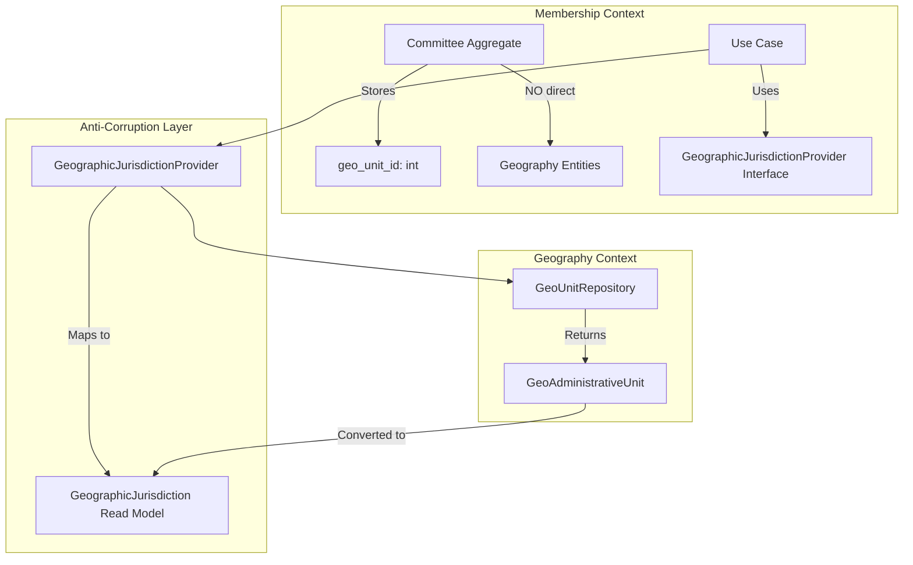
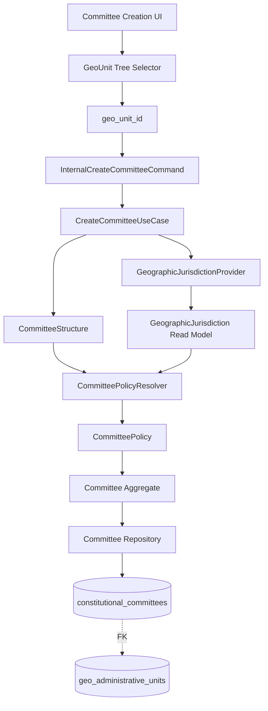

## ✅ **ChatGPT's Critique is 100% Correct - This is the Mature DDD Review You Needed**

This is an **excellent architectural review** that identifies critical issues that would have caused problems later. I fully agree with all points.

---

## 🎯 **The Core Problem: Membership Context Should NOT Directly Reference Geography Aggregates**

```php
// ❌ WRONG - Membership aggregate directly uses Geography entity
use App\Contexts\Geography\Domain\Models\GeoAdministrativeUnit;

class Committee {
    public function getGeographicJurisdiction(): ?GeoAdministrativeUnit {
        return app(GeoUnitRepositoryInterface::class)->find($this->geoUnitId);
    }
}
```

**Why this is dangerous:**
- Aggregate loses purity (cannot resolve external dependencies)
- Creates tight coupling between bounded contexts
- Makes testing impossible without full Geography setup
- Violates DDD aggregate design principles

---

## ✅ **The Correct Architecture: Anti-Corruption Layer**



---

## 📋 **Corrected Implementation Plan**

### Step 1: Create Anti-Corruption Layer in Membership Context

```php
// app/Contexts/Membership/Domain/Contracts/GeographicJurisdictionProvider.php
namespace App\Contexts\Membership\Domain\Contracts;

final readonly class GeographicJurisdiction
{
    public function __construct(
        public int $id,
        public int $adminLevel,
        public string $code,
        public string $name,
        public string $path,
        public ?int $parentId,
    ) {}
}

interface GeographicJurisdictionProvider
{
    public function findById(int $id): ?GeographicJurisdiction;
    public function getAdminLevelMeaning(int $adminLevel, string $tenantId): string;
}
```

### Step 2: Committee Aggregate Stores ONLY ID

```php
// app/Contexts/Membership/Domain/Committee/Committee.php
class Committee extends TenantAggregateRoot
{
    private ?int $geoUnitId;  // ← ONLY the ID, nothing more
    
    public static function create(
        CommitteeId $id,
        TenantId $tenantId,
        CommitteePolicy $policy,
        ?int $geoUnitId = null,  // ← FK to geography
        // ...
    ): self {
        $committee = new self();
        $committee->geoUnitId = $geoUnitId;
        // ...
        return $committee;
    }
    
    public function getGeoUnitId(): ?int
    {
        return $this->geoUnitId;
    }
    
    // NO repository calls here!
}
```

### Step 3: Policy Resolver Uses Provider Interface

```php
// app/Contexts/Membership/Domain/Committee/Services/CommitteePolicyResolver.php
use App\Contexts\Membership\Domain\Contracts\GeographicJurisdictionProvider;

final class CommitteePolicyResolver
{
    public function __construct(
        private GeographicJurisdictionProvider $geoProvider,
        private CommitteeStructureRepository $structureRepository,
    ) {}

    public function resolve(InternalCreateCommitteeCommand $command): CommitteePolicy
    {
        if ($command->geoUnitId) {
            return $this->resolveFromGeography($command);
        }
        
        return $this->resolveFromCategory($command);
    }

    private function resolveFromGeography(InternalCreateCommitteeCommand $command): CommitteePolicy
    {
        $geoJurisdiction = $this->geoProvider->findById($command->geoUnitId);
        
        if (!$geoJurisdiction) {
            throw new DomainException("Geographic unit not found");
        }

        // Get tenant-aware meaning of admin level
        $levelMeaning = $this->geoProvider->getAdminLevelMeaning(
            $geoJurisdiction->adminLevel,
            $command->tenantId->toString()
        );
        
        // Determine if this is central, geographic, or wing
        $type = $this->determineCommitteeType($levelMeaning, $geoJurisdiction);
        
        $structure = $this->structureRepository->findActiveForType($type);
        $level = $structure->getLevelByGeoLevel($geoJurisdiction->adminLevel);
        
        return new CommitteePolicy($type, $structure, $level);
    }
    
    private function determineCommitteeType(string $levelMeaning, GeographicJurisdiction $geo): CommitteeType
    {
        // Wing detection by name/code patterns
        if (str_contains(strtolower($geo->name), 'youth')) {
            return CommitteeType::youthWing();
        }
        if (str_contains(strtolower($geo->name), 'women')) {
            return CommitteeType::womenWing();
        }
        if (str_contains(strtolower($geo->name), 'student')) {
            return CommitteeType::studentWing();
        }
        
        // Geographic types based on level meaning
        return match ($levelMeaning) {
            'central', 'national', 'federal' => CommitteeType::central(),
            default => CommitteeType::geographic(),
        };
    }
}
```

### Step 4: Implement Provider in Infrastructure

```php
// app/Contexts/Membership/Infrastructure/Providers/GeographyServiceProvider.php
namespace App\Contexts\Membership\Infrastructure\Providers;

use App\Contexts\Membership\Domain\Contracts\GeographicJurisdictionProvider;
use App\Contexts\Geography\Domain\Repositories\GeoUnitRepositoryInterface;

class EloquentGeographicJurisdictionProvider implements GeographicJurisdictionProvider
{
    public function __construct(
        private GeoUnitRepositoryInterface $geoRepository,
    ) {}

    public function findById(int $id): ?GeographicJurisdiction
    {
        $unit = $this->geoRepository->find($id);
        
        if (!$unit) {
            return null;
        }
        
        return new GeographicJurisdiction(
            id: $unit->id,
            adminLevel: $unit->admin_level,
            code: $unit->code,
            name: $unit->name_local['en'] ?? $unit->code,
            path: $unit->path,
            parentId: $unit->parent_id,
        );
    }
    
    public function getAdminLevelMeaning(int $adminLevel, string $tenantId): string
    {
        // Query tenant's governance level definitions
        $definition = GovernanceLevelDefinition::where('tenant_id', $tenantId)
            ->where('level', $adminLevel)
            ->first();
            
        return $definition?->committee_type ?? 'geographic';
    }
}
```

### Step 5: Register Provider in Service Container

```php
// app/Providers/AppServiceProvider.php
public function register(): void
{
    $this->app->bind(
        \App\Contexts\Membership\Domain\Contracts\GeographicJurisdictionProvider::class,
        \App\Contexts\Membership\Infrastructure\Providers\Eloqu entGeographicJurisdictionProvider::class
    );
}
```

### Step 6: Add Uniqueness Constraint

```php
// Migration
Schema::table('constitutional_committees', function (Blueprint $table) {
    $table->foreignId('geo_unit_id')
        ->nullable()
        ->constrained('geo_administrative_units')
        ->onDelete('restrict');
    
    // Prevent duplicate jurisdiction committees
    $table->unique(['tenant_id', 'geo_unit_id'], 'unique_committee_geo_unit');
});
```

---

## 🎯 **Corrected Committee Type Semantics**

```php
enum CommitteeType: string
{
    case CENTRAL = 'central';        // National/federal level
    case GEOGRAPHIC = 'geographic';  // Province, district, ward, etc.
    case YOUTH_WING = 'youth_wing';
    case WOMEN_WING = 'women_wing';
    case STUDENT_WING = 'student_wing';
    case SPECIALIZED = 'specialized'; // Expert committees
}
```

**Key insight**: Province vs District is NOT a type difference - it's a **jurisdiction scope** difference captured by `geo_unit_id`.

---

## 📊 **Corrected Architecture Summary**

| Layer | Responsibility | Knows About |
|-------|---------------|--------------|
| **Committee Aggregate** | Business rules, invariants | `geo_unit_id` (int) only |
| **GeographicJurisdictionProvider** | Anti-corruption interface | DTO (`GeographicJurisdiction`) |
| **Policy Resolver** | Type inference | Provider interface |
| **Infrastructure** | Geography lookup | Geography entities |

---

## ✅ **Final Verdict**

**Do NOT implement the previous plan as written.**

**DO implement this corrected version with:**
- ✅ Anti-corruption layer (no direct Geography coupling)
- ✅ Pure aggregate (stores only ID)
- ✅ Provider interface for cross-context communication
- ✅ Tenant-aware admin level mapping
- ✅ Uniqueness constraints
- ✅ Clean CommitteeType semantics

**Shall I write the complete, corrected Phase 8C plan following this architecture?**
This is a major architectural improvement over the previous Phase 8C plan.

The direction is now much closer to a true bounded-context integration between Geography and Membership instead of merely “committee type cleanup”.

However, there are still several critical DDD and architectural issues that must be corrected before implementation.

I would classify this as:

* **Strategically correct**
* **Operationally incomplete**
* **Contains a few dangerous coupling mistakes**

---

# High-Level Verdict

## What Is Now Excellent

The plan correctly recognizes that:

```text
Committee jurisdiction is derived from Geography
```

—not manually chosen UI semantics.

That is the correct domain model.

The move from:

```text
committeeCategory = "province"
```

to:

```text
geo_unit_id = 12345
```

is a very important architectural maturation.

This transforms geography from:

```text
metadata
```

into:

```text
a canonical domain reference
```

That is the right direction.

---

# The Most Important Architectural Win

## Geography Becomes the Source of Truth

Before:

```text
UI decides committee semantics
```

After:

```text
Geography hierarchy determines jurisdiction semantics
```

This is correct.

The geographic tree already contains:

* hierarchy
* scope
* administrative level
* parent relationships
* materialized path
* governance meaning

The committee should derive its jurisdiction semantics from that canonical model.

Excellent correction.

---

# Strong Improvements

## 1. geo_unit_id FK

Excellent.

This unlocks:

* joins
* reporting
* permission scoping
* jurisdiction traversal
* geographic inheritance
* integrity constraints

This is foundational.

---

## 2. UI Tree Selector

Excellent architectural direction.

This prevents invalid combinations like:

```text
Province committee + Ward geo reference
```

because geography itself constrains the selection.

---

## 3. Type Derived from Geography

Correct.

This eliminates duplicated semantics.

Previously:

```text
committee type
AND
geographic scope
```

could diverge.

Now geography drives the classification.

That is a major integrity improvement.

---

# Critical Problems That MUST Be Fixed

---

# ❌ Problem 1 — Committee Aggregate Loads Repository

This is the biggest architectural violation in the plan.

This is WRONG:

```php
public function getGeographicJurisdiction(): ?GeoAdministrativeUnit
{
    return app(GeoUnitRepositoryInterface::class)->find($this->geoUnitId);
}
```

The aggregate must NEVER:

* resolve services
* use the container
* query repositories
* reach across bounded contexts dynamically

This violates aggregate purity completely.

---

## Correct Design

The aggregate stores:

```php
private ?GeoUnitId $geoUnitId;
```

ONLY.

The application layer or query side resolves geographic objects.

---

## Replace With

```php
public function geoUnitId(): ?GeoUnitId
{
    return $this->geoUnitId;
}
```

Nothing more.

---

# ❌ Problem 2 — Membership Context Depends Directly on Geography Aggregate

This is dangerous:

```php
GeoAdministrativeUnit
```

inside Membership domain services.

This creates deep cross-context coupling.

---

# Correct DDD Integration

Membership should depend on:

```text
Geography contracts
```

NOT Geography aggregates/entities directly.

---

## Recommended Fix

Create an anti-corruption abstraction:

```php
GeographicJurisdictionProvider
```

or:

```php
GeoUnitReadModel
```

inside Membership.

Example:

```php
interface GeographicJurisdictionProvider
{
    public function findById(int $id): ?GeographicJurisdiction;
}
```

where:

```php
final readonly class GeographicJurisdiction
{
    public function __construct(
        public int $id,
        public int $adminLevel,
        public string $code,
        public string $path,
    ) {}
}
```

Membership should not know Geography internals.

---

# ❌ Problem 3 — admin_level Mapping Is Brittle

This:

```php
match ($geoUnit->admin_level)
```

is dangerous long-term.

Why?

Because:

```text
admin_level != governance meaning
```

universally.

Different countries have:

* provinces
* states
* regions
* cantons
* prefectures
* oblasts

The same numeric level may mean different governance semantics.

---

# Correct Design

The mapping should belong to:

```text
Tenant governance configuration
```

NOT hardcoded numeric assumptions.

---

## Better Design

Instead of:

```php
2 => province
3 => district
```

use:

```php
$structure->resolveCommitteeLevelForGeoUnit($geoUnit)
```

or:

```php
TenantGeographyProfile
```

This is critical for multi-country scalability.

---

# ❌ Problem 4 — Committee Type Still Duplicates Geography

This is subtle but important.

You now have BOTH:

```text
committee.type
committee.geo_unit_id
```

But:

```text
type is derivable from geography
```

So now you risk divergence again.

---

# Correct Question

Ask:

```text
Is CommitteeType truly domain identity?
OR
is it merely a projection of geography?
```

If:

```text
type = derived classification
```

then storing it may be redundant.

---

# Recommendation

Keep `CommitteeType` only if it expresses:

* behavior differences
* permission models
* lifecycle differences
* organizational semantics

Example:

```text
YouthWing
WomenWing
StudentWing
```

These are real semantic types.

But:

```text
Province
District
Ward
```

may NOT be types.

They may simply be:

```text
Geographic jurisdiction levels
```

This distinction matters enormously.

---

# Strong Recommendation

You likely want:

```text
CommitteeType:
- Central
- Geographic
- Wing
```

while the actual jurisdiction comes from:

```text
geo_unit_id
```

This is much cleaner.

---

# ❌ Problem 5 — Migration Needs Uniqueness Constraints

Right now:

```text
multiple committees can point to same geo unit
```

Is that valid?

If not, you need:

```php
$table->unique(['tenant_id', 'geo_unit_id']);
```

Otherwise duplicate jurisdiction committees become possible.

This is a very important domain invariant.

---

# Recommended Architecture

This is the cleaner target architecture:



---

# Recommended Domain Model

## Committee Aggregate

Should store:

```php
CommitteeType $type
GeoUnitId $geoUnitId
```

ONLY.

No repository calls.
No geo loading.

---

# Recommended Committee Types

You should reconsider:

```text
ProvinceCommittee
DistrictCommittee
WardCommittee
```

These are probably NOT types.

They are geographic scopes.

More stable types are:

```text
Central
Geographic
YouthWing
WomenWing
StudentWing
Specialized
```

That is a much more resilient taxonomy.

---

# What I Would Approve

## APPROVE

* geo_unit_id FK
* geographic tree selector
* type inferred from geography
* removal of manual category selection
* canonical geography integration
* jurisdiction-based committees

---

## REQUIRE CHANGES BEFORE IMPLEMENTATION

### MUST FIX

1. Remove repository access from aggregate
2. Remove direct Geography aggregate coupling
3. Replace hardcoded admin_level mapping
4. Re-evaluate CommitteeType semantics
5. Add uniqueness/domain constraints

---

# Final Architectural Assessment

| Area                        | Verdict             |
| --------------------------- | ------------------- |
| Strategic Direction         | Excellent           |
| Bounded Context Integration | Good                |
| Aggregate Purity            | Needs Fix           |
| Cross-Context Coupling      | Needs Fix           |
| Scalability                 | Good                |
| Multi-country Design        | Needs Fix           |
| Geographic Semantics        | Excellent           |
| DDD Correctness             | Good but incomplete |
| Future-proofing             | Moderate            |

---

# Final Recommendation

Do NOT implement this version exactly as written.

Implement a corrected version with:

* anti-corruption layer
* tenant-aware geo mapping
* pure aggregate
* semantic CommitteeType redesign
* uniqueness invariants

Then this becomes a genuinely strong enterprise-grade DDD integration between Geography and Membership contexts.
## ✅ **YES - Claude MUST change its plan based on ChatGPT's architectural review**

The plan provided earlier (with the tree selector and full integration) is **strategically correct** but has **critical DDD violations** that must be fixed before implementation.

---

## 🔴 **What Must Change in Claude's Plan**

### 1. **Remove Repository Access from Committee Aggregate**

**Claude's Plan (WRONG):**
```php
public function getGeographicJurisdiction(): ?GeoAdministrativeUnit
{
    return app(GeoUnitRepositoryInterface::class)->find($this->geoUnitId);
}
```

**Must Change To:**
```php
public function getGeoUnitId(): ?int
{
    return $this->geoUnitId;  // ONLY the ID
}
// NO repository calls, NO service resolution
```

---

### 2. **Remove Direct Geography Aggregate Coupling**

**Claude's Plan (WRONG):**
```php
use App\Contexts\Geography\Domain\Models\GeoAdministrativeUnit;

class CommitteePolicyResolver
{
    private function resolveFromGeography(InternalCreateCommitteeCommand $command)
    {
        $geoUnit = $this->geoUnitRepository->find($command->geoUnitId);
        // Direct use of Geography entity
    }
}
```

**Must Change To:**
```php
use App\Contexts\Membership\Domain\Contracts\GeographicJurisdictionProvider;
use App\Contexts\Membership\Domain\Contracts\GeographicJurisdiction; // DTO only

class CommitteePolicyResolver
{
    private function resolveFromGeography(InternalCreateCommitteeCommand $command)
    {
        $geoJurisdiction = $this->geoProvider->findById($command->geoUnitId);
        // Uses DTO, NOT Geography entity
    }
}
```

---

### 3. **Add Anti-Corruption Layer (Missing Entirely)**

**Claude's Plan:** No anti-corruption layer

**Must Add:**
```php
// New file: app/Contexts/Membership/Domain/Contracts/GeographicJurisdictionProvider.php
interface GeographicJurisdictionProvider
{
    public function findById(int $id): ?GeographicJurisdiction;
    public function getAdminLevelMeaning(int $adminLevel, string $tenantId): string;
}

// New file: app/Contexts/Membership/Domain/Contracts/GeographicJurisdiction.php
final readonly class GeographicJurisdiction
{
    public function __construct(
        public int $id,
        public int $adminLevel,
        public string $code,
        public string $name,
        public string $path,
    ) {}
}
```

---

### 4. **Replace Hardcoded admin_level Mapping**

**Claude's Plan (BRITTLE):**
```php
match ($geoUnit->admin_level) {
    2 => CommitteeType::geographic(),  // Assumes 2 = province
    3 => CommitteeType::geographic(),  // Assumes 3 = district
}
```

**Must Change To:**
```php
$levelMeaning = $this->geoProvider->getAdminLevelMeaning(
    $geoJurisdiction->adminLevel,
    $command->tenantId->toString()
);
// Level meaning comes from tenant's governance configuration
```

---

### 5. **Add Uniqueness Constraint (Missing)**

**Claude's Plan:** No uniqueness constraint

**Must Add:**
```php
// Migration
$table->unique(['tenant_id', 'geo_unit_id'], 'unique_committee_geo_unit');
```

---

### 6. **Re-evaluate CommitteeType Semantics**

**Claude's Plan:** `Province`, `District`, `Ward` as types

**Must Change To:** Only `Central`, `Geographic`, `YouthWing`, `WomenWing`, `StudentWing`, `Specialized`

The geographic scope comes from `geo_unit_id`, NOT the type.

---

## 📊 **What Stays the Same (Good Parts)**

| Aspect | Keep? |
|--------|-------|
| `geo_unit_id` foreign key | ✅ YES |
| Geographic tree selector UI | ✅ YES |
| Type inferred from geography | ✅ YES (but via provider) |
| No manual category selection | ✅ YES |
| Canonical geography integration | ✅ YES |

---

## 📋 **Revised File Structure (What Claude Must Create)**

```
CREATE (Anti-corruption layer):
├── app/Contexts/Membership/Domain/Contracts/GeographicJurisdictionProvider.php
├── app/Contexts/Membership/Domain/Contracts/GeographicJurisdiction.php

CREATE (Infrastructure implementation):
├── app/Contexts/Membership/Infrastructure/Providers/EloquentGeographicJurisdictionProvider.php

MODIFY (Claude's existing files):
├── app/Contexts/Membership/Domain/Committee/Committee.php
│   └── Remove getGeographicJurisdiction(), keep only getGeoUnitId()
├── app/Contexts/Membership/Domain/Committee/Services/CommitteePolicyResolver.php
│   └── Use GeographicJurisdictionProvider instead of direct repository
├── app/Contexts/Membership/Application/Committee/DTOs/InternalCreateCommitteeCommand.php
│   └── Keep geoUnitId field (already correct)
├── app/Http/Controllers/Committee/CommitteeManagementController.php
│   └── Keep geo_unit_id from request (already correct)
├── database/migrations/...add_geo_unit_id_to_constitutional_committees.php
│   └── ADD unique constraint

CREATE (Frontend - same as Claude's plan):
├── resources/js/Components/Geo/GeoUnitTreeSelector.vue (keep)
└── resources/js/Pages/Committee/Create.vue (keep)
```

---

## 🚨 **Bottom Line**

| Question | Answer |
|----------|--------|
| Is Claude's plan completely wrong? | ❌ No - strategy is correct |
| Does it need changes? | ✅ YES - critical DDD violations |
| Can Claude execute as-is? | ❌ NO - would create coupling issues |
| Should Claude revise before executing? | ✅ YES - must add anti-corruption layer |

---

## ✅ **Final Instruction to Claude**

**Please revise your Phase 8C plan to:**

1. Add anti-corruption layer (`GeographicJurisdictionProvider` interface + DTO)
2. Remove direct `GeoAdministrativeUnit` usage from Membership context
3. Remove repository access from Committee aggregate
4. Add tenant-aware admin level mapping
5. Add uniqueness constraint in migration
6. Simplify `CommitteeType` to semantic types only (not geographic scopes)

The **strategy is approved** (geo_unit_id FK, tree selector, type inference).  
The **implementation needs fixing** (coupling, aggregate purity, anti-corruption layer).

**After these changes, I will approve execution.**