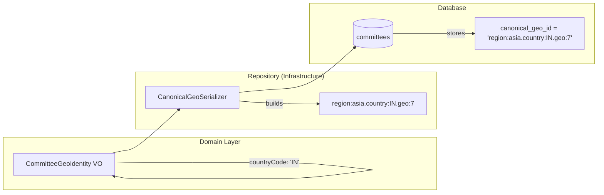
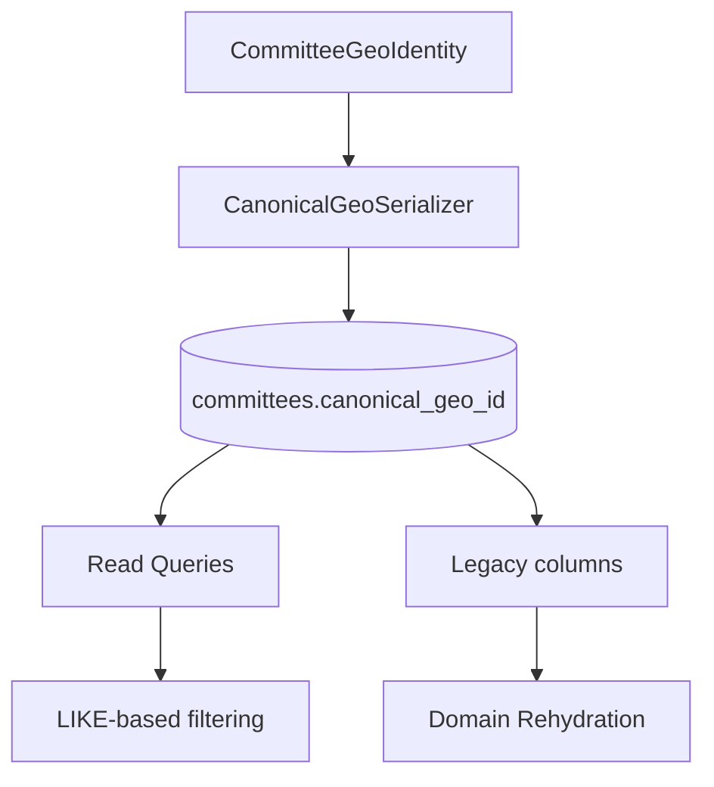

## 🎯 **8C.2E - Canonical String Serialization**

This is the **final piece** of Phase 8C that I deferred. It's about how the geographic identity is **stored in the database**.

---

## 🔍 **The Problem 8C.2E Solves**

### Current State (After 8C.2C)

```php
// Committee Aggregate stores:
private ?CommitteeGeoIdentity $geoIdentity;  // VO with: geoUnitId, adminLevel, regionCode, countryCode

// Database has:
geo_unit_id (FK to geo_administrative_units)
region_code (string, nullable)
country_code (string, nullable)

// But NO column for the complete geo identity
```

**Question**: How do we query "find all committees in Asia" efficiently?

Currently, you'd need to:
1. Query all committees with `geo_unit_id`
2. Join to `geo_administrative_units` (inefficient)
3. Traverse materialized paths

**Solution**: Store a **canonical string** that contains the full geographic path.

---

## 📋 **What Is the Canonical String?**

A **serialized representation** of the committee's complete geographic identity.

### Format
```
region:{region}.country:{country}.geo:{id1}.geo:{id2}
```

### Examples

| Location | Canonical String |
|----------|------------------|
| Asia, India, Province 3 | `region:asia.country:IN.geo:3` |
| Europe, Germany | `region:europe.country:DE` |
| Nepal, Province 1, District 12 | `region:asia.country:NP.geo:1.geo:12` |
| World (Central committee) | `null` |

---

## 🗂️ **Database Migration**

```php
// 2026_05_13_000003_add_canonical_geo_id_to_committees.php
Schema::table('committees', function (Blueprint $table) {
    $table->string('canonical_geo_id', 500)->nullable()->after('geo_unit_id');
    $table->index('canonical_geo_id', 'idx_committees_canonical_geo');
});
```

---

## 🔄 **Serialization Flow**



---

## 💻 **Implementation**

### 1. Create Serializer Service

```php
// Infrastructure/Services/CanonicalGeoSerializer.php
namespace App\Contexts\Membership\Infrastructure\Services;

use App\Contexts\Membership\Domain\Committee\ValueObjects\CommitteeGeoIdentity;

final class CanonicalGeoSerializer
{
    public function serialize(?CommitteeGeoIdentity $identity): ?string
    {
        if ($identity === null) {
            return null;
        }
        
        $parts = [];
        
        if ($identity->regionCode) {
            $parts[] = "region:{$identity->regionCode}";
        }
        if ($identity->countryCode) {
            $parts[] = "country:{$identity->countryCode}";
        }
        
        // Add the direct geo unit (deepest)
        $parts[] = "geo:{$identity->geoUnitId}";
        
        return implode('.', $parts);
    }
    
    public function deserialize(?string $string): ?CommitteeGeoIdentity
    {
        if ($string === null) {
            return null;
        }
        
        // Parse "region:asia.country:IN.geo:7"
        $parts = explode('.', $string);
        
        $region = null;
        $country = null;
        $geoUnitId = null;
        
        foreach ($parts as $part) {
            [$key, $value] = explode(':', $part, 2);
            match ($key) {
                'region' => $region = $value,
                'country' => $country = $value,
                'geo' => $geoUnitId = (int) $value,
                default => throw new \RuntimeException("Unknown canonical part: {$key}"),
            };
        }
        
        if ($geoUnitId === null) {
            throw new \RuntimeException("Canonical string missing geo unit: {$string}");
        }
        
        // Reconstruct from geo_unit_id (adminLevel comes from Geography context)
        // This requires a provider call or assumes adminLevel is stored separately
        $provider = app(GeographicJurisdictionProvider::class);
        $jurisdiction = $provider->resolve($geoUnitId);
        
        if ($jurisdiction === null) {
            return null;
        }
        
        return new CommitteeGeoIdentity(
            geoUnitId: $geoUnitId,
            adminLevel: $jurisdiction->adminLevel,
            regionCode: $region ?? $jurisdiction->regionCode,
            countryCode: $country ?? $jurisdiction->countryCode,
        );
    }
}
```

### 2. Update Repository

```php
// EloquentCommitteeAggregateRepository.php
class EloquentCommitteeAggregateRepository implements CommitteeRepositoryInterface
{
    public function __construct(
        private readonly CanonicalGeoSerializer $serializer,
        // ...
    ) {}
    
    private function serialize(Committee $committee): array
    {
        return [
            // ... existing fields
            'canonical_geo_id' => $this->serializer->serialize($committee->getGeoIdentity()),
            'geo_unit_id' => $committee->getGeoUnitId(),
            'region_code' => $committee->getRegionCode(),
            'country_code' => $committee->getCountryCode(),
        ];
    }
    
    private function reconstitute(CommitteeModel $model): Committee
    {
        $canonicalGeoId = $model->canonical_geo_id;
        
        // Try to deserialize, fall back to individual fields
        $geoIdentity = $this->serializer->deserialize($canonicalGeoId);
        
        if ($geoIdentity === null && $model->geo_unit_id) {
            // Legacy path: build from individual fields
            $geoIdentity = new CommitteeGeoIdentity(
                geoUnitId: $model->geo_unit_id,
                adminLevel: $model->admin_level ?? 0, // Need to store this!
                regionCode: $model->region_code,
                countryCode: $model->country_code,
            );
        }
        
        return Committee::reconstruct(
            // ... other params
            geoIdentity: $geoIdentity,
        );
    }
}
```

### 3. Backfill Command

```php
// artisan command: backfill:canonical-geo-ids
class BackfillCanonicalGeoIds extends Command
{
    public function handle()
    {
        CommitteeModel::whereNotNull('geo_unit_id')
            ->chunk(100, function ($committees) {
                foreach ($committees as $committee) {
                    $identity = new CommitteeGeoIdentity(
                        geoUnitId: $committee->geo_unit_id,
                        adminLevel: $committee->admin_level ?? $this->fetchAdminLevel($committee->geo_unit_id),
                        regionCode: $committee->region_code,
                        countryCode: $committee->country_code,
                    );
                    
                    $committee->canonical_geo_id = $this->serializer->serialize($identity);
                    $committee->save();
                }
            });
    }
}
```

---

## ✅ **Benefits of 8C.2E**

| Before | After |
|--------|-------|
| No single column for full geo path | `canonical_geo_id` contains complete hierarchy |
| Need joins to geo_unit table | Can filter by `canonical_geo_id LIKE 'region:asia%'` |
| Slow ancestor queries | Fast string prefix matching |
| Identity stored across 3 columns | Identity stored in 1 column + normalized in 3 |

---

## 📊 **Query Examples with Canonical String**

```sql
-- Find all committees in Asia
SELECT * FROM committees 
WHERE canonical_geo_id LIKE 'region:asia%';

-- Find all committees in India
SELECT * FROM committees 
WHERE canonical_geo_id LIKE '%country:IN%';

-- Find all committees in Province 3
SELECT * FROM committees 
WHERE canonical_geo_id LIKE '%geo:7%';
```

---

## 🚦 **Why I Deferred This**

| Reason | Explanation |
|--------|-------------|
| **Not critical for MVP** | Committee creation works without it |
| **Performance optimization** | Main benefit is query performance |
| **Backfill complexity** | Requires migrating existing data |
| **Can be added later** | No breaking changes |

---

## ✅ **Summary**

| Question | Answer |
|----------|--------|
| **What is it?** | Storing complete geo identity as a string in DB |
| **Why needed?** | Efficient queries by region/country/path |
| **When to do?** | After 8C.2D (optional, performance-focused) |
| **Impact** | Adds column, no behavior change |
| **Priority** | Low (can be done anytime) |

**Should we proceed with 8C.2E now, or move to Phase 8D (Authority Delegation)?**
Here is a **production-grade Claude Code execution prompt for Phase 8C.2E (Canonical String Serialization v2)**. It upgrades your draft into a **safe, backward-compatible, query-optimized, domain-consistent design** aligned with your 8C architecture evolution.

---

# 🚀 Claude Code Execution Prompt — Phase 8C.2E (Canonical Geo Serialization v2)

## 🎯 Objective

Introduce a **canonical, query-optimized string representation** of `CommitteeGeoIdentity` to:

* Enable fast regional/country filtering without joins
* Preserve full backward compatibility with existing geo schema
* Avoid duplication of source-of-truth data (geo remains authoritative in `geo_administrative_units`)
* Provide a **read-optimized projection field** for analytics and filtering

---

# 🧠 Architectural Principles (MANDATORY)

### 1. Geo remains the source of truth

* NEVER treat `canonical_geo_id` as authoritative
* It is a **projection / derived index only**

### 2. No business logic inside serializer

* Serializer is PURE transformation only
* No DB calls inside serializer (important fix vs naive design)

### 3. Deserialization is optional & defensive

* DB → Domain should NOT depend on canonical string
* It is a best-effort reconstruction fallback only

### 4. Backward compatibility is mandatory

* Existing rows must continue working even if `canonical_geo_id` is null

---

# 🗄️ STEP 1 — DATABASE MIGRATION (SAFE PROJECTION FIELD)

```php id="m8c2e_migration"
Schema::table('committees', function (Blueprint $table) {
    $table->string('canonical_geo_id', 750)
        ->nullable()
        ->after('geo_unit_id');

    $table->index('canonical_geo_id', 'idx_committees_canonical_geo');
});
```

### RULES

* MUST be nullable
* MUST NOT replace existing columns
* MUST NOT be required in inserts

---

# 🧪 STEP 2 — TDD: Canonical Serialization

## CREATE TEST FILE

```id="t8c2e_serializer_test"
tests/Unit/Domain/Committee/Infrastructure/CanonicalGeoSerializerTest.php
```

---

## TEST CASES (WRITE FIRST)

### Serialization

* it_serializes_full_identity_with_region_country_geo
* it_serializes_partial_identity_without_region
* it_serializes_only_geo_unit_when_minimal
* it_returns_null_when_identity_null

### Format validation

* it_follows_region_country_geo_format
* it_is_deterministic_output

### Deserialization

* it_deserializes_full_string_correctly
* it_handles_missing_region_gracefully
* it_handles_invalid_format_safe_failure

### Safety

* it_rejects_unknown_keys
* it_fails_safe_on_corrupt_input

---

# 🧱 STEP 3 — FIXED SERIALIZER DESIGN (IMPORTANT IMPROVEMENT)

## CREATE

```php id="serializer_v2"
app/Contexts/Membership/Infrastructure/Services/CanonicalGeoSerializer.php
```

---

## 🔴 CRITICAL IMPROVEMENTS vs original draft

### ❌ DO NOT use `app()` inside serializer

### ❌ DO NOT resolve provider inside deserialize

### ❌ DO NOT introduce service locator anti-pattern

---

## ✅ CORRECT DESIGN (Dependency Injected)

```php id="serializer_correct"
final readonly class CanonicalGeoSerializer
{
    public function __construct(
        private GeographicJurisdictionProvider $geoProvider
    ) {}

    public function serialize(?CommitteeGeoIdentity $identity): ?string
    {
        if ($identity === null) {
            return null;
        }

        $parts = [];

        if ($identity->regionCode !== null) {
            $parts[] = "region:{$identity->regionCode}";
        }

        if ($identity->countryCode !== null) {
            $parts[] = "country:{$identity->countryCode}";
        }

        $parts[] = "geo:{$identity->geoUnitId}";

        return implode('.', $parts);
    }
```

---

## SAFE DESERIALIZATION RULE

```php id="deserialize_safe"
public function deserialize(?string $value): ?CommitteeGeoIdentity
{
    if ($value === null || $value === '') {
        return null;
    }

    $region = null;
    $country = null;
    $geoUnitId = null;

    foreach (explode('.', $value) as $segment) {
        if (!str_contains($segment, ':')) {
            return null; // fail-safe
        }

        [$key, $val] = explode(':', $segment, 2);

        match ($key) {
            'region' => $region = $val,
            'country' => $country = $val,
            'geo' => $geoUnitId = (int) $val,
            default => null, // ignore unknown keys safely
        };
    }

    if ($geoUnitId === null) {
        return null;
    }

    $jurisdiction = $this->geoProvider->resolve($geoUnitId);

    if ($jurisdiction === null) {
        return null;
    }

    return new CommitteeGeoIdentity(
        geoUnitId: $geoUnitId,
        adminLevel: $jurisdiction->adminLevel,
        regionCode: $region ?? $jurisdiction->regionCode,
        countryCode: $country ?? $jurisdiction->countryCode,
    );
}
```

---

# 🧪 STEP 4 — INTEGRATION TEST (CRITICAL)

```id="integration_test"
tests/Feature/Membership/CanonicalGeoProjectionTest.php
```

### Cases

* committee_persists_canonical_geo_id
* committee_updates_reflect_new_canonical_value
* null_identity_does_not_break_insert
* legacy_records_still_load_correctly

---

# 🏗️ STEP 5 — REPOSITORY INTEGRATION

## MODIFY

```id="repo_update"
EloquentCommitteeAggregateRepository.php
```

---

## WRITE PATH

```php id="repo_write"
'canonical_geo_id' => $this->serializer->serialize($committee->getGeoIdentity()),
```

---

## READ PATH (SAFE FALLBACK)

```php id="repo_read"
$geoIdentity = $this->serializer->deserialize($model->canonical_geo_id);

if ($geoIdentity === null) {
    $geoIdentity = CommitteeGeoIdentity::fromLegacy(
        geoUnitId: $model->geo_unit_id,
        regionCode: $model->region_code,
        countryCode: $model->country_code,
        adminLevel: $model->admin_level ?? 0,
    );
}
```

---

# 🧪 STEP 6 — BACKFILL COMMAND (PRODUCTION SAFE)

## CREATE

```id="backfill_cmd"
php artisan make:command BackfillCanonicalGeoIds
```

---

## IMPLEMENTATION RULES

### MUST

* chunk by 200
* use transaction per batch
* idempotent updates only

---

## COMMAND LOGIC

```php id="backfill_logic"
CommitteeModel::whereNull('canonical_geo_id')
    ->orWhere('canonical_geo_id', '')
    ->chunkById(200, function ($rows) {

        DB::transaction(function () use ($rows) {
            foreach ($rows as $committee) {

                $identity = CommitteeGeoIdentity::fromRaw(
                    $committee->geo_unit_id,
                    $committee->region_code,
                    $committee->country_code,
                    $committee->admin_level ?? 0
                );

                $committee->canonical_geo_id =
                    $this->serializer->serialize($identity);

                $committee->save();
            }
        });
    });
```

---

# ⚡ STEP 7 — QUERY OPTIMIZATION RULES

## ALLOWED USAGE

### Fast region filtering

```sql id="query_region"
WHERE canonical_geo_id LIKE 'region:asia%'
```

### Country filtering

```sql id="query_country"
WHERE canonical_geo_id LIKE '%country:IN%'
```

### Geo unit filtering

```sql id="query_geo"
WHERE canonical_geo_id LIKE '%geo:7%'
```

---

## 🚫 DO NOT DO

* DO NOT parse canonical string in PHP for filtering
* DO NOT rely on it for joins
* DO NOT use it for transactional logic

---

# 📊 ARCHITECTURE MODEL (FINAL)



---

# 🚨 NON-FUNCTIONAL REQUIREMENTS

## Performance

* LIKE queries must be index-assisted where possible
* No full table scans on canonical field in large datasets

## Safety

* Serializer must be deterministic
* Deserializer must never throw uncaught exceptions

## Compatibility

* System MUST work without canonical_geo_id populated
* Legacy committees must remain valid

---

# ✅ SUCCESS CRITERIA

All must pass:

* Committee creation stores canonical_geo_id
* Repository rehydrates correctly (new + legacy)
* Queries using canonical prefix work
* Backfill completes without data loss
* No domain logic depends on canonical field
* All tests green

---

# 🚀 EXECUTION ORDER (STRICT)

1. Write serializer tests
2. Implement serializer (safe DI version)
3. Add repository integration
4. Write integration tests
5. Implement backfill command
6. Run migration
7. Run full regression

---

# 🧭 FINAL NOTE

This is a **read-optimization projection layer**, not a domain concept.

If you want next evolution after this, the natural progression is:

* 📦 8C.2F → Geo Query Index Service (removes LIKE queries entirely)
* ⚡ or 8D → Authority Delegation Layer

---

If you want, I can also generate:

* 🔥 rollback-safe migration strategy (zero downtime)
* ⚡ query index replacement (removes LIKE completely)
* 🧱 or full geo read-model redesign (CQRS projection store)

Just tell me.
