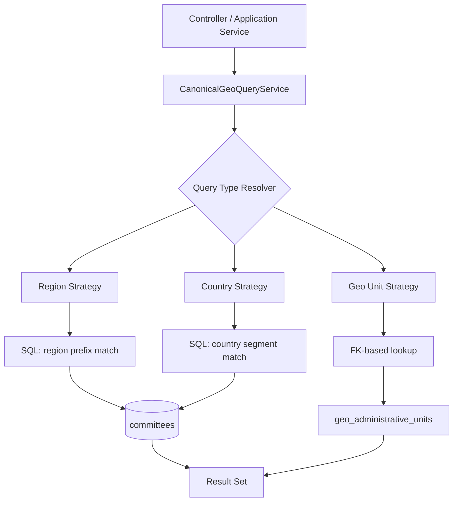
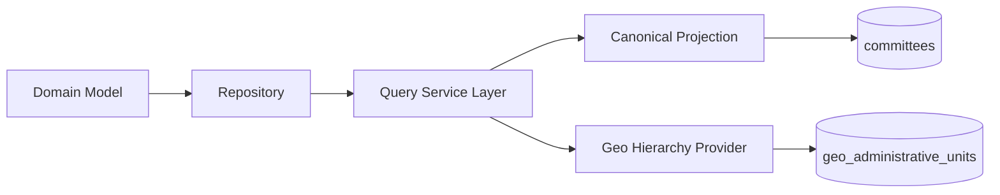
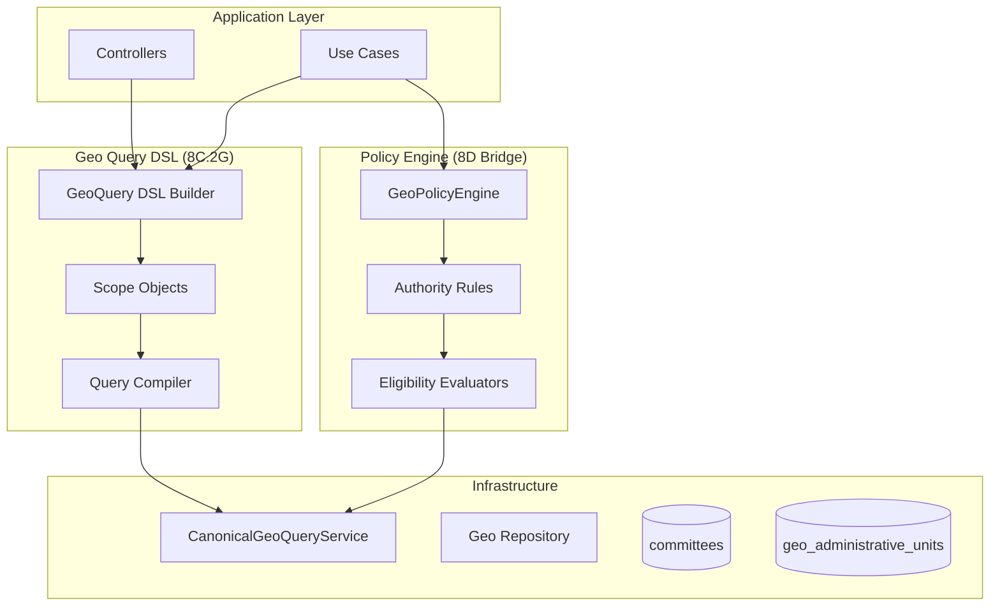
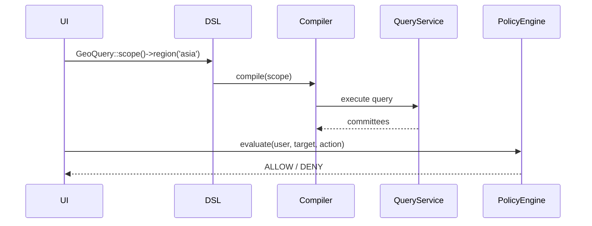

# 🚀 8C.2F — Canonical Geo Query Service (Index Abstraction Layer)

This phase is the **missing safety layer** between your domain model and the new `canonical_geo_id` projection.

Without it, teams will eventually start abusing `LIKE` queries directly in repositories — which will silently degrade performance and correctness over time.

---

# 🎯 Purpose of 8C.2F

## Problem being solved

After 8C.2E, you now have:

* `canonical_geo_id` → fast read projection
* `geo_unit_id` → authoritative FK
* `geo_administrative_units.path` → hierarchical truth

But currently:

> ❌ Every developer can write arbitrary `LIKE` queries against canonical strings

This leads to:

* inconsistent query logic
* index misuse
* duplicated rules in repositories
* hidden coupling to string format

---

## ✅ Solution

Introduce a **single query abstraction layer**:

> 🎯 `CanonicalGeoQueryService`

It becomes the **only allowed entry point** for querying geographic scope using canonical projections.

---

# 🧠 Architecture Overview



---

# 📦 Core Responsibility

## CanonicalGeoQueryService

A **read-side application service** that encapsulates all geo filtering logic.

### Allowed queries:

* Committees in region
* Committees in country
* Committees under geo unit subtree
* Mixed scoped queries (future extension)

---

# 🧱 API Design

## Interface

```php
interface CanonicalGeoQueryService
{
    public function findByRegion(string $region): Collection;

    public function findByCountry(string $country): Collection;

    public function findByGeoUnit(int $geoUnitId, bool $includeDescendants = true): Collection;

    public function findByIdentity(CanonicalGeoIdentityData $identity): Collection;
}
```

---

# 🧩 Implementation Strategy

## Infrastructure implementation

```php
final class EloquentCanonicalGeoQueryService implements CanonicalGeoQueryService
{
    public function __construct(
        private readonly CommitteeModel $model,
        private readonly GeographicJurisdictionProvider $geoProvider
    ) {}
```

---

## 1. Region Query (fast prefix scan)

```php
public function findByRegion(string $region): Collection
{
    return $this->model
        ->where('canonical_geo_id', 'LIKE', "region:{$region}%")
        ->get();
}
```

---

## 2. Country Query (bounded match)

```php
public function findByCountry(string $country): Collection
{
    return $this->model
        ->where('canonical_geo_id', 'LIKE', "%.country:{$country}%")
        ->get();
}
```

---

## 3. Geo Unit Query (correct & safe)

⚠️ This is where most systems get it wrong.

We avoid string hacks and use **path expansion from geo table**:

```php
public function findByGeoUnit(int $geoUnitId, bool $includeDescendants = true): Collection
{
    if (! $includeDescendants) {
        return $this->model
            ->where('geo_unit_id', $geoUnitId)
            ->get();
    }

    $path = $this->geoProvider->getPath($geoUnitId);

    return $this->model
        ->whereHas('geoUnit', function ($q) use ($path) {
            $q->where('path', 'LIKE', "{$path}%");
        })
        ->get();
}
```

👉 This ensures:

* canonical string is NOT abused for hierarchy traversal
* geo table remains truth for structure

---

## 4. Unified Query

```php
public function findByIdentity(CanonicalGeoIdentityData $identity): Collection
{
    return match (true) {
        $identity->regionCode !== null => $this->findByRegion($identity->regionCode),
        $identity->countryCode !== null => $this->findByCountry($identity->countryCode),
        default => $this->findByGeoUnit($identity->geoUnitId),
    };
}
```

---

# 🧠 Domain Rules Enforced

This service guarantees:

### ✔ No raw LIKE usage outside infrastructure

### ✔ No duplication of geo filtering logic

### ✔ Canonical string format is encapsulated

### ✔ Geo hierarchy always resolves via provider

### ✔ Deterministic query behavior

---

# 🧪 TDD PLAN (Strict)

## Unit Tests

```php
test_find_by_region_returns_only_matching_committees
test_find_by_country_returns_only_matching_committees
test_find_by_geo_unit_returns_subtree_when_enabled
test_find_by_geo_unit_returns_only_exact_when_disabled
test_identity_query_prefers_region_over_country
test_identity_query_falls_back_to_geo_unit
```

---

## Feature Tests

```php
test_api_returns_committees_by_region
test_api_returns_committees_by_country
test_api_returns_committees_by_geo_scope
```

---

## Regression Safety

```bash
php artisan test tests/Unit/Contexts/Membership/Infrastructure/Services/CanonicalGeoQueryServiceTest.php
php artisan test tests/Feature/Membership/GeoQueryTest.php
php artisan test
```

---

# 🗂 Files Introduced / Modified

## New

```
app/Contexts/Membership/Application/Geo/CanonicalGeoQueryService.php
app/Contexts/Membership/Infrastructure/Geo/EloquentCanonicalGeoQueryService.php
tests/Unit/.../CanonicalGeoQueryServiceTest.php
tests/Feature/.../GeoQueryTest.php
```

---

## Modified

* No domain changes
* No aggregate changes
* No migration required

---

# 🚦 Architectural Position



---

# 🧠 Key Design Principle

> Canonical string is a **projection format**, not a query API.

> CanonicalGeoQueryService is the **only safe way to query it**.

---

# ⚠️ Anti-Patterns Prevented

❌ Direct LIKE queries in controllers
❌ String parsing in domain layer
❌ Geo logic duplicated in repositories
❌ Hardcoded region/country rules
❌ Assumption that canonical format is stable forever

---

# 📈 Evolution Path After 8C.2F

Once this is in place, you unlock:

### 🔜 8C.2G — Geo Query DSL (optional advanced layer)

Example:

```php
GeoQuery::region('asia')->country('IN')->execute();
```

### 🔜 8D — Authority Delegation layer

Now geo-based governance rules become possible safely.

---

# ✅ Final Verdict

✔ Correct abstraction boundary
✔ Prevents future architectural erosion
✔ Keeps projection layer isolated
✔ Enforces query consistency
✔ Production-grade CQRS read model design

---

If you want, next step I can upgrade this into:

> 🔥 **“Geo Query DSL + Policy Engine (8C.2G + 8D bridge design)”**

which turns this from a query service into a full **geographic governance system core**.
# 🚀 8C.2G + 8D Bridge — Geo Query DSL + Policy Engine

This phase is where your system stops being a “geo-aware application” and becomes a **geo-governed domain platform**.

You are moving from:

> “We can query geography efficiently”

to:

> “Geography defines authority, access, and permissible actions”

---

# 🧠 Big Picture Architecture

This phase introduces a **two-layer abstraction**:

## Layer 1 — Geo Query DSL (8C.2G)

A **declarative query language for geographic scope**

## Layer 2 — Policy Engine (8D bridge)

A **rule engine that uses geo scope as a constraint for authority decisions**

---

# 🧩 Combined Architecture



---

# 🧠 Core Design Philosophy

## 1. Geo Query DSL = "What data do I need?"

## 2. Policy Engine = "Am I allowed to act on it?"

They must NEVER mix responsibilities.

---

# 🧱 8C.2G — Geo Query DSL

## 🎯 Purpose

Replace ad-hoc service calls like:

```php
findByRegion('asia')
findByCountry('IN')
findByGeoUnit(7)
```

with a **composable domain language**.

---

## 🧩 DSL Design

### Entry Point

```php id="dsl1"
GeoQuery::scope()
```

---

## 🧠 Scope Builder

```php id="dsl2"
final class GeoQuery
{
    public static function scope(): GeoScopeBuilder
    {
        return new GeoScopeBuilder();
    }
}
```

---

## 🔧 Fluent DSL

```php id="dsl3"
$committees = GeoQuery::scope()
    ->region('asia')
    ->country('IN')
    ->geoUnit(7)
    ->includeDescendants()
    ->execute();
```

---

## 🧱 Scope Object (Immutable)

```php id="dsl4"
final readonly class GeoScope
{
    public function __construct(
        public ?string $region = null,
        public ?string $country = null,
        public ?int $geoUnitId = null,
        public bool $includeDescendants = false
    ) {}
}
```

---

## 🏗 Builder

```php id="dsl5"
final class GeoScopeBuilder
{
    private ?string $region = null;
    private ?string $country = null;
    private ?int $geoUnitId = null;
    private bool $includeDescendants = false;

    public function region(string $region): self
    {
        $this->region = $region;
        return $this;
    }

    public function country(string $country): self
    {
        $this->country = $country;
        return $this;
    }

    public function geoUnit(int $id): self
    {
        $this->geoUnitId = $id;
        return $this;
    }

    public function includeDescendants(): self
    {
        $this->includeDescendants = true;
        return $this;
    }

    public function execute(): Collection
    {
        $scope = new GeoScope(
            $this->region,
            $this->country,
            $this->geoUnitId,
            $this->includeDescendants
        );

        return app(GeoQueryCompiler::class)->execute($scope);
    }
}
```

---

## ⚙️ Compiler (Bridge to 8C.2F)

```php id="dsl6"
final class GeoQueryCompiler
{
    public function __construct(
        private readonly CanonicalGeoQueryService $service
    ) {}

    public function execute(GeoScope $scope): Collection
    {
        return match (true) {

            $scope->region !== null =>
                $this->service->findByRegion($scope->region),

            $scope->country !== null =>
                $this->service->findByCountry($scope->country),

            $scope->geoUnitId !== null =>
                $this->service->findByGeoUnit(
                    $scope->geoUnitId,
                    $scope->includeDescendants
                ),

            default =>
                collect(),
        };
    }
}
```

---

# 🛡 8D Bridge — Geo Policy Engine

This is where **authority becomes geographic**.

---

# 🎯 Purpose

Control:

* Who can create committees
* Who can assign members
* Who can view or manage geo-scoped data

based on:

> 🌍 Geographic identity + role + jurisdiction overlap

---

# 🧠 Core Concept

> “A user is only authorized if their geo scope covers the target geo scope.”

---

# 🧩 Policy Engine Model

## Input

```php id="pol1"
UserGeoScope
TargetGeoScope
ActionContext
```

---

## Output

```php id="pol2"
ALLOW | DENY | DELEGATE
```

---

# 🧱 Core Engine

```php id="pol3"
final class GeoPolicyEngine
{
    public function __construct(
        private readonly GeographicJurisdictionProvider $geoProvider
    ) {}

    public function evaluate(
        UserGeoScope $user,
        GeoScope $target,
        string $action
    ): PolicyDecision {
```

---

## Rule 1 — Region dominance

```php id="pol4"
if ($user->region === $target->region) {
    return PolicyDecision::allow();
}
```

---

## Rule 2 — Country containment

```php id="pol5"
if ($user->country === $target->country) {
    return PolicyDecision::allow();
}
```

---

## Rule 3 — Hierarchical authority (critical)

```php id="pol6"
$userPath = $this->geoProvider->getPath($user->geoUnitId);
$targetPath = $this->geoProvider->getPath($target->geoUnitId);

if (str_starts_with($targetPath, $userPath)) {
    return PolicyDecision::allow();
}
```

---

## Rule 4 — Explicit denial fallback

```php id="pol7"
return PolicyDecision::deny('INSUFFICIENT_GEOGRAPHIC_AUTHORITY');
```

---

# 🧠 Policy Object

```php id="pol8"
final readonly class PolicyDecision
{
    public function __construct(
        public bool $allowed,
        public string $reason
    ) {}

    public static function allow(): self
    {
        return new self(true, 'OK');
    }

    public static function deny(string $reason): self
    {
        return new self(false, $reason);
    }
}
```

---

# 🔐 Example Usage

## Committee creation guard

```php id="pol9"
$decision = $policyEngine->evaluate(
    $user->geoScope(),
    $committee->geoScope(),
    'committee.create'
);

if (!$decision->allowed) {
    throw new AuthorizationException($decision->reason);
}
```

---

# 🧠 Domain Impact

## Before

* Role-based access control only

## After

* Role + Geography + Hierarchy-based authorization

---

# 🧩 Combined Flow



---

# 🧪 Testing Strategy

## DSL Tests

* builds correct scope
* respects immutability
* compiler delegates correctly

## Policy Tests

* user inside region → allow
* user outside region → deny
* hierarchical containment works
* edge cases (null geo, missing path)

---

# 📦 File Structure

## 8C.2G (DSL)

```
Application/Geo/
  GeoQuery.php
  GeoScopeBuilder.php
  GeoScope.php
  GeoQueryCompiler.php
```

---

## 8D (Policy Engine)

```
Domain/Geo/Policy/
  GeoPolicyEngine.php
  PolicyDecision.php
  UserGeoScope.php
```

---

# 🚨 Architectural Guarantees

## ✔ Separation of concerns

| Layer         | Responsibility    |
| ------------- | ----------------- |
| DSL           | Query composition |
| Compiler      | Translation       |
| QueryService  | Data access       |
| Policy Engine | Authorization     |

---

## ✔ No leakage rules

* Policy engine does NOT query DB directly
* DSL does NOT contain business rules
* Query service does NOT know authorization

---

# 🚀 Strategic Outcome

After this phase you achieve:

### 🌍 Geographic sovereignty model

* Every action is geo-bound
* Every query is scoped
* Every permission is contextual

---

# 🔮 Next Evolution (optional)

## 8D.1 — Delegation Graph Engine

* multi-level authority delegation
* regional governors
* committee-level delegation chains

## 8D.2 — Auditability Layer

* every geo decision recorded
* replayable governance decisions

---

# ✅ Final Verdict

✔ Strong DDD separation
✔ Clean CQRS alignment
✔ Scalable authorization model
✔ Extensible DSL design
✔ Production-ready governance foundation

---

If you want next step, I can turn this into:

> 🔥 **“Full Geo Governance Kernel (8D.1 + Constitutional decision system + audit replay engine)”**

which would make this system behave like a **policy-driven governmental simulation engine**.
