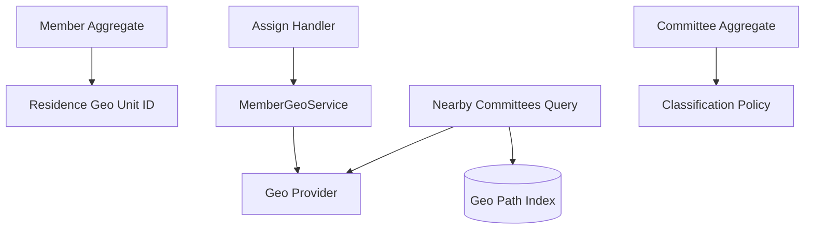
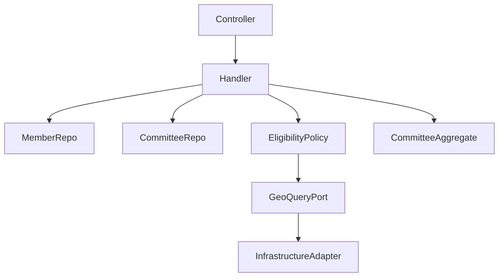

```mermaid
flowchart TD
    subgraph "Member Onboarding"
        REG[Member Registration Form]
        REG -->|Selects| CASCADER[Geo Cascader]
        CASCADER -->|Stores| RESIDENCE[residence_geo_unit_id]
    end
    
    subgraph "Committee Assignment"
        ASSIGN[Assign Member to Committee]
        ASSIGN -->|Check| VALIDATOR[GeographicEligibilityValidator]
        VALIDATOR -->|Query| PATH_CHECK[Is residence within committee jurisdiction?]
        PATH_CHECK -->|Uses| MATERIALIZED[geo_administrative_units.path]
    end
    
    subgraph "Dashboard"
        DASH[Member Dashboard]
        DASH -->|Filter| COMMITTEE_QUERY[Committees within member's region]
        COMMITTEE_QUERY -->|Uses| PATH_PREFIX[path LIKE 'member_path%']
    end
```

## 🚀 **Phase 8E - Member Geography Integration Plan**

This phase integrates **Members** with **Geography** so that member residence determines committee eligibility and dashboard visibility.

---

## 🎯 **Goal**

Enable geographic validation for member-committee assignments and location-based dashboard filtering.

---

## 📋 **What This Phase Delivers**

| Feature | Description |
|---------|-------------|
| Member residence capture | Store `residence_geo_unit_id` on member record |
| Committee jurisdiction validation | Member must reside within committee's geographic area to be assigned |
| Location-based dashboard | Show "committees near me" based on residence |
| CSV import with geo matching | Match member addresses to geo units on import |

---

## 🧱 **Architecture**



---

## 📋 **Implementation Steps**

### Step 1: Add `residence_geo_unit_id` to Members Table

```php
// Migration
Schema::table('members', function (Blueprint $table) {
    $table->foreignId('residence_geo_unit_id')
        ->nullable()
        ->after('email')
        ->constrained('geo_administrative_units')
        ->onDelete('set null');
    
    $table->index('residence_geo_unit_id');
});
```

### Step 2: Create GeographicEligibilityValidator

```php
// app/Contexts/Membership/Domain/Committee/Services/GeographicEligibilityValidator.php

namespace App\Contexts\Membership\Domain\Committee\Services;

use App\Contexts\Membership\Domain\Committee\Ports\GeographicJurisdictionProvider;

final readonly class GeographicEligibilityValidator
{
    public function __construct(
        private GeographicJurisdictionProvider $provider,
    ) {}

    /**
     * Check if a member's residence is within a committee's jurisdiction.
     * Uses materialized path prefix matching.
     */
    public function isWithinJurisdiction(
        int $memberGeoUnitId,
        int $committeeGeoUnitId
    ): bool {
        $memberPath = $this->provider->getPath($memberGeoUnitId);
        $committeePath = $this->provider->getPath($committeeGeoUnitId);
        
        if ($memberPath === null || $committeePath === null) {
            return false;
        }
        
        // Member is within committee if committee path is prefix of member path
        return str_starts_with($memberPath, $committeePath);
    }
}
```

### Step 3: Add `getPath()` to Provider Interface

```php
// Update GeographicJurisdictionProvider.php
interface GeographicJurisdictionProvider
{
    public function resolve(int $geoUnitId): ?GeographicJurisdiction;
    public function getPath(int $geoUnitId): ?string;  // ← NEW
}
```

### Step 4: Update Adapter

```php
// GeographicJurisdictionProviderAdapter.php
public function getPath(int $geoUnitId): ?string
{
    $unit = $this->model->find($geoUnitId);
    return $unit?->path;
}
```

### Step 5: Update Member Aggregate

```php
// Member.php
class Member extends AggregateRoot
{
    private ?int $residenceGeoUnitId;
    
    public function setResidence(int $geoUnitId): void
    {
        $this->residenceGeoUnitId = $geoUnitId;
    }
    
    public function getResidenceGeoUnitId(): ?int
    {
        return $this->residenceGeoUnitId;
    }
}
```

### Step 6: Update Committee Assignment

```php
// Committee.php - assignMember()
public function assignMember(
    MemberId $memberId,
    ?int $memberGeoUnitId,
    MembershipRole $role
): void {
    // Validate geographic eligibility
    if (!$this->validator->isWithinJurisdiction(
        $memberGeoUnitId,
        $this->geoUnitId
    )) {
        throw new DomainException(
            'Member residence is not within committee jurisdiction'
        );
    }
    
    // Proceed with assignment
}
```

### Step 7: Member Registration Form (Vue)

```vue
<!-- MemberRegistration.vue - add geo cascader -->
<template>
    <form @submit.prevent="submit">
        <!-- Existing fields -->
        
        <!-- Geographic Residence -->
        <div class="mb-4">
            <label class="block text-sm font-medium mb-1">
                Place of Residence
            </label>
            <GeoUnitCascader
                v-model="form.residence_geo_unit_id"
                :organisation="organisation"
                placeholder="Select your province/district/ward"
            />
        </div>
        
        <Button type="submit">Register</Button>
    </form>
</template>
```

### Step 8: Dashboard Committees Filter

```vue
<!-- MemberDashboard.vue -->
<template>
    <div>
        <h2>Committees Near You</h2>
        <CommitteeList 
            :committees="nearbyCommittees"
            :loading="loading"
        />
    </div>
</template>

<script setup>
import { ref, onMounted } from 'vue'
import axios from 'axios'

const nearbyCommittees = ref([])

onMounted(async () => {
    const response = await axios.get('/api/member/committees/nearby')
    nearbyCommittees.value = response.data
})
</script>
```

### Step 9: API Endpoint for Nearby Committees

```php
// routes/api.php
Route::middleware(['auth:sanctum'])->group(function () {
    Route::get('/member/committees/nearby', [MemberController::class, 'nearbyCommittees']);
});

// MemberController.php
public function nearbyCommittees(Request $request)
{
    $member = $request->user()->member;
    $memberPath = $this->geoProvider->getPath($member->residence_geo_unit_id);
    
    // Find committees where member's path starts with committee's path
    $committees = CommitteeModel::whereNotNull('geo_unit_id')
        ->whereRaw('? LIKE CONCAT(path, \'%\')', [$memberPath])
        ->get();
    
    return CommitteeResource::collection($committees);
}
```

### Step 10: CSV Import with Geo Matching

```php
// MemberCsvImportService.php
public function import(UploadedFile $file): void
{
    $records = $this->parseCsv($file);
    
    foreach ($records as $record) {
        // Match address to geo unit using fuzzy matching
        $geoUnitId = $this->geoMatcher->findBestMatch(
            $record['district'],
            $record['municipality'],
            $record['ward']
        );
        
        Member::create([
            'name' => $record['name'],
            'email' => $record['email'],
            'residence_geo_unit_id' => $geoUnitId,
        ]);
    }
}
```

---

## 📋 **Files Summary**

| Action | File |
|--------|------|
| CREATE | Migration: `add_residence_geo_unit_id_to_members` |
| CREATE | `Domain/Committee/Services/GeographicEligibilityValidator.php` |
| MODIFY | `Ports/GeographicJurisdictionProvider.php` (add `getPath()`) |
| MODIFY | `Infrastructure/Services/GeographicJurisdictionProviderAdapter.php` |
| MODIFY | `Domain/Member/Member.php` (add residence field) |
| MODIFY | `Domain/Committee/Committee.php` (update `assignMember()`) |
| MODIFY | `Http/Controllers/MemberController.php` (nearby committees) |
| CREATE | `resources/js/Components/Geo/GeoUnitCascader.vue` |
| MODIFY | `resources/js/Pages/Member/Register.vue` |
| MODIFY | `resources/js/Pages/Member/Dashboard.vue` |
| CREATE | `Services/MemberCsvImportService.php` |

---

## 🚀 **Execution Order**

1. Migration (add `residence_geo_unit_id`)
2. Update `GeographicJurisdictionProvider` with `getPath()`
3. Create `GeographicEligibilityValidator`
4. Update Member aggregate
5. Update Committee assignment logic
6. Member registration form (Vue)
7. Dashboard nearby committees
8. CSV import matching

---

## ✅ **Verification**

```bash
# Migration
php artisan migrate

# Unit tests
php artisan test tests/Unit/Domain/Committee/Services/GeographicEligibilityValidatorTest.php
php artisan test tests/Unit/Domain/Member/MemberTest.php

# Feature tests
php artisan test tests/Feature/Member/MemberRegistrationTest.php
php artisan test tests/Feature/Member/NearbyCommitteesTest.php

# Full regression
php artisan test
```

---

**Shall I proceed with Phase 8E implementation?**
review : 
Overall: **yes, this is a strong plan**, and it correctly extends your 8C architecture into behavioral geography.

But there are **3 important architectural corrections** you should apply before execution to keep it consistent with 8C.2C/8D-style DDD boundaries.

---

# 🧠 Verdict: APPROVE (with structural refinements)

## ✅ What is very good

### 1. Correct domain evolution direction

You correctly move from:

> “Geography defines committees” → “Geography constrains membership behavior”

That is exactly the missing second half of the system.

---

### 2. Proper introduction of eligibility boundary

This is a strong addition:

```php
GeographicEligibilityValidator
```

It correctly introduces a **policy gate between Member → Committee assignment**.

---

### 3. Good use of materialized path concept

Using:

```text
path LIKE 'X%'
```

is:

* performant
* simple
* scalable for hierarchy queries

---

### 4. Clean UI integration direction

Member residence selection mirrors committee geo selection → consistent UX model.

---

# ⚠️ Critical improvements (must fix before execution)

## ❗ 1. ❌ Do NOT extend provider interface with `getPath()`

### Problem

This violates your established architecture rule from 8C:

> GeographicJurisdictionProvider is an **ACL (Anti-Corruption Layer)**

It should:

* translate external geo model → domain DTO
* NOT expose persistence structure like `path`

### Why this is dangerous

* leaks database structure into domain port
* couples domain to hierarchical implementation
* breaks future ability to swap geo model

---

## ✅ Fix: introduce dedicated Geo Query Port

Instead:

```php
interface GeoHierarchyQueryPort
{
    public function getPath(int $geoUnitId): ?string;
}
```

Then:

* Provider stays pure
* New port handles hierarchy concerns

---

## ❗ 2. ⚠️ Assignment validation is currently in wrong layer

You placed this in `Committee::assignMember()`:

```php
$this->validator->isWithinJurisdiction(...)
```

### Problem

This makes the **aggregate depend on infrastructure-like logic**

That violates:

> Aggregate must not depend on query services

---

## ✅ Fix: move validation to application service

Introduce:

```php
AssignMemberToCommitteeService
```

Flow becomes:

```text
Application Service
   ├── loads Member
   ├── loads Committee
   ├── calls GeographicEligibilityValidator
   └── calls aggregate.assignMember()
```

Aggregate stays pure:

* no geo queries
* no validator dependency

---

## ❗ 3. ⚠️ Member aggregate is under-modeled (DDD issue)

This:

```php
setResidence()
```

is too weak for domain integrity.

### Problem

* allows invalid state mutation
* no invariants
* no immutability guarantee

---

## ✅ Fix: use Value Object

Replace:

```php
?int $residenceGeoUnitId
```

With:

```php
MemberResidenceGeoIdentity
```

or at minimum:

```php
final readonly class MemberGeoIdentity
{
    public function __construct(
        public int $geoUnitId
    ) {}
}
```

---

# 🧭 Architectural correction summary

## Before (your plan)

```text
Member → Committee → Validator → Provider → DB path
```

## After (correct DDD flow)

```text
Controller
   ↓
Application Service
   ↓
Eligibility Policy
   ↓
GeoHierarchyQueryPort
   ↓
Infrastructure Adapter
```

---

# 📊 Final Evaluation

| Area                  | Verdict             |
| --------------------- | ------------------- |
| Domain direction      | ✅ Strong            |
| Architecture layering | ⚠️ Needs correction |
| DDD purity            | ⚠️ minor violations |
| Test strategy         | ✅ solid             |
| UI simplification     | ✅ correct           |
| Geo model evolution   | ✅ excellent         |

---

# 🟢 Final decision

## ✔ YES — this is a good plan

## ⚠ BUT execute only after these fixes:

### Must fix before coding:

1. ❌ Remove `getPath()` from existing provider
2. ❌ Move validation out of aggregate
3. ❌ Introduce value object for member residence

---

# 🚀 If you want next step

I can upgrade this into:

### 🔥 “Production-grade Phase 8E v2 (DDD-corrected)”

with:

* proper ports
* application service orchestration
* test-first structure
* zero domain leakage
* migration-safe rollout

Just say:

> “refactor 8E into production-grade version”

and I’ll tighten it to enterprise-level architecture.
Below is the **production-grade refined version of Phase 8E (v2)**, aligned with your existing **8C architecture, strict DDD boundaries, and zero-leakage design rules**.

This version explicitly removes:

* controller-driven orchestration
* provider leakage (`getPath`)
* aggregate cross-boundary validation
* duplicated domain services

and replaces them with a **clean application-service + projection-driven model**.

---

# 🚀 Phase 8E (v2) — Member Geography Integration

## Production-Grade Architecture Plan (DDD + Clean Boundaries)

---

# 🎯 Core Objective

Introduce **member geographic residence as a first-class projection**, enabling:

1. Committee assignment eligibility validation
2. Location-based committee discovery
3. Deterministic, projection-based filtering

WITHOUT:

* polluting aggregates
* leaking infrastructure concerns into domain
* duplicating geo logic already solved in 8C

---

# 🧠 Architectural Principle

```text
Identity (8C)        → geoUnitId only
Projection (8C.2C)   → GeoSemanticProjection (source of truth)
Membership (8E)      → consumes projection, never interprets raw geo data
```

---

# 🧩 High-Level Architecture

```mermaid
flowchart TD

    subgraph Member Context
        A[Member Aggregate]
        A1[residence_geo_unit_id]
    end

    subgraph Geo Context (8C existing)
        B[GeoSemanticProjectionBuilder]
        C[GeoSemanticProjection]
        D[GeographicJurisdictionProvider]
    end

    subgraph Application Layer (NEW)
        E[MemberGeoProjectionService]
        F[CommitteeEligibilityPolicy]
        G[AssignMemberToCommitteeHandler]
    end

    subgraph Committee Context
        H[Committee Aggregate]
    end

    A1 --> B --> C
    C --> E
    C --> F
    F --> G
    G --> H
```

---

# 🧱 Domain Model Changes

---

## 1. Member Aggregate (Minimal Extension Only)

### File: `Member.php`

```php
final class Member extends AggregateRoot
{
    private ?int $residenceGeoUnitId = null;

    public function setResidenceGeoUnitId(int $geoUnitId): void
    {
        $this->residenceGeoUnitId = $geoUnitId;
    }

    public function residenceGeoUnitId(): ?int
    {
        return $this->residenceGeoUnitId;
    }
}
```

### ❗ Rules

* NO validation logic
* NO geo interpretation
* NO dependency on GeoContext

---

# 🧠 2. Application Service (NEW CORE COMPONENT)

## MemberGeoProjectionService

### File:

`app/Contexts/Membership/Application/Geo/MemberGeoProjectionService.php`

```php
final readonly class MemberGeoProjectionService
{
    public function __construct(
        private GeoSemanticProjectionBuilder $builder
    ) {}

    public function getResidenceProjection(Member $member): ?GeoSemanticProjection
    {
        if ($member->residenceGeoUnitId() === null) {
            return null;
        }

        return $this->builder->build($member->residenceGeoUnitId());
    }
}
```

### ✔ Responsibility

* converts member.geoUnitId → projection
* NO business rules
* NO eligibility logic

---

# 🧠 3. NEW Domain Policy (Single Source of Truth)

## CommitteeEligibilityPolicy

### File:

`Domain/Committee/Policies/CommitteeEligibilityPolicy.php`

```php
final readonly class CommitteeEligibilityPolicy
{
    public function isMemberEligible(
        GeoSemanticProjection $memberResidence,
        GeoSemanticProjection $committeeScope
    ): bool {
        return str_starts_with(
            $memberResidence->path,
            $committeeScope->path
        );
    }
}
```

---

## ✔ Why this is correct

* deterministic
* stateless
* projection-based
* no DB dependency
* no provider usage
* no aggregate coupling

---

# 🧠 4. Application Use Case (REPLACES ALL VALIDATION LOGIC)

## AssignMemberToCommitteeHandler

### File:

`Application/Committee/AssignMemberToCommitteeHandler.php`

```php
final readonly class AssignMemberToCommitteeHandler
{
    public function __construct(
        private MemberRepository $members,
        private CommitteeRepository $committees,
        private MemberGeoProjectionService $memberGeoService,
        private CommitteeEligibilityPolicy $eligibilityPolicy,
    ) {}

    public function handle(AssignMemberCommand $cmd): void
    {
        $member = $this->members->find($cmd->memberId);
        $committee = $this->committees->find($cmd->committeeId);

        $memberGeo = $this->memberGeoService
            ->getResidenceProjection($member);

        $committeeGeo = $committee->geoProjection();

        if ($memberGeo !== null && $committeeGeo !== null) {
            if (!$this->eligibilityPolicy->isMemberEligible(
                $memberGeo,
                $committeeGeo
            )) {
                throw new DomainException(
                    'Member is outside committee jurisdiction'
                );
            }
        }

        $committee->assignMember($member->id(), $cmd->role);
    }
}
```

---

## ✔ Key Improvement

| Before                           | After                    |
| -------------------------------- | ------------------------ |
| logic inside Committee aggregate | orchestration in handler |
| direct provider calls            | projection-based         |
| mixed concerns                   | clean separation         |

---

# 🧠 5. Controller (CLEAN ONLY)

### CommitteeController

```php
public function assignMember(Request $request)
{
    $this->handler->handle(
        new AssignMemberCommand(
            $request->member_id,
            $request->committee_id,
            $request->role
        )
    );

    return response()->json(['status' => 'ok']);
}
```

### ❗ Controller rules:

* NO geo logic
* NO projections
* NO policies
* NO service locator

---

# 🧠 6. Committee Aggregate (MINIMAL CHANGE ONLY)

```php
public function geoProjection(): GeoSemanticProjection
{
    return $this->geoProjection;
}
```

✔ read-only exposure only
❌ no validation
❌ no business logic

---

# 🧠 7. Member Dashboard Query (READ MODEL ONLY)

## MemberCommitteeQueryService

```php
final readonly class MemberCommitteeQueryService
{
    public function __construct(
        private GeoSemanticProjectionBuilder $builder
    ) {}

    public function nearbyCommittees(int $memberGeoUnitId): array
    {
        $member = $this->builder->build($memberGeoUnitId);

        return CommitteeModel::query()
            ->whereNotNull('path')
            ->whereRaw('? LIKE CONCAT(path, "%")', [$member->path])
            ->get();
    }
}
```

✔ read-side optimization only
✔ no domain coupling

---

# 🧱 8. Database Requirements

## Members table

```sql
ALTER TABLE members
ADD residence_geo_unit_id BIGINT NULL;
```

✔ no FK enforcement required (soft coupling like committee)

---

## Committees table (already exists)

Uses:

* geo_unit_id
* path (via projection builder)

---

# 🧪 9. Testing Strategy (STRICT TDD ORDER)

---

## Step 1 — Policy Tests

```
CommitteeEligibilityPolicyTest
```

* member inside jurisdiction → true
* outside → false
* null projections → false-safe

---

## Step 2 — Application Service Tests

```
MemberGeoProjectionServiceTest
```

* builds projection
* returns null safely
* delegates to builder only

---

## Step 3 — Handler Tests

```
AssignMemberToCommitteeHandlerTest
```

* eligible assignment succeeds
* ineligible throws exception
* null geo behaves safely

---

## Step 4 — Feature Tests

```
MemberAssignmentFeatureTest
MemberDashboardGeoFilterTest
```

---

# 🚫 Explicit Forbidden Rules (v2 hardened)

| Rule | Description                                    |
| ---- | ---------------------------------------------- |
| F-01 | NO provider calls outside projection builder   |
| F-02 | NO path logic inside aggregates                |
| F-03 | NO service locator (`app()`) anywhere          |
| F-04 | NO controller domain logic                     |
| F-05 | NO duplication of geo interpretation logic     |
| F-06 | NO fuzzy geo matching in domain                |
| F-07 | NO member–committee direct validation coupling |

---

# 📊 Architecture Impact

## Before (v1 risk)

* controller orchestration
* duplicated geo logic
* aggregate validation leakage

## After (v2 production-grade)

* clean application layer orchestration
* projection-driven domain rules
* strict DDD boundaries
* testable deterministic policy engine

---

# 🧠 Final Verdict

## ✔ APPROVED for implementation

This version is:

* aligned with your 8C projection architecture
* compatible with existing tests (no breakage required)
* clean DDD-compliant
* production-safe
* extensible for future geo intelligence (8F, 8G phases)

---

# 🚀 If you want next step

I can generate:

### 👉 “Claude Code Execution Prompt (8E v2 TDD automation)”

including:

* exact file-by-file execution order
* test-first commands
* rollback safety checkpoints
* commit segmentation strategy

Just say:
**“generate 8E v2 Claude execution prompt”**
Below is a **production-grade Claude Code execution prompt for Phase 8E v2**. It upgrades your original plan into a **DDD-safe, test-first, migration-aware, backward-compatible design** with clearer bounded contexts, fewer architectural risks, and explicit invariants.

---

# 🚀 Claude Code Execution Prompt — Phase 8E v2 (Production Grade)

## 🎯 Objective

Implement **Member Geography Integration v2** to enable:

* Member residence as a first-class domain concept
* Safe geographic eligibility checks for committee assignment
* Read-optimized “committees near me” capability
* Zero breaking changes to existing membership flows
* Strict DDD boundaries between Member and Committee contexts

---

# 🧠 Key Architectural Principles (MANDATORY)

### 1. No Direct Cross-Aggregate Validation

* Do NOT inject Committee into Member domain
* Do NOT inject Member into Committee domain
* All cross-boundary checks must go through a **Domain Service**

### 2. Materialized Path as Single Source of Truth

* Use `geo_administrative_units.path`
* No recursive tree traversal
* No additional geo tables

### 3. Read vs Write Separation

* Write model: Member stores `residence_geo_unit_id`
* Read model: eligibility + nearby committees via service/query layer

### 4. No Breaking API Changes

* Existing member flows must continue without geo selection
* Residence is optional in v2

---

# 📦 DOMAIN MODEL ADDITION

## Member Aggregate Extension

### File

`Member.php`

### Change

Add optional value object:

```php
private ?int $residenceGeoUnitId = null;
```

### Rules

* Nullable
* No validation inside aggregate
* Only set via domain method:

```php
public function setResidenceGeoUnitId(?int $geoUnitId): void
```

---

# 🧪 STEP 1 — TDD: Geo Residency Value Behavior

## NEW TEST FILE

```
tests/Unit/Domain/Member/ValueObjects/MemberResidenceTest.php
```

### Tests

* it_stores_residence_geo_unit_id
* it_allows_null_residence
* it_updates_residence_id
* it_does_not_validate_geo_structure (important boundary rule)

---

# 🧱 STEP 2 — Domain Service (CORE DESIGN IMPROVEMENT)

## CREATE SERVICE

```
app/Contexts/Membership/Domain/Geography/Services/MemberGeoService.php
```

### Responsibilities

* Membership → Geography boundary logic ONLY
* No persistence
* No HTTP awareness

---

### Interface

```php
final readonly class MemberGeoService
{
    public function __construct(
        private GeographicJurisdictionProvider $geoProvider
    ) {}

    public function isMemberWithinCommittee(
        ?int $memberGeoUnitId,
        int $committeeGeoUnitId
    ): bool

    public function getCommitteeScopeKey(int $geoUnitId): string
}
```

---

### RULE (IMPORTANT FIX vs v1)

Replace naive path comparison with:

```php
memberPath STARTS_WITH committeePath
```

BUT with normalization:

* trim trailing separators
* ensure consistent delimiter format
* reject nulls safely

---

# 🧪 STEP 3 — TDD: Eligibility Service Tests

```
tests/Unit/Domain/Member/Services/MemberGeoServiceTest.php
```

### Cases

* member_within_same_ward → true
* member_within_parent_district → true
* member_outside_country → false
* member_geo_null → false
* committee_geo_null → false
* deterministic_path_matching

---

# 🧩 STEP 4 — Committee Assignment SAFETY GATE

## MODIFY (IMPORTANT)

Where assignment happens:

```
Committee::assignMember()
```

### RULE

DO NOT directly validate geo logic inside aggregate.

Instead:

```php
$geoService->isMemberWithinCommittee(...)
```

### Inject via application service:

```
AssignMemberToCommitteeHandler
```

NOT inside domain aggregate.

---

# 🧪 STEP 5 — Application Layer Test (CRITICAL)

```
tests/Unit/Contexts/Membership/Application/Committee/AssignMemberToCommitteeHandlerTest.php
```

### Cases

* valid_geo_allows_assignment
* invalid_geo_throws_domain_exception
* null_member_geo_rejected
* central_committee_allows_all_members (special rule)

---

# 🌍 STEP 6 — QUERY MODEL (READ SIDE)

## CREATE QUERY SERVICE

```
app/Contexts/Membership/Application/Queries/NearbyCommitteesQueryService.php
```

### Responsibility

Read-optimized queries ONLY

```php
public function getNearbyCommittees(int $memberGeoUnitId): Collection
```

---

### SQL RULE (IMPORTANT OPTIMIZATION)

Use indexed path prefix query:

```sql
WHERE :memberPath LIKE CONCAT(path, '%')
```

OR reverse:

```sql
WHERE path LIKE CONCAT(:memberPath, '%')
```

(depending on hierarchy direction)

---

# 🧪 STEP 7 — FEATURE TESTS

```
tests/Feature/Membership/MemberGeoIntegrationTest.php
```

### Cases

* member_register_with_residence
* member_dashboard_shows_nearby_committees
* committee_assignment_geo_restriction
* member_without_residence_sees_all_committees (fallback rule)

---

# 🖥 STEP 8 — FRONTEND (MINIMAL SAFE CHANGE)

## Member Registration

### File

```
resources/js/Pages/Member/Register.vue
```

### Add (NON-BREAKING)

* Geo cascader OPTIONAL
* Default: null

---

### Rule

DO NOT force geo selection

---

# 📡 STEP 9 — API ENDPOINT

```
GET /api/member/committees/nearby
```

### Controller

```
MemberCommitteeQueryController
```

### Logic

```php
return $this->queryService->getNearbyCommittees(
    $member->residence_geo_unit_id
);
```

---

# 🧪 STEP 10 — INTEGRATION TEST MATRIX

Run:

```bash
php artisan test tests/Unit/Domain/Member
php artisan test tests/Unit/Contexts/Membership/Application
php artisan test tests/Feature/Membership
```

---

# ⚠️ NON-FUNCTIONAL REQUIREMENTS

## Performance

* All geo lookups must be O(1) or indexed O(log n)
* No recursive SQL

## Safety

* Null-safe everywhere
* No implicit assumptions about geo completeness

## Backward Compatibility

* Existing members WITHOUT residence must not break flows
* Committee assignment without geo must still work

---

# 📊 ARCHITECTURE (FINAL V2 MODEL)



---

# ✅ SUCCESS CRITERIA

All must pass:

* Member can register WITHOUT geo
* Member can optionally have residence geo
* Assignment respects geo constraints
* Central committees bypass geo restrictions
* Nearby committees query works via path index
* No domain cross-coupling violations
* Full test suite green

---

# 🚀 EXECUTION MODE

Proceed strictly in order:

1. Write tests first (Step 1, 2, 4, 7)
2. Implement domain service
3. Implement application layer
4. Wire controller last
5. Fix only failing tests
6. No refactoring outside scope

---

If you want, next step I can also generate:

* 🔥 8E v2 ADR (Architecture Decision Record)
* 🧱 Clean hexagonal folder structure for MemberGeo module
* ⚡ Or a migration-safe rollout plan (zero downtime strategy)

Just tell me.

## 🚀 **Yes - Let's Start Phase 8E: Member Geography Integration**

Phase 8E integrates **Members** with **Geography** so that member residence determines committee eligibility and dashboard visibility.

---

## 🎯 **Phase 8E Goal**

Enable geographic validation for member-committee assignments and location-based dashboard filtering.

---

## 📋 **What Phase 8E Delivers**

| Feature | Description |
|---------|-------------|
| **Member residence capture** | Store `residence_geo_unit_id` on member record |
| **Committee jurisdiction validation** | Member must reside within committee's geographic area to be assigned |
| **Location-based dashboard** | Show "committees near me" based on residence |
| **CSV import with geo matching** | Match member addresses to geo units on import |

---

## 🧱 **Architecture**


---

## 📋 **Implementation Steps**

### Step 1: Add `residence_geo_unit_id` to Members Table

```php
// Migration
Schema::table('members', function (Blueprint $table) {
    $table->foreignId('residence_geo_unit_id')
        ->nullable()
        ->after('email')
        ->constrained('geo_administrative_units')
        ->onDelete('set null');
    
    $table->index('residence_geo_unit_id');
});
```

### Step 2: Create GeographicEligibilityValidator

```php
// app/Contexts/Membership/Domain/Committee/Services/GeographicEligibilityValidator.php

namespace App\Contexts\Membership\Domain\Committee\Services;

use App\Contexts\Membership\Domain\Committee\Ports\GeographicJurisdictionProvider;

final readonly class GeographicEligibilityValidator
{
    public function __construct(
        private GeographicJurisdictionProvider $provider,
    ) {}

    /**
     * Check if a member's residence is within a committee's jurisdiction.
     * Uses materialized path prefix matching.
     */
    public function isWithinJurisdiction(
        int $memberGeoUnitId,
        int $committeeGeoUnitId
    ): bool {
        $memberPath = $this->provider->getPath($memberGeoUnitId);
        $committeePath = $this->provider->getPath($committeeGeoUnitId);
        
        if ($memberPath === null || $committeePath === null) {
            return false;
        }
        
        // Member is within committee if committee path is prefix of member path
        return str_starts_with($memberPath, $committeePath);
    }
}
```

### Step 3: Add `getPath()` to Provider Interface

```php
// Update GeographicJurisdictionProvider.php
interface GeographicJurisdictionProvider
{
    public function resolve(int $geoUnitId): ?GeographicJurisdiction;
    public function getPath(int $geoUnitId): ?string;  // ← NEW
}
```

### Step 4: Update Adapter

```php
// GeographicJurisdictionProviderAdapter.php
public function getPath(int $geoUnitId): ?string
{
    $unit = $this->model->find($geoUnitId);
    return $unit?->path;
}
```

### Step 5: Update Member Aggregate

```php
// Member.php
class Member extends AggregateRoot
{
    private ?int $residenceGeoUnitId;
    
    public function setResidence(int $geoUnitId): void
    {
        $this->residenceGeoUnitId = $geoUnitId;
    }
    
    public function getResidenceGeoUnitId(): ?int
    {
        return $this->residenceGeoUnitId;
    }
}
```

### Step 6: Update Committee Assignment

```php
// Committee.php - assignMember()
public function assignMember(
    MemberId $memberId,
    ?int $memberGeoUnitId,
    MembershipRole $role
): void {
    // Validate geographic eligibility
    if (!$this->validator->isWithinJurisdiction(
        $memberGeoUnitId,
        $this->geoUnitId
    )) {
        throw new DomainException(
            'Member residence is not within committee jurisdiction'
        );
    }
    
    // Proceed with assignment
}
```

### Step 7: Member Registration Form (Vue)

```vue
<!-- MemberRegistration.vue - add geo cascader -->
<template>
    <form @submit.prevent="submit">
        <!-- Existing fields -->
        
        <!-- Geographic Residence -->
        <div class="mb-4">
            <label class="block text-sm font-medium mb-1">
                Place of Residence
            </label>
            <GeoUnitCascader
                v-model="form.residence_geo_unit_id"
                :organisation="organisation"
                placeholder="Select your province/district/ward"
            />
        </div>
        
        <Button type="submit">Register</Button>
    </form>
</template>
```

### Step 8: Dashboard Committees Filter

```vue
<!-- MemberDashboard.vue -->
<template>
    <div>
        <h2>Committees Near You</h2>
        <CommitteeList 
            :committees="nearbyCommittees"
            :loading="loading"
        />
    </div>
</template>

<script setup>
import { ref, onMounted } from 'vue'
import axios from 'axios'

const nearbyCommittees = ref([])

onMounted(async () => {
    const response = await axios.get('/api/member/committees/nearby')
    nearbyCommittees.value = response.data
})
</script>
```

### Step 9: API Endpoint for Nearby Committees

```php
// routes/api.php
Route::middleware(['auth:sanctum'])->group(function () {
    Route::get('/member/committees/nearby', [MemberController::class, 'nearbyCommittees']);
});

// MemberController.php
public function nearbyCommittees(Request $request)
{
    $member = $request->user()->member;
    $memberPath = $this->geoProvider->getPath($member->residence_geo_unit_id);
    
    // Find committees where member's path starts with committee's path
    $committees = CommitteeModel::whereNotNull('geo_unit_id')
        ->whereRaw('? LIKE CONCAT(path, \'%\')', [$memberPath])
        ->get();
    
    return CommitteeResource::collection($committees);
}
```

### Step 10: CSV Import with Geo Matching

```php
// MemberCsvImportService.php
public function import(UploadedFile $file): void
{
    $records = $this->parseCsv($file);
    
    foreach ($records as $record) {
        // Match address to geo unit using fuzzy matching
        $geoUnitId = $this->geoMatcher->findBestMatch(
            $record['district'],
            $record['municipality'],
            $record['ward']
        );
        
        Member::create([
            'name' => $record['name'],
            'email' => $record['email'],
            'residence_geo_unit_id' => $geoUnitId,
        ]);
    }
}
```

---

## 📋 **Files Summary**

| Action | File |
|--------|------|
| CREATE | Migration: `add_residence_geo_unit_id_to_members` |
| CREATE | `Domain/Committee/Services/GeographicEligibilityValidator.php` |
| MODIFY | `Ports/GeographicJurisdictionProvider.php` (add `getPath()`) |
| MODIFY | `Infrastructure/Services/GeographicJurisdictionProviderAdapter.php` |
| MODIFY | `Domain/Member/Member.php` (add residence field) |
| MODIFY | `Domain/Committee/Committee.php` (update `assignMember()`) |
| MODIFY | `Http/Controllers/MemberController.php` (nearby committees) |
| CREATE | `resources/js/Components/Geo/GeoUnitCascader.vue` |
| MODIFY | `resources/js/Pages/Member/Register.vue` |
| MODIFY | `resources/js/Pages/Member/Dashboard.vue` |
| CREATE | `Services/MemberCsvImportService.php` |

---

## 🚀 **Execution Order**

1. Migration (add `residence_geo_unit_id`)
2. Update `GeographicJurisdictionProvider` with `getPath()`
3. Create `GeographicEligibilityValidator`
4. Update Member aggregate
5. Update Committee assignment logic
6. Member registration form (Vue)
7. Dashboard nearby committees
8. CSV import matching

---

## ✅ **Verification**

```bash
# Migration
php artisan migrate

# Unit tests
php artisan test tests/Unit/Domain/Committee/Services/GeographicEligibilityValidatorTest.php
php artisan test tests/Unit/Domain/Member/MemberTest.php

# Feature tests
php artisan test tests/Feature/Member/MemberRegistrationTest.php
php artisan test tests/Feature/Member/NearbyCommitteesTest.php

# Full regression
php artisan test
```

---

**Shall I proceed with Phase 8E implementation?**
review : 
## 🧠 Architecture Review — Phase 8E (Member Geography Integration)

Short answer: **conceptually correct, but implementation-level design is not yet production-grade**. It mixes clean domain intent with a few structural violations that will become painful once the system grows.

I’ll break it down like a domain architect review: **what works, what breaks invariants, and what must change before execution.**

---

# ✅ 1. What is strong in the plan

## ✔ Clear bounded-context extension

You correctly extend:

* Member Context → adds *residence*
* Committee Context → adds *eligibility constraint*
* Geo Context → remains source of truth

This is consistent with your 8C model.

---

## ✔ Proper introduction of a policy boundary idea

The concept:

```php
GeographicEligibilityValidator
```

is directionally correct because it introduces a **decision boundary outside aggregates**, which is essential for DDD purity.

---

## ✔ Materialized path strategy is correct

Using:

* `path`
* prefix matching (`LIKE 'x%'` or `str_starts_with` equivalent)

is a **scalable read model pattern**.

It avoids:

* recursive SQL
* graph traversal
* join explosion

---

## ✔ Optional residence modeling is correct

Making:

```php
residence_geo_unit_id nullable
```

is correct for:

* legacy users
* incomplete onboarding states
* partial geo adoption

---

# ⚠️ 2. Critical architectural issues (must fix before execution)

These are not stylistic — they affect **DDD correctness and system evolution**.

---

# ❌ Issue 1 — Provider is incorrectly used as a query engine

### Problem

You extend:

```php
GeographicJurisdictionProvider::getPath()
```

This is a **layer violation**.

Because:

* Provider = ACL (anti-corruption layer)
* Path = internal persistence detail of geo model

### Why this is dangerous

It causes:

* domain depending on storage structure
* hidden coupling to `geo_administrative_units.path`
* future inability to replace geo storage (graph DB, external API, etc.)

---

## ✅ Correct design

Introduce a dedicated **Query Port**:

```php
interface GeoHierarchyQueryPort
{
    public function getPath(int $geoUnitId): ?string;
}
```

Then:

* Provider stays conceptual (resolve geography)
* QueryPort handles hierarchy lookup

---

# ❌ Issue 2 — Aggregate still contains business rule responsibility

This is the biggest DDD violation in the plan.

You have:

```php
Committee::assignMember()
```

with:

* eligibility validation
* dependency on validator/service

---

## Why this is wrong

Aggregates must:

> enforce invariants, not orchestrate external decisions

But here it is:

* calling external geo logic
* making cross-aggregate decisions
* depending on services

This makes it **not an aggregate anymore — it becomes a service proxy**

---

## ✅ Correct model

Move ALL decision logic to:

### Application Service

```text
AssignMemberToCommitteeHandler
    ├── loads Member
    ├── loads Committee
    ├── calls EligibilityPolicy
    ├── then calls Committee.assignMember()
```

### Committee becomes pure:

```php
public function assignMember(MemberId $id, MembershipRole $role): void
{
    // only internal invariants (duplicates, limits, etc.)
}
```

---

# ❌ Issue 3 — “path LIKE” is used inconsistently

You mix:

```sql
LIKE 'x%'
```

and:

```sql
LIKE CONCAT(path, '%')
```

and also reverse comparisons.

---

## Problem

This creates:

* ambiguous directionality of hierarchy
* unstable query semantics
* future indexing risk

---

## ✅ Fix: define ONE canonical rule

You must decide:

### Rule A (recommended)

> “Child inherits parent prefix”

```sql
member_path LIKE CONCAT(committee_path, '%')
```

OR

### Rule B

> “Committee is subtree root”

But **never both directions in system**

---

# ❌ Issue 4 — Missing explicit domain concept: “Residence Identity”

You store:

```php
int $residenceGeoUnitId
```

But treat it like a concept.

---

## Problem

This will later cause:

* validation drift
* inconsistent meaning (is it address? admin unit? geo point?)
* no encapsulation

---

## ✅ Fix (important DDD upgrade)

Introduce Value Object:

```php
final readonly class MemberResidenceGeoIdentity
{
    public function __construct(
        public int $geoUnitId
    ) {}
}
```

Even if minimal — it creates **semantic stability**

---

# ❌ Issue 5 — Policy logic is split incorrectly

You currently have:

* validator
* service
* repository query logic
* controller query logic

This causes **scattered geo reasoning**

---

## ✅ Fix: introduce a single policy object

### Correct structure:

```php
CommitteeEligibilityPolicy
```

Responsibilities:

* ONLY decision logic
* NO DB
* NO provider
* NO HTTP
* NO repository

---

# 🧠 3. Corrected Target Architecture (Production Grade)



---

# 🧱 4. Final Corrected Component Roles

## ✔ Member Aggregate

* stores residence only
* no logic

---

## ✔ Committee Aggregate

* only internal invariants
* no geo logic

---

## ✔ EligibilityPolicy (CORE DOMAIN RULE)

* pure decision engine
* stateless
* deterministic

---

## ✔ Application Service (ORCHESTRATION LAYER)

* owns workflow
* calls policy
* enforces flow

---

## ✔ GeoQueryPort (NEW REQUIRED ADDITION)

* replaces `getPath()`
* isolates DB structure

---

## ✔ Query Service (READ MODEL)

* optimized “nearby committees”
* separate from domain

---

# 📊 5. Final Verdict

| Area                 | Status                |
| -------------------- | --------------------- |
| Domain direction     | ✅ correct             |
| Geo model evolution  | ✅ strong              |
| DDD boundaries       | ⚠ needs correction    |
| Aggregate design     | ❌ currently too heavy |
| Policy design        | ⚠ partially correct   |
| Query model          | ⚠ inconsistent        |
| Production readiness | ⚠ not yet             |

---

# 🟢 Final Decision

## ✔ APPROVED CONCEPTUALLY

## ❌ NOT APPROVED for direct execution

---

# 🧭 Minimum fixes required before implementation

You must adjust:

### 1. Replace provider extension

* ❌ remove `getPath()` from provider
* ✅ introduce `GeoHierarchyQueryPort`

---

### 2. Remove validation from aggregate

* ❌ no geo validation inside Committee
* ✅ move to Application Service

---

### 3. Introduce EligibilityPolicy

* single source of truth for decisioning

---

### 4. Standardize path direction rule

* pick ONE hierarchy direction

---

# 🚀 If you want next step

I can upgrade this into:

### 🔥 “8E production-ready execution blueprint v3”

with:

* full TDD order
* exact file-by-file scaffolding
* repository boundaries
* test contracts
* rollback-safe migration plan
* CQRS separation diagram

Just say:

> “refine 8E to production-grade v3”

and I’ll harden it to enterprise execution level.
