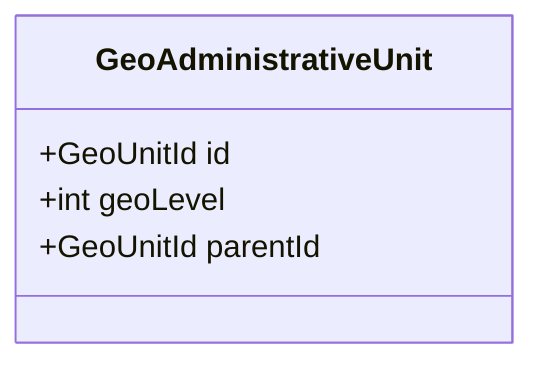
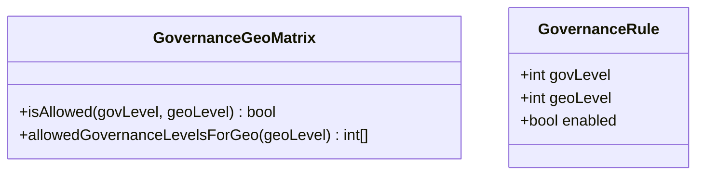
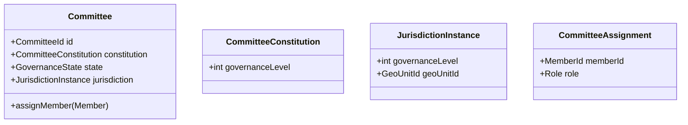
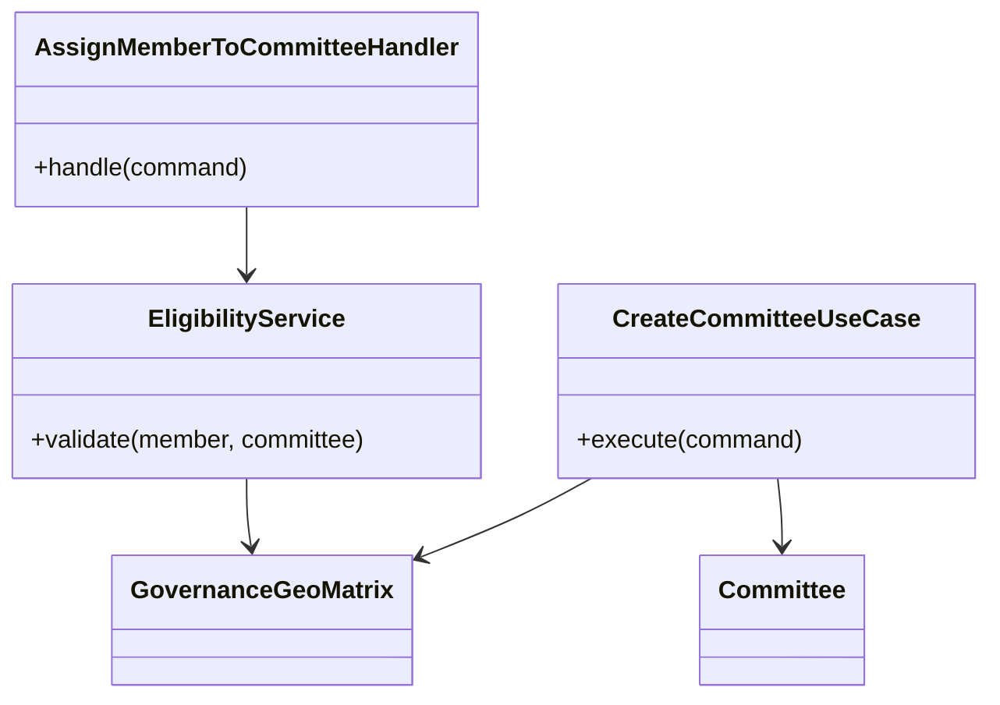
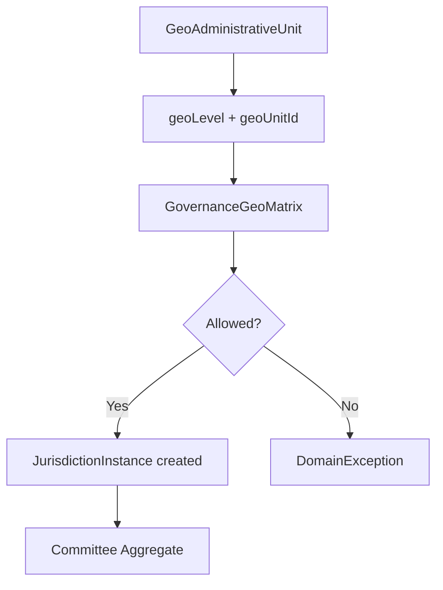
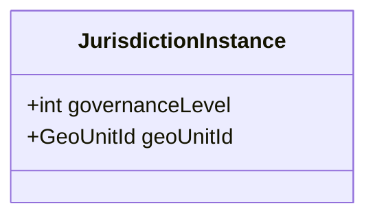
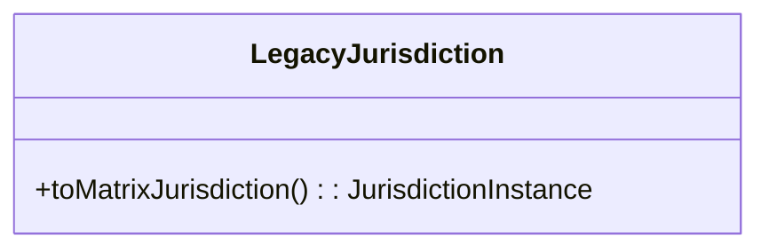
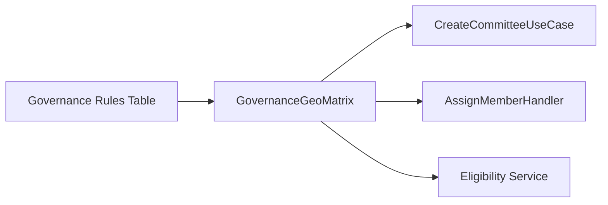
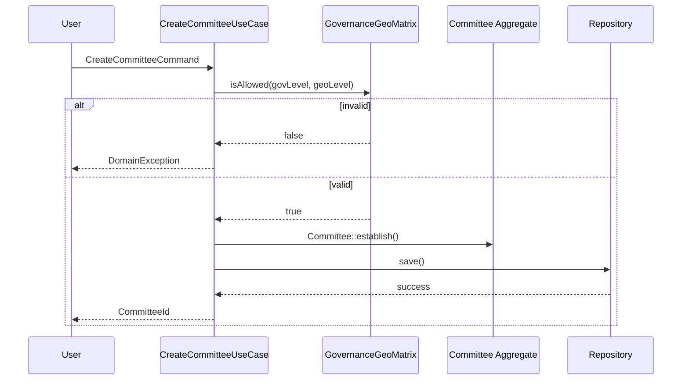

# Architecture Enforcement Framework — Session Instructions for Claude Code CLI

## Background Context

You are continuing development of a **geography-based committee governance platform** for NRNA (Non-Resident Nepali Association). The system models:

```
Geography Units (Province → District → Municipality → Ward)
    ↓
Committees (with Jurisdictions tied to Geo Units)
    ↓
Memberships (people belonging to committees)
    ↓
Elections (voting for committee positions)
    ↓
Governance Legitimacy (constitutional rules, quorum, authority)
```

The architecture follows **Domain-Driven Design** with bounded contexts:
- **Geography** — territorial hierarchy and jurisdiction
- **Membership** — committees, members, roles, assignments
- **Governance** — legitimacy, authority, delegation, approvals
- **Election** — voting and results

---

## Current System State

### What Exists

```
✅ GeoAdministrativeUnit (proper DDD aggregate)
    - GeoUnitId, GeographyLevel (0-10), GeoPath (materialized path)
    - validFrom/validTo temporal fields
    - createRoot(), createChild() factory methods
    - 6 explicit invariants (GEO-INV-01 through GEO-INV-06)

✅ Committee (aggregate root, ~1100 lines)
    - CommitteeId, CommitteeType, CommitteeName
    - GovernanceState entity (lifecycle: ACTIVE/SUSPENDED/DISSOLVED)
    - CommitteeConstitution entity (mandate definition: id, name, level)
    - CommitteeAssignment[] (members)
    - GeoReference operationalGeo (jurisdiction)
    - delegate methods: suspend(), restore(), dissolve(), attachToParent(), startTerm(), extendTerm()

✅ Governance Levels Table (configurable per tenant)
    - level: 0, 1, 2, 3...
    - committee_type: 'ICC', 'NCC', 'LCC'...
    - geo_code: 'ICC', 'REG', 'NCC', 'SLC'...
    - parent_geo_code: self-reference

✅ Architecture Enforcement Framework (Phase 1.5 complete)
    - nikic/php-parser AST-based analysis
    - SemanticIndex, DependencyGraph
    - BaselineManager with EnforcementLevel (REQUIRED, TRANSITIONAL, LEGACY_ALLOWED, DEPRECATED, ADVISORY)
    - ArchitectureBaselineCommand CLI

✅ Election System Bug Fixes
    - Open Voting button disabled until nomination complete
    - Candidacy Unpublish/Remove hidden when nomination locked
    - Temporal validation guards on state machine transitions
```

### What Was Just Discovered

The system has a **governance levels configuration table** and a **geo units table** that together form a **2D matrix** of allowed combinations:

```
Governance Level × Geo Level → Valid Jurisdiction Cell

Example (diagonal default):
    Gov 0 (ICC)  → Geo 0 (World)
    Gov 1 (Region) → Geo 1 (Continent)
    Gov 2 (NCC)  → Geo 2 (Country)
    Gov 3 (LCC)  → Geo 3 (State)
```

A hardcoded `Jurisdiction` value object exists at `app/Contexts/Membership/Domain/Committee/ValueObjects/Jurisdiction.php` with fixed scopes (`ward`, `district`, `province`, `national`). This is **architecturally wrong** because the system uses configurable governance levels, not a hardcoded enum.

---

## Architecture Decision (CRITICAL — DO NOT DEVIATE)

### The Matrix Model

The system is NOT a hierarchy. It is a **bidimensional constraint system**:

```
Governance Axis (independent)  ×  Geo Axis (independent)  →  Allowed Cell
```

```php
// The rule engine
GovernanceGeoMatrix::isAllowed(int $govLevel, int $geoLevel): bool

// The snapshot
JurisdictionInstance(governanceLevel, geoLevel, geoCode)

// The bridge from old to new
LegacyJurisdiction::toMatrixJurisdiction(): JurisdictionInstance
```

### Principles

```yaml
MATRIX_IS_CONFIGURATION: Matrix is policy data, NOT code logic
JURISDICTION_IS_SNAPSHOT: Jurisdiction holds a validated cell, does NOT validate
GEO_LEVEL_IS_ABSTRACT: GeoLevel 0-10 is a container system, NOT semantic geography
DIAGONAL_IS_DEFAULT: govLevel==geoLevel is seed data, NOT a system invariant
MIGRATE_DONT_DELETE: Old Jurisdiction becomes LegacyJurisdiction with bridge method
```

---

## Task: Matrix Engine Implementation

### Phase A — Preserve Legacy (DO FIRST)

```yaml
Step 1: RENAME old Jurisdiction to LegacyJurisdiction
  FILE: app/Contexts/Membership/Domain/Committee/ValueObjects/LegacyJurisdiction.php
  ACTION: Rename class from 'Jurisdiction' to 'LegacyJurisdiction'
  KEEP: All existing methods (ward(), district(), province(), national(), fromString(), etc.)
  ADD: PHPDoc @deprecated tag
  ADD: Method toMatrixJurisdiction(): JurisdictionInstance
  
  SEARCH: All imports of old Jurisdiction class
  UPDATE: Change 'use ... Jurisdiction' to 'use ... LegacyJurisdiction'
  VERIFY: All existing tests pass (zero breakage)

Step 2: CREATE JurisdictionInstance (new canonical VO)
  FILE: app/Contexts/Membership/Domain/Committee/ValueObjects/JurisdictionInstance.php
  CLASS: final readonly class JurisdictionInstance
  CONSTRUCTOR:
    public int $governanceLevel
    public int $geoLevel
    public string $geoCode
  METHOD: equals(self $other): bool
  CONSTRAINT: ZERO validation logic — pure data holder
  CONSTRAINT: ZERO string parsing — no fromString() method
  VERIFY: php -l (compiles cleanly)
```

### Phase B — Build Matrix Engine

```yaml
Step 3: CREATE GovernanceGeoMatrix
  FILE: app/Contexts/Membership/Domain/Committee/Policies/GovernanceGeoMatrix.php
  CLASS: final readonly class GovernanceGeoMatrix
  CONSTRUCTOR:
    private array $allowed  // [govLevel][geoLevel] => bool
  METHOD: isAllowed(int $govLevel, int $geoLevel): bool
  METHOD: static fromGovernanceLevels(array $levels): self
    // Reads governance levels table data, builds 2D allowed map
  CONSTRAINT: Matrix is configuration, NOT logic — just returns bool
  CONSTRAINT: Default diagonal (gov==geo) is seed data only
  VERIFY: Unit test with diagonal + one non-diagonal override
```

### Phase C — TDD Use Case

```yaml
Step 4: CREATE CreateCommitteeUseCase (TDD — TEST FIRST)
  TEST FILE: tests/Unit/Contexts/Membership/Application/CreateCommitteeUseCaseTest.php
  
  TEST 1: test_creates_committee_with_valid_matrix_cell
    GIVEN: Matrix allows [gov=2, geo=2]
    WHEN: CreateCommitteeCommand with jurisdiction=(2, 2, 'NCC-NP')
    THEN: Committee is persisted with correct jurisdiction
    
  TEST 2: test_rejects_invalid_matrix_cell
    GIVEN: Matrix does NOT allow [gov=2, geo=1]
    WHEN: CreateCommitteeCommand with jurisdiction=(2, 1, 'NCC-EU')
    THEN: DomainException thrown
    
  TEST 3: test_committee_emits_established_event
    GIVEN: Valid matrix cell
    WHEN: Committee created
    THEN: CommitteeEstablished event recorded

  IMPLEMENTATION FILE: app/Contexts/Membership/Application/Committee/UseCases/CreateCommittee/CreateCommitteeUseCase.php
  CLASS: final class CreateCommitteeUseCase
  CONSTRUCTOR:
    private CommitteeRepositoryPort $repository
    private GovernanceGeoMatrix $matrix
  METHOD: execute(CreateCommitteeCommand $command): CreateCommitteeResult
    1. Validate: $this->matrix->isAllowed($command->jurisdiction->governanceLevel, $command->jurisdiction->geoLevel)
    2. If invalid: throw DomainException
    3. Create Committee via Committee::establish()
    4. Persist via $this->repository->save()
    5. Return CreateCommitteeResult with committeeId

  COMMAND FILE: app/Contexts/Membership/Application/Committee/UseCases/CreateCommittee/CreateCommitteeCommand.php
  CLASS: final readonly class CreateCommitteeCommand
  PROPERTIES:
    public CommitteeId $committeeId
    public string $name
    public JurisdictionInstance $jurisdiction
    public DateTimeImmutable $establishedAt

  RESULT FILE: app/Contexts/Membership/Application/Committee/UseCases/CreateCommittee/CreateCommitteeResult.php
  CLASS: final readonly class CreateCommitteeResult
  PROPERTIES:
    public CommitteeId $committeeId

  PORT FILE (if not exists): app/Contexts/Membership/Application/Committee/Ports/CommitteeRepositoryPort.php
  INTERFACE: CommitteeRepositoryPort
  METHOD: save(Committee $committee): void
  METHOD: get(CommitteeId $id): ?Committee
```

### Phase D — Wire into Committee Aggregate

```yaml
Step 5: ADD Committee::establish() factory method
  FILE: app/Contexts/Membership/Domain/Committee/Committee.php
  METHOD: public static function establish(
    CommitteeId $id,
    string $name,
    JurisdictionInstance $jurisdiction,
    DateTimeImmutable $establishedAt
  ): self
  BEHAVIOR:
    1. Create new Committee instance
    2. Initialize GovernanceState as ACTIVE
    3. Create CommitteeConstitution with id, name, level=$jurisdiction->governanceLevel
    4. Record CommitteeEstablished event
    5. Return instance
  NOTE: Committee::establish() is NEW — does NOT replace existing form() or create()
  NOTE: Existing paths stay untouched; establish() is the canonical governance creation path

Step 6: CREATE CommitteeEstablished event (if not exists)
  FILE: app/Contexts/Membership/Domain/Committee/Events/CommitteeEstablished.php
  EXTENDS: AbstractDomainEvent
  PROPERTIES:
    public string $committeeId
    public string $name
    public int $governanceLevel
    public int $geoLevel
    public string $geoCode
    public DateTimeImmutable $establishedAt
```

### Phase E — Verification

```yaml
Step 7: RUN full test suite
  COMMAND: php artisan test tests/Architecture/ tests/Unit/Contexts/Membership/
  EXPECT: All existing tests pass (zero regression)
  EXPECT: New CreateCommitteeUseCaseTest passes (3 tests)

Step 8: VERIFY compilation
  COMMAND: php -l for each new file
  EXPECT: No syntax errors

Step 9: REPORT summary
  List: Files created, files modified, tests added, tests passing
```

---

## Forbidden Actions

```yaml
❌ DO NOT delete old Jurisdiction.php — rename to LegacyJurisdiction only
❌ DO NOT modify existing Committee::form() or Committee::create() methods
❌ DO NOT add validation logic to JurisdictionInstance — it's a snapshot
❌ DO NOT assume govLevel == geoLevel in matrix logic
❌ DO NOT create new repositories unless the port interface exists first
❌ DO NOT modify GovernanceState or CommitteeConstitution
❌ DO NOT change the directory structure — follow existing namespace conventions
```

---

## Review Protocol

Present each file for review **individually** after creation. Order:

1. `LegacyJurisdiction.php` — rename + bridge method
2. `JurisdictionInstance.php` — new canonical VO
3. `GovernanceGeoMatrix.php` — matrix engine
4. Test files (test doubles: InMemoryCommitteeRepository, FakeEventBus)
5. `CreateCommitteeUseCaseTest.php` — failing test (Phase A of TDD)
6. `CreateCommitteeCommand.php` + `CreateCommitteeResult.php` — DTOs
7. `Committee::establish()` method — domain factory
8. `CommitteeEstablished.php` — event
9. `CreateCommitteeUseCase.php` — orchestration (Phase C of TDD)

---

## Success Criteria

```yaml
✅ Old Jurisdiction renamed to LegacyJurisdiction with @deprecated
✅ Bridge method toMatrixJurisdiction() works
✅ GovernanceGeoMatrix loads from governance levels table
✅ Matrix correctly answers isAllowed() for diagonal + override cases
✅ CreateCommitteeUseCase validates via matrix before creation
✅ Invalid matrix cells throw DomainException
✅ Valid cells produce persisted Committee with correct JurisdictionInstance
✅ Committee::establish() records CommitteeEstablished event
✅ All existing tests pass (zero regression)
✅ 3 new TDD tests pass
```
review of aove task: 
Short answer: **yes — the framework is architecturally sound and I would approve it**, but with **two important refinements to avoid hidden coupling and future inconsistency**.

I’ll break it down like a design review.

---

# 1. What is strong (approved as-is)

## ✔ 1. Correct architectural direction (matrix over hierarchy)

You correctly moved from:

* ❌ fixed enum (`ward/district/province/national`)
* ❌ implicit hierarchy
* ❌ semantic coupling in VO

to:

* ✔ **2D policy space (Governance × GeoLevel)**
* ✔ configuration-driven rules
* ✔ separation of concerns (policy vs snapshot)

This is a **proper DDD policy model**, not a domain entity model.

---

## ✔ 2. Proper DDD separation

You now have correct separation:

* `JurisdictionInstance` → **pure value snapshot**
* `GovernanceGeoMatrix` → **policy engine**
* `CreateCommitteeUseCase` → **application orchestration**
* `Committee` → **aggregate only enforces invariants locally**

This is exactly the right layering:

```
Domain Policy → Application Service → Aggregate
```

---

## ✔ 3. Legacy preservation strategy is correct

Renaming instead of deleting:

* avoids breaking production
* enables gradual migration
* preserves test continuity

This is **correct evolutionary architecture**.

---

## ✔ 4. Matrix concept is correct abstraction

The diagonal:

```
govLevel == geoLevel
```

as seed data (not rule) is **very important and correctly stated**.

This avoids:

* accidental coupling
* hard-coded “natural hierarchy”
* false semantic assumptions

---

# 2. Critical improvements (must adjust before execution)

## ⚠️ Issue 1 — Matrix should NOT own “allowed array”

This part is slightly risky:

```php
private array $allowed  // [govLevel][geoLevel] => bool
```

### Problem

This leads to:

* implicit schema hidden in runtime memory
* difficult tenant persistence
* no auditability of rules

### Better model (recommended)

Treat matrix as a **read model over configuration**:

```
GovernanceGeoRule (entity/table)
    gov_level
    geo_level
    tenant_id
    enabled
```

Then:

```php
GovernanceGeoMatrix::fromRules(iterable $rules)
```

✔ Benefits:

* DB-backed truth
* tenant configurable
* auditable
* no runtime “magic array state”

---

## ⚠️ Issue 2 — JurisdictionInstance naming still slightly misleading

This:

```php
geoCode
```

inside a matrix-based model is **weak coupling to legacy geography encoding**

### Problem

`geoCode` implies:

* hierarchical meaning
* string-based semantics
* hidden coupling to legacy system

### Better:

Replace:

```php
public string $geoCode
```

with:

```php
public GeoUnitId $geoUnitId
```

or at least:

```php
public int $geoUnitId
```

✔ Reason:

* GeoLevel is structural
* GeoUnitId is identity
* Code is presentation, not domain truth

---

## ⚠️ Issue 3 — Missing inverse validation rule (important)

You define:

```php
isAllowed(govLevel, geoLevel)
```

But system also needs:

> “Given a geoUnit, what governance levels are valid?”

Otherwise you get asymmetry in queries like:

* “Which committees can exist here?”
* “Which governance applies to this region?”

### Add:

```php
public function allowedGovernanceLevelsForGeo(int $geoLevel): array
```

or projection:

```php
getValidCellsForGeo(int $geoLevel): array
```

This is critical for:

* UI filtering
* query services
* performance optimization

---

## ⚠️ Issue 4 — Committee::establish() must NOT embed governanceLevel directly

You propose:

```php
CommitteeConstitution with level=$jurisdiction->governanceLevel
```

### Problem

This leaks matrix semantics into aggregate.

### Better:

Aggregate should store:

* JurisdictionInstance (whole snapshot)

NOT decomposed fields.

So:

```php
CommitteeConstitution
    → jurisdiction: JurisdictionInstance
```

✔ prevents duplication drift

---

# 3. About your old Jurisdiction VO

### Your question: keep or replace?

Your old model:

* scope-based (`ward/district/province/national`)
* string parsing (`fromString`)
* reference-based identity

### Verdict:

## ✔ KEEP (as LegacyJurisdiction only)

BUT:

* mark deprecated
* isolate it in legacy namespace
* ensure no new domain logic touches it

It becomes:

```
Legacy adapter only
```

---

# 4. Final Architecture Verdict

## ✅ APPROVED (with adjustments below applied)

Your framework is:

✔ DDD compliant
✔ migration-safe
✔ policy-driven
✔ testable (TDD-first)
✔ future-proof for multi-tenant governance

---

# 5. Required adjustments before execution

Apply these before coding:

### 1. Replace in-memory matrix with rule-backed matrix

> GovernanceGeoRule table → matrix projection

---

### 2. Replace geoCode → geoUnitId

> remove semantic string coupling

---

### 3. Add reverse query API

```
allowedGovernanceLevelsForGeo()
```

---

### 4. Keep JurisdictionInstance fully atomic

> no decomposition inside aggregate

---

# 6. Final verdict

> The architecture is fundamentally correct and strong enough for production-scale governance systems.

But the **key upgrade is this mindset shift**:

```
FROM: "matrix stored as data structure in code"
TO:   "matrix is a projection of governance rules stored in database"
```

---

If you want next step, I can:

* convert this into **DDD bounded-context diagram**
* or generate **migration execution plan (safe rollout phases)**
* or fix your **AssignMemberToCommitteeHandler crash (the parse error + missing brace issue)**
If each country (and tenant) defines its own naming for geo units, then any model that assumes fixed labels like *province/district/ward* is fundamentally invalid in your system.

---

# 1. What this implies (important correction)

Your earlier VO like:

```php
ward / district / province / national
```

or even:

```php
geoCode = "NCC-NP"
```

is **not domain-stable** in your system.

Because:

* Geo structure is **tenant-defined**
* Labels are **localized / political / configurable**
* The same GeoLevel (e.g. level 3) can mean:

  * “State” in one country
  * “Province” in another
  * “Region” elsewhere

👉 So **names are NOT domain truth**

---

# 2. Correct abstraction model (this is the key fix)

You already have the right direction with:

```
GeoAdministrativeUnit
    - geoUnitId
    - geoLevel (0–10)
    - parent-child path
```

Now the critical rule:

## ✔ Only structural identity is stable

| Concept   | Stable?    | Explanation                      |
| --------- | ---------- | -------------------------------- |
| geoUnitId | ✅ YES      | Primary identity                 |
| geoLevel  | ⚠️ PARTIAL | structural depth only            |
| geoName   | ❌ NO       | purely display / tenant-specific |
| geoCode   | ⚠️ NO      | human-readable alias             |

---

# 3. What you must NOT do

These are now **architecturally forbidden patterns**:

### ❌ Hardcoded semantics

```php
'province'
'district'
'ward'
```

### ❌ Hardcoded jurisdiction VO

```php
national(): self
province(): self
```

### ❌ Business logic depending on names

```php
if ($geo->name === 'Province')
```

---

# 4. What replaces it (correct model)

## 4.1 GeoUnit is the ONLY truth

```php
final readonly class GeoUnitId
{
    public function __construct(public int $value) {}
}
```

```php
final class GeoAdministrativeUnit
{
    public function __construct(
        public GeoUnitId $id,
        public int $geoLevel,
        public GeoUnitId|null $parentId,
    ) {}
}
```

---

## 4.2 Governance matrix uses LEVELS only

NOT names.

```php
GovernanceGeoMatrix
    govLevel (int)
    geoLevel (int)
```

✔ no strings
✔ no semantics
✔ no country assumptions

---

## 4.3 Jurisdiction becomes pure snapshot

```php
final readonly class JurisdictionInstance
{
    public function __construct(
        public int $governanceLevel,
        public GeoUnitId $geoUnitId
    ) {}
}
```

👉 This is the correct abstraction:

* governance = policy axis
* geoUnitId = structural identity
* geoLevel = lookup dimension only

---

# 5. Where names belong (important separation)

Geo names must live ONLY here:

```php
GeoAdministrativeUnitTranslation
GeoUnitLabel
or tenant-localization table
```

Example:

```json
{
  "geoUnitId": 123,
  "language": "de",
  "label": "Bundesland"
}
```

---

# 6. Correct mental model (critical)

Replace this:

```
"Province / District / Ward"
```

with:

```
GeoLevel (structure)
    + GeoUnitId (identity)
    + Label (presentation)
```

And governance becomes:

```
GovernanceLevel × GeoLevel → Allowed Rule
```

NOT names.

---

# 7. Impact on your matrix design (important adjustment)

Your matrix is still valid, but must be interpreted like this:

| Axis            | Meaning                         |
| --------------- | ------------------------------- |
| governanceLevel | policy layer (ICC/NCC/LCC etc.) |
| geoLevel        | structural depth (0–10 only)    |

NOT semantic geography.

So:

```php
govLevel = 2
geoLevel = 2
```

means:

> “Governance layer 2 applies to geo layer 2”
> NOT:
> “National applies to Country”

That mapping is only **a default interpretation**, not a rule.

---

# 8. Final correction to your earlier approach

### ❌ Wrong assumption

> “NCC = Country level”

### ✔ Correct model

> NCC is governanceLevel=2
> geoLevel=2 is just structural depth
> the *meaning* of geoLevel depends on tenant configuration

---

# 9. What you should do next

To align everything cleanly:

### Step 1

Deprecate all:

* `ward/district/province/national`
* string-based jurisdiction scopes

### Step 2

Replace with:

```php
JurisdictionInstance(governanceLevel, geoUnitId)
```

### Step 3

Ensure matrix ONLY uses:

```php
govLevel + geoLevel
```

### Step 4

Move all naming to:

* UI layer
* localization tables
* tenant configuration

---

# 10. Bottom line

You are converging toward the correct architecture:

> **Geo structure is identity-based, not name-based.
> Governance is policy-based, not geography-semantic.**

If you keep this separation strict, your system becomes:

* multi-country safe
* tenant-configurable
* politically neutral
* DDD-consistent
* evolution-proof

---

If you want next step, I can refactor your **Jurisdiction + Matrix + Committee boundary into a single canonical DDD diagram** so everything locks in cleanly.
architecture : 
Below is the **canonical DDD boundary model** that unifies your *Jurisdiction, Matrix Engine, Committee Aggregate, and Geo system* into a single consistent architecture.

This removes naming assumptions, enforces your **matrix-driven governance model**, and clarifies all bounded contexts.

---

# 🧭 Canonical DDD Architecture — Governance × Geography System

## 1. High-Level Context Map

```mermaid
flowchart LR

subgraph GEO["Geography Context"]
    A[GeoAdministrativeUnit]
    A1[GeoHierarchy (0–10 levels)]
    A2[GeoUnitId]
    A3[GeoPath Materialized Structure]
end

subgraph GOV["Governance Context"]
    B[GovernanceLevel Configuration]
    B1[GovernanceGeoMatrix]
    B2[Governance Rules (Tenant Config)]
end

subgraph MBR["Membership Context"]
    C[Committee Aggregate]
    C1[CommitteeConstitution]
    C2[CommitteeAssignment]
    C3[CommitteeState]
end

subgraph APP["Application Layer"]
    D[CreateCommitteeUseCase]
    D1[AssignMemberToCommitteeHandler]
    D2[Eligibility Services]
end

subgraph LEGACY["Legacy Compatibility"]
    E[LegacyJurisdiction]
end

GOV --> APP
GEO --> APP
APP --> MBR
LEGACY --> APP
```

---

# 2. Core Domain Model (Clean Separation)

## 🧩 A. Geography Context (STRUCTURE ONLY)



### Key properties

* Pure structural hierarchy
* NO governance meaning
* NO naming semantics
* ONLY identity + tree depth

---

## 🧠 B. Governance Context (POLICY ONLY)



### Key properties

* Pure policy engine
* Config-driven (DB-backed)
* No knowledge of committees or geography names

---

## 🏛️ C. Membership Context (DOMAIN CORE)



### Key properties

* Committee does NOT interpret geography
* It only stores a **validated snapshot (JurisdictionInstance)**
* It relies on Application layer for validation

---

## ⚙️ D. Application Layer (ORCHESTRATION)



### Responsibilities

* Applies matrix rules
* Coordinates domain objects
* NO business rules inside aggregates
* NO geography interpretation

---

## 🧬 3. Critical Relationship Model (THE CORE INSIGHT)



---

# 4. Jurisdiction Evolution (KEY TRANSFORMATION)

## ❌ OLD MODEL (DEPRECATED)

```text
Jurisdiction
 ├── ward()
 ├── district()
 ├── province()
 ├── national()
 ├── string parsing
 └── semantic meaning
```

### Problems:

* hardcoded semantics
* not tenant-safe
* not extensible
* geography-dependent logic

---

## ✔ NEW MODEL (CANONICAL)



### Properties:

* immutable snapshot
* no naming assumptions
* no parsing
* no logic

---

## 🟡 Legacy Bridge



* ONLY compatibility layer
* never used in new logic

---

# 5. Matrix as the Central Policy Engine



### Rule:

> Matrix is the ONLY source of truth for validity.

---

# 6. Full Lifecycle Flow

## Create Committee Flow



---

# 7. Final Canonical Rules (NON-NEGOTIABLE)

```yaml
1. GeoAdministrativeUnit:
   - structure only
   - no semantics

2. GovernanceGeoMatrix:
   - policy only
   - DB-backed rules
   - no domain dependencies

3. JurisdictionInstance:
   - immutable snapshot
   - no validation logic

4. Committee Aggregate:
   - stores jurisdiction
   - does NOT validate geography

5. Application Layer:
   - ONLY place where matrix is evaluated

6. LegacyJurisdiction:
   - deprecated adapter only
```

---

# 8. Final Mental Model (IMPORTANT)

Replace this thinking:

> “Province → District → Ward”

with:

> “GeoLevel 0–10 structure + tenant-defined labels”

Replace this:

> “NCC = country level”

with:

> “GovernanceLevel=2 applied to GeoLevel=2 (policy rule)”

---

# 9. What this architecture gives you

✔ Multi-country support
✔ Tenant-configurable geography
✔ No hardcoded semantics
✔ Clean DDD boundaries
✔ Testable policy engine
✔ Evolution-safe governance model
✔ No coupling between naming and structure

---

If you want next step, I can:

### Option A

Generate **event storming map for governance lifecycle**

### Option B

Refactor your actual PHP classes into this structure (step-by-step migration plan)

### Option C

Fix your handler + matrix integration so it fully aligns with this canonical model

Just tell me direction.
This review is **mostly correct in direction**, but it has one subtle architectural misconception and one sequencing risk that you should fix before executing.

I’ll break it down cleanly.

---
answer: 
# 1. What is correct (approve)

## ✔ Option B is the right choice

Yes — refactoring toward the canonical model is the correct path because:

* current `Jurisdiction` is **semantically wrong (hardcoded ontology)**
* matrix model is **policy-driven, not hierarchy-driven**
* you need a **new abstraction layer, not incremental patching**

So the decision:

> “we build new model and migrate, not fix old one”

✔ **Correct**

---

## ✔ The migration sequence is reasonable

This ordering is structurally sound:

1. LegacyJurisdiction (compatibility boundary)
2. JurisdictionInstance (new canonical VO)
3. GovernanceGeoMatrix (policy engine)
4. Committee::establish()
5. UseCase (TDD orchestration)

✔ This is a correct DDD evolution path

---

# 2. The critical issue (needs correction)

## ❌ Misinterpretation: “No handler exists”

The review says:

> “There’s no handler to fix yet”

This is **not accurate in DDD terms**

Because in your architecture:

* You already have **application layer responsibility split**
* Even if `CreateCommitteeUseCase` is not written yet,
  the **system already has entry points (create/form handlers)**

### Why this matters

If you delay application-layer alignment until after domain refactor:

👉 you risk building a **domain model that is not exercised by real flows**

---

# 3. Correct sequencing (architecturally safer version)

The safe sequence is slightly adjusted:

## 🟢 Step 0 — Lock behavior (IMPORTANT)

Before renaming anything:

* identify current committee creation entrypoints:

  * `Committee::form()`
  * `Committee::create()`
* write **characterization tests**

✔ This ensures no behavioral regression

---

## 🟢 Step 1 — Legacy boundary (OK)

```text
Jurisdiction → LegacyJurisdiction
```

✔ Correct, but ONLY if:

* no other code is modified yet
* no new model introduced yet

---

## 🟢 Step 2 — Introduce JurisdictionInstance

This is correct and safe:

```php
govLevel + geoUnitId
```

BUT:

⚠️ it must NOT replace existing flows yet

It should exist in parallel.

---

## 🟢 Step 3 — Introduce Matrix BEFORE UseCase

This is where I slightly disagree with the review order.

The correct dependency direction is:

```
Matrix → defines rule
UseCase → consumes rule
```

So:

✔ Matrix must exist BEFORE CreateCommitteeUseCase

Otherwise you risk:

* building orchestration without policy truth
* hardcoding validation temporarily in use case (bad drift)

---

## 🟢 Step 4 — THEN UseCase (TDD)

Correct.

---

## 🟡 Step 5 — Committee::establish()

Correct, but subtle point:

👉 this factory must NOT assume matrix validity

It must assume:

> “I am already validated upstream”

Otherwise you reintroduce hidden duplication of rules.

---

# 4. Key architectural correction

The review implicitly suggests:

> “We migrate domain first, then application”

That is slightly risky.

## ✔ Correct DDD ordering is:

```text
1. Define policy (Matrix)
2. Define snapshot (JurisdictionInstance)
3. Define application orchestration
4. Adapt aggregates
5. Migrate legacy entrypoints
```

NOT:

```text
Domain first → UseCase later
```

---

# 5. Final verdict

## ✔ I APPROVE the direction

But with this correction:

### 🔧 Adjusted Step 0–3 order

```yaml
Step 0: Characterization tests (CRITICAL)
Step 1: Rename Jurisdiction → LegacyJurisdiction
Step 2: Introduce JurisdictionInstance (parallel model)
Step 3: Introduce GovernanceGeoMatrix (FIRST active domain rule engine)
Step 4: THEN CreateCommitteeUseCase (TDD)
Step 5: THEN Committee::establish()
```

---

# 6. One-line architectural truth

> The matrix is not a feature. It is the **constitutional rule engine** of your system.

Everything else must depend on it — never the reverse.

---

If you want next step, I can:

* convert this into a **safe migration execution checklist (zero regression strategy)**
* or fix your **exact current handler + committee creation flow into matrix-ready design**
