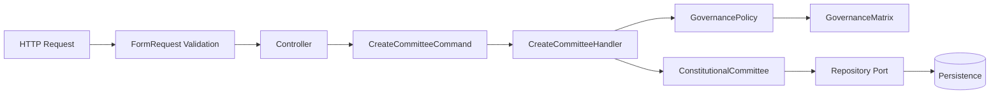

Below is the **Canonical API Integration Runbook (TDD-first, Clean Architecture, DDD-safe)** for wiring your new `CreateCommittee` canonical flow into HTTP without leaking domain logic.

---

# 0. Objective

Expose a stable API endpoint:

```
POST /organisations/{org}/committees/api/create-canonical
```

That executes:

```
HTTP → Application Layer → Domain (Policy + Aggregate) → Repository
```

**Guarantees:**

* No domain rules in HTTP layer
* No duplication of governance validation
* Fully test-driven integration
* Clean separation of concerns

---

# 1. Target Architecture



---

# 2. Phase 1 — Feature Test First (RED)

## 2.1 Create Feature Test

📄 `tests/Feature/Committee/CreateCommitteeApiTest.php`

```php
final class CreateCommitteeApiTest extends TestCase
{
    public function test_creates_committee_successfully(): void
    {
        $payload = [
            'name' => 'Health Committee',
            'governanceLevel' => 2,
            'geoUnitId' => 1,
        ];

        $response = $this->postJson(
            '/organisations/1/committees/api/create-canonical',
            $payload
        );

        $response->assertStatus(201);
        $response->assertJsonStructure([
            'committeeId'
        ]);
    }

    public function test_rejects_invalid_governance_assignment(): void
    {
        $payload = [
            'name' => 'Invalid Committee',
            'governanceLevel' => 2,
            'geoUnitId' => 999,
        ];

        $response = $this->postJson(
            '/organisations/1/committees/api/create-canonical',
            $payload
        );

        $response->assertStatus(422);
    }
}
```

👉 Expected: ❌ FAIL (route + controller not exist yet)

---

# 3. Phase 2 — Request Layer (Validation Boundary)

## 3.1 Create Request DTO

📄 `CreateCommitteeRequest.php`

```php
final class CreateCommitteeRequest extends FormRequest
{
    public function rules(): array
    {
        return [
            'name' => ['required', 'string'],
            'governanceLevel' => ['required', 'integer'],
            'geoUnitId' => ['required', 'integer'],
        ];
    }
}
```

---

## Why this layer exists

* Only structural validation
* No domain knowledge
* No matrix logic
* Keeps HTTP clean

---

# 4. Phase 3 — Controller (Thin Adapter)

📄 `CreateCommitteeController.php`

```php
final class CreateCommitteeController
{
    public function __construct(
        private CreateCommitteeHandler $handler
    ) {}

    public function store(CreateCommitteeRequest $request): JsonResponse
    {
        $command = new CreateCommitteeCommand(
            $request->input('name'),
            new GovernanceAssignment(
                (int) $request->input('governanceLevel'),
                GeoUnitId::fromInt((int) $request->input('geoUnitId'))
            )
        );

        $committeeId = $this->handler->handle($command);

        return response()->json([
            'committeeId' => $committeeId
        ], 201);
    }
}
```

---

## Controller rules (strict)

✔ No policy usage
✔ No repository access
✔ No business decisions
✔ Only mapping + delegation

---

# 5. Phase 4 — Route Registration

📄 `routes/api.php`

```php
Route::post(
    '/organisations/{org}/committees/api/create-canonical',
    [CreateCommitteeController::class, 'store']
);
```

---

# 6. Phase 5 — Exception Mapping (Critical)

You MUST translate domain failures into HTTP responses.

---

## 6.1 Add Exception Handler mapping

📄 `Handler.php` (or middleware layer)

```php
public function render($request, Throwable $e)
{
    if ($e instanceof DomainException) {
        return response()->json([
            'error' => $e->getMessage()
        ], 422);
    }

    return parent::render($request, $e);
}
```

---

## Why this matters

Without this:

* policy failures become 500 errors ❌
* API becomes unstable ❌
* frontend cannot differentiate validation vs domain rejection ❌

---

# 7. Phase 6 — Application Wiring (DI)

Ensure:

```php
CreateCommitteeHandler
    ├── GovernancePolicy
    ├── CommitteeRepositoryPort
    └── EventBusPort
```

Registered in service container.

---

# 8. Phase 7 — TDD GREEN Validation

Run:

```bash
php artisan test tests/Feature/Committee/CreateCommitteeApiTest.php
```

Expected:

```
✔ creates_committee_successfully
✔ rejects_invalid_governance_assignment
```

---

# 9. Phase 8 — Full System Verification

Run full suite:

```bash
php artisan test
```

Ensure:

* No regression in GovernancePolicy tests
* No regression in CreateCommitteeUseCase tests
* Architecture tests remain green

---

# 10. Clean Architecture Checklist (NON-NEGOTIABLE)

### HTTP Layer

✔ No domain logic
✔ No policy calls
✔ Only mapping

### Application Layer

✔ Orchestration only
✔ No validation rules

### Domain Layer

✔ All rules in GovernancePolicy
✔ Aggregate enforces invariants

### Infrastructure

✔ Repository only persistence

---

# 11. Resulting Flow (Final State)

```
POST /create-canonical
        ↓
FormRequest (validation only)
        ↓
Controller (mapping only)
        ↓
Handler (orchestration)
        ↓
GovernancePolicy (rule engine)
        ↓
Aggregate (Committee)
        ↓
Repository (persist)
```

---

# 12. Outcome

After this runbook:

* Your matrix engine becomes **fully usable from UI**
* Domain rules remain **centrally enforced**
* HTTP layer stays **stable and replaceable**
* You gain a **true clean DDD vertical slice**

---

If you want next step, I can extend this into:

### 🚀 “Production Hardening Runbook”

* idempotency
* distributed locking for committee creation
* audit/event outbox pattern
* multi-tenant org isolation (`orgId` enforcement)
* API versioning strategy (`/api/v1/canonical`)

Just tell me.
