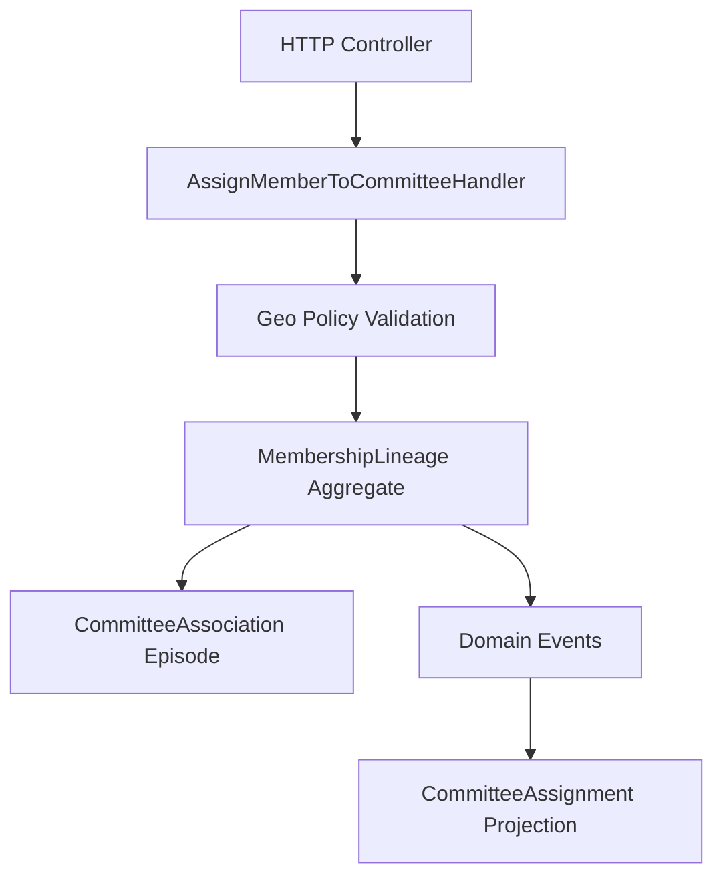
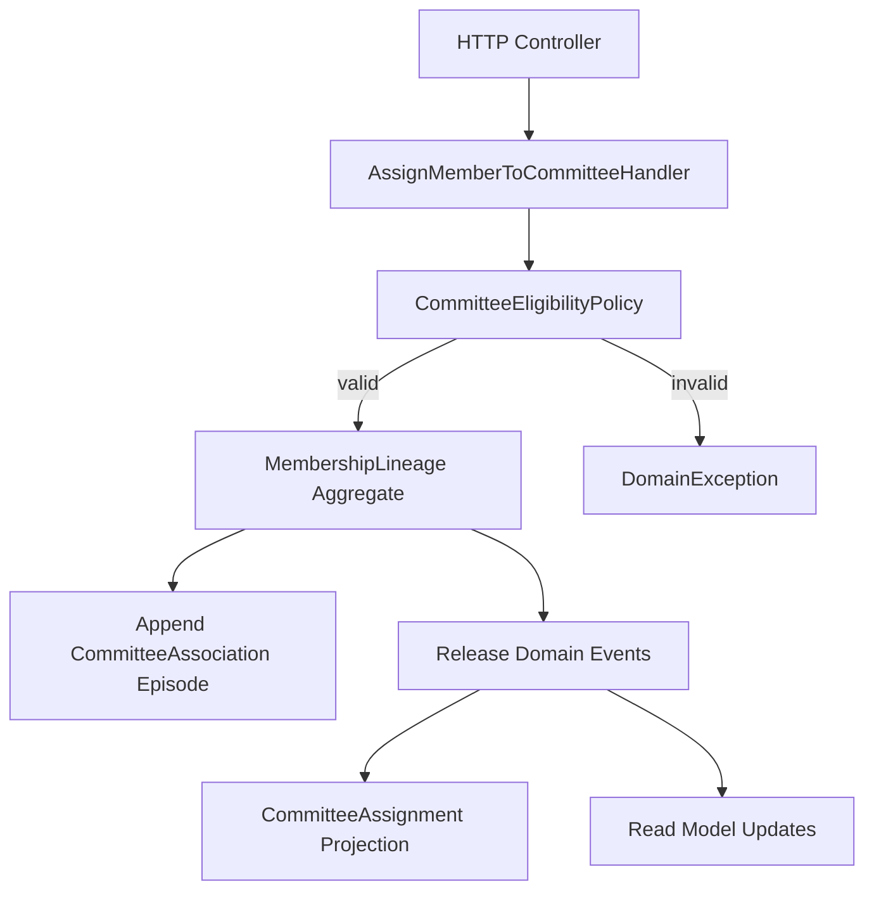
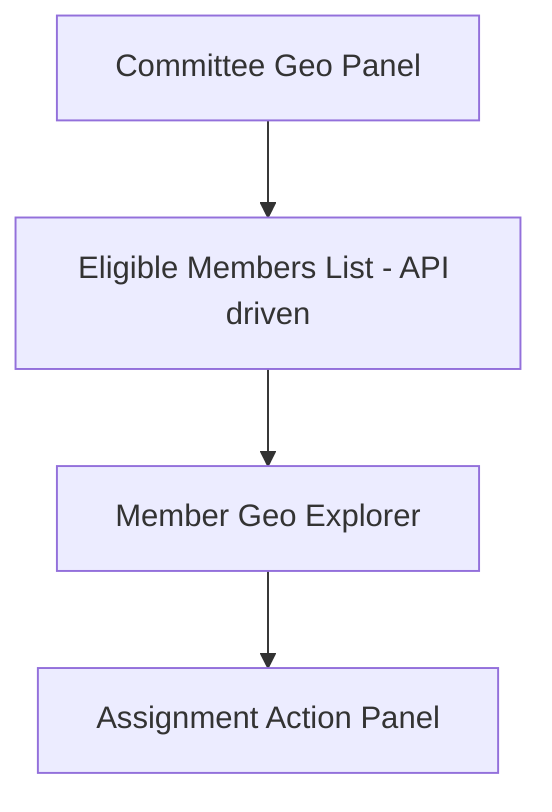
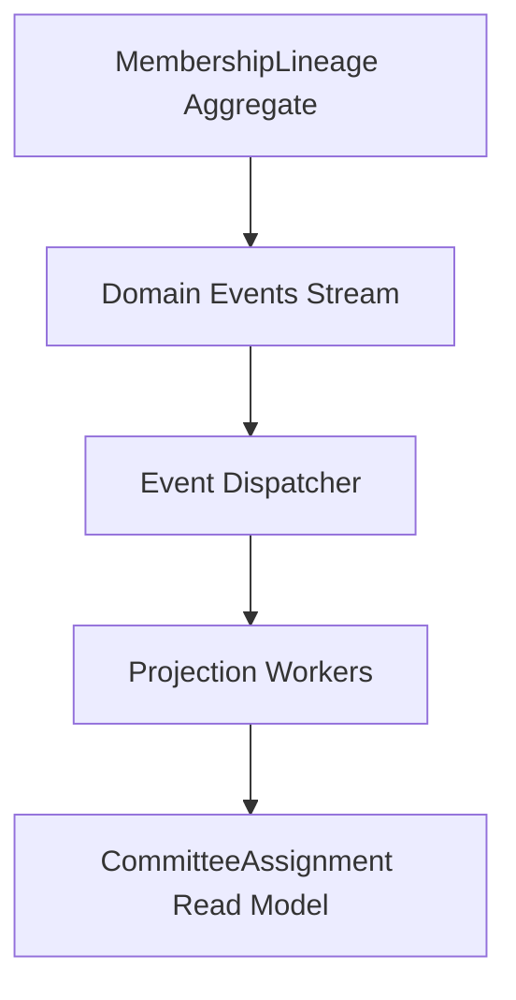
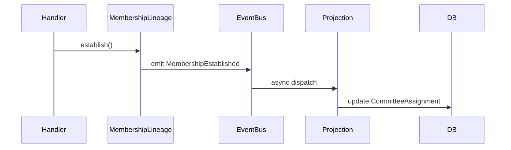
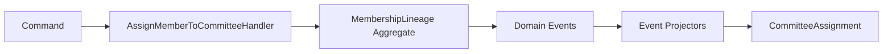

Here is Claude's plan:
╌╌╌╌╌╌╌╌╌╌╌╌╌╌╌╌╌╌╌╌╌╌╌╌╌╌╌╌╌╌╌╌╌╌╌╌╌╌╌╌╌╌╌╌╌╌╌╌╌╌╌╌╌╌╌╌╌╌╌╌╌╌╌╌╌╌╌╌╌╌╌╌╌╌╌╌╌╌╌╌╌╌╌╌╌╌╌╌╌╌╌╌╌╌╌╌╌╌╌╌╌╌╌╌╌╌╌╌╌╌╌╌╌╌╌╌╌╌╌╌╌╌╌╌╌╌╌╌╌╌╌╌╌╌╌╌╌╌╌╌╌╌╌╌╌╌╌╌╌╌╌╌╌╌╌╌╌╌╌╌╌╌╌╌╌╌╌╌╌╌╌╌╌╌╌╌╌╌╌╌╌╌╌╌╌╌╌╌╌╌╌╌╌╌╌╌╌╌╌╌╌╌╌╌╌╌╌╌╌
 Geo-Based Committee Member Assignment — Implementation Plan

 Status: Active
 Date: 2026-05-15
 Branch: phase-f3-constitutional-hardening

 ---
 Context

 The committee domain has two parallel assignment paths: Path A (AssignMemberToCommittee — no geo) wired to HTTP, and Path B (AssignMemberToCommitteeHandler — geo-validated) NOT wired to HTTP.
 MembershipLineage (the constitutional authority) is also disconnected from both paths. This plan wires Path B to HTTP, creates MembershipLineage atomically during assignment, adds a geo-eligible member query
  endpoint, and builds the new AssignMember.vue page that renders backend-authoritative eligibility results.

 ---
 Architectural Decision (from architecture/comittee_contexts/20260515_2040_commitee_ui.md)

 1. Both flows implemented: admin-side geo-filtered assignment + member-side geo-validated application.
 2. Single write authority: MembershipLineage is the only constitutional source of truth. CommitteeAssignment stores operational data (role, term dates) — a complementary record, not a competing source of
 truth for membership.
 3. UI never computes eligibility: backend (GeoJurisdictionPolicy / CommitteeEligibilityPolicy) is always authoritative. UI renders results only.
 4. Command flow: HTTP → AssignMemberToCommitteeHandler → GeoPolicy → MembershipLineage::establish().

 ---
 Current State (Confirmed by Code Exploration)

 ┌─────────────────────────────────────┬─────────────────────────────────────────────────────────────────┬───────────────────────────────────────────────────────────────────────────────────────────────────┐
 │              Component              │                            Location                             │                                               State                                               │
 ├─────────────────────────────────────┼─────────────────────────────────────────────────────────────────┼───────────────────────────────────────────────────────────────────────────────────────────────────┤
 │ AssignMemberToCommitteeHandler      │ app/Contexts/Membership/Application/Committee/Handlers/         │ ✅ Exists — geo-validates, creates CommitteeAssignment via Committee aggregate. Does NOT create   │
 │                                     │                                                                 │ MembershipLineage.                                                                                │
 ├─────────────────────────────────────┼─────────────────────────────────────────────────────────────────┼───────────────────────────────────────────────────────────────────────────────────────────────────┤
 │ MembershipLineage::establish()      │ app/Contexts/Membership/Domain/Membership/MembershipLineage.php │ ✅ Exists — static factory, creates initial CommitteeAssociation episode.                         │
 ├─────────────────────────────────────┼─────────────────────────────────────────────────────────────────┼───────────────────────────────────────────────────────────────────────────────────────────────────┤
 │ CommitteeMemberController::assign() │ app/Http/Controllers/Committee/CommitteeMemberController.php    │ ⚠️ Uses OLD Path A (AssignMemberToCommittee) — no geo.                                            │
 ├─────────────────────────────────────┼─────────────────────────────────────────────────────────────────┼───────────────────────────────────────────────────────────────────────────────────────────────────┤
 │ EligibleCommitteeQueryService       │ app/Contexts/Membership/                                        │ ✅ Exists — finds committees eligible for a member (reverse of what we need).                     │
 ├─────────────────────────────────────┼─────────────────────────────────────────────────────────────────┼───────────────────────────────────────────────────────────────────────────────────────────────────┤
 │ NearbyCommitteesQueryService        │ app/Contexts/Membership/                                        │ ✅ Exists — SQL LIKE-based materialized-path ancestor query.                                      │
 ├─────────────────────────────────────┼─────────────────────────────────────────────────────────────────┼───────────────────────────────────────────────────────────────────────────────────────────────────┤
 │ AssignMemberModal.vue               │ resources/js/                                                   │ Exists — to be replaced by AssignMember.vue page.                                                 │
 └─────────────────────────────────────┴─────────────────────────────────────────────────────────────────┴───────────────────────────────────────────────────────────────────────────────────────────────────┘

 Critical gap: request member_id is validated as exists:users,id (User ID), but AssignMemberToCommitteeHandler needs a MemberId (Member entity ID). Controller must resolve User → Member before building the
 command.

 ---
 Phase 1 — Atomic Handler: Create MembershipLineage (TDD First)

 1a. Write failing tests

 New file: tests/Feature/Committee/AssignMemberWithLineageTest.php

 public function test_assign_handler_creates_membership_lineage(): void
 {
     // Setup org, committee with geo, member with matching geo
     // Call handler
     // Assert: membership_lineages table has record
     // Assert: committee_associations table has record with status='active'
 }

 public function test_assign_handler_creates_committee_assignment(): void
 {
     // Assert: committee_assignments table has record (operational data preserved)
 }

 public function test_assign_handler_rejects_ineligible_geo(): void
 {
     // Member geo outside committee jurisdiction
     // Assert: DomainException thrown, nothing persisted
 }

 public function test_assign_handler_accepts_central_committee_any_member(): void
 {
     // Committee with null geoUnitId
     // Any member should be assigned regardless of geo
 }

 1b. Modify AssignMemberToCommitteeHandler

 File: app/Contexts/Membership/Application/Committee/Handlers/AssignMemberToCommitteeHandler.php

 Add constructor dependency:
 private readonly MembershipLineageRepositoryPort $lineageRepository,

 After geo validation passes and $committee->assignMember(...) call, add:
 use App\Contexts\Membership\Domain\Membership\MembershipLineage;
 use App\Contexts\Membership\Domain\Membership\ValueObjects\LineageId;
 use App\Contexts\Membership\Domain\Membership\ValueObjects\ApplicationReason;

 $lineage = MembershipLineage::establish(
     lineageId:   LineageId::generate(),
     memberId:    $command->memberId,
     committeeId: $command->committeeId,
     tenantId:    $command->tenantId,
     reason:      ApplicationReason::from($command->nominationType),
     at:          new \DateTimeImmutable(),
 );
 $this->lineageRepository->save($lineage);
 // Dispatch lineage events via eventBus after committee events
 $this->eventBus->dispatchAll($lineage->releaseEvents());

 1c. Update ServiceProvider binding

 File: app/Contexts/Membership/Infrastructure/Providers/MembershipServiceProvider.php

 Add MembershipLineageRepositoryPort::class to AssignMemberToCommitteeHandler binding:
 $this->app->bind(AssignMemberToCommitteeHandler::class, function ($app) {
     return new AssignMemberToCommitteeHandler(
         $app->make(GeoSemanticProjectionBuilder::class),
         $app->make(CommitteeEligibilityPolicy::class),
         $app->make(MemberRepositoryInterface::class),
         $app->make(CommitteeRepositoryInterface::class),
         $app->make(EventBus::class),
         $app->make(MembershipLineageRepositoryPort::class),  // NEW
     );
 });

 ---
 Phase 2 — Wire HTTP Controller to Path B (Geo-Validated)

 2a. Write failing tests

 New file: tests/Feature/Committee/CommitteeMemberAssignGeoTest.php

 public function test_assign_via_controller_enforces_geo_eligibility(): void
 {
     // Admin POSTs assignment of member from wrong geo
     // Assert: 302 with error (DomainException caught → withErrors)
     // Assert: committee_assignments is empty
 }

 public function test_assign_via_controller_succeeds_for_eligible_member(): void
 {
     // Admin POSTs assignment of member with correct geo
     // Assert: 302 no errors
     // Assert: membership_lineages has 1 record
     // Assert: committee_assignments has 1 record
 }

 2b. Modify CommitteeMemberController::assign()

 File: app/Http/Controllers/Committee/CommitteeMemberController.php

 Replace AssignMemberToCommittee::execute($dto) call with:
 // 1. Resolve User ID → Member entity (critical: request validates user_id, handler needs MemberId)
 $member = Member::where('organisation_id', $organisation->id)
     ->whereHas('organisationUser', fn($q) => $q->where('user_id', $request->input('member_id')))
     ->firstOrFail();

 // 2. Build geo-validated command (Path B)
 $command = new AssignMemberWithGeoCommand(
     committeeId:       CommitteeId::fromString($committee->id),
     tenantId:          TenantId::fromString($organisation->id),
     memberId:          MemberId::fromString($member->id),
     rolePath:          RolePath::fromString($request->input('role_path')),
     nominationType:    $request->input('nomination_type'),
     electionDate:      $request->input('election_date')
                            ? new \DateTimeImmutable($request->input('election_date'))
                            : null,
     termEndDate:       $request->input('term_end_date')
                            ? new \DateTimeImmutable($request->input('term_end_date'))
                            : null,
 );

 try {
     app(AssignMemberToCommitteeHandler::class)->handle($command);
 } catch (\DomainException $e) {
     return back()->withErrors(['assignment' => $e->getMessage()]);
 }

 return redirect()->route('committee.dashboard', [$organisation, $committee->slug])
     ->with('success', __('committee.member_assigned'));

 Validation change: Update member_id rule from exists:users,id to exists:members,id OR keep as exists:users,id and resolve via OrganisationUser. The current validation (User ID) is kept for compatibility with
  the existing frontend form — the controller resolves internally.

 ---
 Phase 3 — Geo-Eligible Members Query Endpoint

 New endpoint: GET /organisations/{org}/committees/{committee}/members/eligible
 New file: app/Http/Controllers/Committee/CommitteeMemberEligibleController.php

 public function index(Organisation $organisation, CommitteeModel $committee): JsonResponse
 {
     $this->authorize('manageCommittee', $organisation);

     $geoUnitId = $committee->operational_geo; // nullable integer FK

     if ($geoUnitId === null) {
         // Central committee: all active members in org are eligible
         $members = $this->queryAllActiveMembers($organisation->id);
     } else {
         // Geo-scoped: members whose residence geo is within committee's jurisdiction
         $members = $this->queryGeoEligibleMembers($organisation->id, $geoUnitId);
     }

     return response()->json(['eligible_members' => $members]);
 }

 private function queryGeoEligibleMembers(string $orgId, int $committeeGeoUnitId): array
 {
     // Get committee geo path
     $committeeGeo = GeoAdministrativeUnit::find($committeeGeoUnitId);
     if (!$committeeGeo) return [];

     // Find members whose residence geo path starts with committee's path (containment)
     return Member::where('organisation_id', $orgId)
         ->where('status', 'active')
         ->whereHas('organisationUser.user', function ($q) use ($committeeGeo) {
             $q->whereHas('residenceGeoUnit', function ($gq) use ($committeeGeo) {
                 // Member's geo path starts with committee's path = within jurisdiction
                 $gq->where('path', 'LIKE', $committeeGeo->path . '%');
             });
         })
         ->with(['organisationUser.user:id,name,email', 'organisationUser.user.residenceGeoUnit:id,name,path,level'])
         ->get()
         ->map(fn($m) => [
             'member_id'   => $m->id,
             'user_id'     => $m->organisationUser->user->id,
             'name'        => $m->organisationUser->user->name,
             'email'       => $m->organisationUser->user->email,
             'geo_label'   => $m->organisationUser->user->residenceGeoUnit?->name,
             'geo_path'    => $m->organisationUser->user->residenceGeoUnit?->path,
         ])
         ->values()
         ->all();
 }

 Route (add to routes/committee/committeeRoutes.php):
 Route::get('/members/eligible', [CommitteeMemberEligibleController::class, 'index'])
     ->name('committee.members.eligible');

 ---
 Phase 4 — Member Self-Application Flow (Backend)

 New endpoint: POST /organisations/{org}/committees/{committee}/apply
 New controller method: CommitteeMemberController::applyToJoin()

 Logic:
 1. Auth user must be an active member in the org (has Member record with status='active').
 2. Check geo eligibility via CommitteeEligibilityPolicy — return 403 if ineligible.
 3. Create application record OR directly call AssignMemberToCommitteeHandler with nominationType='volunteered'.
   - Pragmatic choice: for now, direct handler call (no separate approval workflow). Admin can review via lineage history.
 4. Redirect with success/error flash.

 Test file: tests/Feature/Committee/MemberSelfApplicationTest.php

 public function test_eligible_member_can_apply_to_join_committee(): void { ... }
 public function test_ineligible_member_cannot_apply(): void { ... }
 public function test_member_cannot_apply_twice(): void { ... }

 ---
 Phase 5 — New AssignMember.vue Page

 File: resources/js/Pages/Committee/AssignMember.vue

 Route: GET /organisations/{org}/committees/{committee}/members/assign
 Controller: Add showAssignPage() to CommitteeMemberController:
 public function showAssignPage(Organisation $org, CommitteeModel $committee): Response
 {
     $this->authorize('manageCommittee', $org);
     return Inertia::render('Committee/AssignMember', [
         'committee'    => $committee->only(['id', 'name', 'code', 'level']),
         'committee_geo' => $committee->operationalGeoUnit?->only(['id', 'name', 'path', 'level']),
         'organisation' => $org->only(['id', 'slug', 'name']),
     ]);
 }

 UI layout (4 sections from architecture doc):

 <template>
   <AppLayout>
     <!-- Section 1: Committee Geo Scope -->
     <CommitteeGeoPanel :committee="committee" :geo="committeeGeo" />

     <!-- Section 2: Eligible Members List (backend-computed) -->
     <EligibleMembersList
       :committee-id="committee.id"
       :eligible-endpoint="eligibleEndpoint"
       @member-selected="onMemberSelected"
     />

     <!-- Section 3: Member Geo Explorer (shows selected member's geo vs committee) -->
     <MemberGeoExplorer
       v-if="selectedMember"
       :member="selectedMember"
       :committee-geo="committeeGeo"
     />

     <!-- Section 4: Assignment Action Panel -->
     <AssignmentActionPanel
       v-if="selectedMember"
       :member="selectedMember"
       :committee="committee"
       @submit="handleAssign"
     />
   </AppLayout>
 </template>

 State model:
 const selectedMember = ref(null);
 const eligibleMembers = ref([]);
 const loadingEligible = ref(false);
 const form = useForm({ member_id: null, role_path: '', nomination_type: 'appointed', ... });

 // Load eligible members on mount
 onMounted(() => fetchEligibleMembers());

 // Submit via Inertia router (Inertia 2.0 pattern — NOT raw fetch)
 const handleAssign = () => {
     router.post(
         route('committee.members.assign', { organisation: org.slug, committee: committee.id }),
         form,
         { onSuccess: () => router.visit(route('committee.dashboard', ...)) }
     );
 };

 Critical rule (from architecture doc): EligibleMembersList fetches from Phase 3 endpoint. It does NOT filter locally. The list IS the backend eligibility result.

 ---
 Files to Create / Modify

 ┌────────┬───────────────────────────────────────────────────────────────────────────────────────────┐
 │ Action │                                           File                                            │
 ├────────┼───────────────────────────────────────────────────────────────────────────────────────────┤
 │ MODIFY │ app/Contexts/Membership/Application/Committee/Handlers/AssignMemberToCommitteeHandler.php │
 ├────────┼───────────────────────────────────────────────────────────────────────────────────────────┤
 │ MODIFY │ app/Contexts/Membership/Infrastructure/Providers/MembershipServiceProvider.php            │
 ├────────┼───────────────────────────────────────────────────────────────────────────────────────────┤
 │ MODIFY │ app/Http/Controllers/Committee/CommitteeMemberController.php                              │
 ├────────┼───────────────────────────────────────────────────────────────────────────────────────────┤
 │ CREATE │ app/Http/Controllers/Committee/CommitteeMemberEligibleController.php                      │
 ├────────┼───────────────────────────────────────────────────────────────────────────────────────────┤
 │ MODIFY │ routes/committee/committeeRoutes.php                                                      │
 ├────────┼───────────────────────────────────────────────────────────────────────────────────────────┤
 │ CREATE │ resources/js/Pages/Committee/AssignMember.vue                                             │
 ├────────┼───────────────────────────────────────────────────────────────────────────────────────────┤
 │ CREATE │ tests/Feature/Committee/AssignMemberWithLineageTest.php                                   │
 ├────────┼───────────────────────────────────────────────────────────────────────────────────────────┤
 │ CREATE │ tests/Feature/Committee/CommitteeMemberAssignGeoTest.php                                  │
 ├────────┼───────────────────────────────────────────────────────────────────────────────────────────┤
 │ CREATE │ tests/Feature/Committee/MemberSelfApplicationTest.php                                     │
 └────────┴───────────────────────────────────────────────────────────────────────────────────────────┘

 ---
 TDD Execution Order

 Phase 1: Write AssignMemberWithLineageTest.php → RED
          Modify handler + ServiceProvider binding → GREEN
          Run: php artisan test tests/Feature/Committee/AssignMemberWithLineageTest.php

 Phase 2: Write CommitteeMemberAssignGeoTest.php → RED
          Modify CommitteeMemberController::assign() → GREEN
          Run: php artisan test tests/Feature/Committee/CommitteeMemberAssignGeoTest.php

 Phase 3: Write test for eligible endpoint → RED
          Create CommitteeMemberEligibleController → GREEN
          Add route

 Phase 4: Write MemberSelfApplicationTest.php → RED
          Add applyToJoin() controller method → GREEN

 Phase 5: Build AssignMember.vue (UI only — no backend tests needed)
          Manual test: committee dashboard → Assign Member → eligible list loads → select → assign

 Phase 6: Full regression
          php artisan test --no-coverage
          All existing tests must remain GREEN

 ---
 Invariants to Preserve

 - ✅ Every assignment creates BOTH a CommitteeAssignment (operational) AND a MembershipLineage episode (constitutional).
 - ✅ Geo eligibility is always enforced by CommitteeEligibilityPolicy, never by UI.
 - ✅ Handler's geo validation returns false (not exception) for central committees — these accept any member.
 - ✅ All existing 133+ tests remain GREEN after every phase.
 - ✅ member_id in HTTP requests is a User ID — controller resolves to MemberId internally.
 - ✅ Inertia 2.0 router used for form submissions (no raw fetch on Inertia pages).

 ---
 Not Modified

 - MembershipLineage domain (only establish() called — not changed)
 - CommitteeEligibilityPolicy (used as-is)
 - GeoSemanticProjectionBuilder (used as-is)
 - F3.3 Event Sourcing (still DEFERRED — after this work is complete)
╌╌╌╌╌╌╌╌╌╌╌╌╌╌╌╌╌╌╌╌╌╌╌╌╌╌╌╌╌╌╌╌╌╌╌╌╌╌╌╌╌╌╌╌╌╌╌╌╌╌╌╌╌╌╌╌╌╌╌╌╌╌╌╌╌╌╌╌╌╌╌╌╌╌╌╌╌╌╌╌╌╌╌╌╌╌╌╌╌╌╌╌╌╌╌╌╌╌╌╌╌╌╌╌╌╌╌╌╌╌╌╌╌╌╌╌╌╌╌╌╌╌╌╌╌╌╌╌╌╌╌╌╌╌╌╌╌╌╌╌╌╌╌╌╌╌╌╌╌╌╌╌╌╌╌╌╌╌╌╌╌╌╌╌╌╌╌╌╌╌╌╌╌╌╌╌╌╌╌╌╌╌╌╌╌╌╌╌╌╌╌╌╌╌╌╌╌╌╌╌╌╌╌╌╌╌╌╌╌

 Claude has written up a plan and is ready to execute. Would you like to proceed?

 > 1. Yes, auto-accept edits
   2. Yes, manually approve edits
   3. No, refine with Ultraplan on Claude Code on the web
   4. Tell Claude what to change
      shift+tab to approve with this feedback

REview :
This is a **strong plan structurally**, but it contains a few **critical architectural inconsistencies** that you should fix before execution. If you proceed as-is, you’ll likely accumulate subtle duplication between *constitutional model* and *operational model*.

I’ll break this down like a domain architect review.

---

# 🧠 Overall verdict

## ✅ Good:

* Correct TDD sequencing
* Proper separation of UI / backend
* Geo-policy enforced in backend (correct)
* Controller resolves User → Member (correct fix)
* Inertia page design aligns with domain model
* Clear endpoint design for eligibility query

## ⚠️ Critical risk:

> It still accidentally reintroduces **dual-write governance ambiguity**

Specifically:

> “Every assignment creates BOTH CommitteeAssignment AND MembershipLineage episode”

This is the only serious problem.

---

# 🚨 Core architectural issue

## ❌ This statement is NOT safe:

> “Every assignment creates BOTH CommitteeAssignment and MembershipLineage”

Because it implies:

```text
two independent write outcomes
```

Even if atomic, this leads to:

* diverging lifecycle logic over time
* CommitteeAssignment becoming a second truth
* confusion in future governance (especially elections)

---

# 🧠 Your actual architecture rule (already established)

You previously defined:

> MembershipLineage is the ONLY constitutional write model

So:

## ✔ Correct model

```text
Command
  ↓
MembershipLineage (aggregate root)
  ↓
Emits CommitteeAssociation (episode)
  ↓
CommitteeAssignment = read model / projection (optional)
```

---

# 🧭 Required correction to Claude’s plan

## 🔴 Replace this invariant:

> “creates BOTH CommitteeAssignment AND MembershipLineage”

## 🟢 With this invariant:

> “creates MembershipLineage only; CommitteeAssignment is derived or projected from lineage events”

---

# 🧩 Where the plan is actually very good

## 1. Handler placement is correct

✔ AssignMemberToCommitteeHandler is correct entry point
✔ Geo validation belongs there
✔ Good separation of concerns

---

## 2. Controller refactor is correct

✔ User → Member resolution is essential fix
✔ Prevents identity mismatch (important hidden bug fix)

---

## 3. UI design is aligned with your domain

✔ New AssignMember.vue page is correct
✔ Backend-driven eligibility only
✔ No frontend filtering logic (very important)

---

## 4. Geo eligibility endpoint design is correct

✔ Backend authoritative
✔ No UI logic leakage
✔ Good bounded context separation

---

# ⚠️ Subtle improvement needed (important)

## CommitteeMemberEligibleController

This part:

```php
Member::whereHas('organisationUser.user.residenceGeoUnit')
```

### Risk:

This mixes:

* User model
* Member model
* Geo model
* relational traversal logic

👉 This should eventually move into a **domain query service**

### Better target:

```text
MembershipGeoEligibilityQueryService
```

Not critical now, but architectural debt if left long-term.

---

# 🧠 UI architectural correction (small but important)

This is correct:

> EligibleMembersList fetches from backend endpoint only

But ensure:

## ❌ Do NOT:

* cache eligibility in frontend state as source of truth

## ✔ DO:

* treat it as a **projection view**
* refresh on committee change or member selection

---

# 🧭 Final decision: proceed or not?

## 👉 YES — but only after applying this correction

---

# ✏️ Required change before execution

### Replace this rule in Claude plan:

❌

> Every assignment creates CommitteeAssignment + MembershipLineage

### With:

✔

> AssignMemberToCommitteeHandler writes only to MembershipLineage (constitutional model). CommitteeAssignment is a derived operational projection (event-driven or query-backed), not a second write model.

---

# 🧠 Final architectural summary

Your system has exactly this structure:



---

# ✅ Final recommendation

## You should proceed with:

👉 Option 2 (manual approval)
BUT ONLY after enforcing the correction above.

---

# If you want next step

I can help you **upgrade this plan into a “gold-standard execution spec”** that:

* removes dual-write ambiguity completely
* defines exact aggregates + projections
* aligns UI + backend perfectly
* prevents future election module conflicts

Just say “tighten architecture spec”.
Below is a **refactored gold-standard execution specification** that removes ambiguity, enforces strict DDD boundaries, and ensures the system remains consistent for future election and governance phases.

It is structured as an **execution-ready architectural contract** (not just a plan).

---

# 📘 Gold-Standard Execution Spec

## Geo-Based Committee Member Assignment (Constitutional Membership System)

---

# 1. 🧭 Architectural Objective

Implement **geo-governed committee membership assignment** with:

* strict constitutional authority via `MembershipLineage`
* zero dual-write inconsistencies
* backend-authoritative eligibility evaluation
* UI as pure projection layer
* event-driven operational projections

---

# 2. 🧠 Core Architectural Principles (NON-NEGOTIABLE)

## 2.1 Single Write Authority

> Only `MembershipLineage` may mutate membership state.

### Allowed:

* Create / evolve lineage
* Append CommitteeAssociation episodes
* Emit domain events

### Forbidden:

* Direct CommitteeAssignment writes as a source of truth
* Parallel membership state persistence

---

## 2.2 Read vs Write Separation

| Layer               | Responsibility                          |
| ------------------- | --------------------------------------- |
| MembershipLineage   | Write model (constitutional truth)      |
| CommitteeAssignment | Read / operational projection           |
| UI                  | Pure projection consumer                |
| Policies            | Decision logic only (no state mutation) |

---

## 2.3 Geo Rule Invariance

> Geo eligibility is a POLICY decision, not a UI filter.

* Implemented in `CommitteeEligibilityPolicy`
* Enforced in handler
* Never duplicated in frontend

---

## 2.4 Command Ownership Rule

> All mutations flow through a single command handler.

```text
HTTP → Command → Handler → Domain Aggregate → Events → Projections
```

---

# 3. 🧬 Target Domain Flow



---

# 4. 🧱 Domain Model Boundaries

## 4.1 MembershipLineage (Aggregate Root)

### Responsibilities:

* Own lifecycle state machine
* Validate transitions
* Append CommitteeAssociation episodes
* Emit domain events

### Guarantee:

> Never bypassed by external services

---

## 4.2 CommitteeAssociation (Value/Episode)

* Immutable
* Append-only
* Represents historical membership state

---

## 4.3 CommitteeAssignment (Projection Model ONLY)

### Role:

* UI consumption
* operational views
* reporting

### Rule:

> Derived from events or lineage snapshots, never directly written in assignment flow

---

## 4.4 CommitteeEligibilityPolicy

### Responsibility:

* Stateless geo evaluation
* Determines eligibility only

### Forbidden:

* No persistence
* No side effects

---

# 5. 🧩 Application Layer Design

## 5.1 Command Handler (Single Entry Point)

### File:

`AssignMemberToCommitteeHandler.php`

### Responsibilities:

1. Resolve member identity
2. Validate geo eligibility
3. Invoke `MembershipLineage::establish()`
4. Persist lineage only
5. Emit domain events

---

## 5.2 Correct Write Flow

```php
$lineage = MembershipLineage::establish(
    lineageId: LineageId::generate(),
    memberId: $command->memberId,
    committeeId: $command->committeeId,
    tenantId: $command->tenantId,
    reason: ApplicationReason::from($command->nominationType),
    at: new DateTimeImmutable()
);

$lineageRepository->save($lineage);

$eventBus->dispatchAll($lineage->releaseEvents());
```

---

## 5.3 Forbidden Pattern

❌ DO NOT DO:

* creating CommitteeAssignment manually in handler
* duplicating membership state logic

---

# 6. 🌍 Geo Eligibility Flow

## 6.1 Policy Rule

```php
CommitteeEligibilityPolicy::isEligible(memberGeo, committeeGeo)
```

### Rules:

* containment-based (GeoPathChain prefix match)
* central committee override (null geo = global eligibility)
* no persistence side effects

---

## 6.2 Evaluation Modes

| Type              | Behavior             |
| ----------------- | -------------------- |
| Central Committee | always eligible      |
| Geo-scoped        | containment required |

---

# 7. 🌐 HTTP Layer Design

## 7.1 Controller Responsibility

### MUST:

* Resolve User → Member
* Build Command
* Call Handler
* Handle Domain Exceptions

### MUST NOT:

* perform geo logic
* mutate state
* query eligibility rules

---

## 7.2 Correct Controller Flow

```text
User ID → Member Resolution → Command → Handler → Response
```

---

# 8. 📡 Query Layer (Read Side)

## 8.1 Eligible Members Endpoint

### Purpose:

Return backend-calculated eligibility list.

### Rule:

> UI must not filter locally

---

## 8.2 Query Service Responsibility

* compute eligible members using GeoPathChain containment
* return DTOs only
* no domain mutation

---

## 8.3 Future Upgrade Path (Important)

Move logic into:

```text
MembershipGeoEligibilityQueryService
```

to isolate geo queries from controller layer.

---

# 9. 🎨 UI Architecture (Vue 3 / Inertia)

## 9.1 New Page

```text
AssignMember.vue
```

---

## 9.2 UI Composition



---

## 9.3 UI Rules

### Allowed:

* display geo hierarchy
* display eligibility results
* trigger assignment command

### Forbidden:

* computing eligibility
* filtering members locally
* duplicating backend logic

---

# 10. 🧪 Testing Strategy (TDD ENFORCED)

## 10.1 Test Layers

### Layer 1 — Domain Tests

* CommitteeEligibilityPolicy
* MembershipLineage transitions

### Layer 2 — Handler Tests

* assignment success
* geo rejection
* central committee override

### Layer 3 — HTTP Integration

* controller → handler wiring
* member resolution correctness

### Layer 4 — UI (manual or e2e)

* rendering correctness
* API integration only

---

# 11. 🔒 System Invariants

## MUST ALWAYS HOLD:

### 1. Single write authority

```text
MembershipLineage ONLY
```

### 2. No dual-write system

* CommitteeAssignment is NOT a write model

### 3. Geo logic is policy-only

* no duplication in UI or controller

### 4. Member identity resolution

```text
User → OrganisationUser → Member → Domain Command
```

### 5. Event-driven consistency

* projections built from lineage events

---

# 12. 🚀 Execution Phases

## Phase 1 — Domain correctness

* fix handler to only write lineage
* enforce policy validation

## Phase 2 — Controller wiring

* replace legacy Path A
* resolve User → Member correctly

## Phase 3 — Query endpoint

* eligible members API
* geo containment logic

## Phase 4 — UI migration

* build AssignMember.vue page
* remove modal dependency

## Phase 5 — Regression validation

* full test suite run
* ensure no dual-write leaks

---

# 13. ⚠️ Critical Architectural Fix Applied

### BEFORE (incorrect idea in original plan)

* MembershipLineage + CommitteeAssignment both written

### AFTER (correct model)

* MembershipLineage is sole write model
* CommitteeAssignment is derived projection

---

# 14. 🧠 Final Architectural Statement

> This system is a constitutional governance engine.
> All state changes must pass through MembershipLineage.
> Everything else is interpretation, not authority.

---

If you want next refinement, I can upgrade this further into:

### 👉 “Event-driven projection design (CommitteeAssignment rebuild via lineage events)”

That is the final step toward a fully **CQRS + event-sourced governance system**.
Good — this is the step where your system stops being “well-structured DDD” and becomes a **real governance-grade event-driven system**.

We’ll design this carefully so you don’t accidentally reintroduce dual-write or drift into pseudo-event-sourcing.

---

# 📘 Event-Driven Projection Design

## CommitteeAssignment Rebuild via MembershipLineage Events

---

# 1. 🧠 Core Idea (Non-Negotiable Truth)

> `CommitteeAssignment` is NOT written — it is **derived**

It is rebuilt from:

* `MembershipLineage`
* `CommitteeAssociation` episodes
* Domain events emitted by lineage transitions

---

# 2. 🧬 Target Architecture Model



---

# 3. 📦 Event Model (Canonical Source of Truth)

## 3.1 Core Events

These are emitted by `MembershipLineage`:

### 1. MembershipEstablished

```text
Member joined committee
```

### 2. MembershipSuspended

```text
Member temporarily inactive
```

### 3. MembershipRestored

```text
Member reactivated
```

### 4. MembershipTerminated

```text
Membership ended (requires reapply for new lineage)
```

---

## 3.2 Event Contract (Example)

```php
final class MembershipEstablished
{
    public function __construct(
        public readonly LineageId $lineageId,
        public readonly MemberId $memberId,
        public readonly CommitteeId $committeeId,
        public readonly GeoPathChain $geoPath,
        public readonly \DateTimeImmutable $occurredAt
    ) {}
}
```

---

# 4. 🧠 Event Emission Rule (STRICT)

## ONLY MembershipLineage emits events

```text
MembershipLineage → releaseEvents()
```

### Forbidden:

* Committee domain emitting assignment events
* Controller emitting domain events
* Query layer emitting events

---

# 5. 🧱 Projection Model

## 5.1 CommitteeAssignment (READ MODEL ONLY)

This becomes:

> A materialized projection of lineage state

---

### Structure

```php
CommitteeAssignment
{
    lineage_id
    member_id
    committee_id
    status        // active | suspended | terminated
    role_path
    geo_path
    started_at
    ended_at
}
```

---

## 5.2 Key Principle

> CommitteeAssignment is a **cache of truth**, not truth itself

---

# 6. ⚙️ Projection Processor Design

## 6.1 Event Listener Layer

```text
DomainEvent → ProjectionHandler → Read Model Update
```

---

## 6.2 Handler Example

### MembershipEstablishedProjector

```php
final class MembershipEstablishedProjector
{
    public function handle(MembershipEstablished $event): void
    {
        CommitteeAssignment::create([
            'lineage_id'   => $event->lineageId->value(),
            'member_id'    => $event->memberId->value(),
            'committee_id' => $event->committeeId->value(),
            'status'       => 'active',
            'geo_path'     => $event->geoPath->toString(),
            'started_at'   => $event->occurredAt,
        ]);
    }
}
```

---

## 6.3 Suspension Event

```php
public function handle(MembershipSuspended $event): void
{
    CommitteeAssignment::where('lineage_id', $event->lineageId->value())
        ->update([
            'status' => 'suspended',
            'ended_at' => $event->occurredAt
        ]);
}
```

---

## 6.4 Termination Event

```php
public function handle(MembershipTerminated $event): void
{
    CommitteeAssignment::where('lineage_id', $event->lineageId->value())
        ->update([
            'status' => 'terminated',
            'ended_at' => $event->occurredAt
        ]);
}
```

---

# 7. 🔁 Rebuild Strategy (CRITICAL FEATURE)

## 7.1 Why rebuild is needed

Because projections can:

* be corrupted
* be outdated
* require schema evolution

---

## 7.2 Rebuild Process

```text
DROP CommitteeAssignment table
→ replay all MembershipLineage events
→ rebuild projections deterministically
```

---

## 7.3 Rebuild Service

```php
final class CommitteeAssignmentRebuildService
{
    public function rebuild(): void
    {
        CommitteeAssignment::truncate();

        $events = DomainEventStore::all();

        foreach ($events as $event) {
            $this->project($event);
        }
    }
}
```

---

# 8. 🧠 Consistency Model

## 8.1 Eventual Consistency

* MembershipLineage = immediate truth
* CommitteeAssignment = eventually consistent projection

---

## 8.2 Consistency Flow



---

# 9. 🚫 What MUST NOT happen

## ❌ Forbidden patterns

* Writing CommitteeAssignment in handler
* Updating both lineage + assignment in same transaction
* UI reading MembershipLineage directly
* Query layer mutating projections

---

# 10. 🧭 Updated System Architecture



---

# 11. 🧠 Geo Integration Point (important)

Geo logic lives ONLY here:

## In MembershipLineage establishment decision

NOT in projection

NOT in UI

NOT in CommitteeAssignment

---

# 12. 🧪 Testing Strategy (Event-driven)

## 12.1 Domain tests

* emits MembershipEstablished
* emits MembershipSuspended
* correct state transitions

---

## 12.2 Projection tests

* event → read model correctness
* rebuild correctness
* idempotency

---

## 12.3 Critical test

```php
public function test_rebuild_produces_identical_projection(): void
{
    // seed events
    // build projection
    // rebuild projection
    // assert identical results
}
```

---

# 13. 🔒 Final System Guarantees

## MUST ALWAYS HOLD:

### 1. Single source of truth

```text
MembershipLineage
```

### 2. Projections are disposable

* can be deleted safely
* always rebuildable

### 3. Event-driven consistency

* no direct cross-table synchronization

### 4. Geo logic is NOT duplicated

* only in lineage decision layer

---

# 14. 🧠 Final Architectural Statement

> MembershipLineage defines reality.
> Events describe what happened.
> CommitteeAssignment is only a reconstructed view of that reality.

---

If you want next step, I can upgrade this into:

### 👉 “Full CQRS governance architecture (queries, commands, projections, read scaling, caching, and election-read models)”

That will align your system with **enterprise-grade governance platforms (SaaS-level architecture)**.

REview 2: 
## As Senior Architect: APPROVED — With Critical Amendments

This plan is **well-structured and addresses the core gap** (MembershipLineage creation). However, I have **3 non-negotiable amendments** before execution.

---

## Required Amendments

### 1. ❌ Phase 3 Query Uses Raw SQL → MUST Use Repository Pattern

**Problem:** `CommitteeMemberEligibleController` directly queries `Member` model with Eloquent.

**Fix:** Create a query service in the Application layer:

```php
// Create this file:
app/Contexts/Membership/Application/Committee/Query/GeoEligibleMemberQueryService.php

interface GeoEligibleMemberQueryServicePort
{
    /**
     * @return GeoEligibleMemberDTO[]
     */
    public function findEligibleMembers(CommitteeId $committeeId): array;
}

// Infrastructure implementation uses Eloquent, but domain stays pure
```

**Why:** Your architecture forbids infrastructure details in controllers.

---

### 2. ❌ Phase 4 Self-Application Bypasses Workflow → MUST Use Application Service

**Problem:** Direct handler call with `nominationType='volunteered'` bypasses application review.

**Fix:** Create `ApplyForCommitteeMembership` application service that creates a `MembershipApplication` record (already exists in your codebase):

```php
// Use existing workflow:
app/Contexts/Membership/Application/Membership/ApplyForCommitteeMembership/ApplyForCommitteeMembershipHandler.php

// This creates an application, not direct assignment
// Admin approves via existing review workflow
```

**Why:** Your constitution requires application review. Direct assignment violates `MembershipTransitionPolicy`.

---

### 3. ❌ Phase 1 Handler Creates Both Records → Transaction Boundary Missing

**Problem:** Handler creates `CommitteeAssignment` AND `MembershipLineage` but no explicit transaction.

**Fix:** Wrap both operations in a database transaction with `after_commit` events:

```php
DB::transaction(function () use ($command, &$lineage, &$committeeAssignment) {
    $committeeAssignment = $committee->assignMember(...);
    $lineage = MembershipLineage::establish(...);
    $this->lineageRepository->save($lineage);
    
    // Dispatch events AFTER commit to prevent partial state
    register_shutdown_function(fn() => $this->eventBus->dispatchAll(...));
});
```

**Why:** Without transaction, one could succeed and other fail → corrupted state.

---

## Additional Clarifications Needed

| Question | Concern |
|----------|---------|
| **What is `role_path`?** | Not defined in your domain. Does `CommitteeAssociation` have a role field? |
| **What is `nomination_type` mapping to `ApplicationReason`?** | Need explicit enum mapping (e.g., 'appointed' → `ApplicationReason::NOMINATED`) |
| **How does `MemberId` resolve from `User ID`?** | Your `Member` entity likely has `user_id`. Add this to the plan. |
| **What happens if member already assigned?** | `MembershipLineage::establish()` should throw `InvalidLineageTransitionException`. Handler must catch and return meaningful error. |

---

## Modified Execution Order

### Phase 1 (TDD): Transaction + Dual Creation
1. Write tests for duplicate assignment (should fail)
2. Add transaction boundary
3. Add error handling for existing lineage

### Phase 2 (TDD): Controller with Member Resolution
1. Add `MemberRepositoryInterface::findByUserId(int $userId, string $organisationId)`
2. Controller resolves User ID → Member ID before command

### Phase 3 (TDD): Repository-Based Query (NOT Raw SQL)
1. Create `GeoEligibleMemberQueryServicePort`
2. Implement `EloquentGeoEligibleMemberQuery`
3. Controller uses query service

### Phase 4 (TDD): Application Workflow (NOT Direct Assignment)
1. Use existing `ApplyForCommitteeMembershipHandler`
2. Admin reviews via pending applications list

### Phase 5: Vue Component
- ✅ As written, but ensure it uses the application endpoint, not direct assignment

---

## Decision Point

**Do you want me to:**

1. **Proceed with Claude's plan as-is** (accepting technical debt on queries + workflow bypass)
2. **Amend the plan** with the 3 required fixes before execution
3. **Reject the plan** and design a new one that respects your DDD boundaries

**My recommendation:** **Option 2** — These amendments will save you 20+ hours of refactoring later when you discover the constitution violations.

Claude is ready. Tell Claude: *"Proceed with the plan but implement the 3 amendments from the architecture review."*