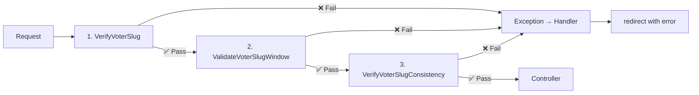

## 🗳️ COMPLETE VOTING FLOW ARCHITECTURE DOCUMENTATION

Here's a comprehensive technical guide of how the election process works, with clear responsibilities at each layer.

--- 

## 📊 ARCHITECTURE OVERVIEW

```mermaid
graph TD
    subgraph "1️⃣ ELECTION SETUP"
        A[Organisation Admin] -->|1.1 Create Election| B[ElectionController]
        B -->|1.2 Store| C[(elections table)]
        B -->|1.3 Create| D[PostController]
        D -->|1.4 Create Posts| E[(posts table)]
        B -->|1.5 Add| F[CandidacyController]
        F -->|1.6 Register Candidates| G[(candidacies table)]
    end

    subgraph "2️⃣ VOTER REGISTRATION"
        H[User] -->|2.1 Register| I[RegisterController]
        I -->|2.2 Auto-assign| J[Organisation ID = 1]
        J -->|2.3 Via| K[HasOrganisation Trait]
        K -->|2.4 Save| L[(users table)]
    end

    subgraph "3️⃣ VOTING SESSION START"
        M[Voter] -->|3.1 Click Vote| N[ElectionController::startDemo]
        N -->|3.2 Resolve Election| O[DemoElectionResolver]
        O -->|3.3 Find| P[(elections)]
        N -->|3.4 Create Session| Q[VoterSlugService]
        Q -->|3.5 Generate Slug| R[(voter_slugs)]
        N -->|3.6 Redirect to| S[/v/{slug}/demo-code/create]
    end

    subgraph "4️⃣ MIDDLEWARE CHAIN"
        S -->|4.1 Load| T[VerifyVoterSlug]
        T -->|4.2 Validate| U[ValidateVoterSlugWindow]
        U -->|4.3 Check| V[VerifyVoterSlugConsistency]
        V -->|4.4 Pass to| W[DemoCodeController]
    end

    subgraph "5️⃣ CODE VERIFICATION"
        W -->|5.1 Show Form| X[Code Entry View]
        X -->|5.2 Submit Code| Y[DemoCodeController::store]
        Y -->|5.3 Verify| Z[(codes table)]
        Y -->|5.4 Redirect| AA[/v/{slug}/demo-code/agreement]
    end

    subgraph "6️⃣ VOTING"
        AA -->|6.1 Show| AB[Agreement View]
        AB -->|6.2 Accept| AC[DemoVoteController::create]
        AC -->|6.3 Show Candidates| AD[Vote Form]
        AD -->|6.4 Submit| AE[DemoVoteController::first_submission]
        AE -->|6.5 Generate| AF[vote_hash]
        AF -->|6.6 Save| AG[(votes table)]
        AE -->|6.7 Mark| AH[Code as used]
    end

    subgraph "7️⃣ VERIFICATION"
        AG -->|7.1 User Can Verify| AI[VoteController::verify]
        AI -->|7.2 Re-generate Hash| AJ[Compare with code]
        AJ -->|7.3 Show| AK[Verification Result]
    end

    subgraph "8️⃣ RESULTS"
        AL[Admin] -->|8.1 Publish| AM[ElectionController::publishResults]
        AM -->|8.2 Calculate| AN[ResultController]
        AN -->|8.3 Aggregate| AO[(results table)]
        AN -->|8.4 Display| AP[Public Results Page]
    end
```

---

## 🏛️ LAYER-BY-LAYER RESPONSIBILITIES

### 1. **MODELS** - Data Layer

| Model | Table | Primary Responsibility |
|-------|-------|----------------------|
| **Organisation** | `organisations` | Tenant isolation, platform org (ID=1) |
| **User** | `users` | Voter identity, organisation membership |
| **Election** | `elections` | Election metadata, type (demo/real), status |
| **Post** | `posts` | Positions to be elected (President, etc.) |
| **Candidacy** | `candidacies` | Candidates running for posts |
| **Code** | `codes` | Verification codes, tracks voting permission |
| **VoterSlug** | `voter_slugs` | Voting session token, tracks progress |
| **Vote** | `votes` | **ANONYMOUS** vote data (NO user_id) |
| **Result** | `results` | Aggregated results per candidate |

**Key Traits:**
- `BelongsToTenant` - Auto-scopes all queries by organisation_id
- `HasOrganisation` - Sets default organisation on creation

---

### 2. **SERVICES** - Business Logic Layer

| Service | Responsibility |
|---------|----------------|
| **DemoElectionResolver** | Finds correct demo election for user (org-specific → platform) |
| **VoterSlugService** | Creates/retrieves voting session tokens |
| **VotingService** | Core voting logic, vote counting, candidate selection |
| **DashboardResolver** | Determines where to redirect users after login based on roles |
| **CacheService** | Caches frequently accessed data (elections, slugs, orgs) |
| **ElectionService** | Election status, timing, publication logic |

---

### 3. **CONTROLLERS** - HTTP Layer

| Controller | Route | Responsibility |
|------------|-------|----------------|
| **Election\ElectionController** | `/election/demo/start` | Start demo voting, create voter slug |
| **ElectionController** | `/election/select` | Select real election |
| **DemoCodeController** | `/v/{slug}/demo-code/*` | Code entry, verification, agreement |
| **DemoVoteController** | `/v/{slug}/demo-vote/*` | Vote casting, submission |
| **CodeController** | `/v/{slug}/code/*` | Real election code flow |
| **VoteController** | `/v/{slug}/vote/*` | Real election voting |
| **ResultController** | `/election/result` | Public results |
| **RoleSelectionController** | `/role/selection` | Role selection for multi-role users |

---

### 4. **MIDDLEWARE CHAIN** (The Security Backbone)



| Order | Middleware | Responsibility | Exceptions Thrown |
|-------|------------|----------------|-------------------|
| **1** | `VerifyVoterSlug` | Slug exists? Belongs to user? Active? | `InvalidVoterSlugException`, `SlugOwnershipException` |
| **2** | `ValidateVoterSlugWindow` | Not expired? Election active? | `ExpiredVoterSlugException` |
| **3** | `VerifyVoterSlugConsistency` | **GOLDEN RULE**: org_id matches? | `OrganisationMismatchException`, `ElectionNotFoundException` |

---

### 5. **EXCEPTION HANDLING**

```php
VotingException (Base)
├── ElectionException
│   ├── NoDemoElectionException      // "No demo election available"
│   ├── NoActiveElectionException     // "No active elections"
│   └── ElectionNotFoundException     // "Election not found"
├── VoterSlugException
│   ├── InvalidVoterSlugException     // "Invalid voting session"
│   ├── ExpiredVoterSlugException     // "Session expired"
│   └── SlugOwnershipException        // "Wrong user's slug"
├── ConsistencyException
│   ├── OrganisationMismatchException // **GOLDEN RULE violation**
│   ├── ElectionMismatchException      // "Election data inconsistent"
│   └── TenantIsolationException       // "Cross-tenant access"
└── VoteException
    ├── AlreadyVotedException          // "Already voted"
    └── VoteVerificationException      // "Verification failed"
```

**Handler** (`app/Exceptions/Handler.php`):
- Catches all `VotingException`
- Logs with full context
- Returns user-friendly message
- Redirects to dashboard

---

## 🔄 COMPLETE VOTING FLOW - STEP BY STEP

### PHASE A: PRE-VOTING SETUP

#### Step A1: Organisation Setup
```php
// Seeder: OrganisationSeeder
Organisation::create(['id' => 1, 'name' => 'Platform', 'slug' => 'platform']);
```

#### Step A2: Election Creation
```php
// Command: demo:setup
$election = Election::create([
    'name' => 'Demo Election',
    'type' => 'demo',
    'organisation_id' => 1, // Platform
    'status' => 'active'
]);

// Create Posts
Post::create(['name' => 'President', 'election_id' => $election->id]);

// Create Candidates
Candidacy::create(['name' => 'Alice', 'post_id' => $post->id]);
```

---

### PHASE B: VOTING SESSION

#### Step B1: User Starts Demo
```php
// ElectionController@startDemo
$demoElection = $this->demoResolver->getDemoElectionForUser($user);
// Priority: org_id=2 → org-specific demo, fallback to platform demo (org_id=1)

$slug = $this->slugService->getOrCreateActiveSlug($user);
// Creates voter_slug with: user_id, election_id, organisation_id

return redirect()->route('slug.demo-code.create', ['vslug' => $slug->slug]);
```

#### Step B2: Middleware Chain (Every Request)
```php
// 1. VerifyVoterSlug
$voterSlug = VoterSlug::where('slug', $slug)->first();
if (!$voterSlug) throw new InvalidVoterSlugException();
if ($voterSlug->user_id !== auth()->id()) throw new SlugOwnershipException();

// 2. ValidateVoterSlugWindow
if ($voterSlug->expires_at->isPast()) throw new ExpiredVoterSlugException();

// 3. VerifyVoterSlugConsistency (GOLDEN RULE)
$orgsMatch = $election->organisation_id === $voterSlug->organisation_id;
$electionIsPlatform = $election->organisation_id === 1;
$userIsPlatform = $voterSlug->organisation_id === 1;

if (!$orgsMatch && !$electionIsPlatform && !$userIsPlatform) {
    throw new OrganisationMismatchException();
}
```

#### Step B3: Code Entry & Verification
```php
// DemoCodeController@create - Shows code entry form
// DemoCodeController@store - Verifies code

$code = DemoCode::where('user_id', $user->id)
    ->where('election_id', $election->id)
    ->first();

if ($code->code1 === $submittedCode) {
    $code->update(['can_vote_now' => true]);
    return redirect()->route('slug.demo-code.agreement');
}
```

#### Step B4: Agreement & Voting
```php
// DemoVoteController@create - Shows voting form with candidates
// DemoVoteController@first_submission - Processes vote

// Generate cryptographic proof (NO user_id stored!)
$voteHash = hash('sha256', 
    $user->id .           // Used to generate hash, NOT stored!
    $election->id .
    $code->code1 .
    now()->timestamp
);

$vote = Vote::create([
    'organisation_id' => $election->organisation_id,
    'election_id' => $election->id,
    'vote_hash' => $voteHash,
    'candidate_01' => $request->candidate_01,
    'no_vote_posts' => $request->no_vote_posts ?? [],
]);

// Mark code as used
$code->update(['has_voted' => true]);
```

---

### PHASE C: VERIFICATION & RESULTS

#### Step C1: Voter Verification
```php
// VerificationController@verify
$code = Code::where('user_id', $user->id)->first();
$votes = Vote::where('election_id', $code->election_id)->get();

$userVote = $votes->first(function($vote) use ($user, $code) {
    $expectedHash = hash('sha256', 
        $user->id . $code->election_id . $code->code1 . $vote->cast_at->timestamp
    );
    return hash_equals($vote->vote_hash, $expectedHash);
});

return ['verified' => (bool)$userVote, 'cast_at' => $userVote?->cast_at];
```

#### Step C2: Results Calculation
```php
// ResultController@calculate
$results = Vote::where('election_id', $election->id)
    ->selectRaw('candidate_id, COUNT(*) as vote_count')
    ->groupBy('candidate_id')
    ->get();

foreach ($results as $result) {
    Result::updateOrCreate([
        'election_id' => $election->id,
        'candidate_id' => $result->candidate_id,
    ], [
        'vote_count' => $result->vote_count,
        'percentage' => ($result->vote_count / $totalVotes) * 100,
    ]);
}
```

---

## 🎯 KEY ARCHITECTURAL PRINCIPLES (The "Golden Rules")

### 1. **Anonymity Rule**
```sql
-- ✅ GOOD
votes: id, election_id, organisation_id, vote_hash, no_vote_posts
-- ❌ BAD
votes: user_id  -- NEVER!
```

### 2. **Tenant Isolation Rule**
```php
// All multi-tenant tables MUST have organisation_id
tables: users, elections, posts, candidacies, codes, voter_slugs, votes, results
```

### 3. **The Golden Rule** (Enforced in middleware)
```
VoterSlug.organisation_id MUST match Election.organisation_id
UNLESS Election.organisation_id = 1 (Platform) 
OR User.organisation_id = 1 (Platform user)
```

### 4. **Session Context Rule**
```php
// DO NOT inherit session context during user creation
// HasOrganisation trait NO LONGER does:
$model->organisation_id = session('current_organisation_id'); // ❌ REMOVED
```

---

## 🚀 QUICK REFERENCE: COMMON OPERATIONS

| Operation | Command | File |
|-----------|---------|------|
| Start demo election | `php artisan demo:setup` | `SetupDemoElection.php` |
| Verify architecture | `php artisan verify:architecture` | `VerifyArchitecture.php` |
| Check voter slug | `php artisan tinker` → `VoterSlug::find(1)` | - |
| Clear cache | `php artisan cache:clear` | - |
| Run all tests | `php artisan test` | - |

---

## 📋 VALIDATION CHECKLIST

Use this to verify your system:

```bash
# 1. Platform organisation exists
php artisan tinker --execute="Organisation::find(1) ? '✅' : '❌'"

# 2. No user_id in votes
php artisan tinker --execute="!Schema::hasColumn('votes', 'user_id') ? '✅' : '❌'"

# 3. Golden Rule compliance
php artisan tinker --execute="
\$mismatches = DB::table('voter_slugs as vs')
    ->join('elections as e', 'vs.election_id', '=', 'e.id')
    ->whereColumn('vs.organisation_id', '!=', 'e.organisation_id')
    ->where('e.organisation_id', '!=', 1)
    ->where('vs.organisation_id', '!=', 1)
    ->count();
echo \$mismatches === 0 ? '✅' : '❌ Found ' . \$mismatches;
"

# 4. New user gets platform org
php artisan tinker --execute="
\$user = User::create(['name'=>'Test','email'=>'test@test.com','password'=>'x','region'=>'x']);
echo \$user->organisation_id === 1 ? '✅' : '❌';
\$user->delete();
"
```

---

This architecture ensures:
- 🔒 **Voter anonymity** (no user_id in votes)
- 🔐 **Verifiable votes** (cryptographic hash)
- 🏢 **Tenant isolation** (organisation_id everywhere)
- 🛡️ **Security** (3-layer middleware)
- 📊 **Auditability** (complete trail)