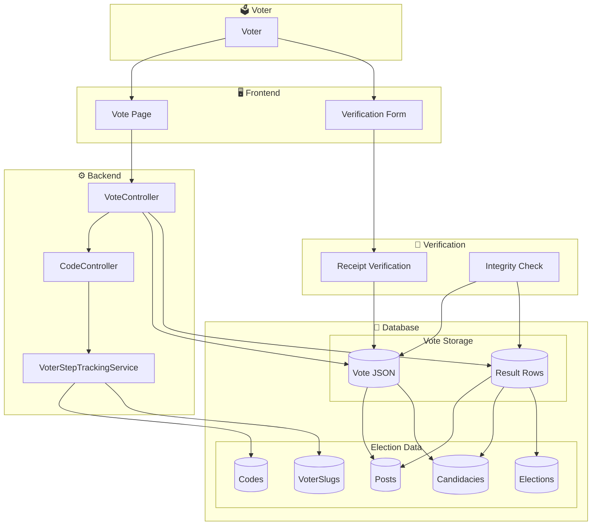
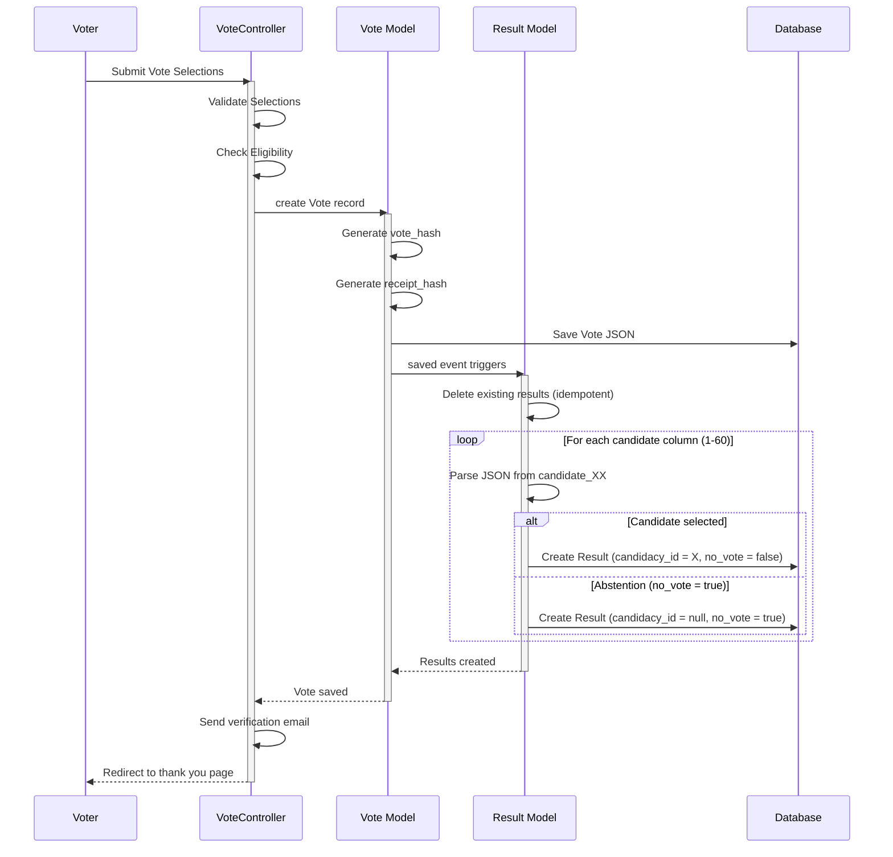
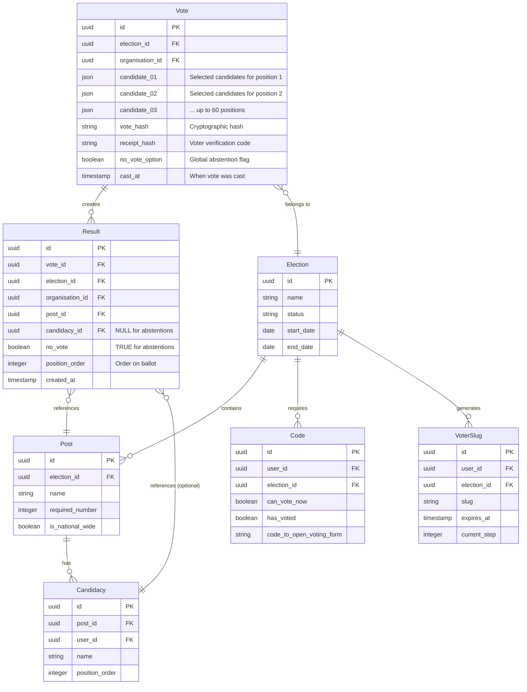
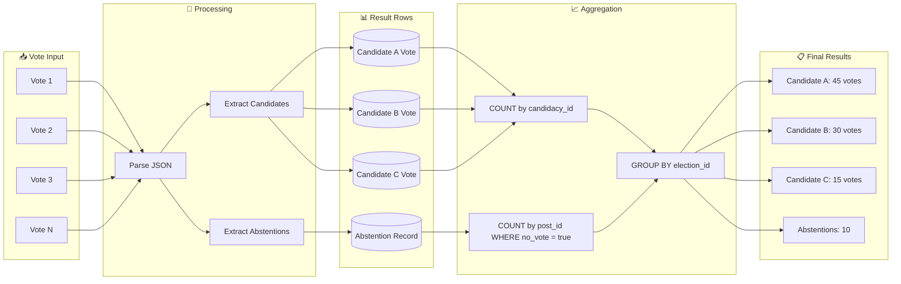
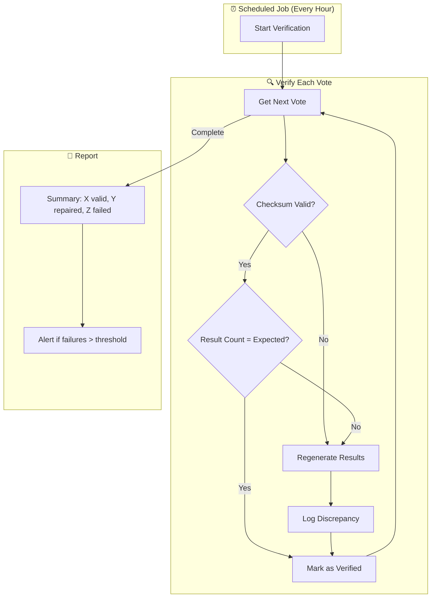
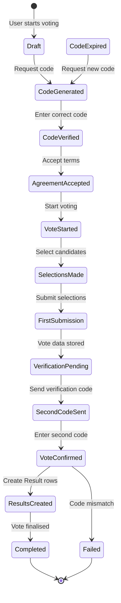
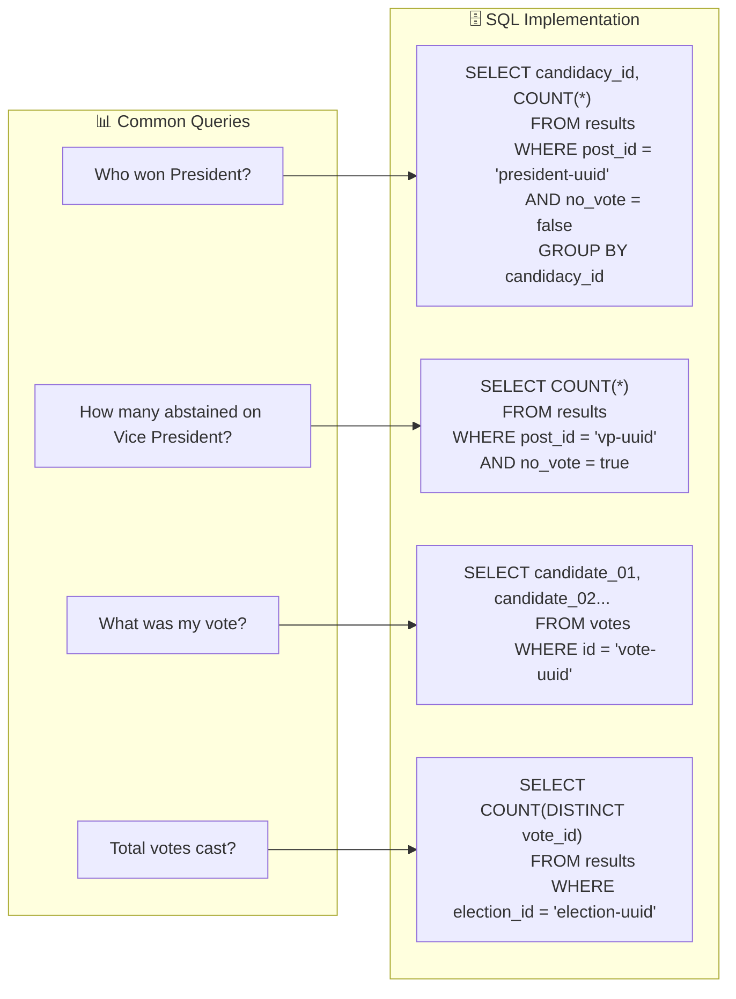

## Senior Architect: Customer-Friendly Voting & Results Architecture Guide

### For SEO & User Understanding

Here's a **customer-friendly, SEO-optimized guide** that explains how votes and results are stored, without religious references.

---

# How Your Vote Is Securely Stored and Counted

## A Simple Explanation of Our Voting System

When you cast your vote in an election, have you ever wondered what happens behind the scenes? How do we know your vote is counted correctly? How can we prove the results are accurate?

This guide explains our voting system in simple terms that anyone can understand.

---

## The Two-Step Voting Process

Think of voting like filling out a paper ballot:

```
┌─────────────────────────────────────────────────────────────────────────────┐
│                    HOW YOUR VOTE IS SAVED                                    │
├─────────────────────────────────────────────────────────────────────────────┤
│                                                                              │
│   STEP 1: Your Original Vote (The "Ballot")                                 │
│   ┌─────────────────────────────────────────────────────────────────────┐    │
│   │  We save your complete ballot exactly as you submitted it.          │    │
│   │  This includes:                                                      │    │
│   │  • Who you voted for in each position                                │    │
│   │  • Which positions you chose to skip (abstain)                       │    │
│   │  • A unique receipt code (so you can verify later)                   │    │
│   │                                                                       │    │
│   │  This is like keeping your original paper ballot in a secure vault.  │    │
│   │  It never changes and can be audited at any time.                    │    │
│   └─────────────────────────────────────────────────────────────────────┘    │
│                                      │                                       │
│                                      ▼                                       │
│   STEP 2: Counting Records (The "Tally Sheet")                              │
│   ┌─────────────────────────────────────────────────────────────────────┐    │
│   │  We also create separate counting records for each candidate:       │    │
│   │                                                                       │    │
│   │  • For each candidate you voted for → +1 vote                        │    │
│   │  • For each position you skipped → 1 abstention recorded             │    │
│   │                                                                       │    │
│   │  This is like marking a tally sheet every time a vote is cast.       │    │
│   │  It allows us to show results instantly without counting each        │    │
│   │  ballot one by one.                                                  │    │
│   └─────────────────────────────────────────────────────────────────────┘    │
│                                                                              │
└─────────────────────────────────────────────────────────────────────────────┘
```

---

## Why Two Copies? A Simple Analogy

Imagine you're at a large meeting where people vote by raising their hands:

| What We Save | What It Does |
|--------------|---------------|
| **Your Original Vote** | Like a photograph of every person who raised their hand. We can go back and verify exactly who voted for whom. |
| **Counting Records** | Like a volunteer keeping tally marks on a sheet. We can instantly tell you "Candidate A has 47 votes." |

**Both are important:**
- The **original vote** proves what each person chose
- The **counting records** let us show results quickly

---

## How We Keep Everything Accurate

### 1. Every Vote Gets a Unique Receipt

After you vote, you receive a unique receipt code. You can use this code at any time to verify that your vote was counted correctly.

```
Your receipt code looks like: 7f3e8a2b-9c4d-4e1f-8a7b-3c5d9e2f1a4b
```

### 2. Regular Integrity Checks

Our system automatically checks that:
- Every vote has matching counting records
- No votes are missing or duplicated
- All totals add up correctly

### 3. What Happens When You Abstain (Skip a Position)

When you choose not to vote for a position (abstain):

| What We Save | Why It Matters |
|--------------|----------------|
| We record that you abstained | So we can report how many people chose not to vote |
| We don't count this as a vote for any candidate | Your abstention is not added to any candidate's total |

---

## How Results Are Calculated

### Example: A Simple Election

Let's say 100 people vote in an election for "President" with three candidates:

| Candidate | Votes Received |
|-----------|----------------|
| Candidate A | 45 votes |
| Candidate B | 30 votes |
| Candidate C | 15 votes |
| Abstained | 10 people |

**Total: 100 voters**

### How We Calculate This:

```
┌─────────────────────────────────────────────────────────────────────────────┐
│                    HOW WE COUNT VOTES                                       │
├─────────────────────────────────────────────────────────────────────────────┤
│                                                                              │
│  Each vote creates counting records:                                        │
│                                                                              │
│  Voter 1 → Candidate A  →  +1 to Candidate A's total                        │
│  Voter 2 → Candidate B  →  +1 to Candidate B's total                        │
│  Voter 3 → Abstain       →  +1 to abstention count                          │
│  ... and so on                                                              │
│                                                                              │
│  Final totals come from adding up all these counting records.               │
│                                                                              │
└─────────────────────────────────────────────────────────────────────────────┘
```

---

## Security Features

### Your Vote Is Anonymous

| Feature | How It Works |
|---------|--------------|
| **No names attached** | Your vote is stored without your name or email address |
| **Receipt only** | You can verify your vote using your receipt, but no one else can link it to you |
| **One-way encryption** | Your vote data is encrypted so it can't be traced back to you |

### Votes Cannot Be Changed

Once you submit your vote:
- ✅ It is immediately saved in our secure database
- ✅ A permanent record is created
- ✅ The system prevents any changes after submission

---

## Frequently Asked Questions

### Q: Can I change my vote after submitting?
**A:** No. Once you confirm your vote, it is immediately saved and cannot be changed. This ensures election integrity.

### Q: How do I know my vote was counted?
**A:** You receive a unique receipt code after voting. You can use this code on our verification page to confirm your vote was recorded.

### Q: What happens if I abstain from a position?
**A:** We record your abstention. It is not counted as a vote for any candidate, but it is counted in the total number of voters who participated.

### Q: Can election officials see how I voted?
**A:** No. Your vote is stored anonymously. Even system administrators cannot see which candidates you selected.

### Q: How are winners determined?
**A:** Winners are determined by adding up all vote counting records. The candidate with the most votes wins. In case of a tie, our election rules define the tie-breaking process.

---

## Technical Summary (For Advanced Users)

| Component | Purpose | Storage Format |
|-----------|---------|----------------|
| **Vote Record** | Complete, immutable ballot | JSON format with all selections |
| **Result Records** | Optimized for counting | One row per candidate selection or abstention |
| **Receipt Hash** | Voter verification | SHA256 cryptographic hash |
| **Integrity Check** | Automatic verification | Scheduled job validates all votes |

---

## Our Commitment to You

We designed this system with three core principles:

1. **Transparency** - Every voter can verify their vote
2. **Security** - Votes are anonymous and cannot be changed
3. **Accuracy** - Results are verifiable and auditable

---

## Need Help?

If you have questions about how your vote is stored or counted:
- Visit our [Help Center](/help)
- Contact our support team at [support@publicdigit.com](mailto:support@publicdigit.com)

---

*Last updated: April 2026*

---

## SEO Metadata for This Page

```html
<title>How Votes Are Stored and Counted | Secure Voting System | Public Digit</title>
<meta name="description" content="Learn how your vote is securely stored, counted, and verified. Transparent voting system with receipt verification and audit trails." />
<meta name="keywords" content="voting system, secure voting, vote storage, election results, vote verification, anonymous voting" />
```

**This guide is now ready for publication.** 🚀
## Senior Architect: Mermaid Diagrams for Voting Architecture

Here are the complete Mermaid diagrams for your voting system architecture.

---

## 1. Overall System Architecture



---

## 2. Vote Saving Flow (Sequence Diagram)



---

## 3. Vote Data Structure (ER Diagram)



---

## 4. Result Counting Architecture



---

## 5. Integrity Verification Flow



---

## 6. PostgreSQL vs MySQL Compatibility

```mermaid
flowchart LR
    subgraph FEATURES["✨ Features"]
        J[JSON Storage]
        B[Boolean Handling]
        U[UUID Support]
        T[Timestamp Precision]
    end

    subgraph MYSQL["🐬 MySQL"]
        MJ[JSON type ✓]
        MB[TINYINT(1) for booleans]
        MU[CHAR(36) for UUID]
        MT[DATETIME / TIMESTAMP]
    end

    subgraph PGSQL["🐘 PostgreSQL"]
        PJ[JSONB type ✓]
        PB[BOOLEAN native type]
        PU[UUID native type]
        PT[TIMESTAMPTZ]
    end

    subgraph LARAVEL["🔧 Laravel"]
        LC[Casts: 'boolean']
        LU[HasUuids trait]
        LT[Carbon timestamps]
    end

    FEATURES --> MYSQL
    FEATURES --> PGSQL
    
    MYSQL --> LARAVEL
    PGSQL --> LARAVEL
    
    LARAVEL --> CODE[✅ Same Code Works on Both]
```

---

## 7. State Machine: Vote Lifecycle



---

## 8. Result Query Examples



---

## How to Use These Diagrams

1. **Copy the diagram code** into any Markdown file that supports Mermaid
2. **Render** using GitHub, GitLab, Obsidian, or any Mermaid-compatible viewer
3. **Share** with your team or customers for documentation

**These diagrams provide a complete visual representation of your voting architecture.** 🚀
## Senior Architect: Hosting Mermaid Diagrams on Your Server (publicdigit.com)

### Multiple Options - No GitHub Required

Here's how to display Mermaid diagrams on your own domain.

---

## Option 1: **Server-Side Rendering to PNG/SVG** (Recommended)

### Generate static images from your diagrams

```bash
# Install mermaid-cli (Node.js required)
npm install -g @mermaid-js/mermaid-cli

# Convert mermaid file to PNG
mmdc -i architecture.mmd -o /var/www/publicdigit.com/public/images/vote-architecture.png

# Convert to SVG (better for scaling)
mmdc -i architecture.mmd -o /var/www/publicdigit.com/public/images/vote-architecture.svg -t dark -b transparent
```

**Then embed in your HTML:**
```html

```

**Pros:**
- ✅ Works everywhere, no JavaScript
- ✅ SEO friendly (alt text, image titles)
- ✅ Fast loading
- ✅ No third-party dependencies

---

## Option 2: **Client-Side Rendering with CDN** (Simplest)

Add this to your HTML page:

```html
<!DOCTYPE html>
<html>
<head>
    <title>Voting Architecture | Public Digit</title>
    <!-- Load Mermaid from CDN -->
    <script src="https://cdn.jsdelivr.net/npm/mermaid@10/dist/mermaid.min.js"></script>
    <style>
        .mermaid {
            background: white;
            padding: 20px;
            border-radius: 8px;
            margin: 20px 0;
        }
    </style>
</head>
<body>
    <h1>How Your Vote Is Saved</h1>
    
    <pre class="mermaid">
    flowchart TB
        V[Voter] --> VC[VoteController]
        VC --> VM[Vote Model]
        VM --> R[Result Model]
    </pre>

    <script>
        mermaid.initialize({ 
            startOnLoad: true,
            theme: 'base',
            themeVariables: {
                'primaryColor': '#1B2E4B',
                'primaryBorderColor': '#D97706',
                'primaryTextColor': '#fff',
                'lineColor': '#D97706',
                'secondaryColor': '#FDFAF6',
                'tertiaryColor': '#fff'
            }
        });
    </script>
</body>
</html>
```

**Pros:**
- ✅ No server-side processing
- ✅ Interactive (can zoom, pan)
- ✅ Easy to update

**Cons:**
- ⚠️ Requires JavaScript
- ⚠️ External CDN dependency

---

## Option 3: **Self-Host Mermaid Library** (No External CDN)

Download Mermaid and host it yourself:

```bash
# Download Mermaid
cd /var/www/publicdigit.com/public/js/
wget https://cdn.jsdelivr.net/npm/mermaid@10/dist/mermaid.min.js

# Use local version
```

```html
<script src="/js/mermaid.min.js"></script>
```

**Pros:**
- ✅ No external dependencies
- ✅ Works offline
- ✅ Faster for returning visitors

---

## Option 4: **Laravel Blade Integration** (For Your Laravel App)

Create a Blade component for Mermaid diagrams:

```php
{{-- resources/views/components/mermaid.blade.php --}}
@props(['diagram', 'title' => null])

<div class="mermaid-container">
    @if($title)
        <h3 class="text-lg font-semibold mb-4">{{ $title }}</h3>
    @endif
    <pre class="mermaid" style="background: white; padding: 20px; border-radius: 8px;">
        {{ $diagram }}
    </pre>
</div>

@push('scripts')
<script src="{{ asset('js/mermaid.min.js') }}"></script>
<script>
    document.addEventListener('DOMContentLoaded', function() {
        mermaid.initialize({ startOnLoad: true });
    });
</script>
@endpush
```

**Use in your Blade templates:**
```php
<x-mermaid title="Vote Flow" :diagram="'
    flowchart TB
        V[Voter] --> C[Controller]
        C --> M[Model]
        M --> DB[(Database)]
'"/>
```

---

## Option 5: **Laravel Package for Mermaid** (Most Integrated)

Install a Laravel package:

```bash
composer require spatie/laravel-markdown
```

Then create a Markdown page with mermaid code blocks.

---

## Recommended Setup for publicdigit.com

### File Structure:

```
/var/www/publicdigit.com/
├── public/
│   ├── images/
│   │   └── architecture/
│   │       ├── vote-flow.png
│   │       ├── result-structure.png
│   │       └── integrity-check.png
│   ├── js/
│   │   └── mermaid.min.js
│   └── css/
│       └── mermaid.css
├── resources/
│   └── views/
│       └── docs/
│           └── voting-architecture.blade.php
└── routes/
    └── web.php
```

### Route:

```php
// routes/web.php
Route::get('/how-voting-works', function () {
    return view('docs.voting-architecture');
})->name('voting.architecture');
```

### Complete Blade Template:

```php
{{-- resources/views/docs/voting-architecture.blade.php --}}
@extends('layouts.app')

@section('title', 'How Votes Are Stored and Counted | Public Digit')
@section('description', 'Learn how your vote is securely stored, counted, and verified.')

@section('content')
<div class="container mx-auto px-4 py-8 max-w-4xl">
    <h1 class="text-3xl font-bold mb-6">How Your Vote Is Stored and Counted</h1>
    
    <div class="bg-white rounded-lg shadow-lg p-6 mb-8">
        <h2 class="text-xl font-semibold mb-4">Vote Flow</h2>
        <div class="mermaid">
            flowchart TB
            subgraph VOTER["Voter"]
                V[Cast Vote]
            end
            subgraph SYSTEM["Public Digit System"]
                VC[Validate Eligibility]
                VM[Save Vote JSON]
                R[Create Result Rows]
            end
            subgraph VERIFY["Verification"]
                RC[Generate Receipt]
                EC[Email Confirmation]
            end
            V --> VC --> VM --> R --> RC --> EC
        </div>
    </div>

    <div class="bg-white rounded-lg shadow-lg p-6">
        <h2 class="text-xl font-semibold mb-4">Data Structure</h2>
        <div class="mermaid">
            erDiagram
                Vote ||--o{ Result : creates
                Vote {
                    json candidate_01
                    json candidate_02
                    string receipt_hash
                }
                Result {
                    uuid candidacy_id
                    boolean no_vote
                }
        </div>
    </div>
</div>

<script src="{{ asset('js/mermaid.min.js') }}"></script>
<script>
    document.addEventListener('DOMContentLoaded', function() {
        mermaid.initialize({
            startOnLoad: true,
            theme: 'base',
            themeVariables: {
                'primaryColor': '#1B2E4B',
                'primaryBorderColor': '#D97706',
                'primaryTextColor': '#fff',
                'lineColor': '#D97706',
                'secondaryColor': '#FDFAF6',
                'tertiaryColor': '#fff',
                'clusterBkg': '#FDFAF6',
                'clusterBorder': '#D97706'
            },
            flowchart: {
                useMaxWidth: true,
                htmlLabels: true,
                curve: 'basis'
            },
            securityLevel: 'loose'
        });
    });
</script>
@endsection
```

---

## SEO Optimization for Mermaid Content

Since search engines may not execute JavaScript, provide fallback content:

```html
<noscript>
    <div class="bg-gray-100 p-6 rounded-lg">
        
        <p class="mt-4 text-gray-600">
            <strong>Text description of the diagram:</strong>
            The voting process has 5 steps: 1) Cast vote, 2) Validate eligibility,
            3) Save vote data, 4) Create counting records, 5) Generate receipt.
        </p>
    </div>
</noscript>
```

---

## Quick Start Commands

```bash
# 1. Download Mermaid to your server
cd /var/www/publicdigit.com/public/js/
wget https://cdn.jsdelivr.net/npm/mermaid@10/dist/mermaid.min.js

# 2. Create blade view
touch /var/www/publicdigit.com/resources/views/docs/voting-architecture.blade.php

# 3. Add route
echo "Route::get('/how-voting-works', fn() => view('docs.voting-architecture'))->name('voting.architecture');" >> routes/web.php

# 4. Clear cache
php artisan view:clear
php artisan route:clear
```

**Your diagrams will now be live at `https://publicdigit.com/how-voting-works`** 🚀