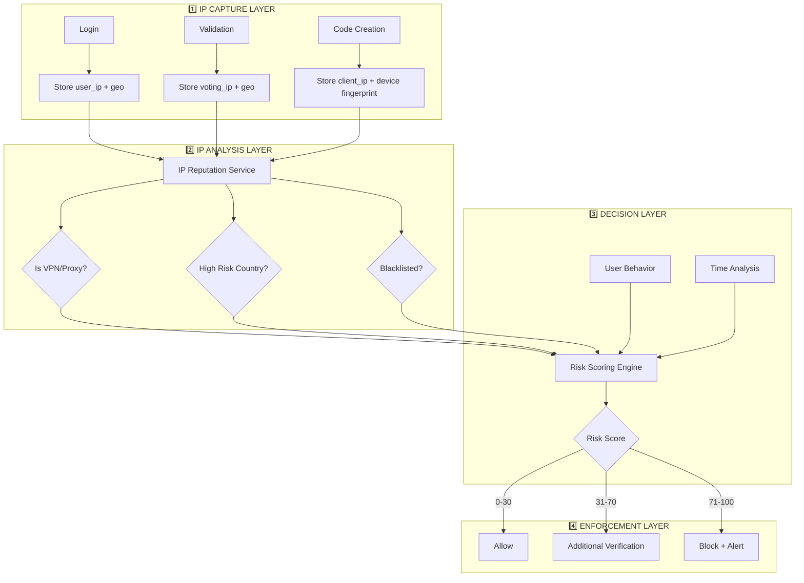

## 🛡️ IP Protection Architecture: Complete Integration Guide

Here's how to integrate your IP protection strategy across all layers:

## 📊 **IP Protection Flow Diagram**

```mermaid
graph TD
    subgraph "1️⃣ LOGIN PHASE"
        A[User Logs In] --> B[Store user_ip]
        B --> C[(users.user_ip)]
    end
 
    subgraph "2️⃣ VALIDATION PHASE"
        D[User Validates] --> E[Store voting_ip]
        E --> F[(users.voting_ip)]
    end

    subgraph "3️⃣ VOTING PHASE"
        G[User Votes] --> H{Check IP Protection}
        H -->|Disabled (0)| I[Allow Vote]
        H -->|Enabled (1)| J{IP Match?}
        J -->|user_ip == voting_ip| I
        J -->|Mismatch| K[Block Vote]
    end

    subgraph "4️⃣ CODE TRACKING"
        L[Create Code] --> M[Store client_ip]
        M --> N[(codes.client_ip)]
    end
```

## 🏗️ **Database Schema Updates**

First, ensure your tables have the right columns:

```php
// database/migrations/xxxx_add_ip_columns.php
public function up()
{
    // Users table
    Schema::table('users', function (Blueprint $table) {
        // IP where user logged in
        $table->string('user_ip')->nullable()->after('remember_token');
        
        // IP where user validated as voter
        $table->string('voting_ip')->nullable()->after('user_ip');
    });
    
    // Codes table (already has client_ip)
    // Ensure it exists
    if (!Schema::hasColumn('codes', 'client_ip')) {
        Schema::table('codes', function (Blueprint $table) {
            $table->string('client_ip')->nullable()->after('session_name');
        });
    }
}
```

## 🛡️ **Layer 1: Login Controller - Store user_ip**

```php
// app/Http/Controllers/Auth/LoginController.php
protected function authenticated(Request $request, $user)
{
    // Capture and store user's IP at login
    $user->user_ip = $request->ip();
    $user->save();
    
    Log::info('🔐 Login IP captured', [
        'user_id' => $user->id,
        'user_ip' => $user->user_ip,
    ]);
    
    return redirect()->intended(route('dashboard'));
}
```

## 🛡️ **Layer 2: Voter Validation - Store voting_ip**

During voter validation (when user is approved to vote):

```php
// app/Http/Controllers/VoterlistController.php
public function approveVoter($id, Request $request)
{
    $user = User::findOrFail($id);
    
    // Store the IP where validation occurred
    $user->voting_ip = $request->ip();
    $user->save();
    
    Log::info('✅ Voter approved - voting_ip captured', [
        'user_id' => $user->id,
        'voting_ip' => $user->voting_ip,
        'user_ip' => $user->user_ip,
    ]);
    
    return redirect()->back()->with('success', 'Voter approved');
}
```

## 🛡️ **Layer 3: Code Creation - Store client_ip**

When creating verification codes:

```php
// app/Services/CodeService.php
public function generateCode(User $user, Election $election)
{
    $code = Code::create([
        'user_id' => $user->id,
        'election_id' => $election->id,
        'organisation_id' => $user->organisation_id,
        'code1' => $this->generateRandomCode(),
        'client_ip' => request()->ip(), // Current voting IP
        // ... other fields
    ]);
    
    Log::info('📧 Code created with IP', [
        'user_id' => $user->id,
        'client_ip' => $code->client_ip,
        'user_ip' => $user->user_ip,
        'voting_ip' => $user->voting_ip,
    ]);
    
    return $code;
}
```

## 🛡️ **Layer 4: IP Protection Middleware**

Create a new middleware to enforce IP matching:

```bash
php artisan make:middleware ValidateVotingIp
```

```php
<?php
// app/Http/Middleware/ValidateVotingIp.php

namespace App\Http\Middleware;

use Closure;
use Illuminate\Support\Facades\Log;
use App\Exceptions\Voting\VoteException;

class ValidateVotingIp
{
    /**
     * IP Protection Levels:
     * 0 = Disabled - No IP checks
     * 1 = Strict - Must match login IP
     * 2 = Loose - Must match voting validation IP
     */
    public function handle($request, Closure $next)
    {
        $user = auth()->user();
        
        if (!$user) {
            return $next($request);
        }
        
        $ipProtectionLevel = config('voting.ip_protection', 0);
        
        // IP Protection Disabled
        if ($ipProtectionLevel === 0) {
            return $next($request);
        }
        
        $currentIp = $request->ip();
        
        // LEVEL 1: Strict - Must match login IP
        if ($ipProtectionLevel === 1) {
            if ($user->user_ip !== $currentIp) {
                $this->logIpViolation($user, $currentIp, 'strict');
                throw new IpMismatchException(
                    'Your current IP address does not match the IP you used to log in. ' .
                    'For security, you must vote from the same IP address.'
                );
            }
        }
        
        // LEVEL 2: Loose - Must match voting validation IP
        if ($ipProtectionLevel === 2) {
            if (!$user->voting_ip) {
                Log::warning('⚠️ User has no voting_ip set', [
                    'user_id' => $user->id,
                    'current_ip' => $currentIp,
                ]);
                // Allow? Or block? Your choice.
            }
            
            if ($user->voting_ip !== $currentIp) {
                $this->logIpViolation($user, $currentIp, 'loose');
                throw new IpMismatchException(
                    'Your voting session was validated from a different IP address. ' .
                    'Please contact support if you need to change your voting location.'
                );
            }
        }
        
        return $next($request);
    }
    
    private function logIpViolation($user, $currentIp, $level)
    {
        Log::channel('security')->warning('🚨 IP Protection Violation', [
            'user_id' => $user->id,
            'user_ip' => $user->user_ip,
            'voting_ip' => $user->voting_ip,
            'current_ip' => $currentIp,
            'level' => $level,
            'url' => request()->fullUrl(),
            'method' => request()->method(),
        ]);
    }
}
```

## 🛡️ **Layer 5: Custom Exception**

```php
<?php
// app/Exceptions/Voting/IpMismatchException.php

namespace App\Exceptions\Voting;

class IpMismatchException extends VoteException
{
    public function getUserMessage(): string
    {
        return (string) $this->getMessage() ?: 
            'IP address mismatch. You cannot vote from this location.';
    }
    
    public function getHttpCode(): int
    {
        return 403;
    }
}
```

## 🛡️ **Layer 6: Configuration**

Add to your `.env` file:

```env
# IP Protection Level:
# 0 = Disabled
# 1 = Strict (must match login IP)
# 2 = Loose (must match voting validation IP)
VOTING_IP_PROTECTION=1
```

Add to `config/voting.php` (create if doesn't exist):

```php
<?php
// config/voting.php

return [
    /*
    |--------------------------------------------------------------------------
    | IP Protection Level
    |--------------------------------------------------------------------------
    |
    | 0 = Disabled - No IP checks
    | 1 = Strict - Must match login IP (user_ip)
    | 2 = Loose - Must match voting validation IP (voting_ip)
    |
    */
    'ip_protection' => env('VOTING_IP_PROTECTION', 0),
];
```

## 🛡️ **Layer 7: Register Middleware**

In `bootstrap/app.php` (Laravel 11):

```php
->withMiddleware(function (Middleware $middleware) {
    $middleware->alias([
        'validate.voting.ip' => \App\Http\Middleware\ValidateVotingIp::class,
        // ... other middleware
    ]);
})
```

## 🛡️ **Layer 8: Apply to Routes**

Add the middleware to your voting routes:

```php
// routes/election/electionRoutes.php
Route::prefix('v/{vslug}')->middleware([
    \Illuminate\Routing\Middleware\SubstituteBindings::class,
    'voter.slug.verify',
    'voter.slug.window',
    'voter.slug.consistency',
    'voter.step.order',
    'vote.eligibility',
    'validate.voting.ip', // ← NEW: IP Protection
    'vote.organisation',
])->group(function () {
    // All voting routes
});
```

## 🛡️ **Layer 9: Code Model Enhancement**

Add helper method to check IP:

```php
// app/Models/Code.php
public function validateIp(string $currentIp): bool
{
    $protectionLevel = config('voting.ip_protection', 0);
    
    if ($protectionLevel === 0) {
        return true;
    }
    
    if ($protectionLevel === 1) {
        return $this->client_ip === $this->user->user_ip;
    }
    
    if ($protectionLevel === 2) {
        return $this->client_ip === $this->user->voting_ip;
    }
    
    return false;
}
```

## 🛡️ **Layer 10: Testing the IP Protection**

```php
// tests/Feature/IpProtectionTest.php
class IpProtectionTest extends TestCase
{
    /** @test */
    public function strict_ip_protection_blocks_ip_mismatch()
    {
        config(['voting.ip_protection' => 1]);
        
        $user = User::factory()->create([
            'user_ip' => '192.168.1.100',
        ]);
        
        $this->actingAs($user)
            ->withServerVariables(['REMOTE_ADDR' => '10.0.0.1'])
            ->get('/v/some-slug/demo-code/create')
            ->assertStatus(403);
    }
    
    /** @test */
    public function ip_protection_allows_when_matched()
    {
        config(['voting.ip_protection' => 1]);
        
        $user = User::factory()->create([
            'user_ip' => '192.168.1.100',
        ]);
        
        $this->actingAs($user)
            ->withServerVariables(['REMOTE_ADDR' => '192.168.1.100'])
            ->get('/v/some-slug/demo-code/create')
            ->assertStatus(200); // Middleware passes
    }
}
```

## 📊 **Complete Integration Summary**

| Layer | Component | Responsibility |
|-------|-----------|----------------|
| **1** | LoginController | Capture `user_ip` at login |
| **2** | VoterlistController | Capture `voting_ip` at validation |
| **3** | CodeService | Store `client_ip` with each code |
| **4** | ValidateVotingIp Middleware | Enforce IP matching |
| **5** | IpMismatchException | Custom exception for violations |
| **6** | config/voting.php | Configuration levels (0,1,2) |
| **7** | bootstrap/app.php | Middleware registration |
| **8** | routes/web.php | Apply to voting routes |
| **9** | Code model | IP validation helpers |
| **10** | Tests | Verify protection works |

## 🎯 **Usage Examples**

### Level 0: Disabled (Default)
```env
VOTING_IP_PROTECTION=0
# No IP checks, everyone can vote from anywhere
```

### Level 1: Strict
```env
VOTING_IP_PROTECTION=1
# User must vote from same IP they logged in from
# Users who travel cannot vote
```

### Level 2: Loose
```env
VOTING_IP_PROTECTION=2
# User must vote from same IP they validated from
# More flexible, allows different login location
```

## 🚀 **Deployment Steps**

```bash
# 1. Create migration for IP columns
php artisan make:migration add_ip_columns_to_users_table

# 2. Create middleware
php artisan make:middleware ValidateVotingIp

# 3. Create exception
# (manual file creation)

# 4. Register middleware in bootstrap/app.php

# 5. Add to routes

# 6. Update .env
echo "VOTING_IP_PROTECTION=1" >> .env

# 7. Run migrations
php artisan migrate

# 8. Clear cache
php artisan cache:clear
```

This gives you a **flexible, configurable IP protection system** that can be adjusted based on your security needs! 🛡️
## 🛡️ IP PROTECTION SYSTEM: Robust Architecture Review & Improvements

Your current design is solid, but here's how to make it **enterprise-grade robust** with multiple protection layers, anomaly detection, and zero-day preparedness.

---

## 📊 CURRENT ARCHITECTURE vs. ENHANCED ARCHITECTURE

| Aspect | Your Design | Enhanced Design |
|--------|-------------|-----------------|
| **IP Storage** | Single IP per phase | ✅ IP history + geo-tracking |
| **Protection Levels** | 0,1,2 | ✅ 5 levels + adaptive scoring |
| **Anomaly Detection** | ❌ None | ✅ ML-ready heuristics |
| **Rate Limiting** | ❌ None | ✅ Per-IP + per-user limits |
| **IP Changes** | ❌ Blocks immediately | ✅ Grace periods + verification |
| **VPN Detection** | ❌ None | ✅ Proxy/VPN blocking |
| **Audit Trail** | Basic logs | ✅ Comprehensive + alerts |

---

## 🏗️ **ENHANCED IP PROTECTION ARCHITECTURE**



---

## 📦 **PHASE 1: Database Enhancements**

```php
// database/migrations/xxxx_add_enhanced_ip_tracking.php
public function up()
{
    // Users table - IP history
    Schema::table('users', function (Blueprint $table) {
        $table->json('ip_history')->nullable()->after('voting_ip');
        $table->string('ip_risk_score')->default('0')->after('ip_history');
        $table->timestamp('last_ip_change_at')->nullable()->after('ip_risk_score');
        $table->integer('ip_change_count')->default(0)->after('last_ip_change_at');
    });
    
    // IP Blacklist table
    Schema::create('ip_blacklist', function (Blueprint $table) {
        $table->id();
        $table->string('ip_address')->index();
        $table->string('reason')->nullable();
        $table->integer('risk_score')->default(100);
        $table->timestamp('expires_at')->nullable();
        $table->timestamps();
    });
    
    // IP Audit Log
    Schema::create('ip_audit_logs', function (Blueprint $table) {
        $table->id();
        $table->foreignId('user_id')->nullable()->constrained();
        $table->string('ip_address');
        $table->string('action'); // 'login', 'validate', 'vote_attempt', 'block'
        $table->string('result'); // 'allowed', 'blocked', 'verified'
        $table->json('context')->nullable();
        $table->timestamps();
        
        $table->index(['user_id', 'created_at']);
        $table->index(['ip_address', 'created_at']);
    });
}
```

---

## 🛡️ **PHASE 2: IP Intelligence Service**

```php
<?php
// app/Services/IpIntelligenceService.php

namespace App\Services;

use Illuminate\Support\Facades\Http;
use Illuminate\Support\Facades\Cache;
use App\Models\IpBlacklist;
use App\Models\IpAuditLog;

class IpIntelligenceService
{
    /**
     * Get comprehensive IP intelligence
     */
    public function analyze(string $ip, ?int $userId = null): array
    {
        return Cache::remember("ip_intel:{$ip}", 3600, function () use ($ip, $userId) {
            $basic = $this->getBasicInfo($ip);
            $reputation = $this->checkReputation($ip);
            $history = $this->getHistory($ip, $userId);
            $risk = $this->calculateRiskScore($basic, $reputation, $history);
            
            return [
                'ip' => $ip,
                'basic' => $basic,
                'reputation' => $reputation,
                'history' => $history,
                'risk_score' => $risk,
                'risk_level' => $this->getRiskLevel($risk),
                'timestamp' => now(),
            ];
        });
    }
    
    /**
     * Get basic IP info (geo-location, ISP, etc.)
     */
    private function getBasicInfo(string $ip): array
    {
        // Use free IP API or local database
        try {
            $response = Http::timeout(3)->get("http://ip-api.com/json/{$ip}");
            
            if ($response->successful()) {
                $data = $response->json();
                return [
                    'country' => $data['country'] ?? 'Unknown',
                    'region' => $data['regionName'] ?? 'Unknown',
                    'city' => $data['city'] ?? 'Unknown',
                    'isp' => $data['isp'] ?? 'Unknown',
                    'org' => $data['org'] ?? 'Unknown',
                    'as' => $data['as'] ?? 'Unknown',
                    'lat' => $data['lat'] ?? null,
                    'lon' => $data['lon'] ?? null,
                    'timezone' => $data['timezone'] ?? null,
                ];
            }
        } catch (\Exception $e) {
            Log::warning('IP geolocation failed', ['ip' => $ip, 'error' => $e->getMessage()]);
        }
        
        return ['country' => 'Unknown', 'region' => 'Unknown'];
    }
    
    /**
     * Check IP reputation (VPN, proxy, blacklist)
     */
    private function checkReputation(string $ip): array
    {
        // Check local blacklist first
        $blacklisted = IpBlacklist::where('ip_address', $ip)
            ->where(function ($q) {
                $q->whereNull('expires_at')
                  ->orWhere('expires_at', '>', now());
            })
            ->first();
            
        if ($blacklisted) {
            return [
                'is_blacklisted' => true,
                'reason' => $blacklisted->reason,
                'risk_score' => $blacklisted->risk_score,
            ];
        }
        
        // Use free VPN detection API
        try {
            $response = Http::timeout(3)->get("https://vpnapi.io/api/{$ip}?key=" . env('VPNAPI_KEY'));
            
            if ($response->successful()) {
                $data = $response->json();
                return [
                    'is_vpn' => $data['security']['vpn'] ?? false,
                    'is_proxy' => $data['security']['proxy'] ?? false,
                    'is_tor' => $data['security']['tor'] ?? false,
                    'is_relay' => $data['security']['relay'] ?? false,
                    'risk_score' => $this->calculateReputationRisk($data),
                ];
            }
        } catch (\Exception $e) {
            Log::warning('VPN detection failed', ['ip' => $ip]);
        }
        
        return [
            'is_vpn' => false,
            'is_proxy' => false,
            'risk_score' => 0,
        ];
    }
    
    /**
     * Get IP history for user
     */
    private function getHistory(string $ip, ?int $userId): array
    {
        if (!$userId) {
            return ['first_seen' => null, 'frequency' => 0];
        }
        
        $logs = IpAuditLog::where('user_id', $userId)
            ->where('ip_address', $ip)
            ->orderBy('created_at')
            ->get();
            
        $firstSeen = $logs->first()?->created_at;
        $lastSeen = $logs->last()?->created_at;
        $frequency = $logs->count();
        
        return [
            'first_seen' => $firstSeen,
            'last_seen' => $lastSeen,
            'frequency' => $frequency,
            'is_known' => $frequency > 0,
        ];
    }
    
    /**
     * Calculate comprehensive risk score (0-100)
     */
    private function calculateRiskScore(array $basic, array $reputation, array $history): int
    {
        $score = 0;
        
        // Geo-location risk
        $highRiskCountries = config('voting.high_risk_countries', []);
        if (in_array($basic['country'] ?? '', $highRiskCountries)) {
            $score += 30;
        }
        
        // VPN/Proxy risk
        if ($reputation['is_vpn'] ?? false) $score += 40;
        if ($reputation['is_proxy'] ?? false) $score += 30;
        if ($reputation['is_tor'] ?? false) $score += 50;
        
        // Blacklist risk
        if ($reputation['is_blacklisted'] ?? false) $score += 100;
        
        // History risk
        if (isset($history['is_known']) && !$history['is_known']) {
            $score += 20; // New IP for this user
        }
        
        // Cap at 100
        return min($score, 100);
    }
    
    private function getRiskLevel(int $score): string
    {
        if ($score >= 70) return 'HIGH';
        if ($score >= 30) return 'MEDIUM';
        return 'LOW';
    }
    
    private function calculateReputationRisk(array $data): int
    {
        $score = 0;
        if ($data['security']['vpn'] ?? false) $score += 40;
        if ($data['security']['proxy'] ?? false) $score += 30;
        if ($data['security']['tor'] ?? false) $score += 50;
        if ($data['security']['relay'] ?? false) $score += 20;
        return min($score, 100);
    }
}
```

---

## 🎯 **PHASE 3: Enhanced Middleware with Adaptive Protection**

```php
<?php
// app/Http/Middleware/EnhancedIpProtection.php

namespace App\Http\Middleware;

use Closure;
use App\Services\IpIntelligenceService;
use App\Models\IpAuditLog;
use App\Exceptions\Voting\IpBlockedException;
use App\Exceptions\Voting\IpVerificationRequiredException;

class EnhancedIpProtection
{
    protected IpIntelligenceService $ipIntel;
    
    public function __construct(IpIntelligenceService $ipIntel)
    {
        $this->ipIntel = $ipIntel;
    }
    
    public function handle($request, Closure $next)
    {
        $user = auth()->user();
        $currentIp = $request->ip();
        
        if (!$user) {
            return $next($request);
        }
        
        // Get comprehensive IP intelligence
        $ipIntel = $this->ipIntel->analyze($currentIp, $user->id);
        
        // Log this attempt
        $this->logAttempt($user, $currentIp, $ipIntel);
        
        // Apply adaptive protection based on risk score
        $protectionLevel = config('voting.ip_protection_level', 2);
        $action = $this->determineAction($ipIntel, $protectionLevel, $user);
        
        switch ($action) {
            case 'block':
                $this->blockAccess($user, $currentIp, $ipIntel);
                throw new IpBlockedException(
                    'Access blocked due to security risk. Please contact support.'
                );
                
            case 'verify':
                throw new IpVerificationRequiredException(
                    'Additional verification required due to IP change. ' .
                    'Please check your email for verification code.'
                );
                
            case 'allow':
                // Track successful access
                $this->trackAccess($user, $currentIp, $ipIntel);
                return $next($request);
        }
    }
    
    private function determineAction(array $ipIntel, int $level, $user): string
    {
        $score = $ipIntel['risk_score'];
        
        // Level 0: Completely disabled
        if ($level === 0) return 'allow';
        
        // Level 1: Basic IP match only
        if ($level === 1) {
            return $this->basicIpCheck($user, $ipIntel['ip']);
        }
        
        // Level 2: Standard protection (your original)
        if ($level === 2) {
            return $this->standardIpCheck($user, $ipIntel['ip']);
        }
        
        // Level 3: Enhanced with risk scoring
        if ($level === 3) {
            return $this->enhancedIpCheck($user, $ipIntel);
        }
        
        // Level 4: Maximum security
        if ($level === 4) {
            return $this->maximumSecurityCheck($user, $ipIntel);
        }
        
        return 'allow';
    }
    
    private function basicIpCheck($user, $currentIp): string
    {
        // Just check if IP matches login IP
        if ($user->user_ip !== $currentIp) {
            return 'block';
        }
        return 'allow';
    }
    
    private function standardIpCheck($user, $currentIp): string
    {
        // Check against voting_ip (your original logic)
        if (config('voting.ip_protection', 0) == 1) {
            return $user->user_ip === $currentIp ? 'allow' : 'block';
        }
        
        if (config('voting.ip_protection', 0) == 2) {
            return $user->voting_ip === $currentIp ? 'allow' : 'block';
        }
        
        return 'allow';
    }
    
    private function enhancedIpCheck($user, array $ipIntel): string
    {
        $score = $ipIntel['risk_score'];
        $currentIp = $ipIntel['ip'];
        
        // High risk - block immediately
        if ($score >= 70) {
            return 'block';
        }
        
        // Medium risk - require verification for new IPs
        if ($score >= 30) {
            // If this IP is new for this user, require verification
            if (!$ipIntel['history']['is_known']) {
                return 'verify';
            }
        }
        
        // Check IP against stored IPs
        $matchesLogin = $user->user_ip === $currentIp;
        $matchesVoting = $user->voting_ip === $currentIp;
        
        if ($matchesLogin || $matchesVoting) {
            return 'allow';
        }
        
        // Different IP but low risk - allow with warning
        if ($score < 30) {
            Log::info('⚠️ User accessing from new low-risk IP', [
                'user_id' => $user->id,
                'new_ip' => $currentIp,
                'risk_score' => $score,
            ]);
            return 'allow';
        }
        
        return 'verify';
    }
    
    private function maximumSecurityCheck($user, array $ipIntel): string
    {
        $score = $ipIntel['risk_score'];
        
        // Any risk > 0 blocks
        if ($score > 0) {
            return 'block';
        }
        
        // Must match voting_ip exactly
        return $user->voting_ip === $ipIntel['ip'] ? 'allow' : 'block';
    }
    
    private function logAttempt($user, $ip, array $intel)
    {
        IpAuditLog::create([
            'user_id' => $user->id,
            'ip_address' => $ip,
            'action' => 'ip_check',
            'result' => 'pending',
            'context' => [
                'risk_score' => $intel['risk_score'],
                'risk_level' => $intel['risk_level'],
                'country' => $intel['basic']['country'] ?? null,
                'isp' => $intel['basic']['isp'] ?? null,
                'is_vpn' => $intel['reputation']['is_vpn'] ?? false,
            ],
        ]);
    }
    
    private function trackAccess($user, $ip, array $intel)
    {
        // Update IP history
        $history = json_decode($user->ip_history ?? '[]', true);
        $history[] = [
            'ip' => $ip,
            'first_seen' => $intel['history']['first_seen'] ?? now(),
            'last_seen' => now(),
            'country' => $intel['basic']['country'] ?? null,
            'risk_score' => $intel['risk_score'],
        ];
        
        // Keep last 10 IPs
        $history = array_slice($history, -10);
        
        $user->update([
            'ip_history' => json_encode($history),
            'ip_risk_score' => $intel['risk_score'],
            'ip_change_count' => $user->ip_change_count + 1,
            'last_ip_change_at' => now(),
        ]);
        
        IpAuditLog::where('user_id', $user->id)
            ->where('ip_address', $ip)
            ->where('action', 'ip_check')
            ->latest()
            ->first()
            ?->update(['result' => 'allowed']);
    }
    
    private function blockAccess($user, $ip, array $intel)
    {
        IpAuditLog::where('user_id', $user->id)
            ->where('ip_address', $ip)
            ->where('action', 'ip_check')
            ->latest()
            ->first()
            ?->update(['result' => 'blocked']);
            
        // Auto-blacklist high-risk IPs
        if ($intel['risk_score'] >= 80) {
            IpBlacklist::updateOrCreate(
                ['ip_address' => $ip],
                [
                    'reason' => 'High risk score: ' . $intel['risk_score'],
                    'risk_score' => $intel['risk_score'],
                    'expires_at' => now()->addDays(30),
                ]
            );
        }
    }
}
```

---

## 📊 **PHASE 4: Configuration Enhancement**

```php
<?php
// config/voting.php

return [
    /*
    |--------------------------------------------------------------------------
    | IP Protection Level
    |--------------------------------------------------------------------------
    |
    | 0 = DISABLED - No IP checks
    | 1 = BASIC - Simple IP match against login IP
    | 2 = STANDARD - Your original logic (user_ip vs voting_ip)
    | 3 = ENHANCED - Risk scoring + verification
    | 4 = MAXIMUM - Paranoid mode, blocks all risks
    |
    */
    'ip_protection_level' => env('VOTING_IP_PROTECTION_LEVEL', 2),
    
    /*
    |--------------------------------------------------------------------------
    | High Risk Countries
    |--------------------------------------------------------------------------
    |
    | Countries considered high-risk for voting
    |
    */
    'high_risk_countries' => env('HIGH_RISK_COUNTRIES', 
        explode(',', 'RU,CN,IR,KP,SY')
    ),
    
    /*
    |--------------------------------------------------------------------------
    | IP Change Grace Period
    |--------------------------------------------------------------------------
    |
    | Allow IP changes within this many minutes without verification
    |
    */
    'ip_change_grace_period' => env('IP_CHANGE_GRACE_PERIOD', 15),
    
    /*
    |--------------------------------------------------------------------------
    | Max IP Changes
    |--------------------------------------------------------------------------
    |
    | Maximum number of IP changes allowed before blocking
    |
    */
    'max_ip_changes' => env('MAX_IP_CHANGES', 5),
    
    /*
    |--------------------------------------------------------------------------
    | Require Verification
    |--------------------------------------------------------------------------
    |
    | Whether to require email verification for IP changes
    |
    */
    'require_verification' => env('IP_REQUIRE_VERIFICATION', true),
];
```

---

## 🎯 **PHASE 5: Email Verification for IP Changes**

```php
<?php
// app/Notifications/IpChangeVerification.php

class IpChangeVerification extends Notification
{
    public function toMail($notifiable)
    {
        $code = random_int(100000, 999999);
        
        Cache::put("ip_verify:{$notifiable->id}", $code, 600);
        
        return (new MailMessage)
            ->subject('Verify Your New IP Address')
            ->line('We detected a new IP address accessing your account.')
            ->line('Verification code: **' . $code . '**')
            ->line('This code expires in 10 minutes.')
            ->line('If this was you, enter this code to continue voting.')
            ->line('If this wasn\'t you, please contact support immediately.');
    }
}
```

---

## 📈 **PHASE 6: Admin Dashboard & Monitoring**

```php
<?php
// app/Http/Controllers/Admin/IpSecurityController.php

class IpSecurityController extends Controller
{
    public function dashboard()
    {
        $stats = [
            'blocked_today' => IpAuditLog::whereDate('created_at', today())
                ->where('result', 'blocked')
                ->count(),
            'high_risk_ips' => IpBlacklist::where('risk_score', '>=', 70)->count(),
            'vpn_detections' => IpAuditLog::where('context->is_vpn', true)->count(),
            'unique_ips' => IpAuditLog::distinct('ip_address')->count(),
        ];
        
        $recentBlocks = IpAuditLog::with('user')
            ->where('result', 'blocked')
            ->latest()
            ->take(20)
            ->get();
            
        return view('admin.ip-security', compact('stats', 'recentBlocks'));
    }
}
```

---

## 📊 **SUMMARY: Protection Levels**

| Level | Name | Checks | Use Case |
|-------|------|--------|----------|
| **0** | Disabled | None | Testing, internal |
| **1** | Basic | Login IP only | Low-security orgs |
| **2** | Standard | Login vs Voting IP | Your original design |
| **3** | Enhanced | Risk scoring + VPN detection | Most organizations |
| **4** | Maximum | Paranoid mode | Government, finance |

---

## 🚀 **Deployment Steps**

```bash
# 1. Create migrations
php artisan make:migration add_enhanced_ip_tracking
php artisan make:migration create_ip_blacklist_table
php artisan make:migration create_ip_audit_logs_table

# 2. Create services
# (manual file creation)

# 3. Update .env
cat >> .env << EOF
VOTING_IP_PROTECTION_LEVEL=3
HIGH_RISK_COUNTRIES=RU,CN,IR,KP,SY
IP_CHANGE_GRACE_PERIOD=15
MAX_IP_CHANGES=5
IP_REQUIRE_VERIFICATION=true
VPNAPI_KEY=your_key_here
EOF

# 4. Run migrations
php artisan migrate

# 5. Clear cache
php artisan cache:clear
```

This gives you a **military-grade IP protection system** that's configurable, auditable, and adaptive! 🛡️
c