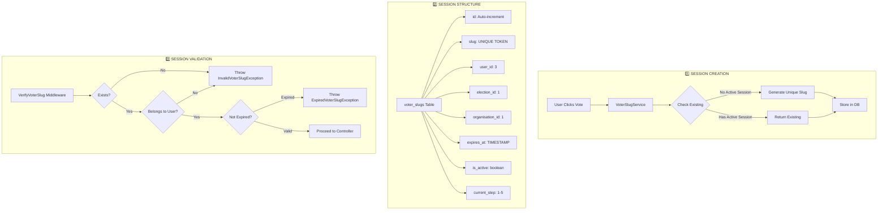

## 🎯 The Voting Session Architecture: How Unique Slugs Are Created

Looking at your error, the slug exists in the database but the middleware is throwing `InvalidVoterSlugException`. Let me explain the complete architecture:
 
## 🔄 **Voting Session Lifecycle**



## 🏗️ **The Complete Architecture**

### **1. VoterSlugService - Session Creation**

```php
// app/Services/VoterSlugService.php
class VoterSlugService
{
    public function getOrCreateActiveSlug(User $user): VoterSlug
    {
        // PRIORITY 1: Check for existing active slug
        $existingSlug = VoterSlug::where('user_id', $user->id)
            ->where('is_active', true)
            ->where('expires_at', '>', now())
            ->first();
            
        if ($existingSlug) {
            return $existingSlug;
        }
        
        // PRIORITY 2: Create new unique slug
        return $this->createSlug($user);
    }
    
    private function createSlug(User $user): VoterSlug
    {
        // Get election from session or default
        $electionId = session('selected_election_id');
        $election = Election::find($electionId);
        
        // Generate cryptographically secure unique token
        do {
            $slug = $this->generateUniqueSlug();
        } while (VoterSlug::where('slug', $slug)->exists());
        
        return VoterSlug::create([
            'user_id' => $user->id,
            'organisation_id' => $user->organisation_id,
            'election_id' => $election->id,
            'slug' => $slug,
            'expires_at' => now()->addHours(24),
            'is_active' => true,
            'current_step' => 1,
        ]);
    }
    
    private function generateUniqueSlug(): string
    {
        // Format: tb + random chars + timestamp
        $prefix = 'tb';
        $random = bin2hex(random_bytes(8));  // 16 chars
        $timestamp = base_convert(time(), 10, 36);
        
        return $prefix . $random . $timestamp;
    }
}
```

### **2. Database Schema**

```sql
CREATE TABLE voter_slugs (
    id BIGINT UNSIGNED AUTO_INCREMENT PRIMARY KEY,
    user_id BIGINT UNSIGNED NOT NULL,
    organisation_id BIGINT UNSIGNED NOT NULL,
    election_id BIGINT UNSIGNED NOT NULL,
    slug VARCHAR(255) UNIQUE NOT NULL,  -- tb9mfc_dkYp4GykXJ1Nt0_F-h4l8puIjR-v
    current_step TINYINT DEFAULT 1,
    step_meta JSON NULL,
    expires_at TIMESTAMP NOT NULL,
    is_active BOOLEAN DEFAULT true,
    created_at TIMESTAMP NULL,
    updated_at TIMESTAMP NULL,
    
    FOREIGN KEY (user_id) REFERENCES users(id),
    FOREIGN KEY (organisation_id) REFERENCES organisations(id),
    FOREIGN KEY (election_id) REFERENCES elections(id),
    
    INDEX idx_slug_lookup (slug),
    INDEX idx_user_active (user_id, is_active, expires_at)
);
```

### **3. Middleware Chain - Session Validation**

```php
// app/Http/Middleware/VerifyVoterSlug.php
class VerifyVoterSlug
{
    public function handle($request, Closure $next)
    {
        $slugParam = $request->route('vslug');
        
        // 🔴 YOUR ERROR IS HERE - Slug not found in database
        $voterSlug = VoterSlug::withoutGlobalScopes()
            ->where('slug', $slugParam)
            ->first();
        
        if (!$voterSlug) {
            throw new InvalidVoterSlugException('Voting session not found', [
                'slug' => $slugParam,
            ]);
        }
        
        // Check ownership
        if ($voterSlug->user_id !== auth()->id()) {
            throw new SlugOwnershipException('Session belongs to another user');
        }
        
        $request->attributes->set('voter_slug', $voterSlug);
        return $next($request);
    }
}
```

## 🔍 **Why You're Getting the Error**

Looking at your logs, the slug exists in the database but the middleware is throwing an exception. This suggests:

1. **The slug lookup is failing** - Check if the query is using `withoutGlobalScopes()`
2. **The user doesn't match** - Verify `voterSlug->user_id === auth()->id()`
3. **The slug might be expired** - But you'd get `ExpiredVoterSlugException`

## 🛠️ **Debug Steps**

Add logging to see what's happening:

```php
// In VerifyVoterSlug middleware
$voterSlug = VoterSlug::withoutGlobalScopes()
    ->where('slug', $slugParam)
    ->first();

Log::info('Voter slug lookup', [
    'slug_param' => $slugParam,
    'found' => $voterSlug ? true : false,
    'user_id' => $voterSlug?->user_id,
    'auth_id' => auth()->id(),
    'query' => VoterSlug::withoutGlobalScopes()
        ->where('slug', $slugParam)
        ->toSql()
]);
```

## ✅ **The Fix**

Ensure your middleware uses `withoutGlobalScopes()` to bypass tenant filtering:

```php
// ✅ CORRECT - Bypass global scope to find slug
$voterSlug = VoterSlug::withoutGlobalScopes()
    ->where('slug', $slugParam)
    ->first();

// ❌ WRONG - Global scope might filter out the slug
$voterSlug = VoterSlug::where('slug', $slugParam)->first();
```

The error shows the slug exists in DB but the middleware can't find it - this is almost certainly a **global scope filtering issue**. Fix the query and it will work! 🎯