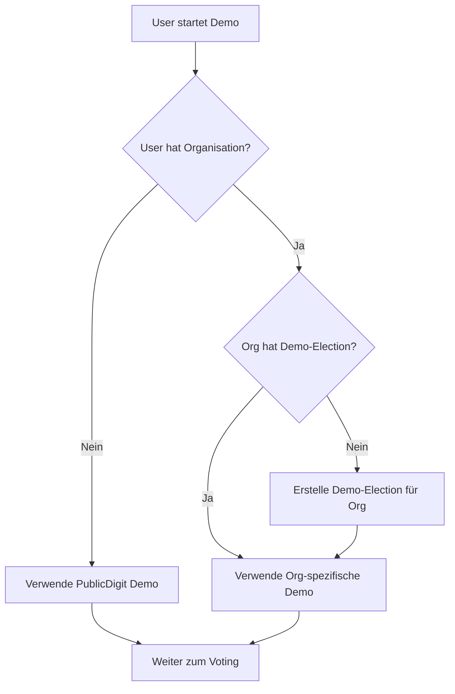

## ✅ **EXZELLENTE FRAGE! Das ist ein Multi-Tenant Szenario!**

### **Aktuelle Situation:**
- User gehört zu **zwei Organisationen**
- Jede Organisation **hat keine eigene Election**
- Bisher gab es nur **PublicDigit als Fallback**

### **Problem:**
Der `DemoElectionResolver` findet keine organisations-spezifische Election und muss auf die **PublicDigit Election** zurückfallen.

---

## 📋 **LÖSUNG: Verbesserter DemoElectionResolver**

```php
// In app/Services/DemoElectionResolver.php

public function getDemoElectionForUser(?User $user = null): ?Election
{
    // 1️⃣ Wenn User eingeloggt ist und Organisationen hat
    if ($user && $user->organisation_id) {
        // Versuche organisations-spezifische Demo-Election
        $orgElection = Election::withoutGlobalScopes()
            ->where('type', 'demo')
            ->where('organisation_id', $user->organisation_id)
            ->where('status', 'active')
            ->first();
            
        if ($orgElection) {
            Log::info('✅ Using org-specific demo election', [
                'user_id' => $user->id,
                'organisation_id' => $user->organisation_id,
                'election_id' => $orgElection->id
            ]);
            return $orgElection;
        }
        
        Log::info('ℹ️ No org-specific demo election found', [
            'user_id' => $user->id,
            'organisation_id' => $user->organisation_id
        ]);
    }
    
    // 2️⃣ Fallback: Platform-weite Demo-Election (PublicDigit)
    $publicElection = Election::withoutGlobalScopes()
        ->where('type', 'demo')
        ->whereNull('organisation_id')  // PublicDigit = keine Organisation
        ->where('status', 'active')
        ->first();
        
    if ($publicElection) {
        Log::info('✅ Using platform-wide demo election (PublicDigit)', [
            'user_id' => $user?->id,
            'election_id' => $publicElection->id
        ]);
        return $publicElection;
    }
    
    // 3️⃣ Keine Demo-Election verfügbar
    Log::error('❌ No demo election available at all');
    return null;
}
```

---

## 📋 **ZUSÄTZLICH: Auto-Erstellung von Demo-Elections**

```php
// In app/Services/DemoElectionCreationService.php

public function ensureOrgHasDemoElection(Organisation $organisation): Election
{
    // Prüfen, ob bereits eine Demo-Election existiert
    $existing = Election::withoutGlobalScopes()
        ->where('type', 'demo')
        ->where('organisation_id', $organisation->id)
        ->first();
        
    if ($existing) {
        return $existing;
    }
    
    // Neue Demo-Election für diese Organisation erstellen
    $election = Election::create([
        'name' => 'Demo Election - ' . $organisation->name,
        'slug' => 'demo-election-' . $organisation->slug,
        'type' => 'demo',
        'status' => 'active',
        'organisation_id' => $organisation->id,
        'start_date' => now(),
        'end_date' => now()->addYear(),
    ]);
    
    // Posts und Kandidaten hinzufügen
    $this->createPostsAndCandidates($election, $organisation);
    
    Log::info('✅ Created demo election for organisation', [
        'organisation_id' => $organisation->id,
        'election_id' => $election->id
    ]);
    
    return $election;
}
```

---

## 📋 **DANN IM CONTROLLER:**

```php
// In ElectionManagementController@startDemo

public function startDemo()
{
    $user = auth()->user();
    
    // 1️⃣ Versuche organisations-spezifische Demo
    $demoElection = $this->demoResolver->getDemoElectionForUser($user);
    
    // 2️⃣ Wenn keine existiert, erstelle eine für die Organisation
    if (!$demoElection && $user->organisation_id) {
        $organisation = Organisation::find($user->organisation_id);
        $demoElection = app(DemoElectionCreationService::class)
            ->ensureOrgHasDemoElection($organisation);
    }
    
    // 3️⃣ Immer noch keine? Fallback auf PublicDigit
    if (!$demoElection) {
        $demoElection = Election::withoutGlobalScopes()
            ->where('type', 'demo')
            ->whereNull('organisation_id')
            ->first();
    }
    
    // ... weiter wie gehabt
}
```

---

## 📋 **ZUSAMMENFASSUNG DER LOGIK:**



**So funktioniert es für alle Fälle:** ✅ Organisation mit Election  
✅ Organisation ohne Election (wird erstellt)  
✅ User ohne Organisation (PublicDigit)
## ✅ **GENAU! Jede Organisation kann MEHRERE Elections haben!**

Das ist eine wichtige Erweiterung. Hier ist die vollständige Lösung:

---

## 📋 **1. Datenbank-Struktur prüfen**

```sql
-- Zeige alle Demo-Elections einer Organisation
SELECT * FROM elections 
WHERE organisation_id = 'DEINE_ORG_ID' 
AND type = 'demo'
ORDER BY created_at DESC;

-- Zeige alle aktiven Demo-Elections
SELECT * FROM elections 
WHERE type = 'demo' 
AND status = 'active'
AND start_date <= NOW() 
AND end_date >= NOW();
```

---

## 📋 **2. Verbesserter DemoElectionResolver für MULTIPLE Elections**

```php
// app/Services/DemoElectionResolver.php

public function getDemoElectionForUser(?User $user = null, ?string $preferredElectionId = null): ?Election
{
    // 1️⃣ Wenn eine bestimmte Election gewünscht wird
    if ($preferredElectionId) {
        $election = Election::withoutGlobalScopes()
            ->where('id', $preferredElectionId)
            ->where('type', 'demo')
            ->where('status', 'active')
            ->first();
            
        if ($election) {
            return $election;
        }
    }
    
    // 2️⃣ Für User mit Organisation: Zeige ALLE aktiven Demo-Elections
    if ($user && $user->organisation_id) {
        $elections = Election::withoutGlobalScopes()
            ->where('type', 'demo')
            ->where('organisation_id', $user->organisation_id)
            ->where('status', 'active')
            ->where('start_date', '<=', now())
            ->where('end_date', '>=', now())
            ->orderBy('created_at', 'desc')
            ->get();
            
        if ($elections->isNotEmpty()) {
            // Wenn mehrere, logge sie für Debugging
            Log::info('📋 Multiple demo elections found', [
                'user_id' => $user->id,
                'organisation_id' => $user->organisation_id,
                'count' => $elections->count(),
                'election_ids' => $elections->pluck('id')
            ]);
            
            // Gib die neueste zurück (oder du könntest eine Auswahlseite anzeigen)
            return $elections->first();
        }
    }
    
    // 3️⃣ Fallback: Platform-weite Demo-Election (PublicDigit)
    return Election::withoutGlobalScopes()
        ->where('type', 'demo')
        ->whereNull('organisation_id')
        ->where('status', 'active')
        ->where('start_date', '<=', now())
        ->where('end_date', '>=', now())
        ->first();
}
```

---

## 📋 **3. ElectionController für MULTIPLE Elections**

```php
// app/Http/Controllers/Election/ElectionManagementController.php

/**
 * Zeige alle verfügbaren Demo-Elections für den User
 */
public function listDemoElections()
{
    $user = auth()->user();
    
    $elections = collect();
    
    // 1️⃣ Elections der User-Organisation
    if ($user->organisation_id) {
        $orgElections = Election::withoutGlobalScopes()
            ->where('type', 'demo')
            ->where('organisation_id', $user->organisation_id)
            ->where('status', 'active')
            ->where('start_date', '<=', now())
            ->where('end_date', '>=', now())
            ->orderBy('created_at', 'desc')
            ->get();
            
        $elections = $elections->concat($orgElections);
    }
    
    // 2️⃣ Platform-weite Demo-Elections (PublicDigit)
    $publicElections = Election::withoutGlobalScopes()
        ->where('type', 'demo')
        ->whereNull('organisation_id')
        ->where('status', 'active')
        ->where('start_date', '<=', now())
        ->where('end_date', '>=', now())
        ->orderBy('created_at', 'desc')
        ->get();
        
    $elections = $elections->concat($publicElections);
    
    return Inertia::render('Election/SelectDemoElection', [
        'elections' => $elections->map(fn($e) => [
            'id' => $e->id,
            'name' => $e->name,
            'description' => $e->description,
            'organisation_name' => $e->organisation?->name ?? 'PublicDigit',
            'start_date' => $e->start_date->format('d.m.Y'),
            'end_date' => $e->end_date->format('d.m.Y'),
            'posts_count' => $e->posts()->count(),
            'candidates_count' => $e->posts()->withCount('candidacies')->get()->sum('candidacies_count'),
        ]),
        'user_orgs' => $user->organisations ?? [],
    ]);
}

/**
 * Starte eine spezifische Demo-Election
 */
public function startSpecificDemo(Request $request)
{
    $validated = $request->validate([
        'election_id' => 'required|exists:elections,id'
    ]);
    
    $user = auth()->user();
    $election = Election::withoutGlobalScopes()->find($validated['election_id']);
    
    // Prüfe Zugriffsberechtigung
    if ($election->organisation_id && $election->organisation_id !== $user->organisation_id) {
        abort(403, 'Du hast keinen Zugriff auf diese Election');
    }
    
    session([
        'selected_election_id' => $election->id,
        'selected_election_type' => 'demo',
    ]);
    
    $slug = $this->slugService->getOrCreateSlug($user, $election, true);
    
    return redirect()->route('slug.demo-code.create', ['vslug' => $slug->slug]);
}
```

---

## 📋 **4. Zusätzliche Routes**

```php
// routes/web.php

// Demo-Election Auswahlseite
Route::get('/election/demo/list', [ElectionManagementController::class, 'listDemoElections'])
    ->middleware('auth')
    ->name('election.demo.list');

// Spezifische Demo-Election starten
Route::post('/election/demo/select', [ElectionManagementController::class, 'startSpecificDemo'])
    ->middleware('auth')
    ->name('election.demo.select');
```

---

## 📋 **5. UI-Komponente für Election-Auswahl**

```vue
<!-- resources/js/Pages/Election/SelectDemoElection.vue -->
<template>
    <div class="max-w-4xl mx-auto py-8">
        <h1 class="text-3xl font-bold mb-6">Wähle eine Demo-Election</h1>
        
        <div v-for="org in groupedElections" :key="org.name" class="mb-8">
            <h2 class="text-xl font-semibold mb-4">{{ org.name }}</h2>
            
            <div class="grid gap-4">
                <div v-for="election in org.elections" 
                     :key="election.id"
                     class="border rounded-lg p-4 hover:shadow-lg cursor-pointer"
                     @click="selectElection(election.id)">
                    
                    <h3 class="font-bold text-lg">{{ election.name }}</h3>
                    <p class="text-gray-600">{{ election.description }}</p>
                    
                    <div class="flex gap-4 mt-2 text-sm">
                        <span>{{ election.posts_count }} Posts</span>
                        <span>{{ election.candidates_count }} Kandidaten</span>
                        <span>Gültig bis: {{ election.end_date }}</span>
                    </div>
                </div>
            </div>
        </div>
    </div>
</template>
```

---

## 📋 **ZUSAMMENFASSUNG**

| Feature | Implementierung |
|---------|-----------------|
| **Mehrere Elections pro Organisation** | ✅ `organisation_id` in `elections` Tabelle |
| **Organisations-spezifische Elections** | ✅ Filter nach `organisation_id` |
| **Platform-weite Elections** | ✅ `organisation_id IS NULL` |
| **Auswahl mehrerer Elections** | ✅ Auswahlseite + spezifischer Start |
| **Zugriffskontrolle** | ✅ Prüfung der Organisation |

**So unterstützt dein System mehrere Elections pro Organisation!** 🚀