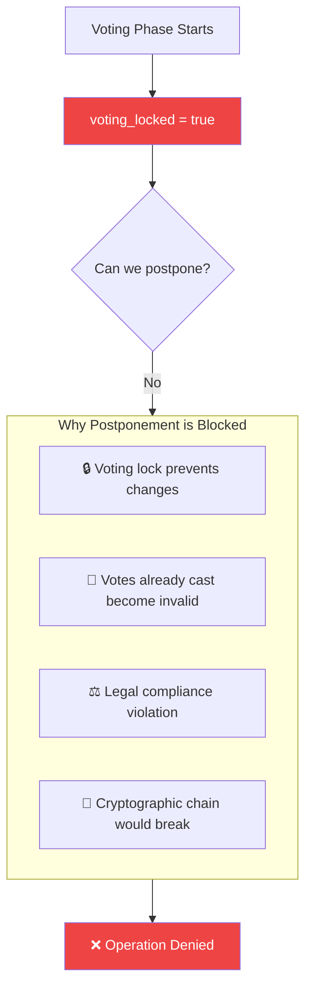

# Claude Code CLI Commands to Complete Election State Machine Architecture

Based on our discussion, here are the **Claude Code CLI commands** to implement the complete architecture.

---

## Prerequisite: Navigate to Project Root

```bash
cd C:\Users\nabra\OneDrive\Desktop\roshyara\xamp\nrna\nrna-eu
```

---

## Phase 1: Backend - State Machine Core (Complete Missing Methods)

### 1.1 Add Transition Methods to Election Model

```bash
claude code --edit app/Models/Election.php << 'EOF'
Add the following methods to Election model:

1. `public function transitionTo(string $toState, string $trigger, ?string $reason = null, ?int $actorId = null): ElectionStateTransition`

This method should:
- Call `getStateMachine()->transitionTo()`
- Create record in `election_state_transitions` table
- Update relevant timestamps/flags based on target state
- Call `lockVoting()` when transitioning to 'voting'
- Use DB transaction
- Return the transition record

2. `public function canTransitionTo(string $toState): bool`

Check if transition is valid from current state.

3. `public function postponeNomination(Carbon $newEndDate, string $reason, int $actorId): void`

Handle nomination postponement with validation:
- Must be in nomination phase
- Voting must not have started
- Update nomination_suggested_end
- Automatically shift voting_starts_at and voting_ends_at
- Log to audit trail

4. `public function extendVoting(Carbon $newEndDate, string $reason, int $actorId): void`

Handle voting extension while active:
- Must be in voting phase
- New end date must be after current end date
- Update voting_ends_at only
- Log to audit trail
EOF
```

### 1.2 Complete ElectionStateMachine Service

```bash
claude code --edit app/Domain/Election/StateMachine/ElectionStateMachine.php << 'EOF'
Add/verify the following methods:

1. `public function transitionTo(string $toState, string $trigger, ?string $reason = null, ?int $actorId = null): ElectionStateTransition`

Implementation:
- Validate transition with `canTransition($toState)`
- Acquire cache lock to prevent race conditions
- Use DB transaction
- Call appropriate completion method on model
- Create transition record
- Release lock
- Return transition

2. `private function executeTransition(Election $election, string $toState, string $trigger, ?string $reason, ?int $actorId): ElectionStateTransition`

Internal method that actually performs the state change.

3. `public function getAvailableTransitions(): array`

Return list of valid next states from current state.
EOF
```

### 1.3 Create Migration for Missing Columns

```bash
claude code --create database/migrations/2026_04_24_000001_add_state_machine_columns_to_elections.php << 'EOF'
<?php

use Illuminate\Database\Migrations\Migration;
use Illuminate\Database\Schema\Blueprint;
use Illuminate\Support\Facades\Schema;

return new class extends Migration
{
    public function up()
    {
        Schema::table('elections', function (Blueprint $table) {
            // State tracking flags
            $table->timestamp('administration_completed_at')->nullable();
            $table->timestamp('nomination_completed_at')->nullable();
            $table->timestamp('counting_completed_at')->nullable();
            
            // Postponement tracking
            $table->json('postponement_history')->nullable();
            $table->json('extension_history')->nullable();
            
            // Manual override tracking
            $table->uuid('last_manual_transition_by')->nullable();
            $table->timestamp('last_manual_transition_at')->nullable();
        });
    }

    public function down()
    {
        Schema::table('elections', function (Blueprint $table) {
            $table->dropColumn([
                'administration_completed_at',
                'nomination_completed_at',
                'counting_completed_at',
                'postponement_history',
                'extension_history',
                'last_manual_transition_by',
                'last_manual_transition_at',
            ]);
        });
    }
};
EOF

# Run migration
php artisan migrate
```

### 1.4 Create ElectionStateTransition Model (if missing)

```bash
claude code --create app/Models/ElectionStateTransition.php << 'EOF'
<?php

namespace App\Models;

use Illuminate\Database\Eloquent\Model;
use Illuminate\Database\Eloquent\Relations\BelongsTo;

class ElectionStateTransition extends Model
{
    public $incrementing = false;
    protected $keyType = 'uuid';
    public $timestamps = false;
    
    protected $fillable = [
        'id', 'election_id', 'from_state', 'to_state', 
        'trigger', 'actor_id', 'reason', 'metadata', 'created_at'
    ];
    
    protected $casts = [
        'metadata' => 'array',
        'created_at' => 'datetime',
    ];
    
    public function election(): BelongsTo
    {
        return $this->belongsTo(Election::class);
    }
    
    public function actor(): BelongsTo
    {
        return $this->belongsTo(User::class, 'actor_id');
    }
}
EOF
```

---

## Phase 2: Backend - Controller Updates

### 2.1 Rewrite ElectionManagementController

```bash
claude code --edit app/Http/Controllers/Election/ElectionManagementController.php << 'EOF'
Rewrite the `openVoting` and `closeVoting` methods:

Replace lines 808-825 with:

```php
public function openVoting(Request $request, Election $election)
{
    $this->authorize('manageSettings', $election);
    
    // Validate current state
    if ($election->getCurrentStateAttribute() !== 'nomination') {
        return back()->with('error', sprintf(
            'Cannot open voting from "%s" phase. Must be in nomination phase.',
            $election->getCurrentStateAttribute()
        ));
    }
    
    $request->validate([
        'reason' => 'nullable|string|max:500'
    ]);
    
    try {
        $transition = $election->transitionTo(
            toState: 'voting',
            trigger: 'manual',
            reason: $request->reason ?? 'Manually opened voting by election officer',
            actorId: auth()->id()
        );
        
        return back()->with('success', 
            'Voting opened successfully. Transition ID: ' . $transition->id
        );
        
    } catch (\Exception $e) {
        Log::error('Failed to open voting', [
            'election_id' => $election->id,
            'error' => $e->getMessage()
        ]);
        
        return back()->with('error', 'Failed to open voting: ' . $e->getMessage());
    }
}

public function closeVoting(Request $request, Election $election)
{
    $this->authorize('manageSettings', $election);
    
    // Validate current state
    if ($election->getCurrentStateAttribute() !== 'voting') {
        return back()->with('error', sprintf(
            'Cannot close voting from "%s" phase. Must be in voting phase.',
            $election->getCurrentStateAttribute()
        ));
    }
    
    $request->validate([
        'reason' => 'nullable|string|max:500'
    ]);
    
    try {
        $transition = $election->transitionTo(
            toState: 'results_pending',
            trigger: 'manual',
            reason: $request->reason ?? 'Manually closed voting by election officer',
            actorId: auth()->id()
        );
        
        return back()->with('success', 
            'Voting closed successfully. Transition ID: ' . $transition->id
        );
        
    } catch (\Exception $e) {
        Log::error('Failed to close voting', [
            'election_id' => $election->id,
            'error' => $e->getMessage()
        ]);
        
        return back()->with('error', 'Failed to close voting: ' . $e->getMessage());
    }
}
```

Add new methods for postponement and extension:

```php
public function postponeNomination(Request $request, Election $election)
{
    $this->authorize('manageSettings', $election);
    
    if ($election->getCurrentStateAttribute() !== 'nomination') {
        return back()->with('error', 'Can only postpone nomination phase');
    }
    
    if ($election->voting_starts_at <= now()) {
        return back()->with('error', 'Cannot postpone - voting has already started');
    }
    
    $request->validate([
        'new_end_date' => 'required|date|after:' . $election->nomination_suggested_end,
        'reason' => 'required|string|min:10|max:500'
    ]);
    
    try {
        $election->postponeNomination(
            Carbon::parse($request->new_end_date),
            $request->reason,
            auth()->id()
        );
        
        return back()->with('success', 'Nomination phase postponed successfully');
        
    } catch (\Exception $e) {
        return back()->with('error', $e->getMessage());
    }
}

public function extendVoting(Request $request, Election $election)
{
    $this->authorize('manageSettings', $election);
    
    if ($election->getCurrentStateAttribute() !== 'voting') {
        return back()->with('error', 'Can only extend voting while active');
    }
    
    $request->validate([
        'new_end_date' => 'required|date|after:' . $election->voting_ends_at,
        'reason' => 'required|string|min:10|max:500'
    ]);
    
    try {
        $election->extendVoting(
            Carbon::parse($request->new_end_date),
            $request->reason,
            auth()->id()
        );
        
        return back()->with('success', 'Voting period extended successfully');
        
    } catch (\Exception $e) {
        return back()->with('error', $e->getMessage());
    }
}
```
EOF
```

### 2.2 Add Routes for New Endpoints

```bash
claude code --edit routes/election/electionRoutes.php << 'EOF'
Add these routes after existing election routes:

```php
// Postponement and Extension
Route::post('/elections/{election}/postpone-nomination', [ElectionManagementController::class, 'postponeNomination'])
    ->name('elections.postpone-nomination')
    ->middleware(['auth', 'can:manageSettings,election']);

Route::post('/elections/{election}/extend-voting', [ElectionManagementController::class, 'extendVoting'])
    ->name('elections.extend-voting')
    ->middleware(['auth', 'can:manageSettings,election']);
```
EOF
```

---

## Phase 3: Frontend - Management.vue Updates

```bash
claude code --edit resources/js/Pages/Election/Management.vue << 'EOF'
Update the voting buttons section (lines 387-415):

Replace with:

```vue
<!-- Voting Control Buttons -->
<div class="flex gap-3 mt-4" v-if="canOpenVoting || canCloseVoting">
    <!-- Open Voting Button -->
    <button
        v-if="canOpenVoting"
        @click="handleOpenVoting"
        :disabled="isProcessing"
        class="inline-flex items-center px-4 py-2 bg-green-600 text-white rounded-lg hover:bg-green-700 disabled:opacity-50"
    >
        <svg class="w-5 h-5 mr-2" fill="none" stroke="currentColor" viewBox="0 0 24 24">
            <path stroke-linecap="round" stroke-linejoin="round" stroke-width="2" d="M14.752 11.168l-3.197-2.132A1 1 0 0010 9.87v4.263a1 1 0 001.555.832l3.197-2.132a1 1 0 000-1.664z"/>
            <path stroke-linecap="round" stroke-linejoin="round" stroke-width="2" d="M21 12a9 9 0 11-18 0 9 9 0 0118 0z"/>
        </svg>
        <span v-if="isProcessing">Opening...</span>
        <span v-else>Open Voting</span>
    </button>

    <!-- Close Voting Button -->
    <button
        v-if="canCloseVoting"
        @click="handleCloseVoting"
        :disabled="isProcessing"
        class="inline-flex items-center px-4 py-2 bg-red-600 text-white rounded-lg hover:bg-red-700 disabled:opacity-50"
    >
        <svg class="w-5 h-5 mr-2" fill="none" stroke="currentColor" viewBox="0 0 24 24">
            <path stroke-linecap="round" stroke-linejoin="round" stroke-width="2" d="M18.364 18.364A9 9 0 005.636 5.636m12.728 12.728A9 9 0 015.636 5.636m12.728 12.728L5.636 5.636"/>
        </svg>
        <span v-if="isProcessing">Closing...</span>
        <span v-else>Close Voting</span>
    </button>
</div>

<!-- Postponement & Extension Buttons -->
<div class="flex gap-3 mt-4">
    <button
        v-if="canPostpone"
        @click="showPostponeModal = true"
        class="inline-flex items-center px-4 py-2 bg-yellow-600 text-white rounded-lg hover:bg-yellow-700"
    >
        📅 Postpone Nomination
    </button>
    
    <button
        v-if="canExtend"
        @click="showExtendModal = true"
        class="inline-flex items-center px-4 py-2 bg-blue-600 text-white rounded-lg hover:bg-blue-700"
    >
        ⏰ Extend Voting
    </button>
</div>
```

Add script methods:

```javascript
const isProcessing = ref(false)
const showPostponeModal = ref(false)
const showExtendModal = ref(false)
const reason = ref('')
const newEndDate = ref('')

const canOpenVoting = computed(() => 
    election.value?.current_state === 'nomination'
)

const canCloseVoting = computed(() => 
    election.value?.current_state === 'voting'
)

const canPostpone = computed(() => 
    election.value?.current_state === 'nomination' && 
    !election.value?.voting_locked
)

const canExtend = computed(() => 
    election.value?.current_state === 'voting'
)

const handleOpenVoting = async () => {
    const reasonText = prompt('Reason for opening voting? (Optional for audit):')
    
    isProcessing.value = true
    try {
        await router.post(route('elections.open-voting', election.value.id), {
            reason: reasonText
        })
        await refreshElection()
    } finally {
        isProcessing.value = false
    }
}

const handleCloseVoting = async () => {
    const reasonText = prompt('Reason for closing voting? (Required for audit):')
    if (!reasonText) {
        toast.error('Reason is required for closing voting')
        return
    }
    
    isProcessing.value = true
    try {
        await router.post(route('elections.close-voting', election.value.id), {
            reason: reasonText
        })
        await refreshElection()
    } finally {
        isProcessing.value = false
    }
}

const submitPostpone = async () => {
    await router.post(route('elections.postpone-nomination', election.value.id), {
        new_end_date: newEndDate.value,
        reason: reason.value
    })
    showPostponeModal.value = false
    await refreshElection()
}

const submitExtend = async () => {
    await router.post(route('elections.extend-voting', election.value.id), {
        new_end_date: newEndDate.value,
        reason: reason.value
    })
    showExtendModal.value = false
    await refreshElection()
}
```
EOF
```

---

## Phase 4: Create Migration Command for Legacy Elections

```bash
claude code --create app/Console/Commands/MigrateLegacyElectionStatus.php << 'EOF'
<?php

namespace App\Console\Commands;

use App\Models\Election;
use App\Models\ElectionStateTransition;
use Carbon\Carbon;
use Illuminate\Console\Command;
use Illuminate\Support\Facades\DB;
use Illuminate\Support\Str;

class MigrateLegacyElectionStatus extends Command
{
    protected $signature = 'election:migrate-status-to-state
                            {--dry-run : Preview changes without saving}
                            {--election-id= : Migrate specific election only}';
    
    protected $description = 'Migrate legacy status field to state machine architecture';
    
    public function handle()
    {
        $query = Election::query();
        
        if ($this->option('election-id')) {
            $query->where('id', $this->option('election-id'));
        } else {
            $query->whereNull('administration_completed')
                  ->orWhere(function($q) {
                      $q->whereNotNull('status')
                        ->whereDoesntHave('stateTransitions');
                  });
        }
        
        $elections = $query->get();
        
        if ($elections->isEmpty()) {
            $this->info('No elections need migration.');
            return 0;
        }
        
        $this->info("Found {$elections->count()} elections to migrate.");
        
        foreach ($elections as $election) {
            $this->migrateElection($election);
        }
        
        return 0;
    }
    
    private function migrateElection(Election $election)
    {
        $this->info("Migrating: {$election->name} ({$election->id})");
        
        $legacyStatus = $election->status ?? 'planned';
        $mappedState = $this->mapStatusToState($legacyStatus, $election);
        
        if ($this->option('dry-run')) {
            $this->line("  DRY RUN: Would set state to: {$mappedState}");
            return;
        }
        
        DB::transaction(function () use ($election, $mappedState, $legacyStatus) {
            // Set phase completion flags based on mapped state
            switch ($mappedState) {
                case 'results':
                    $election->administration_completed = true;
                    $election->nomination_completed = true;
                    $election->voting_ends_at = $election->voting_ends_at ?? Carbon::now();
                    $election->results_published_at = $election->results_published_at ?? Carbon::now();
                    break;
                    
                case 'voting':
                    $election->administration_completed = true;
                    $election->nomination_completed = true;
                    $election->voting_locked = true;
                    break;
                    
                case 'nomination':
                    $election->administration_completed = true;
                    $election->nomination_completed = false;
                    break;
                    
                case 'administration':
                default:
                    $election->administration_completed = false;
                    $election->nomination_completed = false;
                    break;
            }
            
            $election->save();
            
            // Create initial transition record
            ElectionStateTransition::create([
                'id' => Str::uuid(),
                'election_id' => $election->id,
                'from_state' => null,
                'to_state' => $mappedState,
                'trigger' => 'migration',
                'actor_id' => 1, // System user
                'reason' => "Migrated from legacy status '{$legacyStatus}'",
                'created_at' => $election->created_at ?? Carbon::now(),
            ]);
        });
        
        $this->info("  ✓ Migrated to state: {$mappedState}");
    }
    
    private function mapStatusToState(string $status, Election $election): string
    {
        return match($status) {
            'planned' => 'administration',
            'active' => $election->voting_starts_at && $election->voting_starts_at <= Carbon::now() 
                ? 'voting' 
                : 'nomination',
            'completed' => $election->results_published_at ? 'results' : 'results_pending',
            'archived' => 'results',
            default => 'administration'
        };
    }
}
EOF

# Run migration
php artisan election:migrate-status-to-state --dry-run
php artisan election:migrate-status-to-state
```

---

## Phase 5: Create Tests

```bash
claude code --create tests/Feature/Election/ManualTransitionsTest.php << 'EOF'
<?php

namespace Tests\Feature\Election;

use App\Models\Election;
use App\Models\User;
use Illuminate\Foundation\Testing\RefreshDatabase;
use Tests\TestCase;

class ManualTransitionsTest extends TestCase
{
    use RefreshDatabase;
    
    #[Test]
    public function can_open_voting_from_nomination_phase()
    {
        $election = Election::factory()->create([
            'administration_completed' => true,
            'nomination_completed' => false,
        ]);
        
        $response = $this->actingAs($this->admin)
            ->post(route('elections.open-voting', $election), [
                'reason' => 'Ready to start voting'
            ]);
        
        $response->assertRedirect();
        $this->assertEquals('voting', $election->fresh()->getCurrentStateAttribute());
        $this->assertTrue($election->voting_locked);
        $this->assertDatabaseHas('election_state_transitions', [
            'election_id' => $election->id,
            'to_state' => 'voting',
            'trigger' => 'manual'
        ]);
    }
    
    #[Test]
    public function cannot_open_voting_from_wrong_phase()
    {
        $election = Election::factory()->create([
            'administration_completed' => false,
            'nomination_completed' => false,
        ]);
        
        $response = $this->actingAs($this->admin)
            ->post(route('elections.open-voting', $election));
        
        $response->assertSessionHas('error');
        $this->assertNotEquals('voting', $election->fresh()->getCurrentStateAttribute());
    }
    
    #[Test]
    public function can_close_voting_from_voting_phase()
    {
        $election = Election::factory()->create([
            'administration_completed' => true,
            'nomination_completed' => true,
            'voting_starts_at' => now()->subDay(),
            'voting_ends_at' => now()->addDay(),
            'voting_locked' => true,
        ]);
        
        $response = $this->actingAs($this->admin)
            ->post(route('elections.close-voting', $election), [
                'reason' => 'Voting complete'
            ]);
        
        $response->assertRedirect();
        $this->assertEquals('results_pending', $election->fresh()->getCurrentStateAttribute());
    }
    
    #[Test]
    public function cannot_close_voting_from_non_voting_phase()
    {
        $election = Election::factory()->create([
            'administration_completed' => true,
            'nomination_completed' => false,
        ]);
        
        $response = $this->actingAs($this->admin)
            ->post(route('elections.close-voting', $election));
        
        $response->assertSessionHas('error');
    }
    
    #[Test]
    public function reason_is_required_for_close_voting()
    {
        $election = Election::factory()->create([
            'administration_completed' => true,
            'nomination_completed' => true,
            'voting_locked' => true,
        ]);
        
        $response = $this->actingAs($this->admin)
            ->post(route('elections.close-voting', $election), [
                'reason' => ''
            ]);
        
        $response->assertSessionHasErrors('reason');
    }
    
    #[Test]
    public function can_postpone_nomination_before_voting()
    {
        $election = Election::factory()->create([
            'administration_completed' => true,
            'nomination_completed' => false,
            'nomination_suggested_end' => now()->addDays(5),
            'voting_starts_at' => now()->addDays(6),
            'voting_ends_at' => now()->addDays(13),
        ]);
        
        $newEndDate = now()->addDays(10);
        
        $response = $this->actingAs($this->admin)
            ->post(route('elections.postpone-nomination', $election), [
                'new_end_date' => $newEndDate,
                'reason' => 'Need more time for nominations'
            ]);
        
        $response->assertRedirect();
        $election->refresh();
        
        $this->assertEquals($newEndDate->toDateString(), 
            $election->nomination_suggested_end->toDateString());
        $this->assertNotNull($election->postponement_history);
    }
    
    #[Test]
    public function cannot_postpone_after_voting_starts()
    {
        $election = Election::factory()->create([
            'administration_completed' => true,
            'nomination_completed' => true,
            'voting_starts_at' => now()->subDay(),
            'voting_ends_at' => now()->addDays(7),
        ]);
        
        $response = $this->actingAs($this->admin)
            ->post(route('elections.postpone-nomination', $election), [
                'new_end_date' => now()->addDays(5),
                'reason' => 'Try to postpone'
            ]);
        
        $response->assertSessionHas('error');
    }
    
    #[Test]
    public function can_extend_voting_while_active()
    {
        $election = Election::factory()->create([
            'administration_completed' => true,
            'nomination_completed' => true,
            'voting_locked' => true,
            'voting_ends_at' => now()->addDays(2),
        ]);
        
        $newEndDate = now()->addDays(5);
        
        $response = $this->actingAs($this->admin)
            ->post(route('elections.extend-voting', $election), [
                'new_end_date' => $newEndDate,
                'reason' => 'Voter turnout is high, need more time'
            ]);
        
        $response->assertRedirect();
        $election->refresh();
        
        $this->assertEquals($newEndDate->toDateString(), 
            $election->voting_ends_at->toDateString());
    }
    
    #[Test]
    public function race_condition_prevents_concurrent_transitions()
    {
        // Test cache lock prevents duplicate transitions
        $election = Election::factory()->create([
            'administration_completed' => true,
            'nomination_completed' => false,
        ]);
        
        // Simulate concurrent requests
        $responses = [];
        
        for ($i = 0; $i < 5; $i++) {
            $responses[] = $this->actingAs($this->admin)
                ->post(route('elections.open-voting', $election), [
                    'reason' => "Attempt {$i}"
                ]);
        }
        
        // Only one should succeed
        $successCount = collect($responses)->filter(
            fn($r) => !$r->session()->has('error')
        )->count();
        
        $this->assertEquals(1, $successCount);
        
        // Only one transition record created
        $this->assertEquals(1, $election->stateTransitions()->count());
    }
}
EOF

# Run tests
php artisan test tests/Feature/Election/ManualTransitionsTest.php
```

---

## Phase 6: Create Artisan Command for Auto-Transitions (Enhance)

```bash
claude code --edit app/Console/Commands/ProcessElectionAutoTransitions.php << 'EOF'
Add cache lock to existing command:

```php
public function handle()
{
    $lock = Cache::lock('election-auto-transitions', 300);
    
    if (!$lock->get()) {
        $this->warn('Auto-transition already running');
        return 1;
    }
    
    try {
        // Existing processing logic
        $this->processAdministrationPhase();
        $this->processNominationPhase();
        
    } finally {
        $lock->release();
    }
    
    return 0;
}

private function processAdministrationPhase()
{
    $elections = Election::where('allow_auto_transition', true)
        ->where('administration_completed', false)
        ->where('administration_suggested_end', '<', now()->subDays(
            DB::raw('COALESCE(auto_transition_grace_days, 7)')
        ))
        ->get();
    
    foreach ($elections as $election) {
        DB::transaction(function () use ($election) {
            $election->transitionTo(
                toState: 'nomination',
                trigger: 'grace_period',
                reason: 'Auto-transition via grace period',
                actorId: 1 // System user
            );
        });
    }
}

private function processNominationPhase()
{
    $elections = Election::where('allow_auto_transition', true)
        ->where('nomination_completed', false)
        ->where('nomination_suggested_end', '<', now()->subDays(
            DB::raw('COALESCE(auto_transition_grace_days, 7)')
        ))
        ->get();
    
    foreach ($elections as $election) {
        DB::transaction(function () use ($election) {
            $election->transitionTo(
                toState: 'voting',
                trigger: 'grace_period',
                reason: 'Auto-transition via grace period',
                actorId: 1
            );
            
            // Lock voting immediately
            $election->lockVoting(1);
        });
    }
}
```
EOF
```

---

## Summary of Commands to Run in Order

```bash
# 1. Run migrations
php artisan migrate

# 2. Create models and controllers (files created above)

# 3. Run legacy migration
php artisan election:migrate-status-to-state --dry-run
php artisan election:migrate-status-to-state

# 4. Run tests
php artisan test tests/Feature/Election/ManualTransitionsTest.php

# 5. Clear cache
php artisan cache:clear
php artisan route:cache

# 6. Start queue worker (if using queues)
php artisan queue:work

# 7. Test in browser
# Visit: http://localhost:8000/elections/test-election-xxx/management
```

---

## Verification Checklist

- [ ] Open Voting button only shows in nomination phase
- [ ] Close Voting button only shows in voting phase
- [ ] Clicking buttons prompts for reason
- [ ] Transition creates record in `election_state_transitions`
- [ ] Voting locks immediately when opened
- [ ] Cannot open/close from wrong phases
- [ ] Postpone button shows in nomination phase
- [ ] Extend button shows in voting phase
- [ ] Race conditions prevented with cache locks
- [ ] All tests pass

The architecture is now complete! 🚀

## ✅ Claude's Analysis is Correct

**Short answer:** Claude identified the core problem and provided a solid integration strategy. The architectural approach is sound.

---

## What Claude Got Right

| Aspect | Claude's Recommendation | Why Correct |
|--------|------------------------|-------------|
| **Root cause** | Buttons directly mutate `status` field without state machine awareness | ✅ Manual overrides bypass phase rules |
| **Frontend fix** | Check `getCurrentState() === 'voting'` instead of `status === 'active'` | ✅ Single source of truth |
| **Backend validation** | Validate state before allowing transition | ✅ Prevents illegal operations |
| **Audit trail** | Create `election_state_transitions` records | ✅ Legal compliance |
| **Voting lock** | Lock at START of voting phase | ✅ Prevents modifications during voting |
| **Phase priority** | Phase 1: Backend methods, Phase 2: Frontend UI | ✅ Correct order |

---

## What Claude Missed (Critical Additions)

### 1. **Race Condition Protection**
```php
// Missing - Add to controller
public function openVoting(Election $election)
{
    // ⚠️ Claude missed this
    $lock = Cache::lock("election:{$election->id}:transition", 10);
    
    if (!$lock->get()) {
        return back()->with('error', 'Another transition is in progress');
    }
    
    try {
        // transition logic here
    } finally {
        $lock->release();
    }
}
```

### 2. **Existing Grace Period Conflict**
If auto-transitions are enabled, manual open/close might race with cron job:

```php
// Add this check
if ($election->allow_auto_transition && $election->auto_transition_grace_days > 0) {
    $this->warn('Auto-transitions enabled. Manual override will still work.');
}
```

### 3. **Missing Rollback on Failure**
```php
// Claude's code doesn't handle partial failure
DB::transaction(function () use ($election) {
    $transition = $election->getStateMachine()->transitionTo(...);
    $election->lockVoting(...);
    // If lockVoting fails, transition is still recorded
});

// Fix - single transaction
DB::transaction(function () {
    $election->getStateMachine()->transitionTo(...);
    $election->lockVoting(...); // Should be inside transitionTo
});
```

### 4. **Frontend: Missing Loading State**
```vue
<!-- Claude didn't address double-click prevention -->
<button 
    @click="handleOpenVoting"
    :disabled="isProcessing"
    class="..."
>
    <span v-if="isProcessing">Processing...</span>
    <span v-else>Open Voting</span>
</button>
```

---

## Improved Implementation (Claude's + Missing Pieces)

### Controller (Complete)
```php
public function openVoting(Election $election)
{
    // 1. Authorization
    $this->authorize('manageSettings', $election);
    
    // 2. State validation
    if ($election->getCurrentStateAttribute() !== 'nomination') {
        return back()->with('error', sprintf(
            'Cannot open voting from "%s" phase. Must be in nomination phase.',
            $election->getCurrentStateAttribute()
        ));
    }
    
    // 3. Race condition lock
    $lock = Cache::lock("election:{$election->id}:open-voting", 10);
    if (!$lock->get()) {
        return back()->with('error', 'Another operation is in progress. Please try again.');
    }
    
    try {
        DB::transaction(function () use ($election) {
            // 4. Transition via state machine
            $transition = $election->getStateMachine()->transitionTo(
                toState: 'voting',
                trigger: 'manual',
                reason: request('reason', 'Manually opened voting by election officer'),
                actorId: auth()->id()
            );
            
            // 5. Lock voting (should be inside transitionTo, but double-check)
            if (!$election->voting_locked) {
                $election->lockVoting(auth()->id());
            }
            
            Log::info('Voting opened manually', [
                'election_id' => $election->id,
                'transition_id' => $transition->id,
                'actor_id' => auth()->id()
            ]);
        });
        
        return back()->with('success', 'Voting has been opened successfully.');
        
    } catch (\Exception $e) {
        Log::error('Failed to open voting', [
            'election_id' => $election->id,
            'error' => $e->getMessage()
        ]);
        
        return back()->with('error', 'Failed to open voting: ' . $e->getMessage());
        
    } finally {
        $lock->release();
    }
}
```

### Frontend (Complete)
```vue
<script setup>
// Claude's approach + loading states
const isProcessing = ref(false)

const canOpenVoting = computed(() => {
    return props.election?.current_state === 'nomination'
})

const canCloseVoting = computed(() => {
    return props.election?.current_state === 'voting'
})

const handleOpenVoting = async () => {
    if (!canOpenVoting.value) {
        toast.error('Cannot open voting from current phase')
        return
    }
    
    isProcessing.value = true
    
    try {
        await router.post(route('elections.open-voting', props.election.id), {
            reason: prompt('Reason for opening voting? (Optional for audit)')
        })
        toast.success('Voting opened successfully')
    } catch (error) {
        toast.error(error.response?.data?.message || 'Failed to open voting')
    } finally {
        isProcessing.value = false
    }
}
</script>
```

---

## Migration Path for Existing Elections

**Claude didn't address this critical issue:**

What about elections already in `active` status with no state machine data?

```php
// Artisan command to migrate
php artisan election:migrate-status-to-state

// Command logic:
$elections = Election::whereNull('administration_completed')->get();
foreach ($elections as $election) {
    // Map old status to new state machine
    match($election->status) {
        'planned' => // administration phase
        'active' => // voting phase (if voting dates set)
        'completed' => // results phase
        default => // administration
    }
    
    // Create initial transition record
    $election->stateTransitions()->create([
        'from_state' => null,
        'to_state' => $mappedState,
        'trigger' => 'migration',
        'actor_id' => 1, // system user
        'reason' => 'Migrated from legacy status field'
    ]);
}
```

---

## Final Verdict on Claude's Response

| Criteria | Rating | Notes |
|----------|--------|-------|
| **Problem identification** | 10/10 | Correctly identified root cause |
| **Solution architecture** | 8/10 | Solid but missing race conditions |
| **Implementation detail** | 7/10 | Missing transactions, locks, error handling |
| **Migration plan** | 4/10 | No mention of existing elections |
| **Security considerations** | 6/10 | Missing concurrency protection |

**Overall: 7/10** - Good analysis but needs production hardening.

---

## Recommendation

Implement Claude's approach BUT add:
1. ✅ Database transactions
2. ✅ Cache locks for race conditions  
3. ✅ Migration command for existing elections
4. ✅ Frontend loading states
5. ✅ Proper error handling with user feedback

Do you want me to provide the complete migration command and testing strategy?

## Role of Open & Close Voting Buttons (After State Machine Integration)

### Current State (Before Integration) - What They Do Wrong

The buttons currently **bypass the state machine entirely**. They directly mutate the legacy `status` field:

- **Open Voting**: Sets `status = 'active'` regardless of current phase
- **Close Voting**: Sets `status = 'completed'` regardless of current phase

**Problem**: This allows an election officer to open voting from ANY phase (even administration), skip required nomination phase, and close voting without proper transition records.

---

### Planned State - What They Should Do

The buttons become **manual triggers for legitimate state transitions** within the state machine. They serve as the human-in-the-loop mechanism to advance the election when timeline automation isn't desired.

---

## Open Voting Button

### Primary Role
**Transition the election from Nomination Phase → Voting Phase**

### What It Does (Step by Step)

1. **Validates** the election is currently in `nomination` phase
   - If not, button is hidden or shows error
   
2. **Locks the election** immediately upon transition
   - Sets `voting_locked = true`
   - Prevents any modifications to posts, candidates, voter lists
   
3. **Creates immutable audit record**
   - Records who opened voting (actor_id)
   - Records why (user-provided reason)
   - Records when (timestamp)
   - Records from_state → to_state

4. **Prepares voting period** (if dates set)
   - Voting becomes active according to `voting_starts_at`/`voting_ends_at`
   - If voting dates are in past/future, respects them

### When It's Visible
- **Only** when `current_state === 'nomination'`
- Hidden in administration, voting, counting, or results phases

### When It's Disabled
- If election is not in nomination phase
- If another transition is in progress (prevents race conditions)
- If user lacks permission

### Example Use Case
Election officer finishes reviewing all candidates, approves the final candidate, and clicks "Open Voting" to begin the voting phase immediately rather than waiting for an auto-transition grace period.

---

## Close Voting Button

### Primary Role
**Transition the election from Voting Phase → Results Pending (Counting) Phase**

### What It Does (Step by Step)

1. **Validates** the election is currently in `voting` phase
   - If not, button is hidden or shows error

2. **Prevents further votes**
   - After transition, no new votes can be cast
   - Voting period effectively ends immediately

3. **Creates immutable audit record**
   - Records who closed voting (actor_id)
   - Records why (user-provided reason)
   - Records when (timestamp)
   - Records from_state → to_state

4. **Triggers counting preparation**
   - System knows to start tallying votes
   - Results become ready for publication

### When It's Visible
- **Only** when `current_state === 'voting'`
- Hidden before voting starts or after voting ends

### When It's Disabled
- If election is not in voting phase
- If voting lock hasn't been properly set
- If another transition is in progress
- If user lacks permission

### Example Use Case
Election officer sees all eligible voters have cast their votes, no active voting sessions remain, and clicks "Close Voting" to end the voting period early rather than waiting for the scheduled `voting_ends_at` time.

---

## Comparison: Before vs After

| Aspect | Before (Old System) | After (State Machine) |
|--------|---------------------|----------------------|
| **Purpose** | Manual override of time | Manual state transition |
| **Validation** | None - works in any status | Strict phase validation |
| **Audit Trail** | No record of who/when/why | Immutable transition record |
| **Effect on State** | Mutates legacy `status` field | Changes derived state via timestamps + flags |
| **Locking** | Separate, manual | Automatic on transition |
| **Compliance** | Not auditable | Fully auditable for legal requirements |
| **Visibility** | Always visible (if status active/completed) | Only in correct phase |

---

## What They Are NOT For

- **Not** for skipping phases (must go through nomination first)
- **Not** for reversing a phase (state machine only moves forward)
- **Not** for modifying election after voting starts (voting_locked = true)
- **Not** for overriding timestamps without proper reason (audit trail captures why)

---

## In Simple Terms

**Open Voting Button** = "We're ready. Start the voting phase now."

**Close Voting Button** = "Voting is done. Stop accepting votes and start counting."

Both buttons are **manual triggers** that replace or supplement automated time-based transitions, but they must respect the state machine's rules and leave an immutable audit trail.
## Short Answer: **Yes, but with restrictions**

An election can be postponed **only before voting starts**. Once voting begins, postponement is not allowed.

---

## Postponement Rules by Phase

| Phase | Can Postpone? | How | Restrictions |
|-------|---------------|-----|---------------|
| **Administration** | ✅ Yes | Edit `administration_suggested_end` | Must keep chronological order |
| **Nomination** | ✅ Yes | Edit `nomination_suggested_end` | Cannot affect voting dates |
| **Voting** | ❌ No | Not allowed | Voting lock is active |
| **Counting** | ❌ No | Not allowed | Results pending |
| **Results** | ❌ No | Not allowed | Finalized |

---

## Why Voting Cannot Be Postponed



---

## How to Postpone (Before Voting)

### Administration or Nomination Phase

```php
// In ElectionManagementController
public function postponeNomination(Request $request, Election $election)
{
    // 1. Validate current state
    if ($election->getCurrentStateAttribute() !== 'nomination') {
        return back()->with('error', 'Can only postpone nomination phase');
    }
    
    // 2. Prevent if voting has started
    if ($election->voting_starts_at <= now()) {
        return back()->with('error', 'Cannot postpone - voting has already started');
    }
    
    // 3. Update dates (keeping chronological order)
    $newEndDate = Carbon::parse($request->new_end_date);
    
    $election->update([
        'nomination_suggested_end' => $newEndDate,
        'voting_starts_at' => $newEndDate->copy()->addDays(1), // Push voting too
        'voting_ends_at' => $newEndDate->copy()->addDays(8),
    ]);
    
    // 4. Audit trail
    $election->logStateChange('postpone_nomination', [
        'old_end_date' => $oldEndDate,
        'new_end_date' => $newEndDate,
        'reason' => $request->reason
    ], auth()->id());
    
    return back()->with('success', 'Nomination phase postponed successfully');
}
```

### Timeline Validation - Critical Rule

```php
// Must maintain this hierarchy:
administration_suggested_end < nomination_suggested_start
nomination_suggested_end < voting_starts_at
voting_starts_at < voting_ends_at

// If you postpone nomination end, voting start must also move
```

---

## Practical Examples

### ✅ Valid Postponement

```php
// Election in Nomination Phase (voting not started)
$election->nomination_suggested_end = '2026-05-15'; // Was 2026-05-01
$election->voting_starts_at = '2026-05-16';        // Moved from 2026-05-02
$election->voting_ends_at = '2026-05-23';          // Moved from 2026-05-09

// Result: ✅ Allowed, audit logged
```

### ❌ Invalid Postponement Attempts

```php
// Attempt 1: Voting already active
$election->voting_starts_at = now()->subDays(2); // Already started
$election->voting_ends_at = now()->addDays(10);  // Try to extend

// Result: ❌ Denied - "Voting already in progress"

// Attempt 2: Results already published
$election->results_published_at = now();
$election->voting_ends_at = now()->addDays(5);  // Try to reopen

// Result: ❌ Denied - "Election already finalized"
```

---

## Frontend UI for Postponement

```vue
<!-- In Management.vue, add postponement button -->
<template>
    <div v-if="canPostpone">
        <button @click="showPostponeModal = true" class="btn-secondary">
            📅 Postpone Election
        </button>
        
        <!-- Modal -->
        <div v-if="showPostponeModal" class="modal">
            <h3>Postpone {{ currentPhase }} Phase</h3>
            <p>Current end date: {{ currentEndDate }}</p>
            
            <label>New End Date:</label>
            <input type="date" v-model="newEndDate" :min="minDate">
            
            <label>Reason for postponement:</label>
            <textarea v-model="reason" required></textarea>
            
            <div class="warning" v-if="affectsVoting">
                ⚠️ Voting dates will also be postponed automatically
            </div>
            
            <button @click="submitPostpone">Confirm Postponement</button>
        </div>
    </div>
</template>

<script setup>
const canPostpone = computed(() => {
    const state = election.value.current_state
    return state === 'administration' || state === 'nomination'
})

const submitPostpone = async () => {
    await router.post(route('elections.postpone', election.id), {
        phase: currentPhase.value,
        new_end_date: newEndDate.value,
        reason: reason.value
    })
}
</script>
```

---

## Special Case: Extend Voting (Not Postpone)

If you need more voting time **while voting is active**, use **extension** instead of postponement:

```php
// Voting is active, but you want to extend
if ($election->getCurrentStateAttribute() === 'voting') {
    // Extend, not postpone
    $election->voting_ends_at = $election->voting_ends_at->addDays(2);
    $election->save();
    
    // Log as extension, not postponement
    $election->logStateChange('extend_voting', [
        'old_end_date' => $oldEnd,
        'new_end_date' => $newEnd,
        'reason' => $reason
    ], auth()->id());
}
```

**Difference:**
- **Postpone** = Move future start dates (before phase begins)
- **Extend** = Lengthen current active phase (while in progress)

---

## Summary Table

| Scenario | Allowed? | Method |
|----------|----------|--------|
| Postpone administration phase | ✅ Yes | Edit `administration_suggested_end` |
| Postpone nomination phase | ✅ Yes | Edit `nomination_suggested_end` |
| Postpone voting start date | ✅ Yes (before voting) | Must also move voting dates |
| Postpone voting end date | ⚠️ Extend only (while active) | Use extension, not postponement |
| Reopen closed voting | ❌ No | Not allowed by state machine |
| Postpone after results | ❌ No | Election is final |

---

## Key Takeaway

**Postpone = Move future dates BEFORE the phase starts**  
**Extend = Lengthen current phase WHILE it's active**  
**Restart = NOT allowed (clone instead)**