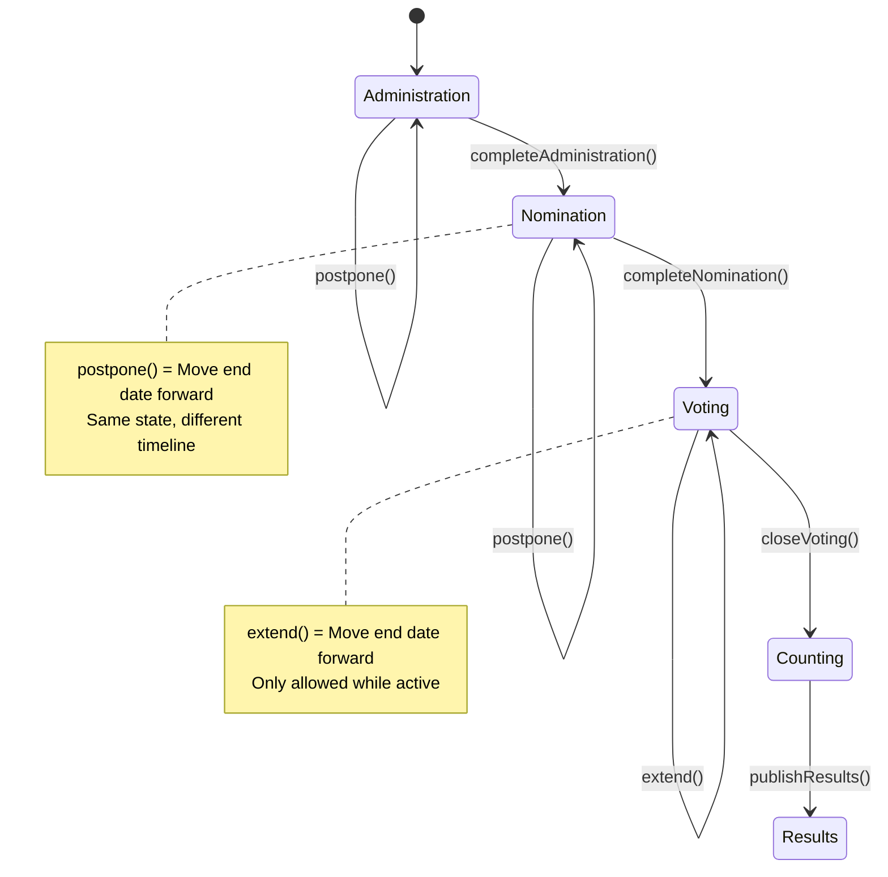
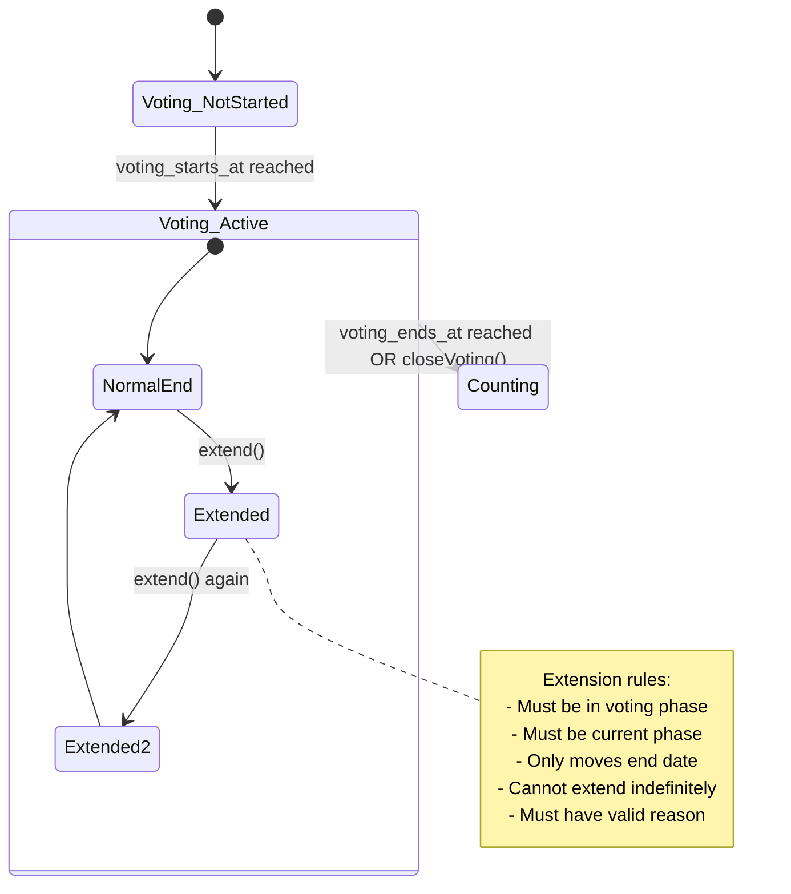

# Yes - Postponement Within State Machine is Correct

You've identified the right architectural pattern. Let me clarify:

---

## The Correct Relationship

```
State Machine (Process) = Rules + Boundaries
Business Actions (Manual Buttons) = Triggers within those rules
```

**Not mixing - layering.**

---

## Postponement: A Legitimate State Machine Operation

Yes, you can postpone a process. Postponement is a **state machine transition** with a specific trigger type.

### How It Works

```php
// Current state: nomination
$election->current_state; // 'nomination'

// Postpone (move dates forward, stay in same state)
$election->postpone('nomination', $newEndDate, $reason);

// State unchanged, but dates updated
$election->current_state; // Still 'nomination'
```

---

## Postponement Flow Diagram



---

## Implementation: Postponement as State Machine Action

### 1. Add to ElectionStateMachine

```php
class ElectionStateMachine
{
    // New: Postpone (stay in same state, move dates)
    public function postpone(string $phase, Carbon $newEndDate, string $reason, ?string $actorId): void
    {
        // Validate phase is current
        if ($phase !== $this->getCurrentState()) {
            throw new InvalidTransitionException("Cannot postpone {$phase} from {$this->getCurrentState()}");
        }
        
        // Validate new date is future
        if ($newEndDate <= now()) {
            throw new InvalidDateException("Postponement date must be in the future");
        }
        
        // Validate business rules (e.g., voting can't be postponed after lock)
        $this->validatePostponement($phase, $newEndDate);
        
        DB::transaction(function () use ($phase, $newEndDate, $reason, $actorId) {
            $oldDate = $this->getCurrentEndDate($phase);
            
            // Update dates
            $this->updatePhaseDates($phase, $newEndDate);
            
            // Create audit record (type: 'postponement')
            $this->election->stateTransitions()->create([
                'from_state' => $phase,
                'to_state' => $phase,  // Same state!
                'trigger' => 'postponement',
                'actor_id' => $actorId,
                'reason' => $reason,
                'metadata' => [
                    'old_end_date' => $oldDate,
                    'new_end_date' => $newEndDate
                ]
            ]);
        });
    }
    
    // New: Extend voting (special case of postponement)
    public function extendVoting(Carbon $newEndDate, string $reason, ?string $actorId): void
    {
        if ($this->getCurrentState() !== 'voting') {
            throw new InvalidTransitionException("Can only extend voting during voting phase");
        }
        
        if ($this->election->voting_locked) {
            throw new InvalidTransitionException("Cannot extend voting after lock");
        }
        
        if ($newEndDate <= $this->election->voting_ends_at) {
            throw new InvalidDateException("Extension must be after current end date");
        }
        
        DB::transaction(function () use ($newEndDate, $reason, $actorId) {
            $oldDate = $this->election->voting_ends_at;
            
            $this->election->update(['voting_ends_at' => $newEndDate]);
            
            $this->election->stateTransitions()->create([
                'from_state' => 'voting',
                'to_state' => 'voting',  // Same state
                'trigger' => 'extension',
                'actor_id' => $actorId,
                'reason' => $reason,
                'metadata' => [
                    'old_end_date' => $oldDate,
                    'new_end_date' => $newEndDate
                ]
            ]);
        });
    }
}
```

---

## Business Rules for Postponement

| Phase | Can Postpone? | Rules |
|-------|---------------|-------|
| Administration | ✅ Yes | Before completion |
| Nomination | ✅ Yes | Before completion |
| Voting | ⚠️ Extend only | Cannot postpone start, only extend end |
| Counting | ❌ No | Already ended |
| Results | ❌ No | Finalized |

---

## Frontend: Postponement Button

```vue
<!-- In Management.vue, add to each phase section -->
<button 
  v-if="canPostpone && !isPhaseLocked"
  @click="showPostponeModal = true"
  class="btn-secondary"
>
  📅 Postpone {{ phaseName }}
</button>

<!-- Postpone Modal -->
<div v-if="showPostponeModal" class="modal">
  <h3>Postpone {{ phaseName }} Phase</h3>
  
  <div class="form-group">
    <label>New End Date</label>
    <input 
      type="datetime-local" 
      v-model="newEndDate"
      :min="minDate"
      :max="maxDate"
    />
    <p class="hint">Current end date: {{ formatDate(currentEndDate) }}</p>
  </div>
  
  <div class="form-group">
    <label>Reason for Postponement <span class="required">*</span></label>
    <textarea 
      v-model="postponeReason"
      placeholder="e.g., Need more time for candidate nominations"
      required
    ></textarea>
  </div>
  
  <div class="warning" v-if="affectsDependentPhases">
    ⚠️ Postponing will also shift voting dates by {{ daysShifted }} days
  </div>
  
  <button @click="submitPostpone">Confirm Postponement</button>
</div>
```

---

## Controller Method

```php
public function postponeNomination(Request $request, Election $election)
{
    $this->authorize('manageSettings', $election);
    
    $request->validate([
        'new_end_date' => 'required|date|after:' . $election->nomination_suggested_end,
        'reason' => 'required|string|min:10|max:500'
    ]);
    
    try {
        $stateMachine = $election->getStateMachine();
        
        // This stays in nomination phase, just moves dates
        $stateMachine->postpone(
            phase: 'nomination',
            newEndDate: Carbon::parse($request->new_end_date),
            reason: $request->reason,
            actorId: auth()->id()
        );
        
        // Optionally shift voting dates
        $daysShifted = Carbon::parse($request->new_end_date)
            ->diffInDays($election->nomination_suggested_end);
        
        if ($daysShifted > 0 && $election->voting_starts_at) {
            $election->update([
                'voting_starts_at' => $election->voting_starts_at->addDays($daysShifted),
                'voting_ends_at' => $election->voting_ends_at->addDays($daysShifted)
            ]);
        }
        
        return back()->with('success', "Nomination phase postponed until {$request->new_end_date}");
        
    } catch (\Exception $e) {
        return back()->with('error', $e->getMessage());
    }
}
```

---

## Audit Trail for Postponement

```sql
-- Query to see postponement history
SELECT 
    from_state,
    to_state,  -- Same as from_state!
    trigger,   -- 'postponement' or 'extension'
    reason,
    metadata->>'old_end_date' as old_date,
    metadata->>'new_end_date' as new_date,
    actor_id,
    created_at
FROM election_state_transitions
WHERE trigger IN ('postponement', 'extension')
ORDER BY created_at DESC;
```

Example output:
```
from_state | to_state | trigger     | reason                          | old_date | new_date
nomination | nomination | postponement | Need more candidate applications | 2026-05-01 | 2026-05-15
voting     | voting     | extension    | High voter turnout              | 2026-05-20 | 2026-05-25
```

---

## Summary

| Question | Answer |
|----------|--------|
| Can we postpone a process? | ✅ Yes |
| Is this mixing business with state machine? | ❌ No, it's a legitimate state operation |
| Does it change state? | ❌ No, stays in same phase |
| Is it audited? | ✅ Yes, with `trigger='postponement'` |
| Can voting be postponed? | ⚠️ Only extended (end date), not postponed (start date) |

**Postponement is not "mixing" - it's a feature of a mature state machine.** The state machine regulates that:
- ✅ You're in the correct phase
- ✅ New dates are valid
- ✅ No illegal operations (e.g., postponing after completion)
- ✅ All changes are audited

The business intention ("we need more time") is captured as the `reason` and `trigger='postponement'`. 

**This is the correct architectural pattern.** 🚀
# Yes - Extending Voting Time is Absolutely Possible

This is a **critical feature** for real elections. Voter turnout, technical issues, or emergencies may require extension.

---

## The Correct Pattern: Extension vs Postponement

| Operation | When | What Changes | State Change |
|-----------|------|--------------|--------------|
| **Postpone** | Before phase starts | Move start + end dates | Stays in same state |
| **Extend** | During active phase | Move ONLY end date forward | Stays in same state |
| **Close Early** | During active phase | Move end date backward | Transitions to next state |

---

## Extension Flow Diagram



---

## Implementation: Extend Voting

### 1. Add to ElectionStateMachine

```php
class ElectionStateMachine
{
    /**
     * Extend voting period (move end date forward)
     * 
     * @param Carbon $newEndDate New end date (must be after current end date)
     * @param string $reason Why extension is needed
     * @param string|null $actorId Who authorized extension
     * @param array $metadata Optional extra info (turnout %, technical issue, etc.)
     */
    public function extendVoting(
        Carbon $newEndDate, 
        string $reason, 
        ?string $actorId = null,
        array $metadata = []
    ): void {
        // 1. Validate we're in voting phase
        if ($this->getCurrentState() !== 'voting') {
            throw new InvalidTransitionException(
                "Cannot extend voting from '{$this->getCurrentState()}' phase. Must be in voting phase."
            );
        }
        
        // 2. Validate voting isn't locked
        if ($this->election->voting_locked) {
            throw new InvalidTransitionException(
                "Cannot extend voting. Voting period is already locked."
            );
        }
        
        // 3. Validate new date is after current end date
        $currentEnd = $this->election->voting_ends_at;
        if ($newEndDate <= $currentEnd) {
            throw new InvalidDateException(
                "New end date must be after current end date ({$currentEnd->format('Y-m-d H:i')})"
            );
        }
        
        // 4. Business rules - max extension limits
        $this->validateExtensionLimits($newEndDate);
        
        // 5. Execute extension
        DB::transaction(function () use ($newEndDate, $reason, $actorId, $metadata) {
            $oldEndDate = $this->election->voting_ends_at;
            $daysAdded = $oldEndDate->diffInDays($newEndDate);
            
            // Update the election
            $this->election->update([
                'voting_ends_at' => $newEndDate
            ]);
            
            // Create audit record (same state, extension trigger)
            $this->election->stateTransitions()->create([
                'from_state' => 'voting',
                'to_state' => 'voting',  // Same state!
                'trigger' => 'extension',
                'actor_id' => $actorId,
                'reason' => $reason,
                'metadata' => array_merge($metadata, [
                    'old_end_date' => $oldEndDate->toIso8601String(),
                    'new_end_date' => $newEndDate->toIso8601String(),
                    'days_added' => $daysAdded,
                    'extension_count' => $this->getExtensionCount() + 1
                ])
            ]);
            
            // Dispatch event for notifications
            event(new VotingExtendedEvent($this->election, $oldEndDate, $newEndDate, $reason));
        });
    }
    
    /**
     * Validate extension doesn't exceed limits
     */
    private function validateExtensionLimits(Carbon $newEndDate): void
    {
        $config = config('election.voting_extension_limits', [
            'max_total_extensions_days' => 14,  // Max 14 days total
            'max_single_extension_days' => 7,   // Max 7 days per extension
            'max_extensions_count' => 3,        // Max 3 extensions total
        ]);
        
        $currentEnd = $this->election->voting_ends_at;
        $daysAdded = $currentEnd->diffInDays($newEndDate);
        
        // Check single extension limit
        if ($daysAdded > $config['max_single_extension_days']) {
            throw new ExtensionLimitException(
                "Cannot extend by {$daysAdded} days. Maximum single extension is {$config['max_single_extension_days']} days."
            );
        }
        
        // Check total extension limit
        $totalDaysExtended = $this->getTotalExtensionDays();
        if ($totalDaysExtended + $daysAdded > $config['max_total_extensions_days']) {
            throw new ExtensionLimitException(
                "Total extension would exceed {$config['max_total_extensions_days']} days. Current total: {$totalDaysExtended} days."
            );
        }
        
        // Check extension count limit
        $extensionCount = $this->getExtensionCount();
        if ($extensionCount >= $config['max_extensions_count']) {
            throw new ExtensionLimitException(
                "Maximum {$config['max_extensions_count']} extensions already used."
            );
        }
    }
    
    private function getExtensionCount(): int
    {
        return $this->election->stateTransitions()
            ->where('trigger', 'extension')
            ->count();
    }
    
    private function getTotalExtensionDays(): int
    {
        return $this->election->stateTransitions()
            ->where('trigger', 'extension')
            ->get()
            ->sum(function ($transition) {
                return $transition->metadata['days_added'] ?? 0;
            });
    }
}
```

---

### 2. Controller Method

```php
public function extendVoting(Request $request, Election $election)
{
    $this->authorize('manageSettings', $election);
    
    $request->validate([
        'new_end_date' => 'required|date|after:' . $election->voting_ends_at,
        'reason' => 'required|string|min:10|max:500',
        'notify_voters' => 'boolean'
    ]);
    
    try {
        $stateMachine = $election->getStateMachine();
        
        $stateMachine->extendVoting(
            newEndDate: Carbon::parse($request->new_end_date),
            reason: $request->reason,
            actorId: auth()->id(),
            metadata: [
                'notify_voters' => $request->notify_voters ?? true,
                'ip_address' => $request->ip()
            ]
        );
        
        // Optional: Send notifications to voters
        if ($request->notify_voters) {
            dispatch(new NotifyVotingExtensionJob($election, $request->new_end_date, $request->reason));
        }
        
        $message = sprintf(
            'Voting period extended until %s. Reason: %s',
            Carbon::parse($request->new_end_date)->format('F j, Y g:i A'),
            $request->reason
        );
        
        return back()->with('success', $message);
        
    } catch (ExtensionLimitException $e) {
        return back()->with('error', 'Extension limit reached: ' . $e->getMessage());
    } catch (InvalidTransitionException $e) {
        return back()->with('error', $e->getMessage());
    } catch (\Exception $e) {
        Log::error('Voting extension failed', [
            'election_id' => $election->id,
            'error' => $e->getMessage()
        ]);
        return back()->with('error', 'Failed to extend voting: ' . $e->getMessage());
    }
}
```

---

### 3. Frontend Component

```vue
<!-- In Management.vue - Add Extension Button -->
<button 
  v-if="canExtendVoting"
  @click="showExtensionModal = true"
  class="btn-extension"
>
  ⏰ Extend Voting Period
</button>

<!-- Extension Modal -->
<div v-if="showExtensionModal" class="modal">
  <h3>Extend Voting Period</h3>
  
  <div class="info-box">
    <p><strong>Current end date:</strong> {{ formatDate(election.voting_ends_at) }}</p>
    <p><strong>Votes cast so far:</strong> {{ stats.votes_count }}</p>
    <p><strong>Turnout:</strong> {{ turnoutPercentage }}%</p>
  </div>
  
  <div class="form-group">
    <label>New End Date & Time</label>
    <input 
      type="datetime-local" 
      v-model="extensionForm.new_end_date"
      :min="minExtensionDate"
      :max="maxExtensionDate"
    />
    <p class="hint">Maximum extension: {{ maxExtensionDays }} days</p>
  </div>
  
  <div class="form-group">
    <label>Reason for Extension <span class="required">*</span></label>
    <textarea 
      v-model="extensionForm.reason"
      placeholder="e.g., High voter turnout, technical issues, weather emergency"
      rows="3"
      required
    ></textarea>
  </div>
  
  <div class="form-group checkbox">
    <label>
      <input type="checkbox" v-model="extensionForm.notify_voters">
      Notify all voters via email
    </label>
  </div>
  
  <div class="warning" v-if="remainingExtensions === 1">
    ⚠️ This is the last allowed extension (max {{ maxExtensionsCount }})
  </div>
  
  <div class="modal-footer">
    <button @click="showExtensionModal = false">Cancel</button>
    <button 
      @click="submitExtension"
      :disabled="!isValidExtension"
      class="btn-primary"
    >
      Confirm Extension
    </button>
  </div>
</div>

<script setup>
import { ref, computed } from 'vue'

const showExtensionModal = ref(false)
const extensionForm = ref({
  new_end_date: '',
  reason: '',
  notify_voters: true
})

const canExtendVoting = computed(() => {
  return props.election.current_state === 'voting' 
    && !props.election.voting_locked
    && props.election.voting_ends_at > new Date()
})

const maxExtensionDays = computed(() => 7) // From config
const maxExtensionsCount = computed(() => 3) // From config

const remainingExtensions = computed(() => {
  const used = props.election.extension_count || 0
  return maxExtensionsCount.value - used
})

const isValidExtension = computed(() => {
  return extensionForm.value.new_end_date 
    && extensionForm.value.reason.length >= 10
    && new Date(extensionForm.value.new_end_date) > new Date(props.election.voting_ends_at)
})

const submitExtension = async () => {
  try {
    await router.post(route('elections.extend-voting', props.election.slug), extensionForm.value)
    showExtensionModal.value = false
    // Refresh election data
    await refreshElection()
  } catch (error) {
    toast.error(error.response?.data?.message || 'Extension failed')
  }
}
</script>
```

---

### 4. Configuration File

```php
// config/election.php
return [
    'voting_extension_limits' => [
        'max_total_extensions_days' => env('VOTING_MAX_EXTENSION_DAYS', 14),
        'max_single_extension_days' => env('VOTING_MAX_SINGLE_EXTENSION_DAYS', 7),
        'max_extensions_count' => env('VOTING_MAX_EXTENSIONS_COUNT', 3),
    ],
    
    'require_extension_approval' => env('VOTING_EXTENSION_REQUIRES_APPROVAL', false),
    'extension_approvers' => env('VOTING_EXTENSION_APPROVERS', 'admin,commissioner'),
];
```

---

### 5. Audit Trail for Extensions

```sql
-- View extension history
SELECT 
    created_at,
    actor_id,
    reason,
    metadata->>'days_added' as days_added,
    metadata->>'old_end_date' as old_end,
    metadata->>'new_end_date' as new_end,
    metadata->>'extension_count' as extension_number
FROM election_state_transitions
WHERE election_id = '...' 
  AND trigger = 'extension'
ORDER BY created_at DESC;
```

---

## Extension Rules Summary

| Rule | Why | Configurable |
|------|-----|--------------|
| Must be in voting phase | Can't extend what hasn't started | ❌ |
| Cannot extend after lock | Prevents manipulation | ❌ |
| Max days per extension | Prevents abuse | ✅ |
| Max total extension days | Ensures election ends | ✅ |
| Max number of extensions | Limits administrative burden | ✅ |
| Reason required | Audit trail | ✅ |
| Notify voters | Transparency | ✅ |

---

## Special Cases

### Case 1: Emergency Extension (Natural Disaster)

```php
// Bypass normal limits for emergencies
$stateMachine->extendVoting(
    newEndDate: $newDate,
    reason: 'State of emergency declared - Hurricane warning',
    actorId: auth()->id(),
    metadata: ['emergency' => true, 'bypass_limits' => true]
);
```

### Case 2: High Turnout Extension

```php
// Auto-suggest extension based on turnout
if ($turnoutPercentage > 80 && $hoursRemaining < 2) {
    return response()->json([
        'suggest_extension' => true,
        'suggested_duration' => 4, // hours
        'reason' => 'High voter turnout detected'
    ]);
}
```

---

## Final Verdict

| Question | Answer |
|----------|--------|
| Should extension be possible? | ✅ **YES, absolutely required** |
| Is this mixing business with state machine? | ❌ No - it's a legitimate state operation |
| Does it change state? | ❌ No - stays in voting phase |
| Is it audited? | ✅ Yes, with `trigger='extension'` |
| Can it be limited? | ✅ Yes, via configuration |
| Should voters be notified? | ✅ Yes, best practice |

**Extension is NOT a workaround - it's a core feature of democratic elections.** The state machine regulates that:
- ✅ You're in voting phase
- ✅ New date is valid
- ✅ Limits aren't exceeded
- ✅ Changes are audited

This is **correct architecture**. 🚀