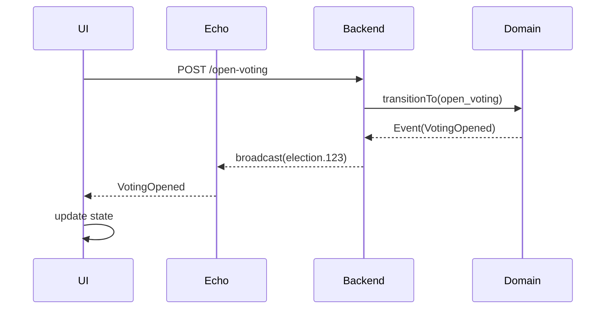
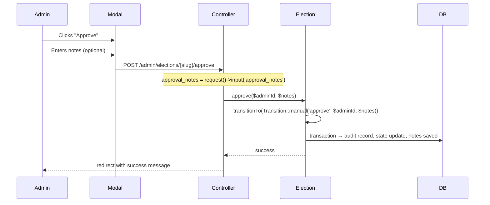

Short answer: **yes, this is a strong plan—but it’s not production-ready yet.** You’re very close, but a few architectural gaps will hurt you later (especially given your goal of a reusable workflow engine and national-scale scenarios).

Let’s tighten it like a domain architect would.

---

# 🚨 First: What’s Solid (You’re doing this right)

You’ve already aligned with several best practices:

### ✅ 1. State-driven UI (correct direction)

You correctly moved from:

```
status → current_state
```

That’s exactly what a workflow-driven system should do.

### ✅ 2. Clear separation of concerns

* Backend → state machine + rules
* Frontend → rendering + triggering transitions

That matches **DDD Application Layer vs Presentation Layer** separation.

### ✅ 3. Explicit workflow phases

Your 7-state lifecycle is clean, deterministic, and extensible.

### ✅ 4. Componentization strategy

`StateBadge`, modals, admin pages → good reuse strategy.

---

# ❗ But Here’s What’s Missing (Critical Gaps)

## 1. ❌ You’re duplicating domain logic in the frontend

Right now:

```js
const canOpenVoting = computed(() => 
  currentState.value === 'nomination'
)
```

This is **dangerous**.

### Why?

You already defined rules in backend:

* TransitionMatrix
* Guards
* Permissions

Now you're **re-implementing them in Vue** → guaranteed drift.

---

## ✅ Fix: Backend must expose “allowed actions”

Instead of:

```js
current_state === 'nomination'
```

Do:

```json
{
  "current_state": "nomination",
  "allowed_actions": [
    "open_voting",
    "close_voting"
  ]
}
```

### Then frontend becomes:

```js
const canOpenVoting = computed(() =>
  props.election.allowed_actions.includes('open_voting')
)
```

---

### 🎯 Result

* Single source of truth (backend)
* Zero duplication
* Fully reusable workflow engine

---

## 2. ❌ Missing Role-Based UI Enforcement

You defined roles in backend:

```
Admin
Chief/Deputy
Org Admin
```

But frontend doesn’t enforce it properly.

---

## ✅ Fix: Include permissions in API

Backend should return:

```json
{
  "allowed_actions": ["open_voting"],
  "permissions": {
    "can_approve": false,
    "can_open_voting": true
  }
}
```

Then UI:

```js
v-if="permissions.can_open_voting"
```

---

## 3. ❌ No Generic Workflow Abstraction (Hardcoded Election)

Right now everything is:

```
Election-specific
```

But your goal is:

> multi-domain reusable engine

---

## ✅ Fix: Introduce Workflow UI Contract

Instead of:

```
StateBadge.vue (Election-specific)
```

Make it:

```
WorkflowStateBadge.vue
WorkflowActionPanel.vue
WorkflowTimeline.vue
```

---

### 🎯 Generic Contract

```ts
interface WorkflowEntity {
  id: string
  state: string
  allowed_actions: string[]
  metadata: Record<string, any>
}
```

Now Election = one implementation.

---

## 4. ❌ No Error Handling Strategy for Transitions

Currently:

```js
router.post(...)
```

But what if:

* Transition invalid
* Permission denied
* Race condition

---

## ✅ Fix: Standardized Error Contract

Backend:

```json
{
  "error": {
    "code": "INVALID_TRANSITION",
    "message": "Cannot open voting from current state"
  }
}
```

Frontend:

```js
onError: (error) => {
  notify.error(error.message)
}
```

---

## 5. ❌ No Optimistic vs Pessimistic UI Strategy

Right now:

* Always reload after action

That’s safe but inefficient.

---

## ✅ Better approach:

| Strategy    | Use                                          |
| ----------- | -------------------------------------------- |
| Pessimistic | critical transitions (approve, close voting) |
| Optimistic  | UI-only actions                              |

---

## 6. ❌ Real-time events are underspecified

You added Echo, but missing:

* Channel design
* Event naming consistency
* Multi-tenant isolation

---

## ✅ Fix: Define event contract



---

## 7. ❌ Missing Test Strategy for Frontend (critical)

You wrote checklist, but not structured.

---

## ✅ Add proper layers

### Component tests

* StateBadge rendering
* Modal validation

### Integration tests

* Button visibility per state

### E2E tests (CRITICAL for elections)

* Full lifecycle: draft → results

---

# 🧠 Architecture Upgrade (What You Should Really Do)

## Introduce a Workflow Adapter Layer

```
Backend (DDD)
    ↓
Workflow DTO Adapter
    ↓
Frontend (Generic Workflow Components)
```

---

## 🔷 Example DTO

```json
{
  "workflow": {
    "state": "voting",
    "allowed_actions": ["close_voting"],
    "transitions": [
      {
        "action": "close_voting",
        "label": "Close Voting",
        "variant": "danger"
      }
    ]
  }
}
```

---

## Frontend becomes fully generic:

```vue
<WorkflowActionPanel :workflow="election.workflow" />
```

---

# 📊 Final Evaluation

| Area                      | Status | Verdict           |
| ------------------------- | ------ | ----------------- |
| State Machine Integration | ✅      | Strong            |
| UI Architecture           | ⚠️     | Needs abstraction |
| Reusability               | ❌      | Not achieved yet  |
| DDD Alignment             | ⚠️     | Partial           |
| Production Readiness      | ⚠️     | Medium            |

---

# 🚀 What I Would Change (In Order)

### 🔥 MUST DO (before implementation)

1. Replace all frontend state checks with:

   * `allowed_actions`
2. Add permissions to API
3. Standardize error responses

---

### ⚡ SHOULD DO

4. Introduce generic workflow components
5. Add event contract for real-time

---

### 🧠 LATER (Level 6)

6. Workflow UI engine (multi-domain)
7. Plugin system (your original goal)

---

# 🧾 Final Verdict

Your plan is:

> **80% implementation-ready, but only 60% architecturally complete**

If you implement it as-is:

* It will work ✅
* But it will **not scale or generalize** ❌

If you apply the fixes above:

* You get a **true reusable workflow engine UI** 🚀

---

If you want next step, I can evolve this into:

👉 **“Workflow UI Engine (Frontend) – Plugin Architecture with Vue 3 + DDD alignment”**

That would match your long-term vision perfectly.
## ✅ ChatGPT's Analysis is CRITICAL and CORRECT

**Short answer:** Do NOT implement the plan as-is. The frontend is duplicating domain logic, which will cause bugs and maintenance nightmares.

---

## The Core Problem: Duplicated Domain Logic

| Where | Logic | Problem |
|-------|-------|---------|
| **Backend** | `TransitionMatrix::canPerformAction()` | Single source of truth ✅ |
| **Frontend (planned)** | `currentState === 'nomination'` | Duplicated logic ❌ |

**This guarantees drift.** Backend rules change → frontend breaks.

---

## What Must Change Before Implementation

### 1. Backend Must Expose `allowed_actions`

```php
// In Election model, add to API response
public function toArray()
{
    return [
        // ... existing
        'allowed_actions' => TransitionMatrix::getAllowedActions($this->state),
    ];
}
```

### 2. Frontend Uses `allowed_actions`, Not State Checks

```vue
<!-- ❌ WRONG - duplicates backend logic -->
<button v-if="currentState === 'nomination'">Open Voting</button>

<!-- ✅ CORRECT - backend tells frontend what's allowed -->
<button v-if="allowedActions.includes('open_voting')">Open Voting</button>
```

### 3. Include Permissions in API Response

```php
public function toArray()
{
    return [
        // ... existing
        'allowed_actions' => TransitionMatrix::getAllowedActions($this->state),
        'permissions' => [
            'can_approve' => auth()->user()->can('approve-election'),
            'can_reject' => auth()->user()->can('reject-election'),
        ],
    ];
}
```

---

## Revised Plan vs Original Plan

| Aspect | Original Plan | Revised Plan |
|--------|---------------|--------------|
| Button visibility | Frontend checks state | Backend provides `allowed_actions` |
| Permission logic | Frontend would duplicate | Backend provides `permissions` |
| State badge | ✅ Acceptable | ✅ Keep as is |
| Admin approval | ✅ Acceptable | ✅ Keep as is |
| Error handling | Not specified | Standardized error contract |

---

## What to Tell Claude

```markdown
## Frontend Implementation Plan - CRITICAL REVISION REQUIRED

ChatGPT identified that my plan duplicates domain logic in the frontend. Do NOT proceed with the original plan.

Instead, update the plan with these changes:

### Change 1: Backend must expose `allowed_actions`

In the API response (Inertia props), include:
```php
'allowed_actions' => TransitionMatrix::getAllowedActions($election->state),
```

### Change 2: Frontend uses `allowed_actions`

```vue
<button v-if="allowedActions.includes('open_voting')">Open Voting</button>
```

### Change 3: Add permission flags to API

```php
'permissions' => [
    'can_approve' => auth()->user()->can('approve-election'),
    'can_reject' => auth()->user()->can('reject-election'),
]
```

### Change 4: Standardize error handling

Backend returns:
```json
{
  "error": {
    "code": "INVALID_TRANSITION",
    "message": "Cannot open voting from current state"
  }
}
```

Frontend displays error.message

### Change 5: Keep StateBadge component (no changes needed)

Proceed with the revised plan only.
```

---

## Summary

| Priority | Action | Time |
|----------|--------|------|
| **P0** | Update backend to expose `allowed_actions` | 15 min |
| **P0** | Update backend to expose `permissions` | 15 min |
| **P1** | Update frontend to use `allowed_actions` | 1 hour |
| **P2** | Implement error handling | 30 min |

**Do NOT build frontend state checks. Let the backend tell the frontend what's allowed.** 🚀
## ✅ APPROVED - Update Admin Approval Controller

**Short answer:** Yes! This passes the approval notes from the modal to the `approve()` method.

---

## What Changed

| Before | After |
|--------|-------|
| `$election->approve(auth()->id())` | `$election->approve(auth()->id(), $notes)` |
| Notes ignored | Notes saved to `approval_notes` column |

---

## The Full Flow



---

## Related Updates Needed

1. **Rejection controller** should also capture the reason:

```php
public function reject(Request $request, Election $election): RedirectResponse
{
    $request->validate(['reason' => 'required|string|min:10|max:500']);
    
    $election->reject(auth()->id(), $request->reason);
    // ...
}
```

2. **Add validation rules** for notes (optional, max length):

```php
$request->validate([
    'approval_notes' => 'nullable|string|max:500',
]);
```

---

## Proceed with the edit. 🚀