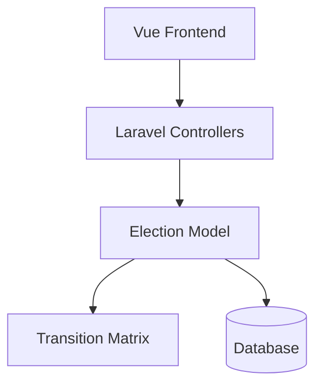
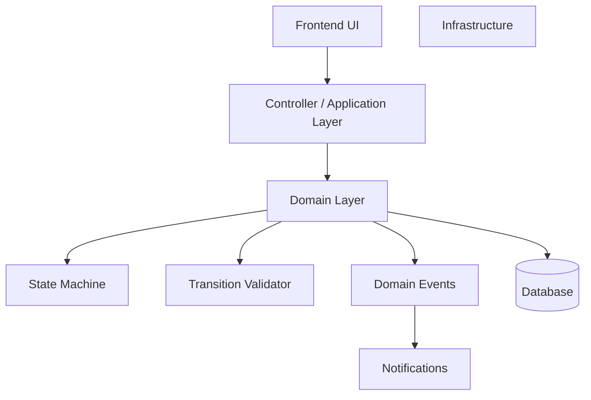
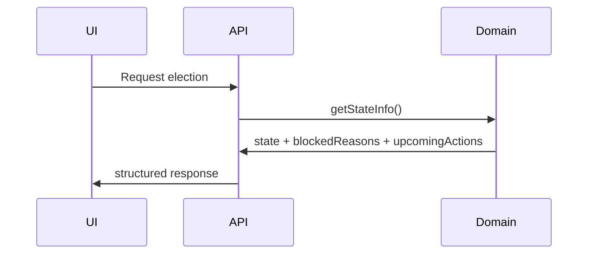
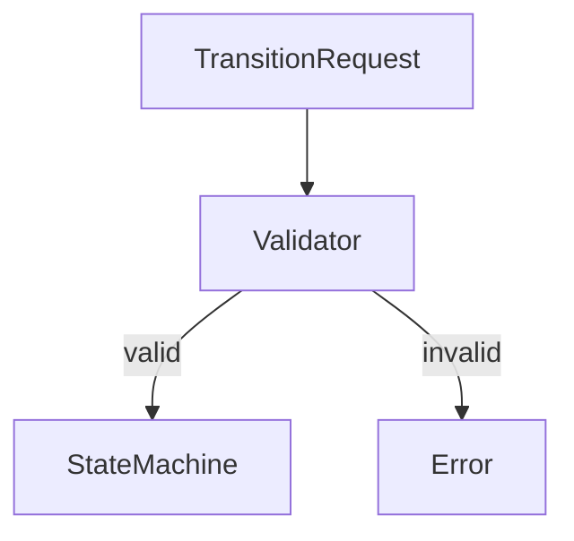
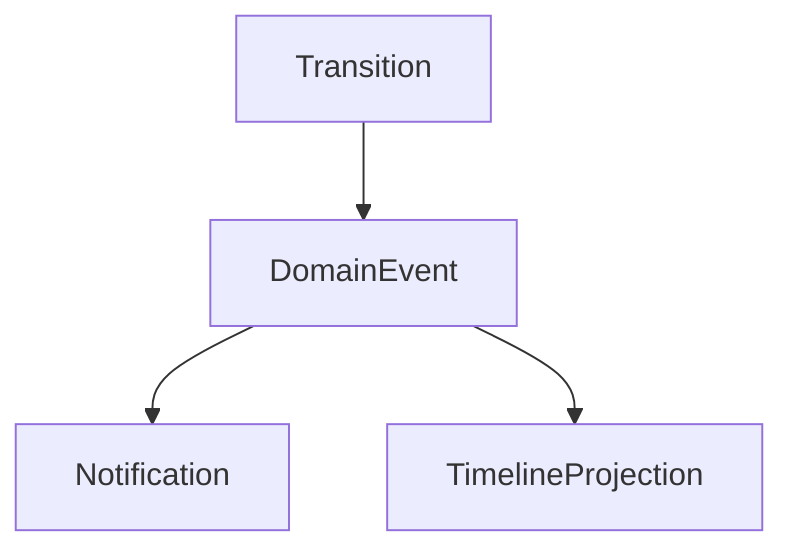

# 🧠 Brainstorming: Making State Machine More Clear, Robust & Transparent

## Current State Assessment

You have a **working state machine** but want to make it **more clear, robust, and transparent**. Let's brainstorm improvements.

---

## 🎯 Goal 1: Make State Machine MORE CLEAR

### Problem: State is explicit but hidden in database

Current: `state = 'administration'` in DB column. Clear enough, but:

- Users can't see "why" they can't perform an action
- No visual indication of upcoming steps
- Missing context for blocked states

### Solutions

#### 1.1 Add "Blocked Reason" UI

```vue
<!-- In Management.vue -->
<div v-if="canOpenVoting === false && currentState === 'nomination'" class="warning-banner">
  ⚠️ Cannot open voting because:
  <ul>
    <li v-if="!hasCandidates">No candidates approved</li>
    <li v-if="hasPendingCandidacies">{{ pendingCount }} pending applications</li>
    <li v-if="!nominationCompleted">Nomination phase not completed</li>
  </ul>
</div>
```

**From backend:**
```php
public function getTransitionBlockedReason(string $action): ?string
{
    return match($action) {
        'open_voting' => $this->getVotingPhaseBlockedReason(),
        'close_voting' => $this->getCountingPhaseBlockedReason(),
        default => null,
    };
}
```

#### 1.2 Add "Upcoming Actions" Preview

```vue
<div class="upcoming-actions">
  <h4>Next Steps:</h4>
  <ul>
    <li v-for="action in upcomingActions" :key="action">
      {{ action.label }}
      <span class="hint">{{ action.description }}</span>
    </li>
  </ul>
</div>
```

**Backend:**
```php
public function getUpcomingActions(): array
{
    return match($this->state) {
        'draft' => [['action' => 'submit_for_approval', 'label' => 'Submit for Approval']],
        'administration' => [['action' => 'complete_administration', 'label' => 'Complete Setup']],
        'nomination' => [['action' => 'open_voting', 'label' => 'Open Voting']],
        'voting' => [['action' => 'close_voting', 'label' => 'Close Voting']],
        'results_pending' => [['action' => 'publish_results', 'label' => 'Publish Results']],
        default => [],
    };
}
```

#### 1.3 Add Visual Timeline with Hover Details

```vue
<div class="timeline">
  <div 
    v-for="phase in phases" 
    :key="phase.state"
    :class="{ active: phase.state === currentState, completed: isCompleted(phase.state) }"
    @mouseenter="showPhaseDetails(phase)"
  >
    <div class="phase-icon">{{ phase.icon }}</div>
    <div class="phase-name">{{ phase.name }}</div>
    
    <!-- Tooltip on hover -->
    <div v-if="hoveredPhase === phase.state" class="tooltip">
      <p><strong>Required:</strong> {{ phase.requirements.join(', ') }}</p>
      <p><strong>Duration:</strong> {{ formatDates(phase) }}</p>
      <p v-if="phase.blockedReason" class="blocked">{{ phase.blockedReason }}</p>
    </div>
  </div>
</div>
```

---

## 🛡️ Goal 2: Make State Machine MORE ROBUST

### Problem: Current validation is scattered

- Guards in model methods
- Permissions in TransitionMatrix
- Business rules in side effects

### Solutions

#### 2.1 Centralized Validation Pipeline

```php
class TransitionValidator
{
    private array $rules = [];

    public function addRule(string $action, callable $rule, string $errorMessage): self
    {
        $this->rules[$action][] = ['check' => $rule, 'message' => $errorMessage];
        return $this;
    }

    public function validate(string $action, Election $election): void
    {
        foreach ($this->rules[$action] ?? [] as $rule) {
            if (!$rule['check']($election)) {
                throw new ValidationException($rule['message']);
            }
        }
    }
}

// Registration
$validator = new TransitionValidator();
$validator
    ->addRule('open_voting', fn($e) => $e->nomination_completed, 'Nomination phase not completed')
    ->addRule('open_voting', fn($e) => $e->candidates_count > 0, 'No candidates registered')
    ->addRule('open_voting', fn($e) => $e->pending_candidacies_count === 0, 'Pending applications exist');
```

#### 2.2 Add Retry Mechanism for Concurrent Transitions

```php
public function transitionTo(Transition $transition, int $retries = 3): ElectionStateTransition
{
    for ($attempt = 1; $attempt <= $retries; $attempt++) {
        try {
            return $this->doTransition($transition);
        } catch (DeadlockException $e) {
            if ($attempt === $retries) throw $e;
            usleep(100000 * $attempt); // 100ms, 200ms, 300ms
            continue;
        }
    }
}
```

#### 2.3 Add State Transition Audit Dashboard

```sql
-- View for monitoring
CREATE VIEW election_state_audit AS
SELECT 
    e.name as election_name,
    t.from_state,
    t.to_state,
    t.trigger,
    u.name as actor,
    t.created_at,
    CASE 
        WHEN t.created_at < e.voting_starts_at THEN '✅ Before voting'
        WHEN t.created_at BETWEEN e.voting_starts_at AND e.voting_ends_at THEN '⚠️ During voting'
        ELSE '✅ After voting'
    END as timing_status
FROM election_state_transitions t
JOIN elections e ON e.id = t.election_id
LEFT JOIN users u ON u.id = t.actor_id
ORDER BY t.created_at DESC;
```

---

## 🔍 Goal 3: Make State Machine MORE TRANSPARENT

### Problem: Users don't understand "why"

- Why can't I open voting?
- Why was my election rejected?
- How long until results?

### Solutions

#### 3.1 Add State Change Notifications

```php
// In transitionTo() after successful transition
Notification::send($election->officers, new StateChangedNotification(
    election: $election,
    fromState: $fromState,
    toState: $toState,
    actor: auth()->user(),
    reason: $transition->reason
));
```

#### 3.2 Add Public State Timeline Page

```vue
<!-- Public/Timeline.vue - No auth required -->
<template>
  <div class="public-timeline">
    <h1>{{ election.name }} - Election Progress</h1>
    
    <div class="timeline">
      <div v-for="phase in phases" :key="phase.state" class="timeline-step">
        <div class="step-marker" :class="{ completed: phase.completed, active: phase.active }">
          {{ phase.completed ? '✓' : phase.index }}
        </div>
        <div class="step-content">
          <h3>{{ phase.name }}</h3>
          <p>{{ phase.description }}</p>
          <p v-if="phase.completed_at" class="date">Completed: {{ formatDate(phase.completed_at) }}</p>
          <p v-if="phase.active && phase.ends_at" class="countdown">
            {{ phase.ends_at | timeUntil }} remaining
          </p>
        </div>
      </div>
    </div>
  </div>
</template>
```

#### 3.3 Add "Estimated Timeline" Feature

```php
public function getEstimatedTimeline(): array
{
    $now = now();
    
    return [
        'current_phase' => $this->state,
        'current_phase_ends_at' => $this->getCurrentPhaseEndDate(),
        'estimated_completion' => $this->calculateEstimatedCompletion(),
        'remaining_phases' => $this->getRemainingPhases(),
        'blocked_reasons' => $this->getBlockedReasons(),
    ];
}

private function getCurrentPhaseEndDate(): ?Carbon
{
    return match($this->state) {
        'administration' => $this->administration_suggested_end,
        'nomination' => $this->nomination_suggested_end,
        'voting' => $this->voting_ends_at,
        default => null,
    };
}
```

---

## 📊 Complete Improvement Matrix

| Goal | Solution | Effort | Impact |
|------|----------|--------|--------|
| **Clarity** | Blocked reason UI | 2h | High |
| **Clarity** | Upcoming actions preview | 1h | Medium |
| **Clarity** | Visual timeline with tooltips | 3h | High |
| **Robustness** | Centralized validation pipeline | 4h | Very High |
| **Robustness** | Retry mechanism for concurrency | 1h | Medium |
| **Robustness** | Audit dashboard | 3h | High |
| **Transparency** | State change notifications | 2h | High |
| **Transparency** | Public timeline page | 4h | Very High |
| **Transparency** | Estimated timeline feature | 3h | Medium |

---

## Priority Recommendations

### 🔴 High Priority (Do Now)

1. **Add Blocked Reason UI** - Users need to know WHY
2. **Centralized Validation Pipeline** - Reduce bugs
3. **Public Timeline Page** - Builds trust

### 🟡 Medium Priority (Next Sprint)

4. **State Change Notifications** - Keep stakeholders informed
5. **Audit Dashboard** - For administrators
6. **Visual Timeline with Tooltips** - Better UX

### 🟢 Low Priority (Future)

7. **Estimated Timeline Feature** - Complex to calculate
8. **Upcoming Actions Preview** - Nice to have
9. **Retry Mechanism** - Edge case

---

## Quick Win Implementation (Today)

Add this to your Management.vue:

```vue
<!-- Show why action is blocked -->
<div v-if="blockedReason" class="info-box warning">
  <strong>⚠️ Cannot {{ actionLabel }}</strong>
  <p>{{ blockedReason }}</p>
  <button v-if="hasFixAction" @click="fixIssue">Fix Issue</button>
</div>
```

**Backend:**
```php
// In Election model
public function getBlockedReasonForAction(string $action): ?string
{
    return match($action) {
        'open_voting' => $this->getVotingPhaseBlockedReason(),
        'close_voting' => $this->getCountingPhaseBlockedReason(),
        default => null,
    };
}
```

---

**Which improvement would you like to implement first?** 🚀

What you have here is not just a “list of UI improvements.” It’s actually the beginning of a **mature workflow architecture evolution**—moving from a *working state machine* to a **transparent, domain-driven workflow system**.

Let’s break it down properly from an architectural perspective and then translate it into a **development plan you can execute cleanly**.

---

# 🧠 1. What Architecture You Currently Have

Right now your system looks like this:



### Characteristics

* State stored as string (`state`)
* Transitions executed in model (`transitionTo`)
* Guards/logic spread across:

  * Model methods
  * Transition matrix
  * Controller checks
* UI reacts to `current_state`

👉 This is a **Level 4–5 State Machine** (already good)

---

# 🚨 The Core Problem Identified

All three goals (clarity, robustness, transparency) point to the same architectural issue:

> ❗ **Business logic is fragmented and invisible**

### Symptoms

| Problem                   | Root Cause                      |
| ------------------------- | ------------------------------- |
| “Why can’t I click this?” | No exposed validation reasoning |
| Scattered validation      | No central rule engine          |
| Hard to debug transitions | No audit / observability        |
| UI guessing logic         | Backend not expressive enough   |

---

# 🧱 2. Target Architecture (What This Plan Moves You Toward)

This plan is implicitly evolving your system into this:



---

# 🧠 Key Architectural Shift

### BEFORE

```text
State Machine = transitions only
```

### AFTER

```text
State Machine = transitions + rules + explanations + observability
```

---

# 🎯 3. The Three Goals = Three Architectural Layers

---

## 🟦 GOAL 1: CLARITY → “Explain the system”

### What’s happening

You are introducing a **read model for UX clarity**

#### New Concepts

* Blocked Reason
* Upcoming Actions
* Timeline visualization

### Architecture Role

👉 This belongs to:

```text
Application Layer (DTO / ViewModel)
```

---

### Example Flow



---

### Key Insight

👉 You are NOT changing the state machine
👉 You are **making it explain itself**

---

## 🟨 GOAL 2: ROBUSTNESS → “Protect the system”

### What’s happening

You are introducing a **validation pipeline**

---

### Current (Problem)

```text
Validation scattered:
- if (...) in model
- matrix rules
- controller checks
```

---

### Target



---

### New Component

```php
TransitionValidator
```

👉 This becomes:

```text
Domain Service (DDD)
```

---

### Why this is critical

* Single source of truth
* Reusable rules
* Testable in isolation
* No duplication

---

### Additional robustness features

| Feature               | Purpose                |
| --------------------- | ---------------------- |
| Retry mechanism       | Handles DB concurrency |
| Audit view            | Observability          |
| Structured validation | Prevent invalid states |

---

## 🟩 GOAL 3: TRANSPARENCY → “Expose the system”

### What’s happening

You are introducing **domain observability + communication**

---

### Components

| Feature            | Type                    |
| ------------------ | ----------------------- |
| Notifications      | Domain Events           |
| Public timeline    | Read Model / Projection |
| Estimated timeline | Domain calculation      |

---

### Architecture



---

### Key Insight

👉 You are moving toward **Event-Driven Architecture (lightweight)**

---

# 🧠 4. Hidden Architectural Evolution (Very Important)

This plan is quietly moving your system from:

### ❌ CRUD + State

to

### ✅ Workflow Engine

---

## Evolution Levels

| Level                 | Description                           |
| --------------------- | ------------------------------------- |
| L1                    | CRUD                                  |
| L2                    | Status field                          |
| L3                    | State machine                         |
| L4                    | Guarded transitions                   |
| L5                    | Domain events                         |
| **L6 (you are here)** | **Explainable + observable workflow** |

---

# 🛠️ 5. Development Plan (Clean Execution Strategy)

Now let’s translate this into **how you should actually build it**.

---

## 🔴 Phase 1: Expose State Intelligence (FAST WIN)

### Goal: UI clarity

### Backend

Add to `Election`:

```php
public function getStateContext(): array
{
    return [
        'state' => $this->state,
        'blocked_reasons' => $this->getBlockedReasons(),
        'available_actions' => $this->getAvailableActions(),
        'upcoming_actions' => $this->getUpcomingActions(),
    ];
}
```

---

### Frontend

* Show blocked reason
* Show next actions

👉 Immediate UX improvement

---

## 🟠 Phase 2: Centralize Validation (CORE)

### Create:

```php
App\Domain\Election\TransitionValidator
```

---

### Refactor:

```php
transitionTo()
```

➡️ becomes:

```php
$validator->validate($transition, $this);
$this->applyTransition($transition);
```

---

### Add Tests (TDD)

* invalid transitions
* edge cases
* rule combinations

---

## 🟡 Phase 3: Introduce Domain Events

You already partially have this.

Now formalize:

```php
event(new ElectionStateChanged(...))->afterCommit();
```

---

### Add:

* Notifications
* Timeline updates

---

## 🟢 Phase 4: Observability Layer

### Add:

* Audit view (SQL or projection)
* Admin dashboard

---

## 🔵 Phase 5: UX & Transparency

* Public timeline page
* Countdown timers
* Tooltips

---

# ⚠️ What NOT to Do (Important)

Avoid:

❌ Mixing UI logic into domain
❌ Keeping validation in controllers
❌ Adding more “if conditions” in model
❌ Overengineering (event sourcing, etc.)

---

# 🧠 6. Final Architectural Summary

You are building:

```text
Election Workflow Engine
```

With these layers:

| Layer          | Responsibility               |
| -------------- | ---------------------------- |
| UI             | Visualization + interaction  |
| Application    | Data shaping (state context) |
| Domain         | State machine + validation   |
| Infrastructure | DB, notifications            |

---

# 🚀 Final Verdict

### This plan is:

| Aspect       | Evaluation                   |
| ------------ | ---------------------------- |
| Direction    | ✅ Excellent                  |
| Architecture | ✅ Strong (DDD-aligned)       |
| Practicality | ✅ Realistic                  |
| Risk         | 🟡 Medium (needs discipline) |

---

# 🧭 What I Recommend You Do Next

Start with:

### 👉 Phase 1 (Blocked Reasons + State Context)

Because:

* Immediate user value
* No architectural risk
* Builds foundation for everything else

---

If you want next step, I can:

* Design the **TransitionValidator properly (DDD + TDD)**
* Or refactor your current `transitionTo()` into clean architecture
* Or map this into your **Vue components cleanly**

Just tell me 👍
