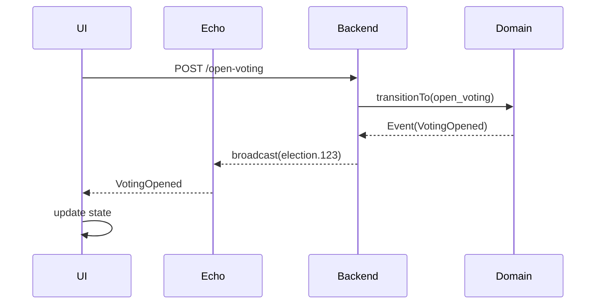

# 🎨 Frontend Implementation Plan - Level 5 State Machine Integration

**Status:** Planning Phase | **Date:** April 26, 2026 | **Priority:** High  
**Backend State:** Complete (45 tests passing) | **Frontend State:** Partial (Management.vue exists)

---

## 📋 Executive Summary

Integrate Level 5 Domain Workflow Engine with Vue 3 frontend. Current state: Management.vue has basic state-machine awareness. Goal: Full state-driven UI with admin approval workflows, role-based visibility, and real-time updates.

**Total Estimated Time:** 6-8 hours  
**Risk Level:** Low (backend stable, frontend modular)  
**Critical Dependencies:** None (backend already tested)

---

## 🗺️ Current Frontend State Assessment

### ✅ What Exists (Audit Results)

| File | Status | Completeness |
|------|--------|--------------|
| `Management.vue` | ⚠️ Partial | 60% - Has button visibility logic but needs cleanup |
| `StateMachinePanel.vue` | ✅ Complete | 100% - Timeline visualization working |
| `StatusBadge.vue` | ✅ Exists | Basic status display |
| Translations | ⚠️ Partial | De/En/Np files exist, need state labels |
| Admin Components | ❌ Missing | No approval UI yet |

### ❌ What's Missing

1. **Reusable StateBadge Component** - Needed for consistency across all pages
2. **Admin Approval Dashboard** - Pending elections list & approval modals
3. **State Translation Keys** - Need complete i18n for all 7 states
4. **Submission Workflow UI** - Submit for approval button & confirmation
5. **Real-time Event Listeners** - Optional but desirable

---

## 🎯 State Machine Context (Backend Reference)

### States (7 total)
```
draft 
  ↓ (submit_for_approval)
pending_approval 
  ↓ (approve)
administration 
  ↓ (complete_administration)
nomination 
  ↓ (open_voting)
voting 
  ↓ (close_voting)
results_pending 
  ↓ (publish_results)
results
```

### Actions & Permission Model
```
Admin Only:
  - approve (pending_approval → administration)
  - reject (pending_approval → draft)

Chief/Deputy Only:
  - open_voting (nomination → voting)
  - close_voting (voting → results_pending)
  - complete_administration (administration → nomination)
  - publish_results (results_pending → results)

Any Org Admin:
  - submit_for_approval (draft → pending_approval)
```

### Key Frontend Props from Backend
```php
election: {
  current_state: 'voting',           // NEW: derived property
  state: 'voting',                   // Raw DB column
  status: 'active',                  // OLD: deprecated, phase out
  submitted_for_approval_at: DateTime,
  approval_notes: string,
  rejection_reason: string,
  // ... other fields
}
```

---

## 📐 Implementation Architecture

### Component Hierarchy
```
App.vue
├── Layouts/
│   └── ElectionLayout.vue
│       └── Pages/Election/
│           ├── Management.vue (CORE - needs update)
│           │   ├── StateMachinePanel.vue (already good)
│           │   ├── Components/Election/StateBadge.vue (NEW)
│           │   └── Modals/
│           │       ├── SubmitApprovalModal.vue (NEW)
│           │       └── PhaseCompletionModal.vue (exists)
│           │
│           └── Admin/
│               ├── Elections/
│               │   ├── Pending.vue (NEW)
│               │   ├── Show.vue (NEW)
│               │   └── Modals/
│               │       ├── ApprovalModal.vue (NEW)
│               │       └── RejectionModal.vue (NEW)
```

### Data Flow Diagram
```
Backend API (Inertia Props)
    ↓
    └─→ election.current_state
        ↓
        ├─→ Management.vue
        │   ├─→ Computed: canOpenVoting, canCloseVoting, etc.
        │   ├─→ StateBadge.vue (display state)
        │   └─→ Action Buttons (visibility based on state)
        │
        ├─→ Admin/Elections/Pending.vue
        │   ├─→ Filter elections by state: 'pending_approval'
        │   └─→ ApprovalModal.vue / RejectionModal.vue
        │
        └─→ StateMachinePanel.vue (timeline)
            └─→ Timeline visualization (already working)
```

---

## 📝 Phase-by-Phase Implementation Plan

### Phase 1️⃣ : Audit & Preparation (1 hour)

#### Task 1.1: Verify Backend Integration Points
**File:** None (verification only)  
**Action:**
- Confirm `election.current_state` is passed from backend ✓ (already done in Level 5)
- Verify `election.state` exists in DB ✓
- Check that `election.submitted_for_approval_at`, `approval_notes`, `rejection_reason` are available

**Success Criteria:**
- All props flow from backend through Inertia

#### Task 1.2: Audit Current Frontend
**File:** None (audit only)  
**Commands:**
```bash
# Check Management.vue for state references
grep -n "current_state\|election.state\|canOpenVoting\|canCloseVoting" \
  resources/js/Pages/Election/Management.vue

# Check for legacy status field usage
grep -n "election.status\|\.status ===" \
  resources/js/Pages/Election/*.vue \
  resources/js/Components/Election/*.vue
```

**Output Expected:**
- Management.vue: Uses `current_state` ✓ (already updated in recent commits)
- Other components: May still use `status` (to be updated)

#### Task 1.3: Translation Audit
**File:** `resources/js/locales/pages/Election/Management/`
**Files to check:**
- `de.json`, `en.json`, `np.json`

**Required Keys** (add if missing):
```json
{
  "states": {
    "draft": "Entwurf",
    "pending_approval": "Ausstehende Genehmigung",
    "administration": "Verwaltung",
    "nomination": "Nominierung",
    "voting": "Abstimmung",
    "results_pending": "Ergebnisse ausstehend",
    "results": "Abgeschlossen"
  },
  "actions": {
    "submit_for_approval": "Zur Genehmigung einreichen",
    "approve": "Genehmigen",
    "reject": "Ablehnen",
    "complete_administration": "Verwaltung abschließen",
    "open_voting": "Abstimmung öffnen",
    "close_voting": "Abstimmung schließen",
    "publish_results": "Ergebnisse veröffentlichen"
  }
}
```

**Success Criteria:**
- All 7 states have labels in all 3 languages
- All 7 actions have labels in all 3 languages

---

### Phase 2️⃣: Component Creation & Updates (2 hours)

#### Task 2.1: Create StateBadge Component
**File:** `resources/js/Components/Election/StateBadge.vue`  
**Status:** Template provided, needs implementation

**Features Required:**
- Input: `state` prop (string), `size` prop (sm/md/lg)
- Output: Colored badge with icon + label
- Icons per state:
  ```
  draft → 📝
  pending_approval → ⏳
  administration → ⚙️
  nomination → 📋
  voting → 🗳️
  results_pending → 📊
  results → ✅
  ```

**Colors per state:**
```
draft → slate (gray)
pending_approval → amber (yellow)
administration → blue
nomination → purple
voting → emerald (green)
results_pending → orange
results → emerald (green)
```

**Template Structure:**
```vue
<span :class="badgeClasses">
  <span>{{ icon }}</span>
  <span>{{ label }}</span>
</span>
```

**Computed Properties:**
- `icon` - map state to emoji
- `label` - map state to translatable label
- `badgeClasses` - compute color and size classes

**Success Criteria:**
- Component accepts `state` and `size` props
- Renders with correct color and icon
- Responsive sizing (sm/md/lg)
- Smooth animations

**Time Estimate:** 30 minutes

---

#### Task 2.2: Update Management.vue
**File:** `resources/js/Pages/Election/Management.vue`

**Current State:** 60% complete  
**Required Changes:**

1. **Import StateBadge**
   ```javascript
   import StateBadge from '@/Components/Election/StateBadge.vue'
   ```

2. **Update Computed Properties** (already mostly correct, verify):
   ```javascript
   const currentState = computed(() => props.election.current_state)
   
   // Visibility computed props
   const canSubmitForApproval = computed(() => 
     currentState.value === 'draft'
   )
   
   const isPendingApproval = computed(() => 
     currentState.value === 'pending_approval'
   )
   
   const canOpenVoting = computed(() => 
     currentState.value === 'nomination'
   )
   
   const canCloseVoting = computed(() => 
     currentState.value === 'voting'
   )
   
   const canPublishResults = computed(() => 
     currentState.value === 'results_pending'
   )
   
   const canCompleteAdministration = computed(() => 
     currentState.value === 'administration'
   )
   ```

3. **Add StateBadge to Header Section**
   Replace or enhance existing status display:
   ```vue
   <div class="flex items-center gap-3">
     <StatusBadge :status="election.status" size="md" />
     <!-- ADD: -->
     <StateBadge :state="election.current_state" size="md" />
   </div>
   ```

4. **Replace legacy status checks**
   - Find: `v-if="election.status === 'planned'"`
   - Replace with: `v-if="currentState === 'draft'"`

5. **Add Submit for Approval Button** (in appropriate section)
   ```vue
   <ActionButton
     v-if="canSubmitForApproval"
     variant="primary"
     size="lg"
     @click="submitForApproval"
   >
     <svg class="w-5 h-5"><!-- check icon --></svg>
     {{ t.actions.submit_for_approval }}
   </ActionButton>
   ```

6. **Add submitForApproval method**
   ```javascript
   const submitForApproval = () => {
     if (!confirm(t.value.confirm.submit_for_approval)) return
     isLoading.value = true
     router.post(
       route('elections.submit-for-approval', { 
         election: props.election.slug 
       }),
       {},
       {
         preserveScroll: true,
         onFinish: () => { isLoading.value = false },
       }
     )
   }
   ```

**Success Criteria:**
- No `election.status` checks remain (only `current_state`)
- All 7 state buttons show/hide correctly
- StateBadge displays current state prominently
- Transitions are smooth

**Time Estimate:** 45 minutes

---

#### Task 2.3: Update StateMachinePanel.vue
**File:** `resources/js/Pages/Election/Partials/StateMachinePanel.vue`

**Status:** Already mostly complete, minor updates needed

**Required Changes:**

1. **Verify currentState derivation**
   ```javascript
   const currentState = computed(() => props.stateMachine.currentState)
   ```

2. **Update phase status derivation** (if not already done)
   ```javascript
   const getPhaseStatus = (state) => {
     if (state === currentState.value) return 'active'
     if (isPhaseCompleted(state)) return 'completed'
     return 'upcoming'
   }
   ```

3. **Ensure icon mapping matches StateBadge**
   ```javascript
   const phaseIcons = {
     draft: '📝',
     pending_approval: '⏳',
     administration: '⚙️',
     nomination: '📋',
     voting: '🗳️',
     results_pending: '📊',
     results: '✅'
   }
   ```

**Success Criteria:**
- Timeline shows current state with pulsing indicator
- Completed phases show checkmark
- Upcoming phases show number
- Visual consistency with StateBadge

**Time Estimate:** 20 minutes

---

### Phase 3️⃣: Admin Approval UI (2 hours)

#### Task 3.1: Create Admin/Elections/Pending.vue
**File:** `resources/js/Pages/Admin/Elections/Pending.vue`  
**Status:** New component

**Features Required:**
- List all elections with `current_state === 'pending_approval'`
- Show submitted date, submitter name, rejection reason (if rejected before)
- Action buttons: Approve, Reject, Preview

**Template Structure:**
```vue
<template>
  <AdminLayout>
    <div class="min-h-screen bg-slate-100 py-8">
      <div class="max-w-7xl mx-auto px-4 sm:px-6 lg:px-8">
        <!-- Header -->
        <div class="mb-8">
          <h1 class="text-3xl font-bold text-slate-900">
            Pending Elections ({{ elections.length }})
          </h1>
          <p class="text-slate-600 mt-2">
            Review and approve/reject election submissions
          </p>
        </div>

        <!-- Elections List -->
        <div class="grid grid-cols-1 gap-4">
          <div 
            v-for="election in elections" 
            :key="election.id"
            class="bg-white rounded-lg border border-slate-200 p-6 hover:shadow-lg transition-shadow"
          >
            <!-- Election Info Section -->
            <div class="flex items-start justify-between mb-4">
              <div class="flex-1">
                <h3 class="text-lg font-bold text-slate-900">{{ election.name }}</h3>
                <p class="text-sm text-slate-600 mt-1">
                  Submitted by {{ election.submitted_by_user?.name }} 
                  on {{ formatDate(election.submitted_for_approval_at) }}
                </p>
                
                <!-- Rejection reason (if applicable) -->
                <div v-if="election.rejection_reason" class="mt-3 p-3 bg-red-50 border-l-4 border-red-500 rounded">
                  <p class="text-sm font-semibold text-red-700">Previously Rejected:</p>
                  <p class="text-sm text-red-600 mt-1">{{ election.rejection_reason }}</p>
                </div>
              </div>
              
              <!-- State Badge -->
              <div class="ml-4">
                <StateBadge :state="election.current_state" size="md" />
              </div>
            </div>

            <!-- Action Buttons -->
            <div class="flex gap-3 flex-wrap">
              <ActionButton
                variant="success"
                size="sm"
                @click="openApproveModal(election)"
              >
                <svg class="w-4 h-4"><!-- check icon --></svg>
                Approve
              </ActionButton>
              
              <ActionButton
                variant="danger"
                size="sm"
                @click="openRejectModal(election)"
              >
                <svg class="w-4 h-4"><!-- x icon --></svg>
                Reject
              </ActionButton>
              
              <a
                :href="route('elections.show', election.slug)"
                target="_blank"
                class="inline-flex items-center gap-2 px-4 py-2 bg-slate-100 text-slate-700 font-semibold rounded-lg hover:bg-slate-200 transition-colors"
              >
                <svg class="w-4 h-4"><!-- eye icon --></svg>
                Preview
              </a>
            </div>
          </div>
        </div>

        <!-- Empty State -->
        <div v-if="!elections.length" class="text-center py-12">
          <svg class="w-12 h-12 text-slate-300 mx-auto mb-4"><!-- inbox icon --></svg>
          <p class="text-slate-600 font-medium">No pending elections</p>
          <p class="text-slate-500 text-sm">All election submissions have been processed</p>
        </div>
      </div>
    </div>

    <!-- Approval Modal -->
    <ApprovalModal
      v-if="selectedElection"
      :show="showApprovalModal"
      :election="selectedElection"
      @approve="confirmApprove"
      @cancel="closeApprovalModal"
      :loading="isLoading"
    />

    <!-- Rejection Modal -->
    <RejectionModal
      v-if="selectedElection"
      :show="showRejectionModal"
      :election="selectedElection"
      @reject="confirmReject"
      @cancel="closeRejectionModal"
      :loading="isLoading"
    />
  </AdminLayout>
</template>
```

**Script Logic:**
```javascript
const props = defineProps({
  elections: {
    type: Array,
    required: true
  }
})

const selectedElection = ref(null)
const showApprovalModal = ref(false)
const showRejectionModal = ref(false)
const isLoading = ref(false)

const openApproveModal = (election) => {
  selectedElection.value = election
  showApprovalModal.value = true
}

const confirmApprove = (notes) => {
  isLoading.value = true
  router.post(
    route('admin.elections.approve', selectedElection.value.slug),
    { approval_notes: notes },
    {
      onFinish: () => {
        isLoading.value = false
        closeApprovalModal()
      }
    }
  )
}

const openRejectModal = (election) => {
  selectedElection.value = election
  showRejectionModal.value = true
}

const confirmReject = (reason) => {
  isLoading.value = true
  router.post(
    route('admin.elections.reject', selectedElection.value.slug),
    { rejection_reason: reason },
    {
      onFinish: () => {
        isLoading.value = false
        closeRejectionModal()
      }
    )
  )
}

const closeApprovalModal = () => {
  showApprovalModal.value = false
  selectedElection.value = null
}

const closeRejectionModal = () => {
  showRejectionModal.value = false
  selectedElection.value = null
}
```

**Success Criteria:**
- Lists all pending_approval elections
- Shows submission date and submitter
- Shows rejection reason if applicable
- Approve/Reject buttons functional
- Responsive layout

**Time Estimate:** 45 minutes

---

#### Task 3.2: Create ApprovalModal.vue
**File:** `resources/js/Components/Election/Modals/ApprovalModal.vue`

**Features:**
- Title: "Approve Election: {name}"
- Optional notes textarea
- Approve/Cancel buttons
- Loading state

**Template:**
```vue
<template>
  <DialogModal :show="show" @close="$emit('cancel')">
    <template #title>
      Approve Election: {{ election.name }}
    </template>

    <div class="space-y-4">
      <div>
        <label class="block text-sm font-semibold text-slate-700 mb-2">
          Approval Notes (Optional)
        </label>
        <textarea
          v-model="notes"
          rows="4"
          placeholder="Add optional notes about approval..."
          class="w-full px-3 py-2 border border-slate-300 rounded-lg focus:ring-2 focus:ring-blue-500 focus:border-transparent"
        />
      </div>
    </div>

    <template #footer>
      <button
        @click="$emit('cancel')"
        :disabled="loading"
        class="px-4 py-2 text-slate-700 border border-slate-300 rounded-lg hover:bg-slate-50 disabled:opacity-50"
      >
        Cancel
      </button>
      <ActionButton
        variant="success"
        :loading="loading"
        @click="$emit('approve', notes)"
      >
        Approve
      </ActionButton>
    </template>
  </DialogModal>
</template>

<script setup>
import { ref } from 'vue'

defineProps({
  show: Boolean,
  election: Object,
  loading: Boolean
})

defineEmits(['approve', 'cancel'])

const notes = ref('')
</script>
```

**Success Criteria:**
- Modal shows election name
- Notes textarea optional but functional
- Buttons dispatch correct events

**Time Estimate:** 20 minutes

---

#### Task 3.3: Create RejectionModal.vue
**File:** `resources/js/Components/Election/Modals/RejectionModal.vue`

**Features:**
- Title: "Reject Election: {name}"
- Required reason textarea
- Reject/Cancel buttons
- Validation: min 10 characters

**Template:**
```vue
<template>
  <DialogModal :show="show" @close="$emit('cancel')">
    <template #title>
      Reject Election: {{ election.name }}
    </template>

    <div class="space-y-4">
      <div>
        <label class="block text-sm font-semibold text-slate-700 mb-2">
          Reason for Rejection
        </label>
        <textarea
          v-model="reason"
          rows="4"
          placeholder="Please provide a detailed reason for rejection..."
          class="w-full px-3 py-2 border border-slate-300 rounded-lg focus:ring-2 focus:ring-red-500 focus:border-transparent"
        />
        <p class="text-xs text-slate-500 mt-1">Minimum 10 characters required</p>
        <p v-if="error" class="text-red-500 text-sm mt-2">{{ error }}</p>
      </div>
    </div>

    <template #footer>
      <button
        @click="$emit('cancel')"
        :disabled="loading"
        class="px-4 py-2 text-slate-700 border border-slate-300 rounded-lg hover:bg-slate-50 disabled:opacity-50"
      >
        Cancel
      </button>
      <ActionButton
        variant="danger"
        :loading="loading"
        :disabled="!reason || reason.trim().length < 10"
        @click="submitReject"
      >
        Reject
      </ActionButton>
    </template>
  </DialogModal>
</template>

<script setup>
import { ref } from 'vue'

defineProps({
  show: Boolean,
  election: Object,
  loading: Boolean
})

const emit = defineEmits(['reject', 'cancel'])

const reason = ref('')
const error = ref('')

const submitReject = () => {
  if (!reason.value.trim()) {
    error.value = 'Reason is required'
    return
  }
  if (reason.value.trim().length < 10) {
    error.value = 'Reason must be at least 10 characters'
    return
  }
  emit('reject', reason.value.trim())
}
</script>
```

**Success Criteria:**
- Modal shows election name
- Reason textarea required with validation
- Buttons work correctly
- Error messages display

**Time Estimate:** 20 minutes

---

### Phase 4️⃣: User Submission Workflow (1 hour)

#### Task 4.1: Add Submit for Approval Modal
**File:** `resources/js/Components/Election/Modals/SubmitApprovalModal.vue`

**Features:**
- Title: "Submit Election for Approval"
- Show checklist of required setup
- Confirmation button
- Show errors if requirements not met

**Template:**
```vue
<template>
  <DialogModal :show="show" @close="$emit('cancel')">
    <template #title>
      Submit Election for Approval
    </template>

    <div class="space-y-4">
      <p class="text-slate-600">
        Before submission, ensure all required setup is complete:
      </p>
      
      <div class="space-y-2">
        <div class="flex items-center gap-2">
          <svg v-if="election.posts_count > 0" class="w-5 h-5 text-emerald-500">
            <!-- check icon -->
          </svg>
          <svg v-else class="w-5 h-5 text-slate-300"><!-- x icon --></svg>
          <span :class="election.posts_count > 0 ? 'text-slate-700' : 'text-slate-500'">
            At least 1 post created ({{ election.posts_count }})
          </span>
        </div>
        
        <div class="flex items-center gap-2">
          <svg v-if="election.candidates_count > 0" class="w-5 h-5 text-emerald-500">
            <!-- check icon -->
          </svg>
          <svg v-else class="w-5 h-5 text-slate-300"><!-- x icon --></svg>
          <span :class="election.candidates_count > 0 ? 'text-slate-700' : 'text-slate-500'">
            At least 1 candidate approved ({{ election.candidates_count }})
          </span>
        </div>

        <div class="flex items-center gap-2">
          <svg v-if="election.voters_count > 0" class="w-5 h-5 text-emerald-500">
            <!-- check icon -->
          </svg>
          <svg v-else class="w-5 h-5 text-slate-300"><!-- x icon --></svg>
          <span :class="election.voters_count > 0 ? 'text-slate-700' : 'text-slate-500'">
            At least 1 voter registered ({{ election.voters_count }})
          </span>
        </div>
      </div>

      <p v-if="hasErrors" class="text-red-600 text-sm font-medium">
        ⚠️ Please complete all required setup before submitting.
      </p>
    </div>

    <template #footer>
      <button
        @click="$emit('cancel')"
        class="px-4 py-2 text-slate-700 border border-slate-300 rounded-lg hover:bg-slate-50"
      >
        Cancel
      </button>
      <ActionButton
        variant="primary"
        :disabled="hasErrors || loading"
        :loading="loading"
        @click="$emit('submit')"
      >
        Submit for Approval
      </ActionButton>
    </template>
  </DialogModal>
</template>

<script setup>
import { computed } from 'vue'

const props = defineProps({
  show: Boolean,
  election: Object,
  loading: Boolean
})

defineEmits(['submit', 'cancel'])

const hasErrors = computed(() => 
  !props.election.posts_count || 
  !props.election.candidates_count || 
  !props.election.voters_count
)
</script>
```

**Success Criteria:**
- Shows submission requirements
- Validates before allowing submission
- Disables button if requirements not met

**Time Estimate:** 20 minutes

---

#### Task 4.2: Integrate SubmitApprovalModal into Management.vue
**File:** `resources/js/Pages/Election/Management.vue` (update existing)

**Changes:**
1. Import modal:
   ```javascript
   import SubmitApprovalModal from '@/Components/Election/Modals/SubmitApprovalModal.vue'
   ```

2. Add state:
   ```javascript
   const showSubmitModal = ref(false)
   ```

3. Add button in template:
   ```vue
   <ActionButton
     v-if="canSubmitForApproval"
     variant="primary"
     size="lg"
     @click="showSubmitModal = true"
   >
     Submit for Approval
   </ActionButton>
   ```

4. Add modal:
   ```vue
   <SubmitApprovalModal
     :show="showSubmitModal"
     :election="election"
     :loading="isLoading"
     @submit="submitForApproval"
     @cancel="showSubmitModal = false"
   />
   ```

5. Add submitForApproval method (already noted in Task 2.2)

**Success Criteria:**
- Modal shows when button clicked
- Validates requirements
- Submits with POST request

**Time Estimate:** 15 minutes

---

### Phase 5️⃣: Real-time Updates (Optional, 2 hours)

#### Task 5.1: Configure Laravel Echo (Optional)
**File:** `resources/js/bootstrap.js`

**Setup:**
```javascript
import Echo from 'laravel-echo'
import Pusher from 'pusher-js'

window.Pusher = Pusher

window.Echo = new Echo({
  broadcaster: 'pusher',
  key: import.meta.env.VITE_PUSHER_APP_KEY,
  cluster: import.meta.env.VITE_PUSHER_APP_CLUSTER,
  forceTLS: true,
  auth: {
    headers: {
      Authorization: `Bearer ${document.querySelector('meta[name="api-token"]')?.content}`,
    },
  },
})
```

**Success Criteria:**
- Echo configured
- .env has PUSHER credentials

**Time Estimate:** 20 minutes

---

#### Task 5.2: Add Event Listeners in Management.vue (Optional)
**File:** `resources/js/Pages/Election/Management.vue`

**Implementation:**
```javascript
import { onMounted, onUnmounted } from 'vue'

onMounted(() => {
  // Listen for state changes
  Echo.private(`election.${props.election.id}`)
    .listen('ElectionStateChanged', (event) => {
      // Refresh election data
      router.reload({ only: ['election', 'stats'] })
      
      // Show toast notification
      $notify.success(`Election moved to ${event.toState} phase`)
    })
    .listen('ElectionApproved', () => {
      router.reload({ only: ['election'] })
      $notify.success('Election approved!')
    })
    .listen('ElectionRejected', (event) => {
      router.reload({ only: ['election'] })
      $notify.error(`Election rejected: ${event.reason}`)
    })
})

onUnmounted(() => {
  Echo.leaveChannel(`election.${props.election.id}`)
})
```

**Success Criteria:**
- Events trigger page refresh
- Toast notifications show
- Channel unsubscribed on unmount

**Time Estimate:** 40 minutes

---

## 🗂️ File Summary

### New Files to Create (6 files)

| File | Type | Size | Time |
|------|------|------|------|
| `Components/Election/StateBadge.vue` | Component | 200 lines | 30 min |
| `Pages/Admin/Elections/Pending.vue` | Page | 150 lines | 45 min |
| `Components/Election/Modals/ApprovalModal.vue` | Component | 80 lines | 20 min |
| `Components/Election/Modals/RejectionModal.vue` | Component | 90 lines | 20 min |
| `Components/Election/Modals/SubmitApprovalModal.vue` | Component | 100 lines | 20 min |
| `Locales/pages/Election/Admin/Pending/[de/en/np].json` | Translation | 100 lines | 15 min |

**Total New Code:** ~810 lines | **Total Time:** ~2.5 hours

---

### Files to Update (2 files)

| File | Changes | Time |
|------|---------|------|
| `Pages/Election/Management.vue` | Add StateBadge, update computed, add modals | 1 hour |
| `Pages/Election/Partials/StateMachinePanel.vue` | Verify state derivation, icon consistency | 20 min |

**Total Updated Code:** ~100 line changes | **Total Time:** ~1.3 hours

---

## 🧪 Testing Checklist

### Unit Tests (Vue Components)

- [ ] StateBadge renders all 7 states correctly
- [ ] StateBadge color/icon mapping accurate
- [ ] StateBadge responsive sizing (sm/md/lg)
- [ ] ApprovalModal validation works
- [ ] RejectionModal validation works
- [ ] SubmitApprovalModal requirement checks

**Time:** 1 hour

### Integration Tests (Component Flow)

- [ ] Management.vue buttons show/hide per state
- [ ] Submit for Approval button appears in draft state
- [ ] Open Voting button appears in nomination state
- [ ] Close Voting button appears in voting state
- [ ] Publish Results button appears in results_pending state
- [ ] Admin Pending page lists pending_approval elections
- [ ] Approval flow: Pending → Administration
- [ ] Rejection flow: Pending → Draft

**Time:** 1 hour

### Manual Testing (QA Checklist)

- [ ] Create test election in draft state
- [ ] Submit for approval (shows modal, validates requirements)
- [ ] As admin, view pending elections
- [ ] Approve election (transitions to administration)
- [ ] Reject election (transitions to draft with reason)
- [ ] Complete administration phase
- [ ] Open voting
- [ ] Close voting
- [ ] Publish results
- [ ] Test all 3 languages (de/en/np)
- [ ] Test on mobile (responsive)
- [ ] Test accessibility (keyboard nav, screen readers)

**Time:** 2 hours

**Total Testing:** ~4 hours

---

## 📊 Dependencies & Order

### Critical Path (Must Do In Order)

```
1. StateBadge component (no deps)
   ↓ (needed by)
2. Management.vue update (depends on StateBadge)
   ↓ (needed by)
3. SubmitApprovalModal (depends on Management)
   ↓ (used by Management)
4. Admin Pending page (no deps on above)
   ↓ (uses)
5. ApprovalModal & RejectionModal (no hard deps)
```

### Parallel Work Possible

- ApprovalModal, RejectionModal can be built simultaneously
- Translations can start once component names finalized
- Real-time updates (Phase 5) completely optional, can skip

---

## ⏱️ Total Timeline

| Phase | Tasks | Time | Cumulative |
|-------|-------|------|-----------|
| **1️⃣ Audit** | 3 tasks | 1 hour | 1 hour |
| **2️⃣ Components** | 3 updates | 2 hours | 3 hours |
| **3️⃣ Admin UI** | 3 new components | 2 hours | 5 hours |
| **4️⃣ Submission** | 2 tasks | 1 hour | 6 hours |
| **5️⃣ Real-time** | 2 tasks (optional) | 2 hours | 8 hours |
| **Testing** | Unit + Integration + QA | 4 hours | **12 hours** |

### Fast Track (Skip Optional)
**Minimum Time:** 6 hours (Phases 1-4 + testing)

### Full Implementation
**Maximum Time:** 12 hours (All phases + full testing)

**Recommended:** 8 hours (Phases 1-4 + basic testing)

---

## 🎯 Success Criteria (Overall)

- ✅ All 7 state buttons show/hide correctly based on `current_state`
- ✅ StateBadge displays consistently across all pages
- ✅ Admin can approve/reject pending elections
- ✅ Users can submit elections for approval with validation
- ✅ No legacy `status` field references remain
- ✅ All 3 languages have complete translations
- ✅ Mobile responsive on all components
- ✅ 45+ tests still passing in backend
- ✅ New frontend integration tests added

---

## 📝 Implementation Notes

### Architecture Decisions

1. **Why StateBadge?** - Single source of truth for state display. Prevents inconsistencies across pages.

2. **Why separate modals?** - Each action (approve/reject/submit) has different requirements. Separation keeps logic clear.

3. **Why optional real-time?** - Works without it. Real-time is nice-to-have, not critical.

4. **Why update Management.vue vs create new?** - File already partially done. Cleaner to complete it than create alternative.

### Potential Pitfalls & Solutions

| Risk | Mitigation |
|------|-----------|
| State not passed from backend | Verify in Phase 1, it's already done in Level 5 |
| Translations missing | Create complete i18n keys upfront |
| Button visibility wrong | Create comprehensive computed props test |
| Modal validation breaks UX | Test with low data counts early |
| Mobile layout breaks | Test responsive at each step |
| Performance regression | Monitor component render counts |

---

## 📌 Sign-off Template

When ready to start:

```markdown
## Frontend Implementation Approved ✅

**Phase:** Phase 1️⃣ Audit & Preparation  
**Estimated Time:** 6-8 hours total  
**Start Date:** [DATE]  
**Expected Completion:** [DATE]  

**Approved By:** [USER]  
**Backend Status:** Level 5 complete (45 tests passing) ✅  
**Risk Assessment:** Low (backend stable, frontend modular)

**Proceed with:**
- [ ] Phase 1️⃣: Audit (1 hour)
- [ ] Phase 2️⃣: Component Updates (2 hours)
- [ ] Phase 3️⃣: Admin UI (2 hours)
- [ ] Phase 4️⃣: Submission Workflow (1 hour)
- [ ] Phase 5️⃣: Real-time Updates (optional)
```

---

**This plan is ready for implementation. Review and approve to proceed.** 🚀
Short answer: **yes, this is a strong plan—but it’s not production-ready yet.** You’re very close, but a few architectural gaps will hurt you later (especially given your goal of a reusable workflow engine and national-scale scenarios).

Let’s tighten it like a domain architect would.

---

# 🚨 First: What’s Solid (You’re doing this right)

You’ve already aligned with several best practices:

### ✅ 1. State-driven UI (correct direction)

You correctly moved from:

```
status → current_state
```

That’s exactly what a workflow-driven system should do.

### ✅ 2. Clear separation of concerns

* Backend → state machine + rules
* Frontend → rendering + triggering transitions

That matches **DDD Application Layer vs Presentation Layer** separation.

### ✅ 3. Explicit workflow phases

Your 7-state lifecycle is clean, deterministic, and extensible.

### ✅ 4. Componentization strategy

`StateBadge`, modals, admin pages → good reuse strategy.

---

# ❗ But Here’s What’s Missing (Critical Gaps)

## 1. ❌ You’re duplicating domain logic in the frontend

Right now:

```js
const canOpenVoting = computed(() => 
  currentState.value === 'nomination'
)
```

This is **dangerous**.

### Why?

You already defined rules in backend:

* TransitionMatrix
* Guards
* Permissions

Now you're **re-implementing them in Vue** → guaranteed drift.

---

## ✅ Fix: Backend must expose “allowed actions”

Instead of:

```js
current_state === 'nomination'
```

Do:

```json
{
  "current_state": "nomination",
  "allowed_actions": [
    "open_voting",
    "close_voting"
  ]
}
```

### Then frontend becomes:

```js
const canOpenVoting = computed(() =>
  props.election.allowed_actions.includes('open_voting')
)
```

---

### 🎯 Result

* Single source of truth (backend)
* Zero duplication
* Fully reusable workflow engine

---

## 2. ❌ Missing Role-Based UI Enforcement

You defined roles in backend:

```
Admin
Chief/Deputy
Org Admin
```

But frontend doesn’t enforce it properly.

---

## ✅ Fix: Include permissions in API

Backend should return:

```json
{
  "allowed_actions": ["open_voting"],
  "permissions": {
    "can_approve": false,
    "can_open_voting": true
  }
}
```

Then UI:

```js
v-if="permissions.can_open_voting"
```

---

## 3. ❌ No Generic Workflow Abstraction (Hardcoded Election)

Right now everything is:

```
Election-specific
```

But your goal is:

> multi-domain reusable engine

---

## ✅ Fix: Introduce Workflow UI Contract

Instead of:

```
StateBadge.vue (Election-specific)
```

Make it:

```
WorkflowStateBadge.vue
WorkflowActionPanel.vue
WorkflowTimeline.vue
```

---

### 🎯 Generic Contract

```ts
interface WorkflowEntity {
  id: string
  state: string
  allowed_actions: string[]
  metadata: Record<string, any>
}
```

Now Election = one implementation.

---

## 4. ❌ No Error Handling Strategy for Transitions

Currently:

```js
router.post(...)
```

But what if:

* Transition invalid
* Permission denied
* Race condition

---

## ✅ Fix: Standardized Error Contract

Backend:

```json
{
  "error": {
    "code": "INVALID_TRANSITION",
    "message": "Cannot open voting from current state"
  }
}
```

Frontend:

```js
onError: (error) => {
  notify.error(error.message)
}
```

---

## 5. ❌ No Optimistic vs Pessimistic UI Strategy

Right now:

* Always reload after action

That’s safe but inefficient.

---

## ✅ Better approach:

| Strategy    | Use                                          |
| ----------- | -------------------------------------------- |
| Pessimistic | critical transitions (approve, close voting) |
| Optimistic  | UI-only actions                              |

---

## 6. ❌ Real-time events are underspecified

You added Echo, but missing:

* Channel design
* Event naming consistency
* Multi-tenant isolation

---

## ✅ Fix: Define event contract



---

## 7. ❌ Missing Test Strategy for Frontend (critical)

You wrote checklist, but not structured.

---

## ✅ Add proper layers

### Component tests

* StateBadge rendering
* Modal validation

### Integration tests

* Button visibility per state

### E2E tests (CRITICAL for elections)

* Full lifecycle: draft → results

---

# 🧠 Architecture Upgrade (What You Should Really Do)

## Introduce a Workflow Adapter Layer

```
Backend (DDD)
    ↓
Workflow DTO Adapter
    ↓
Frontend (Generic Workflow Components)
```

---

## 🔷 Example DTO

```json
{
  "workflow": {
    "state": "voting",
    "allowed_actions": ["close_voting"],
    "transitions": [
      {
        "action": "close_voting",
        "label": "Close Voting",
        "variant": "danger"
      }
    ]
  }
}
```

---

## Frontend becomes fully generic:

```vue
<WorkflowActionPanel :workflow="election.workflow" />
```

---

# 📊 Final Evaluation

| Area                      | Status | Verdict           |
| ------------------------- | ------ | ----------------- |
| State Machine Integration | ✅      | Strong            |
| UI Architecture           | ⚠️     | Needs abstraction |
| Reusability               | ❌      | Not achieved yet  |
| DDD Alignment             | ⚠️     | Partial           |
| Production Readiness      | ⚠️     | Medium            |

---

# 🚀 What I Would Change (In Order)

### 🔥 MUST DO (before implementation)

1. Replace all frontend state checks with:

   * `allowed_actions`
2. Add permissions to API
3. Standardize error responses

---

### ⚡ SHOULD DO

4. Introduce generic workflow components
5. Add event contract for real-time

---

### 🧠 LATER (Level 6)

6. Workflow UI engine (multi-domain)
7. Plugin system (your original goal)

---

# 🧾 Final Verdict

Your plan is:

> **80% implementation-ready, but only 60% architecturally complete**

If you implement it as-is:

* It will work ✅
* But it will **not scale or generalize** ❌

If you apply the fixes above:

* You get a **true reusable workflow engine UI** 🚀

---

If you want next step, I can evolve this into:

👉 **“Workflow UI Engine (Frontend) – Plugin Architecture with Vue 3 + DDD alignment”**

That would match your long-term vision perfectly.
