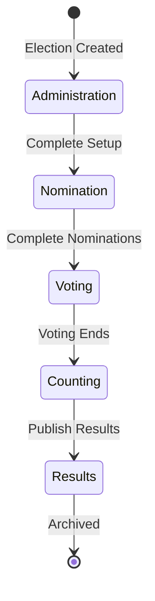
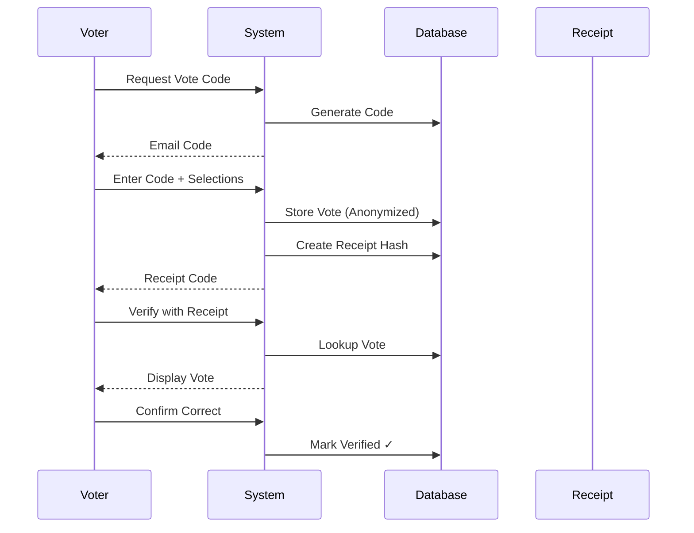
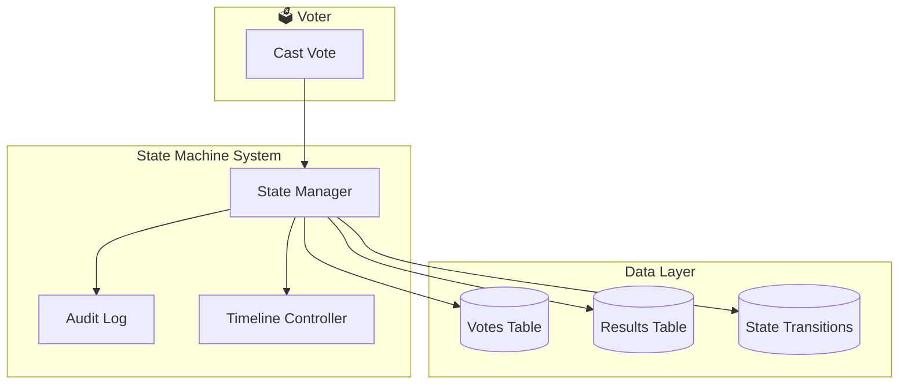

## Claude CLI Prompt Instructions
Basic info: 
tanslate startegy: developer_guide\translation\TRANSLATION_FIRST_STRATEGY.md
seo strategy: developer_guide\seo\MULTILINGUAL_SEO_ARCHITECTURE.md
color theme: developer_guide\color_theme\.

```markdown
## Task: Create Public-Facing Election State Machine Architecture Page

### Objective
Build a **publicly accessible, SEO-optimized, beautifully designed** page that explains the election state machine architecture to potential customers, election administrators, and the general public.

### Target URL
- Primary: `/election-architecture` (public route, no authentication required)
- Also accessible from election creation page via a "Learn about our secure election process" link

### Page Requirements

#### 1. Content & Messaging

| Section | Content |
|---------|---------|
| **Hero** | "Tamper-Proof Election State Machine" - Trusted by organizations worldwide |
| **What is a State Machine?** | Simple explanation with real-world analogy (e.g., assembly line, workflow) |
| **5-Phase Lifecycle** | Interactive diagram showing Administration → Nomination → Voting → Counting → Results |
| **Security Features** | Immutable audit trail, cryptographic verification, voting lock, grace periods |
| **Benefits for Administrators** | Easy setup, phase completion tracking, automatic transitions |
| **Benefits for Voters** | Anonymous voting, receipt verification, tamper-proof results |
| **Technical Trust Signals** | Open source, audited, verifiable, transparent |
| **FAQ** | Common questions about security, verification, legal compliance |
| **Call to Action** | Start an election, contact sales, request demo |

#### 2. Mermaid Diagrams (Embedded)

**Diagram 1: State Machine Flow**


**Diagram 2: Sequence Diagram - Vote Casting & Verification**


**Diagram 3: Architecture Overview**


#### 3. SEO Requirements

```html
<title>Election State Machine | Tamper-Proof Secure Voting System | Public Digit</title>
<meta name="description" content="Learn how our election state machine ensures tamper-proof, verifiable, and auditable elections. 5-phase lifecycle with immutable audit trail." />
<meta name="keywords" content="election state machine, secure voting, tamper-proof elections, verifiable voting, audit trail" />
<meta property="og:title" content="Election State Machine - Secure Voting Architecture" />
<meta property="og:description" content="Production-grade election state machine with immutable audit logs and cryptographic verification." />
<meta property="og:type" content="website" />
<meta name="twitter:card" content="summary_large_image" />
<link rel="canonical" href="https://publicdigit.com/election-architecture" />
```

#### 4. Translation Strategy (i18n First)

- Use Vue i18n with locale detection
- Support: English (default), German, Nepali
- Language switcher in header
- Translated Mermaid diagram descriptions (alt text)
- SEO meta tags localized per language

```
/locales
  /en
    /pages
      /public
        ElectionArchitecture.json
  /de
    /pages
      /public
        ElectionArchitecture.json
  /np
    /pages
      /public
        ElectionArchitecture.json
```

#### 5. TDD Approach (Write Tests FIRST)

**Test File:** `tests/Feature/Public/ElectionArchitecturePageTest.php`

```php
<?php

namespace Tests\Feature\Public;

use Tests\TestCase;

class ElectionArchitecturePageTest extends TestCase
{
    /** @test */
    public function public_architecture_page_is_accessible()
    {
        $response = $this->get(route('public.election-architecture'));
        $response->assertStatus(200);
        $response->assertSee('State Machine');
    }

    /** @test */
    public function page_contains_mermaid_diagrams()
    {
        $response = $this->get(route('public.election-architecture'));
        $response->assertSee('class="mermaid"');
        $response->assertSee('stateDiagram-v2');
    }

    /** @test */
    public function page_has_seo_meta_tags()
    {
        $response = $this->get(route('public.election-architecture'));
        $response->assertSee('<title>');
        $response->assertSee('name="description"');
        $response->assertSee('property="og:title"');
    }

    /** @test */
    public function language_switcher_is_present()
    {
        $response = $this->get(route('public.election-architecture'));
        $response->assertSee('EN');
        $response->assertSee('DE');
        $response->assertSee('NP');
    }

    /** @test */
    public function navigation_link_visible_on_election_create_page()
    {
        // Create test organisation
        $organisation = Organisation::factory()->create();
        
        $response = $this->actingAs($this->createAdmin())
            ->get(route('organisations.elections.create', $organisation->slug));
        
        $response->assertSee(route('public.election-architecture'));
        $response->assertSee('Learn about our secure election process');
    }
}
```

#### 6. Frontend Components to Create

**File:** `resources/js/Pages/Public/ElectionArchitecture.vue`

```vue
<template>
  <PublicLayout>
    <!-- Language Switcher -->
    <div class="language-switcher">
      <button @click="setLocale('en')" :class="{ active: locale === 'en' }">EN</button>
      <button @click="setLocale('de')" :class="{ active: locale === 'de' }">DE</button>
      <button @click="setLocale('np')" :class="{ active: locale === 'np' }">NP</button>
    </div>

    <!-- Hero Section -->
    <section class="hero">
      <h1>{{ t.hero.title }}</h1>
      <p>{{ t.hero.subtitle }}</p>
      <div class="trust-badges">...</div>
    </section>

    <!-- State Machine Diagram Section -->
    <section class="diagram-section">
      <h2>{{ t.diagrams.state_machine.title }}</h2>
      <pre class="mermaid">
        {{ stateMachineDiagram }}
      </pre>
    </section>

    <!-- Security Features Grid -->
    <section class="features-grid">
      <div v-for="feature in t.security_features" :key="feature.title">
        <h3>{{ feature.title }}</h3>
        <p>{{ feature.description }}</p>
      </div>
    </section>

    <!-- FAQ Section -->
    <section class="faq">
      <div v-for="item in t.faq" :key="item.question">
        <h3>{{ item.question }}</h3>
        <p>{{ item.answer }}</p>
      </div>
    </section>

    <!-- CTA -->
    <section class="cta">
      <a :href="route('organisations.elections.create', orgSlug)" class="btn-primary">
        {{ t.cta.start_election }}
      </a>
      <a href="/contact" class="btn-secondary">
        {{ t.cta.contact_sales }}
      </a>
    </section>
  </PublicLayout>
</template>

<script setup>
import { computed } from 'vue'
import { useI18n } from 'vue-i18n'
import PublicLayout from '@/Layouts/PublicLayout.vue'

const { locale, t } = useI18n()

const setLocale = (lang) => {
  locale.value = lang
  // Store preference in localStorage
  localStorage.setItem('locale', lang)
}

const stateMachineDiagram = computed(() => {
  if (locale.value === 'de') return germanDiagram
  if (locale.value === 'np') return nepaliDiagram
  return englishDiagram
})
</script>

<style scoped>
/* Professional, modern, trustworthy design */
.hero {
  background: linear-gradient(135deg, #1B2E4B 0%, #0F1E33 100%);
  color: white;
  padding: 4rem 2rem;
  text-align: center;
}

.language-switcher {
  position: fixed;
  top: 1rem;
  right: 1rem;
  z-index: 100;
  display: flex;
  gap: 0.5rem;
  background: white;
  padding: 0.5rem;
  border-radius: 999px;
  box-shadow: 0 2px 8px rgba(0,0,0,0.1);
}

.diagram-section {
  background: #f8fafc;
  padding: 3rem 2rem;
  margin: 2rem 0;
  border-radius: 1rem;
}

.features-grid {
  display: grid;
  grid-template-columns: repeat(auto-fit, minmax(300px, 1fr));
  gap: 2rem;
  padding: 3rem 2rem;
}

.faq {
  max-width: 800px;
  margin: 0 auto;
  padding: 3rem 2rem;
}

.cta {
  text-align: center;
  padding: 4rem 2rem;
  background: linear-gradient(135deg, #f0f9ff 0%, #e0f2fe 100%);
}
</style>
```

#### 7. Route Registration

```php
// routes/web.php
Route::get('/election-architecture', [PublicController::class, 'electionArchitecture'])
    ->name('public.election-architecture');
```

#### 8. Controller Method

```php
// app/Http/Controllers/PublicController.php
public function electionArchitecture(): Response
{
    return Inertia::render('Public/ElectionArchitecture');
}
```

#### 9. Navigation Link on Election Create Page

```vue
<!-- resources/js/Pages/Organisations/Elections/Create.vue -->
<!-- Add below the page header -->
<div class="mb-6 p-4 bg-blue-50 border border-blue-200 rounded-lg">
    <div class="flex items-start gap-3">
        <svg class="w-5 h-5 text-blue-600 flex-shrink-0 mt-0.5" ...>
        </svg>
        <div>
            <p class="text-sm text-blue-800">
                <strong>Secure by design:</strong> Our elections use a 
                <a :href="route('public.election-architecture')" class="underline font-medium">
                    tamper-proof state machine architecture
                </a>
                with immutable audit trails.
            </p>
        </div>
    </div>
</div>
```

#### 10. Translation Files Example

**en.json:**
```json
{
    "hero": {
        "title": "Tamper-Proof Election State Machine",
        "subtitle": "Verifiable, auditable, and secure elections from setup to results"
    },
    "security_features": [
        {
            "title": "Immutable Audit Trail",
            "description": "Every state change is permanently recorded and cannot be modified or deleted."
        },
        {
            "title": "Cryptographic Verification",
            "description": "Each vote is cryptographically hashed and verifiable by the voter."
        },
        {
            "title": "Voting Phase Lock",
            "description": "Once voting starts, dates and rules cannot be changed."
        }
    ]
}
```

### Success Criteria

- ✅ Public page accessible at `/election-architecture`
- ✅ No authentication required
- ✅ Mermaid diagrams render correctly
- ✅ SEO meta tags present
- ✅ Language switcher works (EN/DE/NP)
- ✅ Mobile responsive
- ✅ Link appears on election creation page
- ✅ All tests pass
- ✅ Page loads fast (use lazy loading for Mermaid)
- ✅ Google/SEO crawlers can read content

### Implementation Order (TDD)

1. Write tests (RED)
2. Create route and controller
3. Create Vue component (basic structure)
4. Add i18n translations
5. Add Mermaid diagrams
6. Add CSS styling
7. Add navigation link to Create.vue
8. Run tests (GREEN)
9. Deploy

Proceed with implementation.
```