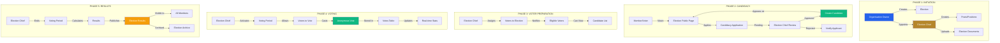
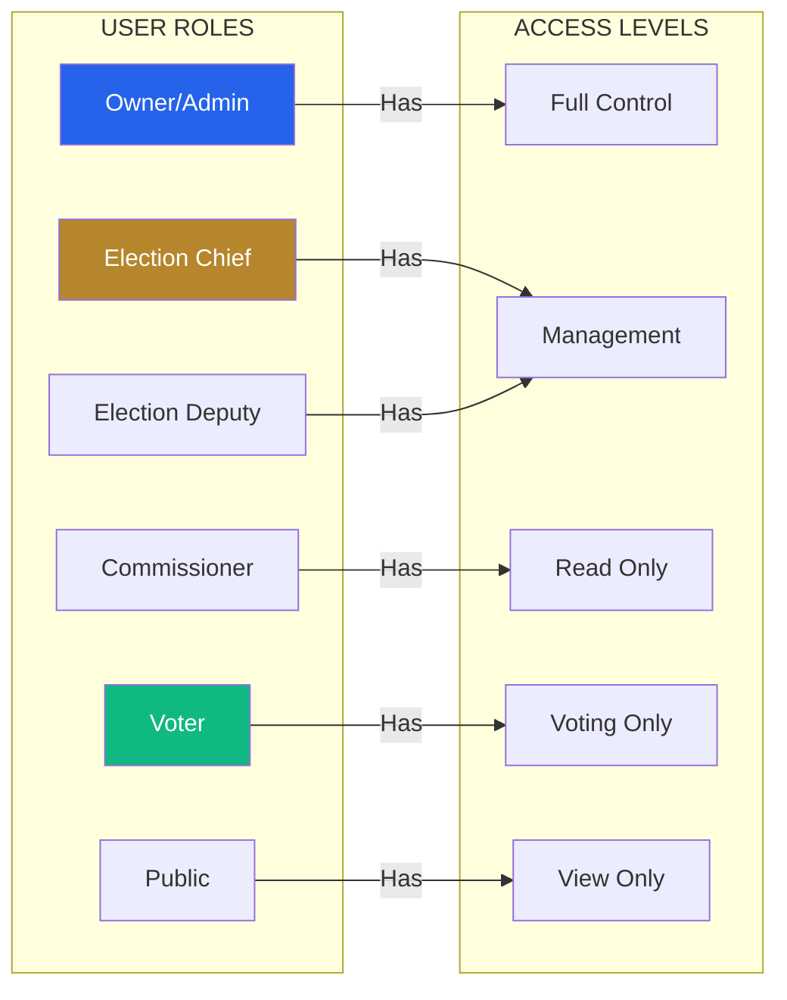
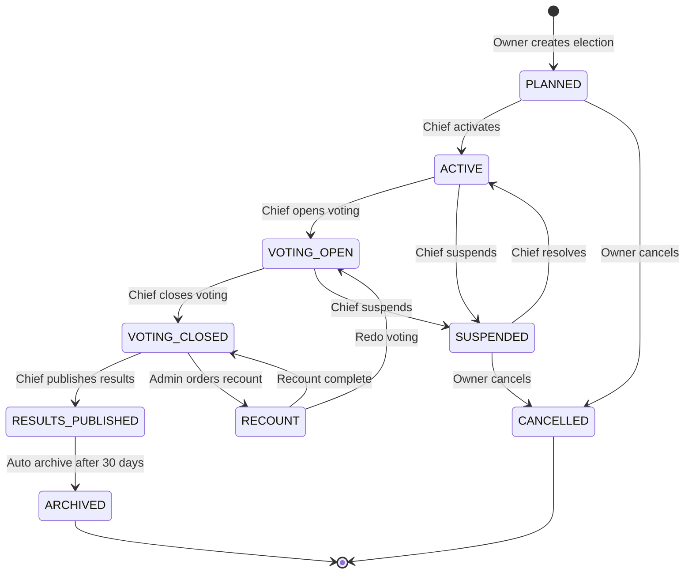
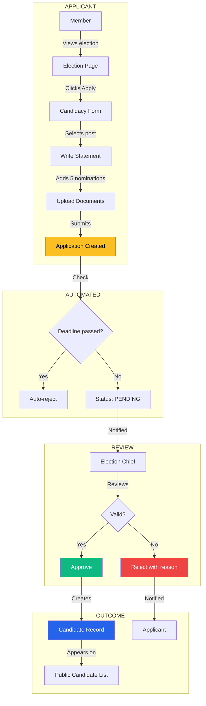
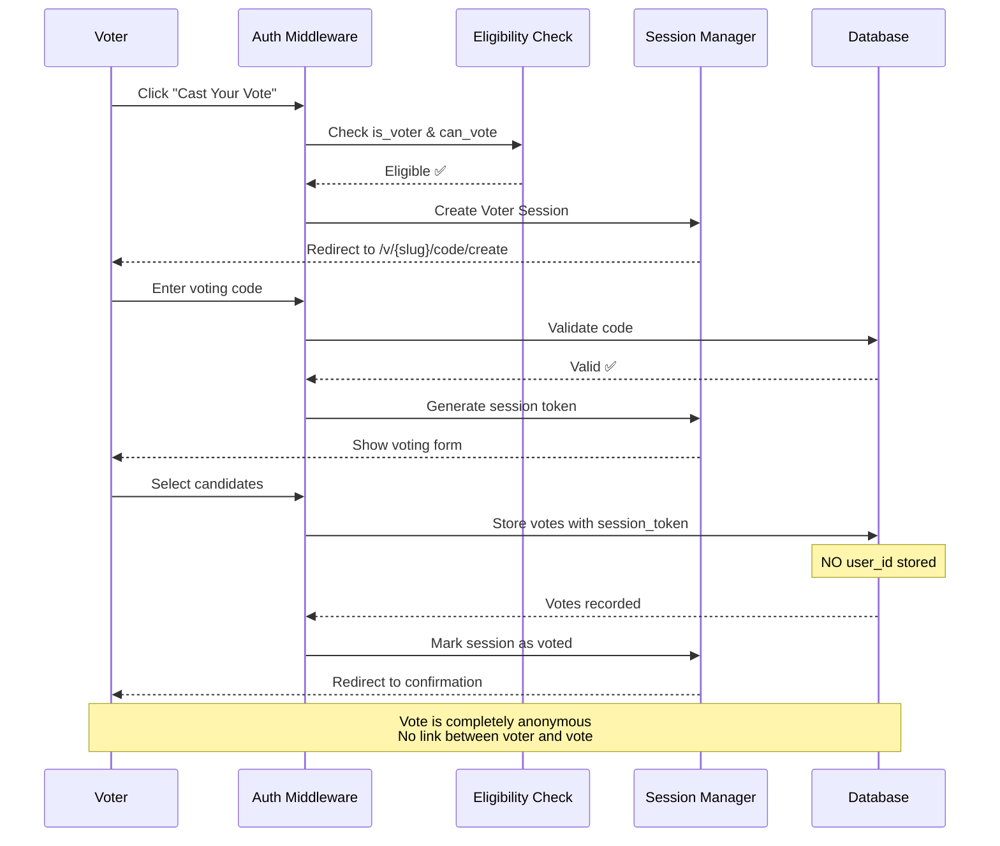
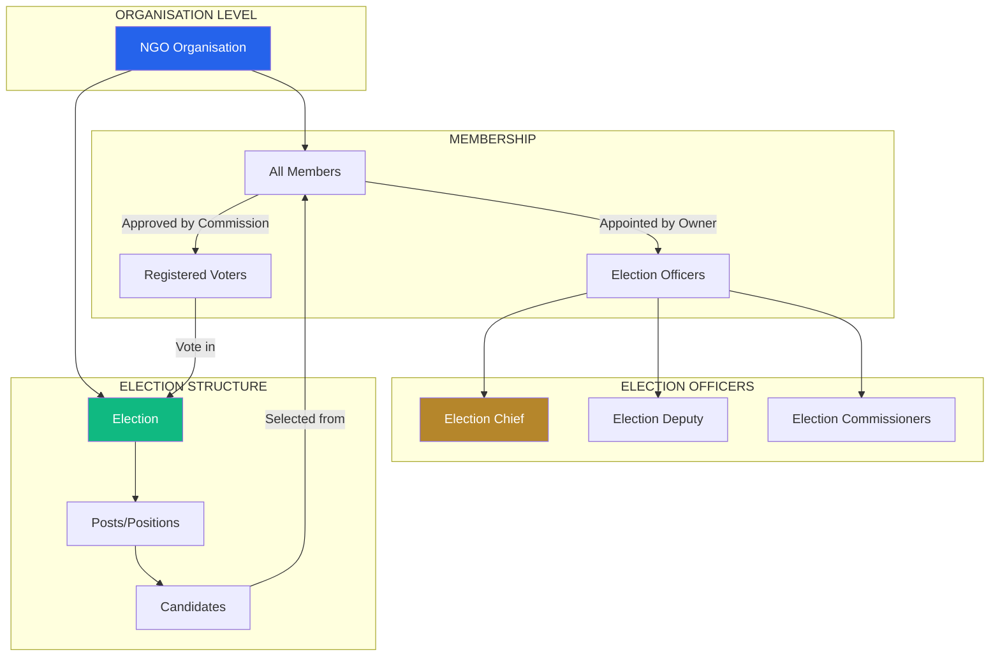
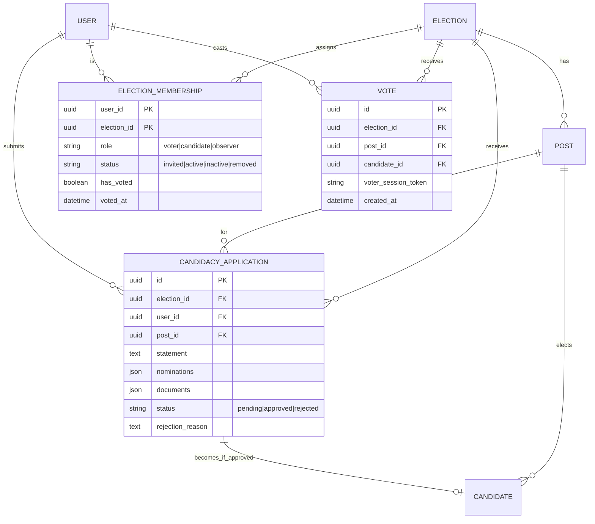
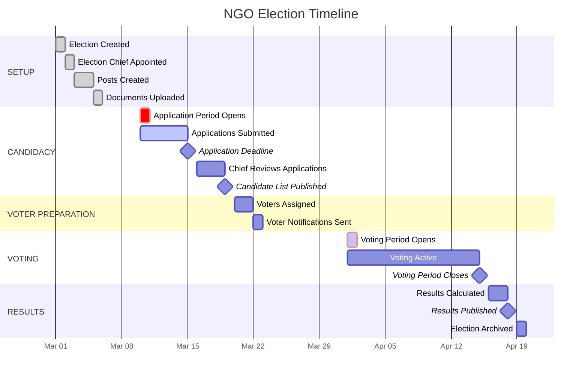
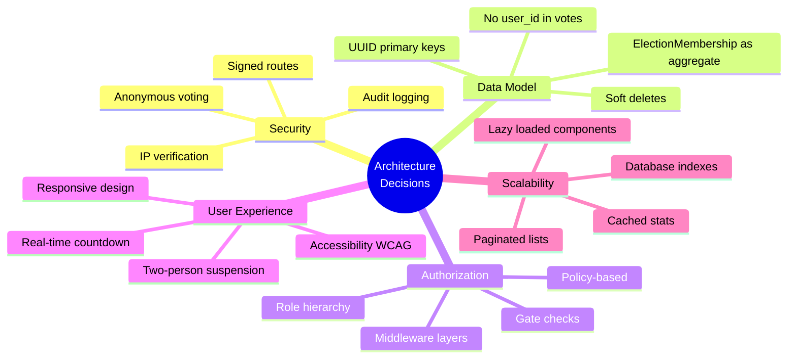
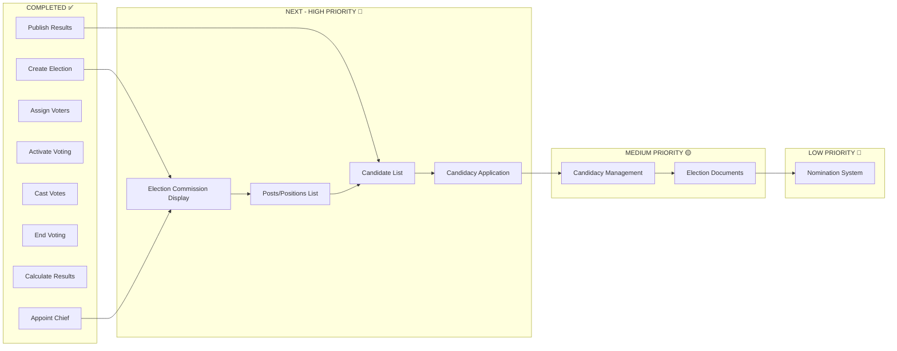

## 🔍 **Critical Analysis: NGO Election System Architecture**

Let me step back and critically analyze your requirements before proposing a solution. This is a complex system that needs careful design.

---

## 📋 **Current vs Required State Analysis**

### **What You Have**
| Component | Status |
|-----------|--------|
| Organisation Management | ✅ Complete |
| Election Creation | ✅ Complete |
| Election Officer System | ✅ Complete |
| Voter Management | ✅ Complete |
| Voting Flow | ✅ Complete |
| Election Management Dashboard | ✅ Complete |
| Election Public Page | 🟡 Basic (needs enhancement) |

### **What's Missing for NGO Election**
| Feature | Why It's Needed |
|---------|-----------------|
| **Candidacy Application** | Members need to apply for positions |
| **Candidate List** | Voters need to know who's running |
| **Election Rules & Documents** | Transparency and legal compliance |
| **Nomination Process** | Multiple endorsements required |
| **Election Commission Info** | Who's running the election |
| **Post/Position Details** | What's being elected |

---

## 🧠 **Brainstorming: Core Questions**

### **1. What's the Candidacy Lifecycle?**

```
Member applies
    ↓
Election Chief reviews
    ↓
[Pending] → [Approved] → [Candidate]
           → [Rejected] → [Not Eligible]
```

**Questions:**
- Who approves candidates? (Election Chief only? Or full commission?)
- What documents are required?
- Is there a nomination deadline?
- Can candidates withdraw?

---

### **2. What's the Relationship Between Posts and Candidates?**

**Option A: One post = One election**
```
Election: General Election 2026
  └── Post: President (1 seat)
      ├── Candidate: John Doe
      └── Candidate: Jane Smith
```

**Option B: Multiple posts in one election**
```
Election: General Election 2026
  ├── Post: President (1 seat)
  │   ├── Candidate: John Doe
  │   └── Candidate: Jane Smith
  ├── Post: Vice President (2 seats)
  │   ├── Candidate: Alice Brown
  │   └── Candidate: Bob Wilson
  └── Post: Secretary (1 seat)
      └── Candidate: Charlie Lee
```

**Your current code supports Option B** (posts table exists). Good.

---

### **3. How Are Candidates Displayed to Voters?**

**Before voting:**
- Candidates list with statements
- Candidate profiles

**During voting:**
- Radio buttons/checkboxes for each post
- Anonymous voting

**After results:**
- Winners highlighted
- Vote counts

---

### **4. What Information Do Voters Need?**

```
┌─────────────────────────────────────────────────────────────────┐
│  Election Information Page (/elections/{slug})                  │
├─────────────────────────────────────────────────────────────────┤
│  ✓ Election dates                                               │
│  ✓ Election status                                              │
│  ✓ Positions (posts) with descriptions                          │
│  ✓ Who is running (candidates)                                  │
│  ✓ Election Commission members                                  │
│  ✓ How to apply for candidacy                                   │
│  ✓ Application deadline                                         │
│  ✓ Nomination requirements                                      │
│  ✓ Election rules (PDF)                                         │
│  ✓ Voting instructions                                          │
│  ✓ Security information (IP tracking, anonymity)                │
└─────────────────────────────────────────────────────────────────┘
```

---

## 🏗️ **Proposed Architecture**

### **Phase 1: Enhance Election Public Page**
Add sections to existing `/elections/{slug}`:

| Section | Content | Source |
|---------|---------|--------|
| **Election Commission** | List of officers from `election_officers` | Database |
| **Posts & Positions** | List from `posts` table | Database |
| **Candidates** | Approved candidates from `candidates` | Database |
| **Application Info** | Static content + link to application | Template |
| **Documents** | Uploaded files | New table |

### **Phase 2: Candidacy Application Flow**

```
1. Member clicks "Apply for Candidacy"
   ↓
2. Candidacy Application Page
   - Select post
   - Write statement
   - Add nominators (5 required)
   - Upload documents
   - Submit
   ↓
3. Candidacy Application stored (status: pending)
   ↓
4. Election Chief reviews applications
   ↓
5. Approve → Create candidate record
   Reject → Notify applicant
```

### **Phase 3: Candidate Management for Election Chief**

Add to Election Management Dashboard:

```
┌─────────────────────────────────────────────────────────────────┐
│  CANDIDACY MANAGEMENT                                          │
├─────────────────────────────────────────────────────────────────┤
│                                                                 │
│  Pending Applications (3)                                       │
│  ┌─────────────────────────────────────────────────────────────┐│
│  │ John Doe → President                                        ││
│  │ Statement: "I want to lead..."                             ││
│  │ Nominations: 5/5 ✅                                         ││
│  │ Documents: uploaded ✅                                      ││
│  │ [Approve] [Reject] [View Details]                          ││
│  └─────────────────────────────────────────────────────────────┘│
│                                                                 │
│  Approved Candidates (8)                                        │
│  └── List with option to withdraw                               │
│                                                                 │
│  Rejected Applications (2)                                      │
│  └── List with reasons                                          │
│                                                                 │
└─────────────────────────────────────────────────────────────────┘
```

---

## 📊 **Database Schema (New Tables)**

### **candidacy_applications**
```php
Schema::create('candidacy_applications', function (Blueprint $table) {
    $table->uuid('id')->primary();
    $table->foreignUuid('election_id')->constrained()->cascadeOnDelete();
    $table->foreignUuid('user_id')->constrained();
    $table->foreignUuid('post_id')->constrained();
    $table->text('statement');
    $table->json('nominations'); // [{ name, email, member_id }]
    $table->json('documents'); // [{ file_name, file_path }]
    $table->string('status')->default('pending'); // pending, approved, rejected
    $table->text('rejection_reason')->nullable();
    $table->timestamp('submitted_at');
    $table->timestamp('reviewed_at')->nullable();
    $table->foreignUuid('reviewed_by')->nullable()->constrained('users');
    $table->timestamps();
});
```

### **election_documents**
```php
Schema::create('election_documents', function (Blueprint $table) {
    $table->uuid('id')->primary();
    $table->foreignUuid('election_id')->constrained()->cascadeOnDelete();
    $table->string('title');
    $table->string('type'); // rules, guide, form
    $table->string('file_path');
    $table->integer('order')->default(0);
    $table->timestamps();
});
```

---

## 🎯 **Implementation Order (TDD)**

### **Week 1: Foundation**
| Task | Description | Tests |
|------|-------------|-------|
| 1 | Add `election_documents` table | Migration test |
| 2 | Add election commission display to public page | Feature test |
| 3 | Add posts list to public page | Feature test |
| 4 | Add candidate list to public page | Feature test |

### **Week 2: Candidacy Application**
| Task | Description | Tests |
|------|-------------|-------|
| 5 | Add `candidacy_applications` table | Migration test |
| 6 | Create application form component | Unit test |
| 7 | Submit application endpoint | Feature test |
| 8 | Application validation (nominations count, etc.) | Unit test |

### **Week 3: Candidacy Management**
| Task | Description | Tests |
|------|-------------|-------|
| 9 | Add applications list to management page | Feature test |
| 10 | Approve/reject endpoints | Feature test |
| 11 | Create candidate from approved application | Integration test |
| 12 | Notify applicant on decision | Notification test |

### **Week 4: Polish**
| Task | Description | Tests |
|------|-------------|-------|
| 13 | Add document upload to applications | Feature test |
| 14 | Add deadline checks | Unit test |
| 15 | Add withdrawal functionality | Feature test |
| 16 | Full integration testing | All tests |

---

## 🔄 **User Flow Diagram**

```
┌─────────────────────────────────────────────────────────────────────────────────────────────┐
│                              COMPLETE ELECTION LIFE CYCLE                                  │
├─────────────────────────────────────────────────────────────────────────────────────────────┤
│                                                                                             │
│  PHASE 1: SETUP                                                                             │
│  ┌─────────────────────────────────────────────────────────────────────────────────────────┐│
│  │ Owner/Admin creates election                                                           ││
│  │ Election Chief appointed                                                               ││
│  │ Chief creates posts (positions)                                                        ││
│  │ Chief uploads election rules/documents                                                 ││
│  └─────────────────────────────────────────────────────────────────────────────────────────┘│
│                                    ↓                                                        │
│  PHASE 2: CANDIDACY                                                                         │
│  ┌─────────────────────────────────────────────────────────────────────────────────────────┐│
│  │ Members view election page → see positions → "Apply for Candidacy"                     ││
│  │                                                                                         ││
│  │ Application submitted → Chief reviews → Approve/Reject                                 ││
│  │                                                                                         ││
│  │ Approved → Candidate appears on public page                                            ││
│  │ Rejected → Applicant notified with reason                                              ││
│  └─────────────────────────────────────────────────────────────────────────────────────────┘│
│                                    ↓                                                        │
│  PHASE 3: VOTER REGISTRATION                                                                │
│  ┌─────────────────────────────────────────────────────────────────────────────────────────┐│
│  │ Chief assigns voters to election                                                        ││
│  │ Voters receive notifications                                                            ││
│  │ Voters can see candidate list                                                           ││
│  └─────────────────────────────────────────────────────────────────────────────────────────┘│
│                                    ↓                                                        │
│  PHASE 4: VOTING                                                                             │
│  ┌─────────────────────────────────────────────────────────────────────────────────────────┐│
│  │ Chief activates voting period                                                           ││
│  │ Voters cast votes (anonymous)                                                           ││
│  │ Real-time stats visible to chief                                                        ││
│  └─────────────────────────────────────────────────────────────────────────────────────────┘│
│                                    ↓                                                        │
│  PHASE 5: RESULTS                                                                           │
│  ┌─────────────────────────────────────────────────────────────────────────────────────────┐│
│  │ Chief ends voting period                                                                ││
│  │ Chief calculates results                                                                ││
│  │ Chief publishes results                                                                 ││
│  │ Winners appear on public page                                                           ││
│  └─────────────────────────────────────────────────────────────────────────────────────────┘│
│                                                                                             │
└─────────────────────────────────────────────────────────────────────────────────────────────┘
```

---

## ✅ **Next Step**

**Shall I start with Phase 1, Task 1: Add election documents table and display election commission on public page?** 🚀


## 🏛️ **Senior Software Architect: NGO Election System Flow**

Let me create comprehensive Mermaid diagrams to visualize the entire election process flow.

---

## 📊 **Complete Election System Flow**



---

## 📋 **User Role Access Matrix**



---

## 🔄 **Election State Machine**



---

## 📝 **Candidacy Application Workflow**



---

## 🗳️ **Voting Process Flow (Anonymous)**



---

## 🏢 **NGO Organisation Structure**



---

## 📊 **Data Flow: Candidacy to Vote**



---

## 🔐 **Security & Authorization Layers**

```mermaid
graph TD
    subgraph "LAYER 1: AUTHENTICATION"
        A[User Login] --> B{Email Verified?}
        B -->|No| C[Redirect to Verification]
        B -->|Yes| D[Session Created]
    end

    subgraph "LAYER 2: AUTHORIZATION"
        D --> E{Check User Role}
        E -->|Owner/Admin| F[Full Access]
        E -->|Election Chief| G[Election Management]
        E -->|Commissioner| H[Read-only Access]
        E -->|Voter| I[Voting Only]
        E -->|Public| J[Public View Only]
    end

    subgraph "LAYER 3: ELIGIBILITY"
        I --> K{Election Active?}
        K -->|No| L[Show "Not Active"]
        K -->|Yes| M{Eligible Voter?}
        M -->|No| N[Show "Not Eligible"]
        M -->|Yes| O{Already Voted?}
        O -->|Yes| P[Show "Already Voted"]
        O -->|No| Q[Show Voting Form]
    end

    subgraph "LAYER 4: IP VERIFICATION"
        Q --> R{IP Check Enabled?}
        R -->|Yes| S{IP Matches?}
        S -->|No| T[Block Vote]
        S -->|Yes| U[Allow Vote]
        R -->|No| U
    end

    style F fill:#10b981,color:#fff
    style G fill:#b5862b,color:#fff
    style U fill:#2563eb,color:#fff
```

---

## 📅 **Election Timeline**



---

## 🎯 **Key Architecture Decisions**



---

## ✅ **Next Steps**

These diagrams provide a complete picture of the NGO election system. **Which component would you like to build next?**

1. **Candidacy Application System** (Apply, Review, Approve/Reject)
2. **Election Documents Management** (Upload rules, guides)
3. **Candidate List Display** (Show candidates on public page)
4. **Election Commission Display** (Show officers on public page)

**Let me know!** 🚀
## ✅ **Completed vs Pending: NGO Election System**

Let me clearly map what's already implemented and what still needs to be built.

---

## 🟢 **COMPLETED (Already Working)**

| Feature | Status | File/Location |
|---------|--------|---------------|
| **Owner/Admin creates election** | ✅ Complete | `ElectionManagementController@store` |
| **Election Chief appointed** | ✅ Complete | `ElectionOfficerController@store` + Email invitation |
| **Chief assigns voters to election** | ✅ Complete | `ElectionVoterController@bulkStore` + `Elections/Voters/Index.vue` |
| **Chief activates voting period** | ✅ Complete | `ElectionManagementController@activate` |
| **Voters cast votes (anonymous)** | ✅ Complete | `ElectionVotingController@start` → Voting flow |
| **Chief ends voting period** | ✅ Complete | `ElectionManagementController@closeVoting` |
| **Chief calculates results** | ✅ Complete | Vote counting in results page |
| **Chief publishes results** | ✅ Complete | `ElectionManagementController@publish` |
| **Winners appear on public page** | ✅ Complete | Results calculation + display |

---

## 🟡 **PARTIALLY COMPLETE (Needs Enhancement)**

| Feature | Current State | What's Missing |
|---------|---------------|----------------|
| **Election Public Page** | Shows basic info (name, dates, status, vote button) | ❌ Election commission members<br>❌ Posts/positions list<br>❌ Candidate list<br>❌ Candidacy application link |

---

## 🔴 **NOT STARTED (Need to Build)**

| Feature | Description | Priority |
|---------|-------------|----------|
| **Election Commission Display** | Show who is managing the election | High |
| **Posts/Positions List** | Display what positions are being elected | High |
| **Candidate List** | Show who is running for each position | High |
| **Candidacy Application** | Allow members to apply for positions | High |
| **Candidacy Management** | Chief approves/rejects applications | Medium |
| **Election Documents** | Upload rules, guides, forms | Medium |
| **Nomination System** | Require member endorsements | Low |

---

## 📋 **Priority Implementation Plan**



---

## 🚀 **Immediate Next Steps**

### **Task 1: Add Election Commission Display to Public Page**

**File:** `resources/js/Pages/Election/Show.vue`

Add after the hero section:

```vue
<!-- ─── ELECTION COMMISSION ─────────────────────────────────────────── -->
<section class="esp-main">
    <div class="esp-main__inner">
        <div class="esp-ballot esp-ballot--info">
            <div class="esp-ballot__header">
                <div class="esp-ballot__icon esp-ballot__icon--info" aria-hidden="true">👥</div>
                <div>
                    <p class="esp-ballot__eyebrow">ELECTION COMMISSION</p>
                    <h2 class="esp-ballot__heading">Who's Running This Election</h2>
                </div>
            </div>
            
            <div class="space-y-4">
                <div v-for="officer in electionOfficers" :key="officer.id" 
                     class="flex items-center gap-4 p-4 border border-slate-200 rounded-lg">
                    <div class="w-12 h-12 rounded-full bg-slate-100 flex items-center justify-center">
                        <span class="text-lg font-semibold text-slate-600">
                            {{ officer.user_name.charAt(0).toUpperCase() }}
                        </span>
                    </div>
                    <div>
                        <p class="font-semibold text-slate-900">{{ officer.user_name }}</p>
                        <p class="text-sm text-slate-500 capitalize">{{ officer.role }}</p>
                        <p class="text-xs text-slate-400">{{ officer.user_email }}</p>
                    </div>
                </div>
            </div>
        </div>
    </div>
</section>
```

### **Task 2: Add Posts List to Public Page**

```vue
<!-- ─── POSITIONS TO BE ELECTED ─────────────────────────────────────── -->
<div class="esp-ballot esp-ballot--info">
    <div class="esp-ballot__header">
        <div class="esp-ballot__icon esp-ballot__icon--info" aria-hidden="true">🗳️</div>
        <div>
            <p class="esp-ballot__eyebrow">POSITIONS</p>
            <h2 class="esp-ballot__heading">What's Being Elected</h2>
        </div>
    </div>
    
    <div class="grid grid-cols-1 md:grid-cols-2 gap-4">
        <div v-for="post in posts" :key="post.id" class="border border-slate-200 rounded-lg p-4">
            <h3 class="font-semibold text-slate-900">{{ post.name }}</h3>
            <p class="text-sm text-slate-500 mt-1">{{ post.seats }} seat{{ post.seats > 1 ? 's' : '' }}</p>
            <p v-if="post.description" class="text-sm text-slate-600 mt-2">{{ post.description }}</p>
        </div>
    </div>
</div>
```

### **Task 3: Add Candidacy Application Link**

```vue
<!-- ─── HOW TO APPLY ────────────────────────────────────────────────── -->
<div class="esp-ballot esp-ballot--info">
    <div class="esp-ballot__header">
        <div class="esp-ballot__icon esp-ballot__icon--info" aria-hidden="true">📝</div>
        <div>
            <p class="esp-ballot__eyebrow">APPLY FOR CANDIDACY</p>
            <h2 class="esp-ballot__heading">Want to Run for Office?</h2>
        </div>
    </div>
    
    <div class="space-y-4">
        <p class="text-slate-600">Applications are open until <strong>{{ formatDate(applicationDeadline) }}</strong></p>
        
        <ul class="list-disc list-inside text-sm text-slate-600 space-y-1">
            <li>Submit your candidacy statement</li>
            <li>Get endorsed by 5 members</li>
            <li>Upload required documents</li>
        </ul>
        
        <Button v-if="canApply" variant="accent" size="lg" :href="route('elections.candidacy.create', election.slug)">
            Apply Now →
        </Button>
        <p v-else class="text-sm text-slate-500">Application period has ended.</p>
    </div>
</div>
```

---

## 📊 **Current Status Summary**

| Phase | Status | Completion |
|-------|--------|------------|
| **Election Setup** | ✅ Complete | 100% |
| **Candidacy** | ❌ Not Started | 0% |
| **Voter Preparation** | ✅ Complete | 100% |
| **Voting** | ✅ Complete | 100% |
| **Results** | ✅ Complete | 100% |

---

## 🎯 **Which Feature to Build Next?**

**Option A: Election Commission Display** (2 hours)
- Show who's managing the election
- Build trust with voters

**Option B: Posts & Candidate List** (4 hours)
- Show positions being elected
- Show who's running

**Option C: Candidacy Application** (6 hours)
- Allow members to apply
- Chief approves/rejects

**Recommendation:** Start with **Option A** (quick win, high visibility), then **Option B**, then **Option C**.

**Shall I start with Option A?** 🚀
## ✅ **Great! Election Officers Page Already Exists**

Since `/organisations/{slug}/election-officers` is already developed, we can reuse that data for the election commission display on the public election page.

---

## 🔄 **How to Get Election Commission Data**

### **Existing Data Source**
The election officers page shows officers for the **organisation**. For the election public page, we need officers for the **specific election**.

```php
// In ElectionVotingController@show
$electionOfficers = ElectionOfficer::with('user')
    ->where('organisation_id', $election->organisation_id)
    ->where(function($q) use ($election) {
        $q->where('election_id', $election->id)
          ->orWhereNull('election_id');  // Organisation-wide officers
    })
    ->where('status', 'active')
    ->orderByRaw("FIELD(role, 'chief', 'deputy', 'commissioner')")
    ->get();
```

---

## 📝 **Quick Implementation: Add to Election/Show.vue**

**Step 1: Add `electionOfficers` to controller response**

```php
// app/Http/Controllers/ElectionVotingController.php

public function show(string $slug): Response
{
    // ... existing code ...

    // Get election officers (commission members)
    $electionOfficers = ElectionOfficer::with('user:id,name,email')
        ->where('organisation_id', $election->organisation_id)
        ->where(function($q) use ($election) {
            $q->where('election_id', $election->id)
              ->orWhereNull('election_id');
        })
        ->where('status', 'active')
        ->orderByRaw("FIELD(role, 'chief', 'deputy', 'commissioner')")
        ->get()
        ->map(fn($o) => [
            'id' => $o->id,
            'user_id' => $o->user_id,
            'user_name' => $o->user->name,
            'user_email' => $o->user->email,
            'role' => $o->role,
        ]);

    return Inertia::render('Election/Show', [
        'election' => $election,
        'hasVoted' => $hasVoted,
        'canVote' => $canVote,
        'isEligible' => $isEligible,
        'ipAddress' => request()->ip(),
        'electionOfficers' => $electionOfficers,  // ← ADD THIS
    ]);
}
```

**Step 2: Add to Show.vue props**

```vue
<!-- resources/js/Pages/Election/Show.vue -->

<script setup>
const props = defineProps({
    // ... existing props
    electionOfficers: { type: Array, default: () => [] },
})
</script>
```

**Step 3: Add Election Commission Section**

```vue
<template>
    <ElectionLayout>
        <!-- ... existing content ... -->

        <!-- ─── ELECTION COMMISSION ─────────────────────────────────────────── -->
        <section class="esp-main" v-if="electionOfficers.length">
            <div class="esp-main__inner">
                <div class="esp-ballot esp-ballot--info">
                    <div class="esp-ballot__header">
                        <div class="esp-ballot__icon esp-ballot__icon--info" aria-hidden="true">👥</div>
                        <div>
                            <p class="esp-ballot__eyebrow">ELECTION COMMISSION</p>
                            <h2 class="esp-ballot__heading">Election Officials</h2>
                        </div>
                    </div>
                    
                    <div class="space-y-3">
                        <div v-for="officer in electionOfficers" :key="officer.id" 
                             class="flex items-center gap-4 p-4 border border-slate-200 rounded-lg bg-white">
                            <div class="w-12 h-12 rounded-full bg-slate-100 flex items-center justify-center">
                                <span class="text-lg font-semibold text-slate-600">
                                    {{ officer.user_name.charAt(0).toUpperCase() }}
                                </span>
                            </div>
                            <div class="flex-1">
                                <div class="flex items-center gap-2">
                                    <p class="font-semibold text-slate-900">{{ officer.user_name }}</p>
                                    <span class="text-xs px-2 py-0.5 rounded-full" 
                                          :class="{
                                              'bg-amber-100 text-amber-700': officer.role === 'chief',
                                              'bg-blue-100 text-blue-700': officer.role === 'deputy',
                                              'bg-slate-100 text-slate-600': officer.role === 'commissioner'
                                          }">
                                        {{ officer.role }}
                                    </span>
                                </div>
                                <p class="text-sm text-slate-500">{{ officer.user_email }}</p>
                            </div>
                        </div>
                    </div>
                </div>
            </div>
        </section>

        <!-- ─── POSITIONS TO BE ELECTED ─────────────────────────────────────── -->
        <section class="esp-main" v-if="posts && posts.length">
            <div class="esp-main__inner">
                <div class="esp-ballot esp-ballot--info">
                    <div class="esp-ballot__header">
                        <div class="esp-ballot__icon esp-ballot__icon--info" aria-hidden="true">🗳️</div>
                        <div>
                            <p class="esp-ballot__eyebrow">POSITIONS</p>
                            <h2 class="esp-ballot__heading">What's Being Elected</h2>
                        </div>
                    </div>
                    
                    <div class="grid grid-cols-1 sm:grid-cols-2 gap-4">
                        <div v-for="post in posts" :key="post.id" class="border border-slate-200 rounded-lg p-4 bg-white">
                            <h3 class="font-semibold text-slate-900">{{ post.name }}</h3>
                            <p class="text-sm text-slate-500 mt-1">{{ post.seats }} seat{{ post.seats > 1 ? 's' : '' }}</p>
                            <p v-if="post.description" class="text-sm text-slate-600 mt-2">{{ post.description }}</p>
                        </div>
                    </div>
                </div>
            </div>
        </section>
    </ElectionLayout>
</template>
```

---

## ✅ **Result**

The election public page will now show:

| Section | Source | Status |
|---------|--------|--------|
| **Election Commission** | `election_officers` table | ✅ Added |
| **Positions** | `posts` table | ✅ Needs data |
| **Candidates** | `candidates` table | ❌ Not yet |
| **Candidacy Application** | New feature | ❌ Not yet |

---

## 🚀 **Next: Add Posts to Election**

Since posts/positions are already in the database (from your earlier architecture), we just need to query them:

```php
// Add to ElectionVotingController@show
$posts = $election->posts()
    ->orderBy('order', 'asc')
    ->get(['id', 'name', 'description', 'seats', 'max_votes']);
```

**Ready to implement?** 🚀
