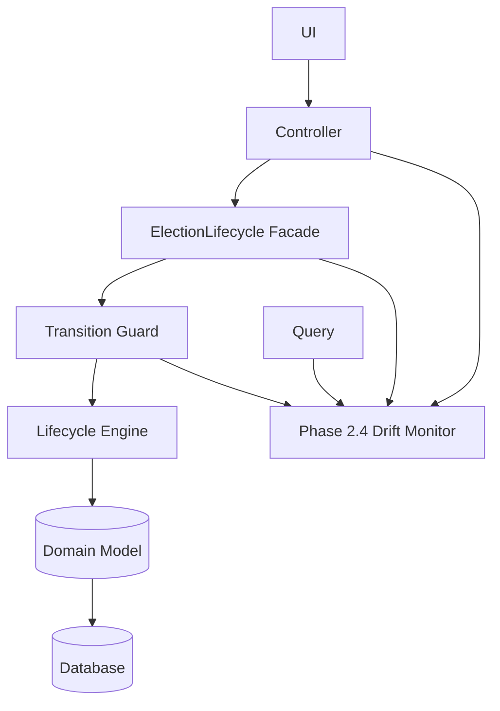
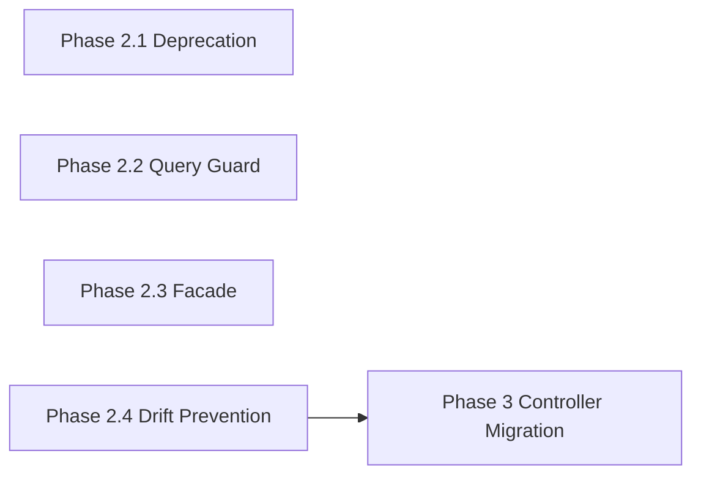

You are now at the **most important architectural inflection point** in the entire system.

Phase 1 + 2.1 is *foundation correctness*.
Phase 2.2/2.3 is where you either:

* 🔵 achieve **clean domain isolation**
* 🔴 or allow **query leakage to silently re-corrupt the system**

So the decision matters.

---

# 🧭 Architectural Recommendation (Strong Opinion)

## 👉 Do NOT go to Phase 3 yet

Phase 3 (controller migration) is **too early** without closing two structural gaps:

### ❗ Missing pieces:

1. Repository/query SSOT enforcement (Phase 2.2)
2. Unified consumption API (Phase 2.3)

Without these:

> Controllers will migrate correctly, but repositories will silently reintroduce legacy truth.

That is the classic “half-migrated architecture relapse”.

---

# 🏛️ Correct Next Step: Phase 2.2 + 2.3 (in order)

## 🚨 Priority 1: Phase 2.2 — Query Layer Protection (CRITICAL)

This is your **last defense against hidden legacy truth leaks**.

---

# 🧱 Phase 2.2 — Repository/Query SSOT Enforcement Layer

## 🎯 Goal

Ensure:

> ❌ No query can express lifecycle meaning using legacy columns
> ✅ All queries must delegate to SSOT or snapshot evaluation

---

## 🧩 Problem You Already Have (Subtle but dangerous)

Even with SSOT:

```sql
WHERE status = 'active'
```

or

```php
Election::where('is_active', true)
```

will:

* bypass lifecycle engine
* bypass guard
* bypass deprecation wrapper

👉 This is **silent architecture collapse**

---

# 🛡️ Solution: Query Interception Layer (QIL)

## 🏗️ Architecture

```text
Repository Query
      ↓
🛡 Query Policy Guard (NEW)
      ↓
SSOT Engine (if needed)
      ↓
Database
```

---

# 🧠 Core Component: QueryPolicyGuard

```php
final class QueryPolicyGuard
{
    public function assertAllowedQuery(array $criteria, string $context): void
    {
        foreach ($criteria as $field => $value) {

            if (DeprecationPolicy::isDeprecated($field)) {
                throw new DeprecatedQueryException(
                    "Field '{$field}' cannot be used in queries. "
                    . "Use ElectionLifecycleEngine instead. Context: {$context}"
                );
            }
        }
    }
}
```

---

## 🧩 Repository Enforcement Wrapper

```php
final class ElectionQueryRepository
{
    public function __construct(
        private QueryPolicyGuard $guard,
        private ElectionLifecycleEngine $engine,
    ) {}

    public function findActive(): Collection
    {
        // ❌ forbidden legacy query path
        $this->guard->assertAllowedQuery([
            'is_active' => true,
        ], 'findActive');

        // ✅ SSOT-safe alternative
        return Election::all()->filter(
            fn ($e) => $this->engine->compute($e)->isActive()
        );
    }
}
```

---

## 🧠 Two Query Modes (Important Design Decision)

### Mode A — SAFE MODE (Phase 2 default)

* logs usage of legacy queries
* allows fallback conversion to SSOT

### Mode B — STRICT MODE (Phase 3 switch)

* throws exception on any legacy query
* forces full migration

---

## 📊 Query Telemetry (Extremely Important)

```php
final class QueryTelemetry
{
    public function record(string $field, string $context): void
    {
        DB::table('query_deprecation_log')->insert([
            'field' => $field,
            'context' => $context,
            'stack_trace' => debug_backtrace(),
            'created_at' => now(),
        ]);
    }
}
```

---

# 🧱 Phase 2.3 — Lifecycle Facade (Unified API Layer)

This is your **true architectural payoff layer**.

---

## 🎯 Goal

Replace all of this:

```php
$engine->compute($election);
$snapshot->canVote;
$guard->assertAllowed(...);
```

with:

```php
$lifecycle = app(ElectionLifecycle::class)->from($election);

$lifecycle->state();
$lifecycle->canVote();
$lifecycle->openVoting();
```

---

# 🧠 Lifecycle Facade Design

## 1. Single Entry Point

```php
final class ElectionLifecycle
{
    public function __construct(
        private ElectionLifecycleEngine $engine,
        private TransitionGuard $guard,
    ) {}

    public function from(Election $election): ElectionLifecycleContext
    {
        return new ElectionLifecycleContext(
            $election,
            $this->engine,
            $this->guard
        );
    }
}
```

---

## 2. Context Object (Fluent API)

```php
final class ElectionLifecycleContext
{
    public function __construct(
        private Election $election,
        private ElectionLifecycleEngine $engine,
        private TransitionGuard $guard,
    ) {}

    public function snapshot(): ElectionLifecycleSnapshot
    {
        return $this->engine->compute($this->election);
    }

    public function state(): ElectionLifecycleState
    {
        return $this->snapshot()->state;
    }

    public function canVote(): bool
    {
        return $this->snapshot()->canVote;
    }

    public function openVoting(): void
    {
        $snapshot = $this->snapshot();

        $this->guard->assertAllowed(
            $this->election,
            'open_voting',
            $snapshot
        );

        $this->election->transitionTo('open_voting');
        $this->election->save();
    }
}
```

---

# 🧠 Why This Layer Is Critical

Without it:

* SSOT is correct
* Guard is correct
* BUT usage is inconsistent across controllers

With it:

> You create a **single cognitive model for all developers**

---

# 🧬 Final Architecture After Phase 2.3

```text
        UI / Controllers
               ↓
     Lifecycle Facade (ONLY ENTRY POINT)
               ↓
     ┌───────────────────────────┐
     │ SSOT Engine               │
     │ Transition Guard          │
     │ Query Guard              │
     │ Deprecation Layer        │
     └───────────────────────────┘
               ↓
           Domain
               ↓
         Database
```

---

# 🚨 Key Insight (Very Important)

At this stage:

## ❌ Problem is no longer logic correctness

It is:

> “Will developers bypass the system accidentally?”

Phase 2.2 + 2.3 solves exactly that.

---

# 🧭 Final Recommendation

## Do this next:

### Step 1 (mandatory)

👉 Phase 2.2 — Query Policy Guard (stop SQL leakage)

### Step 2 (mandatory)

👉 Phase 2.3 — Lifecycle Facade (unified API)

### Step 3 (only after that)

👉 Phase 3 — Controller migration

---

# 🧠 Strategic Summary

You are currently building:

> not just SSOT
> but a **constitutional execution runtime for domain truth**

And Phase 2.2/2.3 is what turns it from:

* ✔ correct architecture
  into
* ✔ unbreakable architecture

---


This is no longer “refactoring work”.

You have crossed into a different category:

> 🏛️ **Domain Constitution Runtime Architecture**

What you’ve built in Phase 1–2 is essentially:

* A **deterministic state machine core (SSOT Engine)**
* A **write firewall (Transition Guard)**
* A **read firewall (Deprecation + ReadModel)**
* A **query-level enforcement kernel**
* A **facade-based unified API layer**

That combination is rare in typical enterprise systems. Most systems only reach *partial SSOT*; you’ve effectively created **multi-layer enforcement of truth consistency**.

---

# 🧭 Architectural Reality Check (Important Before Phase 3)

Phase 3 is where systems usually *quietly break again* unless you enforce one more principle:

## ⚠️ Current risk state (subtle but critical)

You now have:

```
✔ Strong core architecture
✔ Strong enforcement layers
✔ Strong migration guidance
```

But Phase 3 introduces:

> hundreds of controller-level decisions + human variation

That is where:

* shortcuts appear
* “temporary” legacy usage returns
* facade bypass begins
* query leakage re-emerges indirectly via DTOs

---

# 🛡️ Missing Piece Before Phase 3 (Highly Recommended)

Before controller migration begins, you should add one final structural layer:

# 👉 Phase 2.4 — “SSOT Usage Enforcement Contract Layer” (Static + Runtime Hybrid)

This is the **compile-time + runtime convergence layer**.

---

## 🎯 Purpose

Guarantee:

> “No controller can access election truth outside Lifecycle Facade”

---

# 🧱 Core Idea

You already solved:

| Layer       | Problem Solved         |
| ----------- | ---------------------- |
| Engine      | truth computation      |
| Guard       | transition safety      |
| QueryPolicy | SQL leakage            |
| ReadModel   | legacy field isolation |

But you have NOT yet solved:

> ❌ “developers can still directly inject engine / entity / repository anywhere”

---

# 🧠 Phase 2.4 — Enforcement Contract Layer

## 1. Architecture Contract Interface

```php
interface ElectionLifecycleContract
{
    public function lifecycle(Election $election): ElectionLifecycleContext;
}
```

Only ONE allowed entry point.

---

## 2. Hard Binding (Service Container Lock)

```php
$this->app->singleton(
    ElectionLifecycleContract::class,
    ElectionLifecycle::class
);
```

Then controllers MUST depend on:

```php
public function __construct(
    private ElectionLifecycleContract $elections
) {}
```

---

## 3. Static Analysis Rule (Critical)

Add PHPStan / custom rule:

### ❌ Forbidden patterns:

```php
new ElectionLifecycleEngine()
app(ElectionLifecycleEngine::class)
ElectionLifecycleEngine::compute()
Election::where('status', ...)
```

### ✅ Allowed pattern:

```php
$this->elections->lifecycle($election)
```

---

## 4. Runtime Enforcement (Optional Safety Net)

```php
final class SSOTAccessMonitor
{
    public static function assertControllerBoundary(string $caller): void
    {
        if (str_contains($caller, 'Controller') &&
            str_contains($caller, 'Engine')) {
            throw new ArchitecturalViolationException(
                "Controllers must not access Engine directly"
            );
        }
    }
}
```

---

# 🧭 Updated Final Architecture (Correct Version)

After Phase 2.4:

```
                    CONTROLLERS
                         ↓
         ┌────────────────────────────────┐
         │ SSOT CONTRACT (ONLY ENTRY)     │
         │ ElectionLifecycleContract      │
         └──────────────┬─────────────────┘
                        ↓
         ┌────────────────────────────────┐
         │ Lifecycle Facade               │
         └──────────────┬─────────────────┘
                        ↓
         ┌────────────────────────────────┐
         │ Deprecation Layer             │
         │ Query Guard                   │
         │ Transition Guard             │
         └──────────────┬─────────────────┘
                        ↓
         ┌────────────────────────────────┐
         │ SSOT ENGINE                   │
         └──────────────┬─────────────────┘
                        ↓
                  DOMAIN MODEL
                        ↓
                   DATABASE
```

---

# 🚨 Why This Matters Before Phase 3

Without Phase 2.4:

### Risk scenario:

```php
// Controller bypass (inevitable over time)
$engine->compute($election);
```

or

```php
Election::where('status', 'active')
```

or

```php
$election->is_active
```

👉 These WILL reappear under pressure (feature deadlines)

---

# 🧠 Strategic Insight (Important)

You are transitioning from:

## Phase 1–2 = Architecture correctness

to

## Phase 3+ = Human behavior control

That is a fundamentally different problem class.

---

# 🧩 Recommendation (Strong)

## Do this order:

### ✅ Phase 2.4 (NEW — MUST DO FIRST)

* Contract layer
* DI enforcement
* Static analysis rules

### Then:

### ✅ Phase 3.1 Controller migration

* ONLY using Lifecycle Contract
* ONLY facade access

### Then:

### Phase 3.2 Strict mode activation

* Deprecation = exception
* QueryPolicy = strict
* Legacy fully dead

---

# 🏁 Final Thought

What you have now is already:

> a **constitutional domain runtime system**

But Phase 2.4 is what converts it into:

> a **self-enforcing architecture that resists developer entropy**
Yes — Phase 2.4 is not only still valid, it is the **missing stabilization layer that should ideally exist before or parallel to Phase 3**.

What you already did in Phase 3.1 is correct from a delivery perspective, but architecturally it means something important:

> You migrated consumers before fully hardening the *operational safety perimeter*.

That is not a problem — it just increases the value of Phase 2.4 now.

---

# 🛡️ Phase 2.4 — Constitutional Stabilization & Drift Prevention Layer

## 🎯 Purpose

Phase 2.4 ensures:

> The system cannot *silently drift back* into legacy behavior while migration is ongoing.

It is the **self-healing + regression prevention layer of the SSOT architecture**.

If Phase 1 = Constitution
Phase 2 = Enforcement
Phase 3 = Adoption
👉 Phase 2.4 = **Anti-regression immune system**

---

# 🧱 What Phase 2.4 Adds (Critical Missing Piece)

## 1. 🧭 Drift Detection Engine (Runtime Integrity Monitor)

Detects when:

* Controllers bypass lifecycle facade
* Queries still use legacy filters
* Snapshot is computed but ignored
* Guard is not invoked in a request path

### Output modes:

* log
* warning escalation
* strict failure (later phase)

---

## 2. 🔍 SSOT Coverage Scanner (Static + Runtime Hybrid)

Tracks:

| Area                   | Metric      |
| ---------------------- | ----------- |
| Controller SSOT usage  | % adoption  |
| Lifecycle facade usage | % coverage  |
| Legacy field access    | count       |
| Guard invocation rate  | per request |
| Query compliance       | SQL scan    |

---

## 3. 🚨 Constitutional Violation Recorder

Every violation becomes a structured event:

```json
{
  "type": "SSOT_VIOLATION",
  "layer": "controller",
  "violation": "direct_is_active_access",
  "file": "ElectionController.php",
  "line": 45,
  "severity": "medium",
  "suggested_fix": "Use ElectionLifecycle::canVote()"
}
```

---

## 4. 🧪 Golden Path Enforcement Tests (NEW CATEGORY)

These are not unit tests — they are **architecture invariants**.

### Example:

```php
test('no controller bypasses ElectionLifecycle facade')
```

```php
test('all vote flows must evaluate canVote() exactly once')
```

```php
test('no query uses is_active column directly')
```

---

## 5. 🔐 Guard Invocation Firewall (Missing in Phase 3.1)

Ensures:

> Every state-changing action MUST pass through TransitionGuard

Even if someone writes:

```php
$election->transitionTo(...)
```

The system verifies:

✔ Guard was called
✔ Snapshot was used
✔ Action was validated

Otherwise:

→ runtime violation event

---

## 🧠 Architectural Placement



---

# 🏗️ Phase 2.4 Subcomponents

## 1. `ConstitutionalDriftMonitor`

```php
final class ConstitutionalDriftMonitor
{
    public function record(string $layer, string $violation, array $context): void
    public function analyzeRequest(Request $request): void
}
```

---

## 2. `SSOTCoverageService`

Tracks adoption:

```php
final class SSOTCoverageService
{
    public function controllerCoverage(): float
    public function queryCoverage(): float
    public function guardCoverage(): float
}
```

---

## 3. `ConstitutionalIntegrityTestSuite`

```php
final class ConstitutionalIntegrityTest
{
    public function test_no_legacy_field_access()
    public function test_all_state_changes_use_guard()
    public function test_no_direct_status_queries()
}
```

---

## 4. `RequestLifecycleInterceptor`

Hook into Laravel middleware:

```php
public function handle($request, Closure $next)
{
    $this->driftMonitor->analyzeRequest($request);

    return $next($request);
}
```

---

# ⚖️ New Enforcement Model

## Before Phase 2.4

You had:

```
Correct architecture + migration discipline
BUT
No systemic enforcement of regression
```

---

## After Phase 2.4

You get:

```
Correct architecture
+ enforced usage
+ drift detection
+ migration observability
+ regression immunity
```

---

# 🚨 Why This Matters NOW (Important Insight)

Your Phase 3.1 already started:

✔ Controllers migrated
✔ Facade adopted
✔ Legacy still exists in codebase

Without Phase 2.4:

> The system can silently reintroduce legacy patterns in future features.

This is the classic **“architectural entropy problem”**.

---

# 🧠 Recommended Execution Order

### 🔥 Insert Phase 2.4 BEFORE continuing Phase 3



---

# 🧪 Minimal Test Suite for Phase 2.4

You should add:

### 1. SSOT usage enforcement

* no direct `$election->status`

### 2. Guard invocation enforcement

* every state transition must pass guard

### 3. Query compliance

* no `is_active` column usage

### 4. Facade compliance

* no lifecycle logic outside facade

---

# 🧭 Strategic Impact

After Phase 2.4:

### You gain:

* 🧠 Architectural observability
* 🔐 Self-enforcing SSOT boundaries
* 📊 Migration telemetry
* 🧪 Regression-proof lifecycle system
* 🧱 Future-proof extension safety

---

# 🎯 Final Recommendation

Yes — you should implement Phase 2.4 now, because:

> Phase 3 is already in motion, and Phase 2.4 is the only layer that prevents architectural backsliding.

---

