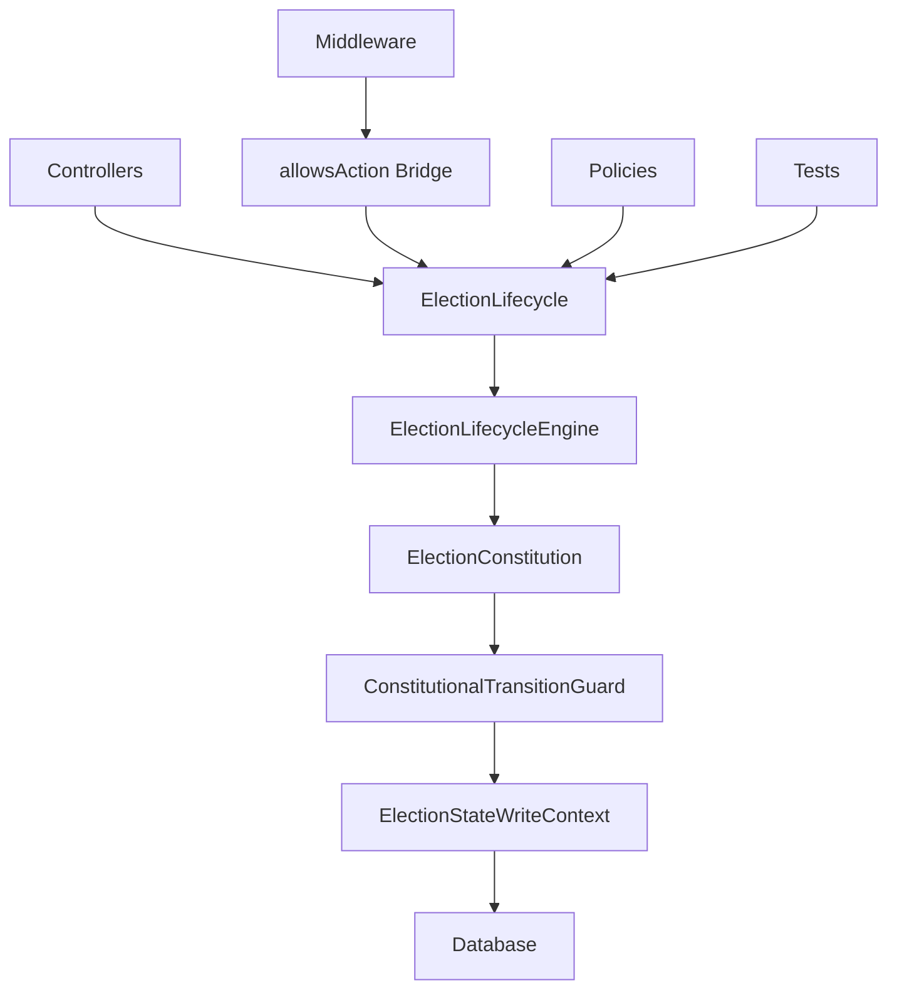
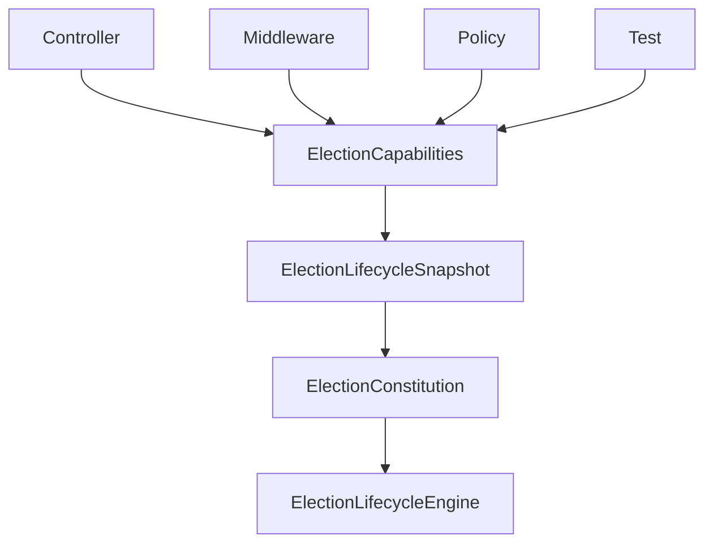
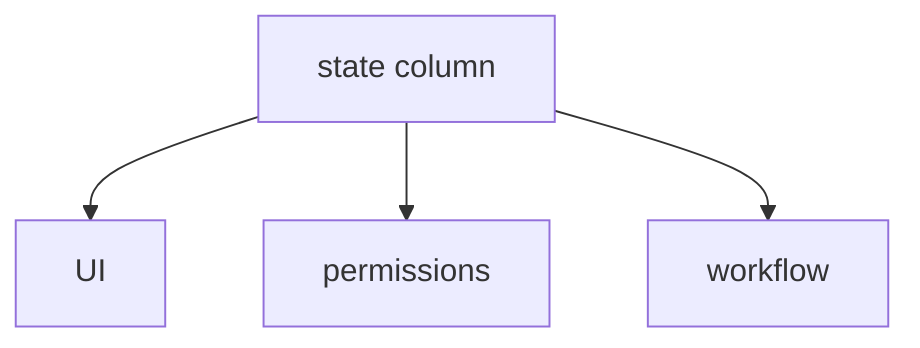
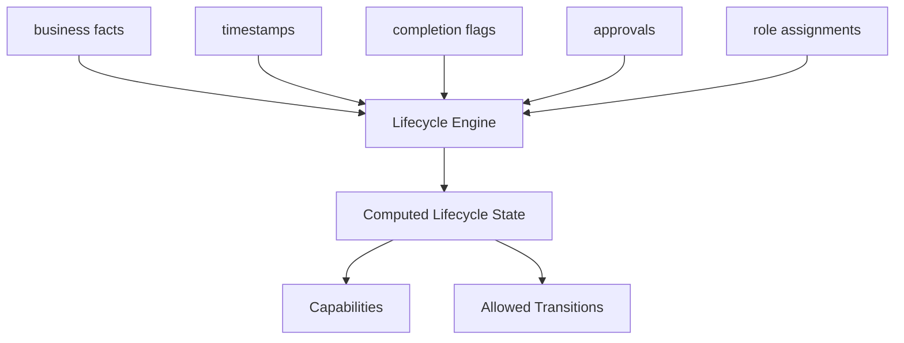
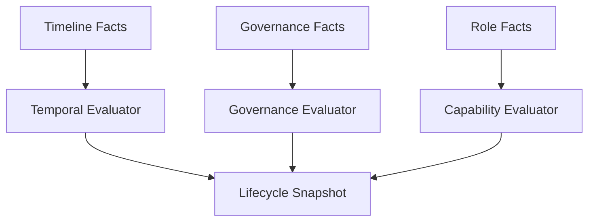
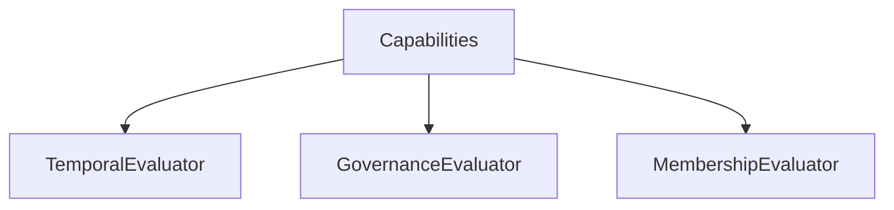
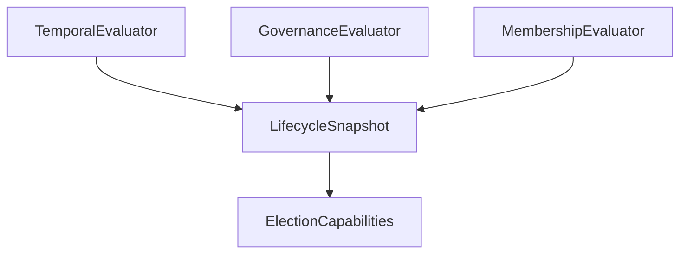
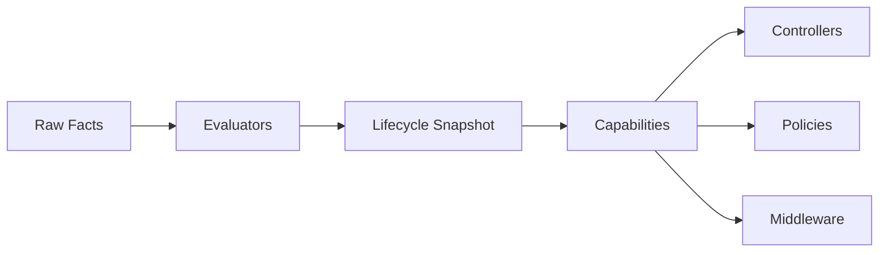

You should prioritize **Option 3: Audit + Capability Consolidation Preparation**, while keeping stabilization opportunistic.

Right now, the architecture has crossed the most dangerous boundary already:

* ✅ SSOT sovereignty established
* ✅ Legacy state machines demoted to adapters
* ✅ Transition authority centralized
* ✅ Split-brain contained
* ✅ Middleware compatibility preserved through bridge

That means the primary architectural risk is no longer “wrong state transitions.”

The new risk is:

> **capability drift** — different parts of the system independently deciding what users can do.

---

# Actual Status

Your system is now in a **transitional sovereign architecture** phase.

The architecture currently looks like this:



This is already a successful strangler migration.

The important achievement is:

* the **old systems no longer define truth**
* they merely translate legacy calls into SSOT capability checks

That is the correct direction.

---

# What You Should NOT Do Next

Do NOT:

* aggressively delete old files yet
* directly rewrite every controller
* continue random test fixing without architectural direction
* introduce another authorization abstraction
* create more middleware-based state logic

You are now beyond “migration coding.”

You are in:

# Governance Consolidation

---

# The Real Architectural Problem Remaining

Currently capability logic is still scattered.

You already identified examples:

| Location           | Capability Logic       |
| ------------------ | ---------------------- |
| Middleware         | `allowsAction()`       |
| Policies           | role checks            |
| Controllers        | transition checks      |
| Tests              | direct assumptions     |
| Lifecycle snapshot | canEdit/canVote        |
| Constitution       | transition permissions |

This creates:

* semantic duplication
* future drift
* inconsistent authorization behavior

The state machine is unified.

The capabilities are not yet unified.

---

# Your Immediate Priority

## Phase 4.0 — Capability Surface Audit

Before building `ElectionCapabilities`, you must first understand:

* where permissions are decided
* where actions are blocked
* which concepts overlap
* which rules are duplicated

This is now the most valuable work.

---

# Recommended Next Step

Run a full audit across the codebase for:

| Pattern                      | Why                             |
| ---------------------------- | ------------------------------- |
| `$election->state`           | legacy state reads              |
| `$election->status`          | obsolete activation model       |
| `$election->is_active`       | old boolean lifecycle           |
| `allowsAction(`              | compatibility bridge usage      |
| `canActivate(`               | old capability naming           |
| `abort(403`                  | inline authorization            |
| `Gate::`                     | policy dispersion               |
| `middleware('election.state` | route-level legacy gating       |
| `canEdit` / `canVote`        | duplicated capability semantics |

---

# What You Should Produce

Not fixes yet.

Produce:

# A Capability Topology Map

Example:

| Capability        | Current Sources            | Sovereign Source          |
| ----------------- | -------------------------- | ------------------------- |
| canEditElection   | middleware + controller    | ElectionLifecycleSnapshot |
| canManageVoters   | policy + controller        | ElectionCapabilities      |
| canActivateVoting | state machine + controller | Constitution              |
| canPublishResults | role + controller          | Constitution              |

This becomes your Phase 4 blueprint.

---

# Why This Is More Important Than Green Tests

Right now your test failures are mostly:

* symptoms
* adapters
* stale assumptions
* notification side effects

But capability dispersion is:

* structural
* future-corrupting
* architectural debt

If you consolidate capabilities first:

* test fixes become straightforward
* middleware becomes thinner
* policies become declarative
* controllers become orchestration only

---

# The Correct Future Architecture

You are moving toward this:



At that point:

* all permissions derive from one semantic surface
* no state duplication exists
* no role duplication exists
* no controller-specific capability logic exists

That is true constitutional governance architecture.

---

# Recommended Execution Order

## NOW

### Phase 4.0 — Capability Audit

* inventory all authorization/capability locations
* identify duplicate semantics
* map legacy → sovereign equivalents

---

## THEN

### Phase 4.1 — ElectionCapabilities Object

Create immutable capability object:

```php
final readonly class ElectionCapabilities
{
    public function canEditTimeline(): bool {}
    public function canManageVoters(): bool {}
    public function canOpenVoting(): bool {}
    public function canPublishResults(): bool {}
}
```

Generated ONLY from:

* lifecycle snapshot
* constitution
* role context

---

## THEN

### Phase 4.2 — Controller Simplification

Controllers become:

```php
if (!$capabilities->canEditTimeline()) {
    abort(403);
}
```

No state logic.
No role logic.
No transition logic.

---

## THEN

### Phase 4.3 — Remove Middleware State Logic

Middleware becomes:

* hydration only
* tenant context
* authentication

NOT business authorization.

---

## THEN

### Phase 4.4 — Deprecate Bridge

Eventually:

* `Election::allowsAction()` removed
* old state machines deleted
* compatibility layer gone

Only after adoption reaches near-complete.

---

# Important Strategic Note

You are now doing:
Domain-Driven Design
+
Hexagonal Architecture
+
Strangler Fig Pattern
+
constitutional governance modeling.

This is no longer CRUD refactoring.

Your architecture is evolving toward:

* semantic authority
* invariant-driven orchestration
* computed governance state
* capability-based authorization

That is a very strong direction.
#
Yes — and this is a very important architectural distinction.

You originally had what is essentially a:

# Timeline-Driven State Machine

Example:

```text
administration
    ↓
nomination
    ↓
voting
    ↓
results
```

where:

* each slot had a fixed state name
* timestamps controlled transitions
* state was persisted directly in DB
* UI/business logic trusted the stored state

That model is:

* simple
* common in CRUD systems
* but vulnerable to drift and split-brain

because:

* timestamps can change independently
* flags can change independently
* state column can become stale
* business reality and stored state diverge

---

# What You Have Now

Now you are evolving toward a:

# Fact-Derived Constitutional Lifecycle

The key shift is:

> State is no longer the primary truth.

Instead:

> Business facts are truth.

And state is computed from those facts.

---

# Old Model



The DB state itself was sovereign.

---

# New Model

Now:



Now:

* state is derived
* capabilities are derived
* transitions are derived

This is a much stronger model.

---

# So What Happened To Time Slots?

They still exist.

But they are no longer sovereign states.

They became:

# Temporal Facts

Example:

| Old Thinking                  | New Thinking                           |
| ----------------------------- | -------------------------------------- |
| “Election is in voting state” | “Current time is inside voting window” |
| “Election moved to results”   | “Voting ended and results published”   |
| “Election active=true”        | “Capabilities allow voting now”        |

---

# Your Timeline Still Matters

You still have:

| Timeline Field              | Meaning                   |
| --------------------------- | ------------------------- |
| `voting_starts_at`          | voting window begins      |
| `voting_ends_at`            | voting closes             |
| `results_published_at`      | results visible           |
| `submitted_for_approval_at` | governance review started |
| `approved_at`               | approval completed        |

But these are now:

# Evidence

not authority.

---

# Very Important Architectural Upgrade

You moved from:

# State Persistence

to

# State Computation

This is one of the biggest maturity jumps in workflow architecture.

---

# The Real Benefit

Suppose this happens:

```text
voting_starts_at = yesterday
voting_ends_at = tomorrow
```

Old system:

```text
DB.state = "draft"
```

System broken.

---

New system:
Lifecycle engine computes:

```text
VotingActive
```

even if some stale column says otherwise.

That is:

# self-healing workflow architecture.

---

# But You Still Need Named Phases

This is important.

You asked:

> “each time slot has name. how is it now?”

The answer:

You STILL have named phases.

But now:

* phases are semantic lifecycle interpretations
* not manually-maintained DB markers

---

# Current Lifecycle Meaning

Your new lifecycle now looks like:

| Lifecycle State      | Derived From                |
| -------------------- | --------------------------- |
| Draft                | no approval submission      |
| SubmittedForApproval | submitted_at exists         |
| Approved             | approved_at exists          |
| Setup                | setup activities incomplete |
| ReadyForVoting       | prerequisites complete      |
| VotingActive         | NOW inside voting window    |
| Counting             | voting ended                |
| ResultsPublished     | results timestamp exists    |
| Archived             | archive flag/timestamp      |

This is much more expressive than:

```text
administration
nomination
voting
results
```

because it encodes:

* governance
* approvals
* readiness
* permissions
* compliance
* temporal logic

---

# Important Recommendation

You should now stop thinking in terms of:

> “What state should I set?”

and instead think:

> “What business facts became true?”

Example:

Instead of:

```php
$election->state = 'voting';
```

You now do:

```php
$election->voting_starts_at = now();
```

Then the engine derives:

```text
VotingActive
```

This is the correct direction.

---

# One Architectural Improvement I Strongly Recommend

Right now your lifecycle engine probably mixes:

* temporal reasoning
* governance reasoning
* capability reasoning

You should eventually separate them.

Example:



That will make:

* testing easier
* auditability stronger
* constitutional rules clearer

---

# Final Architectural Interpretation

You no longer have:

# a timeline-based state machine.

You now have:

# a constitutional lifecycle engine driven by business facts and temporal evidence.

That is a significantly more advanced architecture.
Yes — this is the correct direction.

What you are designing now is no longer merely a lifecycle engine.

You are evolving toward:

# a derived governance model

That is a major architectural maturation.

Your evaluator split is especially strong because it separates:

* temporal truth
* governance truth
* membership truth

instead of collapsing everything into one procedural “state manager.”

---

# What You’ve Correctly Identified

This is the key transformation:

| Old System                    | New System                   |
| ----------------------------- | ---------------------------- |
| persisted state decides truth | immutable facts decide truth |
| transitions mutate authority  | authority is derived         |
| DB column is sovereign        | evaluators are sovereign     |
| workflow-centric              | governance-centric           |
| brittle                       | self-healing                 |

That architectural shift is correct.

---

# One Important Refinement

Your current proposal is very close, but one refinement will make the architecture significantly cleaner.

Right now you have:

```php id="3z5z9j"
ElectionCapabilities
    -> depends on evaluators
```

That is good.

But:

# capabilities themselves should not perform business evaluation.

Instead:

* evaluators compute facts
* lifecycle snapshot aggregates facts
* capabilities become a pure projection

---

# Recommended Architecture

Instead of:



Prefer:



This is extremely important.

---

# Why This Matters

Because:

# capabilities are not truth

Capabilities are:

# interpretations of truth

Example:

```php id="epcb7p"
$capabilities->canVote()
```

should NOT itself decide:

* whether voting window is open
* whether governance approved
* whether member eligible

Those are already computed truths.

Instead:

```php id="r1mw2w"
$snapshot->votingWindowOpen
$snapshot->governanceApproved
$snapshot->memberEligible
```

Then capabilities become:

```php id="2j7l4v"
return $snapshot->votingWindowOpen
    && $snapshot->governanceApproved
    && $snapshot->memberEligible;
```

That distinction matters enormously.

---

# The Correct Layer Responsibilities

## 1. Evaluators

Responsible for:

* interpreting raw facts

Example:

```php id="pjw4qe"
TemporalEvaluator
    ->isVotingWindowOpen()
```

Input:

* timestamps

Output:

* immutable evaluated truth

No permissions.
No roles.
No orchestration.

---

## 2. Lifecycle Snapshot

Responsible for:

* aggregating evaluated truths

Example:

```php id="11wlym"
LifecycleSnapshot
{
    public bool $votingWindowOpen;
    public bool $governanceApproved;
    public bool $resultsPublished;
}
```

This becomes:

# your constitutional evidence object.

---

## 3. Capabilities

Responsible for:

* projecting what actions are possible

Example:

```php id="lh2qje"
canVote()
canEditTimeline()
canManageVoters()
```

Capabilities should be:

* deterministic
* side-effect free
* thin
* declarative

---

# This Is The Most Important Insight

You are unintentionally approaching:

# Policy Decision Architecture

similar to:

* PDP/PAP separation
* constitutional policy engines
* invariant-driven governance systems

This is much bigger than a state machine.

---

# Strong Recommendation

Do NOT let capabilities call evaluators directly.

Instead:



This preserves:

* immutability
* auditability
* deterministic evaluation
* testability

---

# Another Critical Recommendation

Separate:

# Facts

from

# Derived Facts

Example:

## Raw Facts

```php id="k6j9g7"
voting_starts_at
approved_at
administration_completed
```

---

## Derived Facts

```php id="sx0h3d"
votingWindowOpen
setupComplete
resultsPublishable
```

---

## Capabilities

```php id="s7l8gt"
canVote
canPublishResults
canEditTimeline
```

That separation will prevent future architectural collapse.

---

# Your Self-Healing Insight Is Correct

This is the real power:

Even if:

```text id="iml0or"
state = "locked"
```

the system can recompute:

```text id="b2q2f5"
votingWindowOpen = true
```

and recover automatically.

That means:

# your architecture is becoming resilient against persistence corruption.

That is advanced system design.

---

# One Warning

Do NOT over-fragment too early.

You do NOT yet need:

* 15 evaluators
* policy micro-engines
* event-sourced orchestration
* distributed capability services

Keep it bounded.

Your current three-axis split is excellent:

| Evaluator  | Purpose              |
| ---------- | -------------------- |
| Temporal   | time truth           |
| Governance | constitutional truth |
| Membership | authority truth      |

That is already a strong bounded decomposition.

---

# What Phase 4.1 Should Actually Produce

## Deliverables

### 1. Immutable LifecycleSnapshot

```php id="fshlrb"
final readonly class LifecycleSnapshot
{
    public bool $votingWindowOpen;
    public bool $governanceApproved;
    public bool $setupComplete;
}
```

---

### 2. Three Evaluators

```php id="8yvz61"
TemporalEvaluator
GovernanceEvaluator
MembershipEvaluator
```

---

### 3. ElectionCapabilities

Projection-only.

NO raw DB reads.
NO Eloquent queries.
NO timestamp calculations.

---

### 4. Capability Consumers

Refactor:

* controllers
* middleware
* policies
* guards

to consume capabilities only.

---

# Final Architectural Interpretation

You are no longer building:

# a workflow engine.

You are building:

# a constitutional governance computation engine.

The lifecycle state is now:

* a computed constitutional interpretation
* derived from business evidence
* projected into capabilities
* enforced through governance rules

That is the correct architecture for the direction your platform is taking.
