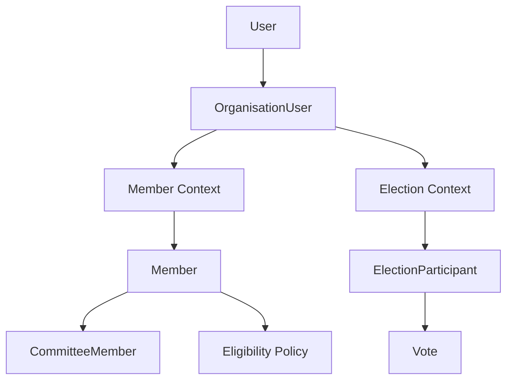
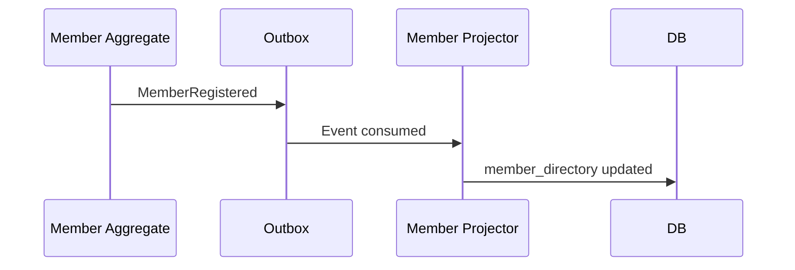
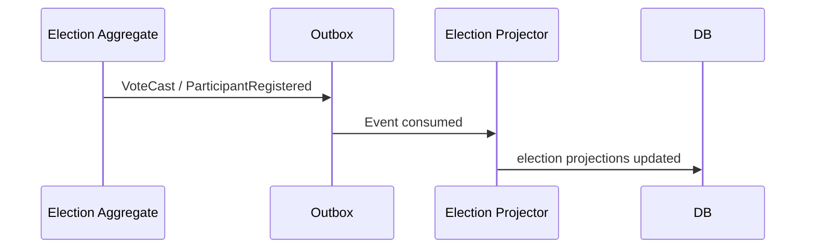
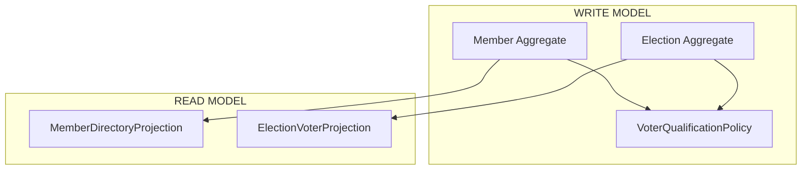

What you discovered is actually a very important domain separation:

“Election participation” and “Membership governance” are NOT the same bounded context.
Right now your system mixes them partially, which creates confusion in identity rules.
You need to formally separate:

Membership Mode
Election Mode
while still sharing a common identity foundation.
🧠 CORE DOMAIN INSIGHT
Not every voter is a member.
And not every organisation wants:

membership lifecycle
renewals
fees
governance hierarchy
committees
Some only want:

Election administration
So your instinct is correct.
🏗️ CORRECT HIGH-LEVEL ARCHITECTURE
You should split the system into:

flowchart TD
    A[Identity Context] --> B[Membership Context]
    A --> C[Election Context]

    B --> D[Committee Governance]
    C --> E[Voting / Ballots / Elections]
🧬 SHARED FOUNDATION
Shared Identity Layer
This remains common:

User
  → OrganisationUser
This is your tenant-scoped identity.
🟢 MEMBERSHIP MODE
Purpose
Long-term constitutional governance.
Supports:

member lifecycle
membership types
committees
renewals
governance eligibility
fees
constitutional rules
Identity Chain
User
 → OrganisationUser
    → Member
       → CommitteeMembership
🔵 ELECTION MODE
Purpose
Election administration only.
Supports:

voter import
election rolls
ballot access
voting eligibility
election auditing
WITHOUT membership complexity.
Identity Chain
User
 → OrganisationUser
    → Voter
NOT Member.
🚨 IMPORTANT DOMAIN DECISION
This is the key architectural rule:

❌ Voter != Member
Even if sometimes the same person fulfills both roles.
🧠 WHY THIS SEPARATION IS IMPORTANT
Without separation:
You get:

fake members created only for elections
governance rules leaking into elections
committee logic attached to voters
renewal rules affecting elections
inconsistent eligibility logic
✅ CORRECT BOUNDED CONTEXT SPLIT
ContextPurposeIdentity ContextUser + OrganisationUserMembership ContextMembers + governanceElection ContextVoters + elections🧱 ORGANISATION MODELS
You now have two organisation operating models.
MODE A — MEMBERSHIP ORGANISATION
Example:

associations
governance bodies
cultural organisations
Needs:

members
committees
constitutional hierarchy
Flow:

OrganisationUser → Member → CommitteeMembership
MODE B — ELECTION-ONLY ORGANISATION
Example:

temporary election boards
external voting bodies
one-time elections
NGOs with no membership governance
Needs:

voter registry only
Flow:

OrganisationUser → Voter
🧠 IMPORTANT DESIGN PRINCIPLE
Membership is a GOVERNANCE concept
Voter is an ELECTORAL concept
They belong to different subdomains.
🏗️ RECOMMENDED ARCHITECTURE
Introduce OrganisationOperatingMode
Example:

enum OrganisationMode
{
    case MEMBERSHIP;
    case ELECTION_ONLY;
    case HYBRID;
}
MODE DEFINITIONS
1. MEMBERSHIP
Allowed:

Members
Committees
Governance
Elections
2. ELECTION_ONLY
Allowed:

Voters
Elections
Forbidden:

Committees
Membership lifecycle
renewals
governance rules
3. HYBRID
Supports both:

OrganisationUser
   ↙           ↘
Member        Voter
This is likely your future enterprise mode.
🧬 KEY DOMAIN RULES
Rule 1
CommitteeMember MUST derive from Member
Always.
Rule 2
Voter does NOT require Member existence
Critical separation.
Rule 3
Election eligibility must not depend on membership unless configured
Because election-only organisations exist.
🧠 WHAT YOU SHOULD AVOID
❌ Avoid this anti-pattern
Create fake Members just to allow voting
That pollutes the Membership bounded context.
🏛️ BETTER MODEL
Create dedicated aggregate:

Voter
with:

voter number
election eligibility
voter status
district
election metadata
Separate from Member.
🧱 RECOMMENDED TABLES
Shared Identity
users
organisation_users
Membership Context
members
committee_memberships
membership_types
Election Context
voters
elections
ballots
votes
🧠 UI CONSEQUENCES
Membership Mode UI
Show:

members
governance
committees
Election Mode UI
Show:

voter registry
election management
ballots
NO membership complexity.
🔥 STRATEGIC BENEFIT
This separation gives you:
BenefitWhysimpler election onboardingno membership setupcleaner domain modelvoter != memberscalable architectureindependent contextshybrid supportorganisations can evolvebetter CQRS laterseparate projections🧭 WHAT TO HARDEN NOW
1. Introduce OrganisationMode
Mandatory.
2. Separate Member and Voter aggregates
Do NOT merge them.
3. Committee context depends ONLY on Member
Never Voter.
4. Election context depends ONLY on Voter eligibility
Not membership lifecycle.
5. Add explicit policies
Example:

ElectionEligibilityPolicy
MembershipEligibilityPolicy
Separate concerns.
🏁 FINAL ARCHITECTURAL MODEL
MEMBERSHIP MODE
User
 → OrganisationUser
    → Member
       → CommitteeMembership
ELECTION MODE
User
 → OrganisationUser
    → Voter
HYBRID MODE
User
 → OrganisationUser
    ↙         ↘
 Member      Voter
This is the clean DDD separation that prevents your system from collapsing into “everything is a member” complexity.
######################################
This domain analysis is absolutely spot-on. What you have laid out here is a text-book application of **Domain-Driven Design (DDD)** that successfully untangles a massive architectural knot before it turns into legacy code.

Mixing "Membership" and "Voting" is one of the most common traps in governance software. By identifying that **Voter $\neq$ Member**, you have saved your system from a future of complex, bug-ridden conditional logic (e.g., `if (user.is_member || user.is_temporary_voter_for_election_3)`).

Here is an architectural review of your proposed model, along with a few subtle technical recommendations to help you implement this cleanly.

---

## 🏗️ Architectural Validation

Your high-level architecture perfectly respects Bounded Context boundaries.

By treating **Identity**, **Membership**, and **Elections** as distinct subdomains, you achieve strict separation of concerns:

* **The Identity Context** owns *Authentication and Tenancy* (Who are you, and which organisation's front door did you walk through?).
* **The Membership Context** owns *Constitutional Governance* (What is your standing, what are your dues, and what committees do you sit on?).
* **The Election Context** owns *Electoral Integrity* (Are you on the voter roll for this specific ballot, and have you cast a vote?).

---

## 🛠️ Implementation Deep-Dive: The Hybrid Mode Challenge

While **Mode A (Membership Only)** and **Mode B (Election Only)** are straightforward, **Mode C (Hybrid)** is where your architecture will face its toughest test.

In a Hybrid organisation (like a political party or a traditional union), a person voting is almost always a Member. To keep the contexts clean, you must resist the temptation to link `Voter` directly to `Member` in the database schema.

Instead, leverage your **Shared Identity Layer** and **Domain Policies** to bridge the gap.

### The Correct Data Relationship

The `voters` table and the `members` table should never have a foreign key pointing to each other. They should both independently point back to `organisation_users`.

```
[organisation_users] (The Shared Foundation)
    ▲             ▲
    │ (1:0..1)    │ (1:0..1)
[members]     [voters]

```

### Handling Eligibility via Policies

To handle the rule *"In this Hybrid Organisation, you must be a financial Member to vote,"* you should use the **`ElectionEligibilityPolicy`** you wisely suggested.

Instead of the Election Context querying the Membership Context's database directly, the Election Context should evaluate an eligibility policy.

#### How it works in practice (DDD Approach):

1. **The Trigger:** An election is created in a Hybrid organisation.
2. **The Sync/Policy:** A domain service or an asynchronous event listener queries the Membership Context: *"Give me the `organisation_user_id`s of all members currently eligible to vote."*
3. **The Projection:** The Election Context takes those IDs and populates its own `voters` registry for that specific election.

This keeps the **Election Context completely ignorant of membership rules** (like fees, renewals, or tiers). It just knows: *"I have been handed a list of valid `organisation_user_id`s who are allowed to be Voters for this election."*

---

## 🧱 Database Schema Hardening

To implement your recommended tables cleanly, ensure your primary keys reflect the tenant-scoped nature of your identity foundation.

### Shared Identity

* `users` (`id`, `email`, `password_hash`)
* `organisation_users` (`id`, `user_id`, `organisation_id`, `operating_mode_override`)

### Membership Context

* `members` (`id`, `organisation_user_id`, `membership_type_id`, `status`, `joined_at`, `expires_at`)
* `committee_memberships` (`id`, `member_id`, `committee_id`, `role`)

### Election Context

* `voters` (`id`, `organisation_user_id`, `election_id`, `voter_registry_number`, `has_voted`)
* `elections` (`id`, `organisation_id`, `status`, `start_time`, `end_time`)

> ⚠️ **Key Note:** Notice that `voters` includes `election_id`. In an election-only context, a "Voter" is often highly transient—imported purely for a specific ballot. Tying the `Voter` aggregate instance to a specific election (or a reusable voter roll) prevents the data from polluting global scope.

---

## 🚀 Strategic Next Steps

1. **Lock in the Enum:** Implement `OrganisationMode` immediately. Use it as a global gatekeeper in your UI layout engine and API middleware to completely hide/disable irrelevant endpoints and sidebars based on the mode.
2. **Refactor Existing Data:** If you currently have "fake members" acting as voters, write a migration script to split them. Move their core identity to `organisation_users` and project their voting data into the new `voters` aggregate.
3. **Establish Context Boundaries:** Ensure that your Code Repository structure reflects this. If you are in a monolith, use distinct namespaces/modules (e.g., `App\Modules\Membership` vs `App\Modules\Election`). Do not allow classes in the Election namespace to import or type-hint classes from the Membership namespace directly; force them to communicate via Interfaces or Domain Events.

This is a beautiful piece of domain modeling. You have successfully separated the *temporary, transactional act of voting* from the *long-term, relational state of membership*. Proceed with this blueprint!
########################################################################
Now you are touching the real architectural boundary problem: **dual-mode governance vs membership governance**.

This is not a “table design” question anymore — it is a **bounded context + identity model decision**.

Let’s structure it properly.

---

# 🧠 CORE INSIGHT

You are trying to support two operating modes:

## 1. Membership Mode (Constitutional Governance)

```text id="m1"
User → OrganisationUser → Member → Committee / Elections / Voting
```

* strict identity
* eligibility rules
* membership lifecycle
* auditability required

---

## 2. Election-Only Mode (Lightweight Participation)

```text id="m2"
User → OrganisationUser → Election Participant → Vote
```

* no membership concept
* no long-lived governance identity
* temporary participation only
* often external/public users

---

# 🚨 KEY ARCHITECTURAL PROBLEM

You are mixing two different domains:

| Mode            | Domain Type                      |
| --------------- | -------------------------------- |
| Membership Mode | Constitutional governance system |
| Election Mode   | Event-based participation system |

These have fundamentally different identity rules.

---

# 🧬 CORRECT DDD SOLUTION

You do NOT remove Member.

You introduce **ElectionContext as a separate bounded context**.

---

# 🏗 ARCHITECTURE MODEL



---

# 🧠 CRITICAL DESIGN RULE

## Membership Mode:

> Member is REQUIRED identity root

## Election-Only Mode:

> Member is OPTIONAL

BUT NOT REMOVED — instead bypassed

---

# 🔥 HOW TO SOLVE YOUR QUESTION

## ❓ “Can organisation only have election mode?”

Yes — BUT:

### NOT by removing Member

Instead:

> Election Context operates WITHOUT requiring Member aggregate

BUT still inside OrganisationUser scope

---

# 🧱 CORRECT DATA MODEL STRATEGY

---

## OPTION 1 (RECOMMENDED HYBRID)

### Membership Mode enabled:

```text id="o1"
organisation.settings.mode = "MEMBERSHIP"
```

Flow:

```text id="o2"
User → OrganisationUser → Member → Election eligibility
```

---

### Election-only mode:

```text id="o3"
organisation.settings.mode = "ELECTION_ONLY"
```

Flow:

```text id="o4"
User → OrganisationUser → ElectionParticipant
```

(no Member required)

---

# 🧠 IMPORTANT: DO NOT CREATE “VOTER TABLE” AS CORE ENTITY

Instead split:

## Election-only mode:

```text id="v1"
election_participants
```

## Membership mode:

```text id="v2"
member_eligibility_projection
```

---

# 🚨 WHY THIS IS IMPORTANT

If you introduce a global:

```text id="bad"
voters table
```

you will create:

* mixed semantics
* identity confusion
* broken audit trails
* inconsistent governance rules

---

# 🧬 CLEAN DOMAIN SEPARATION

## Membership Domain

* Member aggregate
* CommitteeMember
* MembershipTypePolicy
* constitutional rules

---

## Election Domain

* Election
* ElectionParticipant
* Ballot
* Vote
* Eligibility resolver

---

# 🔥 KEY DESIGN PRINCIPLE

## NEVER unify identity models across modes

Instead:

> unify through OrganisationUser ONLY

That is your stable anchor.

---

# 🧠 FINAL ARCHITECTURE

```text id="final"
User
  → OrganisationUser
      → (Membership Mode)
            Member → Committee / Eligibility / Voting
      → (Election Mode)
            ElectionParticipant → Vote
```

---

# 🟡 BEST PRACTICE RULE

## Election system MUST NOT depend on Member

But:

* it MAY optionally link to Member if exists

Example:

```text id="p1"
election_participant.member_id (nullable)
```

This allows:

* pure election mode
* hybrid governance mode
* future migration path

---

# 🏁 FINAL ANSWER

## Yes — organisation can operate in election-only mode.

But:

### ❌ Do NOT remove Member concept

### ❌ Do NOT create standalone global voters table

---

## ✅ Correct solution:

* introduce **ElectionContext bounded context**
* support **two modes per organisation**
* use **ElectionParticipant instead of Voter**
* keep **OrganisationUser as shared identity anchor**

---

# 🧭 SIMPLE RULE TO REMEMBER

> Member = governance identity
> ElectionParticipant = event participation
> OrganisationUser = identity bridge

---

If you want next step, I can design:

### 👉 full dual-mode schema

* migration plan
* Laravel bounded contexts
* CQRS split for election vs membership
* how projections differ in both modes

This is where your system becomes truly scalable.
##################################################
Good — this is exactly the point where your system transitions from “well-structured CRUD + DDD” into a **real governance platform architecture**.

We’ll design a **clean CQRS split with two bounded read/write domains sharing only identity at the edge**.

---

# 🧠 1. CORE ARCHITECTURAL IDEA

You are separating two fundamentally different business worlds:

| Domain     | Nature                             |
| ---------- | ---------------------------------- |
| Membership | Persistent constitutional identity |
| Election   | Event-based participation system   |

They must NOT share aggregates — only identity references.

---

# 🏗 2. HIGH-LEVEL CQRS SPLIT

```mermaid
flowchart TD
    U[User]
    OU[OrganisationUser]

    subgraph Membership Context (CQRS)
        M1[Member Aggregate]
        M2[CommitteeMember]
        M3[Membership Projection]
        MW[Write Model]
        MR[Read Model]
    end

    subgraph Election Context (CQRS)
        E1[Election Aggregate]
        E2[ElectionParticipant]
        E3[Ballot / Vote]
        EW[Write Model]
        ER[Election Read Model]
    end

    OU --> M1
    OU --> E2

    M1 --> MW
    MW --> MR

    E1 --> EW
    EW --> ER
```

---

# 🧬 3. BOUNDED CONTEXT RESPONSIBILITIES

---

# 🟦 A. MEMBERSHIP CONTEXT (Constitutional System)

## Purpose

> Defines who a person is inside the organisation.

### Write Side (Commands)

```text
RegisterMember
ChangeMembershipType
SuspendMember
AssignCommitteeRole
```

### Aggregate Root

```text
Member
```

### Rules

* Member MUST exist before governance participation
* MembershipTypePolicy enforces eligibility rules
* Outbox events required for all state changes

---

### Events

```text
MemberRegistered
MemberSuspended
MembershipTypeChanged
CommitteeRoleAssigned
```

---

### Read Models

```text
member_directory
committee_member_projection
membership_status_projection
```

---

# 🟨 B. ELECTION CONTEXT (Participation System)

## Purpose

> Handles voting and election lifecycle independent of identity system.

---

### Write Side (Commands)

```text
CreateElection
RegisterParticipant
CastVote
CloseElection
```

---

### Aggregate Root

```text
Election
```

---

### Participant Model (IMPORTANT)

```text
ElectionParticipant
```

This is NOT a Member.

It is:

> a temporary participation record

---

### Events

```text
ElectionCreated
ParticipantRegistered
VoteCast
ElectionClosed
```

---

### Read Models

```text
election_results_projection
participant_list_projection
vote_counts_projection
```

---

# 🔥 4. CRITICAL DESIGN DECISION: IDENTITY COUPLING

## Shared Identity Anchor

Both contexts ONLY share:

```text
organisation_user_id
```

Optionally:

```text
member_id (nullable in election context)
```

---

# 🧠 5. DUAL MODE SUPPORT (YOUR REQUIREMENT)

You explicitly want:

* Membership mode
* Election-only mode

We support this via:

```text
organisation.governance_mode
```

---

## Modes

### 1. MEMBERSHIP MODE

```text
organisation.governance_mode = "MEMBERSHIP"
```

Flow:

```text
User → OrganisationUser → Member → ElectionEligibility
```

Election requires Member.

---

### 2. ELECTION-ONLY MODE

```text
organisation.governance_mode = "ELECTION_ONLY"
```

Flow:

```text
User → OrganisationUser → ElectionParticipant
```

No Member required.

---

# 🧱 6. CQRS WRITE MODEL SPLIT

---

## Membership Write Side

```
App/Contexts/Membership/Application/Commands
App/Contexts/Membership/Domain/Member
App/Contexts/Membership/Infrastructure
```

---

## Election Write Side

```
App/Contexts/Election/Application/Commands
App/Contexts/Election/Domain/Election
App/Contexts/Election/Domain/ElectionParticipant
App/Contexts/Election/Infrastructure
```

---

# 📊 7. READ MODEL SPLIT (CQRS)

---

## Membership Read Models

```text
member_directory
committee_member_projection
membership_eligibility_projection
```

---

## Election Read Models

```text
election_dashboard_projection
participant_projection
vote_result_projection
```

---

# ⚙️ 8. EVENT FLOW (OUTBOX-BASED)

---

## Membership Flow



---

## Election Flow



---

# 🚨 9. CRITICAL RULES (NON-NEGOTIABLE)

---

## Rule 1

> Election domain MUST NOT depend on Member domain

---

## Rule 2

> Membership domain MUST NOT know Election internals

---

## Rule 3

> Only OrganisationUser is shared between contexts

---

## Rule 4

> Read models are completely independent per context

---

## Rule 5

> No cross-context database joins in write model

---

# 🧠 10. WHY THIS DESIGN WORKS

Because it solves:

### 1. Your current inconsistency issue

* committee sees user
* members list does not

→ solved by strict separation

---

### 2. Future scalability

* elections can scale independently
* membership rules evolve independently

---

### 3. Multi-mode governance

* membership orgs
* election-only orgs

---

# 🔥 11. YOUR FINAL SYSTEM STRUCTURE

```text
User
  → OrganisationUser
      → Membership Context (Member Aggregate)
      → Election Context (ElectionParticipant)
```

---

# 🏁 FINAL ARCHITECTURAL VERDICT

## This is the correct CQRS split:

### Membership Context

* identity + governance authority

### Election Context

* participation + events

### Shared only:

* organisation_user_id

---

# 🚀 NEXT STEP (IF YOU WANT)

I can now design:

### 👉 Full Laravel folder structure for both contexts

* Commands / Handlers
* Aggregates
* Projectors
* Outbox wiring
* DB schemas
* migration strategy

OR

### 👉 How to migrate your existing committee + member data into this split safely (zero downtime)

Just tell me.
This is a **high-quality architectural audit** — and it confirms something important:

> Your Election-Only mode is *functionally working*, but **architecturally inconsistent at the identity + tenancy boundary layer**.

I’ll give you a **clear status interpretation + what this means for CQRS design + what to fix first (no noise).**

---

# 🧠 1. CURRENT STATUS (TRUTH MODEL)

## ✅ What is working correctly

### 1. Election lifecycle model

* ElectionMembership aggregate exists
* voter assignment works
* suspension workflow is solid
* caching is consistent inside the model

👉 This is **good domain modeling**

---

### 2. Dual-mode concept exists

* `uses_full_membership`
* election-only path via `organisation_users`

👉 Conceptually correct: **hybrid governance supported**

---

### 3. Event-driven thinking exists (partially)

* cache invalidation hooks
* lifecycle methods
* some audit logging already present

---

# 🚨 2. WHAT IS BROKEN (CORE TRUTH)

This is not a bug issue — it is a **domain consistency breakdown**.

---

## ❌ Problem 1: Multiple Sources of Truth for “Voter Eligibility”

You currently have:

| Layer             | Source                            |
| ----------------- | --------------------------------- |
| Single assignment | `user_organisation_roles`         |
| Bulk assignment   | `members` OR `organisation_users` |
| Eligibility check | `organisation_users`              |

👉 This means:

> Same user can be eligible in one flow and ineligible in another

This is a **CQRS violation at command level consistency**

---

## ❌ Problem 2: No Domain Authority for Eligibility

There is:

* no single “truth service”
* no policy object governing eligibility
* no bounded context ownership

👉 Result:

> Business rules are distributed across controllers, services, and models

This is the **exact root cause of your earlier “member missing in list” issue**

---

## ❌ Problem 3: Weak Tenancy Boundary Enforcement

You currently rely on:

```php
TenantContext + withoutGlobalScopes()
```

But NOT:

* explicit validation
* domain enforcement
* invariant checking

👉 So:

> data correctness depends on “request correctness”, not “domain correctness”

That is **not safe in multi-tenant systems**

---

## ❌ Problem 4: Election Mode is Boolean-driven

```php
uses_full_membership
```

This causes:

* branching logic explosion
* inconsistent eligibility rules
* hidden coupling between domains

---

# 🧠 3. WHAT THIS MEANS ARCHITECTURALLY

You are currently in this state:

```
❌ Not CQRS yet
❌ Not fully DDD separated
⚠️ Hybrid procedural + domain model
```

BUT:

> You are VERY close to CQRS correctness

You already have:

* write models (ElectionMembership, Member)
* projections (partial)
* event thinking (cache invalidation)
* bounded context awareness

---

# 🧬 4. CQRS GAP ANALYSIS (IMPORTANT)

## Your missing layer:

### ❗ DOMAIN POLICY LAYER (CRITICAL)

You need:

```
VoterQualificationGateway
→ SINGLE source of truth
```

Right now:

```
eligibility logic = scattered
```

This breaks CQRS consistency rule:

> One command = one deterministic rule evaluation path

---

# 🏗 5. HOW THIS CONNECTS TO CQRS DESIGN

Your Election CQRS is currently:

## WRITE SIDE (partial correctness)

```
ElectionAggregate
ElectionMembership
Controller logic
Service logic
```

## PROBLEM:

No central decision authority

---

## READ SIDE (missing stability)

You don’t yet have:

* election projection consistency
* voter directory projection
* eligibility projection

---

# 🔥 6. ROOT CAUSE OF ALL ISSUES

Everything in your report converges to this:

> ❌ You have multiple “eligibility interpreters” instead of one domain policy engine

---

# 🧠 7. CORRECT CQRS FIX (ARCHITECTURE DECISION)

You MUST introduce:

---

## 🟦 1. VoterQualificationPolicy (WRITE SIDE AUTHORITY)

```text
Single decision engine for:

- eligibility
- mode resolution
- membership interpretation
```

---

## 🟨 2. ElectionMode as DOMAIN TYPE (NOT BOOLEAN)

```php
enum ElectionMode {
    MEMBERSHIP_DRIVEN,
    ELECTION_ONLY
}
```

---

## 🟩 3. READ MODELS SEPARATION

### Membership Read Model

```
member_directory
committee_projection
```

### Election Read Model

```
election_voter_projection
election_participant_projection
```

---

# 🧱 8. FINAL CQRS STRUCTURE (CLEAN VERSION)



---

# 🚨 9. CRITICAL ARCHITECTURAL VERDICT

## Current state:

| Area                 | Status        |
| -------------------- | ------------- |
| Domain modeling      | ⚠️ Partial    |
| CQRS separation      | ❌ Incomplete  |
| Identity consistency | ❌ Broken      |
| Tenancy safety       | ⚠️ Weak       |
| Election mode design | ⚠️ Improvised |

---

## BUT IMPORTANT:

### You are NOT far from correctness.

You are in:

> 🟡 “CQRS transition phase — last 20% hard problems”

---

# 🧭 10. WHAT YOU SHOULD DO NEXT (ORDER MATTERS)

## 🔴 Step 1 (CRITICAL)

Create:

### VoterQualificationPolicy

* remove ALL scattered eligibility logic
* unify:

  * assignVoter
  * bulkAssign
  * eligibility checks

---

## 🔴 Step 2

Replace:

```
uses_full_membership (boolean)
```

with:

```
ElectionMode enum
```

---

## 🟠 Step 3

Introduce:

```
ElectionVoterProjection (READ MODEL)
```

This fixes:

* UI inconsistency
* committee mismatch
* missing members issue (your original bug)

---

## 🟢 Step 4

Then only:

* cleanup repository layer
* tighten tenancy validation
* standardize audit logs

---

# 🧠 FINAL INSIGHT (IMPORTANT)

Your system is suffering from:

> ❌ “multi-source decision logic”

CQRS requires:

> ✅ “single decision authority per command”

---

# 🏁 FINAL ANSWER

### Your Election-Only mode is:

* conceptually correct
* partially implemented
* but NOT architecturally consistent yet

---

### The real fix is NOT more tables or controllers

It is:

> 🧬 Introduce a single VoterQualificationPolicy as the **domain truth engine**

---

If you want next step, I can design:

### 👉 “Clean CQRS Election Module (Production-grade)”

* full folder structure
* policies
* aggregates
* projection workers
* event flows
* Laravel implementation blueprint

This will align your system into a **true dual-mode governance platform (membership + election)** without inconsistency.
No — that would be the wrong conclusion.

Let’s separate **identity**, **eligibility**, and **mode behavior** cleanly.

---

# 🧠 CORRECT ANSWER

## ❓ “Is Membership context not allowed in election-only mode?”

### ❌ No — that is NOT correct.

Membership context **can still exist**, but it is:

> 🟡 NOT required for election participation in election-only mode

---

# 🧬 1. THE REAL DISTINCTION

You have two independent questions:

## 1) Identity question

> “Who is the person in the organisation?”

That is ALWAYS:

```
OrganisationUser
```

---

## 2) Participation question

> “Can this person participate in this election?”

That depends on mode:

---

# 🏛️ 2. MODE BEHAVIOR (CLEAR RULES)

## 🟦 A. MEMBERSHIP MODE

```text
OrganisationUser → Member → eligibility → Election
```

Rules:

* Member is REQUIRED
* Only members can vote
* Membership policies apply

---

## 🟨 B. ELECTION-ONLY MODE

```text
OrganisationUser → ElectionParticipant → Vote
```

Rules:

* Member is OPTIONAL
* Member is NOT required for eligibility
* eligibility is based on OrganisationUser (or rules you define)

---

# 🚨 3. IMPORTANT CLARIFICATION

## Membership is NOT disabled in election-only mode

It simply becomes:

> “not part of the eligibility rule”

---

# 🧠 4. THINK OF IT LIKE THIS

| Concept             | Role                                             |
| ------------------- | ------------------------------------------------ |
| OrganisationUser    | identity layer (always required)                 |
| Member              | governance identity (optional depending on mode) |
| ElectionParticipant | temporary participation role                     |

---

# 🔥 5. YOUR SYSTEM RULE (SHOULD BE THIS)

## Election system MUST always work with:

```text
OrganisationUser
```

NOT directly with Member

---

## Then apply mode rules:

### If membership mode:

```text
must have Member → then eligible
```

### If election-only mode:

```text
OrganisationUser alone is sufficient
```

---

# 🧬 6. WHY YOUR CURRENT CONFUSION EXISTS

Because right now:

* some code uses `members`
* some uses `organisation_users`
* some uses `user_organisation_roles`

👉 So it feels like:

> “membership is mandatory everywhere”

But that is an implementation inconsistency — NOT a domain rule.

---

# 🧱 7. CLEAN DOMAIN RULE (FINAL VERSION)

## Eligibility Rule Engine:

```text
function isEligible(user, election):

if election.mode == MEMBERSHIP:
    return user.hasMember() AND member.isActive()

if election.mode == ELECTION_ONLY:
    return user.belongsToOrganisation()
```

---

# 🚨 8. VERY IMPORTANT INSIGHT

You are NOT designing:

> “whether Member can vote in election-only mode”

You are designing:

> “whether Member is part of the eligibility criteria at all”

---

So the correct answer is:

# ❗ Membership is ignored, NOT excluded

---

# 🧠 FINAL ANSWER (ONE LINE)

👉 In election-only mode, **Member is not required for voting**, but it is still allowed to exist — eligibility is based on OrganisationUser, not Member.

---

# 🏁 If you want next step

I can now design a **clean final rule system**:

### 👉 Unified Eligibility Engine

* replaces all current scattered checks
* fixes your inconsistency across:

  * assignVoter
  * bulkAssign
  * controller validation
* becomes the single CQRS command authority

This is the missing piece that will stabilize your entire election system.
