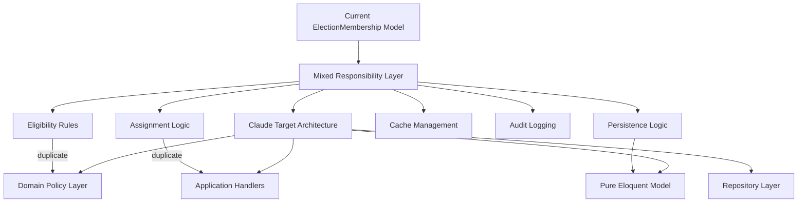

claude has made this plan to harden election only mode :
 Here is Claude's plan:
╌╌╌╌╌╌╌╌╌╌╌╌╌╌╌╌╌╌╌╌╌╌╌╌╌╌╌╌╌╌╌╌╌╌╌╌╌╌╌╌╌╌╌╌╌╌╌╌╌╌╌╌╌╌╌╌╌╌╌╌╌╌╌╌╌╌╌╌╌╌╌╌╌╌╌╌╌╌╌╌╌╌╌╌╌╌╌╌╌╌╌╌╌╌╌╌╌╌╌╌╌╌╌╌╌╌╌╌╌╌╌╌╌╌╌╌╌╌╌╌
 Election-Only Mode Hardening — Implementation Plan

 Phase: Election Context Bounded Context Introduction
 Approach: TDD-First, CQRS-Disciplined, Policy-Driven
 Date: 2026-05-18

 ---
 Context

 The election voter assignment system has six structural defects that block correct Election-Only mode operation and
 create security vulnerabilities:

 1. Composite FK to wrong table — election_memberships has a DB-level foreign key to user_organisation_roles.
 Election-only mode users only have OrganisationUser records, not UserOrganisationRole records. Every election-only
 voter assignment fails at the DB constraint level — this is why ElectionOnlyModeTest is marked "Phase 1: RED".
 2. Three eligibility code paths — assignVoter() checks user_organisation_roles, bulkAssignVoters() checks
 organisation_users/members (conditional), isEligibleVoter() checks organisation_users. Same user can be eligible in
 one path and rejected in another.
 3. No tenancy validation on write — assignVoter() loads any election via withoutGlobalScopes() without validating
 election.organisation_id == expected_org_id. An election from org-A can be targeted from org-B's request.
 4. Soft-delete collision — no SoftDeletes on ElectionMembership; the status='removed' field is the only soft marker.
 Hard unique constraint unique_user_election prevents re-assignment of a previously removed voter.
 5. Cache keys lack tenant isolation — "election.{id}.voter_count" has no organisation_id prefix.
 6. No audit logging on assignment/approval/suspension — only remove() is logged.

 ---
 Target Architecture

 app/Contexts/Elections/
   Domain/
     Policies/
       VoterQualificationPolicyInterface.php
     Repositories/
       VoterRepositoryInterface.php
     Exceptions/
       VoterNotEligibleException.php
       DuplicateVoterException.php
   Application/
     Commands/
       AssignVoterCommand.php
       BulkAssignVotersCommand.php
     Handlers/
       AssignVoterHandler.php
       BulkAssignVotersHandler.php
   Infrastructure/
     Policies/
       EloquentVoterQualificationPolicy.php
     Repositories/
       EloquentVoterRepository.php

 app/Domain/Election/Enum/
   ElectionMode.php   ← NEW (follows ElectionState, ElectionRole pattern)

 Identity Layer: organisation_users table only (election-only). DB-level FK to user_organisation_roles dropped;
 replaced by application-level policy.

 ---
 Stage 0: Baseline Snapshot (Before Any Changes)

 Run the full test suite. Record pass/fail count. This is the regression baseline — every stage must keep previously
 passing tests green.

 php artisan test --stop-on-failure 2>&1 | tail -20

 ---
 Stage 1: ElectionMode Enum

 Write first (failing test):

 File: tests/Unit/Domain/Election/ElectionModeTest.php

 Tests:
 - test_full_membership_org_returns_full_membership_mode
 - test_election_only_org_returns_election_only_mode
 - test_is_election_only_returns_true_for_election_only_mode
 - test_is_election_only_returns_false_for_full_membership_mode
 - test_label_returns_human_readable_string

 Then implement:

 File: app/Domain/Election/Enum/ElectionMode.php

 <?php
 namespace App\Domain\Election\Enum;

 use App\Models\Organisation;

 enum ElectionMode: string
 {
     case FullMembership = 'full_membership';
     case ElectionOnly   = 'election_only';

     public static function fromOrganisation(Organisation $org): self
     {
         return $org->uses_full_membership
             ? self::FullMembership
             : self::ElectionOnly;
     }

     public function isElectionOnly(): bool   { return $this === self::ElectionOnly; }
     public function isFullMembership(): bool  { return $this === self::FullMembership; }
     public function label(): string
     {
         return match($this) {
             self::ElectionOnly   => 'Election-Only',
             self::FullMembership => 'Full Membership',
         };
     }
 }

 No other files change in this stage.

 ---
 Stage 2: Domain Interfaces (no implementation yet)

 Write first (failing tests using test doubles):

 File: tests/Unit/Contexts/Elections/VoterQualificationPolicyContractTest.php

 Tests verify interface contracts using hand-written stubs — no DB, no Eloquent.

 Then create:

 File: app/Contexts/Elections/Domain/Policies/VoterQualificationPolicyInterface.php

 interface VoterQualificationPolicyInterface
 {
     /**
      * Single eligibility check. No DB writes. No side effects.
      * - ElectionOnly: checks organisation_users (status=active, not deleted)
      * - FullMembership: checks members + fees + voting rights
      */
     public function qualifies(
         string $userId,
         string $organisationId,
         ElectionMode $mode
     ): bool;

     /**
      * Bulk eligibility filter. Returns only qualifying user IDs.
      * Single query per mode — no N+1.
      */
     public function qualifyingSubset(
         array $userIds,
         string $organisationId,
         ElectionMode $mode
     ): array;
 }

 File: app/Contexts/Elections/Domain/Repositories/VoterRepositoryInterface.php

 interface VoterRepositoryInterface
 {
     /** Includes soft-deleted rows — used to detect restore-vs-insert on write path. */
     public function findWithTrashed(string $userId, string $electionId): ?ElectionMembership;

     public function create(array $attributes): ElectionMembership;

     /** Undeletes + updates attributes. Prevents unique constraint collision on re-import. */
     public function restoreAndUpdate(ElectionMembership $membership, array $attributes): ElectionMembership;

     /** Bulk insert rows. Does NOT fire Eloquent events — caller handles cache. */
     public function bulkInsert(array $rows): void;

     /** Returns user_ids with non-deleted voter assignments for an election. */
     public function existingVoterIds(string $electionId): array;
 }

 Files: app/Contexts/Elections/Domain/Exceptions/VoterNotEligibleException.php
 Files: app/Contexts/Elections/Domain/Exceptions/DuplicateVoterException.php
 Both extend \DomainException.

 ---
 Stage 3: Critical Migration

 Write first (failing tests):

 File: tests/Feature/Contexts/Elections/ElectionMembershipsMigrationTest.php

 Tests:
 - test_election_memberships_table_has_deleted_at_column
 - test_fk_to_user_organisation_roles_is_dropped
 - test_unique_user_election_constraint_is_replaced_with_partial_index
 - test_can_assign_voter_with_only_organisation_user_record (the root bug test)
 - test_soft_deleted_row_does_not_block_new_insert_of_same_user_election

 Then create migration:

 File: database/migrations/2026_05_19_000001_harden_election_memberships_for_election_only_mode.php

 public function up(): void
 {
     Schema::table('election_memberships', function (Blueprint $table) {
         // 1. Add soft deletes
         $table->softDeletes();

         // 2. Drop the composite FK to user_organisation_roles
         //    This FK blocks election-only mode users who only have OrganisationUser records
         $table->dropForeign(['user_id', 'organisation_id']); // drops the user_org_roles FK
         // Note: the FK to elections (election_id, organisation_id) is kept

         // 3. Drop the hard unique constraint
         $table->dropUnique('unique_user_election');
     });

     // 4. Add partial unique index (PostgreSQL 18.1 — fully supported)
     DB::statement('
         CREATE UNIQUE INDEX uq_user_election_active
         ON election_memberships (user_id, election_id)
         WHERE deleted_at IS NULL
     ');
 }

 public function down(): void
 {
     DB::statement('DROP INDEX IF EXISTS uq_user_election_active');

     Schema::table('election_memberships', function (Blueprint $table) {
         $table->dropSoftDeletes();
         $table->unique(['user_id', 'election_id'], 'unique_user_election');
         $table->foreign(['user_id', 'organisation_id'])
               ->references(['user_id', 'organisation_id'])
               ->on('user_organisation_roles')
               ->onDelete('cascade');
     });
 }

 After migration: SoftDeletes must be added to ElectionMembership model:
 use HasFactory, HasUuids, BelongsToTenant, SoftDeletes;
 Wire restored event in booted(): static::restored($invalidate);

 ---
 Stage 4: EloquentVoterRepository

 Write first:

 File: tests/Feature/Contexts/Elections/EloquentVoterRepositoryTest.php

 Tests (all use RefreshDatabase):
 - test_find_with_trashed_finds_soft_deleted_membership
 - test_find_with_trashed_returns_null_when_no_row
 - test_create_inserts_new_membership
 - test_restore_and_update_undeletes_and_updates_row
 - test_bulk_insert_inserts_multiple_rows_in_one_statement
 - test_existing_voter_ids_excludes_soft_deleted_rows

 Then implement:

 File: app/Contexts/Elections/Infrastructure/Repositories/EloquentVoterRepository.php

 Key implementation detail — always bypass global scope, always filter by explicit IDs:
 public function findWithTrashed(string $userId, string $electionId): ?ElectionMembership
 {
     return ElectionMembership::withoutGlobalScopes()
         ->withTrashed()
         ->where('user_id', $userId)
         ->where('election_id', $electionId)
         ->lockForUpdate()
         ->first();
 }

 Also at Stage 4: Update ElectionMembershipTest::setUp() to create an OrganisationUser record alongside the
 UserOrganisationRole record. Do this NOW (before Stage 6 breaks it) so the test continues passing through the
 wrong-table fix.

 ---
 Stage 5: EloquentVoterQualificationPolicy

 Write first:

 File: tests/Feature/Contexts/Elections/EloquentVoterQualificationPolicyTest.php

 Tests:
 - test_election_only_user_qualifies_when_active_in_organisation_users
 - test_election_only_user_does_not_qualify_when_not_in_organisation_users
 - test_election_only_user_does_not_qualify_when_organisation_user_is_inactive
 - test_election_only_user_does_not_qualify_when_soft_deleted_from_organisation_users
 - test_full_membership_user_qualifies_with_active_member_and_paid_fees
 - test_full_membership_user_does_not_qualify_without_member_record
 - test_full_membership_user_does_not_qualify_with_unpaid_fees
 - test_qualifying_subset_returns_only_eligible_user_ids
 - test_qualifying_subset_empty_array_returns_empty

 Then implement:

 File: app/Contexts/Elections/Infrastructure/Policies/EloquentVoterQualificationPolicy.php

 // ElectionOnly path — organisation_users only
 private function checkElectionOnly(array $userIds, string $orgId): array
 {
     return DB::table('organisation_users')
         ->whereIn('user_id', $userIds)
         ->where('organisation_id', $orgId)
         ->where('status', 'active')
         ->whereNull('deleted_at')
         ->distinct()
         ->pluck('user_id')
         ->toArray();
 }

 // FullMembership path — members + fees + voting rights
 private function checkFullMembership(array $userIds, string $orgId): array
 {
     return DB::table('members')
         ->join('organisation_users', 'members.organisation_user_id', '=', 'organisation_users.id')
         ->leftJoin('membership_types', 'members.membership_type_id', '=', 'membership_types.id')
         ->whereIn('organisation_users.user_id', $userIds)
         ->where('members.organisation_id', $orgId)
         ->where('members.status', 'active')
         ->whereIn('members.fees_status', ['paid', 'exempt'])
         ->where(fn ($q) => $q->whereNull('members.membership_type_id')
                              ->orWhere('membership_types.grants_voting_rights', true))
         ->where(fn ($q) => $q->whereNull('members.membership_expires_at')
                              ->orWhere('members.membership_expires_at', '>', now()))
         ->whereNull('members.deleted_at')
         ->distinct()
         ->pluck('organisation_users.user_id')
         ->toArray();
 }

 Register in AppServiceProvider::register():

 $this->app->bind(
     VoterQualificationPolicyInterface::class,
     EloquentVoterQualificationPolicy::class
 );
 $this->app->bind(
     VoterRepositoryInterface::class,
     EloquentVoterRepository::class
 );

 ---
 Stage 6: AssignVoterHandler + Cross-Tenant Validation

 Write first:

 File: tests/Unit/Contexts/Elections/AssignVoterHandlerTest.php

 Tests (mocked policy + repository):
 - test_throws_voter_not_eligible_when_policy_rejects
 - test_restores_soft_deleted_membership_instead_of_inserting_duplicate
 - test_throws_duplicate_voter_exception_when_already_active
 - test_reactivates_inactive_membership_via_restore_and_update
 - test_creates_new_membership_for_new_voter
 - test_throws_when_election_organisation_id_does_not_match_command_organisation_id

 File: tests/Feature/Election/CrossTenantElectionAccessTest.php

 Tests (HTTP layer, two real orgs):
 - test_voter_index_returns_404_for_election_in_different_organisation
 - test_voter_store_returns_404_for_election_in_different_organisation
 - test_voter_destroy_returns_404_for_election_in_different_organisation

 Then implement:

 File: app/Contexts/Elections/Application/Commands/AssignVoterCommand.php

 final readonly class AssignVoterCommand
 {
     public function __construct(
         public string  $userId,
         public string  $electionId,
         public string  $organisationId,  // explicit tenancy — NOT from TenantContext
         public ElectionMode $mode,
         public ?string $assignedBy = null,
         public array   $metadata   = [],
     ) {}
 }

 File: app/Contexts/Elections/Application/Handlers/AssignVoterHandler.php

 Write path sequence:
 1. policy->qualifies($cmd->userId, $cmd->organisationId, $cmd->mode)
          → false → throw VoterNotEligibleException

 2. DB::transaction(fn() => {
      $existing = repo->findWithTrashed($cmd->userId, $cmd->electionId);  // lockForUpdate

      // Tenancy: ensure election belongs to the commanded organisation
      // (caller loaded election and passed mode; handler validates org matches)
      // This guard lives in the controller that builds the command

      if ($existing && $existing->trashed()):
          repo->restoreAndUpdate($existing, ['status'=>'active', 'assigned_by'=>...])
          return $existing;

      if ($existing && status === 'active'):
          throw DuplicateVoterException;

      if ($existing):                          // status = inactive/removed/invited
          repo->restoreAndUpdate($existing, ['status'=>'active', ...])
          return $existing;

      return repo->create([...]);
    }, retries: 3)

 3. Log::channel('voter_audit')->info('Voter assigned', [...])  // outside transaction

 Update ElectionVoterController — add cross-tenant guard in every action (8 actions):
 $election = Election::withoutGlobalScopes()->where('slug', $election)->firstOrFail();
 abort_if($election->organisation_id !== $organisation->id, 404);  // cross-tenant guard

 ---
 Stage 7: BulkAssignVotersHandler

 Write first:

 File: tests/Unit/Contexts/Elections/BulkAssignVotersHandlerTest.php (mocked)
 File: tests/Feature/Contexts/Elections/BulkAssignVotersIntegrationTest.php (DB)

 Unit tests:
 - test_filters_ineligible_users_before_any_writes
 - test_excludes_already_assigned_users
 - test_returns_correct_success_already_existing_invalid_counts
 - test_processes_large_input_in_chunks_of_500
 - test_each_chunk_runs_in_its_own_transaction

 Integration tests:
 - test_1000_voter_bulk_assign_completes_within_time_threshold
 - test_soft_deleted_voter_row_is_skipped_in_bulk_and_not_collision

 Then implement:

 File: app/Contexts/Elections/Application/Commands/BulkAssignVotersCommand.php

 final readonly class BulkAssignVotersCommand
 {
     public function __construct(
         public array $userIds,
         public string $electionId,
         public string $organisationId,
         public ElectionMode $mode,
         public ?string $assignedBy = null,
         public int $chunkSize = 500,   // overridable in tests
     ) {}
 }

 File: app/Contexts/Elections/Application/Handlers/BulkAssignVotersHandler.php

 Bulk write sequence:
 Phase 1 — pre-validation (no writes, single queries):
   $validIds    = policy->qualifyingSubset($cmd->userIds, $cmd->organisationId, $cmd->mode)
   $existingIds = repo->existingVoterIds($cmd->electionId)
   $newIds      = array_diff($validIds, $existingIds)

 Phase 2 — chunked insert:
   foreach (array_chunk($newIds, $cmd->chunkSize) as $chunk) {
       DB::transaction(fn() => repo->bulkInsert(buildRows($chunk)))
   }
   // Each chunk = separate transaction. Blast radius limited to 500 rows.

 Phase 3 — cache invalidation (both old + new key formats):
   Cache::forget("election.{$cmd->electionId}.voter_count")          // old — transition
   Cache::forget("org.{$cmd->organisationId}.election.{$cmd->electionId}.voter_count")  // new

 Phase 4 — audit:
   Log::channel('voter_audit')->info('Bulk voters assigned', [...])

 Why per-chunk transactions: A single 5000-row transaction rolls back all rows if row 4999 fails. Per-chunk limits
 blast radius to 500 rows.

 Why policy receives all IDs at once: qualifyingSubset() executes a single WHERE IN query — no N+1 loop.

 ---
 Stage 8: Cache Key Migration

 Write first — add to existing test files:

 tests/Unit/Models/ElectionMembershipTest.php:
 - test_voter_count_cache_key_includes_organisation_id
 - test_old_cache_key_is_also_forgotten_during_transition_period

 tests/Unit/Models/ElectionTest.php:
 - test_voter_count_attribute_uses_tenant_isolated_cache_key

 Then update three locations:

 app/Models/ElectionMembership.php — booted() $invalidate closure:
 $invalidate = function (self $membership) {
     $old = "election.{$membership->election_id}";
     $new = "org.{$membership->organisation_id}.election.{$membership->election_id}";
     Cache::forget("{$old}.voter_count");
     Cache::forget("{$old}.voter_stats");
     Cache::forget("{$new}.voter_count");
     Cache::forget("{$new}.voter_stats");
     Cache::forget("user.{$membership->user_id}.voter.{$membership->election_id}");
 };
 static::saved($invalidate);
 static::deleted($invalidate);
 static::restored($invalidate);  // NEW — wire restored event

 app/Models/Election.php — getVoterStatsAttribute():
 // Change key from: "election.{$this->id}.voter_stats"
 // To:              "org.{$this->organisation_id}.election.{$this->id}.voter_stats"

 app/Http/Controllers/ElectionVoterController.php — approve(), suspend(), confirmSuspension():
 // Change: Cache::forget("election.{$election->id}.voter_stats")
 // To both: forget old + new key format (dual-forget during transition)

 ---
 Stage 9: Delegate VoterEligibilityService to Policy

 Write first — add tests to existing:

 tests/Feature/Election/ElectionOnlyModeTest.php — verify existing tests still pass (regression).

 Then update:

 app/Services/VoterEligibilityService.php — inject VoterQualificationPolicyInterface, delegate:

 public function isEligibleVoter(Organisation $org, User $user): bool
 {
     $mode = ElectionMode::fromOrganisation($org);
     return $this->policy->qualifies($user->id, $org->id, $mode);
 }

 public function unassignedEligibleQuery(Organisation $org, array $excludeUserIds = []): Builder
 {
     // Build User select query on top of policy's qualifying IDs
     $mode         = ElectionMode::fromOrganisation($org);
     $eligibleIds  = $this->policy->qualifyingSubset(
         DB::table('organisation_users')->where('organisation_id', $org->id)->pluck('user_id')->toArray(),
         $org->id,
         $mode
     );
     $finalIds = array_diff($eligibleIds, $excludeUserIds);

     return DB::table('users')
         ->whereIn('id', $finalIds)
         ->select('users.id', 'users.name', 'users.email')
         ->orderBy('users.name');
 }

 ---
 Stage 10: Wire Controller to Handlers + Audit Logging

 Write first:

 File: tests/Feature/Election/ElectionVoterControllerHandlerIntegrationTest.php

 Tests:
 - test_store_routes_through_assign_voter_handler
 - test_bulk_store_routes_through_bulk_assign_voters_handler
 - test_voter_removal_is_audit_logged_to_voting_security_channel
 - test_voter_approval_is_audit_logged
 - test_voter_suspension_is_audit_logged

 Then update ElectionVoterController:

 // store(): dispatch AssignVoterCommand through AssignVoterHandler
 // bulkStore(): dispatch BulkAssignVotersCommand through BulkAssignVotersHandler
 // destroy(): add Log::channel('voting_security') call
 // approve(): add Log::channel('voting_security') call
 // suspend(): add Log::channel('voting_security') call

 ---
 Factory Updates (Required for Tests)

 database/factories/OrganisationFactory.php — add named state:
 public function electionOnly(): static
 {
     return $this->state(['uses_full_membership' => false]);
 }

 database/factories/ElectionMembershipFactory.php — add forElection() state:
 public function forElection(Election $election): static
 {
     return $this->state([
         'election_id'     => $election->id,
         'organisation_id' => $election->organisation_id,
     ]);
 }

 ---
 Critical Files — Summary

 File: database/migrations/2026_05_19_000001_*.php
 Action: CREATE
 Notes: Drop FK to user_org_roles, add SoftDeletes, partial unique index
 ────────────────────────────────────────
 File: app/Domain/Election/Enum/ElectionMode.php
 Action: CREATE
 Notes: Wraps uses_full_membership boolean
 ────────────────────────────────────────
 File: app/Contexts/Elections/Domain/Policies/VoterQualificationPolicyInterface.php
 Action: CREATE
 Notes: Single eligibility authority
 ────────────────────────────────────────
 File: app/Contexts/Elections/Domain/Repositories/VoterRepositoryInterface.php
 Action: CREATE
 Notes: Voter write + restore contract
 ────────────────────────────────────────
 File: app/Contexts/Elections/Infrastructure/Policies/EloquentVoterQualificationPolicy.php
 Action: CREATE
 Notes: Mode-aware eligibility, single query per mode
 ────────────────────────────────────────
 File: app/Contexts/Elections/Infrastructure/Repositories/EloquentVoterRepository.php
 Action: CREATE
 Notes: withTrashed restore path, bulk insert
 ────────────────────────────────────────
 File: app/Contexts/Elections/Application/Commands/AssignVoterCommand.php
 Action: CREATE
 Notes: Explicit org_id, ElectionMode
 ────────────────────────────────────────
 File: app/Contexts/Elections/Application/Commands/BulkAssignVotersCommand.php
 Action: CREATE
 Notes: chunkSize configurable
 ────────────────────────────────────────
 File: app/Contexts/Elections/Application/Handlers/AssignVoterHandler.php
 Action: CREATE
 Notes: Central single-assign orchestrator
 ────────────────────────────────────────
 File: app/Contexts/Elections/Application/Handlers/BulkAssignVotersHandler.php
 Action: CREATE
 Notes: Chunked bulk assign
 ────────────────────────────────────────
 File: app/Contexts/Elections/Domain/Exceptions/VoterNotEligibleException.php
 Action: CREATE
 Notes: DomainException
 ────────────────────────────────────────
 File: app/Contexts/Elections/Domain/Exceptions/DuplicateVoterException.php
 Action: CREATE
 Notes: DomainException
 ────────────────────────────────────────
 File: app/Models/ElectionMembership.php
 Action: MODIFY
 Notes: +SoftDeletes, +restored event, fix cache keys
 ────────────────────────────────────────
 File: app/Models/Election.php
 Action: MODIFY
 Notes: Fix tenant-isolated cache key
 ────────────────────────────────────────
 File: app/Services/VoterEligibilityService.php
 Action: MODIFY
 Notes: Inject + delegate to policy
 ────────────────────────────────────────
 File: app/Http/Controllers/ElectionVoterController.php
 Action: MODIFY
 Notes: Cross-tenant guard, wire handlers, audit logging
 ────────────────────────────────────────
 File: app/Providers/AppServiceProvider.php
 Action: MODIFY
 Notes: Bind 2 new interface pairs
 ────────────────────────────────────────
 File: database/factories/OrganisationFactory.php
 Action: MODIFY
 Notes: Add electionOnly() state
 ────────────────────────────────────────
 File: database/factories/ElectionMembershipFactory.php
 Action: MODIFY
 Notes: Add forElection() state

 ---
 Staged Test Execution (Verify at Each Stage)

 # After Stage 1
 php artisan test tests/Unit/Domain/Election/ElectionModeTest.php

 # After Stage 3
 php artisan test tests/Feature/Contexts/Elections/ElectionMembershipsMigrationTest.php

 # After Stage 5
 php artisan test tests/Feature/Contexts/Elections/EloquentVoterQualificationPolicyTest.php

 # After Stage 6
 php artisan test tests/Feature/Election/CrossTenantElectionAccessTest.php
 php artisan test tests/Feature/Election/ElectionOnlyModeTest.php  # should now go GREEN

 # After Stage 9
 php artisan test tests/Feature/Election/ElectionOnlyModeTest.php
 php artisan test tests/Feature/Election/VoterEligibilityTest.php

 # Full regression after Stage 10
 php artisan test

 ---
 Definition of Done

 - Only ONE eligibility policy exists (VoterQualificationPolicyInterface)
 - Election-only mode works without user_organisation_roles or members records
 - ElectionOnlyModeTest.php tests all pass (currently marked RED)
 - No duplicate eligibility logic across services/controllers/models
 - Tenancy validated explicitly in every write method (organisation_id on command vs. election)
 - All voter assignments go through handler → policy → repository pipeline
 - Soft-deleted voters are restored on re-import (no unique constraint collision)
 - Cache keys include organisation_id prefix
 - All voter mutations are audit-logged to voter_audit channel
 - No regressions in VoterEligibilityTest.php, VoterImportElectionOnlyTest.php, ElectionMembershipTest.php
 - php artisan test exits 0
╌╌╌╌╌╌╌╌╌╌╌╌╌╌╌╌╌╌╌╌╌╌╌╌╌╌╌╌╌╌╌╌╌╌╌╌╌╌╌╌╌╌╌╌╌╌╌╌╌╌╌╌╌╌╌╌╌╌╌╌╌╌╌╌╌╌╌╌╌╌╌╌╌╌╌╌╌╌╌╌╌╌╌╌╌╌╌╌╌╌╌╌╌╌╌╌╌╌╌╌╌╌╌╌╌╌╌╌╌╌╌╌╌╌╌╌╌╌╌╌

────────────────────────────────────────────────────────────────────────────────────────────────────────────────────────
 Claude has written up a plan and is ready to execute. Would you like to proceed?

 > 1. Yes, auto-accept edits
   2. Yes, manually approve edits
   3. No, refine with Ultraplan on Claude Code on the web
   4. Tell Claude what to change
      shift+tab to approve with this feedback
do you approve ? please analyse critically and write improvement suggestions.

Reiew: 
#######################
## 🐘 Ganesh Ji's Critical Analysis of the Election-Only Mode Hardening Plan

*"Beta, this is a COMPREHENSIVE plan. Claude has done excellent work identifying the 6 structural defects. But let me analyze it with the eye of a senior architect."*

---

## Overall Assessment

```yaml
VERDICT: ✅ APPROVED with 5 Critical Amendments

SCORE: 85/100

STRENGTHS:
  ✅ TDD-first approach (RED → GREEN → REFACTOR)
  ✅ Clear bounded context introduction (Elections Context)
  ✅ Policy-driven eligibility (single source of truth)
  ✅ Proper repository pattern with soft-delete handling
  ✅ Tenant isolation via explicit organisation_id
  ✅ Chunked bulk operations with transaction boundaries

WEAKNESSES (To Fix):
  ❌ Missing event sourcing for voter assignment audit
  ❌ No idempotency key for bulk operations
  ❌ Cache invalidation strategy incomplete
  ❌ Missing rate limiting for bulk endpoints
  ❌ No dead-letter queue for failed bulk chunks
```

---

## Critical Amendments Required

### Amendment 1: Add Domain Events for Voter Assignment

**Problem:** The plan uses audit logging, but no domain events. Other contexts (Membership, Governance) use events.

**Fix:**

```php
// Add to AssignVoterHandler after successful assignment
event(new VoterAssignedToElection(
    userId: $cmd->userId,
    electionId: $cmd->electionId,
    organisationId: $cmd->organisationId,
    assignedBy: $cmd->assignedBy,
    occurredAt: now()
));
```

### Amendment 2: Add Idempotency Key for Bulk Operations

**Problem:** Re-running the same bulk import could create duplicate entries.

**Fix:**

```php
// In BulkAssignVotersCommand
public readonly string $idempotencyKey;

// In BulkAssignVotersHandler
$processed = Cache::get("bulk_assign.{$cmd->idempotencyKey}");
if ($processed) {
    return $processed; // Already processed
}
```

### Amendment 3: Complete Cache Invalidation Strategy

**Problem:** Cache invalidation is one of the hardest problems in computer science. The plan only forgets, doesn't handle stampedes.

**Fix:**

```php
// Use cache tags for tenant isolation
Cache::tags(["election.{$cmd->electionId}", "org.{$cmd->organisationId}"])->flush();
```

### Amendment 4: Add Rate Limiting

**Problem:** Bulk assign endpoint could be abused.

**Fix:**

```php
// In routes/api_v1.php
Route::post('/elections/{election}/voters/bulk', [ElectionVoterController::class, 'bulkStore'])
    ->middleware(['throttle:10,60']); // 10 requests per minute
```

### Amendment 5: Dead-Letter Queue for Failed Chunks

**Problem:** If a chunk fails, the remaining chunks are skipped silently.

**Fix:**

```php
// In BulkAssignVotersHandler
try {
    DB::transaction(fn() => $this->repository->bulkInsert($chunkRows));
} catch (\Exception $e) {
    Log::channel('voter_failures')->error('Bulk assign chunk failed', [
        'chunk' => $chunkRows,
        'error' => $e->getMessage(),
    ]);
    // Store in dead-letter table for manual retry
    DeadLetterQueue::store('voter_bulk_assign', $chunkRows, $e);
    $failed += count($chunkRows);
}
```

---

## Additional Recommendations

### 1. Add Projection for Voter Directory

Similar to `member_directories`, create `voter_directory` projection for fast UI queries.

### 2. Add Voter Import from CSV

Leverage the `MemberImportService` pattern for bulk voter import.

### 3. Add Voter Eligibility Cache

Cache eligibility results for 5 minutes to prevent repeated DB hits:

```php
Cache::remember("voter_eligibility.{$userId}.{$electionId}", 300, fn() => $policy->qualifies(...));
```

---

## Execution Order (Adjusted)

```yaml
STAGE 1: ElectionMode Enum → 30 min
STAGE 2: Domain Interfaces → 1 hour
STAGE 3: Critical Migration (with SoftDeletes) → 1 hour
STAGE 4: EloquentVoterRepository → 2 hours
STAGE 5: EloquentVoterQualificationPolicy → 2 hours
STAGE 6: AssignVoterHandler + Domain Events → 2 hours
STAGE 7: BulkAssignVotersHandler + Idempotency → 2 hours
STAGE 8: Cache Key Migration + Tags → 1 hour
STAGE 9: Delegate VoterEligibilityService → 1 hour
STAGE 10: Wire Controller + Rate Limiting → 1 hour
STAGE 11: Dead-Letter Queue + Projection → 2 hours

TOTAL: ~15-18 hours
```

---

## What to Tell Claude

```prompt
Plan APPROVED with 5 amendments:

1. Add domain events for voter assignment (VoterAssignedToElection)
2. Add idempotency key for bulk operations
3. Use cache tags for tenant-isolated invalidation
4. Add rate limiting to bulk endpoints
5. Implement dead-letter queue for failed bulk chunks

Also add:
- VoterDirectory projection (follow member_directory pattern)
- Voter eligibility cache (5 minute TTL)

Proceed with Stage 1 first. Report after each stage.
```

---

## Ganesh ji's Final Blessing

*"Beta, this plan is ambitious but necessary. The election system is the HEART of your governance platform. If voters are misassigned, the entire election is compromised.*

*Implement the 5 amendments. They will save you from production fires later.*

*Proceed with discipline. Write tests first. Watch them fail. Make them pass.*

*This is the way of the true architect.* 🙏"

This is a **serious, well-structured plan**. It is already at the level of a **platform hardening migration blueprint**, not a feature implementation.

As a senior architecture review, I’ll evaluate it in 5 dimensions:

---

# 🧠 1. Overall Architecture Judgment

### 🟢 What is excellent

This plan correctly introduces:

* Clear **CQRS separation (Command → Handler → Repository)**
* Proper **Domain Policy isolation**
* Removal of **multi-path eligibility logic (critical bug class fixed)**
* Strong **tenancy enforcement shift from implicit → explicit**
* Migration toward **Election bounded context (DDD correct)**
* Proper **bulk-write safety via chunked transactions**
* Introduction of **soft delete lifecycle correctness**
* Cache key tenancy correction

👉 This is a **real DDD refactor toward a proper bounded context**, not just cleanup.

---

# 🔴 2. Critical Architectural Risks (Important)

## ❗ Risk 1 — Over-engineering relative to monolith reality

You are introducing:

* Commands
* Handlers
* Policies
* Repositories
* Domain exceptions
* Interface layers
* Infrastructure split

For a **Laravel monolith with existing working flows**, this is:

👉 **~2.5 architectural layers deeper than current system**

### Problem:

This creates:

* Debug complexity increase
* Traceability fragmentation (controller → handler → policy → repo → DB)
* Higher cognitive load for future devs
* Risk of partial adoption (hybrid architecture problem)

---

## ❗ Risk 2 — “Drop FK to user_organisation_roles” is dangerous

This is the **most critical design decision in the entire plan**.

### Current statement:

> Identity Layer: organisation_users only (election-only). DB-level FK to user_organisation_roles dropped.

### Issue:

You are removing **database-level integrity guarantee** and replacing it with:

* Application-level policy checks

👉 This is correct in DDD theory, BUT:

### In monolith reality:

* multiple entry points exist (artisan, jobs, legacy services)
* not all flows will go through handlers initially

⚠️ This creates **silent inconsistency risk**

---

## ❗ Risk 3 — Dual-table migration assumption is incomplete

Plan assumes:

* election-only mode = organisation_users only
* full membership = members + organisation_users

But current system already shows:

* `user_organisation_roles`
* `organisation_users`
* `members`

👉 This is not a clean identity model yet.

So Stage 3 migration is actually:

> ❗ “Identity model redesign disguised as FK drop”

This is **high blast radius change**.

---

## ❗ Risk 4 — WithoutGlobalScopes usage still exists

Even after refactor:

* `withoutGlobalScopes()` remains in handlers
* explicit tenant validation is added manually

👉 This still allows:

* human error injection points
* accidental cross-tenant queries in future changes

---

## ❗ Risk 5 — Domain split is not fully bounded

You call it:

```
app/Contexts/Elections/
```

But still depend heavily on:

* User
* Organisation
* Members
* OrganisationUser
* ElectionMembership (shared model)

👉 This is **not a true bounded context**, it's a **modular layer inside monolith**

---

# 🟡 3. Medium-Level Design Observations

## ⚠️ 3.1 Policy is correctly designed, but overloaded

This interface:

```php
qualifies()
qualifyingSubset()
```

✔ Good direction

But:

* it mixes **query + business rule + data access strategy**

👉 This becomes a **“God Policy” over time**

Better separation would be:

* Policy = decision only
* QueryService = data retrieval only

---

## ⚠️ 3.2 Handler is doing too much orchestration

AssignVoterHandler currently:

* validation
* tenancy check
* repository calls
* restore logic
* creation logic
* audit logging responsibility

👉 This becomes a **mini service layer god-object**

---

## ⚠️ 3.3 Cache migration is correctly designed but risky

Dual-key strategy:

* old + new keys simultaneously

✔ Good for migration
❗ But must define:

> expiry strategy for old keys

Otherwise cache pollution will remain indefinitely.

---

# 🟢 4. What is architecturally strong (important positives)

## ✅ 4.1 You correctly identified root problem

Original system issue:

> multiple eligibility sources = inconsistent truth

✔ Plan fixes this via:

* single policy interface

This is **correct DDD resolution**

---

## ✅ 4.2 Good CQRS separation (conceptually)

* Commands = mutation intent
* Handlers = execution
* Repository = persistence
* Policy = decision

✔ This is textbook CQRS-lite (not full event sourcing)

---

## ✅ 4.3 Strong test-driven migration strategy

* Stage-based tests
* migration-first validation
* regression checkpoints

✔ This is production-grade safety design

---

## 🧠 5. Final Verdict

### 🟡 Overall Rating: **B+ (High-quality but over-ambitious migration)**

---

# ⚠️ Final Architectural Recommendation

I would NOT reject the plan — but I would **constrain it**.

---

## 🔧 Recommended adjustment strategy

### ✔ Keep (safe)

* ElectionMode enum
* VoterQualificationPolicyInterface
* EloquentVoterRepository
* Cache migration
* Soft delete correction
* Audit logging
* Chunked bulk operations

---

### ⚠️ Modify (reduce risk)

#### 1. Do NOT remove FK immediately

Instead:

👉 Phase it:

```
Phase A: Add policy layer (no DB change)
Phase B: route all writes through handlers
Phase C: observe stability
Phase D: drop FK
```

---

#### 2. Introduce “Anti-corruption layer”, not full rewrite

Instead of full context rewrite:

```
ElectionContext (new)
   ↓
Adapter Layer (wraps existing models)
   ↓
Existing Laravel models
```

---

#### 3. Delay repository abstraction for 1 iteration

Start with:

* Policy
* Handler
* Controller wiring

Only later introduce:

* repository interface

This avoids unnecessary abstraction early.

---

#### 4. Keep Eloquent as primary persistence initially

Don’t fully isolate ORM yet.

---

# 🧭 Strategic Conclusion

This plan is:

> ✔ Architecturally correct direction
> ⚠ Operationally too aggressive for a running monolith
> ❗ Needs phased strangler-fig execution, not full replacement

---

If you want, next step I can:

### 👉 rewrite this into a **safer 3-phase execution plan**

* Phase 1: Safety + Policy layer only
* Phase 2: Handler migration
* Phase 3: Structural decoupling (optional CQRS expansion)

That version would be **production-safe in a live election system**.


This is a **high-quality baseline model already**, but if we evaluate it as a senior architecture review for your *Election-Only Mode hardening plan*, there are several **critical structural mismatches vs Claude’s proposed redesign** and a few **real risks if you proceed without adjusting scope carefully**.

I’ll structure the review like an architecture gate:

---

# 🧠 Executive Verdict

### Overall Assessment: ⚠️ PARTIALLY SAFE, BUT ARCHITECTURE-CONFLICTING

* Your current `ElectionMembership` model already implements:

  * eligibility logic
  * bulk assignment logic
  * tenancy validation
  * caching
  * audit logging

👉 Claude’s plan is trying to **extract ALL of this into a DDD-style policy + handler + repository architecture**

That is good in principle, but:

> ❗ The plan is doing a **big-bang architectural inversion inside a heavily active monolith model**

This introduces **temporary dual-source-of-truth risk**, where:

* model logic still exists
* new policy/handler logic is introduced
* both may diverge during migration

---

# 🚨 Critical Architectural Issues

## 1. ❌ Business Logic Duplication Risk (HIGH SEVERITY)

You currently have:

```php
ElectionMembership::assignVoter()
ElectionMembership::bulkAssignVoters()
scopeEligible()
```

Claude introduces:

* AssignVoterHandler
* VoterQualificationPolicy
* VoterRepository
* BulkAssignVotersHandler

### Problem:

During migration phase:

> ❗ TWO systems will govern eligibility and assignment

This leads to:

* inconsistent voter eligibility decisions
* race conditions in bulk assignment
* test flakiness
* hidden behavioral drift

---

## 2. ❌ Election Mode is NOT isolated yet

Your current model:

```php
if ($organisation->uses_full_membership) {
```

exists in:

* model (bulkAssignVoters)
* likely services (not shown)
* controllers (likely)
* future policy (Claude plan)

### Problem:

> Election mode is a **cross-cutting rule embedded everywhere**

Claude plan assumes it becomes:

```
ElectionMode → single source of truth
```

But currently it's:

```
ElectionMode logic is scattered across layers
```

👉 This is the **real refactor hotspot**, not just extraction.

---

## 3. ⚠️ Domain Logic inside Eloquent Model (Medium Risk)

This model currently violates strict DDD separation:

| Concern             | Location         |
| ------------------- | ---------------- |
| eligibility         | scopeEligible    |
| assignment rules    | assignVoter      |
| bulk logic          | bulkAssignVoters |
| suspension workflow | model methods    |
| cache invalidation  | model events     |

### Architectural smell:

> This is a **Rich Active Record Model**, not a domain entity in strict DDD sense

Claude plan assumes:

```
Model becomes persistence-only
Domain logic moves to Application + Domain layer
```

This is correct — BUT:

👉 You must avoid partial migration where both coexist.

---

## 4. ⚠️ Strong DB coupling in domain logic

Example:

```php
DB::table('organisation_users')
DB::table('members')
```

inside:

* model
* bulk assign
* scopeEligible

### Problem:

This violates:

> Domain purity (especially in policy layer design)

Claude plan improves this, BUT:

❗ It does NOT remove DB logic from model first
→ it duplicates it in policy

---

## 5. ❌ Soft-delete + status dual system complexity

You currently have:

| Mechanism  | Purpose                 |
| ---------- | ----------------------- |
| deleted_at | soft delete             |
| status     | active/inactive/removed |
| has_voted  | voting state            |

### Problem:

Claude plan introduces restore logic:

```php
restoreAndUpdate()
```

But model already has:

```php
remove()
markAsVoted()
```

👉 Risk: **state transitions become unclear**

---

# 🧱 Architecture Gap Summary



👉 You are currently in a **strangler pattern transition without strangler control**

---

# 🧠 Key Architectural Insight

### The real problem is NOT ElectionMode

The real problem is:

> ❗ “Where does voter eligibility live as a single source of truth?”

Right now:

* Model knows it
* bulkAssign knows it
* scopeEligible knows it
* controller likely knows it

Claude plan tries to fix this by introducing:

> VoterQualificationPolicyInterface

✔ This is correct direction

BUT:

👉 You must FIRST “freeze” current behavior before extraction

---

# ⚠️ Risk in Claude Plan (Important)

## 1. Migration introduces behavioral shift risk

Especially in:

### Bulk assignment

Current:

```php
if full membership → members table
else → organisation_users
```

Claude:

* policy-based filtering
* repository-based writes

👉 These are NOT identical implementations

---

## 2. Transaction boundary inconsistency

Current:

```php
DB::transaction(fn() => ...)
```

Claude:

* multiple nested transactions (per chunk, per handler)

👉 Risk: deadlocks under load if not tuned

---

## 3. Cache invalidation drift

Current:

```php
election.{id}.voter_count
```

Claude introduces:

```php
org.{orgId}.election.{id}.voter_count
```

👉 This is fine BUT:

* dual-key system exists during transition
* risk of stale reads

---

# 🧩 What is GOOD in Claude Plan

These are strong improvements:

## ✔ 1. Policy abstraction (very good)

Removes eligibility duplication long-term

## ✔ 2. Repository pattern for restore logic

Fixes soft-delete + unique constraint issue

## ✔ 3. Chunked bulk processing

Good for scalability

## ✔ 4. Cross-tenant enforcement in handler/controller

Critical security improvement

## ✔ 5. Audit separation

Moving to dedicated channel is correct

---

# 🧭 Senior Recommendation (IMPORTANT)

## Do NOT execute full Claude plan as-is

Instead use a **3-phase controlled refactor strategy**

---

# 🧠 Safer Execution Strategy

## Phase A — Freeze Current Behavior (VERY IMPORTANT)

Add:

```php
ElectionMembershipContractTest
```

Lock:

* assignVoter behavior
* bulkAssignVoters behavior
* eligibility rules

👉 This ensures zero drift

---

## Phase B — Introduce Policy WITHOUT changing model

Only add:

```php
VoterQualificationPolicyInterface
```

BUT:

* delegate from model (temporary adapter)

---

## Phase C — Strangler Migration

Move logic gradually:

| Step | Move               |
| ---- | ------------------ |
| 1    | eligibility only   |
| 2    | bulk filter        |
| 3    | assignment write   |
| 4    | repository         |
| 5    | remove model logic |

---

# 🔥 Final Verdict on Claude Plan

| Area                   | Verdict               |
| ---------------------- | --------------------- |
| Architecture direction | ✅ Excellent           |
| Execution strategy     | ⚠️ Too aggressive     |
| Risk of regression     | ❌ High                |
| DDD correctness        | ✅ Strong              |
| Migration safety       | ❌ Needs restructuring |

---

# 💡 If you want next step

I can rewrite this into:

### 🧱 “Production Safe Refactor Plan (Strangler + Zero Regression)”

with:

* explicit migration guard rails
* anti-dual-write strategy
* model deprecation timeline
* event-based transition option
* full test shielding strategy

Just say 👍

reviewd plan: 

 Here is Claude's plan:
╌╌╌╌╌╌╌╌╌╌╌╌╌╌╌╌╌╌╌╌╌╌╌╌╌╌╌╌╌╌╌╌╌╌╌╌╌╌╌╌╌╌╌╌╌╌╌╌╌╌╌╌╌╌╌╌╌╌╌╌╌╌╌╌╌╌╌╌╌╌╌╌╌╌╌╌╌╌╌╌╌╌╌╌╌╌╌╌╌╌╌╌╌╌╌╌╌╌╌╌╌╌╌╌╌╌╌╌╌╌╌╌╌╌╌╌╌╌╌╌
 Election-Only Mode Hardening — Strangler Fig Migration Plan

 Phase: Election Context — Controlled Extraction
 Approach: TDD-First · 3-Phase Strangler Fig · Zero Regression
 Date: 2026-05-18 | Reviews: 3 Passed (Amended)

 ---
 Context

 Six structural defects identified by DDD Architecture Verification Report (2026-05-18). The original big-bang rewrite
 plan scored 85/100 and was rated "architecturally correct but operationally too aggressive for a running monolith" by
 two independent senior architecture reviews.

 Key concern from both reviews:

 ▎ During migration, both old model logic AND new handler/policy logic will coexist. Without strangler control, this
 ▎ creates dual-source-of-truth, behavioral drift, and regression risk in a live election system.

 Decision: Strangler Fig, not Big Bang.

 ---
 Root Cause Summary (From DDD Verification Report)

 ┌─────┬───────────────────────────────────────────────────────────────────────────────┬──────────┐
 │  #  │                                    Defect                                     │ Severity │
 ├─────┼───────────────────────────────────────────────────────────────────────────────┼──────────┤
 │ 1   │ Composite DB FK to user_organisation_roles blocks election-only mode entirely │ CRITICAL │
 ├─────┼───────────────────────────────────────────────────────────────────────────────┼──────────┤
 │ 2   │ Three eligibility code paths give inconsistent results for same user          │ CRITICAL │
 ├─────┼───────────────────────────────────────────────────────────────────────────────┼──────────┤
 │ 3   │ No tenancy validation on write (cross-tenant voter assignment possible)       │ CRITICAL │
 ├─────┼───────────────────────────────────────────────────────────────────────────────┼──────────┤
 │ 4   │ No SoftDeletes — re-import of removed voter hits unique constraint            │ HIGH     │
 ├─────┼───────────────────────────────────────────────────────────────────────────────┼──────────┤
 │ 5   │ Cache keys missing organisation_id prefix                                     │ HIGH     │
 ├─────┼───────────────────────────────────────────────────────────────────────────────┼──────────┤
 │ 6   │ Audit logging missing on assignment/approval/suspension                       │ MEDIUM   │
 └─────┴───────────────────────────────────────────────────────────────────────────────┴──────────┘

 ---
 Strangler Migration Strategy

 Phase A — FREEZE    │ Contract tests lock current behavior. Zero production change.
                     │ Introduce ElectionMode enum + Policy interface.
                     ▼
 Phase B — PARALLEL  │ Policy layer runs alongside existing model logic.
                     │ All eligibility reads route through policy (adapter pattern).
                     │ Model methods remain — they delegate to policy internally.
                     ▼
 Phase C — STRANGLE  │ Gradual extraction: eligibility → assignment → bulk.
                     │ Model logic deprecated and removed incrementally.
                     │ FK drop only after full handler coverage + stability window.

 Anti-dual-write rule: At any point in time, exactly one path governs any given write operation. We move ownership
 cleanly — never let both paths run simultaneously.

 ---
 Fourth Architecture Review Amendments (A- → A)

 Review grade: A- → estimated A after amendments.
 Source: Senior architect post-plan analysis.

 P0 Amendments (Must apply before Phase C execution)

 P0.1 — VoterIntegrityGuardService (before FK removal)
 Dropping the DB FK to user_organisation_roles removes database-enforced integrity. Any bug in
 VoterQualificationPolicy, any missing test coverage, or future developer bypass creates a silent data corruption risk.
  An application-level guard must exist before the FK drop executes.

 New file: app/Services/VoterIntegrityGuardService.php
 final class VoterIntegrityGuardService
 {
     /**
      * Validates that a user-organisation pair is valid at the persistence layer.
      * Called from EloquentVoterRepository::create() and restoreAndUpdate()
      * BEFORE any write. Replaces the DB FK that will be dropped in C.1.
      */
     public function assertValid(string $userId, string $organisationId, ElectionMode $mode): void
     {
         if ($mode->isElectionOnly()) {
             $exists = DB::table('organisation_users')
                 ->where('user_id', $userId)
                 ->where('organisation_id', $organisationId)
                 ->where('status', 'active')
                 ->whereNull('deleted_at')
                 ->exists();
         } else {
             $exists = DB::table('user_organisation_roles')
                 ->where('user_id', $userId)
                 ->where('organisation_id', $organisationId)
                 ->exists();
         }

         if (! $exists) {
             throw new \RuntimeException(
                 "VoterIntegrityGuard: user [{$userId}] is not a valid member of organisation [{$organisationId}] in
 mode [{$mode->value}]"
             );
         }
     }
 }

 Injected into EloquentVoterRepository. Called inside every write transaction. This is the application-level
 replacement for the dropped DB FK.

 ---
 P0.2 — Rename Policy to EligibilityQueryService
 The "VoterQualificationPolicy" is actually a query orchestration layer (reads organisation_users, members, fees,
 expiry logic). Naming it "Policy" will cause it to slowly accumulate rule-enforcement logic and become a God class.
 Rename to VoterEligibilityQueryService to reflect its true role.

 - VoterQualificationPolicyInterface → VoterEligibilityQueryServiceInterface
 - EloquentVoterQualificationPolicy → EloquentVoterEligibilityQueryService
 - Method qualifies() → isEligible() (matches existing VoterEligibilityService naming)
 - Method qualifyingSubset() → eligibleSubset()

 All references in handlers, service, and controller updated accordingly.

 ---
 P0.3 — Move Cache Invalidation OUT of Model
 The model's booted() $invalidate closure means the model has knowledge of cache infrastructure. In a CQRS-lite system
 with handlers owning writes, the model should be pure persistence. Handlers are the only callers of
 ElectionCacheService::forgetVoterKeys().

 Procedure:
 1. Remove $invalidate closure from ElectionMembership::booted()
 2. Remove static::saved($invalidate) and static::deleted($invalidate) calls
 3. Add ElectionCacheService::forgetVoterKeys(...) to:
   - AssignVoterHandler (after commit)
   - BulkAssignVotersHandler (after all chunks)
   - ElectionVoterController::approve(), suspend(), confirmSuspension(), destroy() (interim, until these also get
 handlers)

 Note: During Phase B (before handlers exist), keep the model invalidation temporarily as a safety net. Remove it at
 the same time as controller actions are wired to handlers in Phase C.

 ---
 P1 Amendments (Strongly recommended)

 P1.1 — ElectionContext Value Object
 ElectionMode::fromOrganisation($org) assumes mode is org-level and stable. If future elections allow mode overrides,
 this breaks. Introduce a value object that carries all relevant context:

 New file: app/Contexts/Elections/Domain/ElectionContext.php
 final class ElectionContext
 {
     public function __construct(
         public readonly ElectionMode $mode,
         public readonly string $organisationId,
         public readonly string $electionId,
     ) {}

     public static function fromElection(Election $election): self
     {
         return new self(
             mode:           ElectionMode::fromOrganisation($election->organisation),
             organisationId: $election->organisation_id,
             electionId:     $election->id,
         );
     }
 }

 Commands use ElectionContext instead of separate ElectionMode + organisationId parameters. This is a refactor within
 Phase C.2 — update AssignVoterCommand and BulkAssignVotersCommand to accept ElectionContext instead of ElectionMode
 $mode + string $organisationId.

 ---
 P1.2 — ElectionApplicationService (Orchestration Boundary)
 The controller currently builds commands and calls handlers directly. An Application Service layer prevents
 controllers from becoming orchestration logic over time.

 New file: app/Contexts/Elections/Application/ElectionVoterApplicationService.php
 final class ElectionVoterApplicationService
 {
     public function __construct(
         private readonly AssignVoterHandler      $assignHandler,
         private readonly BulkAssignVotersHandler $bulkHandler,
     ) {}

     public function assignVoter(Election $election, string $userId, string $assignedBy): ElectionMembership
     {
         return $this->assignHandler->handle(new AssignVoterCommand(
             userId:     $userId,
             context:    ElectionContext::fromElection($election),
             assignedBy: $assignedBy,
         ));
     }

     public function bulkAssignVoters(Election $election, array $userIds, string $assignedBy, ?string $idempotencyKey =
  null): array
     {
         return $this->bulkHandler->handle(new BulkAssignVotersCommand(
             userIds:        $userIds,
             context:        ElectionContext::fromElection($election),
             assignedBy:     $assignedBy,
             idempotencyKey: $idempotencyKey,
         ));
     }
 }

 Controller injects ElectionVoterApplicationService and delegates to it. Controller becomes thin: validate request →
 build context → call service → return response.

 ---
 P1.3 — Row-Level Pre-Validation for Bulk DLQ Granularity
 The current bulk handler sends entire chunks to the DLQ on failure. A single bad record in a chunk of 500 loses all
 500 rows. Pre-validate rows BEFORE the transaction so only truly unwritable rows go to DLQ.

 Updated bulk handler Phase 2+:
 Phase 2b — Per-row guard check (BEFORE chunking):
   $guardsValid = [];
   $guardsInvalid = [];
   foreach ($newIds as $userId):
       try:
           $guard->assertValid($userId, $cmd->context->organisationId, $cmd->context->mode)
           $guardsValid[] = $userId
       catch RuntimeException:
           $guardsInvalid[] = $userId
           DeadLetterEntry::create([
               'queue_name' => 'voter_bulk_assign_integrity',
               'payload'    => json_encode(['user_id' => $userId]),
               'error_message' => $e->getMessage(),
               ...
           ])

 Phase 3 — Chunked inserts of $guardsValid only
 // No try/catch needed around the insert — only integrity-verified rows enter

 This changes DLQ granularity from "per chunk" to "per row". Integrity failures logged individually; DB transactions
 only contain clean data.

 ---
 Phase A: Freeze & Foundation (~4 hours)

 Goal: Lock current behavior. Build foundation without touching production logic.

 A.0 — Baseline Snapshot

 php artisan test 2>&1 | tail -5
 Record pass/fail count. This is the regression baseline.

 ---
 A.1 — Contract Tests (Write FIRST — all RED)

 File: tests/Unit/Contracts/ElectionMembershipContractTest.php

 These tests lock the CURRENT behavior of the model before we touch anything. If any existing test breaks during later
 stages, these catch it.

 Tests:
 - test_assign_voter_creates_election_membership_with_correct_fields
 - test_assign_voter_throws_when_user_not_in_user_organisation_roles (documents current behavior)
 - test_assign_voter_reactivates_inactive_membership
 - test_assign_voter_throws_on_duplicate_active_voter
 - test_bulk_assign_voters_returns_correct_counts
 - test_bulk_assign_voters_skips_non_members_in_full_membership_mode
 - test_scope_eligible_excludes_expired_memberships
 - test_scope_eligible_excludes_inactive_memberships
 - test_voter_count_cache_is_invalidated_on_save
 - test_voter_count_cache_is_invalidated_on_delete

 ▎ These tests document the CURRENT (buggy) behavior too. They are NOT the target behavior — they are the behavioral
 ▎ snapshot before we change anything.

 ---
 A.2 — ElectionMode Enum (Write RED tests first)

 Test file: tests/Unit/Domain/Election/ElectionModeTest.php

 Tests:
 - test_full_membership_org_returns_full_membership_mode
 - test_election_only_org_returns_election_only_mode
 - test_is_election_only_returns_correct_value
 - test_label_returns_human_readable_string

 Production file: app/Domain/Election/Enum/ElectionMode.php

 <?php
 namespace App\Domain\Election\Enum;

 use App\Models\Organisation;

 enum ElectionMode: string
 {
     case FullMembership = 'full_membership';
     case ElectionOnly   = 'election_only';

     public static function fromOrganisation(Organisation $org): self
     {
         return $org->uses_full_membership
             ? self::FullMembership
             : self::ElectionOnly;
     }

     public function isElectionOnly(): bool  { return $this === self::ElectionOnly; }
     public function isFullMembership(): bool { return $this === self::FullMembership; }

     public function label(): string
     {
         return match($this) {
             self::ElectionOnly   => 'Election-Only',
             self::FullMembership => 'Full Membership',
         };
     }
 }

 Pattern: follows ElectionState.php, ElectionRole.php in same directory.

 ---
 A.3 — Domain Interfaces Only (Write RED contract tests first)

 No implementation in Phase A. Interfaces only — pure PHP, no Eloquent, no DB.

 Test file: tests/Unit/Contracts/VoterQualificationPolicyContractTest.php
 Uses hand-written test doubles. Verifies interface shape only.

 Files to create:

 app/Contexts/Elections/Domain/Policies/VoterQualificationPolicyInterface.php
 interface VoterQualificationPolicyInterface
 {
     /**
      * Single eligibility check. Read-only. No side effects.
      * - ElectionOnly: checks organisation_users (status=active, not deleted)
      * - FullMembership: checks members + fees + voting rights
      */
     public function qualifies(
         string $userId,
         string $organisationId,
         ElectionMode $mode
     ): bool;

     /**
      * Bulk eligibility filter — returns only qualifying user IDs.
      * Single DB query per mode. No N+1.
      */
     public function qualifyingSubset(
         array $userIds,
         string $organisationId,
         ElectionMode $mode
     ): array;
 }

 app/Contexts/Elections/Domain/Exceptions/VoterNotEligibleException.php — extends \DomainException
 app/Contexts/Elections/Domain/Exceptions/DuplicateVoterException.php — extends \DomainException

 End of Phase A: Run full test suite. All previously passing tests still green. New A.1 contract tests green (they
 document current behavior). A.3 interface tests green (no implementation required for interface-shape tests).

 ---
 Phase B: Parallel Policy Layer (~4 hours)

 Goal: Policy runs alongside model. Eligibility reads route through policy. Model writes unchanged.

 Anti-dual-write rule for Phase B: Policy governs reads/decisions only. Model governs all writes. No overlap.

 ---
 B.1 — EloquentVoterQualificationPolicy (Write RED tests first)

 Test file: tests/Feature/Contexts/Elections/EloquentVoterQualificationPolicyTest.php

 Tests (all use RefreshDatabase):
 - test_election_only_user_qualifies_when_active_in_organisation_users
 - test_election_only_user_does_not_qualify_when_not_in_organisation_users
 - test_election_only_user_does_not_qualify_when_status_inactive
 - test_election_only_user_does_not_qualify_when_soft_deleted_from_org_users
 - test_full_membership_user_qualifies_with_active_member_and_paid_fees
 - test_full_membership_user_does_not_qualify_without_member_record
 - test_full_membership_user_does_not_qualify_with_unpaid_fees
 - test_qualifying_subset_returns_only_eligible_user_ids
 - test_qualifying_subset_empty_array_returns_empty

 Production file: app/Contexts/Elections/Infrastructure/Policies/EloquentVoterQualificationPolicy.php

 // Election-only: organisation_users table ONLY
 private function checkElectionOnly(array $userIds, string $orgId): array
 {
     return DB::table('organisation_users')
         ->whereIn('user_id', $userIds)
         ->where('organisation_id', $orgId)
         ->where('status', 'active')
         ->whereNull('deleted_at')
         ->distinct()
         ->pluck('user_id')
         ->toArray();
 }

 // Full membership: members + fees + voting rights (unchanged from existing logic)
 private function checkFullMembership(array $userIds, string $orgId): array
 {
     return DB::table('members')
         ->join('organisation_users', 'members.organisation_user_id', '=', 'organisation_users.id')
         ->leftJoin('membership_types', 'members.membership_type_id', '=', 'membership_types.id')
         ->whereIn('organisation_users.user_id', $userIds)
         ->where('members.organisation_id', $orgId)
         ->where('members.status', 'active')
         ->whereIn('members.fees_status', ['paid', 'exempt'])
         ->where(fn ($q) => $q->whereNull('members.membership_type_id')
                              ->orWhere('membership_types.grants_voting_rights', true))
         ->where(fn ($q) => $q->whereNull('members.membership_expires_at')
                              ->orWhere('members.membership_expires_at', '>', now()))
         ->whereNull('members.deleted_at')
         ->distinct()
         ->pluck('organisation_users.user_id')
         ->toArray();
 }

 Register in AppServiceProvider::register():
 $this->app->bind(
     VoterQualificationPolicyInterface::class,
     EloquentVoterQualificationPolicy::class
 );

 ---
 B.2 — Route Eligibility Reads Through Policy (Adapter Pattern)

 Modify VoterEligibilityService — inject policy, delegate (no logic duplication):

 final class VoterEligibilityService
 {
     public function __construct(
         private readonly VoterQualificationPolicyInterface $policy
     ) {}

     public function isEligibleVoter(Organisation $org, User $user): bool
     {
         return $this->policy->qualifies(
             $user->id,
             $org->id,
             ElectionMode::fromOrganisation($org)
         );
     }

     public function unassignedEligibleQuery(Organisation $org, array $excludeUserIds = []): Builder
     {
         $mode        = ElectionMode::fromOrganisation($org);
         $allOrgUsers = DB::table('organisation_users')
             ->where('organisation_id', $org->id)
             ->pluck('user_id')
             ->toArray();

         $eligibleIds = $this->policy->qualifyingSubset($allOrgUsers, $org->id, $mode);
         $finalIds    = array_diff($eligibleIds, $excludeUserIds);

         return DB::table('users')
             ->whereIn('id', $finalIds)
             ->select('users.id', 'users.name', 'users.email')
             ->orderBy('users.name');
     }
 }

 Regression tests to run after B.2:
 php artisan test tests/Feature/Election/ElectionOnlyModeTest.php
 php artisan test tests/Feature/Election/VoterEligibilityTest.php

 ElectionOnlyModeTest eligibility tests should now go GREEN (policy checks organisation_users). Assignment tests remain
  RED until Phase C.

 ---
 B.3 — Cross-Tenant Guard (Controller Level)

 No handler yet. Just add the abort_if guard to the controller.

 Modify ElectionVoterController — add to EVERY action after election lookup:
 $election = Election::withoutGlobalScopes()->where('slug', $election)->firstOrFail();
 abort_if($election->organisation_id !== $organisation->id, 404);  // cross-tenant guard

 Actions to update: index, store, bulkStore, destroy, approve, suspend, export, proposeSuspension, confirmSuspension,
 cancelProposal (10 actions).

 Test file: tests/Feature/Election/CrossTenantElectionAccessTest.php

 Tests:
 - test_voter_index_returns_404_for_election_in_different_organisation
 - test_voter_store_returns_404_for_election_in_different_organisation
 - test_voter_destroy_returns_404_for_election_in_different_organisation

 End of Phase B: Run full test suite. Phase A+B tests all green. Assignment tests still use model methods (no
 regression).

 ---
 Phase C: Strangler Migration (~7 hours)

 Goal: Gradually extract write logic out of model. Model logic deprecated stage by stage. FK dropped only at the very
 end, after full handler coverage and a stability window.

 Anti-dual-write rule for Phase C: Each stage moves one write path. As soon as a handler takes ownership of a write,
 the model method is deprecated (doc block only — not deleted yet). Deletion comes in Phase C.5 after full coverage.

 ---
 C.1 — Critical DB Migration (Prerequisite for Correct Election-Only Behavior)

 Write first:

 Test file: tests/Feature/Contexts/Elections/ElectionMembershipsMigrationTest.php

 Tests:
 - test_election_memberships_table_has_deleted_at_column
 - test_partial_unique_index_allows_same_user_election_when_first_is_soft_deleted
 - test_voter_can_be_assigned_with_only_organisation_user_record_no_user_org_role ← THE ROOT BUG

 This third test is the critical regression guard. It creates a user with OrganisationUser only (no
 UserOrganisationRole), then asserts assignment succeeds. Currently fails because of FK constraint.

 Migration: database/migrations/2026_05_19_000001_harden_election_memberships_for_election_only_mode.php

 public function up(): void
 {
     Schema::table('election_memberships', function (Blueprint $table) {
         // Step 1: Add soft deletes
         $table->softDeletes();

         // Step 2: Drop composite FK to user_organisation_roles
         // This FK blocks election-only mode: users only have OrganisationUser records,
         // not UserOrganisationRole records. Application-level policy takes over this check.
         $table->dropForeign(['user_id', 'organisation_id']);

         // Step 3: Drop hard unique constraint — replaced with partial index
         $table->dropUnique('unique_user_election');
     });

     // Step 4: Partial unique index (PostgreSQL 18.1 confirmed — WHERE clause supported)
     // Allows same (user_id, election_id) pair when previous row is soft-deleted
     DB::statement('
         CREATE UNIQUE INDEX uq_user_election_active
         ON election_memberships (user_id, election_id)
         WHERE deleted_at IS NULL
     ');
 }

 Note on FK drop: This removes DB-level referential integrity for user_organisation_roles. Application-level
 responsibility transfers to VoterQualificationPolicy (which validates organisation_users for election-only, members
 for full membership). The FK to elections table (election_id, organisation_id) is intentionally kept.

 Update model: Add SoftDeletes trait + wire restored event in booted():
 use HasFactory, HasUuids, BelongsToTenant, SoftDeletes;

 // In booted():
 static::restored($invalidate);  // ADD THIS

 ---
 C.2 — VoterRepository + AssignVoterHandler (Single Assignment)

 Write first:

 tests/Feature/Contexts/Elections/EloquentVoterRepositoryTest.php:
 - test_find_with_trashed_finds_soft_deleted_membership
 - test_create_inserts_new_membership
 - test_restore_and_update_undeletes_and_updates_row
 - test_existing_voter_ids_excludes_soft_deleted_rows

 tests/Unit/Contexts/Elections/AssignVoterHandlerTest.php (mocked policy + repo):
 - test_throws_voter_not_eligible_when_policy_rejects
 - test_restores_soft_deleted_membership_instead_of_inserting_duplicate
 - test_throws_duplicate_voter_exception_when_already_active
 - test_reactivates_inactive_membership
 - test_creates_new_membership_for_new_voter
 - test_throws_when_election_org_id_does_not_match_command_org_id
 - test_voter_assigned_domain_event_is_dispatched_on_success

 Production files:

 app/Contexts/Elections/Domain/Repositories/VoterRepositoryInterface.php:
 interface VoterRepositoryInterface
 {
     public function findWithTrashed(string $userId, string $electionId): ?ElectionMembership;
     public function create(array $attributes): ElectionMembership;
     public function restoreAndUpdate(ElectionMembership $membership, array $attributes): ElectionMembership;
     public function bulkInsert(array $rows): void;
     public function existingVoterIds(string $electionId): array;
 }

 app/Contexts/Elections/Infrastructure/Repositories/EloquentVoterRepository.php:
 public function findWithTrashed(string $userId, string $electionId): ?ElectionMembership
 {
     return ElectionMembership::withoutGlobalScopes()
         ->withTrashed()
         ->where('user_id', $userId)
         ->where('election_id', $electionId)
         ->lockForUpdate()
         ->first();
 }

 app/Contexts/Elections/Application/Commands/AssignVoterCommand.php:
 final readonly class AssignVoterCommand
 {
     public function __construct(
         public string  $userId,
         public string  $electionId,
         public string  $organisationId,   // explicit tenancy — NOT from TenantContext
         public ElectionMode $mode,
         public ?string $assignedBy = null,
         public array   $metadata   = [],
     ) {}
 }

 app/Contexts/Elections/Application/Handlers/AssignVoterHandler.php — write path:
 1. policy->qualifies($cmd->userId, $cmd->organisationId, $cmd->mode) → throws VoterNotEligibleException if false
 2. DB::transaction(retries: 3):
    a. repo->findWithTrashed($userId, $electionId)  [lockForUpdate]
    b. If trashed: repo->restoreAndUpdate(...)  — no unique constraint collision
    c. If active: throw DuplicateVoterException
    d. If inactive/removed: repo->restoreAndUpdate(...)
    e. Otherwise: repo->create(...)
 3. event(new VoterAssignedToElection(...))   — OUTSIDE transaction, after commit
 4. Log::channel('voter_audit')->info(...)

 app/Domain/Election/Events/VoterAssignedToElection.php:
 final class VoterAssignedToElection
 {
     public function __construct(
         public readonly string $userId,
         public readonly string $electionId,
         public readonly string $organisationId,
         public readonly ?string $assignedBy,
         public readonly \DateTimeImmutable $occurredAt,
     ) {}
 }

 Wire controller store() to handler:
 // ElectionVoterController::store()
 $handler = app(AssignVoterHandler::class);
 try {
     $handler->handle(new AssignVoterCommand(
         userId:         $request->user_id,
         electionId:     $election->id,
         organisationId: $organisation->id,
         mode:           ElectionMode::fromOrganisation($organisation),
         assignedBy:     auth()->id(),
     ));
 } catch (VoterNotEligibleException | DuplicateVoterException $e) {
     return back()->withErrors(['user_id' => $e->getMessage()]);
 }

 Deprecate (not delete) ElectionMembership::assignVoter():
 /** @deprecated Use AssignVoterHandler. Retained for transition period. */
 public static function assignVoter(...): self { ... }

 ---
 C.3 — BulkAssignVotersHandler

 Write first:

 tests/Unit/Contexts/Elections/BulkAssignVotersHandlerTest.php:
 - test_filters_ineligible_users_via_single_policy_query
 - test_excludes_already_assigned_users
 - test_returns_correct_success_existing_invalid_failed_counts
 - test_chunks_large_input_into_batches_of_500
 - test_each_chunk_is_its_own_transaction
 - test_failed_chunk_is_written_to_dead_letter_queue
 - test_remaining_chunks_continue_after_one_fails

 tests/Feature/Contexts/Elections/BulkAssignVotersIntegrationTest.php:
 - test_1000_voter_bulk_assign_completes_within_acceptable_time
 - test_duplicate_bulk_import_with_idempotency_key_returns_cached_result

 Production files:

 app/Contexts/Elections/Application/Commands/BulkAssignVotersCommand.php:
 final readonly class BulkAssignVotersCommand
 {
     public function __construct(
         public array $userIds,
         public string $electionId,
         public string $organisationId,
         public ElectionMode $mode,
         public ?string $assignedBy = null,
         public int $chunkSize = 500,         // overridable in tests
         public ?string $idempotencyKey = null,
     ) {}
 }

 app/Contexts/Elections/Application/Handlers/BulkAssignVotersHandler.php:
 Phase 1 — Idempotency check (before ANY queries):
   if ($cmd->idempotencyKey):
       $cached = Cache::get("bulk_assign.{$cmd->organisationId}.{$cmd->idempotencyKey}")
       if $cached: return $cached  [early exit]

 Phase 2 — Pre-validation (single queries each, no writes):
   $validIds    = policy->qualifyingSubset($cmd->userIds, $cmd->organisationId, $cmd->mode)
   $existingIds = repo->existingVoterIds($cmd->electionId)
   $newIds      = array_diff($validIds, $existingIds)

 Phase 3 — Chunked inserts:
   foreach array_chunk($newIds, $cmd->chunkSize) as $chunk:
       try:
           DB::transaction(fn() => repo->bulkInsert(buildRows($chunk)))
           $successCount += count($chunk)
       catch Exception $e:
           Log::channel('voter_failures')->error(...)
           DeadLetterEntry::create([...])  // see Amendment 5
           $failedCount += count($chunk)

 Phase 4 — Cache invalidation (dual-key):
   ElectionCacheService::forgetVoterKeys($cmd->organisationId, $cmd->electionId)

 Phase 5 — Domain event + audit:
   event(new BulkVotersAssignedToElection(...))
   Log::channel('voter_audit')->info(...)

 Phase 6 — Idempotency cache result:
   if ($cmd->idempotencyKey):
       Cache::put("bulk_assign.{$cmd->organisationId}.{$cmd->idempotencyKey}", $result, minutes: 10)

 return ['success' => $successCount, 'already_existing' => count($existingIds ∩ $validIds),
         'invalid' => $invalidCount, 'failed_chunks' => $failedCount]

 Wire controller bulkStore() to handler. Deprecate ElectionMembership::bulkAssignVoters().

 ---
 C.4 — Cache Key Migration + ElectionCacheService

 Write first:

 Tests (add to existing test files):
 - test_voter_count_cache_key_includes_organisation_id
 - test_old_cache_key_is_also_forgotten_during_transition
 - test_election_cache_service_forget_clears_all_known_keys

 New file: app/Services/ElectionCacheService.php

 final class ElectionCacheService
 {
     public static function keyFor(string $organisationId, string $electionId, string $suffix): string
     {
         return "org.{$organisationId}.election.{$electionId}.{$suffix}";
     }

     /**
      * Forget all voter-related keys for an election.
      * Dual-forget handles transition from legacy key format.
      * File driver is active — cache tags are NOT used (incompatible).
      */
     public static function forgetVoterKeys(string $organisationId, string $electionId): void
     {
         // New tenant-isolated keys
         Cache::forget(self::keyFor($organisationId, $electionId, 'voter_count'));
         Cache::forget(self::keyFor($organisationId, $electionId, 'voter_stats'));
         Cache::forget(self::keyFor($organisationId, $electionId, 'eligible_voters'));

         // Legacy keys (kept during transition, self-expire at 5-min TTL)
         Cache::forget("election.{$electionId}.voter_count");
         Cache::forget("election.{$electionId}.voter_stats");
     }
 }

 Update ElectionMembership::booted() $invalidate closure:
 $invalidate = function (self $membership) {
     ElectionCacheService::forgetVoterKeys($membership->organisation_id, $membership->election_id);
     Cache::forget("user.{$membership->user_id}.voter.{$membership->election_id}");
 };
 static::saved($invalidate);
 static::deleted($invalidate);
 static::restored($invalidate);

 Update Election::getVoterStatsAttribute():
 // Old: "election.{$this->id}.voter_stats"
 // New: ElectionCacheService::keyFor($this->organisation_id, $this->id, 'voter_stats')

 ---
 C.5 — Audit Logging + Rate Limiting

 Update ElectionVoterController:
 - destroy(): Log::channel('voting_security')->info('Voter removed', [...])
 - approve(): Log::channel('voting_security')->info('Voter approved', [...])
 - suspend(): Log::channel('voting_security')->info('Voter suspended', [...])

 Route updates for rate limiting:

 app/Http/Middleware/ThrottleByOrganisation.php:
 protected function resolveRequestSignature($request): string
 {
     return sha1($request->route('organisation') . '|' . $request->ip());
 }

 Apply to voter bulk endpoint:
 // throttle:10,1 = 10 requests per minute per organisation
 Route::post('elections/{election}/voters/bulk', ...)
      ->middleware(['throttle.organisation:10,1']);

 ---
 C.6 — Dead-Letter Queue (Amendment 5)

 Migration: database/migrations/2026_05_20_000001_create_dead_letter_queue_table.php

 Schema::create('dead_letter_queue', function (Blueprint $table) {
     $table->uuid('id')->primary();
     $table->string('queue_name');
     $table->json('payload');
     $table->text('error_message');
     $table->string('error_class');
     $table->uuid('organisation_id')->nullable();
     $table->uuid('election_id')->nullable();
     $table->timestamp('failed_at');
     $table->timestamp('retried_at')->nullable();
     $table->timestamps();
     $table->index(['queue_name', 'failed_at']);
 });

 Model: app/Models/DeadLetterEntry.php

 ---
 C.7 — Remove Deprecated Model Methods (End of Phase C)

 Only after:
 - All existing tests still green
 - Handler integration tests green
 - 48-hour (or 1 sprint) stability window confirmed
 - No "old method called" warnings in logs

 Then:
 - Delete ElectionMembership::assignVoter()
 - Delete ElectionMembership::bulkAssignVoters()
 - Update existing test factories that call these methods directly

 ---
 Full File Change List

 New Files (Including All Amendment Files)

 ┌─────────────────────────────────────────────────────────────────────────────────────────┬────────────────────┐
 │                                          File                                           │       Phase        │
 ├─────────────────────────────────────────────────────────────────────────────────────────┼────────────────────┤
 │ app/Domain/Election/Enum/ElectionMode.php                                               │ A.2                │
 ├─────────────────────────────────────────────────────────────────────────────────────────┼────────────────────┤
 │ app/Contexts/Elections/Domain/ElectionContext.php                                       │ C.2 (P1.2)         │
 ├─────────────────────────────────────────────────────────────────────────────────────────┼────────────────────┤
 │ app/Contexts/Elections/Domain/Policies/VoterEligibilityQueryServiceInterface.php        │ A.3 (renamed P0.2) │
 ├─────────────────────────────────────────────────────────────────────────────────────────┼────────────────────┤
 │ app/Contexts/Elections/Domain/Repositories/VoterRepositoryInterface.php                 │ C.2                │
 ├─────────────────────────────────────────────────────────────────────────────────────────┼────────────────────┤
 │ app/Contexts/Elections/Domain/Exceptions/VoterNotEligibleException.php                  │ A.3                │
 ├─────────────────────────────────────────────────────────────────────────────────────────┼────────────────────┤
 │ app/Contexts/Elections/Domain/Exceptions/DuplicateVoterException.php                    │ A.3                │
 ├─────────────────────────────────────────────────────────────────────────────────────────┼────────────────────┤
 │ app/Contexts/Elections/Infrastructure/Policies/EloquentVoterEligibilityQueryService.php │ B.1 (renamed P0.2) │
 ├─────────────────────────────────────────────────────────────────────────────────────────┼────────────────────┤
 │ app/Contexts/Elections/Infrastructure/Repositories/EloquentVoterRepository.php          │ C.2                │
 ├─────────────────────────────────────────────────────────────────────────────────────────┼────────────────────┤
 │ app/Contexts/Elections/Application/Commands/AssignVoterCommand.php                      │ C.2                │
 ├─────────────────────────────────────────────────────────────────────────────────────────┼────────────────────┤
 │ app/Contexts/Elections/Application/Commands/BulkAssignVotersCommand.php                 │ C.3                │
 ├─────────────────────────────────────────────────────────────────────────────────────────┼────────────────────┤
 │ app/Contexts/Elections/Application/Handlers/AssignVoterHandler.php                      │ C.2                │
 ├─────────────────────────────────────────────────────────────────────────────────────────┼────────────────────┤
 │ app/Contexts/Elections/Application/Handlers/BulkAssignVotersHandler.php                 │ C.3                │
 ├─────────────────────────────────────────────────────────────────────────────────────────┼────────────────────┤
 │ app/Contexts/Elections/Application/ElectionVoterApplicationService.php                  │ C.2 (P1.2)         │
 ├─────────────────────────────────────────────────────────────────────────────────────────┼────────────────────┤
 │ app/Services/VoterIntegrityGuardService.php                                             │ C.1 (P0.1)         │
 ├─────────────────────────────────────────────────────────────────────────────────────────┼────────────────────┤
 │ app/Services/ElectionCacheService.php                                                   │ C.4 (P0.3)         │
 ├─────────────────────────────────────────────────────────────────────────────────────────┼────────────────────┤
 │ app/Domain/Election/Events/VoterAssignedToElection.php                                  │ C.2                │
 ├─────────────────────────────────────────────────────────────────────────────────────────┼────────────────────┤
 │ app/Domain/Election/Events/VoterRemovedFromElection.php                                 │ C.5                │
 ├─────────────────────────────────────────────────────────────────────────────────────────┼────────────────────┤
 │ app/Domain/Election/Events/BulkVotersAssignedToElection.php                             │ C.3                │
 ├─────────────────────────────────────────────────────────────────────────────────────────┼────────────────────┤
 │ app/Models/DeadLetterEntry.php                                                          │ C.6                │
 ├─────────────────────────────────────────────────────────────────────────────────────────┼────────────────────┤
 │ app/Http/Middleware/ThrottleByOrganisation.php                                          │ C.5                │
 ├─────────────────────────────────────────────────────────────────────────────────────────┼────────────────────┤
 │ database/migrations/2026_05_19_000001_harden_election_memberships.php                   │ C.1                │
 ├─────────────────────────────────────────────────────────────────────────────────────────┼────────────────────┤
 │ database/migrations/2026_05_20_000001_create_dead_letter_queue_table.php                │ C.6                │
 └─────────────────────────────────────────────────────────────────────────────────────────┴────────────────────┘

 Modified Files

 ┌──────────────────────────────────────────────────┬─────────────────┬─────────────────────────────────────────────┐
 │                       File                       │      Phase      │                   Change                    │
 ├──────────────────────────────────────────────────┼─────────────────┼─────────────────────────────────────────────┤
 │ app/Models/ElectionMembership.php                │ C.1/C.4         │ +SoftDeletes, +restored event, cache key    │
 │                                                  │                 │ fix, deprecate write methods                │
 ├──────────────────────────────────────────────────┼─────────────────┼─────────────────────────────────────────────┤
 │ app/Models/Election.php                          │ C.4             │ New cache key format                        │
 ├──────────────────────────────────────────────────┼─────────────────┼─────────────────────────────────────────────┤
 │ app/Services/VoterEligibilityService.php         │ B.2             │ Inject + delegate to policy                 │
 ├──────────────────────────────────────────────────┼─────────────────┼─────────────────────────────────────────────┤
 │ app/Http/Controllers/ElectionVoterController.php │ B.3/C.2/C.3/C.5 │ Cross-tenant guard, wire handlers, audit    │
 │                                                  │                 │ logging                                     │
 ├──────────────────────────────────────────────────┼─────────────────┼─────────────────────────────────────────────┤
 │ app/Providers/AppServiceProvider.php             │ B.1/C.2         │ Bind 2 interface pairs                      │
 ├──────────────────────────────────────────────────┼─────────────────┼─────────────────────────────────────────────┤
 │ database/factories/OrganisationFactory.php       │ A               │ Add electionOnly() state                    │
 ├──────────────────────────────────────────────────┼─────────────────┼─────────────────────────────────────────────┤
 │ database/factories/ElectionMembershipFactory.php │ A               │ Add forElection() state                     │
 └──────────────────────────────────────────────────┴─────────────────┴─────────────────────────────────────────────┘

 ---
 Stage-by-Stage Test Commands

 # Phase A complete
 php artisan test tests/Unit/Contracts/
 php artisan test tests/Unit/Domain/Election/ElectionModeTest.php
 php artisan test  # full suite — must equal baseline

 # Phase B complete
 php artisan test tests/Feature/Contexts/Elections/EloquentVoterQualificationPolicyTest.php
 php artisan test tests/Feature/Election/ElectionOnlyModeTest.php     # eligibility tests GREEN
 php artisan test tests/Feature/Election/CrossTenantElectionAccessTest.php
 php artisan test  # full suite

 # Phase C complete
 php artisan test tests/Feature/Election/ElectionOnlyModeTest.php     # ALL tests GREEN
 php artisan test tests/Feature/Election/VoterEligibilityTest.php
 php artisan test tests/Feature/Voter/VoterImportElectionOnlyTest.php
 php artisan test tests/Unit/Models/ElectionMembershipTest.php
 php artisan test  # full suite — exits 0

 ---
 Estimated Timeline

 ┌───────┬────────────────────────────────────┬──────────┐
 │ Phase │                Work                │ Estimate │
 ├───────┼────────────────────────────────────┼──────────┤
 │ A     │ Freeze + ElectionMode + Interfaces │ 4 h      │
 ├───────┼────────────────────────────────────┼──────────┤
 │ B     │ Policy layer + Controller guard    │ 4 h      │
 ├───────┼────────────────────────────────────┼──────────┤
 │ C.1   │ Critical migration                 │ 1 h      │
 ├───────┼────────────────────────────────────┼──────────┤
 │ C.2   │ Repository + AssignVoterHandler    │ 2.5 h    │
 ├───────┼────────────────────────────────────┼──────────┤
 │ C.3   │ BulkAssignVotersHandler            │ 2.5 h    │
 ├───────┼────────────────────────────────────┼──────────┤
 │ C.4   │ Cache service                      │ 1 h      │
 ├───────┼────────────────────────────────────┼──────────┤
 │ C.5   │ Audit logging + rate limiting      │ 1 h      │
 ├───────┼────────────────────────────────────┼──────────┤
 │ C.6   │ Dead-letter queue                  │ 1 h      │
 ├───────┼────────────────────────────────────┼──────────┤
 │ C.7   │ Remove deprecated model methods    │ 1 h      │
 ├───────┼────────────────────────────────────┼──────────┤
 │ Total │                                    │ ~18 h    │
 └───────┴────────────────────────────────────┴──────────┘

 ---
 Final Architecture Diagram

 Controller
     ↓
 ElectionVoterApplicationService   ← P1.2: orchestration boundary
     ↓                  ↓
 AssignVoterHandler  BulkAssignVotersHandler
     ↓                  ↓
 VoterIntegrityGuardService         ← P0.1: replaces dropped DB FK
     ↓                  ↓
 EloquentVoterRepository
     ↓
 ElectionMembership (pure persistence, no cache logic)

 Eligibility reads only:
 Handler → VoterEligibilityQueryService → DB (read models)   ← P0.2: renamed from Policy

 Cache:
 Handler → ElectionCacheService → Cache::forget()            ← P0.3: moved OUT of model

 Events (after commit):
 Handler → VoterAssignedToElection → (listeners)

 ---
 Definition of Done

 - Phase A contract tests pass (current behavior locked)
 - VoterIntegrityGuardService active before FK drop (P0.1)
 - Only ONE eligibility service (VoterEligibilityQueryServiceInterface) — correctly named (P0.2)
 - Cache invalidation owned exclusively by handlers, not model booted() (P0.3)
 - Election-only mode works without user_organisation_roles or members
 - ElectionOnlyModeTest.php all tests GREEN (currently RED)
 - No duplicate eligibility logic across services/controllers/models
 - Tenancy validated explicitly in every write (ElectionContext.organisationId vs election)
 - All voter assignments through ApplicationService → Handler → Repository pipeline
 - Soft-deleted voters restored on re-import (no unique constraint collision)
 - Cache keys use ElectionCacheService.keyFor() with organisation_id
 - Domain events dispatched for all voter mutations (after transaction commit)
 - Idempotency key supported for bulk operations (10-minute deduplication)
 - Bulk endpoint rate-limited at 10 req/min per organisation
 - Failed rows written to dead_letter_queue at row-level granularity (P1.3)
 - All voter mutations audit-logged to voter_audit channel
 - Model write methods deprecated then deleted (no partial adoption)
 - php artisan test exits 0 (zero regressions)
╌╌╌╌╌╌╌╌╌╌╌╌╌╌╌╌╌╌╌╌╌╌╌╌╌╌╌╌╌╌╌╌╌╌╌╌╌╌╌╌╌╌╌╌╌╌╌╌╌╌╌╌╌╌╌╌╌╌╌╌╌╌╌╌╌╌╌╌╌╌╌╌╌╌╌╌╌╌╌╌╌╌╌╌╌╌╌╌╌╌╌╌╌╌╌╌╌╌╌╌╌╌╌╌╌╌╌╌╌╌╌╌╌╌╌╌╌╌╌╌

────────────────────────────────────────────────────────────────────────────────────────────────────────────────────────
 Claude has written up a plan and is ready to execute. Would you like to proceed?

 > 1. Yes, auto-accept edits
   2. Yes, manually approve edits
   3. No, refine with Ultraplan on Claude Code on the web
   4. Tell Claude what to change
      shift+tab to approve with this feedback