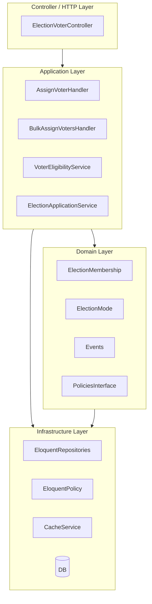
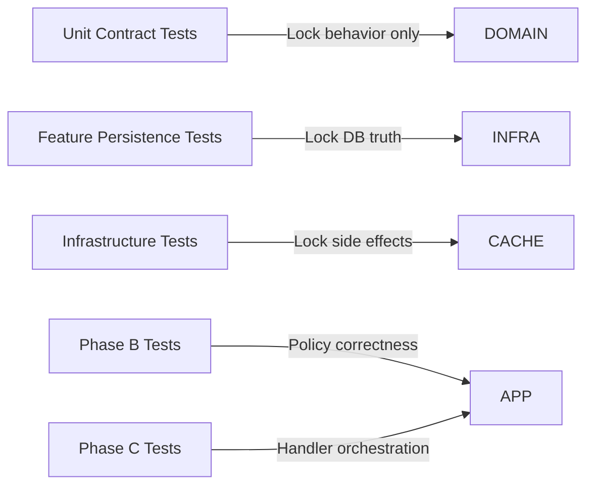
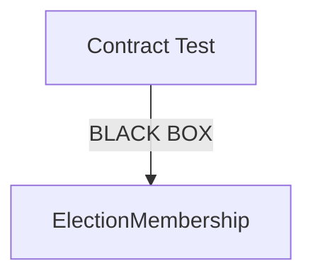
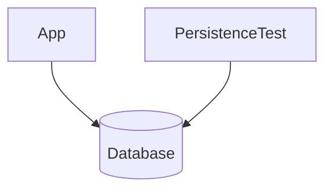
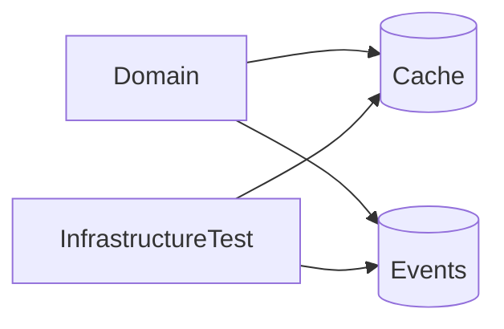
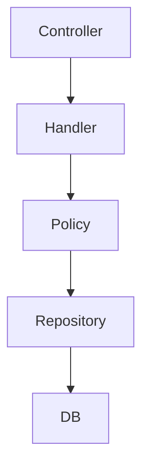
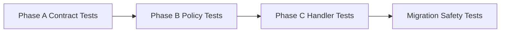

Below is a **DDD-oriented Test Boundary Map** specifically designed for your **Strangler Fig migration (Phase A → C)**. It clarifies *what each test layer is responsible for*, and more importantly, what it must **never own**.

---

# 🧭 Election Module — Test Boundary Map (DDD + Strangler Fig)

## 🧱 High-Level Architecture View



---

# 🧪 Test Boundary Map (Core Idea)



---

# 🧪 1. CONTRACT TEST LAYER (Phase A — Freeze Layer)

```text
tests/Unit/Contracts/*
```

## 🎯 Responsibility

> Lock **observable business behavior only**

### ✔ Allowed

* assignVoter creates membership
* inactive → active transition
* duplicate active throws
* bulk returns STRUCTURE ONLY
* current dependency on UserOrganisationRole exists

### ❌ Forbidden

* DB schema validation
* cache behavior
* scopes (eligible)
* policy logic
* SQL assumptions

---

## 🧠 Mental Model



👉 Think:

> “If I swap internal implementation completely, this test still tells me if behavior changed.”

---

# 🧪 2. PERSISTENCE TEST LAYER (DB Truth Layer)

```text
tests/Feature/Election/ElectionMembershipPersistenceTest.php
```

## 🎯 Responsibility

> Lock **database state correctness**

### ✔ Allowed

* record exists in DB
* soft delete behavior (current reality only)
* FK constraints (temporary Phase A reality)
* unique constraints (current schema)

### ❌ Forbidden

* business logic assertions
* eligibility rules
* cache validation
* handler behavior

---

## 🧠 Mental Model



👉 Think:

> “Is the database correctly storing what the system already decided?”

---

# 🧪 3. INFRASTRUCTURE TEST LAYER (Side Effects Layer)

```text
tests/Feature/Election/ElectionMembershipInfrastructureTest.php
```

## 🎯 Responsibility

> Lock **external effects only**

### ✔ Allowed

* cache invalidation
* event dispatch
* logging side effects

### ❌ Forbidden

* eligibility logic
* DB validation
* domain decisions

---

## 🧠 Mental Model



---

# 🧪 4. APPLICATION TEST LAYER (Phase B/C — Orchestration Layer)

```text
tests/Feature/Contexts/Elections/*
```

## 🎯 Responsibility

> Validate **workflow orchestration**

### ✔ Allowed

* handler executes correct steps
* policy used for decisioning
* repository interactions
* transaction boundaries

### ❌ Forbidden

* model behavior validation
* DB schema assertions
* cache internals

---

## 🧠 Mental Model



👉 Think:

> “Does the system execute the correct workflow?”

---

# 🧪 5. POLICY TEST LAYER (Phase B Core)

```text
tests/Feature/Contexts/Elections/Policy/*
```

## 🎯 Responsibility

> Validate **eligibility decision logic**

### ✔ Allowed

* qualifies() correctness
* qualifyingSubset correctness
* mode differences (ElectionOnly vs FullMembership)

### ❌ Forbidden

* assignment logic
* DB mutations
* cache behavior

---

# 🧪 6. MIGRATION SAFETY TEST LAYER (Phase C ONLY)

```text
tests/Feature/Election/MigrationSafety/*
```

## 🎯 Responsibility

> Ensure **Strangler migration correctness**

### ✔ Allowed

* old vs new path equivalence
* dual-write avoidance
* soft delete recovery
* idempotency correctness

---

# 🧭 FULL STRANGLER FLOW (How tests evolve)



---

# 🚨 Critical Architectural Rule (MOST IMPORTANT)

## ❗ NEVER MIX THESE RESPONSIBILITIES

| Layer          | Must NOT test     |
| -------------- | ----------------- |
| Contract       | DB, Cache, Policy |
| Persistence    | Business logic    |
| Infrastructure | Domain decisions  |
| Application    | Model internals   |

---

# 🧠 Final Mental Model (DDD Alignment)

### Contract Tests = “WHAT is true”

### Persistence Tests = “WHERE it is stored”

### Infrastructure Tests = “WHAT side effects happened”

### Application Tests = “HOW the system behaves”

### Policy Tests = “WHY a decision is made”

---

# 🟢 Why this matters for your migration

This boundary map guarantees:

### ✔ Phase A

You freeze behavior safely

### ✔ Phase B

You introduce policy without breaking contract tests

### ✔ Phase C

You extract model logic without test rewrites

### ✔ Final state

Model becomes:

> persistence-only aggregate root (not a service)

---
 now start working as senior software developer tdd first appraoch 