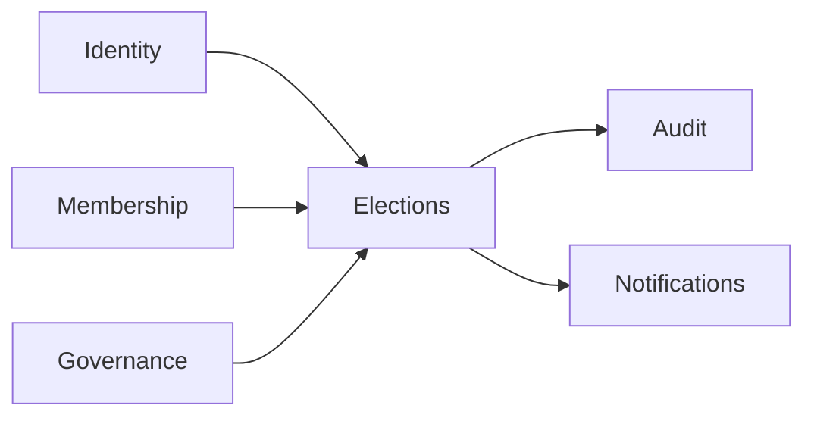
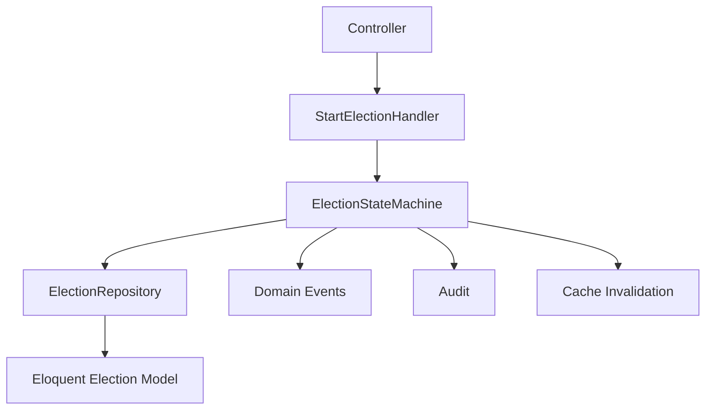
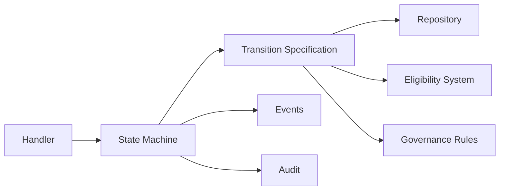

This is a strong migration outcome overall. The architecture has clearly evolved from an Active Record–centric model into a much healthier application/domain separation with explicit orchestration boundaries.

I would, however, pause before moving to Phase D features.

There are **three architectural verification passes** I strongly recommend before adding new capabilities.

---

# Current Architecture Assessment

## What is genuinely successful

You achieved several difficult transitions correctly:

### ✅ Strangler execution discipline

* Legacy behavior frozen first
* Parallel policy path introduced before extraction
* Incremental ownership transfer
* Deprecated model methods removed only after handler stabilization

That sequencing is correct.

---

### ✅ Domain/Application separation improved substantially

You now have:

| Concern                  | Owner                |
| ------------------------ | -------------------- |
| Eligibility decisions    | Policy/query service |
| Assignment orchestration | Handlers             |
| Integrity protection     | Guard service        |
| Persistence              | Repository           |
| Cache invalidation       | Cache service        |
| Bulk coordination        | Bulk handler         |
| Failure capture          | DLQ                  |

This is a major improvement over fat-model architecture.

---

### ✅ Election-only mode is now a real bounded capability

This is important.

Previously:

```text
Voting Rights == Membership System
```

Now:

```text
Voting Rights == Election Context Policy
```

That is a true domain decoupling.

---

# However — there are still 5 architectural risks

These are not failures.
They are the normal “Phase C residue” after a successful strangler migration.

You should clean them before feature expansion.

---

# 1. Biggest remaining risk:

# Policy layer is still query-oriented, not domain-oriented

Current naming:

```text
EloquentVoterEligibilityQueryService
```

This is already better than “policy God service,” but the architecture still smells slightly infrastructure-first.

---

## Problem

You currently have:

```text
Eligibility = query result
```

But domain-wise:

```text
Eligibility = domain decision
```

That distinction matters later when:

* constitutional rules evolve
* governance policies vary
* temporary overrides exist
* waivers exist
* voting windows exist
* sanctions exist
* delegated voting exists

---

# Recommendation

Before Phase D:

Introduce:

```text
EligibilityDecision
```

Example:

```php
final class EligibilityDecision
{
    public function __construct(
        public readonly bool $eligible,
        public readonly string $reason,
        public readonly array $evidence = [],
    ) {}
}
```

Then:

```php
$decision->eligible
$decision->reason
```

instead of raw booleans.

---

# 2. Handlers may become the next God layer

This is the next likely architectural danger.

You currently have:

* AssignVoterHandler
* BulkAssignVotersHandler

These are correct NOW.

But future phases may add:

* auditing
* governance workflows
* approvals
* vote issuance
* notifications
* quorum calculations
* dispute workflows

The risk:

```text
Handler = hidden transaction script monster
```

---

# Recommendation

Before Phase D:

Introduce explicit command objects:

```text
AssignVoterCommand
BulkAssignVotersCommand
```

and command/result separation.

---

# 3. Dead-letter queue needs lifecycle governance

Right now DLQ is operationally useful.

But architecturally incomplete.

---

## Missing:

### a) Replay policy

Who retries?
When?
How many times?

---

### b) Poison record classification

You need:

```text
TRANSIENT
PERMANENT
VALIDATION
INFRASTRUCTURE
```

---

### c) Observability

Right now DLQ is storage.

It should become:

```text
Operational Governance Surface
```

---

# 4. Repositories likely still leak Eloquent semantics

This almost always happens after Phase C.

Check for:

* QueryBuilder leakage
* Collection leakage
* eager-load assumptions
* pagination assumptions
* ORM-shaped return values

---

# Repository rule

Repositories should return:

* aggregates
* DTOs
* decisions
* value objects

NOT ORM behavior.

---

# 5. Missing bounded context map

This is the biggest strategic gap.

You now have emerging bounded contexts:

| Context       | Responsibility          |
| ------------- | ----------------------- |
| Elections     | voter assignment        |
| Governance    | constitutional rules    |
| Membership    | fee/member validity     |
| Identity      | organisation membership |
| Audit         | operational history     |
| Notifications | external communication  |

But the boundaries are still implicit.

---

# Recommendation before Phase D

Create:

# 🧭 Context Map Document

Something like:



And explicitly define:

* upstream/downstream
* ownership
* anti-corruption layers
* shared kernel rules

Without this, Phase D will slowly re-couple everything.

---

# What I would do next (recommended order)

## ✅ Recommended Immediate Next Phase

# Phase C.8 — Architectural Hardening Pass

Not features yet.

---

## Suggested tasks

### 1. Introduce EligibilityDecision

Priority: P0

---

### 2. Introduce command/result objects

Priority: P0

---

### 3. Create context map

Priority: P0

---

### 4. Repository purity audit

Priority: P1

---

### 5. DLQ governance model

Priority: P1

---

### 6. Event taxonomy review

Priority: P1

Right now events are likely still CRUD-ish.

You want progression toward:

* domain-significant events
* constitutional semantics
* governance semantics

---

# Only THEN proceed to Phase D

Because otherwise:

* dashboards
* analytics
* workflows
* governance UI

will hard-code transitional assumptions.

---

# Final Architectural Verdict

## Overall evaluation

| Area                          | Assessment                    |
| ----------------------------- | ----------------------------- |
| Strangler execution           | Excellent                     |
| Migration discipline          | Excellent                     |
| Boundary separation           | Strong                        |
| DDD maturity                  | Intermediate-advanced         |
| Future scalability            | Good                          |
| Governance modeling readiness | Emerging                      |
| Long-term semantic clarity    | Needs one more hardening pass |

---

# Recommendation

## Do NOT jump directly into features.

Do:

# ✅ Phase C.8 — Semantic Hardening & Context Stabilization

That is the highest-leverage move right now.
Your instinct is correct: the election state machine is now the highest-risk operational gap.

The voter assignment migration stabilized the **membership/eligibility side**, but the **governance lifecycle side** is still structurally weak. If election transitions are inconsistent, then:

* voting windows become unreliable,
* audit history becomes ambiguous,
* quorum timing becomes invalid,
* result publication becomes unsafe,
* and future constitutional governance rules cannot be trusted.

So yes — this should move ahead of Phase C.8 hardening.

However, I would refine the proposed approach slightly, because there is one architectural danger in the current proposal:

> creating a new “Election aggregate” while legacy Eloquent `Election` still exists can accidentally create a dual-model system.

That can become dangerous if not staged carefully.

---

# Correct Priority Order

## Revised order

```yaml
Phase C.9:
  Election Lifecycle State Machine Refactor

Phase C.9.5:
  Event Semantics + Audit Stabilization

Phase C.8:
  Semantic Hardening

Phase D:
  Advanced Governance + UX
```

This sequence is safer.

---

# Why State Machine First Is Correct

Your system now has two major bounded concerns:

| Concern                        | Status     |
| ------------------------------ | ---------- |
| Voter eligibility & assignment | Stabilized |
| Election lifecycle governance  | Fragile    |

The lifecycle side is more critical because it governs:

* when voting opens,
* when voting closes,
* whether votes are valid,
* and whether constitutional timing rules are enforceable.

This is effectively your:

# “Governance Transaction Boundary”

So fixing it now is strategically correct.

---

# But do NOT jump immediately to a “pure aggregate rewrite”

That is the only part I would adjust.

---

# Recommended Architecture

Instead of immediately creating:

```text
Domain/Election.php
```

do this in two stages.

---

# Stage 1 — Stabilize transitions around existing model

This is the safest strangler-compatible move.

## Create:

```text
ElectionLifecycleManager
```

or

```text
ElectionStateMachine
```

inside:

```text
app/Contexts/Elections/Application/
```

NOT domain aggregate yet.

---

# Why?

Because right now:

* controllers,
* repositories,
* events,
* policies,
* caches,
* legacy UI

still depend on Eloquent Election behavior.

If you introduce a competing aggregate too early, you risk:

* duplicated invariants,
* state desynchronization,
* hidden transition paths,
* event inconsistencies.

---

# Recommended Transitional Architecture

## Phase C.9 (safe version)



This keeps:

* one persistence source,
* one transition engine,
* one write path.

That matches your successful voter-assignment migration pattern.

---

# The Real Missing Piece

Your system currently lacks:

# Transition Authority

Right now status is likely:

```php
$election->status = 'active';
```

from random places.

That must end completely.

---

# Golden Rule

After Phase C.9:

## ONLY handlers may transition election state.

Never:

* controllers,
* policies,
* repositories,
* models,
* commands,
* listeners.

---

# Strong Recommendation:

# Use Explicit Transition Methods

Not generic setters.

---

## GOOD

```php
$stateMachine->start($election);
$stateMachine->close($election);
$stateMachine->archive($election);
```

---

## BAD

```php
$election->status = 'closed';
```

---

# Add Transition Validation Matrix

This becomes your constitutional governance core.

Example:

| From     | To       | Allowed |
| -------- | -------- | ------- |
| draft    | active   | ✅       |
| active   | closed   | ✅       |
| closed   | archived | ✅       |
| active   | draft    | ❌       |
| archived | anything | ❌       |

---

# Add Preconditions (VERY important)

Your lifecycle should not only validate transitions.

It must validate:

# governance readiness.

---

## Example

### `draft → active`

Must verify:

* election has candidates
* election has eligible voters
* start/end dates valid
* no overlapping active election
* quorum config exists

---

### `active → closed`

Must verify:

* voting window expired OR manual override
* tally finalized
* no pending vote batches

---

### `closed → archived`

Must verify:

* results published
* audit finalized
* disputes resolved (future)

---

# This is NOT just a state machine

It is:

# Governance Process Enforcement

That distinction matters enormously.

---

# Recommended Components

## 1. ElectionState enum

Correct and necessary.

---

## 2. ElectionStateMachine

Core orchestrator.

Responsible for:

* allowed transitions
* invariant enforcement
* event dispatch
* audit hooks

---

## 3. TransitionSpecification classes (recommended)

Example:

```text
CanStartElection
CanCloseElection
CanArchiveElection
```

These become composable governance rules.

---

# Example architecture



---

# Biggest Future Benefit

This architecture later enables:

* constitutional overrides,
* emergency election suspension,
* judicial review,
* delegated authority,
* approval workflows,
* multi-stage governance.

Without rewriting again.

---

# Recommendation for immediate implementation

## Start with:

### Step 1

```text
ElectionState enum
```

### Step 2

```text
ElectionTransitionMatrix
```

### Step 3

```text
ElectionStateMachine service
```

### Step 4

```text
StartElectionHandler
```

Do NOT build a full aggregate yet.

---

# Final Verdict

## ✔ I strongly approve refactoring the election state machine NOW.

But with one modification:

### ❌ Avoid immediate aggregate replacement

### ✅ Introduce controlled lifecycle orchestration first

This preserves:

* strangler discipline,
* single write authority,
* migration safety,
* audit consistency,
* future governance extensibility.

That is the safest architectural move at your current maturity stage.

