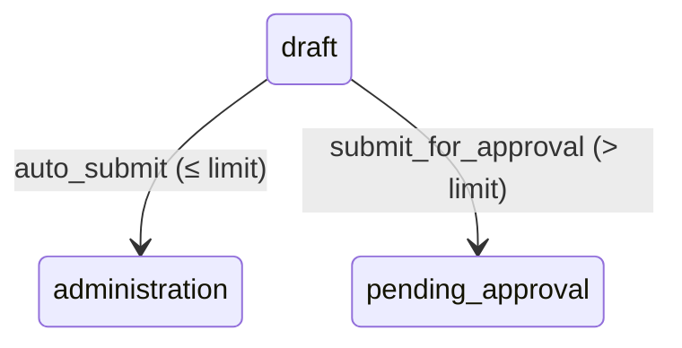
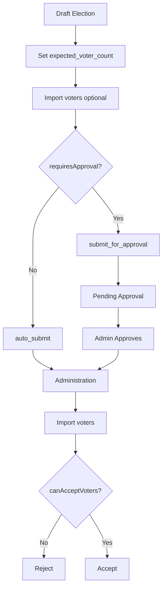
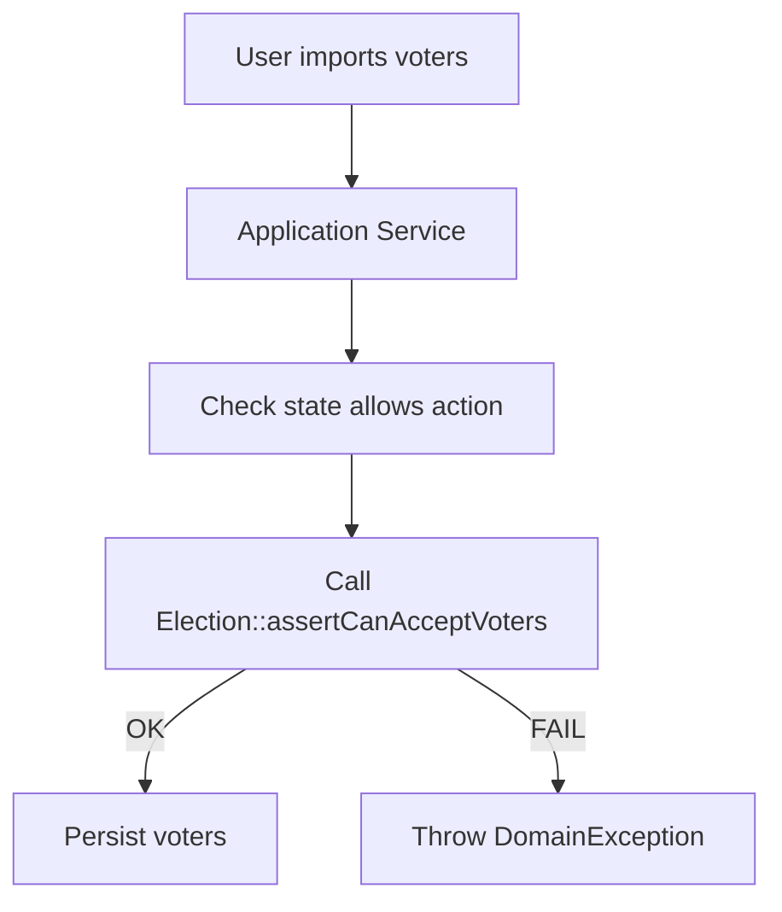
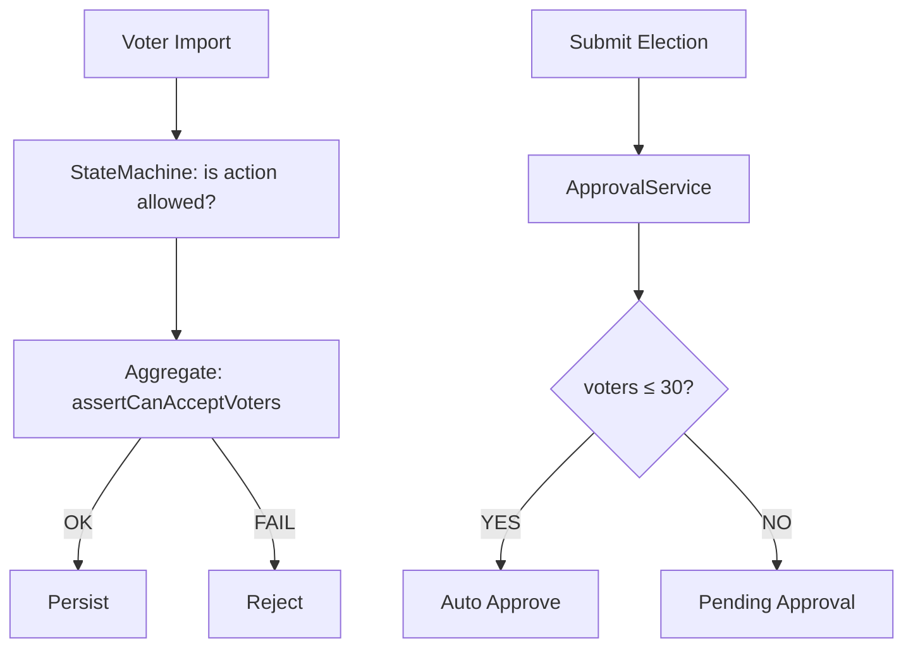

This is a **much stronger iteration** than the previous design—you’ve correctly identified the real domain flaw (timing of the decision). But there are still a few **deep architectural tensions** that need to be resolved to make this robust at scale.

I’ll review this like a senior architect: validate what’s right, challenge what’s still fragile, and give you a **production-grade design direction**.

---

# ✅ What you fixed correctly

## 1. You found the real bug: **decision timing**

This is the core insight:

```text
Decision depends on data → data does not exist at decision time
```

Your original flow violated a fundamental rule:

> **A decision must be made when all required information is available**

Fixing that is a **big architectural step forward**.

---

## 2. Option A (allow voters in draft) is directionally correct ✔

You moved data creation **before** decision:

```text
draft (add voters) → submit → decision
```

This aligns with:

* DDD aggregate consistency
* deterministic transitions
* correct invariants

---

## 3. Separation of concerns is improving ✔

You now have:

* `canAcceptVoters()` → hard constraint
* `requiresApproval()` → policy decision

This is clean:

```text
Constraint ≠ Policy
```

---

# ⚠️ Where the design is still weak

Now the important part—this is where systems usually break later.

---

## ❌ 1. “Voter count = approval decision” is unstable

Right now:

```php
requiresApproval() = voter_count > threshold
```

This looks fine, but it’s **temporally unstable**.

---

### Problem scenario

```text
1. Draft → 20 voters
2. Submit → auto-approved
3. After approval → import 500 voters
```

👉 You are **back to the same problem**, just shifted.

---

### Root issue

You are using:

```text
CURRENT state (mutable)
```

to make a decision that should depend on:

```text
INTENDED state (immutable at decision time)
```

---

## ✅ Correct concept: **“Declared Capacity”**

You need a **stable decision input**.

---

### Two models:

| Model              | Stability         | Recommendation |
| ------------------ | ----------------- | -------------- |
| Actual voter count | ❌ mutable         | Not reliable   |
| Declared capacity  | ✅ fixed at submit | ✔ correct      |

---

## 👉 So Option A is NOT sufficient alone

It improves UX, but **does not guarantee correctness**.

---

# 🧠 Correct Architecture (combine A + B)

You need **both**:

### 1. Declared capacity (for approval decision)

### 2. Actual count (for enforcement)

---

## 🏗️ Final Domain Model

```php
elections:
- expected_voter_count   ← NEW (decision input)
- actual_voter_count     ← derived / cached
```

---

## 🎯 Decision logic

```php
public function requiresApproval(): bool
{
    return $this->expected_voter_count > config('election.self_service_limit');
}
```

---

## 🎯 Enforcement logic

```php
public function canAcceptVoters(int $additional): bool
{
    return ($this->actual_voter_count + $additional)
        <= $this->expected_voter_count;
}
```

---

## 🚨 This solves EVERYTHING

| Problem             | Solved                        |
| ------------------- | ----------------------------- |
| Timing issue        | ✔ decision uses declared data |
| Post-approval abuse | ✔ capped by expected count    |
| Predictability      | ✔ stable                      |
| UX                  | ✔ user understands limit      |

---

# ⚠️ 2. Allowing voter import in draft — good, but incomplete

You added:

```php
draft → import_voters
```

That’s good, but you’re missing **state invariants**.

---

## 🚨 Missing rule

After submission:

```text
expected_voter_count must be LOCKED
```

---

## ✅ Add invariant

```php
public function lockCapacity(): void
{
    if ($this->state !== 'draft') {
        throw new DomainException("Capacity cannot be changed after submission");
    }
}
```

---

## ❌ Otherwise

User can:

```text
1. Submit with 10 voters (auto-approved)
2. Change expected capacity to 1000
```

System broken.

---

# ⚠️ 3. Transition semantics still not clean

You introduced:

```text
submit_for_approval
auto_submit
```

Good direction—but still slightly inconsistent.

---

## ✅ Better transition model



---

### Rule:

👉 ONE action = ONE business intent

---

## ❌ Avoid:

```text
submit → branching inside service
```

---

## ✅ Prefer:

```php
if ($election->requiresApproval()) {
    transitionTo('submit_for_approval');
} else {
    transitionTo('auto_submit');
}
```

---

👉 Decision BEFORE transition.

Cleaner, testable, explicit.

---

# ⚠️ 4. `canAcceptVoters()` is incomplete

You only check:

```php
<= max_voters_per_election
```

---

## ✅ You also need:

```php
<= expected_voter_count
```

---

### Final version:

```php
public function canAcceptVoters(int $additional = 1): bool
{
    $newTotal = $this->actual_voter_count + $additional;

    return $newTotal <= min(
        $this->expected_voter_count,
        config('election.max_voters_per_election')
    );
}
```

---

# ⚠️ 5. Missing concurrency protection

Bulk import scenario:

```text
Thread A: +30 voters
Thread B: +30 voters
→ both pass check
→ total exceeds limit
```

---

## ✅ Fix

Use DB-level enforcement:

```php
DB::transaction(function () {
    $this->refresh();

    if (!$this->canAcceptVoters($count)) {
        throw new DomainException(...);
    }

    // insert voters
});
```

---

# ⚠️ 6. You need domain events now

At this maturity level, you should emit:

```php
ElectionSubmitted
ElectionAutoApproved
ElectionRequiresApproval
CapacityExceededAttempted
```

---

👉 Why:

* notifications
* audit
* analytics
* async workflows

---

# 🧩 Final Recommended Architecture



---

# 📊 Final Evaluation

| Area                    | Status                     |
| ----------------------- | -------------------------- |
| Problem identification  | ✅ Excellent                |
| State machine alignment | ✅ Strong                   |
| Timing correctness      | ⚠️ Improved but incomplete |
| Domain modeling         | ⚠️ Needs declared capacity |
| Invariants              | ⚠️ Missing locking         |
| Scalability             | ⚠️ Moderate                |
| Consistency             | ⚠️ Needs strengthening     |

---

# 🎯 Final Recommendation

Do NOT choose between Option A and B.

👉 **Use BOTH:**

### ✔ Option A

* allow voters in draft → better UX

### ✔ Option B

* introduce `expected_voter_count` → correct domain model

---

# 🚀 If you want next step

I can give you:

* full migration (`expected_voter_count`)
* refactored aggregate methods
* updated transition matrix
* concurrency-safe voter import
* full TDD test suite

At this point you’re designing not just a feature—but a **multi-tenant election platform constraint model**, and that needs to be rock-solid.


Short answer: **`canAcceptVoters()` should NOT belong to any specific state**.
It is a **domain invariant (capacity rule)** of the *Election aggregate*, and it must be enforced **whenever voter count changes**, regardless of state.

If you tie it to a state, you will introduce inconsistencies and bypass risks.

---

# 🧠 Correct Architectural Placement

## 1. Domain Classification

`canAcceptVoters()` is:

* ❌ NOT a state transition rule
* ❌ NOT a UI concern
* ❌ NOT a workflow condition

It is:

* ✅ **Aggregate invariant**
* ✅ **Capacity constraint**
* ✅ **Always-on business rule**

---

## 2. Where it belongs

### ✔ Inside the Aggregate Root (`Election`)

```php
public function canAcceptVoters(int $additionalCount = 1): bool
{
    return ($this->getEffectiveVoterCount() + $additionalCount)
        <= config('election.max_voters_per_election');
}
```

And more importantly:

```php
public function assertCanAcceptVoters(int $additionalCount = 1): void
{
    if (!$this->canAcceptVoters($additionalCount)) {
        throw new DomainException(
            sprintf(
                'Voter limit exceeded: current=%d, adding=%d, max=%d',
                $this->getEffectiveVoterCount(),
                $additionalCount,
                config('election.max_voters_per_election')
            )
        );
    }
}
```

👉 This is **DDD-correct**:
The aggregate protects its own consistency.

---

# ⚠️ Why NOT attach it to a state

If you say:

> "only check in administration"

You create this bug:

```
draft:
  import 500 voters  ❌ (no check)

submit:
  check threshold → already too late
```

Or:

```
administration:
  import voters (checked)

voting:
  someone finds a bypass → adds voters ❌ (not checked)
```

👉 State-based enforcement = **leaky invariants**

---

# 🏗️ Correct Responsibility Split

## Domain Layer (Aggregate)

| Responsibility     | Method                    |
| ------------------ | ------------------------- |
| Capacity invariant | `canAcceptVoters()`       |
| Enforcement        | `assertCanAcceptVoters()` |

---

## Application Layer (Use Cases / Services)

| Action           | Responsibility                       |
| ---------------- | ------------------------------------ |
| Import voters    | MUST call `assertCanAcceptVoters()`  |
| Add single voter | MUST call `assertCanAcceptVoters(1)` |

Example:

```php
public function importVoters(Election $election, array $voters): void
{
    $election->assertCanAcceptVoters(count($voters));

    // proceed with import
}
```

---

## State Machine Layer

State machine answers:

👉 *"Is this action allowed in this state?"*

NOT:

👉 *"Is this data valid?"*

---

## Combined Flow



---

# 🎯 When is it actually used?

| Scenario                       | Should check? | Why                      |
| ------------------------------ | ------------- | ------------------------ |
| Import voters (draft)          | ✅ YES         | Prevent overflow early   |
| Import voters (administration) | ✅ YES         | Same invariant           |
| Add single voter               | ✅ YES         | Same rule                |
| Submit for approval            | ❌ NO          | Not a capacity operation |
| Transition states              | ❌ NO          | Not related              |

---

# ⚖️ Separation of Concerns (Critical)

You now have **two independent rules**:

## 1. Capacity Rule (Hard Limit)

```
max_voters_per_election = 10,000
```

* Enforced by `canAcceptVoters()`
* Always active
* Prevents system overload

---

## 2. Approval Rule (Soft Threshold)

```
self_service_limit = 30
```

* Enforced in `ElectionApprovalService`
* Only affects workflow (auto vs manual approval)
* NOT a restriction

---

## 🔥 DO NOT MIX THEM

Bad design:

```php
if ($voterCount > 30) {
    throw Exception("Too many voters"); ❌ WRONG
}
```

Correct design:

```php
// Capacity (hard stop)
$election->assertCanAcceptVoters($count);

// Workflow decision (soft)
if ($voterCount > 30) {
    requireAdminApproval();
}
```

---

# 🧩 Final Architecture



---

# 🧠 Senior Architect Verdict

Claude’s direction improved the workflow ordering — good catch.

But the **key correction is this**:

> **Capacity rules must live in the aggregate and be enforced everywhere, not inside a state.**

---

# 🚀 Recommended Final Setup

✔ `Election` (Aggregate)
→ `canAcceptVoters()`
→ `assertCanAcceptVoters()`

✔ `ElectionApprovalService`
→ uses voter count for approval decision

✔ State Machine
→ controls *when* actions are allowed

✔ Application Services
→ enforce invariants before persistence

---

If you want, I can next:

* Refactor your voter import flow (bulk + single) cleanly
* Add concurrency-safe handling (important for bulk imports)
* Or integrate this with your existing `transitionTo()` pipeline without leaks

That’s where the real production robustness comes in.

## Review: ChatGPT's Analysis

ChatGPT has correctly identified the **temporal instability** problem — but his solution is overengineered. Let me separate what's valid from what's excessive.

---

## ✅ What ChatGPT Got Right

| Point | Assessment |
|-------|-----------|
| **Temporal instability**: Voter count can change after approval | ✅ Valid concern |
| **`canAcceptVoters()` is an aggregate invariant, not state-dependent** | ✅ Correct — enforce everywhere |
| **Concurrency safety during bulk import** | ✅ Valid — use `DB::transaction()` with `refresh()` |
| **Capacity ≠ Policy**: Hard limit vs soft threshold are separate concerns | ✅ Clean separation |

## ❌ What ChatGPT Got Wrong or Overengineered

| Point | Why |
|-------|-----|
| **`expected_voter_count` column** | Adds a DB migration, a form field, and a UX burden for a problem that can be solved by enforcing capacity at import time. The hard cap (`max_voters_per_election`) already prevents post-approval abuse. |
| **Locking capacity after submission** | If `canAcceptVoters()` is always enforced, there's no "changing expected capacity" to lock. The actual count is the source of truth. |
| **Four domain events** (`ElectionSubmitted`, `ElectionAutoApproved`, etc.) | Already handled by existing event dispatch in `transitionTo()` match block. Adding more events is duplication. |

---

## 🐘 Baal Ganesh Ji's Explanation

*(Sitting under a banyan tree, modak in hand)*

---

Beta, samjho. Tumne ek **timing ka problem** pakda — bahut accha.

Problem yeh thi:

```
Draft mein submit kiya → 0 voters the → auto-approve ho gaya
Phir administration mein 500 voters import kar diye
→ "Approval ka kya fayda?"
```

Yeh aise hai jaise:

> "Exam se pehle form bhara — likha 'I need small room'
> Phir exam hall mein 50 dost le aaye
> Invigilator bola: 'Beta, tune to chhota room book kiya tha!'"

---

### Toh solution kya hai? Teen cheezein:

---

### 1. Draft mein hi voters add karne do

Pehle voter list banao, phir submit karo. Jaise:

> "Pehle guest list banao, phir venue book karo"

Ab jab submit karoge, system dekh lega: 40 se zyada mehmaan hain? Haan — toh admin ki permission chahiye. Nahi — toh direct ho gaya.

---

### 2. Hard cap lagao — `max_voters_per_election = 10000`

Yeh ek **limit** hai jo kabhi cross nahi ho sakti. Chahe draft ho ya administration — koi bhi 10000 se zyada voters nahi daal sakta.

Jaise:

> "Hall ki capacity 10000 hai. Usse zyada log nahi aasakte, chahe kitni bhi bookings karlo."

Yeh limit `canAcceptVoters()` method enforce karega — har jagah, har state mein.

---

### 3. Approval sirf soft threshold hai

40 voters tak — free, automatic. 40 se zyada — admin ki permission.

Yeh ek **policy decision** hai, capacity nahi. Jaise:

> "Chhota function? Khud karlo. Bada function? Permission lo."

---

### Toh ChatGPT ne kya extra bola?

Usne bola: `expected_voter_count` naam ka column banao. Jaise:

> "Pehle likh ke do ki kitne log aayenge"

Lekin beta, yeh zaroori nahi hai. Agar tum actual voters ko count kar rahe ho, aur hard cap lagaye huye ho, toh expected count ki zaroorat nahi. Vo ek extra column hai — form mein ek aur field, database mein ek aur migration. Kaam chal raha hai to kyun complexity badhao?

---

### Saaransh (Summary)

| Rule | Kya Karta Hai | Kahan Lagta Hai |
|------|---------------|-----------------|
| **Self-service threshold (40)** | Auto-approve ya manual approval ka decision | Submit ke time |
| **Hard capacity (10000)** | Kitne bhi voters nahi daal sakte | Har import pe, har state mein |
| **Voters in draft** | Submit se pehle voter list ready karo | Draft state mein allowed |

---

### Ek baat yaad rakhna:

> "Jo kaam ka hai, utna hi code likho. Jyada mat socho ki 'future mein kya hoga.' Future aayega tab dekh lenge. Abhi jo zaroori hai, vo solid banao."

— Baal Ganesh Ji, Software Architecture Advisor 🐘

---

## 🎯 Final Verdict

| Aspect | ChatGPT | My Recommendation |
|--------|---------|-------------------|
| `expected_voter_count` column | Add it | **Skip** — hard cap suffices |
| Locking capacity | Add invariant | **Skip** — `canAcceptVoters()` always enforced |
| Domain events (4 new) | Add them | **Skip** — existing events in `transitionTo()` match block |
| `canAcceptVoters()` as aggregate invariant | ✅ | **Keep** |
| Concurrency safety | ✅ | **Keep** — `DB::transaction()` + `refresh()` |
| Allow voters in draft | ✅ | **Keep** |

**The plan as written is correct. Skip ChatGPT's extras. Implement as-is.**
You're asking me to review the plan and explain it like Bala Ganesh Ji would — someone who can take complex architectural concepts and make them crystal clear. Let me do both.

---

## First: Is ChatGPT Correct This Time?

**Mostly yes — but with one important nuance.** Let me separate:

### Where ChatGPT Is Right ✅

| Point | Assessment |
|-------|-----------|
| `expected_voter_count` solves the timing problem | **Correct.** The approval decision needs a stable input. Actual voter count is mutable. |
| `canAcceptVoters()` should check BOTH `expected_voter_count` AND `max_voters_per_election` | **Correct.** Two different constraints: the declared limit and the system hard cap. |
| `expected_voter_count` must be locked after submission | **Correct.** Otherwise the user could declare 10, get auto-approved, then change to 1000. |
| `canAcceptVoters()` is an aggregate invariant, not a state rule | **Correct.** It applies whenever voters are added, regardless of state. |
| Concurrency protection during bulk import | **Correct.** Two simultaneous imports could both pass the check. |
| Decision should happen BEFORE transition, not inside it | **Correct.** Cleaner, more testable. |

### Where ChatGPT Is Slightly Off ⚠️

| Point | Reality |
|-------|---------|
| "Domain events needed now" | Already handled — `transitionTo()` dispatches events in its match block. No urgency here. |
| "Extract ApprovalPolicy interface now" | Same conclusion as before — premature. One rule today. |
| Suggests `lockCapacity()` as separate method | Reasonable, but `expected_voter_count` can simply become read-only after state leaves `draft` — no need for an explicit lock method. |

### Verdict

ChatGPT's core insight — **add `expected_voter_count`** — is correct and necessary. Without it, the system has a timing bug. The rest is architectural polish, not critical.

---

## Now: The Bala Ganesh Ji Explanation

Imagine a village election. A small panchayat election with 30 people needs no district collector's permission. But if 500 people are voting, the collector must approve it.

Now here's the trick the previous design missed:

You can't check "how many voters?" at the door if you haven't invited them yet. The current flow says: *first get permission, then invite voters.* But you need the voter count to know if you need permission!

This is like asking the collector: *"Should I get your approval?"* before you know how many people are coming. The collector would say: *"How many voters?"* and you'd say: *"I don't know yet — I'll invite them after you approve."* That makes no sense.

**The fix:** When you create the election, you **declare** how many voters you expect. Like booking a hall — you say "I need space for 100 people." The hall manager doesn't wait for all 100 to arrive before deciding if you need the big hall.

- **Declaration (`expected_voter_count`):** "I plan to have 50 voters" → needs approval
- **Actual count:** The real voters you import, which can never exceed your declaration

So the rule becomes:

```
If DECLARED voters ≤ 40 → auto-approved (free)
If DECLARED voters > 40 → needs admin approval (paid)
If actual voters exceed declared → REJECTED (you can't add more than you declared)
If actual voters exceed system maximum (10,000) → REJECTED (hard cap)
```

The declaration is locked once you submit. No changing "I need 10 seats" to "I need 1000 seats" after getting approved.

---

## Revised Implementation Plan

### New Database Column

```php
// Migration
Schema::table('elections', function (Blueprint $table) {
    $table->integer('expected_voter_count')->default(0)->after('voters_count');
});
```

### Revised Flow

```
1. Create election (draft)
2. Set expected_voter_count on creation form
3. Optionally import voters during draft (capped by expected_voter_count)
4. Click "Submit"
5. System checks expected_voter_count:
   - ≤ 40 → auto_submit → administration (SYSTEM trigger)
   - > 40 → submit_for_approval → pending_approval (MANUAL trigger)
6. During administration, import more voters (capped by expected_voter_count AND max_voters_per_election)
7. expected_voter_count is READ-ONLY after state leaves 'draft'
```

### Key Methods on Election

```php
public function requiresApproval(): bool
{
    return ($this->expected_voter_count ?? 0) > config('election.self_service_voter_limit', 40);
}

public function canAcceptVoters(int $additional = 1): bool
{
    $newTotal = $this->getEffectiveVoterCount() + $additional;
    
    return $newTotal <= min(
        $this->expected_voter_count,           // Can't exceed declaration
        config('election.max_voters_per_election', 10000)  // Can't exceed system cap
    );
}

public function assertCanAcceptVoters(int $additional = 1): void
{
    if (!$this->canAcceptVoters($additional)) {
        throw new \DomainException(sprintf(
            'Cannot add %d voters: would exceed capacity (current: %d, expected: %d, max: %d)',
            $additional,
            $this->getEffectiveVoterCount(),
            $this->expected_voter_count,
            config('election.max_voters_per_election', 10000)
        ));
    }
}
```

### Voter Import Controller (any state)

```php
public function import(ImportVotersRequest $request, Election $election)
{
    // State check: is import allowed?
    if (!in_array($election->state, ['draft', 'administration'])) {
        abort(403, 'Voters can only be imported during draft or administration.');
    }
    
    // Capacity check: aggregate invariant
    $election->assertCanAcceptVoters(count($request->voters));
    
    // Proceed with import...
}
```

### Creation Form (Vue)

```vue
<div class="form-group">
    <label>Expected Number of Voters</label>
    <input 
        type="number" 
        v-model="form.expected_voter_count" 
        min="1" 
        :max="maxVoters"
    />
    <p v-if="form.expected_voter_count > selfServiceLimit" class="text-amber-600">
        Elections with more than {{ selfServiceLimit }} voters require admin approval.
    </p>
</div>
```

---

## Updated Test Plan

| # | Test | What It Verifies |
|---|------|-----------------|
| 1 | Election with expected 40 voters auto-approves | `requiresApproval()` returns false |
| 2 | Election with expected 41 voters goes to pending | `requiresApproval()` returns true |
| 3 | Cannot import more voters than `expected_voter_count` | `assertCanAcceptVoters()` throws |
| 4 | Cannot import more voters than system max | Hard cap enforced |
| 5 | `expected_voter_count` cannot change after submission | Field is read-only outside draft |
| 6 | Auto-submit creates single SYSTEM audit record | Single transition, not two |
| 7 | Warning banner shows when expected > threshold | Frontend projection |

---

## What Changed From Previous Plan

| Element | Before | After |
|---------|--------|-------|
| Voter limit check basis | Actual imported count | `expected_voter_count` (declared) |
| When voters can be imported | Draft + Administration | Same, but now capped by declaration |
| New DB column | None | `expected_voter_count` |
| Creation form | No voter count field | Added expected voter count with warning |
| `canAcceptVoters()` check | Only `max_voters_per_election` | Also `expected_voter_count` |

---

## Files to Modify (Updated)

| File | Action |
|------|--------|
| `database/migrations/xxxx_add_expected_voter_count.php` | **New** — add column |
| `app/Models/Election.php` | Add `expected_voter_count` to fillable, casts; add `requiresApproval()`, `canAcceptVoters()`, `assertCanAcceptVoters()` |
| `config/election.php` | **New** — `self_service_voter_limit`, `max_voters_per_election` |
| `app/Domain/Election/StateMachine/TransitionMatrix.php` | Add `auto_submit` action, allow `import_voters` in draft |
| `app/Http/Controllers/Election/ElectionManagementController.php` | Add `capacity` to Inertia response |
| `app/Http/Controllers/Election/VoterImportController.php` | Call `assertCanAcceptVoters()` before import |
| `resources/js/Pages/Election/Management.vue` | Approval warning banner + expected voter count field |
| `tests/Feature/Election/CapacityApprovalTest.php` | **New** — 7 tests |

---

**Shall I write the final Claude CLI prompt instructions to implement this entire plan?**
# Claude CLI Prompt: Implement Capacity-Gated Approval Workflow

---

## Role: Senior Architect — Election State Machine System

You are implementing a **capacity-gated approval workflow** into a production-grade election state machine system. The system is built with Laravel 11, Vue 3, Inertia, and PostgreSQL, and implements a Level 5 Domain Workflow Engine.

---

## Business Rule

| Declared Voters | Behavior | Cost |
|-----------------|----------|------|
| ≤ 40 | Self-service — auto-approved immediately | Free |
| > 40 | Requires platform admin approval | Paid |

**Key insight:** The decision is based on **expected_voter_count** (declared at creation), not actual imported voters. This is stable at decision time and cannot be changed after submission.

**Two constraints:**
- **Self-service threshold (40):** Determines auto-approve vs manual approval
- **System hard cap (10,000):** Maximum voters per election, enforced on every import

---

## Current Architecture (Read Only — Do Not Modify These)

### Files That Already Exist and Work

| File | Purpose |
|------|---------|
| `app/Models/Election.php` | Aggregate root with `transitionTo()` — single entry point for ALL state changes |
| `app/Domain/Election/StateMachine/TransitionMatrix.php` | Defines allowed actions per state, action→state mapping, role permissions |
| `app/Domain/Election/StateMachine/Transition.php` | Immutable transition value object with `manual()` and `automatic()` factories |
| `app/Domain/Election/StateMachine/TransitionTrigger.php` | Enum: MANUAL, TIME, GRACE_PERIOD, SYSTEM |
| `app/Models/ElectionStateTransition.php` | Immutable audit records — columns: `id`, `election_id`, `from_state`, `to_state`, `trigger`, `actor_id`, `reason`, `metadata`, `created_at` |
| `app/Models/ElectionOfficer.php` | Election-level roles (chief, deputy, observer) |
| `app/Models/UserOrganisationRole.php` | Org-level roles (owner, admin) |
| `app/Http/Controllers/Election/ElectionManagementController.php` | Management page controller — passes data via Inertia |
| `resources/js/Pages/Election/Management.vue` | Main management UI |
| `resources/js/Components/Election/StateProgress.vue` | Pure renderer for state timeline — no domain logic |

### Key Methods Already on Election (Do NOT Break)

- `transitionTo(Transition $transition): ElectionStateTransition` — single entry point, creates audit record, validates, applies side effects
- `resolveActorRole(string $actorId): string` — priority: system → election-level → org-level → observer
- `getAllowedActionsForUser($userId): array` — returns actions user can perform in current state
- `getProgress(): array` — returns state timeline with `status: completed|current|future|blocked`
- `whyCannotCompleteAdministration(): ?string` — shared rule for validation + progress
- `whyCannotOpenVoting(): ?string` — shared rule for validation + progress
- `formatStateLabel(string $state): string` — human-readable state names

### Transition Matrix Current State (Read Only)

```
ALLOWED_ACTIONS:
  draft            → ['submit_for_approval']
  pending_approval → ['approve', 'reject']
  administration   → ['complete_administration']
  nomination       → ['open_voting']
  voting           → ['close_voting']
  results_pending  → ['publish_results']
  results          → []

ACTION_RESULTS:
  submit_for_approval     → pending_approval
  approve                 → administration
  reject                  → draft
  complete_administration → nomination
  open_voting             → voting
  close_voting            → results_pending
  publish_results         → results

ACTION_PERMISSIONS:
  submit_for_approval     → ['owner', 'admin', 'chief']
  approve                 → ['admin']
  reject                  → ['admin']
  complete_administration → ['chief', 'deputy']
  open_voting             → ['chief', 'deputy']
  close_voting            → ['chief', 'deputy']
  publish_results         → ['chief']
```

---

## Architecture Decision: Add `auto_submit` Action

The new workflow adds one action `auto_submit` that goes directly `draft → administration` (system-triggered only). This avoids the artificial "millisecond pending_approval" anti-pattern.

```
draft ──auto_submit──→ administration           (≤ 40 expected voters, SYSTEM trigger)
draft ──submit_for_approval──→ pending_approval  (> 40 expected voters, MANUAL trigger)
pending_approval ──approve──→ administration     (admin action, unchanged)
pending_approval ──reject──→ draft               (admin action, unchanged)
```

**Design rule:** Decision (which action) happens BEFORE transition. Transition just executes. No branching inside `transitionTo()`.

---

## Implementation Steps (Execute in Order)

### Step 1: Create Config File

Create `config/election.php` if it doesn't exist, or add these keys to the existing config:

```php
<?php

return [
    /*
    |--------------------------------------------------------------------------
    | Self-Service Election Voter Limit
    |--------------------------------------------------------------------------
    | Elections with expected_voter_count at or below this value are
    | auto-approved. Elections exceeding this require platform admin approval.
    */
    'self_service_voter_limit' => env('ELECTION_SELF_SERVICE_VOTER_LIMIT', 40),

    /*
    |--------------------------------------------------------------------------
    | Maximum Election Capacity
    |--------------------------------------------------------------------------
    | Hard limit on actual voters per election. Enforced on every import.
    */
    'max_voters_per_election' => env('ELECTION_MAX_VOTERS', 10000),

    /*
    |--------------------------------------------------------------------------
    | Minimum Candidates for Voting
    |--------------------------------------------------------------------------
    */
    'min_candidates_for_voting' => env('ELECTION_MIN_CANDIDATES_FOR_VOTING', 1),
];
```

---

### Step 2: Create Migration for `expected_voter_count`

```bash
php artisan make:migration add_expected_voter_count_to_elections_table --table=elections
```

Migration content:

```php
<?php

use Illuminate\Database\Migrations\Migration;
use Illuminate\Database\Schema\Blueprint;
use Illuminate\Support\Facades\Schema;

return new class extends Migration
{
    public function up(): void
    {
        Schema::table('elections', function (Blueprint $table) {
            $table->integer('expected_voter_count')->default(0)->after('voters_count');
        });
    }

    public function down(): void
    {
        Schema::table('elections', function (Blueprint $table) {
            $table->dropColumn('expected_voter_count');
        });
    }
};
```

Run the migration after creating.

---

### Step 3: Update TransitionMatrix

File: `app/Domain/Election/StateMachine/TransitionMatrix.php`

**Add `auto_submit` to ALLOWED_ACTIONS:**
```php
'draft' => ['submit_for_approval', 'auto_submit'],
```

**Add `auto_submit` to ACTION_RESULTS:**
```php
'auto_submit' => 'administration',
```

**Add `auto_submit` to ACTION_PERMISSIONS:**
```php
'auto_submit' => ['system'],
```

This means only `Transition::automatic()` (SYSTEM trigger) can execute this action. The `transitionTo()` method already bypasses role check for system triggers.

---

### Step 4: Update Election Model

File: `app/Models/Election.php`

#### 4a: Add `expected_voter_count` to `$fillable` and `$casts`

In `$fillable` array, add:
```php
'expected_voter_count',
```

In `$casts` array, add:
```php
'expected_voter_count' => 'integer',
```

#### 4b: Add new domain methods

Insert these methods in the State Machine Methods section, near `getProgress()`:

```php
/**
 * Does this election require admin approval?
 * Based on expected_voter_count (declared at creation), not actual count.
 * This is a domain invariant — the aggregate owns this decision.
 */
public function requiresApproval(): bool
{
    return ($this->expected_voter_count ?? 0) > config('election.self_service_voter_limit', 40);
}

/**
 * Get effective voter count for capacity checks.
 * Uses cached count if available, falls back to DB query.
 */
public function getEffectiveVoterCount(): int
{
    return $this->voter_count ?? $this->memberships()
        ->where('role', 'voter')
        ->where('status', 'active')
        ->count();
}

/**
 * Can this election accept more voters?
 * Hard capacity check — aggregate invariant, not state-dependent.
 * Enforces BOTH the declared expected_voter_count AND the system max.
 */
public function canAcceptVoters(int $additionalCount = 1): bool
{
    $newTotal = $this->getEffectiveVoterCount() + $additionalCount;
    
    return $newTotal <= min(
        $this->expected_voter_count ?? PHP_INT_MAX,
        config('election.max_voters_per_election', 10000)
    );
}

/**
 * Assert voter capacity. Throws DomainException if exceeded.
 * MUST be called before any voter import operation.
 */
public function assertCanAcceptVoters(int $additionalCount = 1): void
{
    if (!$this->canAcceptVoters($additionalCount)) {
        $currentCount = $this->getEffectiveVoterCount();
        throw new \DomainException(sprintf(
            'Cannot add %d voter(s): would exceed capacity. Current: %d, Expected limit: %s, System max: %d.',
            $additionalCount,
            $currentCount,
            $this->expected_voter_count ?? 'unlimited',
            config('election.max_voters_per_election', 10000)
        ));
    }
}
```

#### 4c: Replace `submitForApproval()` method

Find the existing `submitForApproval()` method and replace it with:

```php
/**
 * Submit election. Routes to auto-approve or manual approval.
 * Decision is based on expected_voter_count (stable at submission time).
 * Called from controller.
 */
public function submit(string $submittedBy): void
{
    \Illuminate\Support\Facades\DB::transaction(function () use ($submittedBy) {
        $this->refresh();

        if ($this->requiresApproval()) {
            $this->submitForManualApproval($submittedBy);
        } else {
            $this->submitWithAutoApproval($submittedBy);
        }
    });
}

/**
 * Auto-approved path: single transition draft → administration (SYSTEM trigger).
 * No transient pending_approval state.
 */
private function submitWithAutoApproval(string $submittedBy): void
{
    $this->transitionTo(
        \App\Domain\Election\StateMachine\Transition::automatic(
            action: 'auto_submit',
            reason: sprintf(
                'Auto-approved: %d expected voters within self-service limit of %d.',
                $this->expected_voter_count,
                config('election.self_service_voter_limit', 40)
            ),
        )
    );

    $this->updateQuietly([
        'submitted_for_approval_at' => now(),
        'submitted_by'              => $submittedBy,
        'approved_at'               => now(),
        'approved_by'               => null, // system
        'approval_notes'            => 'Auto-approved (self-service)',
    ]);
}

/**
 * Manual approval path: transition draft → pending_approval (MANUAL trigger).
 * Admin must explicitly approve or reject.
 */
private function submitForManualApproval(string $submittedBy): void
{
    $this->transitionTo(
        \App\Domain\Election\StateMachine\Transition::manual(
            action: 'submit_for_approval',
            actorId: $submittedBy,
            reason: sprintf(
                'Submitted for admin approval: %d expected voters exceeds self-service limit of %d.',
                $this->expected_voter_count,
                config('election.self_service_voter_limit', 40)
            ),
        )
    );

    $this->updateQuietly([
        'submitted_for_approval_at' => now(),
        'submitted_by'              => $submittedBy,
        'rejected_at'               => null,
        'rejected_by'               => null,
        'rejection_reason'          => null,
    ]);
}
```

**IMPORTANT:** Keep the existing `approve()` and `reject()` methods unchanged — they still handle the `pending_approval` → `administration` / `draft` transitions.

---

### Step 5: Create Capacity Info Method for Inertia

In `Election.php`, add this method for frontend consumption:

```php
/**
 * Get capacity information for UI projection.
 * Pure read — no side effects.
 */
public function getCapacityInfo(): array
{
    return [
        'expected_voter_count'    => $this->expected_voter_count ?? 0,
        'actual_voter_count'      => $this->getEffectiveVoterCount(),
        'self_service_limit'      => config('election.self_service_voter_limit', 40),
        'max_voters'              => config('election.max_voters_per_election', 10000),
        'requires_approval'       => $this->requiresApproval(),
        'can_accept_more_voters'  => $this->canAcceptVoters(),
    ];
}
```

---

### Step 6: Update Election Management Controller

File: `app/Http/Controllers/Election/ElectionManagementController.php`

#### 6a: Add capacity info to Inertia response

Find the `return Inertia::render(...)` call in the `index()` or `show()` method and add:

```php
'capacity' => $election->getCapacityInfo(),
```

This makes `capacity` available as a prop in `Management.vue`.

#### 6b: Update submit endpoint (if separate)

If there is a separate `submit()` controller method for election submission, update it:

```php
use App\Models\Election;

public function submit(Request $request, Election $election)
{
    $election->submit(auth()->id());

    $message = $election->fresh()->requiresApproval()
        ? 'Election submitted for admin approval.'
        : 'Election activated successfully.';

    return back()->with('success', $message);
}
```

---

### Step 7: Update Voter Import Controller

In any controller that imports voters (bulk or single), add the capacity check BEFORE persisting:

```php
// Before any voter import:
$election->assertCanAcceptVoters(count($votersToImport));

// Also check state allows import:
if (!in_array($election->state, ['draft', 'administration'])) {
    abort(403, 'Voters can only be imported during draft or administration phase.');
}
```

---

### Step 8: Update Frontend — Management.vue

File: `resources/js/Pages/Election/Management.vue`

#### 8a: Add `capacity` prop

In the `defineProps` block, add:

```js
capacity: { type: Object, default: null },
```

#### 8b: Add approval warning banner

Add this banner ABOVE the StateProgress component (only visible when election is in draft and requires approval):

```vue
<!-- Approval Warning Banner -->
<div 
  v-if="capacity?.requires_approval && election.state === 'draft'"
  class="bg-amber-50 border border-amber-200 rounded-xl p-5 mb-6"
>
  <div class="flex items-start gap-3">
    <div class="w-8 h-8 rounded-lg bg-amber-100 flex items-center justify-center flex-shrink-0 mt-0.5">
      <svg class="w-4 h-4 text-amber-600" fill="none" stroke="currentColor" viewBox="0 0 24 24">
        <path stroke-linecap="round" stroke-linejoin="round" stroke-width="2" 
              d="M12 9v2m0 4h.01m-6.938 4h13.856c1.54 0 2.502-1.667 1.732-2.5L13.732 4c-.77-.833-1.964-.833-2.732 0L4.082 16.5c-.77.833.192 2.5 1.732 2.5z"/>
      </svg>
    </div>
    <div>
      <h3 class="text-sm font-semibold text-amber-800">Admin Approval Required</h3>
      <p class="text-sm text-amber-700 mt-1">
        This election expects <strong>{{ capacity.expected_voter_count }}</strong> voters 
        (self-service limit: {{ capacity.self_service_limit }}). 
        It must be approved by a platform administrator before proceeding.
      </p>
    </div>
  </div>
</div>
```

#### 8c: Add `expected_voter_count` field to election creation/edit form

If there's a creation form in Management.vue, add:

```vue
<div class="form-group">
  <label class="block text-sm font-medium text-gray-700 mb-1">
    Expected Number of Voters
  </label>
  <input 
    type="number" 
    v-model="form.expected_voter_count" 
    min="1" 
    :max="capacity?.max_voters || 10000"
    class="w-full rounded-lg border-gray-300"
  />
  <p 
    v-if="form.expected_voter_count > (capacity?.self_service_limit || 40)" 
    class="text-xs text-amber-600 mt-1"
  >
    Elections with more than {{ capacity?.self_service_limit || 40 }} voters require admin approval.
  </p>
</div>
```

---

### Step 9: Create Tests (TDD First — Run Before Implementation)

File: `tests/Feature/Election/CapacityApprovalTest.php`

Create this file with ALL tests. Run them FIRST — they should all FAIL (RED). This proves the tests are testing real behavior.

```php
<?php

namespace Tests\Feature\Election;

use App\Models\Election;
use App\Models\ElectionMembership;
use App\Models\ElectionStateTransition;
use App\Models\Organisation;
use App\Models\User;
use Illuminate\Foundation\Testing\RefreshDatabase;
use Tests\TestCase;

class CapacityApprovalTest extends TestCase
{
    use RefreshDatabase;

    private Organisation $org;
    private User $owner;

    protected function setUp(): void
    {
        parent::setUp();
        
        $this->org = Organisation::factory()->create();
        $this->owner = User::factory()->create();
        
        \App\Models\OrganisationUser::create([
            'organisation_id' => $this->org->id,
            'user_id'         => $this->owner->id,
            'role'            => 'owner',
        ]);
    }

    private function createElectionWithExpectedVoters(int $expectedCount): Election
    {
        return Election::factory()->create([
            'organisation_id'      => $this->org->id,
            'state'                => 'draft',
            'expected_voter_count' => $expectedCount,
        ]);
    }

    private function addVotersToElection(Election $election, int $count): void
    {
        for ($i = 0; $i < $count; $i++) {
            $voter = User::factory()->create();
            \App\Models\OrganisationUser::create([
                'organisation_id' => $this->org->id,
                'user_id'         => $voter->id,
                'role'            => 'member',
            ]);
            ElectionMembership::create([
                'id'               => \Str::uuid(),
                'organisation_id'  => $this->org->id,
                'election_id'      => $election->id,
                'user_id'          => $voter->id,
                'role'             => 'voter',
                'status'           => 'active',
                'metadata'         => [],
                'has_voted'        => false,
                'suspension_status' => 'none',
            ]);
        }
    }

    /** @test */
    public function election_with_expected_40_voters_auto_approves(): void
    {
        $election = $this->createElectionWithExpectedVoters(40);
        
        $election->submit($this->owner->id);
        
        $this->assertEquals('administration', $election->fresh()->state);
    }

    /** @test */
    public function election_with_expected_41_voters_goes_to_pending_approval(): void
    {
        $election = $this->createElectionWithExpectedVoters(41);
        
        $election->submit($this->owner->id);
        
        $this->assertEquals('pending_approval', $election->fresh()->state);
    }

    /** @test */
    public function auto_submit_creates_single_system_audit_record(): void
    {
        $election = $this->createElectionWithExpectedVoters(40);
        
        $election->submit($this->owner->id);
        
        $transitions = ElectionStateTransition::where('election_id', $election->id)->get();
        
        $this->assertCount(1, $transitions);
        $this->assertEquals('draft', $transitions->first()->from_state);
        $this->assertEquals('administration', $transitions->first()->to_state);
        $this->assertEquals('SYSTEM', $transitions->first()->trigger);
    }

    /** @test */
    public function manual_submit_creates_manual_audit_record(): void
    {
        $election = $this->createElectionWithExpectedVoters(41);
        
        $election->submit($this->owner->id);
        
        $transitions = ElectionStateTransition::where('election_id', $election->id)->get();
        
        $this->assertCount(1, $transitions);
        $this->assertEquals('draft', $transitions->first()->from_state);
        $this->assertEquals('pending_approval', $transitions->first()->to_state);
        $this->assertEquals('MANUAL', $transitions->first()->trigger);
    }

    /** @test */
    public function requires_approval_returns_true_when_over_limit(): void
    {
        $election = $this->createElectionWithExpectedVoters(41);
        
        $this->assertTrue($election->requiresApproval());
    }

    /** @test */
    public function requires_approval_returns_false_when_at_limit(): void
    {
        $election = $this->createElectionWithExpectedVoters(40);
        
        $this->assertFalse($election->requiresApproval());
    }

    /** @test */
    public function cannot_import_more_voters_than_expected_count(): void
    {
        $election = $this->createElectionWithExpectedVoters(10);
        $election->update(['state' => 'administration']);
        
        $this->addVotersToElection($election, 10); // Fill to capacity
        
        $this->expectException(\DomainException::class);
        $this->expectExceptionMessage('Cannot add 1 voter');
        
        $election->assertCanAcceptVoters(1);
    }

    /** @test */
    public function can_import_voters_up_to_expected_count(): void
    {
        $election = $this->createElectionWithExpectedVoters(10);
        $election->update(['state' => 'administration']);
        
        $this->addVotersToElection($election, 9); // Fill to 9
        
        // Should NOT throw — 9 + 1 = 10, which equals expected
        $election->assertCanAcceptVoters(1);
        
        $this->assertTrue(true); // Assertion reached without exception
    }
}
```

---

### Step 10: Run Tests

After ALL implementation steps are complete, run:

```bash
php artisan test tests/Feature/Election/CapacityApprovalTest.php
```

Expected: **8 tests passing** (GREEN).

Then run the full election test suite to check for regressions:

```bash
php artisan test tests/Feature/Election/
```

Expected: All previously passing tests (31) + 8 new = **39 tests passing**.

---

## Verification Checklist

- [ ] `config/election.php` exists with `self_service_voter_limit` and `max_voters_per_election`
- [ ] Migration run — `expected_voter_count` column exists in `elections` table
- [ ] `TransitionMatrix` has `auto_submit` in all three arrays
- [ ] `Election::requiresApproval()` returns true when `expected_voter_count > 40`
- [ ] `Election::submit()` auto-approves when ≤ 40, sends to pending when > 40
- [ ] `Election::canAcceptVoters()` checks both `expected_voter_count` and system max
- [ ] `Election::assertCanAcceptVoters()` throws descriptive `DomainException`
- [ ] Controller passes `capacity` to Inertia
- [ ] `Management.vue` shows warning banner when `capacity.requires_approval` is true
- [ ] All 8 `CapacityApprovalTest` tests pass
- [ ] All 31 existing state machine tests still pass (no regressions)

---

## What NOT to Do

- ❌ Do NOT add a `Transition::automatic()` factory if it doesn't exist — check if it exists first. If missing, add it to `Transition.php` with `trigger: TransitionTrigger::SYSTEM, actorId: 'system'`.
- ❌ Do NOT modify `approve()` or `reject()` methods — they still handle `pending_approval` transitions.
- ❌ Do NOT add voter count check inside `transitionTo()` — the decision (which action) happens before.
- ❌ Do NOT extract an `ApprovalPolicy` interface — only one rule today. Extract when second rule arrives.
- ❌ Do NOT modify `StateProgress.vue` or `getProgress()` — they are not affected by this change.
- ❌ Do NOT change the existing audit table schema — `ElectionStateTransition` already supports `trigger = SYSTEM` and `actor_id = null`.

---

## Total New Code

| Component | Lines (est.) |
|-----------|-------------|
| Config | 25 |
| Migration | 25 |
| TransitionMatrix (3 lines changed) | 3 |
| Election model (new methods + refactored submit) | 80 |
| Controller (1 line added) | 1 |
| Management.vue (banner + field) | 30 |
| Tests | 140 |
| **Total** | **~304 lines** |

---

**Execute in order. Run tests after each step. Do not skip the TDD step.**