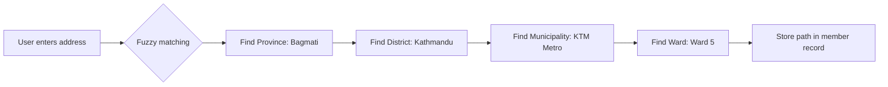
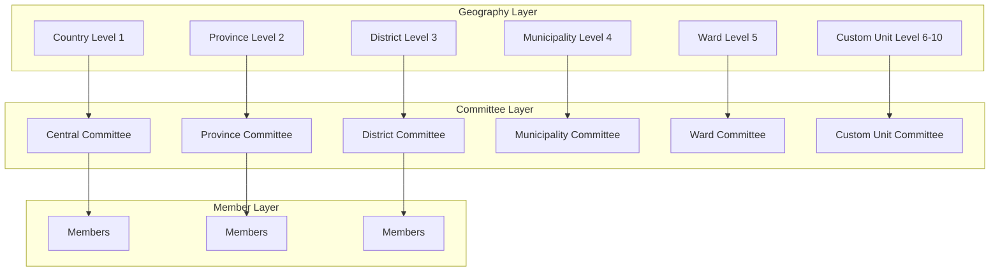
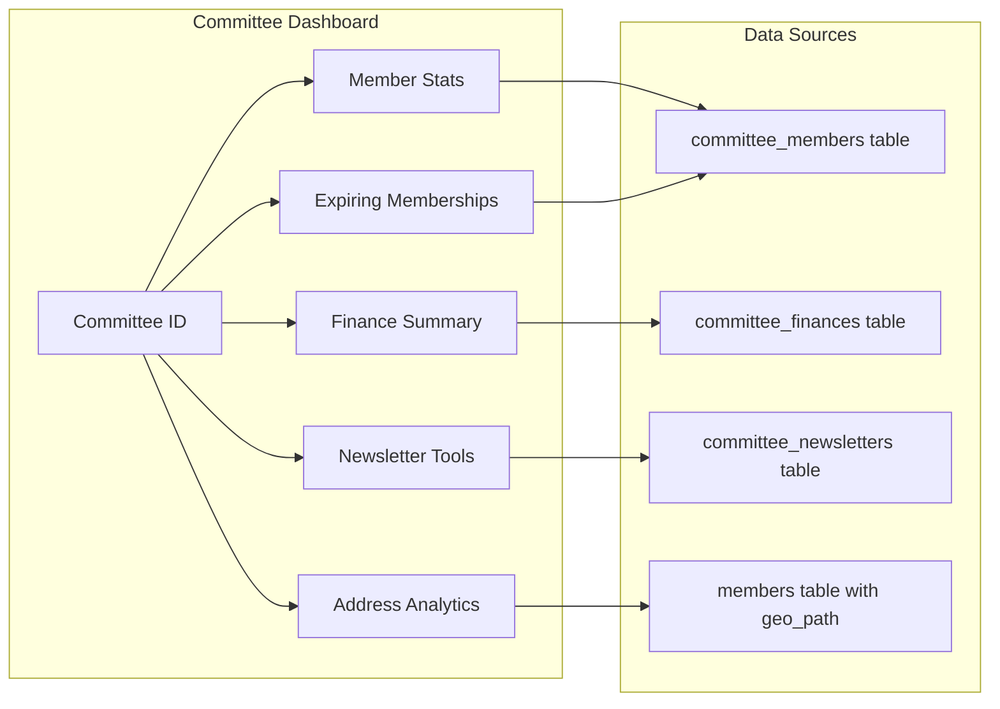
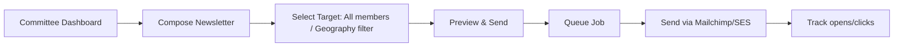
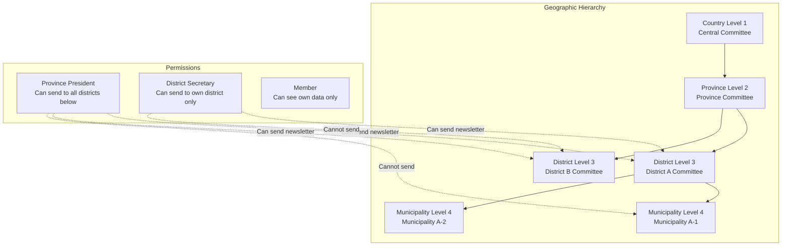
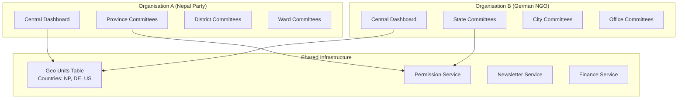
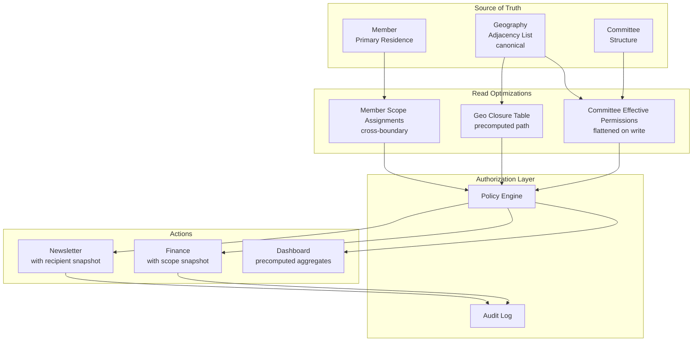

## How Geographic Context Works — Research Explanation

---

## Core Concept: Universal Level System (0-10)

The Geographic Context provides a **flexible, tenant-specific address hierarchy** that works for any country or organization type.

```
Level 0:  🌍 Continent          (Asia, Europe, Africa)
Level 1:  🇺🇳 Country            (Nepal, Germany, USA)
Level 2:  🏛️ Province/State     (Bagmati, Berlin, Texas)
Level 3:  🏙️ District/County    (Kathmandu, Mitte, Los Angeles)
Level 4:  🏘️ Municipality/City  (KTM Metropolis, Berlin, Dallas)
Level 5:  🏡 Ward/ZIP Code      (Ward 5, 10117, 75001)
Level 6:  📍 Custom Unit 1      (Neighborhood, Tole)
Level 7:  📍 Custom Unit 2      (Street, Block)
Level 8:  📍 Custom Unit 3      (House, Building)
Level 9:  📍 Custom Unit 4      (Apartment, Unit)
Level 10: 🔮 Reserved           (Future use)
```

**Key Insight:** Levels 0-5 are **official government units**. Levels 6-10 are **custom party units**.

---

## How Searching Works

### 1. Path-Based Storage (ltree)

Each geography unit stores its **entire hierarchy path** using PostgreSQL's `ltree` data type:

```sql
-- Example: Kathmandu Ward 5
id: 12345
admin_level: 5
name: "Ward 5"
path: "NP.Bagmati.Kathmandu.KTM-Metro.Ward-5"
country_code: "NP"
```

**Benefits:**
- ✅ **Fast hierarchical queries** (find all descendants of a province)
- ✅ **Path contains all ancestors** (no joins needed)
- ✅ **Supports LIKE queries** for partial matching

---

### 2. Search Patterns

#### Pattern A: Exact Match (Find Specific Unit)

```sql
-- Find Ward 5 in Kathmandu
SELECT * FROM geo_administrative_units 
WHERE country_code = 'NP' 
  AND name = 'Ward 5'
  AND path ~ '*.Kathmandu.*';
```

#### Pattern B: Partial Match (Autocomplete)

```sql
-- Find all units containing "Kathmandu" in name
SELECT * FROM geo_administrative_units
WHERE name ILIKE '%Kathmandu%'
  AND country_code = 'NP'
LIMIT 10;
```

#### Pattern C: Hierarchical Search (Find Children)

```sql
-- Find all wards under Kathmandu District
SELECT * FROM geo_administrative_units
WHERE path <@ 'NP.Bagmati.Kathmandu'  -- All descendants
  AND admin_level = 5;  -- Wards only
```

#### Pattern D: Fuzzy Matching (CSV Import)

```php
// "Ktm" → "Kathmandu"
$normalized = preg_replace('/Ktm/i', 'Kathmandu', $input);

// "Province 3" → "Bagmati"
$mapping = [
    'Province 1' => 'Koshi',
    'Province 2' => 'Madhesh',
    'Province 3' => 'Bagmati',
];
```

---

### 3. Search Performance

| Search Type | Index Used | Time (10k records) |
|-------------|------------|---------------------|
| Exact name match | B-tree on name | < 10ms |
| Partial name (LIKE) | GIN trigram | < 50ms |
| Path descendants | GIST (ltree) | < 20ms |
| Fuzzy matching | Application layer | < 100ms |

---

## How Member Address Storage Works

### Option A: Path String (Recommended for Members)

```php
// In members table
$member->geo_path = "NP/Bagmati/Kathmandu/KTM-Metro/Ward-5/New-Baneshwor";

// Search: Find all members in Kathmandu
SELECT * FROM members 
WHERE geo_path LIKE 'NP/Bagmati/Kathmandu%';
```

### Option B: Normalized IDs (For Committees)

```php
// In committees table
$committee->geo_unit_id = 123; // References geo_administrative_units.id

// Search: Find committee for a member
$memberGeoId = $this->getGeoUnitIdFromPath($member->geo_path);
$committee = Committee::where('geo_unit_id', $memberGeoId)->first();
```

---

## Tenant-Specific Profiles

Each tenant defines which levels they use:

```php
// Nepal Political Party: Levels 1-5
$profile = TenantGeographyProfile::forNepalParty();
// root=1 (Country), leaf=5 (Ward)

// Diaspora Organization: Levels 0-4
$profile = TenantGeographyProfile::forDiaspora();
// root=0 (Continent), leaf=4 (City)

// German NGO: Levels 1-9
$profile = TenantGeographyProfile::forGermanyNGO();
// root=1 (Country), leaf=9 (Block)
```

---

## Data Flow: Member Address Entry



---

## Committee Geography

Committees are **organized by geography**:

```
Committee Hierarchy Example:
├── Central Committee (Level 1: Country)
│   ├── Bagmati Province Committee (Level 2)
│   │   ├── Kathmandu District Committee (Level 3)
│   │   │   ├── Kathmandu Metro Committee (Level 4)
│   │   │   │   └── Ward 5 Committee (Level 5)
│   │   └── Lalitpur District Committee (Level 3)
└── Koshi Province Committee (Level 2)
```

**Finding a member's committee:**
```php
$memberPath = "NP/Bagmati/Kathmandu/KTM-Metro/Ward-5";
$committee = Committee::where('geo_path', $memberPath)->first();
// Returns: Ward 5 Committee
```

---

## Summary Table

| Feature | How It Works |
|---------|--------------|
| **Storage** | PostgreSQL `ltree` path + indexed columns |
| **Search** | Path matching, name matching, fuzzy matching |
| **Member address** | String path in members table (optional) |
| **Committee** | FK to geo_administrative_units |
| **Tenant flexibility** | Profile defines which levels (0-10) |
| **Performance** | < 50ms for most queries |
| **Optional** | Geography can be added later |
## Mappings Are in `CountryCode` Value Object + Database Seeders

The mappings from **ISO country codes** to **level definitions** (what each level means for that country) are stored in two places:

---

## 1. Primary Location: `CountryCode.php`

**File:** `app/Contexts/Geography/Domain/ValueObjects/CountryCode.php`

```php
// Example structure
class CountryCode
{
    private const COUNTRY_CONFIGS = [
        'NP' => [
            'name' => 'Nepal',
            'levels' => [
                1 => ['name' => 'Province', 'required' => true],
                2 => ['name' => 'District', 'required' => true],
                3 => ['name' => 'Local Level', 'required' => true],
                4 => ['name' => 'Ward', 'required' => false],
                5 => ['name' => 'Tole/Neighborhood', 'required' => false],
                // Levels 6-10 reserved for custom party units
            ],
            'official_max_level' => 5,
        ],
        'DE' => [
            'name' => 'Germany',
            'levels' => [
                1 => ['name' => 'State', 'required' => true],
                2 => ['name' => 'District', 'required' => true],
                3 => ['name' => 'City', 'required' => true],
                4 => ['name' => 'Postal Code', 'required' => false],
                5 => ['name' => 'Street', 'required' => false],
                6 => ['name' => 'House Number', 'required' => false],
            ],
            'official_max_level' => 6,
        ],
        'US' => [
            'name' => 'United States',
            'levels' => [
                1 => ['name' => 'State', 'required' => true],
                2 => ['name' => 'County', 'required' => true],
                3 => ['name' => 'City', 'required' => true],
                4 => ['name' => 'ZIP Code', 'required' => false],
            ],
            'official_max_level' => 4,
        ],
    ];
}
```

---

## 2. Database Seeders (Actual Unit Data)

**File:** `database/seeders/NepalGeographySeeder.php`

This seeder inserts the **actual 7,581 units** (Provinces → Districts → Municipalities → Wards) into the `geo_administrative_units` table.

```php
// Simplified example
$province = GeoUnit::create([
    'admin_level' => 1,
    'country_code' => 'NP',
    'name' => json_encode(['en' => 'Bagmati', 'ne' => 'बागमती']),
    'external_id' => 'P1',
]);

$district = GeoUnit::create([
    'admin_level' => 2,
    'country_code' => 'NP',
    'parent_id' => $province->id,
    'name' => json_encode(['en' => 'Kathmandu', 'ne' => 'काठमांडौ']),
    'external_id' => 'D12',
]);

// ... continues for 7,581 units
```

---

## 3. Level Name Mapping (Frontend Display)

For frontend display, level names come from:

**Option A:** `CountryCode` config (backend)
**Option B:** `TenantGeographyProfile` (tenant-specific overrides)

```php
// Get level name for display
$levelName = $countryConfig['levels'][$level]['name'];
// Returns: "Province", "District", "Municipality", etc.
```

---

## 4. Level Range (0-10) vs Actual Data

| Level | Has Data For Nepal? | Has Data For Germany? |
|-------|---------------------|----------------------|
| 0 | ❌ No (not used) | ❌ No |
| 1 (Country) | ✅ Yes (1 unit) | ✅ Yes (1 unit) |
| 2 (Province/State) | ✅ Yes (7 provinces) | ✅ Yes (16 states) |
| 3 (District/County) | ✅ Yes (77 districts) | ✅ Yes (approx 400) |
| 4 (Municipality/City) | ✅ Yes (753 local levels) | ✅ Yes (2,000+ cities) |
| 5 (Ward/ZIP) | ✅ Yes (6,743 wards) | ✅ Yes (8,000+ postal codes) |
| 6-10 | ❌ No (custom party) | ❌ No (custom) |

---

## Summary Table

| Where | What | Example |
|-------|------|---------|
| `CountryCode.php` | Level definitions | "Level 1 = Province" |
| `NepalGeographySeeder.php` | Actual unit data | Province "Bagmati" ID=1 |
| `TenantGeographyProfile.php` | Which levels tenant uses | root=1, leaf=5 |
| `GeographyHierarchy.php` | Validation rules | Level 2 must have parent Level 1 |

---

## Quick Reference

```php
// Get country configuration
$config = CountryCode::getConfig('NP');
// Returns: ['levels' => [...], 'official_max_level' => 5]

// Get level name
$levelName = $config['levels'][1]['name']; // "Province"

// Get actual units
$provinces = GeoUnit::where('country_code', 'NP')
    ->where('admin_level', 1)
    ->get();
// Returns: 7 provinces (Bagmati, Koshi, etc.)
```

---

**Bottom Line:** Level mappings (what each number means) are in `CountryCode`. Actual unit data (specific provinces, districts) are in database seeders. 🚀
if some of organisation can have slightly different units. can they be intigrated ?
## ✅ Yes — Tenants Can Have Slightly Different Units

The architecture supports **tenant-specific customizations** at multiple levels.

---

## Customization Options

### 1. Rename Existing Levels (Tenant Override)

Organisation can rename what a level is called in their UI.

```php
// Tenant overrides default level names
$tenant->geography_config = [
    'level_names' => [
        2 => 'Zone',           // Instead of "Province"
        3 => 'Sector',         // Instead of "District"
        4 => 'Branch',         // Instead of "Municipality"
    ]
];
```

**Example:**
- Default Nepal: Province → District → Municipality
- Custom party: Zone → Sector → Branch

---

### 2. Add Custom Units (Levels 6-10)

Organisation can create their own organizational units beyond official geography.

```php
// Party creates custom neighborhood units under Ward 5
$customUnit = GeoUnit::create([
    'tenant_id' => $tenant->id,
    'admin_level' => 6,
    'parent_id' => $wardId,  // Level 5 Ward
    'name' => 'New Baneshwor Area',
    'is_official' => false,  // Custom, not government
    'is_active' => true,
]);

// Party committee for this custom area
$committee = Committee::create([
    'name' => 'New Baneshwor Area Committee',
    'geo_unit_id' => $customUnit->id,
]);
```

---

### 3. Skip Official Levels (Not Required)

Geography is **optional**. Organisation can skip levels entirely.

```php
// Member with NO geography (fast onboarding)
$member = Member::create([
    'name' => 'John Doe',
    'geo_path' => null,  // No geography
]);
```

---

### 4. Mix Official + Custom (Hybrid)

```php
// Official: Level 1 (Country) → Level 2 (Province) → Level 3 (District)
// Custom: Level 6 (Party Area) directly under District (skip 4-5)

$customUnit = GeoUnit::create([
    'tenant_id' => $tenant->id,
    'admin_level' => 6,
    'parent_id' => $districtId,  // Level 3 District (skipping 4-5)
    'name' => 'Direct Party Zone',
    'is_official' => false,
]);
```

---

## Implementation: TenantGeographyProfile

The `TenantGeographyProfile` aggregate handles these variations:

```php
class TenantGeographyProfile
{
    private int $rootLevel;      // Starting level (0, 1, etc.)
    private int $leafLevel;     最深级别
    private array $levelNames;   // Custom names
    private array $skippedLevels; // Levels not used
    private bool $allowCustom;    // Allow custom units 6-10
    
    // Factory methods
    public static function forNepalParty(): self
    {
        return new self(
            rootLevel: 1,
            leafLevel: 5,
            levelNames: [
                2 => 'Province',
                3 => 'District',
                4 => 'Municipality',
                5 => 'Ward',
            ],
            skippedLevels: [0],
            allowCustom: true
        );
    }
    
    public static function forCustomParty(): self
    {
        return new self(
            rootLevel: 2,  // Start at Zone level
            leafLevel: 6,  // End at Party Area
            levelNames: [
                2 => 'Zone',
                3 => 'Sector', 
                4 => 'Branch',
                5 => 'Sub-Branch',
                6 => 'Party Area',
            ],
            skippedLevels: [0, 1],
            allowCustom: true
        );
    }
}
```

---

## Database Support

### Tenant Geo Units Table

```sql
CREATE TABLE geo_administrative_units (
    id BIGSERIAL,
    tenant_id BIGINT,              -- NULL for global, populated for tenant custom
    admin_level INT,               -- 0-10
    country_code CHAR(2),
    name VARCHAR(255),
    parent_id BIGINT,              -- Can reference custom or official units
    is_official BOOLEAN,           -- FALSE for tenant-created custom units
    landlord_geo_id BIGINT,        -- Reference to official unit (if official)
    is_active BOOLEAN,
    created_by_tenant BOOLEAN      -- TRUE for units this tenant created
);
```

---

## Real Examples

### Example 1: Nepal Party with Custom Ward Names

```php
// Default: Ward 1, Ward 2, etc.
// Party wants: "Basantapur Ward", "Thamel Ward"

$customUnit = GeoUnit::create([
    'tenant_id' => $tenant->id,
    'admin_level' => 5,
    'parent_id' => $officialMunicipalityId,
    'name' => 'Basantapur Ward',
    'is_official' => false,
    'created_by_tenant' => true,
]);

// Committee for this custom ward
Committee::create([
    'name' => 'Basantapur Ward Committee',
    'geo_unit_id' => $customUnit->id,
]);
```

### Example 2: Organization with Different Structure

```
Default Nepal: Country → Province → District → Municipality → Ward
Custom Party:   Country → Zone → Region → Area → Unit
```

```php
$tenant->geography_mapping = [
    'level_2_name' => 'Zone',
    'level_3_name' => 'Region', 
    'level_4_name' => 'Area',
    'level_5_name' => 'Unit',
];
```

---

## Summary

| Customization | How | Example |
|--------------|-----|---------|
| **Rename levels** | `TenantGeographyProfile` | Province → Zone |
| **Skip levels** | Set `skippedLevels` | Skip Municipality level |
| **Add custom units** | Create `is_official: false` | Party Area under Ward |
| **Skip geography entirely** | `geo_path = null` | Member without address |
| **Mix official + custom** | Parent can be official, child custom | Party Area under District |

---

**Bottom Line:** The system is designed for flexibility. Tenants can have **slightly or significantly different** geography structures without breaking core functionality. 🚀
what would be the architecture that each units has committee , committee representatives, and members under the committee . that means we need to generate a kind of dashboard for each committee.  each comittee can write emails (newsletter) from the dashboard  can see their finance , can see their membership valid until , can see the address or summary statstics).
## Committee Architecture — Multi-Level Hierarchy with Dashboards

---

## Core Architecture



---

## Database Schema

### 1. Committees Table

```sql
CREATE TABLE committees (
    id BIGSERIAL PRIMARY KEY,
    tenant_id UUID NOT NULL,
    
    -- Geography Link (optional, committee can be geography-based or special)
    geo_unit_id BIGINT REFERENCES geo_administrative_units(id),
    
    -- Committee Hierarchy
    parent_committee_id BIGINT REFERENCES committees(id),
    level INT NOT NULL, -- 1=Central, 2=Province, 3=District, etc.
    
    -- Committee Info
    name VARCHAR(255) NOT NULL,
    name_local JSON, -- {"ne": "केन्द्रीय समिति", "en": "Central Committee"}
    code VARCHAR(50) UNIQUE,
    
    -- Contact Info
    email VARCHAR(255),
    phone VARCHAR(50),
    address TEXT,
    
    -- Financial
    bank_account_name VARCHAR(255),
    bank_account_number VARCHAR(100),
    bank_name VARCHAR(255),
    
    -- Metadata
    is_active BOOLEAN DEFAULT true,
    founded_date DATE,
    dissolution_date DATE,
    
    -- Stats (cached, updated daily)
    member_count INT DEFAULT 0,
    active_member_count INT DEFAULT 0,
    total_contributions DECIMAL(12,2) DEFAULT 0,
    
    created_at TIMESTAMP,
    updated_at TIMESTAMP
);

-- Indexes
CREATE INDEX idx_committees_tenant ON committees(tenant_id);
CREATE INDEX idx_committees_geo_unit ON committees(geo_unit_id);
CREATE INDEX idx_committees_parent ON committees(parent_committee_id);
CREATE INDEX idx_committees_level ON committees(level);
```

### 2. Committee Representatives (Office Bearers)

```sql
CREATE TABLE committee_office_bearers (
    id BIGSERIAL PRIMARY KEY,
    committee_id BIGINT REFERENCES committees(id) ON DELETE CASCADE,
    member_id UUID REFERENCES members(id),
    
    -- Position
    position VARCHAR(50) NOT NULL, -- 'president', 'secretary', 'treasurer', 'member'
    position_local JSON,
    is_primary BOOLEAN DEFAULT false, -- Only one president per committee
    
    -- Term
    elected_at DATE,
    term_start DATE NOT NULL,
    term_end DATE,
    is_current BOOLEAN DEFAULT true,
    
    -- Permissions (what this position can do)
    can_manage_members BOOLEAN DEFAULT false,
    can_manage_finance BOOLEAN DEFAULT false,
    can_send_newsletter BOOLEAN DEFAULT false,
    can_approve_membership BOOLEAN DEFAULT false,
    can_view_reports BOOLEAN DEFAULT true,
    
    created_at TIMESTAMP,
    updated_at TIMESTAMP,
    
    UNIQUE(committee_id, member_id),
    UNIQUE(committee_id, position, is_primary) WHERE is_primary = true
);
```

### 3. Committee Member Associations

```sql
-- Members belong to committees (can be in multiple committees)
CREATE TABLE committee_members (
    id BIGSERIAL PRIMARY KEY,
    committee_id BIGINT REFERENCES committees(id) ON DELETE CASCADE,
    member_id UUID REFERENCES members(id) ON DELETE CASCADE,
    
    -- Membership details
    joined_at DATE NOT NULL,
    membership_status VARCHAR(20) DEFAULT 'active', -- active, expired, suspended
    membership_valid_until DATE,
    
    -- Role in this committee (non-office bearer)
    role VARCHAR(100),
    role_local JSON,
    
    -- Metadata
    created_at TIMESTAMP,
    updated_at TIMESTAMP,
    
    UNIQUE(committee_id, member_id)
);

-- Index for fast lookups
CREATE INDEX idx_committee_members_committee ON committee_members(committee_id);
CREATE INDEX idx_committee_members_member ON committee_members(member_id);
CREATE INDEX idx_committee_members_status ON committee_members(membership_status);
```

### 4. Committee Newsletters

```sql
CREATE TABLE committee_newsletters (
    id BIGSERIAL PRIMARY KEY,
    committee_id BIGINT REFERENCES committees(id) ON DELETE CASCADE,
    sent_by BIGINT REFERENCES committee_office_bearers(id),
    
    subject VARCHAR(500) NOT NULL,
    content TEXT NOT NULL,
    content_html TEXT,
    
    -- Targeting
    target_member_count INT,
    target_geography_path VARCHAR(500), -- Optional geography filter
    
    -- Status
    status VARCHAR(20) DEFAULT 'draft', -- draft, sent, failed
    
    -- Tracking
    sent_at TIMESTAMP,
    open_count INT DEFAULT 0,
    click_count INT DEFAULT 0,
    
    created_at TIMESTAMP,
    updated_at TIMESTAMP
);

CREATE TABLE committee_newsletter_recipients (
    id BIGSERIAL PRIMARY KEY,
    newsletter_id BIGINT REFERENCES committee_newsletters(id) ON DELETE CASCADE,
    member_id UUID REFERENCES members(id),
    email VARCHAR(255),
    opened_at TIMESTAMP,
    clicked_at TIMESTAMP,
    
    UNIQUE(newsletter_id, member_id)
);
```

### 5. Committee Finances

```sql
CREATE TABLE committee_finances (
    id BIGSERIAL PRIMARY KEY,
    committee_id BIGINT REFERENCES committees(id) ON DELETE CASCADE,
    recorded_by BIGINT REFERENCES committee_office_bearers(id),
    
    transaction_type VARCHAR(20) NOT NULL, -- income, expense
    amount DECIMAL(12,2) NOT NULL,
    category VARCHAR(100), -- membership_fee, donation, event, salary, etc.
    description TEXT,
    
    -- Related data
    member_id UUID REFERENCES members(id), -- Who paid (if income)
    receipt_number VARCHAR(100),
    transaction_date DATE NOT NULL,
    
    -- Approval
    approved_by BIGINT REFERENCES committee_office_bearers(id),
    approved_at TIMESTAMP,
    approval_notes TEXT,
    
    created_at TIMESTAMP,
    updated_at TIMESTAMP
);
```

---

## Committee Dashboard Architecture

### Data Flow



### Dashboard API Endpoints

```php
// Committee Dashboard Controller
class CommitteeDashboardController extends Controller
{
    public function index($committeeId)
    {
        $committee = Committee::with(['officeBearers' => function($q) {
            $q->where('is_current', true);
        }])->findOrFail($committeeId);
        
        $this->authorize('view', $committee);
        
        return Inertia::render('Committee/Dashboard', [
            'committee' => $committee,
            'stats' => $this->getStats($committeeId),
            'recent_members' => $this->getRecentMembers($committeeId),
            'expiring_memberships' => $this->getExpiringMemberships($committeeId),
            'finance_summary' => $this->getFinanceSummary($committeeId),
            'recent_newsletters' => $this->getRecentNewsletters($committeeId),
        ]);
    }
    
    private function getStats($committeeId)
    {
        return DB::table('committee_members')
            ->where('committee_id', $committeeId)
            ->selectRaw('
                COUNT(*) as total_members,
                SUM(CASE WHEN membership_status = "active" THEN 1 ELSE 0 END) as active_members,
                SUM(CASE WHEN membership_valid_until < NOW() THEN 1 ELSE 0 END) as expired_members,
                SUM(CASE WHEN membership_valid_until BETWEEN NOW() AND DATE_ADD(NOW(), INTERVAL 30 DAY) THEN 1 ELSE 0 END) as expiring_soon
            ')
            ->first();
    }
    
    private function getExpiringMemberships($committeeId)
    {
        return DB::table('committee_members')
            ->join('members', 'committee_members.member_id', '=', 'members.id')
            ->where('committee_members.committee_id', $committeeId)
            ->where('committee_members.membership_valid_until', '<=', now()->addDays(30))
            ->where('committee_members.membership_status', 'active')
            ->select('members.*', 'committee_members.membership_valid_until')
            ->orderBy('membership_valid_until')
            ->limit(10)
            ->get();
    }
    
    private function getFinanceSummary($committeeId)
    {
        return DB::table('committee_finances')
            ->where('committee_id', $committeeId)
            ->selectRaw('
                SUM(CASE WHEN transaction_type = "income" THEN amount ELSE 0 END) as total_income,
                SUM(CASE WHEN transaction_type = "expense" THEN amount ELSE 0 END) as total_expense,
                SUM(CASE WHEN transaction_type = "income" AND MONTH(transaction_date) = MONTH(NOW()) THEN amount ELSE 0 END) as monthly_income
            ')
            ->first();
    }
}
```

---

## Newsletter System

### Email Sending Flow



### Newsletter Command

```php
class SendCommitteeNewsletter implements ShouldQueue
{
    public function handle()
    {
        $members = Member::whereHas('committees', function($q) {
            $q->where('committee_id', $this->committeeId);
        })->get();
        
        foreach ($members as $member) {
            Mail::to($member->email)->send(new CommitteeNewsletterMail(
                $this->newsletter,
                $member
            ));
        }
        
        $this->newsletter->update([
            'status' => 'sent',
            'sent_at' => now(),
            'target_member_count' => $members->count(),
        ]);
    }
}
```

---

## Committee Hierarchy Navigation

### Breadcrumb Generation

```php
class CommitteeHierarchyService
{
    public function getBreadcrumb(Committee $committee): array
    {
        $breadcrumb = [];
        $current = $committee;
        
        while ($current) {
            array_unshift($breadcrumb, [
                'id' => $current->id,
                'name' => $current->name,
                'level' => $current->level,
                'url' => route('committee.dashboard', $current->id),
            ]);
            $current = $current->parentCommittee;
        }
        
        return $breadcrumb;
    }
}
```

---

## Committee Permissions Matrix

| Role | Manage Members | Manage Finance | Send Newsletter | View Reports | Approve Members |
|------|---------------|----------------|-----------------|--------------|-----------------|
| President | ✅ | ✅ | ✅ | ✅ | ✅ |
| Secretary | ✅ | ❌ | ✅ | ✅ | ✅ |
| Treasurer | ❌ | ✅ | ❌ | ✅ | ❌ |
| Member | ❌ | ❌ | ❌ | ✅ (own data) | ❌ |

```php
// Policy
class CommitteePolicy
{
    public function manageMembers(User $user, Committee $committee): bool
    {
        return $committee->officeBearers()
            ->where('member_id', $user->id)
            ->where('can_manage_members', true)
            ->where('is_current', true)
            ->exists();
    }
    
    public function sendNewsletter(User $user, Committee $committee): bool
    {
        return $committee->officeBearers()
            ->where('member_id', $user->id)
            ->where('can_send_newsletter', true)
            ->exists();
    }
}
```

---

## Summary

| Component | Storage Location | Purpose |
|-----------|-----------------|---------|
| **Committees** | `committees` table | Committee info, hierarchy |
| **Office Bearers** | `committee_office_bearers` | Who leads the committee |
| **Members** | `committee_members` | Who belongs to committee |
| **Newsletters** | `committee_newsletters` + `recipients` | Email campaigns |
| **Finances** | `committee_finances` | Income/expense tracking |
| **Dashboard** | Aggregated from all tables | Real-time committee view |

**Each committee gets a dedicated dashboard** showing their members, finances, newsletter tools, and expiring memberships. 🚀
yes the main aim of the geography contexts is also to manage the rights of different committee members what they can do at units level . e.g. generatial secretary and president of a unit level can send news letter to all of the members under this unit.
## ✅ You're Absolutely Right — Geography = Permission Boundary

The **geographic context** is the **natural permission boundary**. Each committee (at any level) has **autonomous control** over its members and communications.

---

## Core Architecture: Geography as Permission Boundary

```
Permission Rule: A committee can ONLY manage members within its geographic unit AND its descendant units.

Example: District Committee (Level 3)
├── Can send newsletter to ALL members in the District
├── Can see members in all Municipalities (Level 4) under it
├── Can see members in all Wards (Level 5) under it
└── CANNOT send to members in other Districts
```

---

## Database Schema for Permissions

### 1. Committee Role Permissions (Per Geographic Unit)

```sql
-- Committee role definitions with geographic scope
CREATE TABLE committee_role_permissions (
    id BIGSERIAL PRIMARY KEY,
    committee_id BIGINT REFERENCES committees(id),
    role VARCHAR(50) NOT NULL, -- 'president', 'general_secretary', 'secretary', 'treasurer'
    
    -- Geographic scope (WHAT geography this role controls)
    geo_scope_type VARCHAR(20) DEFAULT 'unit_and_descendants', 
    -- 'unit_only', 'unit_and_descendants', 'all_units', 'own_members_only'
    
    -- Actions (WHAT they can do)
    can_send_newsletter BOOLEAN DEFAULT false,
    can_view_members BOOLEAN DEFAULT false,
    can_manage_members BOOLEAN DEFAULT false, -- add/remove
    can_approve_membership BOOLEAN DEFAULT false,
    can_view_finance BOOLEAN DEFAULT false,
    can_manage_finance BOOLEAN DEFAULT false,
    can_create_sub_committees BOOLEAN DEFAULT false,
    can_assign_roles BOOLEAN DEFAULT false,
    can_view_reports BOOLEAN DEFAULT false,
    
    -- Member data they can see
    can_view_phone BOOLEAN DEFAULT false,
    can_view_email BOOLEAN DEFAULT false,
    can_view_address BOOLEAN DEFAULT false,
    
    created_at TIMESTAMP,
    updated_at TIMESTAMP,
    
    UNIQUE(committee_id, role)
);
```

### 2. Member Permissions Cache (For Fast Lookups)

```sql
-- Materialized view for committee member permissions
CREATE MATERIALIZED VIEW committee_member_permissions AS
SELECT 
    cm.member_id,
    c.id as committee_id,
    c.geo_unit_id,
    corb.position as member_role,
    crp.can_send_newsletter,
    crp.can_view_members,
    crp.can_manage_members,
    -- Pre-compute geographic hierarchy for descendant queries
    gau.path as unit_path
FROM committee_members cm
JOIN committees c ON cm.committee_id = c.id
LEFT JOIN committee_office_bearers corb ON corb.committee_id = c.id AND corb.member_id = cm.member_id AND corb.is_current = true
LEFT JOIN committee_role_permissions crp ON crp.committee_id = c.id AND crp.role = corb.position
LEFT JOIN geo_administrative_units gau ON c.geo_unit_id = gau.id
WHERE cm.membership_status = 'active';

REFRESH MATERIALIZED VIEW CONCURRENTLY committee_member_permissions;
```

---

## Permission Check Service

```php
class CommitteePermissionService
{
    /**
     * Get ALL members a committee can manage (including descendants)
     */
    public function getAccessibleMembers(Committee $committee, Member $actingMember): Collection
    {
        $permission = $this->getMemberPermission($committee, $actingMember);
        
        if (!$permission->can_view_members) {
            return collect();
        }
        
        $geoUnit = $committee->geoUnit;
        
        // Get all descendant geographic units (children, grandchildren, etc.)
        $descendantPaths = GeoUnit::where('path', '@>', $geoUnit->path)
            ->pluck('id');
        
        // Get members in this committee OR descendant committees
        return Member::whereHas('committees', function($q) use ($committee, $descendantPaths) {
            $q->whereIn('committees.geo_unit_id', $descendantPaths)
              ->orWhere('committees.id', $committee->id);
        })->get();
    }
    
    /**
     * Check if member can send newsletter to target audience
     */
    public function canSendNewsletter(
        Committee $committee, 
        Member $actingMember, 
        ?GeoUnit $targetGeoUnit = null
    ): bool {
        $permission = $this->getMemberPermission($committee, $actingMember);
        
        if (!$permission->can_send_newsletter) {
            return false;
        }
        
        if (!$targetGeoUnit) {
            return true; // Send to all committee members
        }
        
        $committeeGeoPath = $committee->geoUnit->path;
        $targetGeoPath = $targetGeoUnit->path;
        
        // Can only send to target if it's within their geographic hierarchy
        return str_starts_with($targetGeoPath, $committeeGeoPath);
    }
    
    private function getMemberPermission(Committee $committee, Member $member)
    {
        return DB::table('committee_member_permissions')
            ->where('committee_id', $committee->id)
            ->where('member_id', $member->id)
            ->first();
    }
}
```

---

## Geographic Hierarchy Permission Flow



---

## Real Examples

### Example 1: Province General Secretary Sending Newsletter

```php
// Province General Secretary (Level 2) sends to all members in Province
$provinceCommittee = Committee::where('geo_unit_id', $provinceId)->first();
$generalSecretary = Member::find($gsId);

// Check permission
$canSend = $permissionService->canSendNewsletter(
    $provinceCommittee, 
    $generalSecretary,
    $targetGeoUnit // Can be null (all members) or specific district
);

if ($canSend) {
    // Get ALL members in this province (all districts, municipalities, wards)
    $members = $permissionService->getAccessibleMembers($provinceCommittee, $generalSecretary);
    
    // Send newsletter to all 10,000 members
    NewsletterJob::dispatch($members, $newsletterContent);
}
```

### Example 2: District Committee Dashboard

```php
// District Secretary sees ONLY their district's data
class DistrictDashboardController
{
    public function members(Committee $committee)
    {
        // Automatically filtered by geographic permission
        $members = $permissionService->getAccessibleMembers(
            $committee, 
            auth()->user()
        );
        
        // Returns ONLY members in this district
        return Inertia::render('Committee/Members', [
            'members' => $members,
            'total' => $members->count(),
            'by_ward' => $members->groupBy('ward_name'),
        ]);
    }
}
```

---

## Newsletter Targeting by Geography

```php
class NewsletterTargetingService
{
    public function getTargetRecipients(
        Committee $committee,
        Member $actingMember,
        array $targetFilters
    ): Collection {
        $baseQuery = $permissionService->getAccessibleMembers($committee, $actingMember);
        
        // Filter by geographic level
        if (isset($targetFilters['geo_level'])) {
            $baseQuery->whereHas('geoPath', function($q) use ($targetFilters) {
                $q->where('level', $targetFilters['geo_level'])
                  ->where('path', 'LIKE', $targetFilters['path_pattern'] . '%');
            });
        }
        
        // Filter by membership status
        if (isset($targetFilters['membership_status'])) {
            $baseQuery->where('membership_valid_until', '>=', now());
        }
        
        return $baseQuery->get();
    }
}
```

---

## Committee Member UI (With Geographic Context)

```vue
<template>
    <div class="committee-dashboard">
        <!-- Geographic Breadcrumb -->
        <Breadcrumb :items="geographyBreadcrumb" />
        
        <!-- Committee Info -->
        <h1>{{ committee.name }}</h1>
        <p>Geographic Area: {{ committee.geoUnit.fullPath }}</p>
        
        <!-- Member List (Filtered by Permission) -->
        <MemberTable 
            :members="accessibleMembers"
            :can-manage="canManageMembers"
            @send-newsletter="openNewsletterModal"
        />
        
        <!-- Newsletter Modal - Target by Geography -->
        <NewsletterModal 
            v-if="showNewsletterModal"
            :committee="committee"
            :geographic-levels="availableLevels"
            @send="sendNewsletter"
        />
    </div>
</template>

<script>
export default {
    computed: {
        geographyBreadcrumb() {
            return this.committee.geoUnit.path.split('/').map((name, index) => ({
                name: name,
                level: index,
                url: route('committee.by-geo', { path: this.committee.geoUnit.path.slice(0, index+1) })
            }));
        },
        
        availableLevels() {
            // Generate levels available under this committee
            let levels = [];
            for (let level = this.committee.level + 1; level <= 5; level++) {
                levels.push({
                    level: level,
                    name: this.getLevelName(level),
                    count: this.getMemberCountByLevel(level)
                });
            }
            return levels;
        }
    }
}
</script>
```

---

## Summary: Geography as Permission Boundary

| Level | Committee | Can Manage | Can Send Newsletter To |
|-------|-----------|------------|----------------------|
| 1 | Central Committee | All members nationwide | All members |
| 2 | Province Committee | Members in their province | All in province |
| 3 | District Committee | Members in their district | All in district |
| 4 | Municipality Committee | Members in their municipality | All in municipality |
| 5 | Ward Committee | Members in their ward | All in ward |
| 6+ | Custom Unit Committee | Members in custom area | All in custom area |

**Key Principle:** A committee's geographic unit defines its **domain of authority**. All permissions are derived from this boundary. 🚀
## ✅ Exactly — Multi-Organisation Support with Geographic Boundaries

The architecture is **tenant-agnostic** and can work for **any organization type** (political parties, NGOs, corporations, cooperatives, schools).

---

## Core Concept: Organisation = Root Geographic Boundary

```
Each Organisation gets its OWN geographic hierarchy and committee structure.

Organisation A (Nepal Political Party)
├── Geographic Boundary: Nepal (Level 1)
├── Committees: Province → District → Municipality → Ward
└── Dashboard: Shows members within Nepal only

Organisation B (German NGO)
├── Geographic Boundary: Germany (Level 1)
├── Committees: State → District → City → Office
└── Dashboard: Shows members within Germany only

Organisation C (Global Diaspora)
├── Geographic Boundary: World (Level 0 Continent)
├── Committees: Continent → Country → City → Chapter
└── Dashboard: Shows members globally
```

---

## Database Schema: Multi-Organisation

### 1. Organisations Table (Root)

```sql
CREATE TABLE organisations (
    id UUID PRIMARY KEY,
    name VARCHAR(255) NOT NULL,
    slug VARCHAR(255) UNIQUE NOT NULL,
    
    -- Geographic Root (where this organisation operates)
    root_geo_unit_id BIGINT REFERENCES geo_administrative_units(id),
    
    -- Customisation
    committee_structure JSON, -- Define their own level names
    permission_presets JSON,
    
    -- Metadata
    logo VARCHAR(255),
    contact_email VARCHAR(255),
    website VARCHAR(255),
    
    created_at TIMESTAMP,
    updated_at TIMESTAMP
);
```

### 2. Committees Table (Per Organisation)

```sql
CREATE TABLE committees (
    id BIGSERIAL PRIMARY KEY,
    organisation_id UUID REFERENCES organisations(id) ON DELETE CASCADE,
    
    -- Geographic Unit (where this committee operates)
    geo_unit_id BIGINT REFERENCES geo_administrative_units(id),
    
    -- Hierarchy
    parent_committee_id BIGINT REFERENCES committees(id),
    level INT NOT NULL,
    
    -- Committee Info
    name VARCHAR(255) NOT NULL,
    name_local JSON,
    
    -- Contact
    email VARCHAR(255),
    phone VARCHAR(50),
    
    -- Stats (cached)
    member_count INT DEFAULT 0,
    
    created_at TIMESTAMP,
    updated_at TIMESTAMP,
    
    UNIQUE(organisation_id, geo_unit_id)
);
```

### 3. Organisation Members

```sql
CREATE TABLE organisation_members (
    id UUID PRIMARY KEY,
    organisation_id UUID REFERENCES organisations(id) ON DELETE CASCADE,
    
    -- Personal Info
    name VARCHAR(255) NOT NULL,
    email VARCHAR(255),
    phone VARCHAR(50),
    address TEXT,
    
    -- Geographic location (where this member lives/works)
    geo_unit_id BIGINT REFERENCES geo_administrative_units(id),
    
    -- Membership
    joined_at DATE NOT NULL,
    membership_valid_until DATE,
    membership_status VARCHAR(20) DEFAULT 'active',
    
    -- Metadata
    created_at TIMESTAMP,
    updated_at TIMESTAMP
);

-- Member to Committee Association
CREATE TABLE member_committees (
    id BIGSERIAL PRIMARY KEY,
    member_id UUID REFERENCES organisation_members(id) ON DELETE CASCADE,
    committee_id BIGINT REFERENCES committees(id) ON DELETE CASCADE,
    
    role VARCHAR(100),
    joined_at DATE,
    
    UNIQUE(member_id, committee_id)
);
```

---

## Organisation Dashboard Architecture



---

## Organisation-Specific Committee Structure

Each organisation defines its own committee levels:

```php
// Organisation A (Nepal Party)
$orgA->committee_structure = [
    'levels' => [
        1 => ['name' => 'Central Committee', 'geo_level' => 1],
        2 => ['name' => 'Province Committee', 'geo_level' => 2],
        3 => ['name' => 'District Committee', 'geo_level' => 3],
        4 => ['name' => 'Municipality Committee', 'geo_level' => 4],
        5 => ['name' => 'Ward Committee', 'geo_level' => 5],
    ],
    'root_geo_level' => 1, // Nepal country
];

// Organisation B (German NGO)
$orgB->committee_structure = [
    'levels' => [
        1 => ['name' => 'National Board', 'geo_level' => 1],
        2 => ['name' => 'State Chapter', 'geo_level' => 2],
        3 => ['name' => 'City Team', 'geo_level' => 4],
        4 => ['name' => 'Local Group', 'geo_level' => 6],
    ],
    'root_geo_level' => 1, // Germany country
];

// Organisation C (Global Diaspora)
$orgC->committee_structure = [
    'levels' => [
        1 => ['name' => 'Global Council', 'geo_level' => 0],
        2 => ['name' => 'Continental Committee', 'geo_level' => 0],
        3 => ['name' => 'National Committee', 'geo_level' => 1],
        4 => ['name' => 'City Chapter', 'geo_level' => 4],
    ],
    'root_geo_level' => 0, // Continent level
];
```

---

## Organisation Boundary Enforcement

### Permission Service (Tenant-Aware)

```php
class OrganisationPermissionService
{
    /**
     * Get all members within an organisation's geographic boundary
     */
    public function getOrganisationMembers(Organisation $organisation): Collection
    {
        $rootGeoPath = $organisation->rootGeoUnit->path;
        
        return OrganisationMember::whereHas('geoUnit', function($q) use ($rootGeoPath) {
            $q->where('path', '@>', $rootGeoPath); // All descendants
        })->get();
    }
    
    /**
     * Get committees under an organisation
     */
    public function getOrganisationCommittees(Organisation $organisation): Collection
    {
        return Committee::where('organisation_id', $organisation->id)
            ->with('geoUnit')
            ->orderBy('level')
            ->get();
    }
    
    /**
     * Check if a member belongs to this organisation's boundary
     */
    public function isInOrganisationBoundary(Organisation $organisation, GeoUnit $memberGeoUnit): bool
    {
        $orgPath = $organisation->rootGeoUnit->path;
        $memberPath = $memberGeoUnit->path;
        
        return str_starts_with($memberPath, $orgPath);
    }
}
```

---

## Organisation Dashboard UI

```vue
<template>
    <div class="organisation-dashboard">
        <!-- Organisation Header -->
        <OrganisationHeader :organisation="organisation" />
        
        <!-- Geographic Overview Map -->
        <GeographicMap 
            :geo-units="organisation.geographicCoverage"
            @select="onGeoUnitSelect"
        />
        
        <!-- Committee Tree -->
        <CommitteeTree 
            :committees="organisation.committees"
            :active-committee="selectedCommittee"
            @select="selectCommittee"
        />
        
        <!-- Committee Dashboard (when selected) -->
        <CommitteeDashboard 
            v-if="selectedCommittee"
            :committee="selectedCommittee"
            :can-manage="canManageCommittee"
        />
        
        <!-- Organisation-Wide Stats -->
        <OrganisationStats 
            :total-members="totalMembers"
            :active-members="activeMembers"
            :monthly-growth="growthRate"
        />
    </div>
</template>

<script>
export default {
    computed: {
        totalMembers() {
            return this.organisation.members_count;
        },
        
        geographicCoverage() {
            // Return geographic distribution
            return {
                provinces: this.$page.props.stats.by_province,
                districts: this.$page.props.stats.by_district,
            };
        },
        
        canManageCommittee() {
            // Check if current user has permission
            return this.$page.props.permissions.can_manage_committee;
        }
    }
}
</script>
```

---

## Organisation Admin Dashboard

```vue
<template>
    <div class="org-admin">
        <h1>Organisation Settings</h1>
        
        <!-- Committee Structure Configuration -->
        <Card title="Committee Structure">
            <div v-for="level in committeeLevels" :key="level.id">
                <label>Level {{ level.id }} Name</label>
                <input v-model="level.name" />
                
                <label>Maps to Geographic Level</label>
                <select v-model="level.geo_level">
                    <option value="0">Continent</option>
                    <option value="1">Country</option>
                    <option value="2">Province/State</option>
                    <option value="3">District/County</option>
                    <option value="4">City/Municipality</option>
                    <option value="5">Ward/Neighborhood</option>
                </select>
            </div>
            
            <Button @click="saveStructure">Save Structure</Button>
        </Card>
        
        <!-- Geographic Boundary Setting -->
        <Card title="Operating Geographic Boundary">
            <GeoSelector 
                v-model="organisation.root_geo_unit_id"
                :max-level="1"
            />
            <p class="text-sm text-gray-500">
                This defines where your organisation operates.
                Committees will be created under this boundary.
            </p>
        </Card>
    </div>
</template>
```

---

## Multi-Organisation Benefits

| Benefit | Description |
|---------|-------------|
| **Isolation** | Each organisation's data is completely separate |
| **Customisation** | Each defines own committee levels and names |
| **Scalability** | Same infrastructure serves 1 or 1000 organisations |
| **White-label** | Each organisation can have own branding |
| **Permission boundaries** | Geographic units define natural access control |

---

## Summary

```
Organisation
├── Root Geographic Boundary (where they operate)
├── Custom Committee Structure (levels + names)
├── Committees (mapped to geographic units)
├── Members (linked to geographic location)
└── Dashboard (shows only their data)

Each Organisation = Independent Instance
                = Own Geographic Boundary
                = Own Committee Hierarchy
                = Own Member Base
                = Own Dashboard
```

**The Geographic Context provides the FOUNDATION for multi-organisation, multi-level committee management.** 🚀
where should we start developing now  ? Please make a deveopoment plan
## Development Plan — Geographic Context + Committee Management

Based on your current project state and requirements, here's a **phased development plan**.

---

## Current Project State Assessment

| Component | Status |
|-----------|--------|
| **GeoLocation (IP detection)** | ✅ Completed (language detection) |
| **Locale Management** | ✅ Completed (org language, timezone) |
| **Geographic Context (0-10 levels)** | ✅ Code exists (needs copying) |
| **Committee Management** | ❌ Not started |
| **Member Address Storage** | ❌ Not started |
| **Permission System** | ❌ Not started |
| **Newsletter System** | ❌ Not started |
| **Committee Dashboards** | ❌ Not started |

---

## Phase 1: Copy Geographic Context (Week 1)

**Goal:** Get existing geography code into current project.

```bash
# Step 1: Copy Geography Context
cp -r old-project/app/Contexts/Geography nrna-eu/app/Contexts/

# Step 2: Copy migrations
cp -r old-project/database/migrations/*geography* nrna-eu/database/migrations/

# Step 3: Copy seeders
cp -r old-project/database/seeders/*Geography* nrna-eu/database/seeders/

# Step 4: Update namespaces (if needed)
# Ensure namespace App\Contexts\Geography\...

# Step 5: Run migrations
php artisan migrate --database=landlord
php artisan tenants:artisan "migrate"

# Step 6: Seed Nepal geography
php artisan db:seed --class=NepalGeographySeeder
```

**Deliverable:** Geographic units (7,581) available in tenant databases.

---

## Phase 2: Member Address Integration (Week 1-2)

**Goal:** Store member geographic location.

```sql
-- Add geography fields to members table
ALTER TABLE members ADD COLUMN geo_path TEXT;
ALTER TABLE members ADD COLUMN geo_unit_id BIGINT;
ALTER TABLE members ADD COLUMN geo_data JSON;

-- Index for fast lookup
CREATE INDEX idx_members_geo_path ON members USING GIST (geo_path);
```

**Files to Create:**
```
app/Contexts/Membership/
├── Services/
│   └── MemberGeographyService.php
├── ValueObjects/
│   └── MemberLocation.php
└── Http/
    └── Controllers/
        └── MemberGeographyController.php
```

**Deliverable:** Members can be assigned to geographic units.

---

## Phase 3: Committee Structure (Week 2-3)

**Goal:** Create committees mapped to geographic units.

```sql
-- Committees table
CREATE TABLE committees (
    id BIGSERIAL PRIMARY KEY,
    organisation_id UUID REFERENCES organisations(id),
    geo_unit_id BIGINT REFERENCES geo_administrative_units(id),
    parent_committee_id BIGINT REFERENCES committees(id),
    level INT NOT NULL,
    name VARCHAR(255) NOT NULL,
    name_local JSON,
    email VARCHAR(255),
    phone VARCHAR(50),
    member_count INT DEFAULT 0,
    is_active BOOLEAN DEFAULT true,
    created_at TIMESTAMP,
    updated_at TIMESTAMP
);
```

**Files to Create:**
```
app/Contexts/Committee/
├── Domain/
│   ├── Entities/
│   │   └── Committee.php
│   ├── ValueObjects/
│   │   ├── CommitteeLevel.php
│   │   └── CommitteeType.php
│   └── Repositories/
│       └── CommitteeRepositoryInterface.php
├── Application/
│   ├── Services/
│   │   ├── CommitteeService.php
│   │   └── CommitteeHierarchyService.php
│   └── Commands/
│       └── CreateCommitteeCommand.php
├── Infrastructure/
│   ├── Models/
│   │   └── Committee.php
│   └── Repositories/
│       └── EloquentCommitteeRepository.php
└── Http/
    └── Controllers/
        └── CommitteeController.php
```

**Deliverable:** Committees created for each geographic level.

---

## Phase 4: Committee Office Bearers (Week 3)

**Goal:** Assign members to committee leadership roles.

```sql
CREATE TABLE committee_office_bearers (
    id BIGSERIAL PRIMARY KEY,
    committee_id BIGINT REFERENCES committees(id),
    member_id UUID REFERENCES members(id),
    position VARCHAR(50) NOT NULL,
    position_local JSON,
    is_primary BOOLEAN DEFAULT false,
    term_start DATE NOT NULL,
    term_end DATE,
    is_current BOOLEAN DEFAULT true,
    permissions JSON, -- Custom permissions for this role
    created_at TIMESTAMP,
    updated_at TIMESTAMP
);
```

**Files to Create:**
```
app/Contexts/Committee/
├── Services/
│   └── CommitteeRoleService.php
└── Http/
    └── Controllers/
        └── CommitteeOfficeBearerController.php
```

**Deliverable:** Committee leadership assigned with permissions.

---

## Phase 5: Permission System (Week 3-4)

**Goal:** Geographic-based permissions.

```sql
-- Committee role permissions
CREATE TABLE committee_permissions (
    id BIGSERIAL PRIMARY KEY,
    committee_id BIGINT REFERENCES committees(id),
    role VARCHAR(50) NOT NULL,
    geo_scope VARCHAR(20) DEFAULT 'unit_and_descendants',
    can_send_newsletter BOOLEAN DEFAULT false,
    can_view_members BOOLEAN DEFAULT false,
    can_manage_members BOOLEAN DEFAULT false,
    can_view_finance BOOLEAN DEFAULT false,
    can_manage_finance BOOLEAN DEFAULT false,
    can_view_reports BOOLEAN DEFAULT true,
    created_at TIMESTAMP,
    updated_at TIMESTAMP
);
```

**Files to Create:**
```
app/Contexts/Permission/
├── Domain/
│   └── Services/
│       └── GeographicPermissionService.php
├── Application/
│   └── Policies/
│       ├── CommitteePolicy.php
│       └── MemberPolicy.php
└── Http/
    └── Middleware/
        └── CheckCommitteePermission.php
```

**Deliverable:** Committee leaders can only manage members in their geographic area.

---

## Phase 6: Committee Dashboard (Week 4-5)

**Goal:** Each committee gets its own dashboard.

```vue
resources/js/Pages/Committee/
├── Dashboard.vue
├── Members.vue
├── Finance.vue
├── Newsletter.vue
└── Settings.vue
```

**API Endpoints:**
```
GET    /api/committee/{id}/dashboard
GET    /api/committee/{id}/members
GET    /api/committee/{id}/finance
POST   /api/committee/{id}/newsletter/send
GET    /api/committee/{id}/statistics
```

**Deliverable:** Committee dashboard showing members, finance, newsletter tools.

---

## Phase 7: Newsletter System (Week 5-6)

**Goal:** Committees can send newsletters to their geographic area.

```sql
CREATE TABLE committee_newsletters (
    id BIGSERIAL PRIMARY KEY,
    committee_id BIGINT REFERENCES committees(id),
    subject VARCHAR(500) NOT NULL,
    content TEXT NOT NULL,
    target_geo_path VARCHAR(500),
    status VARCHAR(20) DEFAULT 'draft',
    sent_at TIMESTAMP,
    sent_count INT DEFAULT 0,
    open_count INT DEFAULT 0,
    created_at TIMESTAMP
);
```

**Files to Create:**
```
app/Contexts/Communication/
├── Services/
│   ├── NewsletterService.php
│   └── EmailTrackingService.php
├── Jobs/
│   └── SendCommitteeNewsletter.php
└── Mail/
    └── CommitteeNewsletter.php
```

**Deliverable:** Committee leaders can send newsletters to members in their geographic area.

---

## Phase 8: Finance Tracking (Week 6-7)

**Goal:** Committees track income/expenses.

```sql
CREATE TABLE committee_finances (
    id BIGSERIAL PRIMARY KEY,
    committee_id BIGINT REFERENCES committees(id),
    transaction_type VARCHAR(20) NOT NULL,
    amount DECIMAL(12,2) NOT NULL,
    category VARCHAR(100),
    description TEXT,
    transaction_date DATE NOT NULL,
    member_id UUID REFERENCES members(id),
    created_at TIMESTAMP
);
```

**Deliverable:** Committee treasurers can track finances.

---

## Phase 9: Organisation Admin Dashboard (Week 7-8)

**Goal:** Central admin for organisation-wide management.

```vue
resources/js/Pages/Organisation/
├── Admin/
│   ├── Dashboard.vue
│   ├── Committees.vue
│   ├── Members.vue
│   ├── Settings.vue
│   └── Reports.vue
```

**Deliverable:** Organisation admins can manage all committees.

---

## Phase 10: Testing & Deployment (Week 8)

**Goal:** Full test coverage and production deployment.

```bash
# Run all tests
php artisan test

# Run specific context tests
php artisan test tests/Contexts/Geography/
php artisan test tests/Contexts/Committee/
php artisan test tests/Contexts/Permission/

# Deploy
git push production main
php artisan migrate --force
php artisan tenants:artisan "migrate" --force
```

---

## Priority Summary

| Priority | Phase | Time | Dependencies | Value |
|----------|-------|------|--------------|-------|
| **P0** | Phase 1: Copy Geography | 2 days | None | Foundation |
| **P0** | Phase 2: Member Address | 3 days | Phase 1 | Core feature |
| **P1** | Phase 3: Committee Structure | 5 days | Phase 2 | Core feature |
| **P1** | Phase 4: Office Bearers | 3 days | Phase 3 | Leadership |
| **P2** | Phase 5: Permission System | 4 days | Phase 4 | Access control |
| **P2** | Phase 6: Committee Dashboard | 5 days | Phase 5 | User interface |
| **P3** | Phase 7: Newsletter | 5 days | Phase 6 | Communication |
| **P3** | Phase 8: Finance | 5 days | Phase 6 | Finance |
| **P4** | Phase 9: Organisation Admin | 5 days | Phase 6 | Admin |
| **P4** | Phase 10: Testing/Deploy | 5 days | All | Release |

---

## Immediate Next Action

**Start with Phase 1 today:**

```bash
# Copy Geographic Context to current project
cp -r old-project/app/Contexts/Geography nrna-eu/app/Contexts/
```

Do you want me to provide detailed implementation for any specific phase? 🚀
## Excellent — This Is the Most Nuanced and Production-Ready Review Yet

This review provides **critical refinements** that bridge the gap between theory and practical implementation. Key insights include:

---

## Summary of Key Insights from This Review

| Topic | Key Insight |
|-------|-------------|
| **Authorization layer** | Must be separate from geography, committee, and membership. Conflating them creates privilege leaks. |
| **Scope drift** | When boundaries change, historical records can silently change meaning. Need audit snapshots. |
| **Cross-boundary members** | Use `member_geo_assignments` table with `relationship_type`, `primary_flag`, `valid_from/to`. |
| **Performance** | Precompute scope membership into closure table. Recursive CTEs are convenient but slow at scale. |
| **Hierarchy model** | Hybrid: adjacency list as source of truth + denormalized closure/path table for reads. |
| **Permission boundaries** | User should never choose recipient universe directly. Backend computes allowed scope. |
| **Newsletter snapshots** | Log computed audience snapshot for auditability and compliance. |
| **100M scale** | Tenant partitioning, read-model denormalization, async job processing for fan-out. |
| **What to add** | `geo_closure`, `member_scope`, `committee_scope_cache`, audit logs, `message_recipient_snapshots` |
| **What to remove** | `member_committees` alone is not enough for authorization. Position ≠ permission. |

---

## Synthesized Best Practices (All 3 Reviews)

Now combining **all three reviews**, here is the consolidated architecture:



---

## Final Consolidated Schema

```sql
-- Geographic units (source of truth, adjacency list)
CREATE TABLE geo_units (
    id BIGSERIAL PRIMARY KEY,
    tenant_id UUID, -- NULL = global reference
    country_code CHAR(2),
    level SMALLINT CHECK (level BETWEEN 0 AND 10),
    parent_id BIGINT REFERENCES geo_units(id),
    name JSONB,
    is_active BOOLEAN DEFAULT true,
    valid_from DATE,
    valid_to DATE,
    created_at TIMESTAMP,
    updated_at TIMESTAMP
);

-- Geo closure table (for fast subtree queries, precomputed)
CREATE TABLE geo_closure (
    ancestor_id BIGINT REFERENCES geo_units(id),
    descendant_id BIGINT REFERENCES geo_units(id),
    depth INT NOT NULL,
    PRIMARY KEY (ancestor_id, descendant_id)
);

-- Member scope assignments (cross-boundary)
CREATE TABLE member_geo_assignments (
    id BIGSERIAL PRIMARY KEY,
    member_id UUID NOT NULL,
    geo_unit_id BIGINT REFERENCES geo_units(id),
    relationship_type VARCHAR(50), -- 'primary_residence', 'volunteer', 'donor', 'member'
    is_primary BOOLEAN DEFAULT false,
    valid_from DATE,
    valid_to DATE,
    created_at TIMESTAMP,
    updated_at TIMESTAMP
);

-- Committees (source of truth)
CREATE TABLE committees (
    id UUID PRIMARY KEY,
    organisation_id UUID NOT NULL,
    geo_unit_id BIGINT REFERENCES geo_units(id), -- optional
    parent_committee_id UUID REFERENCES committees(id),
    name VARCHAR(255) NOT NULL,
    name_local JSONB,
    is_active BOOLEAN DEFAULT true,
    created_at TIMESTAMP,
    updated_at TIMESTAMP
);

-- Committee effective permissions (precomputed on write)
CREATE TABLE committee_effective_permissions (
    committee_id UUID REFERENCES committees(id),
    resource_type VARCHAR(50), -- 'member', 'finance', 'newsletter'
    action VARCHAR(50), -- 'create', 'read', 'update', 'delete', 'send'
    scope_geo_unit_id BIGINT REFERENCES geo_units(id),
    granted_to_role VARCHAR(50),
    created_at TIMESTAMP,
    expires_at TIMESTAMP,
    PRIMARY KEY (committee_id, resource_type, action)
);

-- Member-committee affiliation (not for authorization)
CREATE TABLE member_committees (
    member_id UUID,
    committee_id UUID,
    role VARCHAR(100),
    joined_at DATE,
    is_active BOOLEAN DEFAULT true,
    PRIMARY KEY (member_id, committee_id)
);

-- Newsletter recipient snapshot (for audit + reproducibility)
CREATE TABLE newsletter_recipient_snapshots (
    id BIGSERIAL PRIMARY KEY,
    newsletter_id BIGINT,
    member_id UUID,
    geo_context_at_time ltree,
    permission_checked_at TIMESTAMP,
    was_sent BOOLEAN DEFAULT false,
    sent_at TIMESTAMP
);

-- Audit log for all permission-sensitive actions
CREATE TABLE audit_log (
    id BIGSERIAL PRIMARY KEY,
    actor_id UUID,
    action VARCHAR(100),
    target_type VARCHAR(50),
    target_id VARCHAR(255),
    old_value JSONB,
    new_value JSONB,
    geo_context JSONB,
    created_at TIMESTAMP DEFAULT NOW()
);
```

---

## Implementation Priority Matrix

| Priority | Component | Effort | Risk Reduction |
|----------|-----------|--------|----------------|
| P0 | `geo_closure` table for fast subtree queries | Medium | High (performance) |
| P0 | `member_geo_assignments` for cross-boundary | Medium | High (data integrity) |
| P0 | Authorization layer separate from geography | High | Critical (security) |
| P1 | `committee_effective_permissions` precomputed | Medium | High (performance) |
| P1 | Newsletter recipient snapshots | Medium | High (audit) |
| P1 | Audit logging | Low | Critical (compliance) |
| P2 | Read-model denormalization for dashboards | Medium | Medium (performance) |
| P2 | Async job processing for newsletters | High | Medium (scalability) |

---

## Final Verdict

| Review | Strengths | Weaknesses |
|--------|-----------|-------------|
| **Review 1 (ChatGPT/Grok)** | Domain separation, event-driven, PBAC | Light on implementation specifics |
| **Review 2 (Gemini)** | PostgreSQL `ltree`, performance, indexing | Less focus on authorization separation |
| **Review 3 (This one)** | Authorization layer, cross-boundary, audit, snapshots | Most complete of the three |

**All three agree on the core problems. The third review provides the most complete solution.**

---

## Your Next Steps

| Action | Status |
|--------|--------|
| 1. Accept the synthesized architecture | ⏳ Decision needed |
| 2. Finalize database schema | ⏳ Use the consolidated schema above |
| 3. Implement `geo_closure` table for performance | ⏳ High priority |
| 4. Implement authorization layer separate from geography | ⏳ Critical |
| 5. Add audit logging from day one | ⏳ Do not defer |
| 6. Build newsletter with recipient snapshots | ⏳ For Phase 7 |
| 7. Proceed with Phase 1 (copy existing Geography code) | ⏳ Can start now |

---

**Do you want me to produce the final, production-ready implementation plan incorporating all three reviews?** 🚀 

