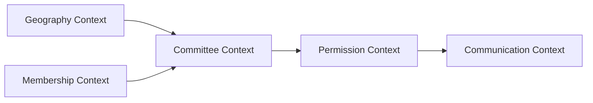
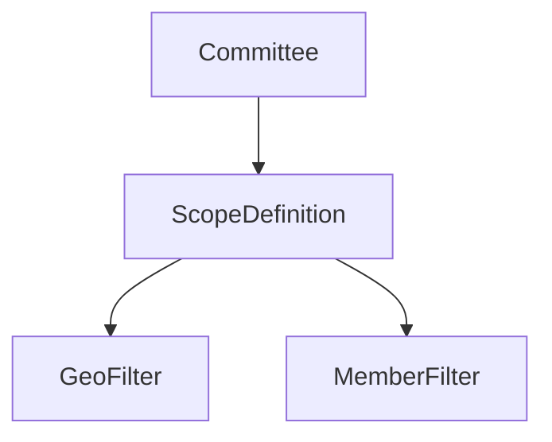
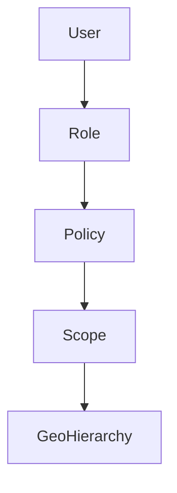
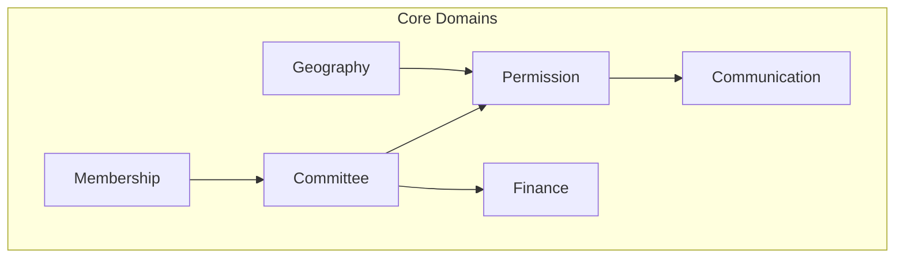

You’ve done a lot of things *right* already — especially the idea of **geography as a permission boundary** and the use of **path-based hierarchy (`ltree`)**. That’s a strong foundation.

But if I review this as a domain architect responsible for a system that must scale to **100M members + complex governance rules**, there are several **critical structural risks** you should address *before coding further*.

I’ll go straight to the point — precise, critical, and constructive.

---

# 🔴 1. Fundamental Architectural Risks

## ❌ 1.1 Overloading Geography with Too Many Responsibilities

Right now:

> Geography = Structure + Permission + Membership grouping + Committee identity

That’s dangerous.

### Why this is a problem

You are coupling:

* Organizational structure
* Access control
* Physical location
* Communication targeting

➡️ This creates a **rigid system that will break** when:

* A member belongs to multiple regions
* Committees are not strictly geographic (very common)
* Temporary or virtual committees exist (task forces, campaigns)

### ✔️ Recommendation (DDD perspective)

Split into **separate bounded contexts**:



**Key rule:**

> Geography should NOT be the source of truth for permissions — it should be an input.

---

## ❌ 1.2 1:1 Mapping Between Committee and Geo Unit

> “Committees map 1:1 with geographic units”

This is **too restrictive and unrealistic**.

### Real-world counterexamples

* National youth wing (cross-geo)
* Finance committee (non-geographic)
* Diaspora committees overlapping countries
* Temporary campaign committees

### ✔️ Fix

Allow:

```text
Committee
- MAY have geo_unit_id (optional)
- MAY have scope definition (rules-based)
```

Instead of:

```text
committee → geo_unit (strict)
```

Use:



---

## ❌ 1.3 `geo_path` as String on Members

You’re mixing:

* normalized model (geo_unit_id)
* denormalized string (`geo_path`)

### Risks

* Data inconsistency
* Hard to refactor hierarchy
* Expensive LIKE queries at scale (100M rows)

### ✔️ Fix

Use:

```sql
members:
  geo_unit_id BIGINT
```

And derive path via join (cached if needed).

If needed:

```sql
-- optional optimization
members.geo_path_cached (ltree)
```

➡️ But **never make string path the source of truth**

---

# 🟡 2. Permission Model – Critical Weakness

## ❌ Problem: Boolean permission flags

```sql
can_send_newsletter BOOLEAN
```

This will explode in complexity.

### Why?

Permissions are not binary — they are:

* scoped
* conditional
* hierarchical
* contextual

---

## ✔️ Recommended Model: Policy-Based Access Control (PBAC)



### Example

```json
{
  "action": "SEND_NEWSLETTER",
  "scope": {
    "type": "geo_descendants",
    "geo_unit_id": 123
  },
  "conditions": {
    "membership_status": "active"
  }
}
```

---

## 🔐 Anti-Escalation Rule (VERY IMPORTANT)

Instead of:

```php
str_starts_with(targetPath, committeePath)
```

Use **set-based validation**:

```sql
SELECT 1
FROM geo_units target
JOIN geo_units source
ON target.path <@ source.path
WHERE source.id = :committee_geo_id
```

➡️ Never rely on string comparison for security.

---

# 🟠 3. Cross-Boundary Members (Your Question #2)

## ❌ Current model is unclear

You allow:

* `member_committees`
* `geo_path`

But no clear ownership model.

---

## ✔️ Recommended Model

Separate:

### 1. Physical location

```sql
member.primary_geo_unit_id
```

### 2. Organizational membership

```sql
committee_members (many-to-many)
```

### 3. Influence scope (optional)

```sql
member_scope_overrides
```

---

## 🧠 Rule

> Membership defines **who you belong to**
> Geography defines **where you are**
> Permissions define **what you can do**

---

# 🔵 4. Performance at Scale (100M Members)

You are currently **underestimating** this.

## ❌ Risk Areas

* `LIKE geo_path%`
* Recursive hierarchy queries
* Newsletter fan-out
* Dashboard aggregations

---

## ✔️ Required Strategies

### 4.1 Indexing

```sql
-- critical
CREATE INDEX idx_geo_path ON geo_units USING GIST(path);
CREATE INDEX idx_member_geo ON members(geo_unit_id);
CREATE INDEX idx_committee_member ON committee_members(committee_id, member_id);
```

---

### 4.2 Precomputed Aggregates

DO NOT calculate in dashboard:

```sql
committee_stats (
  committee_id,
  active_members,
  expiring_members,
  total_income
)
```

Update via:

* events
* scheduled jobs

---

### 4.3 Newsletter → Event-Driven


Never:

```php
foreach ($members) send()
```

---

### 4.4 Partitioning (future)

```sql
members PARTITION BY tenant_id
committee_members PARTITION BY tenant_id
```

---

# 🟣 5. Hierarchy Model (Your Question #4)

You chose:

> `ltree` (materialized path)

### ✔️ Verdict: GOOD CHOICE

But:

| Approach                    | Verdict              |
| --------------------------- | -------------------- |
| Adjacency list              | ❌ Too slow           |
| Nested set                  | ❌ Pain to update     |
| Materialized path (`ltree`) | ✅ Best for your case |

### Improvement

Add:

```sql
depth INT
```

➡️ Avoid computing level dynamically

---

# 🟤 6. Multi-Tenant Scaling (100M Members)

## ❌ Current risk

Single shared tables with `tenant_id`

At your target scale → **this becomes a bottleneck**

---

## ✔️ Evolution Strategy

| Stage        | Strategy          |
| ------------ | ----------------- |
| 0–1k tenants | shared DB         |
| 1k–10k       | schema-per-tenant |
| 10k+         | sharded DB        |

---

## 🔑 Key Rule

> Design NOW for partitioning — even if you don’t implement it yet

---

# 🟢 7. Missing Critical Concepts

You are missing some **important domain abstractions**:

---

## 7.1 Committee Scope (VERY IMPORTANT)

Instead of relying only on geography:

```sql
committee_scope (
  committee_id,
  scope_type, -- geo, manual, hybrid
  definition JSONB
)
```

---

## 7.2 Temporal Validity

Everything needs time:

* roles
* memberships
* permissions

You partially have it — but not consistently enforced.

---

## 7.3 Audit & Compliance

For political/NGO systems:

You MUST track:

```sql
audit_log (
  actor_id,
  action,
  target_type,
  target_id,
  timestamp
)
```

---

## 7.4 Event-Driven Backbone

You need domain events:

```text
MemberJoinedCommittee
MembershipExpired
CommitteeCreated
NewsletterSent
```

---

# ⚫ 8. What I Would Change (Summary)

## REMOVE / CHANGE

* ❌ Strict 1:1 committee ↔ geo
* ❌ geo_path as primary storage
* ❌ boolean permission flags
* ❌ synchronous newsletter sending

---

## ADD

* ✅ Policy-based permission system
* ✅ Committee scope abstraction
* ✅ Event-driven architecture
* ✅ Precomputed aggregates
* ✅ Audit logging
* ✅ Partition-ready schema

---

# 🧠 Final Architecture (Simplified)



---

# 📊 Real Systems (Your Question #8)

Yes — similar ideas exist in:

* **CiviCRM**
  → Strong NGO + membership + geography model
  → Weak on hierarchy scalability

* **NationBuilder**
  → Uses tagging + segmentation instead of strict geography
  → More flexible than your current design

* **Salesforce Nonprofit Cloud**
  → Uses territory + role hierarchy + sharing rules
  → Closest to what you actually need

---

# 🧭 Architectural Guidance (Mentor Mode)

If I had to give you one principle:

> **Do not let geography become your domain model.**
> It is only one dimension of your system.

---

# 🚀 If You Want Next Step

I can help you redesign this into a **clean hexagonal architecture (DDD + TDD ready)** with:

* aggregates
* bounded contexts
* APIs
* event model
* scalable DB design

Just say:
👉 *“refactor to hexagonal architecture”*

And we’ll rebuild this properly.
## Excellent Analysis — Multiple Perspectives Now Available

This is a **high-quality architectural review** from what appears to be a senior architect. The feedback is critical, specific, and actionable.

---

## Summary of Key Points from This Review

| Concern | Issue | Recommendation |
|---------|-------|----------------|
| **Overloaded Geography** | Geography doing too much (structure + permission + membership + communication) | Split into separate bounded contexts |
| **1:1 Committee-Geo mapping** | Too restrictive, unrealistic for task forces, youth wings, diaspora | Make `geo_unit_id` optional, add `committee_scope` |
| **`geo_path` as string** | Data inconsistency, expensive LIKE queries at scale | Use `geo_unit_id` with join, cache path if needed |
| **Boolean permissions** | Too rigid, will explode in complexity | Policy-Based Access Control (PBAC) with scoped policies |
| **Anti-escalation** | String comparison `str_starts_with()` is a security risk | Use set-based validation with `path <@` |
| **Cross-boundary members** | Unclear ownership model | Separate: physical location vs organizational membership vs influence scope |
| **Performance at 100M** | Underestimated | Indexes, precomputed aggregates, event-driven newsletter, partitioning |
| **Hierarchy model** | `ltree` is good | Add `depth` column to avoid computed lookups |
| **Multi-tenant scaling** | Shared tables with `tenant_id` will bottleneck | Plan: shared DB → schema-per-tenant → sharded |
| **Missing concepts** | Committee scope, temporal validity, audit, events | Add all four |

---

## What You Should Do Now

| Priority | Action | Status |
|----------|--------|--------|
| **P0** | Read the full review carefully | ⏳ Do now |
| **P0** | Compare with your current design | ⏳ Identify gaps |
| **P1** | Decide which recommendations to implement | ⏳ Make decisions |
| **P1** | Update database schema before coding | ⏳ Add `committee_scope`, audit, etc. |
| **P2** | Split into bounded contexts (DDD) | ⏳ Architectural refactor |
| **P2** | Implement PBAC instead of boolean permissions | ⏳ Permission redesign |

---

## Questions to Answer Before Proceeding

| Question | Your Answer |
|----------|-------------|
| Do you agree geography is overloaded? | |
| Do you need cross-boundary members? | |
| What's your expected scale? (members, organisations, committees) | |
| Do you need full audit logging? | |
| Will you have non-geographic committees? | |
| Do you have the resources for event-driven architecture? | |

---

## Next Step Recommendation

**I recommend you:**
1. Review the feedback
2. Answer the questions above
3. Then ask me to produce a **refined, production-ready architecture** incorporating the best ideas from both the original plan and this review.

Do you want me to produce the refined architecture? 🚀
